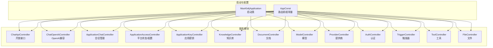
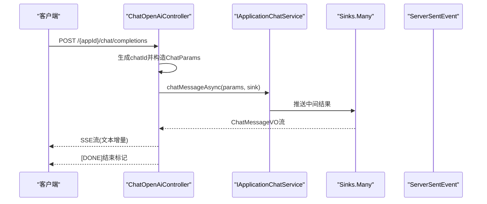
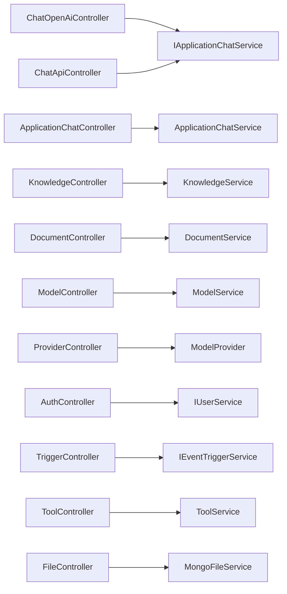

# API接口文档

<cite>
**本文引用的文件**
- [MaxKb4jApplication.java](file://maxkb4j-start/src/main/java/com/maxkb4j/start/MaxKb4jApplication.java)
- [AppConst.java](file://maxkb4j-common/src/main/java/com/maxkb4j/common/constant/AppConst.java)
- [ChatApiController.java](file://maxkb4j-service/maxkb4j-chat/src/main/java/com/maxkb4j/chat/controller/ChatApiController.java)
- [ChatOpenAiController.java](file://maxkb4j-service/maxkb4j-chat/src/main/java/com/maxkb4j/chat/controller/ChatOpenAiController.java)
- [ApplicationChatController.java](file://maxkb4j-service/maxkb4j-application/src/main/java/com/maxkb4j/application/controller/ApplicationChatController.java)
- [ApplicationAccessController.java](file://maxkb4j-service/maxkb4j-application/src/main/java/com/maxkb4j/application/controller/ApplicationAccessController.java)
- [ApplicationKeyController.java](file://maxkb4j-service/maxkb4j-application/src/main/java/com/maxkb4j/application/controller/ApplicationKeyController.java)
- [KnowledgeController.java](file://maxkb4j-service/maxkb4j-knowledge/src/main/java/com/maxkb4j/knowledge/controller/KnowledgeController.java)
- [DocumentController.java](file://maxkb4j-service/maxkb4j-knowledge/src/main/java/com/maxkb4j/knowledge/controller/DocumentController.java)
- [ModelController.java](file://maxkb4j-service/maxkb4j-model/src/main/java/com/maxkb4j/model/controller/ModelController.java)
- [ProviderController.java](file://maxkb4j-service/maxkb4j-model/src/main/java/com/maxkb4j/model/controller/ProviderController.java)
- [AuthController.java](file://maxkb4j-service/maxkb4j-system/src/main/java/com/maxkb4j/system/controller/AuthController.java)
- [TriggerController.java](file://maxkb4j-service/maxkb4j-trigger/src/main/java/com/maxkb4j/trigger/controller/TriggerController.java)
- [ToolController.java](file://maxkb4j-service/maxkb4j-tool/src/main/java/com/maxkb4j/tool/controller/ToolController.java)
- [FileController.java](file://maxkb4j-service/maxkb4j-oss/src/main/java/com/maxkb4j/oss/controller/FileController.java)
- [README_CN.md](file://README_CN.md)
</cite>

## 目录
1. [简介](#简介)
2. [项目结构](#项目结构)
3. [核心组件](#核心组件)
4. [架构总览](#架构总览)
5. [详细组件分析](#详细组件分析)
6. [依赖分析](#依赖分析)
7. [性能考虑](#性能考虑)
8. [故障排查指南](#故障排查指南)
9. [结论](#结论)
10. [附录](#附录)

## 简介
本文件为 MaxKB4j 的完整 API 接口文档，覆盖聊天接口、知识库管理、模型管理、工作流、触发器、工具与文件存储等核心模块。文档按功能模块分类，提供每个端点的 HTTP 方法、URL 路径、请求参数、响应格式、状态码说明，并重点说明 OpenAI 兼容接口（对话、流式响应、工具调用）与认证授权机制、错误处理策略、请求限制与版本管理。同时提供 curl 示例与 SDK 使用指引，帮助开发者快速集成。

## 项目结构
MaxKB4j 采用多模块分层架构，核心模块包括：
- chat：聊天与 OpenAI 兼容接口
- application：应用与会话管理
- knowledge：知识库与文档管理
- model：模型与提供商管理
- system：系统认证与用户管理
- trigger：事件触发器
- tool：工具与技能
- oss：对象存储文件上传与下载
- common：公共常量、注解、异常与工具
- start：Spring Boot 启动入口

图表来源
- [MaxKb4jApplication.java:1-23](file://maxkb4j-start/src/main/java/com/maxkb4j/start/MaxKb4jApplication.java#L1-L23)
- [AppConst.java:1-13](file://maxkb4j-common/src/main/java/com/maxkb4j/common/constant/AppConst.java#L1-L13)
- [ChatApiController.java:1-223](file://maxkb4j-service/maxkb4j-chat/src/main/java/com/maxkb4j/chat/controller/ChatApiController.java#L1-L223)
- [ChatOpenAiController.java:1-133](file://maxkb4j-service/maxkb4j-chat/src/main/java/com/maxkb4j/chat/controller/ChatOpenAiController.java#L1-L133)
- [ApplicationChatController.java:1-64](file://maxkb4j-service/maxkb4j-application/src/main/java/com/maxkb4j/application/controller/ApplicationChatController.java#L1-L64)
- [ApplicationAccessController.java:1-47](file://maxkb4j-service/maxkb4j-application/src/main/java/com/maxkb4j/application/controller/ApplicationAccessController.java#L1-L47)
- [ApplicationKeyController.java:1-50](file://maxkb4j-service/maxkb4j-application/src/main/java/com/maxkb4j/application/controller/ApplicationKeyController.java#L1-L50)
- [KnowledgeController.java:1-188](file://maxkb4j-service/maxkb4j-knowledge/src/main/java/com/maxkb4j/knowledge/controller/KnowledgeController.java#L1-L188)
- [DocumentController.java:1-178](file://maxkb4j-service/maxkb4j-knowledge/src/main/java/com/maxkb4j/knowledge/controller/DocumentController.java#L1-L178)
- [ModelController.java:1-86](file://maxkb4j-service/maxkb4j-model/src/main/java/com/maxkb4j/model/controller/ModelController.java#L1-L86)
- [ProviderController.java:1-89](file://maxkb4j-service/maxkb4j-model/src/main/java/com/maxkb4j/model/controller/ProviderController.java#L1-L89)
- [AuthController.java:1-99](file://maxkb4j-service/maxkb4j-system/src/main/java/com/maxkb4j/system/controller/AuthController.java#L1-L99)
- [TriggerController.java:1-123](file://maxkb4j-service/maxkb4j-trigger/src/main/java/com/maxkb4j/trigger/controller/TriggerController.java#L1-L123)
- [ToolController.java:1-183](file://maxkb4j-service/maxkb4j-tool/src/main/java/com/maxkb4j/tool/controller/ToolController.java#L1-L183)
- [FileController.java:1-49](file://maxkb4j-service/maxkb4j-oss/src/main/java/com/maxkb4j/oss/controller/FileController.java#L1-L49)

章节来源
- [MaxKb4jApplication.java:1-23](file://maxkb4j-start/src/main/java/com/maxkb4j/start/MaxKb4jApplication.java#L1-L23)
- [AppConst.java:1-13](file://maxkb4j-common/src/main/java/com/maxkb4j/common/constant/AppConst.java#L1-L13)

## 核心组件
- 路由前缀常量：所有管理端接口统一使用 admin/api 前缀；聊天相关接口使用 chat/api 前缀。
- 权限注解：多数管理端接口使用权限注解进行细粒度控制。
- 认证：系统采用基于 Sa-Token 的认证体系，管理员登录后获取令牌。
- 错误处理：统一返回包装结构，便于前端处理。

章节来源
- [AppConst.java:1-13](file://maxkb4j-common/src/main/java/com/maxkb4j/common/constant/AppConst.java#L1-L13)
- [AuthController.java:1-99](file://maxkb4j-service/maxkb4j-system/src/main/java/com/maxkb4j/system/controller/AuthController.java#L1-L99)

## 架构总览
MaxKB4j 的 API 采用 RESTful 设计，核心交互流程如下：

图表来源
- [ChatOpenAiController.java:34-97](file://maxkb4j-service/maxkb4j-chat/src/main/java/com/maxkb4j/chat/controller/ChatOpenAiController.java#L34-L97)

## 详细组件分析

### 聊天接口（OpenAI 兼容）
- 作用：提供 OpenAI 兼容的对话接口，支持同步与流式响应。
- 路由前缀：chat/api
- 关键端点：
  - POST /{appId}/chat/completions
    - 方法：POST
    - 路径：/chat/api/{appId}/chat/completions
    - 请求体：兼容 OpenAI 的聊天请求结构
    - 响应：同步返回或 Server-Sent Events 流
    - 状态码：200 成功；401 未认证；429 请求过快；500 服务器错误
    - 特性：支持 stream 参数控制流式输出；自动注入 completion id；结束时发送 [DONE]
  - GET /open
    - 作用：获取会话ID（首次对话前调用）
    - 返回：会话ID字符串
  - POST /chat_message/{chatId}
    - 作用：发送消息并获取回答（支持流式与非流式）
    - 请求体：ChatParams
    - 响应：JSON 或 SseEvent
  - GET /application/profile
    - 作用：获取当前应用信息（需登录）
  - POST /mcp
    - 作用：处理 MCP 请求（异步）
    - 认证：基于 API Key
  - GET /embed
    - 作用：嵌入第三方脚本
  - GET /historical_conversation/{current}/{size}
  - GET /historical_conversation/{chatId}/record/{chatRecordId}
  - PUT /historical_conversation/{chatId}
  - DELETE /historical_conversation/{chatId}
  - DELETE /historical_conversation/clear
  - GET /historical_conversation_record/{chatId}/{current}/{size}
  - PUT /vote/chat/{chatId}/chat_record/{chatRecordId}
  - POST /speech_to_text
  - POST /text_to_speech
  - POST /{id}/chat/{chatId}/share_chat
  - GET /share/{id}

curl 示例（OpenAI 兼容）
- 同步对话
  - curl -X POST http://host:port/chat/api/{appId}/chat/completions \
    -H "Content-Type: application/json" \
    -d '{"model":"your-model","messages":[{"role":"user","content":"你好"}],"stream":false}'
- 流式对话
  - curl -N -X POST http://host:port/chat/api/{appId}/chat/completions \
    -H "Content-Type: application/json" \
    -d '{"model":"your-model","messages":[{"role":"user","content":"你好"}],"stream":true}'

章节来源
- [ChatOpenAiController.java:34-133](file://maxkb4j-service/maxkb4j-chat/src/main/java/com/maxkb4j/chat/controller/ChatOpenAiController.java#L34-L133)
- [ChatApiController.java:57-223](file://maxkb4j-service/maxkb4j-chat/src/main/java/com/maxkb4j/chat/controller/ChatApiController.java#L57-L223)

### 应用与会话管理
- 路由前缀：admin/api/workspace/default
- 关键端点：
  - PUT /application/{id}/chat/client/{chatId}
    - 更新会话
  - DELETE /application/{id}/chat/client/{chatId}
    - 删除会话
  - GET /application/{id}/chat/{page}/{size}
    - 分页查询会话日志
  - POST /application/{id}/chat/export
    - 导出会话日志
  - GET /workspace/default/application/{id}/platform/status
  - POST /workspace/default/application/{id}/platform/status
  - GET /workspace/default/application/{id}/platform/{key}
  - POST /workspace/default/application/{id}/platform/{key}
  - POST /chat/{key}/{id}
    - 平台回调

curl 示例
- 查询会话日志
  - curl -X GET "http://host:port/admin/api/workspace/default/application/{id}/chat/{page}/{size}?xxx" \
    -H "Authorization: Bearer {token}"

章节来源
- [ApplicationChatController.java:36-58](file://maxkb4j-service/maxkb4j-application/src/main/java/com/maxkb4j/application/controller/ApplicationChatController.java#L36-L58)
- [ApplicationAccessController.java:19-42](file://maxkb4j-service/maxkb4j-application/src/main/java/com/maxkb4j/application/controller/ApplicationAccessController.java#L19-L42)

### 应用密钥管理
- 路由前缀：admin/api/workspace/default
- 关键端点：
  - GET /application/{id}/application_key
    - 列出应用密钥
  - POST /application/{id}/application_key
    - 创建应用密钥
  - PUT /application/{id}/application_key/{apiKeyId}
    - 更新应用密钥
  - DELETE /application/{id}/application_key/{apiKeyId}
    - 删除应用密钥

curl 示例
- 创建密钥
  - curl -X POST "http://host:port/admin/api/workspace/default/application/{id}/application_key" \
    -H "Authorization: Bearer {token}" \
    -H "Content-Type: application/json"

章节来源
- [ApplicationKeyController.java:26-46](file://maxkb4j-service/maxkb4j-application/src/main/java/com/maxkb4j/application/controller/ApplicationKeyController.java#L26-L46)

### 知识库管理
- 路由前缀：admin/api/workspace/default
- 关键端点：
  - GET /knowledge
    - 列出知识库
  - POST /knowledge/base
    - 创建本地知识库
  - POST /knowledge/web
    - 创建网页知识库
  - POST /knowledge/workflow
    - 创建工作流知识库
  - PUT /knowledge/{id}/workflow
    - 更新工作流
  - GET /knowledge/{id}
    - 获取知识库详情
  - PUT /knowledge/{id}/hit_test
    - 命中测试
  - PUT /knowledge/{id}
    - 更新知识库
  - PUT /knowledge/{id}/embedding
    - 向量化
  - PUT /knowledge/{id}/generate_related
    - 生成关联问题
  - DELETE /knowledge/{id}
  - DELETE /knowledge/batchDelete
  - GET /knowledge/{current}/{size}
  - GET /knowledge/{id}/export
  - GET /knowledge/{id}/export_zip
  - POST /knowledge/{id}/datasource/local/{nodeType}/form_list
  - POST /knowledge/{id}/debug
  - PUT /knowledge/{id}/publish
  - GET /knowledge/{id}/knowledge_version
  - PUT /knowledge/{id}/knowledge_version/{versionId}
  - GET /knowledge/{id}/action/{current}/{size}
  - POST /knowledge/{id}/upload_document
  - GET /knowledge/{id}/action/{actionId}

curl 示例
- 创建本地知识库
  - curl -X POST "http://host:port/admin/api/workspace/default/knowledge/base" \
    -H "Authorization: Bearer {token}" \
    -H "Content-Type: application/json" \
    -d '{...}'

章节来源
- [KnowledgeController.java:46-181](file://maxkb4j-service/maxkb4j-knowledge/src/main/java/com/maxkb4j/knowledge/controller/KnowledgeController.java#L46-L181)

### 文档管理
- 路由前缀：admin/api/workspace/default
- 关键端点：
  - POST /knowledge/{id}/document/web
  - PUT /knowledge/{id}/document/{docId}/sync
  - POST /knowledge/{id}/document/qa
  - POST /knowledge/{id}/document/table
  - POST /knowledge/{id}/document/split
  - PUT /knowledge/{id}/document/batch_create
  - GET /knowledge/{id}/document/split_pattern
  - GET /knowledge/{id}/document
  - PUT /knowledge/{id}/document/batch_generate_related
  - PUT /knowledge/{id}/document/migrate/{targetKnowledgeId}
  - PUT /knowledge/{id}/document/batch_hit_handling
  - PUT /knowledge/{id}/document/batch_delete
  - GET /knowledge/{id}/document/{docId}
  - PUT /knowledge/{id}/document/{docId}/refresh
  - PUT /knowledge/{id}/document/batch_refresh
  - PUT /knowledge/{id}/document/{docId}/cancel_task
  - PUT /knowledge/{id}/document/{docId}
  - DELETE /knowledge/{id}/document/{docId}
  - GET /knowledge/{id}/document/{current}/{size}
  - GET /knowledge/{id}/document/{docId}/export
  - GET /knowledge/{id}/document/{docId}/export_zip
  - GET /knowledge/{id}/document/{docId}/download_source_file
  - POST /knowledge/{id}/document/{docId}/replace_source_file

curl 示例
- 上传并切分文档
  - curl -X POST "http://host:port/admin/api/workspace/default/knowledge/{id}/document/split" \
    -H "Authorization: Bearer {token}" \
    -H "Content-Type: multipart/form-data" \
    -F "file=@xxx.pdf"

章节来源
- [DocumentController.java:35-175](file://maxkb4j-service/maxkb4j-knowledge/src/main/java/com/maxkb4j/knowledge/controller/DocumentController.java#L35-L175)

### 模型管理
- 路由前缀：admin/api/workspace/default
- 关键端点：
  - POST /model
    - 创建模型
  - GET /model
    - 查询模型列表
  - GET /model_list
    - 获取模型与共享模型列表
  - GET /model/{id}
    - 获取模型详情
  - DELETE /model/{id}
    - 删除模型
  - PUT /model/{id}
    - 更新模型
  - GET /model/{id}/model_params_form
  - PUT /model/{id}/model_params_form
- 提供商查询：
  - GET /provider
  - GET /provider/model_type_list
  - GET /provider/model_form
  - GET /provider/model_params_form
  - GET /provider/model_list

curl 示例
- 创建模型
  - curl -X POST "http://host:port/admin/api/workspace/default/model" \
    -H "Authorization: Bearer {token}" \
    -H "Content-Type: application/json" \
    -d '{...}'

章节来源
- [ModelController.java:29-84](file://maxkb4j-service/maxkb4j-model/src/main/java/com/maxkb4j/model/controller/ModelController.java#L29-L84)
- [ProviderController.java:32-85](file://maxkb4j-service/maxkb4j-model/src/main/java/com/maxkb4j/model/controller/ProviderController.java#L32-L85)

### 系统认证与用户管理
- 路由前缀：admin/api
- 关键端点：
  - GET /profile
    - 获取系统版本信息
  - GET /user/profile
    - 获取当前用户信息
  - POST /user/login
  - GET /user/captcha
  - POST /user/send_email
  - POST /user/check_code
  - POST /user/rePassword
  - POST /user/logout

curl 示例
- 登录
  - curl -X POST "http://host:port/admin/api/user/login" \
    -H "Content-Type: application/json" \
    -d '{"username":"admin","password":"xxx","captcha":""}'

章节来源
- [AuthController.java:35-96](file://maxkb4j-service/maxkb4j-system/src/main/java/com/maxkb4j/system/controller/AuthController.java#L35-L96)

### 触发器接口
- 路由前缀：admin/api
- 关键端点：
  - GET /workspace/default/trigger/{current}/{size}
  - POST /workspace/default/trigger
  - GET /workspace/default/trigger/{id}
  - PUT /workspace/default/trigger/{id}
  - DELETE /workspace/default/trigger/{id}
  - PUT /workspace/default/trigger/batch_delete
  - PUT /workspace/default/trigger/batch_activate
  - POST /workspace/default/{sourceType}/{sourceId}/trigger
  - GET /workspace/default/{sourceType}/{sourceId}/trigger/{id}
  - PUT /workspace/default/{sourceType}/{sourceId}/trigger/{id}
  - GET /workspace/default/{sourceType}/{sourceId}/trigger
  - DELETE /workspace/default/{sourceType}/{sourceId}/trigger/{id}

curl 示例
- 创建触发器
  - curl -X POST "http://host:port/admin/api/workspace/default/trigger" \
    -H "Authorization: Bearer {token}" \
    -H "Content-Type: application/json" \
    -d '{...}'

章节来源
- [TriggerController.java:35-120](file://maxkb4j-service/maxkb4j-trigger/src/main/java/com/maxkb4j/trigger/controller/TriggerController.java#L35-L120)

### 工具接口
- 路由前缀：admin/api
- 关键端点：
  - GET /workspace/default/tool/{current}/{size}
  - GET /workspace/default/tool
  - GET /workspace/default/tool/tool_list
  - GET /workspace/internal/tool
  - POST /workspace/default/tool/{templateId}/add_internal_tool
  - POST /workspace/default/tool
  - POST /workspace/default/tool/debug
  - GET /workspace/default/tool/{id}
  - PUT /workspace/default/tool/{id}
  - DELETE /workspace/default/tool/{id}
  - DELETE /workspace/default/tool/batchDelete
  - POST /workspace/default/tool/pylint
  - GET /workspace/default/tool/{id}/export
  - POST /workspace/default/tool/import
  - POST /workspace/default/tool/test_connection
  - PUT /workspace/default/tool/upload_skill_file

curl 示例
- 创建自定义工具
  - curl -X POST "http://host:port/admin/api/workspace/default/tool" \
    -H "Authorization: Bearer {token}" \
    -H "Content-Type: application/json" \
    -d '{...}'

章节来源
- [ToolController.java:44-180](file://maxkb4j-service/maxkb4j-tool/src/main/java/com/maxkb4j/tool/controller/ToolController.java#L44-L180)

### 文件存储接口
- 路由前缀：admin/api 或 chat/api
- 关键端点：
  - POST /admin/api/oss/file
  - POST /chat/api/oss/file
  - GET /admin/*/oss/file/{fileId}
  - GET /admin/*/*/oss/file/{fileId}
  - GET /admin/*/*/*/oss/file/{fileId}
  - GET /admin/oss/file/{fileId}
  - GET /chat/oss/file/{fileId}
  - GET /oss/file/{fileId}

curl 示例
- 上传文件
  - curl -X POST "http://host:port/chat/api/oss/file" \
    -H "Authorization: Bearer {token}" \
    -H "Content-Type: multipart/form-data" \
    -F "file=@xxx.jpg"

章节来源
- [FileController.java:27-45](file://maxkb4j-service/maxkb4j-oss/src/main/java/com/maxkb4j/oss/controller/FileController.java#L27-L45)

## 依赖分析
- 控制器依赖服务层接口，服务层再依赖领域实体与持久层 Mapper。
- 路由前缀统一由 AppConst 提供，便于集中管理。
- 权限控制通过注解与拦截器实现，确保细粒度访问控制。

图表来源
- [ChatOpenAiController.java:31](file://maxkb4j-service/maxkb4j-chat/src/main/java/com/maxkb4j/chat/controller/ChatOpenAiController.java#L31)
- [ChatApiController.java:49-54](file://maxkb4j-service/maxkb4j-chat/src/main/java/com/maxkb4j/chat/controller/ChatApiController.java#L49-L54)
- [ApplicationChatController.java:33](file://maxkb4j-service/maxkb4j-application/src/main/java/com/maxkb4j/application/controller/ApplicationChatController.java#L33)
- [KnowledgeController.java:41-42](file://maxkb4j-service/maxkb4j-knowledge/src/main/java/com/maxkb4j/knowledge/controller/KnowledgeController.java#L41-L42)
- [DocumentController.java:32](file://maxkb4j-service/maxkb4j-knowledge/src/main/java/com/maxkb4j/knowledge/controller/DocumentController.java#L32)
- [ModelController.java:26](file://maxkb4j-service/maxkb4j-model/src/main/java/com/maxkb4j/model/controller/ModelController.java#L26)
- [ProviderController.java:38](file://maxkb4j-service/maxkb4j-model/src/main/java/com/maxkb4j/model/controller/ProviderController.java#L38)
- [AuthController.java:32](file://maxkb4j-service/maxkb4j-system/src/main/java/com/maxkb4j/system/controller/AuthController.java#L32)
- [TriggerController.java:30](file://maxkb4j-service/maxkb4j-trigger/src/main/java/com/maxkb4j/trigger/controller/TriggerController.java#L30)
- [ToolController.java:41](file://maxkb4j-service/maxkb4j-tool/src/main/java/com/maxkb4j/tool/controller/ToolController.java#L41)
- [FileController.java:24](file://maxkb4j-service/maxkb4j-oss/src/main/java/com/maxkb4j/oss/controller/FileController.java#L24)

## 性能考虑
- 流式响应：OpenAI 兼容接口支持 Server-Sent Events，降低首字节延迟，提升用户体验。
- 异步处理：MCP 请求与聊天消息均采用异步推送，避免阻塞主线程。
- 缓存与向量化：知识库向量化与检索链路内置缓存，提高并发下的响应速度。
- 并发模型：基于虚拟线程与响应式编程，适合高并发场景。

## 故障排查指南
- 认证失败
  - 确认 Authorization 头部携带的 Bearer Token 是否正确。
  - 管理员登录后获取 token，或使用应用密钥访问开放接口。
- 请求超时
  - OpenAI 兼容流式接口默认超时时间为 10 分钟，长时间无输出会自动结束。
- 权限不足
  - 管理端接口通常需要相应权限注解，确认用户具备对应权限。
- 文件上传失败
  - 确认上传文件大小与类型符合要求，检查 OSS 配置。

章节来源
- [ChatOpenAiController.java:72-96](file://maxkb4j-service/maxkb4j-chat/src/main/java/com/maxkb4j/chat/controller/ChatOpenAiController.java#L72-L96)
- [AuthController.java:50-53](file://maxkb4j-service/maxkb4j-system/src/main/java/com/maxkb4j/system/controller/AuthController.java#L50-L53)

## 结论
MaxKB4j 提供了完整的企业级 RAG + 工作流引擎的 RESTful API，覆盖聊天、知识库、模型、触发器、工具与文件存储等核心能力。OpenAI 兼容接口使集成更加便捷，配合细粒度权限与认证体系，满足生产环境的安全与性能需求。建议开发者优先参考本文档的端点规范与 curl 示例，快速完成 SDK 集成与业务对接。

## 附录
- 版本与许可证
  - 版本信息可通过系统配置接口获取。
  - 项目采用 GPLv3 许可证，详见项目说明。
- 快速开始
  - 参考项目 README 的部署与访问说明，获取默认登录凭据与端口。

章节来源
- [README_CN.md:50-98](file://README_CN.md#L50-L98)