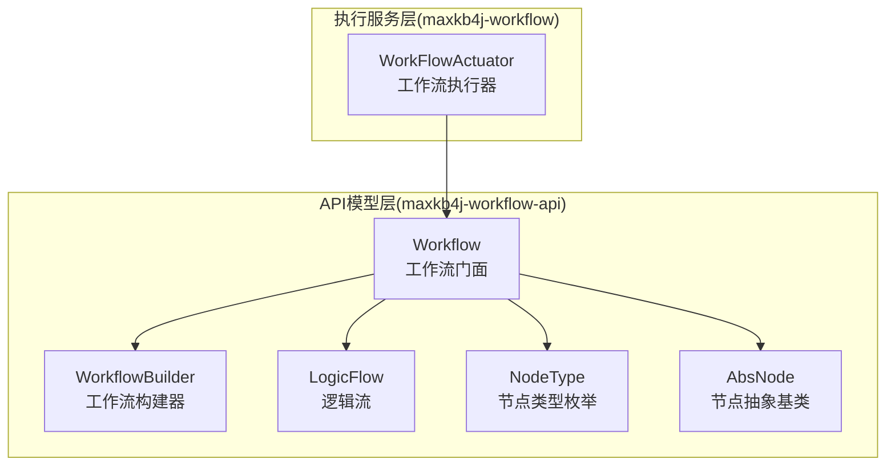
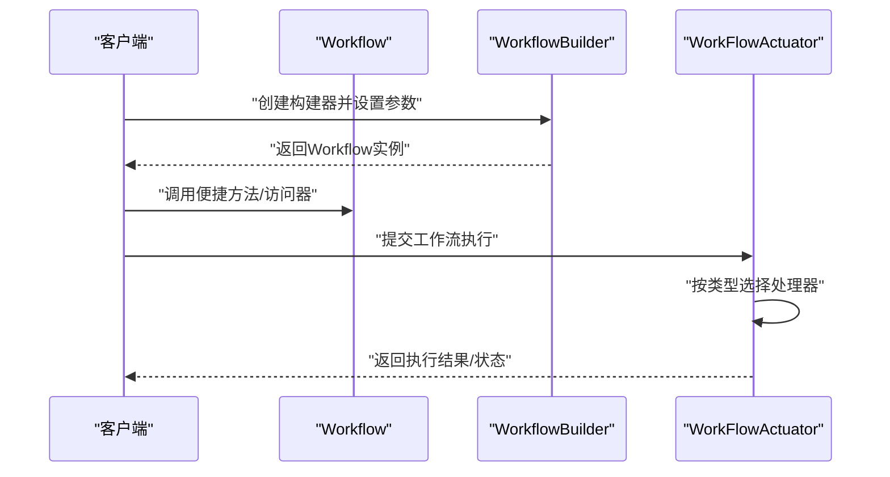
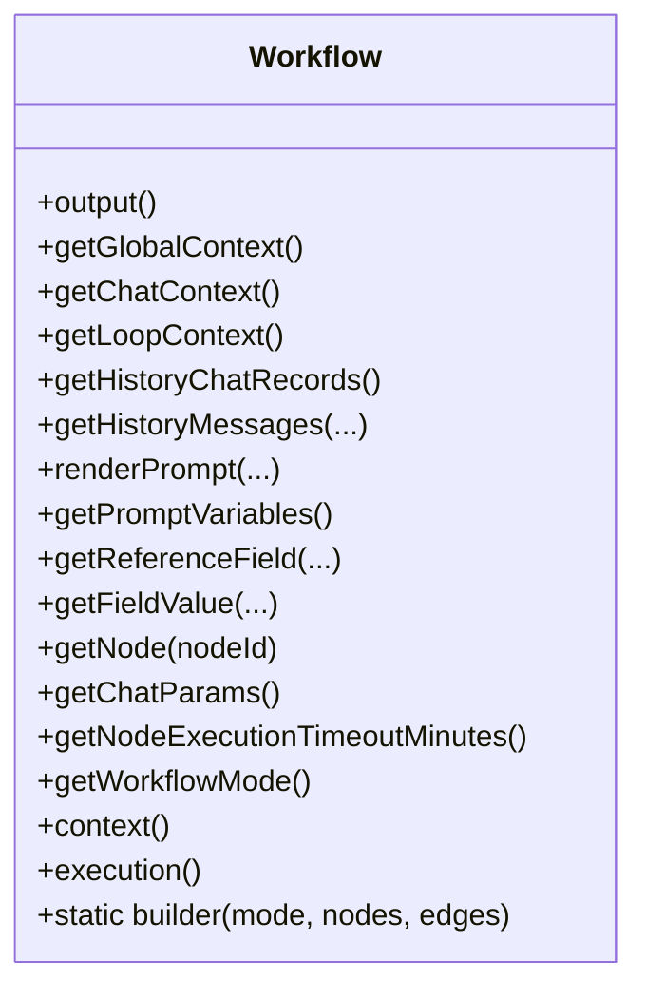
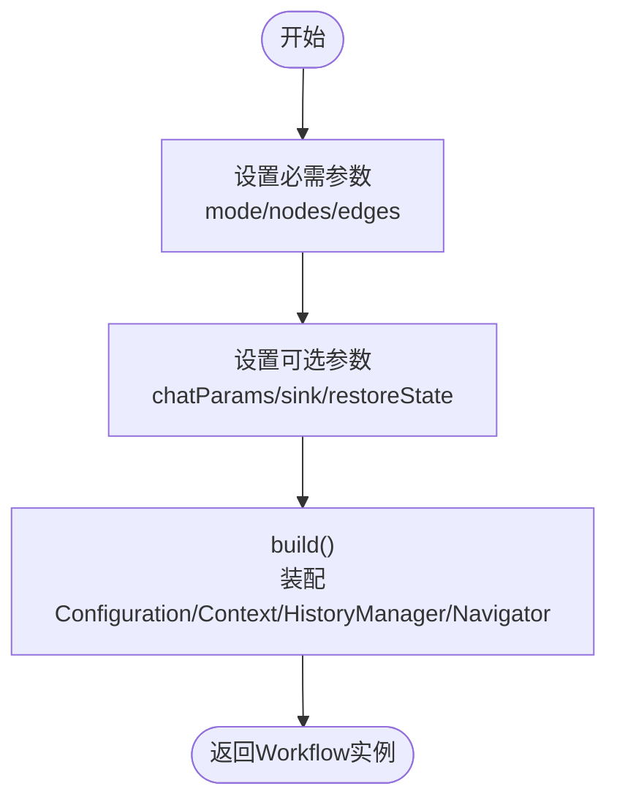
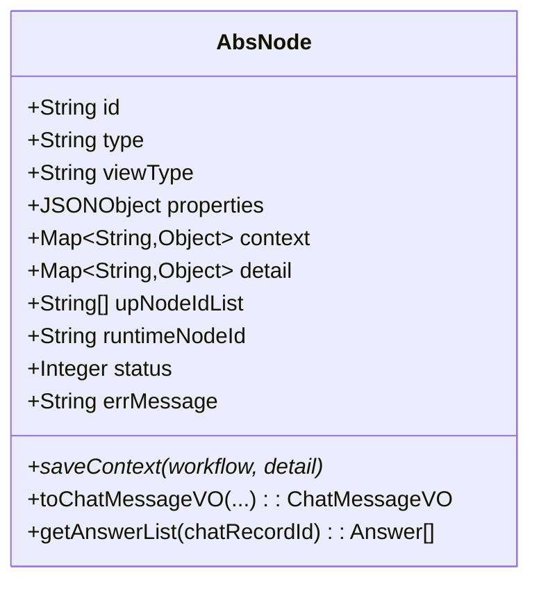
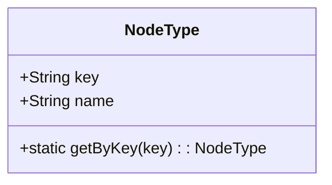
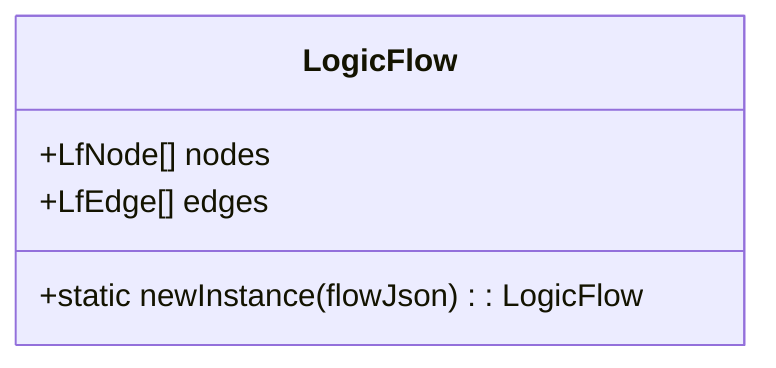
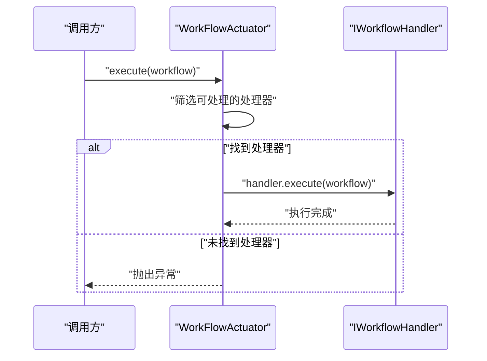
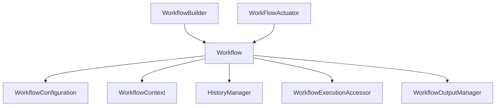

# 工作流服务API

<cite>
**本文引用的文件**
- [WorkFlowActuator.java](file://maxkb4j-service/maxkb4j-workflow/src/main/java/com/maxkb4j/workflow/service/WorkFlowActuator.java)
- [Workflow.java](file://maxkb4j-service-api/maxkb4j-workflow-api/src/main/java/com/maxkb4j/workflow/model/Workflow.java)
- [WorkflowBuilder.java](file://maxkb4j-service-api/maxkb4j-workflow-api/src/main/java/com/maxkb4j/workflow/model/WorkflowBuilder.java)
- [NodeType.java](file://maxkb4j-service-api/maxkb4j-workflow-api/src/main/java/com/maxkb4j/workflow/enums/NodeType.java)
- [LogicFlow.java](file://maxkb4j-service-api/maxkb4j-workflow-api/src/main/java/com/maxkb4j/workflow/logic/LogicFlow.java)
- [AbsNode.java](file://maxkb4j-service-api/maxkb4j-workflow-api/src/main/java/com/maxkb4j/workflow/node/AbsNode.java)
</cite>

## 目录
1. [简介](#简介)
2. [项目结构](#项目结构)
3. [核心组件](#核心组件)
4. [架构总览](#架构总览)
5. [详细组件分析](#详细组件分析)
6. [依赖分析](#依赖分析)
7. [性能考虑](#性能考虑)
8. [故障排查指南](#故障排查指南)
9. [结论](#结论)
10. [附录](#附录)

## 简介
本文件面向企业级AI应用开发，系统化梳理工作流服务模块的API与数据结构，覆盖工作流生命周期管理、节点类型与配置、执行控制、可视化设计器数据模型、以及模板与版本控制等高级能力。文档以代码为依据，采用渐进式讲解与图示结合的方式，帮助开发者快速构建稳定、可扩展的工作流系统。

## 项目结构
工作流服务由“API模型层”和“执行服务层”组成：
- API模型层（maxkb4j-workflow-api）：定义工作流、节点、逻辑流、枚举等数据模型与构建器，提供统一的门面类与便捷方法。
- 执行服务层（maxkb4j-workflow）：封装执行器与处理器，负责根据工作流类型选择合适的处理器并执行。

**图示来源**
- [Workflow.java:34-263](file://maxkb4j-service-api/maxkb4j-workflow-api/src/main/java/com/maxkb4j/workflow/model/Workflow.java#L34-L263)
- [WorkflowBuilder.java:35-140](file://maxkb4j-service-api/maxkb4j-workflow-api/src/main/java/com/maxkb4j/workflow/model/WorkflowBuilder.java#L35-L140)
- [LogicFlow.java:13-31](file://maxkb4j-service-api/maxkb4j-workflow-api/src/main/java/com/maxkb4j/workflow/logic/LogicFlow.java#L13-L31)
- [NodeType.java:13-117](file://maxkb4j-service-api/maxkb4j-workflow-api/src/main/java/com/maxkb4j/workflow/enums/NodeType.java#L13-L117)
- [AbsNode.java:26-132](file://maxkb4j-service-api/maxkb4j-workflow-api/src/main/java/com/maxkb4j/workflow/node/AbsNode.java#L26-L132)
- [WorkFlowActuator.java:18-37](file://maxkb4j-service/maxkb4j-workflow/src/main/java/com/maxkb4j/workflow/service/WorkFlowActuator.java#L18-L37)

**章节来源**
- [Workflow.java:15-32](file://maxkb4j-service-api/maxkb4j-workflow-api/src/main/java/com/maxkb4j/workflow/model/Workflow.java#L15-L32)
- [WorkflowBuilder.java:17-34](file://maxkb4j-service-api/maxkb4j-workflow-api/src/main/java/com/maxkb4j/workflow/model/WorkflowBuilder.java#L17-L34)
- [WorkFlowActuator.java:12-18](file://maxkb4j-service/maxkb4j-workflow/src/main/java/com/maxkb4j/workflow/service/WorkFlowActuator.java#L12-L18)

## 核心组件
- 工作流门面（Workflow）：提供便捷方法与分层访问器，屏蔽内部组件复杂性；支持渲染提示词、获取历史消息、上下文访问、执行访问等。
- 工作流构建器（WorkflowBuilder）：分离复杂初始化逻辑，按需设置聊天参数、输出Sink、恢复状态等，最终构建Workflow实例。
- 节点抽象基类（AbsNode）：统一节点属性与行为，提供运行时ID生成、上下文保存、消息转换等通用能力。
- 节点类型枚举（NodeType）：标准化节点类型键值对，支持O(1)查找，覆盖基础节点、知识库节点、AI节点、工具节点、循环节点等。
- 逻辑流（LogicFlow）：承载节点与边集合，支持从JSON反序列化为逻辑流对象。
- 执行器（WorkFlowActuator）：策略模式选择处理器，按工作流类型委派执行。

**章节来源**
- [Workflow.java:76-263](file://maxkb4j-service-api/maxkb4j-workflow-api/src/main/java/com/maxkb4j/workflow/model/Workflow.java#L76-L263)
- [WorkflowBuilder.java:35-140](file://maxkb4j-service-api/maxkb4j-workflow-api/src/main/java/com/maxkb4j/workflow/model/WorkflowBuilder.java#L35-L140)
- [AbsNode.java:26-132](file://maxkb4j-service-api/maxkb4j-workflow-api/src/main/java/com/maxkb4j/workflow/node/AbsNode.java#L26-L132)
- [NodeType.java:13-117](file://maxkb4j-service-api/maxkb4j-workflow-api/src/main/java/com/maxkb4j/workflow/enums/NodeType.java#L13-L117)
- [LogicFlow.java:13-31](file://maxkb4j-service-api/maxkb4j-workflow-api/src/main/java/com/maxkb4j/workflow/logic/LogicFlow.java#L13-L31)
- [WorkFlowActuator.java:18-37](file://maxkb4j-service/maxkb4j-workflow/src/main/java/com/maxkb4j/workflow/service/WorkFlowActuator.java#L18-L37)

## 架构总览
工作流执行采用“门面+构建器+策略执行”的分层架构：
- 上层通过Workflow门面调用便捷方法与访问器；
- WorkflowBuilder负责装配Configuration、Context、HistoryManager、EdgeNavigator等组件；
- WorkFlowActuator根据工作流类型选择对应处理器执行。

**图示来源**
- [Workflow.java:250-263](file://maxkb4j-service-api/maxkb4j-workflow-api/src/main/java/com/maxkb4j/workflow/model/Workflow.java#L250-L263)
- [WorkflowBuilder.java:111-126](file://maxkb4j-service-api/maxkb4j-workflow-api/src/main/java/com/maxkb4j/workflow/model/WorkflowBuilder.java#L111-L126)
- [WorkFlowActuator.java:22-34](file://maxkb4j-service/maxkb4j-workflow/src/main/java/com/maxkb4j/workflow/service/WorkFlowActuator.java#L22-L34)

## 详细组件分析

### 工作流门面（Workflow）
- 作用：统一访问入口，提供便捷方法与分层访问器，便于上层调用。
- 便捷方法：渲染提示词、获取历史消息、获取上下文、获取字段值、获取节点、获取聊天参数、获取执行超时、获取工作流模式等。
- 分层访问器：context()/execution()分别暴露上下文与执行控制能力。
- 静态工厂：builder(...)用于创建构建器实例。

**图示来源**
- [Workflow.java:76-263](file://maxkb4j-service-api/maxkb4j-workflow-api/src/main/java/com/maxkb4j/workflow/model/Workflow.java#L76-L263)

**章节来源**
- [Workflow.java:76-227](file://maxkb4j-service-api/maxkb4j-workflow-api/src/main/java/com/maxkb4j/workflow/model/Workflow.java#L76-L227)

### 工作流构建器（WorkflowBuilder）
- 作用：分离复杂初始化逻辑，统一组件装配顺序。
- 关键步骤：构建Configuration、Context、HistoryManager、EdgeNavigator，再交由Workflow构造器完成依赖初始化。
- 可选参数：聊天参数、输出Sink、恢复状态（details、currentNodeId、nodeData）。
- 恢复状态：当提供聊天记录详情时自动启用恢复执行。

**图示来源**
- [WorkflowBuilder.java:35-140](file://maxkb4j-service-api/maxkb4j-workflow-api/src/main/java/com/maxkb4j/workflow/model/WorkflowBuilder.java#L35-L140)

**章节来源**
- [WorkflowBuilder.java:67-126](file://maxkb4j-service-api/maxkb4j-workflow-api/src/main/java/com/maxkb4j/workflow/model/WorkflowBuilder.java#L67-L126)

### 节点抽象基类（AbsNode）
- 作用：统一节点属性与行为，提供运行时ID生成、上下文保存、消息转换等通用能力。
- 关键字段：id、type、viewType、properties、upNodeIdList、runtimeNodeId、status、errMessage等。
- 关键方法：saveContext(抽象)、toChatMessageVO(消息转换)、getAnswerList(答案封装)。

**图示来源**
- [AbsNode.java:26-132](file://maxkb4j-service-api/maxkb4j-workflow-api/src/main/java/com/maxkb4j/workflow/node/AbsNode.java#L26-L132)

**章节来源**
- [AbsNode.java:39-126](file://maxkb4j-service-api/maxkb4j-workflow-api/src/main/java/com/maxkb4j/workflow/node/AbsNode.java#L39-L126)

### 节点类型枚举（NodeType）
- 作用：标准化节点类型键值对，支持O(1)查找。
- 覆盖范围：基础节点、知识库节点、AI节点、工具节点、循环节点、图表节点、数据库节点、意图分类、多路召回、语音/图像处理、文档处理、表单收集、参数提取等。
- 查询方法：getByKey(key)提供常数时间查找。

**图示来源**
- [NodeType.java:13-117](file://maxkb4j-service-api/maxkb4j-workflow-api/src/main/java/com/maxkb4j/workflow/enums/NodeType.java#L13-L117)

**章节来源**
- [NodeType.java:96-117](file://maxkb4j-service-api/maxkb4j-workflow-api/src/main/java/com/maxkb4j/workflow/enums/NodeType.java#L96-L117)

### 逻辑流（LogicFlow）
- 作用：承载节点与边集合，支持从JSON反序列化为逻辑流对象。
- 字段：nodes、edges。
- 工具方法：newInstance(JSONObject)用于从JSON创建逻辑流实例。

**图示来源**
- [LogicFlow.java:13-31](file://maxkb4j-service-api/maxkb4j-workflow-api/src/main/java/com/maxkb4j/workflow/logic/LogicFlow.java#L13-L31)

**章节来源**
- [LogicFlow.java:17-25](file://maxkb4j-service-api/maxkb4j-workflow-api/src/main/java/com/maxkb4j/workflow/logic/LogicFlow.java#L17-L25)

### 执行器（WorkFlowActuator）
- 作用：策略模式选择处理器，按工作流类型委派执行。
- 行为：遍历注册的处理器，过滤出可处理该类型的工作流，执行或抛出异常。

**图示来源**
- [WorkFlowActuator.java:22-34](file://maxkb4j-service/maxkb4j-workflow/src/main/java/com/maxkb4j/workflow/service/WorkFlowActuator.java#L22-L34)

**章节来源**
- [WorkFlowActuator.java:18-37](file://maxkb4j-service/maxkb4j-workflow/src/main/java/com/maxkb4j/workflow/service/WorkFlowActuator.java#L18-L37)

## 依赖分析
- 组件内聚：Workflow门面聚合了Configuration、Context、HistoryManager、ExecutionAccessor、OutputManager，形成高内聚的统一入口。
- 组件耦合：WorkflowBuilder负责装配各组件，降低Workflow构造复杂度；WorkFlowActuator通过处理器接口解耦不同工作流类型。
- 外部依赖：使用FastJSON进行JSON序列化/反序列化，使用Reactor的Sink进行响应式输出。

**图示来源**
- [WorkflowBuilder.java:111-126](file://maxkb4j-service-api/maxkb4j-workflow-api/src/main/java/com/maxkb4j/workflow/model/WorkflowBuilder.java#L111-L126)
- [Workflow.java:46-61](file://maxkb4j-service-api/maxkb4j-workflow-api/src/main/java/com/maxkb4j/workflow/model/Workflow.java#L46-L61)
- [WorkFlowActuator.java:20-33](file://maxkb4j-service/maxkb4j-workflow/src/main/java/com/maxkb4j/workflow/service/WorkFlowActuator.java#L20-L33)

**章节来源**
- [WorkflowBuilder.java:111-126](file://maxkb4j-service-api/maxkb4j-workflow-api/src/main/java/com/maxkb4j/workflow/model/WorkflowBuilder.java#L111-L126)
- [Workflow.java:46-61](file://maxkb4j-service-api/maxkb4j-workflow-api/src/main/java/com/maxkb4j/workflow/model/Workflow.java#L46-L61)

## 性能考虑
- 初始化成本：WorkflowBuilder在build()中统一装配组件，避免重复初始化开销。
- 查找效率：NodeType通过静态映射实现O(1)键值查找，适合高频判断场景。
- 响应式输出：通过Reactor Sink进行增量输出，降低内存峰值与延迟。
- 恢复执行：当提供聊天记录详情时自动启用恢复状态，减少重复计算。

[本节为通用指导，无需列出章节来源]

## 故障排查指南
- 无处理器可用：当WorkFlowActuator无法匹配到可处理的工作流类型时会抛出异常，需确认工作流类型与处理器注册情况。
- 节点上下文缺失：若节点未正确保存上下文或运行时ID生成异常，可能导致消息转换失败，需检查saveContext实现与运行时ID生成逻辑。
- JSON解析异常：LogicFlow.newInstance依赖FastJSON进行反序列化，输入格式不合法会导致异常，需校验逻辑流JSON结构。

**章节来源**
- [WorkFlowActuator.java:29-33](file://maxkb4j-service/maxkb4j-workflow/src/main/java/com/maxkb4j/workflow/service/WorkFlowActuator.java#L29-L33)
- [AbsNode.java:79-81](file://maxkb4j-service-api/maxkb4j-workflow-api/src/main/java/com/maxkb4j/workflow/node/AbsNode.java#L79-L81)
- [LogicFlow.java:22-25](file://maxkb4j-service-api/maxkb4j-workflow-api/src/main/java/com/maxkb4j/workflow/logic/LogicFlow.java#L22-L25)

## 结论
工作流服务模块通过“门面+构建器+策略执行”的架构实现了高内聚、低耦合的设计，配合丰富的节点类型与逻辑流模型，能够支撑复杂的企业级AI应用。开发者可基于Workflow门面与WorkflowBuilder快速搭建工作流，利用NodeType与LogicFlow实现可视化设计器的数据结构，借助WorkFlowActuator实现灵活的执行控制与扩展。

[本节为总结性内容，无需列出章节来源]

## 附录

### API与数据结构概览
- 工作流门面（Workflow）
  - 便捷方法：渲染提示词、获取历史消息、上下文访问、字段解析、节点获取、参数与模式查询。
  - 访问器：context()/execution()。
  - 工厂：builder(...)。
- 工作流构建器（WorkflowBuilder）
  - 参数：必需（mode/nodes/edges），可选（chatParams/sink/restoreState）。
  - 步骤：装配Configuration/Context/HistoryManager/Navigator，构建Workflow。
- 节点抽象基类（AbsNode）
  - 属性：id/type/viewType/properties/upNodeIdList/runtimeNodeId/status/errMessage。
  - 方法：saveContext(抽象)/toChatMessageVO/getAnswerList。
- 节点类型枚举（NodeType）
  - 键值：key/name。
  - 方法：getByKey(key)。
- 逻辑流（LogicFlow）
  - 字段：nodes/edges。
  - 方法：newInstance(JSONObject)。
- 执行器（WorkFlowActuator）
  - 方法：execute(workflow)，按类型选择处理器。

**章节来源**
- [Workflow.java:76-263](file://maxkb4j-service-api/maxkb4j-workflow-api/src/main/java/com/maxkb4j/workflow/model/Workflow.java#L76-L263)
- [WorkflowBuilder.java:67-126](file://maxkb4j-service-api/maxkb4j-workflow-api/src/main/java/com/maxkb4j/workflow/model/WorkflowBuilder.java#L67-L126)
- [AbsNode.java:39-126](file://maxkb4j-service-api/maxkb4j-workflow-api/src/main/java/com/maxkb4j/workflow/node/AbsNode.java#L39-L126)
- [NodeType.java:96-117](file://maxkb4j-service-api/maxkb4j-workflow-api/src/main/java/com/maxkb4j/workflow/enums/NodeType.java#L96-L117)
- [LogicFlow.java:17-25](file://maxkb4j-service-api/maxkb4j-workflow-api/src/main/java/com/maxkb4j/workflow/logic/LogicFlow.java#L17-L25)
- [WorkFlowActuator.java:22-34](file://maxkb4j-service/maxkb4j-workflow/src/main/java/com/maxkb4j/workflow/service/WorkFlowActuator.java#L22-L34)