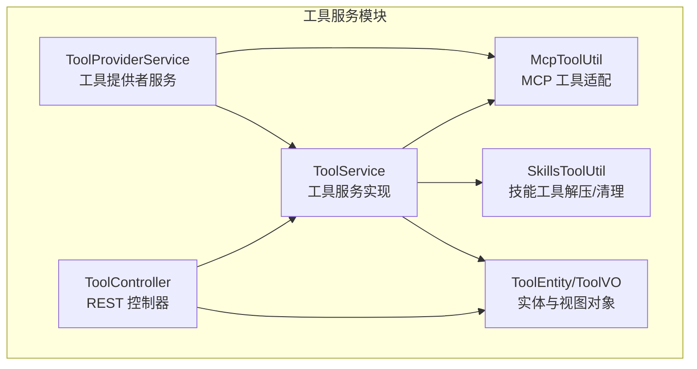
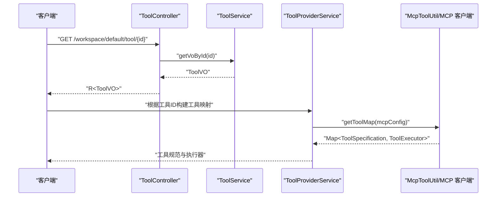
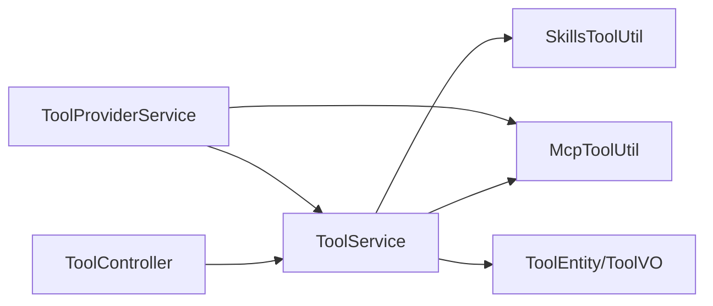

# 工具服务API

<cite>
**本文引用的文件**
- [ToolController.java](file://maxkb4j-service/maxkb4j-tool/src/main/java/com/maxkb4j/tool/controller/ToolController.java)
- [ToolService.java](file://maxkb4j-service/maxkb4j-tool/src/main/java/com/maxkb4j/tool/service/ToolService.java)
- [ToolProviderService.java](file://maxkb4j-service/maxkb4j-tool/src/main/java/com/maxkb4j/tool/service/ToolProviderService.java)
- [McpToolUtil.java](file://maxkb4j-service/maxkb4j-tool/src/main/java/com/maxkb4j/tool/util/McpToolUtil.java)
- [SkillsToolUtil.java](file://maxkb4j-service/maxkb4j-tool/src/main/java/com/maxkb4j/tool/util/SkillsToolUtil.java)
- [ToolConstants.java](file://maxkb4j-service/maxkb4j-tool/src/main/java/com/maxkb4j/tool/consts/ToolConstants.java)
- [ToolDTO.java](file://maxkb4j-service-api/maxkb4j-tool-api/src/main/java/com/maxkb4j/tool/dto/ToolDTO.java)
- [ToolQuery.java](file://maxkb4j-service-api/maxkb4j-tool-api/src/main/java/com/maxkb4j/tool/dto/ToolQuery.java)
- [ToolEntity.java](file://maxkb4j-service-api/maxkb4j-tool-api/src/main/java/com/maxkb4j/tool/entity/ToolEntity.java)
- [ToolVO.java](file://maxkb4j-service-api/maxkb4j-tool-api/src/main/java/com/maxkb4j/tool/vo/ToolVO.java)
- [McpToolVO.java](file://maxkb4j-service-api/maxkb4j-tool-api/src/main/java/com/maxkb4j/tool/vo/McpToolVO.java)
- [McpServerConfig.java](file://maxkb4j-service-api/maxkb4j-tool-api/src/main/java/com/maxkb4j/tool/dto/McpServerConfig.java)
</cite>

## 目录
1. [简介](#简介)
2. [项目结构](#项目结构)
3. [核心组件](#核心组件)
4. [架构总览](#架构总览)
5. [详细组件分析](#详细组件分析)
6. [依赖分析](#依赖分析)
7. [性能考虑](#性能考虑)
8. [故障排查指南](#故障排查指南)
9. [结论](#结论)
10. [附录](#附录)

## 简介
本文件为工具服务模块的全面API接口文档，覆盖工具管理、工具提供者、MCP协议支持等能力。重点包括：
- 工具注册、配置、测试、删除与批量删除
- 工具元数据、参数定义、权限控制
- MCP（Model Context Protocol）工具发现、调用、参数传递与结果返回
- 工具验证、连接测试、导入导出
- 工具市场、版本管理、依赖关系等高级功能

## 项目结构
工具服务模块位于 maxkb4j-service/maxkb4j-tool，对外通过控制器暴露REST API，内部由服务层协调工具验证、导入导出、连接测试、MCP客户端与技能工具的解压/清理等操作。

图表来源
- [ToolController.java:1-183](file://maxkb4j-service/maxkb4j-tool/src/main/java/com/maxkb4j/tool/controller/ToolController.java#L1-L183)
- [ToolService.java:1-291](file://maxkb4j-service/maxkb4j-tool/src/main/java/com/maxkb4j/tool/service/ToolService.java#L1-L291)
- [ToolProviderService.java:1-310](file://maxkb4j-service/maxkb4j-tool/src/main/java/com/maxkb4j/tool/service/ToolProviderService.java#L1-L310)
- [McpToolUtil.java:1-133](file://maxkb4j-service/maxkb4j-tool/src/main/java/com/maxkb4j/tool/util/McpToolUtil.java#L1-L133)
- [SkillsToolUtil.java:1-91](file://maxkb4j-service/maxkb4j-tool/src/main/java/com/maxkb4j/tool/util/SkillsToolUtil.java#L1-L91)
- [ToolEntity.java:1-50](file://maxkb4j-service-api/maxkb4j-tool-api/src/main/java/com/maxkb4j/tool/entity/ToolEntity.java#L1-L50)
- [ToolVO.java:1-16](file://maxkb4j-service-api/maxkb4j-tool-api/src/main/java/com/maxkb4j/tool/vo/ToolVO.java#L1-L16)

章节来源
- [ToolController.java:35-183](file://maxkb4j-service/maxkb4j-tool/src/main/java/com/maxkb4j/tool/controller/ToolController.java#L35-L183)
- [ToolService.java:47-291](file://maxkb4j-service/maxkb4j-tool/src/main/java/com/maxkb4j/tool/service/ToolService.java#L47-L291)
- [ToolProviderService.java:50-310](file://maxkb4j-service/maxkb4j-tool/src/main/java/com/maxkb4j/tool/service/ToolProviderService.java#L50-L310)

## 核心组件
- 控制器层：提供REST接口，负责鉴权、分页查询、列表查询、增删改查、调试、导入导出、连接测试、技能文件上传等。
- 服务层：封装工具持久化、分页查询、导入导出、连接测试、MCP配置校验、技能文件解压/清理、工具VO组装等。
- 工具提供者服务：将工具（HTTP/CUSTOM/MCP/应用代理）转换为LangChain4j可识别的工具规范与执行器，支持MCP工具发现与调用。
- MCP工具适配：基于MCP客户端实现工具发现、参数schema转换、工具执行器包装。
- 技能工具工具类：负责技能包的解压、目录清理与文件系统访问。

章节来源
- [ToolController.java:43-183](file://maxkb4j-service/maxkb4j-tool/src/main/java/com/maxkb4j/tool/controller/ToolController.java#L43-L183)
- [ToolService.java:105-291](file://maxkb4j-service/maxkb4j-tool/src/main/java/com/maxkb4j/tool/service/ToolService.java#L105-L291)
- [ToolProviderService.java:67-310](file://maxkb4j-service/maxkb4j-tool/src/main/java/com/maxkb4j/tool/service/ToolProviderService.java#L67-L310)
- [McpToolUtil.java:21-133](file://maxkb4j-service/maxkb4j-tool/src/main/java/com/maxkb4j/tool/util/McpToolUtil.java#L21-L133)
- [SkillsToolUtil.java:25-91](file://maxkb4j-service/maxkb4j-tool/src/main/java/com/maxkb4j/tool/util/SkillsToolUtil.java#L25-L91)

## 架构总览
工具服务API围绕“控制器-服务-工具提供者”的分层设计，结合MCP客户端与本地技能工具目录，形成统一的工具生态。

图表来源
- [ToolController.java:124-127](file://maxkb4j-service/maxkb4j-tool/src/main/java/com/maxkb4j/tool/controller/ToolController.java#L124-L127)
- [ToolService.java:245-272](file://maxkb4j-service/maxkb4j-tool/src/main/java/com/maxkb4j/tool/service/ToolService.java#L245-L272)
- [ToolProviderService.java:188-203](file://maxkb4j-service/maxkb4j-tool/src/main/java/com/maxkb4j/tool/service/ToolProviderService.java#L188-L203)
- [McpToolUtil.java:21-30](file://maxkb4j-service/maxkb4j-tool/src/main/java/com/maxkb4j/tool/util/McpToolUtil.java#L21-L30)

## 详细组件分析

### 控制器层 API 规范
- 分页查询工具
  - 方法：GET
  - 路径：/workspace/default/tool/{current}/{size}
  - 权限：TOOL_READ
  - 查询参数：ToolQuery（名称、创建人、文件夹、作用域、类型、是否激活）
  - 返回：分页工具视图对象
- 工具列表
  - 方法：GET
  - 路径：/workspace/default/tool
  - 查询参数：folderId, toolType
  - 返回：工具列表（含空占位）
- 共享工具列表
  - 方法：GET
  - 路径：/workspace/default/tool/tool_list
  - 查询参数：scope, toolType
  - 返回：共享工具与工具列表
- 内部工具模板
  - 方法：GET
  - 路径：/workspace/internal/tool
  - 查询参数：name
  - 返回：内置工具模板列表
- 新增内部工具
  - 方法：POST
  - 路径：/workspace/default/tool/{templateId}/add_internal_tool
  - 权限：TOOL_CREATE
  - 请求体：ToolEntity（自动填充用户、模板ID、作用域、类型、时间戳、未激活）
  - 返回：ToolEntity
- 创建工具
  - 方法：POST
  - 路径：/workspace/default/tool
  - 权限：TOOL_CREATE
  - 请求体：ToolEntity（默认类型CUSTOM，激活状态true，填充用户与作用域）
  - 校验：MCP服务器配置有效性
  - 返回：ToolEntity
- 调试工具
  - 方法：POST
  - 路径：/workspace/default/tool/debug
  - 权限：TOOL_DEBUG
  - 请求体：ToolDTO（包含代码、初始化参数、调试输入字段）
  - 执行：HTTP或Groovy脚本
  - 返回：执行结果
- 获取工具详情
  - 方法：GET
  - 路径：/workspace/default/tool/{id}
  - 权限：TOOL_READ
  - 返回：ToolVO
- 更新工具
  - 方法：PUT
  - 路径：/workspace/default/tool/{id}
  - 权限：TOOL_EDIT
  - 请求体：ToolEntity
  - 校验：MCP服务器配置有效性
  - 返回：ToolEntity
- 删除工具
  - 方法：DELETE
  - 路径：/workspace/default/tool/{id}
  - 权限：TOOL_DELETE
  - 返回：布尔状态
- 批量删除
  - 方法：DELETE
  - 路径：/workspace/default/tool/batchDelete
  - 权限：TOOL_BATCH_DELETE
  - 查询参数：idList
  - 返回：布尔状态
- 连接测试
  - 方法：POST
  - 路径：/workspace/default/tool/test_connection
  - 权限：TOOL_EDIT
  - 请求体：ToolEntity.code
  - 返回：布尔状态
- 导出工具
  - 方法：GET
  - 路径：/workspace/default/tool/{id}/export
  - 权限：TOOL_EXPORT
  - 返回：二进制流（导出文件）
- 导入工具
  - 方法：POST
  - 路径：/workspace/default/tool/import
  - 权限：TOOL_IMPORT
  - 表单：file, folderId
  - 返回：布尔状态
- 上传技能文件
  - 方法：POST
  - 路径：/workspace/default/tool/upload_skill_file
  - 权限：TOOL_EDIT
  - 表单：file
  - 返回：文件ID

章节来源
- [ToolController.java:43-183](file://maxkb4j-service/maxkb4j-tool/src/main/java/com/maxkb4j/tool/controller/ToolController.java#L43-L183)
- [ToolDTO.java:10-15](file://maxkb4j-service-api/maxkb4j-tool-api/src/main/java/com/maxkb4j/tool/dto/ToolDTO.java#L10-L15)
- [ToolQuery.java:6-14](file://maxkb4j-service-api/maxkb4j-tool-api/src/main/java/com/maxkb4j/tool/dto/ToolQuery.java#L6-L14)
- [ToolEntity.java:23-49](file://maxkb4j-service-api/maxkb4j-tool-api/src/main/java/com/maxkb4j/tool/entity/ToolEntity.java#L23-L49)

### 服务层 API 规范
- 分页查询
  - 方法：pageList(current, size, ToolQuery)
  - 功能：按条件分页查询，支持角色与资源授权过滤
  - 返回：IPage<ToolVO>
- 保存工具
  - 方法：saveTool(ToolEntity)
  - 功能：保存工具；若为SKILL类型，解压技能文件至本地目录
  - 返回：布尔状态
- MCP配置校验
  - 方法：mcpServerConfigValid(ToolEntity)
  - 功能：校验MCP服务器配置
  - 返回：布尔状态
- 导出工具
  - 方法：toolExport(id, response)
  - 功能：导出工具配置与资源
- 导入工具
  - 方法：toolImport(file, folderId)
  - 功能：导入工具并保存
  - 返回：布尔状态
- 连接测试
  - 方法：testConnection(code)
  - 功能：测试工具连接可用性
  - 返回：布尔状态
- 删除工具
  - 方法：removeToolById(id)
  - 功能：删除工具；若为SKILL类型，清理本地技能目录
  - 返回：布尔状态
- 列表查询
  - 方法：listTools(folderId, scope, toolType)
  - 功能：按作用域与类型查询可用工具
  - 返回：列表
- 内部模板工具
  - 方法：store(name)
  - 功能：加载内置模板工具
  - 返回：列表
- 更新工具
  - 方法：updateTool(ToolEntity)
  - 功能：更新工具；若为SKILL类型，替换解压目录
  - 返回：ToolVO
- 获取工具详情
  - 方法：getVoById(id)
  - 功能：组装ToolVO（含用户昵称、文件列表等）
  - 返回：ToolVO
- 上传技能文件
  - 方法：uploadSkillFile(file)
  - 功能：上传技能压缩包
  - 返回：文件ID
- MCP工具视图
  - 方法：getMcpToolVos(mcpServersJson)
  - 功能：将MCP服务器配置转换为视图对象列表
  - 返回：List<McpToolVO>

章节来源
- [ToolService.java:58-291](file://maxkb4j-service/maxkb4j-tool/src/main/java/com/maxkb4j/tool/service/ToolService.java#L58-L291)

### 工具提供者服务 API 规范
- 获取工具映射
  - 方法：getToolMap(toolIds, applicationIds)
  - 功能：合并普通工具与应用代理工具映射
  - 返回：Map<ToolSpecification, ToolExecutor>
- 获取Shell技能
  - 方法：getSkills(toolIds)
  - 功能：加载本地技能工具
  - 返回：ShellSkills
- 获取MCP技能提供者
  - 方法：getSkillsProvider(modelId, toolIds)
  - 功能：基于模型构建技能提供者
  - 返回：ToolProvider
- 构建MCP工具映射
  - 方法：getSkillsToolMap(modelId, toolIds)
  - 功能：解析技能工具的可用技能并生成工具规范与执行器
  - 返回：Map<ToolSpecification, ToolExecutor>
- 构建工具规范
  - 方法：buildToolSpecification(...)
  - 功能：根据输入字段生成JSON Schema参数
  - 返回：ToolSpecification

章节来源
- [ToolProviderService.java:67-310](file://maxkb4j-service/maxkb4j-tool/src/main/java/com/maxkb4j/tool/service/ToolProviderService.java#L67-L310)

### MCP 工具适配 API 规范
- 获取工具映射
  - 方法：getToolMap(mcpServers)
  - 功能：基于MCP服务器配置创建MCP客户端并列出工具，返回工具规范与执行器映射
  - 返回：Map<ToolSpecification, ToolExecutor>
- 获取MCP客户端
  - 方法：getMcpClient(mcpServers)
  - 功能：解析首个服务器配置并创建MCP客户端（支持SSE与Streamable HTTP）
  - 返回：McpClient
- 工具视图转换
  - 方法：getToolVos(mcpServersJson)
  - 功能：将MCP工具列表转换为视图对象，包含参数schema
  - 返回：List<McpToolVO>

章节来源
- [McpToolUtil.java:21-133](file://maxkb4j-service/maxkb4j-tool/src/main/java/com/maxkb4j/tool/util/McpToolUtil.java#L21-L133)

### 技能工具工具类 API 规范
- 获取技能目录
  - 方法：getSkillFolder(toolId)
  - 功能：返回技能工具目录路径
  - 返回：Path
- 解压技能
  - 方法：unzipSkill(inputStream, toolId)
  - 功能：解压技能包到本地目录，防止ZIP路径穿越
  - 异常：解压失败时抛出异常
- 删除技能目录
  - 方法：deleteDirectory(toolId)
  - 功能：递归删除技能目录及内容
  - 异常：删除失败时记录告警

章节来源
- [SkillsToolUtil.java:21-91](file://maxkb4j-service/maxkb4j-tool/src/main/java/com/maxkb4j/tool/util/SkillsToolUtil.java#L21-L91)

### 数据模型与常量
- 实体与视图
  - ToolEntity：工具实体，包含名称、描述、代码、输入字段、初始化字段与参数、用户ID、状态、类型、标签、作用域、图标、模板ID、文件夹ID、版本等
  - ToolVO：扩展实体，增加用户昵称与文件列表
  - McpToolVO：MCP工具视图，包含服务器名、工具名、描述与参数schema
- DTO
  - ToolDTO：扩展实体，增加调试输入字段列表
  - ToolQuery：分页查询条件
  - McpServerConfig：MCP服务器配置（URL、类型）
- 常量
  - 作用域：WORKSPACE
  - 工具类型：MCP、CUSTOM、HTTP、SKILL
  - 状态：ACTIVE、INACTIVE
  - 文件类型：.tool
  - MCP类型：sse、streamable_http
  - 输入类型：string、int、number、boolean、array、object
  - 默认值：默认文件夹ID、默认版本号

章节来源
- [ToolEntity.java:23-49](file://maxkb4j-service-api/maxkb4j-tool-api/src/main/java/com/maxkb4j/tool/entity/ToolEntity.java#L23-L49)
- [ToolVO.java:12-16](file://maxkb4j-service-api/maxkb4j-tool-api/src/main/java/com/maxkb4j/tool/vo/ToolVO.java#L12-L16)
- [McpToolVO.java:7-13](file://maxkb4j-service-api/maxkb4j-tool-api/src/main/java/com/maxkb4j/tool/vo/McpToolVO.java#L7-L13)
- [ToolDTO.java:12-15](file://maxkb4j-service-api/maxkb4j-tool-api/src/main/java/com/maxkb4j/tool/dto/ToolDTO.java#L12-L15)
- [ToolQuery.java:6-14](file://maxkb4j-service-api/maxkb4j-tool-api/src/main/java/com/maxkb4j/tool/dto/ToolQuery.java#L6-L14)
- [McpServerConfig.java:6-10](file://maxkb4j-service-api/maxkb4j-tool-api/src/main/java/com/maxkb4j/tool/dto/McpServerConfig.java#L6-L10)
- [ToolConstants.java:8-69](file://maxkb4j-service/maxkb4j-tool/src/main/java/com/maxkb4j/tool/consts/ToolConstants.java#L8-L69)

## 依赖分析
- 控制器依赖服务层；服务层依赖MCP工具适配与技能工具工具类；工具提供者服务依赖LangChain4j MCP客户端与模型工厂。
- 工具类型与作用域通过常量统一管理，输入字段类型与默认值集中定义。
- 导入导出、连接测试、权限过滤、角色与资源授权均在服务层实现。

图表来源
- [ToolController.java:41-42](file://maxkb4j-service/maxkb4j-tool/src/main/java/com/maxkb4j/tool/controller/ToolController.java#L41-L42)
- [ToolService.java:51-56](file://maxkb4j-service/maxkb4j-tool/src/main/java/com/maxkb4j/tool/service/ToolService.java#L51-L56)
- [ToolProviderService.java:58-62](file://maxkb4j-service/maxkb4j-tool/src/main/java/com/maxkb4j/tool/service/ToolProviderService.java#L58-L62)
- [McpToolUtil.java:18-70](file://maxkb4j-service/maxkb4j-tool/src/main/java/com/maxkb4j/tool/util/McpToolUtil.java#L18-L70)
- [SkillsToolUtil.java:15-91](file://maxkb4j-service/maxkb4j-tool/src/main/java/com/maxkb4j/tool/util/SkillsToolUtil.java#L15-L91)

章节来源
- [ToolController.java:41-42](file://maxkb4j-service/maxkb4j-tool/src/main/java/com/maxkb4j/tool/controller/ToolController.java#L41-L42)
- [ToolService.java:51-56](file://maxkb4j-service/maxkb4j-tool/src/main/java/com/maxkb4j/tool/service/ToolService.java#L51-L56)
- [ToolProviderService.java:58-62](file://maxkb4j-service/maxkb4j-tool/src/main/java/com/maxkb4j/tool/service/ToolProviderService.java#L58-L62)

## 性能考虑
- 分页查询：使用MyBatis Plus分页器，避免一次性加载大量工具数据。
- 工具映射构建：按需加载工具与应用代理工具，减少不必要的MCP客户端初始化。
- 技能工具：仅在需要时解压技能包，并缓存已解压目录以避免重复IO。
- 参数schema：在工具提供者服务中动态构建JSON Schema，降低静态定义成本。
- 并发与事务：导入导出与工具更新采用事务保证一致性，避免部分更新导致的数据不一致。

## 故障排查指南
- 连接测试失败
  - 现象：test_connection返回false
  - 排查：确认工具代码可执行、网络可达、MCP服务器配置正确
  - 参考：[ToolService.java:133-140](file://maxkb4j-service/maxkb4j-tool/src/main/java/com/maxkb4j/tool/service/ToolService.java#L133-L140)
- MCP配置无效
  - 现象：创建/更新工具时报错“请检查配置信息”
  - 排查：核对MCP服务器URL、类型（sse/streamable_http）、请求头
  - 参考：[ToolController.java:92-96](file://maxkb4j-service/maxkb4j-tool/src/main/java/com/maxkb4j/tool/controller/ToolController.java#L92-L96)
- 技能工具解压失败
  - 现象：保存SKILL类型工具时报错
  - 排查：检查压缩包完整性、目录权限、是否存在ZIP路径穿越风险
  - 参考：[SkillsToolUtil.java:25-58](file://maxkb4j-service/maxkb4j-tool/src/main/java/com/maxkb4j/tool/util/SkillsToolUtil.java#L25-L58)
- 权限不足
  - 现象：接口返回失败或空数据
  - 排查：确认用户角色与资源授权范围
  - 参考：[ToolService.java:81-94](file://maxkb4j-service/maxkb4j-tool/src/main/java/com/maxkb4j/tool/service/ToolService.java#L81-L94)

章节来源
- [ToolService.java:133-140](file://maxkb4j-service/maxkb4j-tool/src/main/java/com/maxkb4j/tool/service/ToolService.java#L133-L140)
- [ToolController.java:92-96](file://maxkb4j-service/maxkb4j-tool/src/main/java/com/maxkb4j/tool/controller/ToolController.java#L92-L96)
- [SkillsToolUtil.java:25-58](file://maxkb4j-service/maxkb4j-tool/src/main/java/com/maxkb4j/tool/util/SkillsToolUtil.java#L25-L58)
- [ToolService.java:81-94](file://maxkb4j-service/maxkb4j-tool/src/main/java/com/maxkb4j/tool/service/ToolService.java#L81-L94)

## 结论
工具服务API提供了完整的工具生命周期管理能力，覆盖工具注册、配置、测试、删除、导入导出、权限控制与MCP协议支持。通过工具提供者服务与MCP工具适配，系统实现了对多种工具类型的统一抽象与执行，便于构建丰富的AI工具生态系统。

## 附录
- 工具市场与版本管理
  - 内置模板工具可通过/store接口加载，版本号默认为1.0.0
  - 工具实体包含version字段，可用于版本管理
  - 参考：[ToolService.java:188-212](file://maxkb4j-service/maxkb4j-tool/src/main/java/com/maxkb4j/tool/service/ToolService.java#L188-L212)，[ToolConstants.java:65-68](file://maxkb4j-service/maxkb4j-tool/src/main/java/com/maxkb4j/tool/consts/ToolConstants.java#L65-L68)
- 依赖关系
  - 工具类型与作用域通过常量统一管理，便于扩展与维护
  - 参考：[ToolConstants.java:13-48](file://maxkb4j-service/maxkb4j-tool/src/main/java/com/maxkb4j/tool/consts/ToolConstants.java#L13-L48)