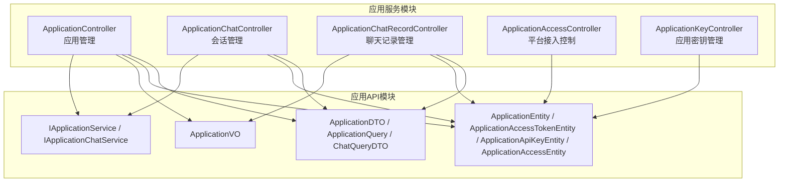
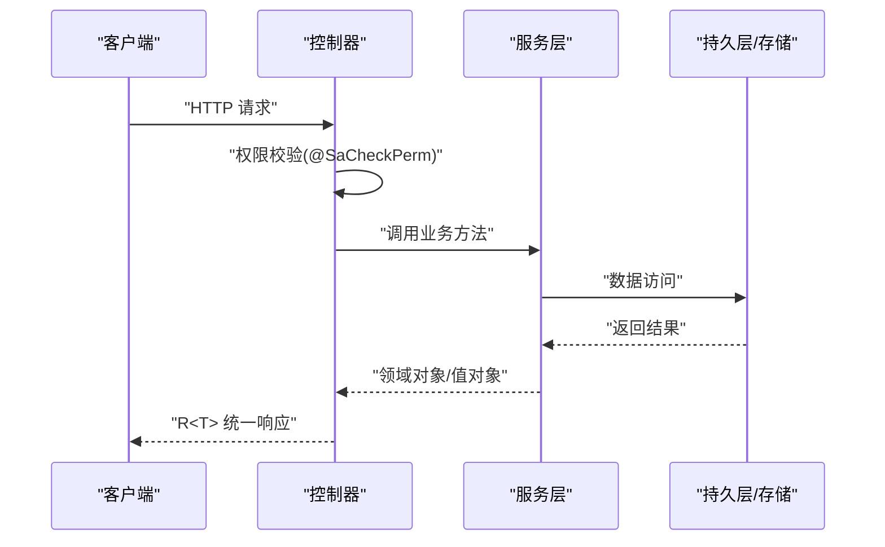

# 应用服务API

<cite>
**本文引用的文件**
- [ApplicationController.java](file://maxkb4j-service/maxkb4j-application/src/main/java/com/maxkb4j/application/controller/ApplicationController.java)
- [ApplicationChatController.java](file://maxkb4j-service/maxkb4j-application/src/main/java/com/maxkb4j/application/controller/ApplicationChatController.java)
- [ApplicationChatRecordController.java](file://maxkb4j-service/maxkb4j-application/src/main/java/com/maxkb4j/application/controller/ApplicationChatRecordController.java)
- [ApplicationAccessController.java](file://maxkb4j-service/maxkb4j-application/src/main/java/com/maxkb4j/application/controller/ApplicationAccessController.java)
- [ApplicationKeyController.java](file://maxkb4j-service/maxkb4j-application/src/main/java/com/maxkb4j/application/controller/ApplicationKeyController.java)
- [ApplicationDTO.java](file://maxkb4j-service-api/maxkb4j-application-api/src/main/java/com/maxkb4j/application/dto/ApplicationDTO.java)
- [ApplicationQuery.java](file://maxkb4j-service-api/maxkb4j-application-api/src/main/java/com/maxkb4j/application/dto/ApplicationQuery.java)
- [ChatQueryDTO.java](file://maxkb4j-service-api/maxkb4j-application-api/src/main/java/com/maxkb4j/application/dto/ChatQueryDTO.java)
- [ApplicationEntity.java](file://maxkb4j-service-api/maxkb4j-application-api/src/main/java/com/maxkb4j/application/entity/ApplicationEntity.java)
- [ApplicationAccessTokenEntity.java](file://maxkb4j-service-api/maxkb4j-application-api/src/main/java/com/maxkb4j/application/entity/ApplicationAccessTokenEntity.java)
- [ApplicationApiKeyEntity.java](file://maxkb4j-service-api/maxkb4j-application-api/src/main/java/com/maxkb4j/application/entity/ApplicationApiKeyEntity.java)
- [ApplicationAccessEntity.java](file://maxkb4j-service-api/maxkb4j-application-api/src/main/java/com/maxkb4j/application/entity/ApplicationAccessEntity.java)
- [ApplicationVO.java](file://maxkb4j-service-api/maxkb4j-application-api/src/main/java/com/maxkb4j/application/vo/ApplicationVO.java)
- [IApplicationService.java](file://maxkb4j-service-api/maxkb4j-application-api/src/main/java/com/maxkb4j/application/service/IApplicationService.java)
- [IApplicationChatService.java](file://maxkb4j-service-api/maxkb4j-application-api/src/main/java/com/maxkb4j/application/service/IApplicationChatService.java)
- [AppConst.java](file://maxkb4j-common/src/main/java/com/maxkb4j/common/constant/AppConst.java)
- [PermissionEnum.java](file://maxkb4j-common/src/main/java/com/maxkb4j/common/enums/PermissionEnum.java)
</cite>

## 目录
1. [简介](#简介)
2. [项目结构](#项目结构)
3. [核心组件](#核心组件)
4. [架构总览](#架构总览)
5. [详细组件分析](#详细组件分析)
6. [依赖分析](#依赖分析)
7. [性能考虑](#性能考虑)
8. [故障排查指南](#故障排查指南)
9. [结论](#结论)
10. [附录](#附录)

## 简介
本文件为 MaxKB4j 应用服务模块的 API 接口文档，覆盖应用管理、聊天会话管理、访问控制与密钥管理等能力。内容包含 RESTful 接口规范、请求参数、响应格式、状态码说明，并提供 curl 示例与 SDK 使用建议，帮助开发者快速集成。

## 项目结构
应用服务相关控制器集中在应用模块的 controller 包中，数据模型与服务接口位于应用 API 模块。权限控制通过注解与统一返回体配合实现。

图表来源
- [ApplicationController.java:45-186](file://maxkb4j-service/maxkb4j-application/src/main/java/com/maxkb4j/application/controller/ApplicationController.java#L45-L186)
- [ApplicationChatController.java:31-63](file://maxkb4j-service/maxkb4j-application/src/main/java/com/maxkb4j/application/controller/ApplicationChatController.java#L31-L63)
- [ApplicationChatRecordController.java:26-67](file://maxkb4j-service/maxkb4j-application/src/main/java/com/maxkb4j/application/controller/ApplicationChatRecordController.java#L26-L67)
- [ApplicationAccessController.java:15-46](file://maxkb4j-service/maxkb4j-application/src/main/java/com/maxkb4j/application/controller/ApplicationAccessController.java#L15-L46)
- [ApplicationKeyController.java:21-49](file://maxkb4j-service/maxkb4j-application/src/main/java/com/maxkb4j/application/controller/ApplicationKeyController.java#L21-L49)

章节来源
- [ApplicationController.java:45-186](file://maxkb4j-service/maxkb4j-application/src/main/java/com/maxkb4j/application/controller/ApplicationController.java#L45-L186)
- [ApplicationChatController.java:31-63](file://maxkb4j-service/maxkb4j-application/src/main/java/com/maxkb4j/application/controller/ApplicationChatController.java#L31-L63)
- [ApplicationChatRecordController.java:26-67](file://maxkb4j-service/maxkb4j-application/src/main/java/com/maxkb4j/application/controller/ApplicationChatRecordController.java#L26-L67)
- [ApplicationAccessController.java:15-46](file://maxkb4j-service/maxkb4j-application/src/main/java/com/maxkb4j/application/controller/ApplicationAccessController.java#L15-L46)
- [ApplicationKeyController.java:21-49](file://maxkb4j-service/maxkb4j-application/src/main/java/com/maxkb4j/application/controller/ApplicationKeyController.java#L21-L49)

## 核心组件
- 应用管理控制器：提供应用列表、分页查询、详情、创建、更新、删除、发布、导入导出、语音合成/识别、统计指标、MCP 工具等接口。
- 会话管理控制器：提供会话更新、删除、分页查询、导出等接口。
- 聊天记录控制器：提供单条记录详情、分页查询、知识增强添加/移除、改进记录查询等接口。
- 平台接入控制器：提供平台状态与配置读写、回调处理等接口。
- 应用密钥控制器：提供 API Key 列表、创建、更新、删除等接口。

章节来源
- [ApplicationController.java:53-186](file://maxkb4j-service/maxkb4j-application/src/main/java/com/maxkb4j/application/controller/ApplicationController.java#L53-L186)
- [ApplicationChatController.java:35-58](file://maxkb4j-service/maxkb4j-application/src/main/java/com/maxkb4j/application/controller/ApplicationChatController.java#L35-L58)
- [ApplicationChatRecordController.java:30-64](file://maxkb4j-service/maxkb4j-application/src/main/java/com/maxkb4j/application/controller/ApplicationChatRecordController.java#L30-L64)
- [ApplicationAccessController.java:19-42](file://maxkb4j-service/maxkb4j-application/src/main/java/com/maxkb4j/application/controller/ApplicationAccessController.java#L19-L42)
- [ApplicationKeyController.java:25-47](file://maxkb4j-service/maxkb4j-application/src/main/java/com/maxkb4j/application/controller/ApplicationKeyController.java#L25-L47)

## 架构总览
应用服务采用基于注解的权限控制（Sa-Token）与统一返回体（R），控制器负责路由与参数绑定，服务层负责业务逻辑，数据模型定义在 API 模块中，便于跨模块共享。

图表来源
- [PermissionEnum.java:13-117](file://maxkb4j-common/src/main/java/com/maxkb4j/common/enums/PermissionEnum.java#L13-L117)
- [ApplicationController.java:53-186](file://maxkb4j-service/maxkb4j-application/src/main/java/com/maxkb4j/application/controller/ApplicationController.java#L53-L186)

## 详细组件分析

### 应用管理接口
- 基础路径：admin/api/workspace/default
- 权限：通过注解控制，如 APPLICATION_READ、APPLICATION_CREATE、APPLICATION_EDIT、APPLICATION_DELETE、APPLICATION_EXPORT、APPLICATION_IMPORT、APPLICATION_ACCESS_READ、APPLICATION_ACCESS_EDIT 等

1) 应用列表
- 方法：GET
- 路径：/application?folderId={folderId}
- 权限：APPLICATION_READ
- 查询参数：folderId（可选）
- 响应：R<List<ApplicationListVO>>

2) 创建应用
- 方法：POST
- 路径：/application
- 权限：APPLICATION_CREATE
- 请求体：ApplicationDTO
- 响应：R<ApplicationEntity>

3) 应用导入
- 方法：POST
- 路径：/application/folder/{folderId}/import
- 权限：APPLICATION_IMPORT
- 参数：multipart file（仅支持 .mk 文件）
- 响应：R<Boolean>

4) 发布应用
- 方法：PUT
- 路径：/application/{id}/publish
- 权限：APPLICATION_EDIT
- 请求体：JSON 对象（参数由后端解析）
- 响应：R<ApplicationEntity>

5) 应用导出
- 方法：GET
- 路径：/application/{id}/export
- 权限：APPLICATION_EXPORT
- 响应：文件流（下载）

6) 分页查询应用
- 方法：GET
- 路径：/application/{current}/{size}
- 权限：APPLICATION_READ
- 查询参数：ApplicationQuery（name、publishStatus、createUser、folderId、type）
- 响应：R<IPage<ApplicationVO>>

7) 获取应用详情
- 方法：GET
- 路径：/application/{id}
- 权限：APPLICATION_READ
- 响应：R<ApplicationVO>

8) 更新应用
- 方法：PUT
- 路径：/application/{id}
- 权限：APPLICATION_EDIT
- 请求体：ApplicationVO
- 响应：R<Boolean>

9) 删除应用
- 方法：DELETE
- 路径：/application/{id}
- 权限：APPLICATION_DELETE
- 响应：R<Boolean>

10) 批量删除应用
- 方法：DELETE
- 路径：/application/batchDelete?idList={idList...}
- 权限：APPLICATION_BATCH_DELETE
- 查询参数：idList（多个 id）
- 响应：R<Boolean>

11) 演示文本播放
- 方法：POST
- 路径：/application/{id}/play_demo_text
- 权限：APPLICATION_READ
- 请求体：JSON 对象
- 响应：audio/wav 字节流

12) 文本转语音
- 方法：POST
- 路径：/application/{id}/text_to_speech
- 权限：APPLICATION_READ
- 请求体：JSON 对象
- 响应：audio/mp3 字节流

13) 语音转文本
- 方法：POST
- 路径：/application/{id}/speech_to_text
- 权限：APPLICATION_READ
- 参数：multipart file
- 响应：R<String>

14) 获取访问令牌
- 方法：GET
- 路径：/application/{id}/access_token
- 权限：APPLICATION_ACCESS_READ
- 响应：R<ApplicationAccessTokenEntity>

15) 更新访问令牌
- 方法：PUT
- 路径：/application/{id}/access_token
- 权限：APPLICATION_ACCESS_EDIT
- 请求体：ApplicationAccessTokenDTO
- 响应：R<ApplicationAccessTokenEntity>

16) 生成提示词（流式）
- 方法：POST
- 路径：/application/{id}/model/{modelId}/prompt_generate
- 权限：APPLICATION_EDIT
- 头部：Accept: text/event-stream
- 请求体：PromptGenerateDTO
- 响应：SSE 流（Map<String, String>）

17) 应用统计
- 方法：GET
- 路径：/application/{id}/application_stats
- 权限：APPLICATION_READ
- 查询参数：ChatQueryDTO（summary、startTime、endTime、minStar、minTrample）
- 响应：R<List<ApplicationStatisticsVO>>

18) Token 使用量
- 方法：GET
- 路径：/application/{id}/application_token_usage
- 权限：APPLICATION_READ
- 查询参数：ChatQueryDTO
- 响应：R<List<ApplicationStatisticsVO>>

19) 热门问题
- 方法：GET
- 路径：/application/{id}/top_questions
- 权限：APPLICATION_READ
- 查询参数：ChatQueryDTO
- 响应：R<List<ApplicationStatisticsVO>>

20) MCP 工具列表
- 方法：POST
- 路径：/application/{id}/mcp_tools
- 权限：APPLICATION_READ
- 请求体：JSON 对象（包含 mcpServers 字段）
- 响应：R<List<McpToolVO>>

章节来源
- [ApplicationController.java:53-186](file://maxkb4j-service/maxkb4j-application/src/main/java/com/maxkb4j/application/controller/ApplicationController.java#L53-L186)
- [ApplicationDTO.java:10-13](file://maxkb4j-service-api/maxkb4j-application-api/src/main/java/com/maxkb4j/application/dto/ApplicationDTO.java#L10-L13)
- [ApplicationQuery.java:6-12](file://maxkb4j-service-api/maxkb4j-application-api/src/main/java/com/maxkb4j/application/dto/ApplicationQuery.java#L6-L12)
- [ChatQueryDTO.java:7-14](file://maxkb4j-service-api/maxkb4j-application-api/src/main/java/com/maxkb4j/application/dto/ChatQueryDTO.java#L7-L14)
- [ApplicationEntity.java:26-103](file://maxkb4j-service-api/maxkb4j-application-api/src/main/java/com/maxkb4j/application/entity/ApplicationEntity.java#L26-L103)
- [ApplicationAccessTokenEntity.java:23-69](file://maxkb4j-service-api/maxkb4j-application-api/src/main/java/com/maxkb4j/application/entity/ApplicationAccessTokenEntity.java#L23-L69)
- [IApplicationService.java:12-18](file://maxkb4j-service-api/maxkb4j-application-api/src/main/java/com/maxkb4j/application/service/IApplicationService.java#L12-L18)
- [PermissionEnum.java:16-38](file://maxkb4j-common/src/main/java/com/maxkb4j/common/enums/PermissionEnum.java#L16-L38)

### 聊天会话管理接口
- 基础路径：admin/api/workspace/default
- 权限：通过注解控制，如 APPLICATION_EDIT、APPLICATION_DELETE、APPLICATION_READ、APPLICATION_EXPORT

1) 更新会话
- 方法：PUT
- 路径：/application/{id}/chat/client/{chatId}
- 权限：APPLICATION_EDIT
- 请求体：ApplicationChatEntity
- 响应：R<Boolean>

2) 删除会话
- 方法：DELETE
- 路径：/application/{id}/chat/client/{chatId}
- 权限：APPLICATION_DELETE
- 响应：R<Boolean>

3) 会话日志分页查询
- 方法：GET
- 路径：/application/{id}/chat/{page}/{size}?summary={}&startTime={}&endTime={}&minStar={}&minTrample={}
- 权限：APPLICATION_READ
- 查询参数：ChatQueryDTO
- 响应：R<IPage<ApplicationChatEntity>>

4) 会话导出
- 方法：POST
- 路径：/application/{id}/chat/export
- 权限：APPLICATION_EXPORT
- 请求体：JSON 数组（选中的会话 ID 列表）
- 响应：文件流（下载）

章节来源
- [ApplicationChatController.java:35-58](file://maxkb4j-service/maxkb4j-application/src/main/java/com/maxkb4j/application/controller/ApplicationChatController.java#L35-L58)
- [ChatQueryDTO.java:7-14](file://maxkb4j-service-api/maxkb4j-application-api/src/main/java/com/maxkb4j/application/dto/ChatQueryDTO.java#L7-L14)

### 聊天记录管理接口
- 基础路径：admin/api/workspace/default
- 权限：通过注解控制，如 APPLICATION_READ、APPLICATION_CREATE、APPLICATION_EDIT、APPLICATION_DELETE

1) 获取单条聊天记录详情
- 方法：GET
- 路径：/application/{id}/chat/{chatId}/chat_record/{chatRecordId}
- 权限：APPLICATION_READ
- 响应：R<ApplicationChatRecordVO>

2) 分页查询聊天记录
- 方法：GET
- 路径：/application/{id}/chat/{chatId}/chat_record/{current}/{size}
- 权限：APPLICATION_READ
- 响应：R<IPage<ApplicationChatRecordVO>>

3) 添加知识增强
- 方法：POST
- 路径：/application/{id}/add_knowledge
- 权限：APPLICATION_CREATE
- 请求体：AddChatImproveDTO
- 响应：R<Boolean>

4) 改进聊天记录（添加知识/文档片段）
- 方法：PUT
- 路径：/application/{id}/chat/{chatId}/chat_record/{chatRecordId}/knowledge/{knowledgeId}/document/{docId}/improve
- 权限：APPLICATION_EDIT
- 请求体：ChatImproveDTO
- 响应：R<ApplicationChatRecordEntity>

5) 移除改进（知识/文档片段）
- 方法：DELETE
- 路径：/application/{id}/chat/{chatId}/chat_record/{chatRecordId}/knowledge/{knowledgeId}/document/{docId}/paragraph/{paragraphId}/improve
- 权限：APPLICATION_DELETE
- 响应：R<Boolean>

6) 查询改进记录
- 方法：GET
- 路径：/application/{id}/chat/{chatId}/chat_record/{chatRecordId}/improve
- 权限：APPLICATION_READ
- 响应：R<List<ParagraphEntity>>

章节来源
- [ApplicationChatRecordController.java:30-64](file://maxkb4j-service/maxkb4j-application/src/main/java/com/maxkb4j/application/controller/ApplicationChatRecordController.java#L30-L64)

### 访问控制接口
- 基础路径：admin/api
- 子路径：/workspace/default/application/{id}

1) 获取平台状态
- 方法：GET
- 路径：/workspace/default/application/{id}/platform/status
- 响应：R<JSONObject>

2) 更新平台状态
- 方法：POST
- 路径：/workspace/default/application/{id}/platform/status
- 请求体：PlatformStatusDTO
- 响应：R<Boolean>

3) 获取平台配置
- 方法：GET
- 路径：/workspace/default/application/{id}/platform/{key}
- 响应：R<JSONObject>

4) 更新平台配置
- 方法：POST
- 路径：/workspace/default/application/{id}/platform/{key}
- 请求体：JSON 对象（平台配置）
- 响应：R<Boolean>

5) 平台回调
- 方法：POST
- 路径：/chat/{key}/{id}
- 请求体：JSON 对象（回调参数）
- 响应：R<Boolean>

章节来源
- [ApplicationAccessController.java:19-42](file://maxkb4j-service/maxkb4j-application/src/main/java/com/maxkb4j/application/controller/ApplicationAccessController.java#L19-L42)
- [ApplicationAccessEntity.java:14-18](file://maxkb4j-service-api/maxkb4j-application-api/src/main/java/com/maxkb4j/application/entity/ApplicationAccessEntity.java#L14-L18)

### 应用密钥管理接口
- 基础路径：admin/api/workspace/default
- 权限：通过注解控制，如 APPLICATION_READ、APPLICATION_CREATE、APPLICATION_EDIT、APPLICATION_DELETE

1) 列出 API Key
- 方法：GET
- 路径：/application/{id}/application_key
- 权限：APPLICATION_READ
- 响应：R<List<ApplicationApiKeyEntity>>

2) 创建 API Key
- 方法：POST
- 路径：/application/{id}/application_key
- 权限：APPLICATION_CREATE
- 响应：R<Boolean>

3) 更新 API Key
- 方法：PUT
- 路径：/application/{id}/application_key/{apiKeyId}
- 权限：APPLICATION_EDIT
- 请求体：ApplicationApiKeyEntity
- 响应：R<Boolean>

4) 删除 API Key
- 方法：DELETE
- 路径：/application/{id}/application_key/{apiKeyId}
- 权限：APPLICATION_DELETE
- 响应：R<Boolean>

章节来源
- [ApplicationKeyController.java:25-47](file://maxkb4j-service/maxkb4j-application/src/main/java/com/maxkb4j/application/controller/ApplicationKeyController.java#L25-L47)
- [ApplicationApiKeyEntity.java:19-26](file://maxkb4j-service-api/maxkb4j-application-api/src/main/java/com/maxkb4j/application/entity/ApplicationApiKeyEntity.java#L19-L26)

## 依赖分析
- 控制器依赖服务接口与数据模型，服务接口定义于 API 模块，保证跨模块复用。
- 权限枚举集中定义资源类型、操作与权限级别，控制器通过注解进行权限拦截。
- 常量类统一管理 API 前缀与工作空间标识，避免硬编码。

```mermaid
classDiagram
class ApplicationController
class ApplicationChatController
class ApplicationChatRecordController
class ApplicationAccessController
class ApplicationKeyController
class IApplicationService
class IApplicationChatService
class ApplicationDTO
class ApplicationQuery
class ChatQueryDTO
class ApplicationEntity
class ApplicationAccessTokenEntity
class ApplicationApiKeyEntity
class ApplicationAccessEntity
class ApplicationVO
class AppConst
class PermissionEnum
ApplicationController --> IApplicationService
ApplicationController --> ApplicationAccessTokenEntity
ApplicationController --> ApplicationEntity
ApplicationController --> ApplicationVO
ApplicationChatController --> IApplicationChatService
ApplicationChatController --> ApplicationEntity
ApplicationChatRecordController --> ApplicationEntity
ApplicationChatRecordController --> ApplicationVO
ApplicationAccessController --> ApplicationAccessEntity
ApplicationKeyController --> ApplicationApiKeyEntity
ApplicationController --> AppConst
ApplicationChatController --> AppConst
ApplicationChatRecordController --> AppConst
ApplicationAccessController --> AppConst
ApplicationKeyController --> AppConst
ApplicationController --> PermissionEnum
ApplicationChatController --> PermissionEnum
ApplicationChatRecordController --> PermissionEnum
ApplicationAccessController --> PermissionEnum
ApplicationKeyController --> PermissionEnum
```

图表来源
- [ApplicationController.java:47-51](file://maxkb4j-service/maxkb4j-application/src/main/java/com/maxkb4j/application/controller/ApplicationController.java#L47-L51)
- [ApplicationChatController.java:33-33](file://maxkb4j-service/maxkb4j-application/src/main/java/com/maxkb4j/application/controller/ApplicationChatController.java#L33-L33)
- [ApplicationChatRecordController.java:28-28](file://maxkb4j-service/maxkb4j-application/src/main/java/com/maxkb4j/application/controller/ApplicationChatRecordController.java#L28-L28)
- [ApplicationAccessController.java:17-17](file://maxkb4j-service/maxkb4j-application/src/main/java/com/maxkb4j/application/controller/ApplicationAccessController.java#L17-L17)
- [ApplicationKeyController.java:23-23](file://maxkb4j-service/maxkb4j-application/src/main/java/com/maxkb4j/application/controller/ApplicationKeyController.java#L23-L23)
- [IApplicationService.java:12-18](file://maxkb4j-service-api/maxkb4j-application-api/src/main/java/com/maxkb4j/application/service/IApplicationService.java#L12-L18)
- [IApplicationChatService.java:15-26](file://maxkb4j-service-api/maxkb4j-application-api/src/main/java/com/maxkb4j/application/service/IApplicationChatService.java#L15-L26)
- [ApplicationDTO.java:10-13](file://maxkb4j-service-api/maxkb4j-application-api/src/main/java/com/maxkb4j/application/dto/ApplicationDTO.java#L10-L13)
- [ApplicationQuery.java:6-12](file://maxkb4j-service-api/maxkb4j-application-api/src/main/java/com/maxkb4j/application/dto/ApplicationQuery.java#L6-L12)
- [ChatQueryDTO.java:7-14](file://maxkb4j-service-api/maxkb4j-application-api/src/main/java/com/maxkb4j/application/dto/ChatQueryDTO.java#L7-L14)
- [ApplicationEntity.java:26-103](file://maxkb4j-service-api/maxkb4j-application-api/src/main/java/com/maxkb4j/application/entity/ApplicationEntity.java#L26-L103)
- [ApplicationAccessTokenEntity.java:23-69](file://maxkb4j-service-api/maxkb4j-application-api/src/main/java/com/maxkb4j/application/entity/ApplicationAccessTokenEntity.java#L23-L69)
- [ApplicationApiKeyEntity.java:19-26](file://maxkb4j-service-api/maxkb4j-application-api/src/main/java/com/maxkb4j/application/entity/ApplicationApiKeyEntity.java#L19-L26)
- [ApplicationAccessEntity.java:14-18](file://maxkb4j-service-api/maxkb4j-application-api/src/main/java/com/maxkb4j/application/entity/ApplicationAccessEntity.java#L14-L18)
- [ApplicationVO.java:12-18](file://maxkb4j-service-api/maxkb4j-application-api/src/main/java/com/maxkb4j/application/vo/ApplicationVO.java#L12-L18)
- [AppConst.java:3-12](file://maxkb4j-common/src/main/java/com/maxkb4j/common/constant/AppConst.java#L3-L12)
- [PermissionEnum.java:13-117](file://maxkb4j-common/src/main/java/com/maxkb4j/common/enums/PermissionEnum.java#L13-L117)

## 性能考虑
- 分页查询：应用与会话均支持分页，建议前端按需加载，避免一次性拉取大量数据。
- SSE 流式输出：提示词生成使用 text/event-stream，注意客户端正确处理流式事件。
- 导出接口：会话与应用导出为文件下载，建议后端按需压缩或分片传输，避免内存峰值过高。
- 权限拦截：注解权限检查在进入业务逻辑前执行，减少无效调用开销。

## 故障排查指南
- 权限不足：返回统一错误响应，确认用户是否具备对应 PermissionEnum 权限。
- 文件格式错误：应用导入要求 .mk 格式，否则返回失败。
- SSE 连接异常：检查 Accept 头与服务端流式输出配置。
- 导出为空：确认选择的会话 ID 是否有效或已删除。

章节来源
- [ApplicationController.java:67-72](file://maxkb4j-service/maxkb4j-application/src/main/java/com/maxkb4j/application/controller/ApplicationController.java#L67-L72)
- [PermissionEnum.java:16-38](file://maxkb4j-common/src/main/java/com/maxkb4j/common/enums/PermissionEnum.java#L16-L38)

## 结论
本文档系统性梳理了应用服务模块的 RESTful 接口，明确了权限模型、数据模型与典型调用流程。建议在生产环境中结合统一鉴权与日志监控，确保接口安全与可观测性。

## 附录

### curl 示例
以下示例展示常用接口调用方式（请根据实际环境替换 {id}、{chatId} 等占位符；部分接口需要设置正确的 Content-Type 或 Accept 头）：

- 获取应用列表
  - curl -H "Authorization: Bearer <token>" https://your-host/admin/api/workspace/default/application?folderId=<folderId>

- 创建应用
  - curl -X POST -H "Authorization: Bearer <token>" -H "Content-Type: application/json" -d '{}' https://your-host/admin/api/workspace/default/application

- 发布应用
  - curl -X PUT -H "Authorization: Bearer <token>" -H "Content-Type: application/json" -d '{}' https://your-host/admin/api/workspace/default/application/{id}/publish

- 应用导出
  - curl -H "Authorization: Bearer <token>" -o app-export.mk https://your-host/admin/api/workspace/default/application/{id}/export

- 分页查询应用
  - curl -H "Authorization: Bearer <token>" "https://your-host/admin/api/workspace/default/application/{current}/{size}?name=&publishStatus=&createUser=&folderId=&type="

- 获取应用详情
  - curl -H "Authorization: Bearer <token>" https://your-host/admin/api/workspace/default/application/{id}

- 更新应用
  - curl -X PUT -H "Authorization: Bearer <token>" -H "Content-Type: application/json" -d '{}' https://your-host/admin/api/workspace/default/application/{id}

- 删除应用
  - curl -X DELETE -H "Authorization: Bearer <token>" https://your-host/admin/api/workspace/default/application/{id}

- 批量删除应用
  - curl -X DELETE -H "Authorization: Bearer <token>" "https://your-host/admin/api/workspace/default/application/batchDelete?idList=1&idList=2"

- 演示文本播放
  - curl -X POST -H "Authorization: Bearer <token>" -H "Content-Type: application/json" -d '{}' https://your-host/admin/api/workspace/default/application/{id}/play_demo_text

- 文本转语音
  - curl -X POST -H "Authorization: Bearer <token>" -H "Content-Type: application/json" -d '{}' -o out.mp3 https://your-host/admin/api/workspace/default/application/{id}/text_to_speech

- 语音转文本
  - curl -X POST -H "Authorization: Bearer <token>" -F "file=@audio.wav" https://your-host/admin/api/workspace/default/application/{id}/speech_to_text

- 获取访问令牌
  - curl -H "Authorization: Bearer <token>" https://your-host/admin/api/workspace/default/application/{id}/access_token

- 更新访问令牌
  - curl -X PUT -H "Authorization: Bearer <token>" -H "Content-Type: application/json" -d '{}' https://your-host/admin/api/workspace/default/application/{id}/access_token

- 生成提示词（SSE）
  - curl -H "Authorization: Bearer <token>" -H "Accept: text/event-stream" -X POST -H "Content-Type: application/json" -d '{}' https://your-host/admin/api/workspace/default/application/{id}/model/{modelId}/prompt_generate

- 应用统计
  - curl -H "Authorization: Bearer <token>" "https://your-host/admin/api/workspace/default/application/{id}/application_stats?summary=&startTime=&endTime=&minStar=&minTrample="

- Token 使用量
  - curl -H "Authorization: Bearer <token>" "https://your-host/admin/api/workspace/default/application/{id}/application_token_usage?summary=&startTime=&endTime=&minStar=&minTrample="

- 热门问题
  - curl -H "Authorization: Bearer <token>" "https://your-host/admin/api/workspace/default/application/{id}/top_questions?summary=&startTime=&endTime=&minStar=&minTrample="

- MCP 工具列表
  - curl -X POST -H "Authorization: Bearer <token>" -H "Content-Type: application/json" -d '{"mcpServers":{}}' https://your-host/admin/api/workspace/default/application/{id}/mcp_tools

- 更新会话
  - curl -X PUT -H "Authorization: Bearer <token>" -H "Content-Type: application/json" -d '{}' https://your-host/admin/api/workspace/default/application/{id}/chat/client/{chatId}

- 删除会话
  - curl -X DELETE -H "Authorization: Bearer <token>" https://your-host/admin/api/workspace/default/application/{id}/chat/client/{chatId}

- 会话日志分页查询
  - curl -H "Authorization: Bearer <token>" "https://your-host/admin/api/workspace/default/application/{id}/chat/{page}/{size}?summary=&startTime=&endTime=&minStar=&minTrample="

- 会话导出
  - curl -X POST -H "Authorization: Bearer <token>" -H "Content-Type: application/json" -d '["id1","id2"]' -o chats.xlsx https://your-host/admin/api/workspace/default/application/{id}/chat/export

- 获取单条聊天记录详情
  - curl -H "Authorization: Bearer <token>" https://your-host/admin/api/workspace/default/application/{id}/chat/{chatId}/chat_record/{chatRecordId}

- 分页查询聊天记录
  - curl -H "Authorization: Bearer <token>" https://your-host/admin/api/workspace/default/application/{id}/chat/{chatId}/chat_record/{current}/{size}

- 添加知识增强
  - curl -X POST -H "Authorization: Bearer <token>" -H "Content-Type: application/json" -d '{}' https://your-host/admin/api/workspace/default/application/{id}/add_knowledge

- 改进聊天记录（添加知识/文档片段）
  - curl -X PUT -H "Authorization: Bearer <token>" -H "Content-Type: application/json" -d '{}' https://your-host/admin/api/workspace/default/application/{id}/chat/{chatId}/chat_record/{chatRecordId}/knowledge/{knowledgeId}/document/{docId}/improve

- 移除改进
  - curl -X DELETE -H "Authorization: Bearer <token>" https://your-host/admin/api/workspace/default/application/{id}/chat/{chatId}/chat_record/{chatRecordId}/knowledge/{knowledgeId}/document/{docId}/paragraph/{paragraphId}/improve

- 查询改进记录
  - curl -H "Authorization: Bearer <token>" https://your-host/admin/api/workspace/default/application/{id}/chat/{chatId}/chat_record/{chatRecordId}/improve

- 获取平台状态
  - curl -H "Authorization: Bearer <token>" https://your-host/admin/api/workspace/default/application/{id}/platform/status

- 更新平台状态
  - curl -X POST -H "Authorization: Bearer <token>" -H "Content-Type: application/json" -d '{}' https://your-host/admin/api/workspace/default/application/{id}/platform/status

- 获取平台配置
  - curl -H "Authorization: Bearer <token>" https://your-host/admin/api/workspace/default/application/{id}/platform/{key}

- 更新平台配置
  - curl -X POST -H "Authorization: Bearer <token>" -H "Content-Type: application/json" -d '{}' https://your-host/admin/api/workspace/default/application/{id}/platform/{key}

- 平台回调
  - curl -X POST -H "Authorization: Bearer <token>" -H "Content-Type: application/json" -d '{}' https://your-host/chat/{key}/{id}

- 列出 API Key
  - curl -H "Authorization: Bearer <token>" https://your-host/admin/api/workspace/default/application/{id}/application_key

- 创建 API Key
  - curl -X POST -H "Authorization: Bearer <token>" https://your-host/admin/api/workspace/default/application/{id}/application_key

- 更新 API Key
  - curl -X PUT -H "Authorization: Bearer <token>" -H "Content-Type: application/json" -d '{}' https://your-host/admin/api/workspace/default/application/{id}/application_key/{apiKeyId}

- 删除 API Key
  - curl -X DELETE -H "Authorization: Bearer <token>" https://your-host/admin/api/workspace/default/application/{id}/application_key/{apiKeyId}

### SDK 使用建议
- 统一鉴权：在 SDK 中封装请求拦截器，自动注入 Authorization 头与必要的签名/时间戳（如需）。
- 错误处理：对统一返回体 R<T> 的错误码进行映射，区分业务异常与网络异常。
- 流式处理：对于提示词生成等 SSE 接口，使用流式读取库（如 Reactor 或异步 HTTP 客户端）逐条消费事件。
- 导出与上传：大文件导出建议分块下载；文件上传建议断点续传与进度回调。
- 权限校验：在 SDK 初始化时校验所需权限，避免频繁无效调用。