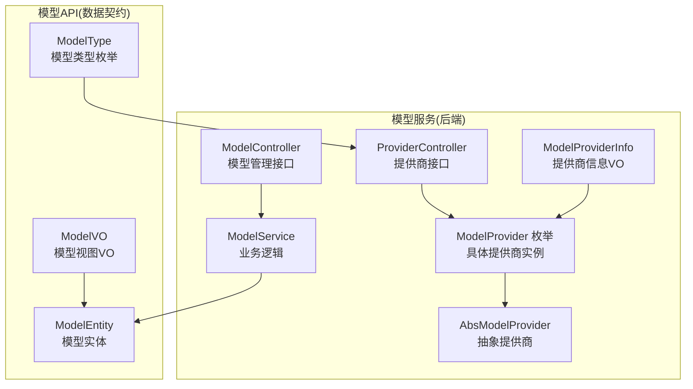
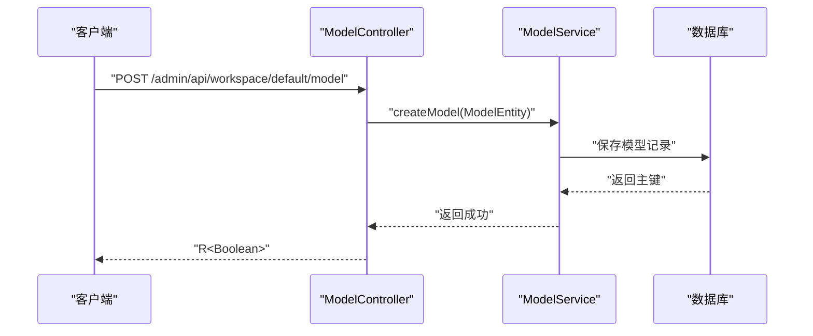
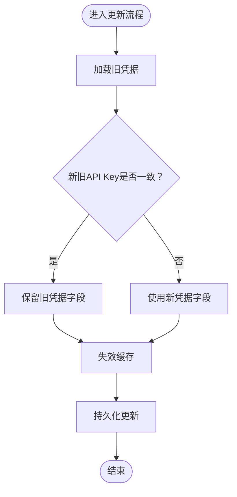
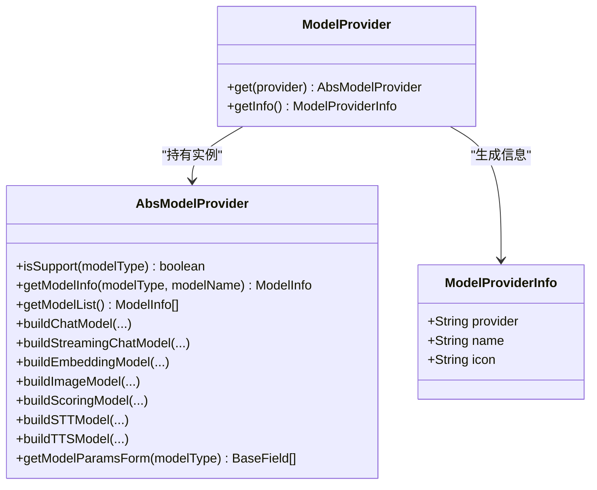
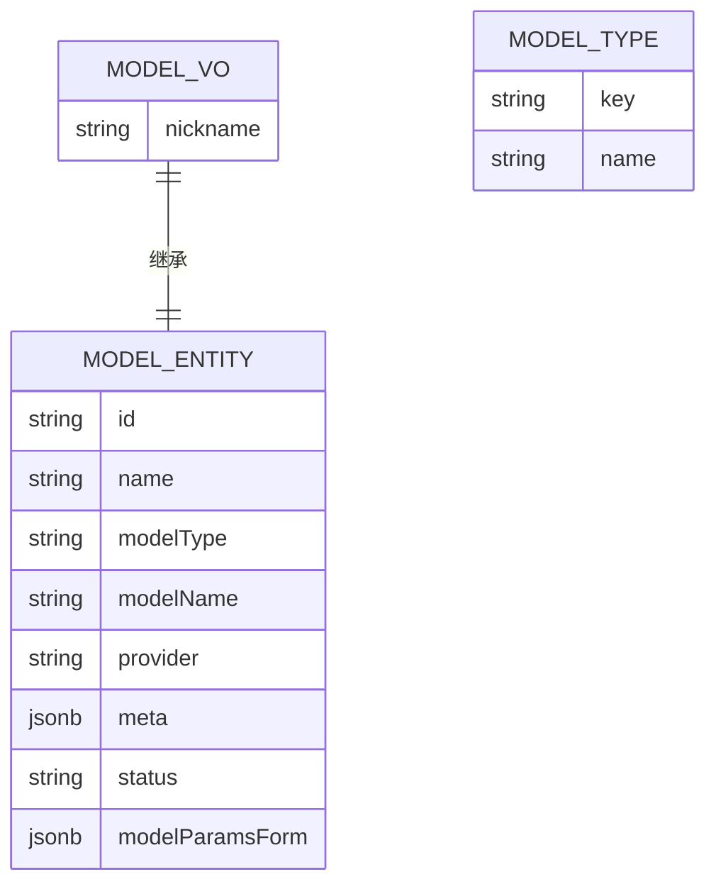
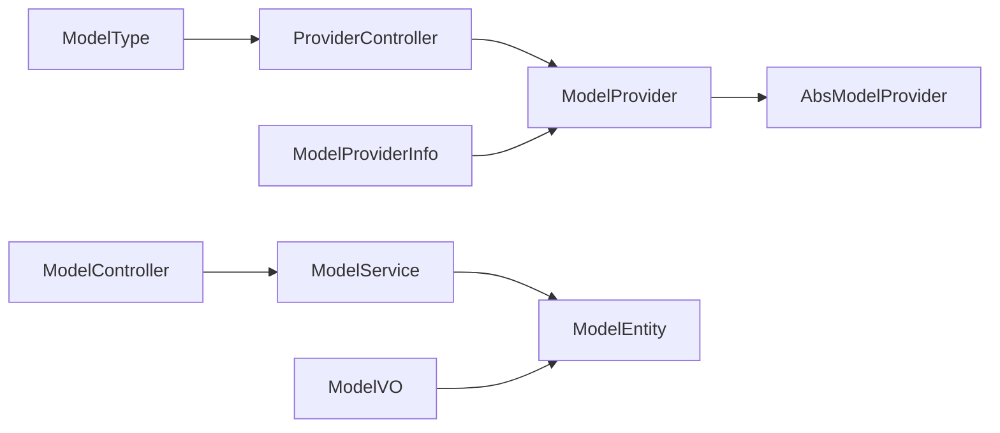

# 模型服务API

<cite>
**本文引用的文件**
- [ModelController.java](file://maxkb4j-service/maxkb4j-model/src/main/java/com/maxkb4j/model/controller/ModelController.java)
- [ProviderController.java](file://maxkb4j-service/maxkb4j-model/src/main/java/com/maxkb4j/model/controller/ProviderController.java)
- [ModelService.java](file://maxkb4j-service/maxkb4j-model/src/main/java/com/maxkb4j/model/service/ModelService.java)
- [AbsModelProvider.java](file://maxkb4j-service/maxkb4j-model/src/main/java/com/maxkb4j/model/provider/AbsModelProvider.java)
- [ModelProvider.java](file://maxkb4j-service/maxkb4j-model/src/main/java/com/maxkb4j/model/enums/ModelProvider.java)
- [ModelProviderInfo.java](file://maxkb4j-service/maxkb4j-model/src/main/java/com/maxkb4j/model/vo/ModelProviderInfo.java)
- [ModelEntity.java](file://maxkb4j-service-api/maxkb4j-model-api/src/main/java/com/maxkb4j/model/entity/ModelEntity.java)
- [ModelVO.java](file://maxkb4j-service-api/maxkb4j-model-api/src/main/java/com/maxkb4j/model/vo/ModelVO.java)
- [ModelType.java](file://maxkb4j-service-api/maxkb4j-model-api/src/main/java/com/maxkb4j/model/enums/ModelType.java)
</cite>

## 目录
1. [简介](#简介)
2. [项目结构](#项目结构)
3. [核心组件](#核心组件)
4. [架构总览](#架构总览)
5. [详细组件分析](#详细组件分析)
6. [依赖分析](#依赖分析)
7. [性能考虑](#性能考虑)
8. [故障排查指南](#故障排查指南)
9. [结论](#结论)
10. [附录](#附录)

## 简介
本文件面向开发者与运维人员，系统性梳理模型服务模块的API接口与实现机制，覆盖以下主题：
- 模型管理：注册、查询、更新、删除、参数表单配置
- 提供商集成：统一抽象与多提供商适配（OpenAI、Azure、Gemini、本地模型等）
- 参数与凭证：模型参数表单、凭据字段定义、敏感信息掩码
- 高级能力：权限控制、缓存策略、角色与资源授权

目标是帮助你在不深入源码的情况下，快速理解并正确集成各类AI模型服务。

## 项目结构
模型服务模块位于 maxkb4j-service/maxkb4j-model，对外通过控制器暴露REST API；模型实体、枚举与值对象位于 maxkb4j-service-api/maxkb4j-model-api 中，作为跨模块共享的数据契约。

**图表来源**
- [ModelController.java:21-85](file://maxkb4j-service/maxkb4j-model/src/main/java/com/maxkb4j/model/controller/ModelController.java#L21-L85)
- [ProviderController.java:27-88](file://maxkb4j-service/maxkb4j-model/src/main/java/com/maxkb4j/model/controller/ProviderController.java#L27-L88)
- [ModelService.java:40-173](file://maxkb4j-service/maxkb4j-model/src/main/java/com/maxkb4j/model/service/ModelService.java#L40-L173)
- [AbsModelProvider.java:36-244](file://maxkb4j-service/maxkb4j-model/src/main/java/com/maxkb4j/model/provider/AbsModelProvider.java#L36-L244)
- [ModelProvider.java:11-95](file://maxkb4j-service/maxkb4j-model/src/main/java/com/maxkb4j/model/enums/ModelProvider.java#L11-L95)
- [ModelProviderInfo.java:12-43](file://maxkb4j-service/maxkb4j-model/src/main/java/com/maxkb4j/model/vo/ModelProviderInfo.java#L12-L43)
- [ModelEntity.java:21-43](file://maxkb4j-service-api/maxkb4j-model-api/src/main/java/com/maxkb4j/model/entity/ModelEntity.java#L21-L43)
- [ModelVO.java:9-11](file://maxkb4j-service-api/maxkb4j-model-api/src/main/java/com/maxkb4j/model/vo/ModelVO.java#L9-L11)
- [ModelType.java:12-53](file://maxkb4j-service-api/maxkb4j-model-api/src/main/java/com/maxkb4j/model/enums/ModelType.java#L12-L53)

**章节来源**
- [ModelController.java:21-85](file://maxkb4j-service/maxkb4j-model/src/main/java/com/maxkb4j/model/controller/ModelController.java#L21-L85)
- [ProviderController.java:27-88](file://maxkb4j-service/maxkb4j-model/src/main/java/com/maxkb4j/model/controller/ProviderController.java#L27-L88)
- [ModelService.java:40-173](file://maxkb4j-service/maxkb4j-model/src/main/java/com/maxkb4j/model/service/ModelService.java#L40-L173)
- [AbsModelProvider.java:36-244](file://maxkb4j-service/maxkb4j-model/src/main/java/com/maxkb4j/model/provider/AbsModelProvider.java#L36-L244)
- [ModelProvider.java:11-95](file://maxkb4j-service/maxkb4j-model/src/main/java/com/maxkb4j/model/enums/ModelProvider.java#L11-L95)
- [ModelProviderInfo.java:12-43](file://maxkb4j-service/maxkb4j-model/src/main/java/com/maxkb4j/model/vo/ModelProviderInfo.java#L12-L43)
- [ModelEntity.java:21-43](file://maxkb4j-service-api/maxkb4j-model-api/src/main/java/com/maxkb4j/model/entity/ModelEntity.java#L21-L43)
- [ModelVO.java:9-11](file://maxkb4j-service-api/maxkb4j-model-api/src/main/java/com/maxkb4j/model/vo/ModelVO.java#L9-L11)
- [ModelType.java:12-53](file://maxkb4j-service-api/maxkb4j-model-api/src/main/java/com/maxkb4j/model/enums/ModelType.java#L12-L53)

## 核心组件
- 控制器层
  - ModelController：提供模型的增删改查、列表、参数表单读写等接口
  - ProviderController：提供提供商列表、模型类型、模型清单、凭据与参数表单等查询接口
- 服务层
  - ModelService：封装模型CRUD、权限过滤、缓存、敏感信息掩码等业务逻辑
- 抽象与枚举
  - AbsModelProvider：统一抽象各提供商的模型构建与表单生成
  - ModelProvider：枚举所有支持的提供商，并延迟创建具体提供商实例
  - ModelType：模型类型枚举（LLM、EMBEDDING、STT、TTS、VISION、TTI、RERANKER）

**章节来源**
- [ModelController.java:21-85](file://maxkb4j-service/maxkb4j-model/src/main/java/com/maxkb4j/model/controller/ModelController.java#L21-L85)
- [ProviderController.java:27-88](file://maxkb4j-service/maxkb4j-model/src/main/java/com/maxkb4j/model/controller/ProviderController.java#L27-L88)
- [ModelService.java:40-173](file://maxkb4j-service/maxkb4j-model/src/main/java/com/maxkb4j/model/service/ModelService.java#L40-L173)
- [AbsModelProvider.java:36-244](file://maxkb4j-service/maxkb4j-model/src/main/java/com/maxkb4j/model/provider/AbsModelProvider.java#L36-L244)
- [ModelProvider.java:11-95](file://maxkb4j-service/maxkb4j-model/src/main/java/com/maxkb4j/model/enums/ModelProvider.java#L11-L95)
- [ModelType.java:12-53](file://maxkb4j-service-api/maxkb4j-model-api/src/main/java/com/maxkb4j/model/enums/ModelType.java#L12-L53)

## 架构总览
模型服务采用“控制器-服务-抽象提供商”的分层设计，控制器负责HTTP请求与响应包装，服务层处理业务规则与数据访问，抽象提供商屏蔽不同供应商差异，枚举与VO作为跨模块契约。

**图表来源**
- [ModelController.java:28-32](file://maxkb4j-service/maxkb4j-model/src/main/java/com/maxkb4j/model/controller/ModelController.java#L28-L32)
- [ModelService.java:103-118](file://maxkb4j-service/maxkb4j-model/src/main/java/com/maxkb4j/model/service/ModelService.java#L103-L118)

## 详细组件分析

### 模型管理接口（ModelController）
- 接口概览
  - 新增模型：POST /admin/api/workspace/default/model
  - 查询列表：GET /admin/api/workspace/default/model
  - 分组列表：GET /admin/api/workspace/default/model_list
  - 获取详情：GET /admin/api/workspace/default/model/{id}
  - 更新模型：PUT /admin/api/workspace/default/model/{id}
  - 删除模型：DELETE /admin/api/workspace/default/model/{id}
  - 获取参数表单：GET /admin/api/workspace/default/model/{id}/model_params_form
  - 更新参数表单：PUT /admin/api/workspace/default/model/{id}/model_params_form

- 关键行为
  - 权限控制：基于注解对每项操作进行权限校验
  - 列表过滤：支持按名称、创建人、模型类型、提供商过滤
  - 角色与授权：根据登录用户角色与资源授权限制可见范围
  - 敏感信息掩码：在返回模型详情时对API Key进行掩码处理

- 数据契约
  - 请求体：ModelEntity
  - 返回体：R<T> 包裹业务结果或列表

**章节来源**
- [ModelController.java:28-84](file://maxkb4j-service/maxkb4j-model/src/main/java/com/maxkb4j/model/controller/ModelController.java#L28-L84)
- [ModelEntity.java:21-43](file://maxkb4j-service-api/maxkb4j-model-api/src/main/java/com/maxkb4j/model/entity/ModelEntity.java#L21-L43)

### 提供商与模型查询接口（ProviderController）
- 接口概览
  - 获取提供商列表：GET /admin/api/provider
  - 获取模型类型列表：GET /admin/api/provider/model_type_list
  - 获取模型凭据表单：GET /admin/api/provider/model_form
  - 获取模型参数表单：GET /admin/api/provider/model_params_form
  - 获取模型清单：GET /admin/api/provider/model_list

- 关键行为
  - 按模型类型筛选提供商：当传入modelType时仅返回支持该类型的提供商
  - 按提供商查询模型类型与模型清单：返回可用模型集合及分组
  - 表单生成：根据提供商与模型类型动态生成凭据与参数表单

**章节来源**
- [ProviderController.java:31-85](file://maxkb4j-service/maxkb4j-model/src/main/java/com/maxkb4j/model/controller/ProviderController.java#L31-L85)
- [ModelProvider.java:77-82](file://maxkb4j-service/maxkb4j-model/src/main/java/com/maxkb4j/model/enums/ModelProvider.java#L77-L82)
- [ModelType.java:43-51](file://maxkb4j-service-api/maxkb4j-model-api/src/main/java/com/maxkb4j/model/enums/ModelType.java#L43-L51)

### 服务层逻辑（ModelService）
- 列表查询与权限过滤
  - 支持多条件过滤与排序
  - 用户角色为普通用户时，仅返回其被授权的模型
- 创建模型
  - 校验名称唯一性
  - 初始化参数表单与元数据
  - 设置默认状态并建立资源所有权
- 更新与删除
  - 更新时保留部分敏感字段原值（掩码态）
  - 删除时清理授权并移除记录
- 缓存与安全
  - 模型详情缓存（读写/访问过期）
  - 返回详情前对API Key进行掩码

**图表来源**
- [ModelService.java:120-131](file://maxkb4j-service/maxkb4j-model/src/main/java/com/maxkb4j/model/service/ModelService.java#L120-L131)

**章节来源**
- [ModelService.java:54-173](file://maxkb4j-service/maxkb4j-model/src/main/java/com/maxkb4j/model/service/ModelService.java#L54-L173)

### 抽象提供商与具体实现（AbsModelProvider / ModelProvider）
- 抽象能力
  - 统一的HTTP客户端构建
  - 参数解析工具方法（字符串/整数/浮点/布尔）
  - 模型构建入口（聊天、流式聊天、嵌入、图像、评分、STT、TTS）
  - 表单生成（凭据与参数）
- 枚举映射
  - ModelProvider枚举维护提供商到具体实现的映射
  - 提供静态查找方法与信息对象

**图表来源**
- [AbsModelProvider.java:36-244](file://maxkb4j-service/maxkb4j-model/src/main/java/com/maxkb4j/model/provider/AbsModelProvider.java#L36-L244)
- [ModelProvider.java:48-94](file://maxkb4j-service/maxkb4j-model/src/main/java/com/maxkb4j/model/enums/ModelProvider.java#L48-L94)
- [ModelProviderInfo.java:25-33](file://maxkb4j-service/maxkb4j-model/src/main/java/com/maxkb4j/model/vo/ModelProviderInfo.java#L25-L33)

**章节来源**
- [AbsModelProvider.java:36-244](file://maxkb4j-service/maxkb4j-model/src/main/java/com/maxkb4j/model/provider/AbsModelProvider.java#L36-L244)
- [ModelProvider.java:48-94](file://maxkb4j-service/maxkb4j-model/src/main/java/com/maxkb4j/model/enums/ModelProvider.java#L48-L94)
- [ModelProviderInfo.java:12-43](file://maxkb4j-service/maxkb4j-model/src/main/java/com/maxkb4j/model/vo/ModelProviderInfo.java#L12-L43)

### 数据模型与类型
- ModelEntity：模型实体，包含名称、类型、提供商、凭据、用户ID、元数据、状态、参数表单等字段
- ModelVO：在实体基础上扩展昵称字段，用于列表展示
- ModelType：模型类型枚举，覆盖LLM、EMBEDDING、STT、TTS、VISION、TTI、RERANKER

**图表来源**
- [ModelEntity.java:21-43](file://maxkb4j-service-api/maxkb4j-model-api/src/main/java/com/maxkb4j/model/entity/ModelEntity.java#L21-L43)
- [ModelVO.java:9-11](file://maxkb4j-service-api/maxkb4j-model-api/src/main/java/com/maxkb4j/model/vo/ModelVO.java#L9-L11)
- [ModelType.java:12-53](file://maxkb4j-service-api/maxkb4j-model-api/src/main/java/com/maxkb4j/model/enums/ModelType.java#L12-L53)

**章节来源**
- [ModelEntity.java:21-43](file://maxkb4j-service-api/maxkb4j-model-api/src/main/java/com/maxkb4j/model/entity/ModelEntity.java#L21-L43)
- [ModelVO.java:9-11](file://maxkb4j-service-api/maxkb4j-model-api/src/main/java/com/maxkb4j/model/vo/ModelVO.java#L9-L11)
- [ModelType.java:12-53](file://maxkb4j-service-api/maxkb4j-model-api/src/main/java/com/maxkb4j/model/enums/ModelType.java#L12-L53)

## 依赖分析
- 控制器依赖服务层，服务层依赖数据访问与用户权限服务
- 提供商查询由枚举与抽象类协作完成，抽象类提供通用能力，枚举负责实例化
- VO与实体作为跨模块契约，保持接口稳定性

**图表来源**
- [ModelController.java:21-85](file://maxkb4j-service/maxkb4j-model/src/main/java/com/maxkb4j/model/controller/ModelController.java#L21-L85)
- [ProviderController.java:27-88](file://maxkb4j-service/maxkb4j-model/src/main/java/com/maxkb4j/model/controller/ProviderController.java#L27-L88)
- [ModelService.java:40-173](file://maxkb4j-service/maxkb4j-model/src/main/java/com/maxkb4j/model/service/ModelService.java#L40-L173)
- [AbsModelProvider.java:36-244](file://maxkb4j-service/maxkb4j-model/src/main/java/com/maxkb4j/model/provider/AbsModelProvider.java#L36-L244)
- [ModelProvider.java:11-95](file://maxkb4j-service/maxkb4j-model/src/main/java/com/maxkb4j/model/enums/ModelProvider.java#L11-L95)
- [ModelProviderInfo.java:12-43](file://maxkb4j-service/maxkb4j-model/src/main/java/com/maxkb4j/model/vo/ModelProviderInfo.java#L12-L43)
- [ModelEntity.java:21-43](file://maxkb4j-service-api/maxkb4j-model-api/src/main/java/com/maxkb4j/model/entity/ModelEntity.java#L21-L43)
- [ModelVO.java:9-11](file://maxkb4j-service-api/maxkb4j-model-api/src/main/java/com/maxkb4j/model/vo/ModelVO.java#L9-L11)
- [ModelType.java:12-53](file://maxkb4j-service-api/maxkb4j-model-api/src/main/java/com/maxkb4j/model/enums/ModelType.java#L12-L53)

**章节来源**
- [ModelController.java:21-85](file://maxkb4j-service/maxkb4j-model/src/main/java/com/maxkb4j/model/controller/ModelController.java#L21-L85)
- [ProviderController.java:27-88](file://maxkb4j-service/maxkb4j-model/src/main/java/com/maxkb4j/model/controller/ProviderController.java#L27-L88)
- [ModelService.java:40-173](file://maxkb4j-service/maxkb4j-model/src/main/java/com/maxkb4j/model/service/ModelService.java#L40-L173)
- [AbsModelProvider.java:36-244](file://maxkb4j-service/maxkb4j-model/src/main/java/com/maxkb4j/model/provider/AbsModelProvider.java#L36-L244)
- [ModelProvider.java:11-95](file://maxkb4j-service/maxkb4j-model/src/main/java/com/maxkb4j/model/enums/ModelProvider.java#L11-L95)
- [ModelProviderInfo.java:12-43](file://maxkb4j-service/maxkb4j-model/src/main/java/com/maxkb4j/model/vo/ModelProviderInfo.java#L12-L43)
- [ModelEntity.java:21-43](file://maxkb4j-service-api/maxkb4j-model-api/src/main/java/com/maxkb4j/model/entity/ModelEntity.java#L21-L43)
- [ModelVO.java:9-11](file://maxkb4j-service-api/maxkb4j-model-api/src/main/java/com/maxkb4j/model/vo/ModelVO.java#L9-L11)
- [ModelType.java:12-53](file://maxkb4j-service-api/maxkb4j-model-api/src/main/java/com/maxkb4j/model/enums/ModelType.java#L12-L53)

## 性能考虑
- 缓存策略：模型详情使用本地缓存（写/访问过期），减少频繁读取数据库的压力
- 查询优化：列表查询支持多条件过滤与排序，建议前端传入必要过滤参数以缩小结果集
- 并发安全：抽象提供商的HTTP客户端构建采用延迟初始化与同步块，避免重复初始化开销

**章节来源**
- [ModelService.java:45-52](file://maxkb4j-service/maxkb4j-model/src/main/java/com/maxkb4j/model/service/ModelService.java#L45-L52)
- [AbsModelProvider.java:44-60](file://maxkb4j-service/maxkb4j-model/src/main/java/com/maxkb4j/model/provider/AbsModelProvider.java#L44-L60)

## 故障排查指南
- 权限不足
  - 现象：返回未授权或空列表
  - 处理：确认当前登录用户的角色与资源授权
- 模型名称冲突
  - 现象：创建失败，提示名称已存在
  - 处理：更换唯一名称后重试
- 凭据掩码问题
  - 现象：返回的API Key被掩码
  - 处理：更新时若未修改API Key，系统会保留掩码态；需重新提交完整凭据
- 提供商不可用
  - 现象：查询提供商或模型表单为空
  - 处理：检查提供商名称是否正确，以及对应实现是否启用

**章节来源**
- [ModelService.java:106-109](file://maxkb4j-service/maxkb4j-model/src/main/java/com/maxkb4j/model/service/ModelService.java#L106-L109)
- [ModelService.java:140-149](file://maxkb4j-service/maxkb4j-model/src/main/java/com/maxkb4j/model/service/ModelService.java#L140-L149)
- [ProviderController.java:65-67](file://maxkb4j-service/maxkb4j-model/src/main/java/com/maxkb4j/model/controller/ProviderController.java#L65-L67)

## 结论
模型服务模块通过清晰的分层与抽象，实现了对多提供商模型的统一管理与灵活扩展。开发者可通过标准API完成模型的注册、配置、测试与删除，并借助参数与凭据表单实现细粒度的配置与安全管控。配合缓存与权限机制，可在保证安全性的同时提升运行效率。

## 附录
- 快速对照
  - 模型管理：POST/GET/PUT/DELETE /admin/api/workspace/default/model*
  - 提供商查询：GET /admin/api/provider*
  - 模型类型与清单：GET /admin/api/provider/model_type_list /model_list
  - 表单生成：GET /admin/api/provider/model_form /model_params_form