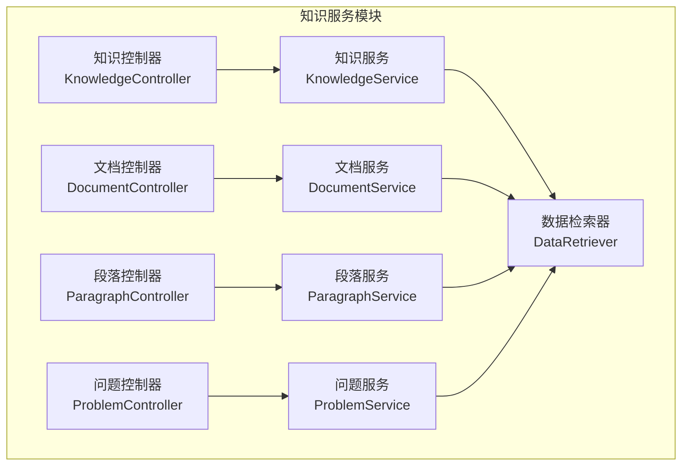
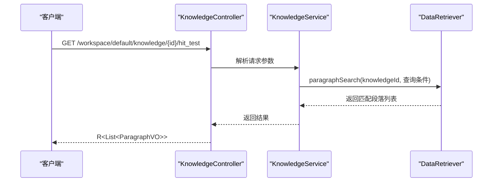
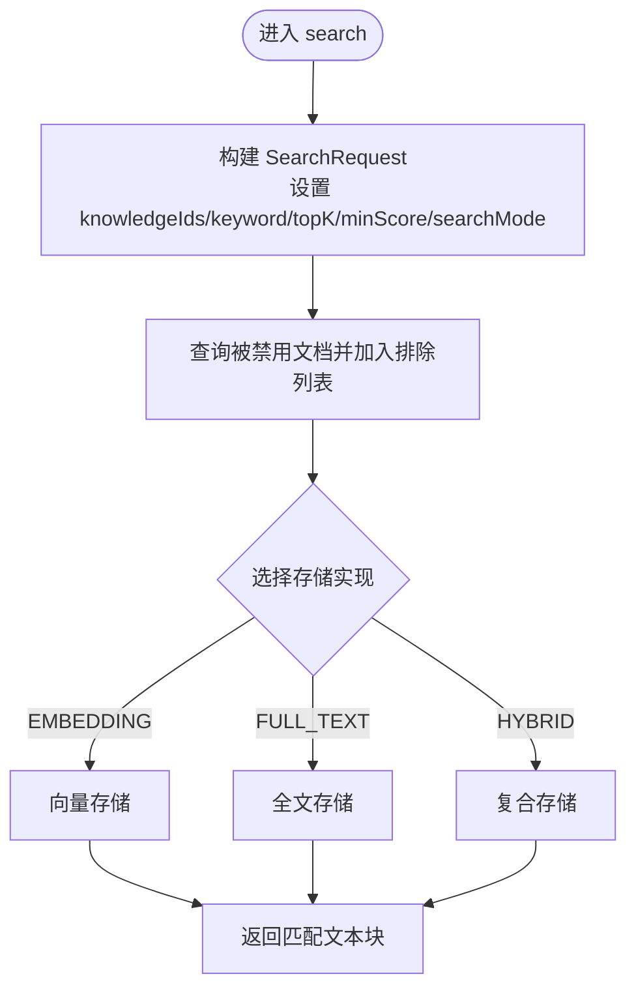
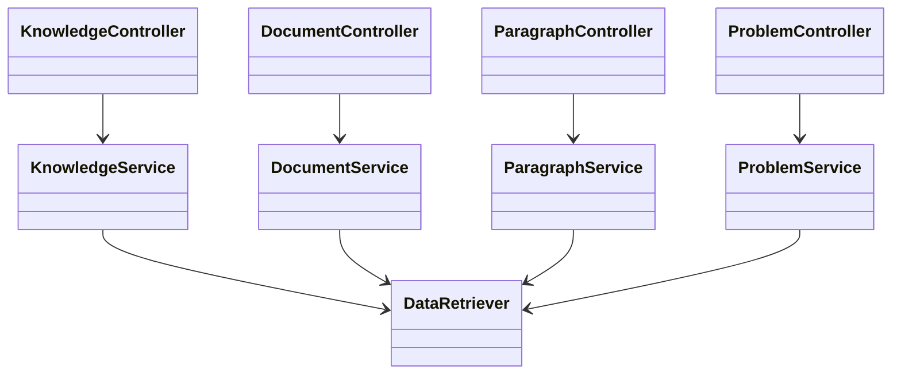

# 知识服务API

<cite>
**本文引用的文件**
- [知识控制器 KnowledgeController.java](file://maxkb4j-service/maxkb4j-knowledge/src/main/java/com/maxkb4j/knowledge/controller/KnowledgeController.java)
- [文档控制器 DocumentController.java](file://maxkb4j-service/maxkb4j-knowledge/src/main/java/com/maxkb4j/knowledge/controller/DocumentController.java)
- [段落控制器 ParagraphController.java](file://maxkb4j-service/maxkb4j-knowledge/src/main/java/com/maxkb4j/knowledge/controller/ParagraphController.java)
- [问题控制器 ProblemController.java](file://maxkb4j-service/maxkb4j-knowledge/src/main/java/com/maxkb4j/knowledge/controller/ProblemController.java)
- [数据检索器 DataRetriever.java](file://maxkb4j-service/maxkb4j-knowledge/src/main/java/com/maxkb4j/knowledge/retriever/DataRetriever.java)
- [知识服务 KnowledgeService.java](file://maxkb4j-service/maxkb4j-knowledge/src/main/java/com/maxkb4j/knowledge/service/KnowledgeService.java)
- [文档服务 DocumentService.java](file://maxkb4j-service/maxkb4j-knowledge/src/main/java/com/maxkb4j/knowledge/service/DocumentService.java)
- [段落服务 ParagraphService.java](file://maxkb4j-service/maxkb4j-knowledge/src/main/java/com/maxkb4j/knowledge/service/ParagraphService.java)
- [问题服务 ProblemService.java](file://maxkb4j-service/maxkb4j-knowledge/src/main/java/com/maxkb4j/knowledge/service/ProblemService.java)
- [生成问题DTO GenerateProblemDTO.java](file://maxkb4j-service-api/maxkb4j-knowledge-api/src/main/java/com/maxkb4j/knowledge/dto/GenerateProblemDTO.java)
- [知识实体 KnowledgeEntity.java](file://maxkb4j-service-api/maxkb4j-knowledge-api/src/main/java/com/maxkb4j/knowledge/entity/KnowledgeEntity.java)
- [文档实体 DocumentEntity.java](file://maxkb4j-service-api/maxkb4j-knowledge-api/src/main/java/com/maxkb4j/knowledge/entity/DocumentEntity.java)
- [段落实体 ParagraphEntity.java](file://maxkb4j-service-api/maxkb4j-knowledge-api/src/main/java/com/maxkb4j/knowledge/entity/ParagraphEntity.java)
- [问题实体 ProblemEntity.java](file://maxkb4j-service-api/maxkb4j-knowledge-api/src/main/java/com/maxkb4j/knowledge/entity/ProblemEntity.java)
</cite>

## 目录
1. [简介](#简介)
2. [项目结构](#项目结构)
3. [核心组件](#核心组件)
4. [架构总览](#架构总览)
5. [详细组件与API规范](#详细组件与api规范)
6. [依赖关系分析](#依赖关系分析)
7. [性能与扩展性](#性能与扩展性)
8. [故障排查指南](#故障排查指南)
9. [结论](#结论)
10. [附录](#附录)

## 简介
本文件为 MaxKB4j 知识服务模块的全面 API 接口文档，覆盖知识库管理、文档处理、段落管理、问题管理等核心能力，并提供向量化检索、全文检索、混合检索等高级功能的接口规范。文档同时给出文件上传格式、解析器支持、分段策略等技术细节，帮助开发者快速理解并正确使用知识服务。

## 项目结构
知识服务模块位于 maxkb4j-service/maxkb4j-knowledge 下，采用按功能域分层的组织方式：
- 控制器层：对外暴露 REST API，负责权限校验、参数接收与响应封装
- 服务层：实现业务逻辑，协调存储、事件、工作流等子系统
- 实体与DTO：定义数据模型与请求/响应载体
- 检索器：统一多模式检索入口（向量、全文、混合）

图表来源
- [知识控制器 KnowledgeController.java:36-187](file://maxkb4j-service/maxkb4j-knowledge/src/main/java/com/maxkb4j/knowledge/controller/KnowledgeController.java#L36-L187)
- [文档控制器 DocumentController.java:27-177](file://maxkb4j-service/maxkb4j-knowledge/src/main/java/com/maxkb4j/knowledge/controller/DocumentController.java#L27-L177)
- [段落控制器 ParagraphController.java:20-100](file://maxkb4j-service/maxkb4j-knowledge/src/main/java/com/maxkb4j/knowledge/controller/ParagraphController.java#L20-L100)
- [问题控制器 ProblemController.java:23-75](file://maxkb4j-service/maxkb4j-knowledge/src/main/java/com/maxkb4j/knowledge/controller/ProblemController.java#L23-L75)
- [数据检索器 DataRetriever.java:25-65](file://maxkb4j-service/maxkb4j-knowledge/src/main/java/com/maxkb4j/knowledge/retriever/DataRetriever.java#L25-L65)

章节来源
- [知识控制器 KnowledgeController.java:36-187](file://maxkb4j-service/maxkb4j-knowledge/src/main/java/com/maxkb4j/knowledge/controller/KnowledgeController.java#L36-L187)
- [文档控制器 DocumentController.java:27-177](file://maxkb4j-service/maxkb4j-knowledge/src/main/java/com/maxkb4j/knowledge/controller/DocumentController.java#L27-L177)
- [段落控制器 ParagraphController.java:20-100](file://maxkb4j-service/maxkb4j-knowledge/src/main/java/com/maxkb4j/knowledge/controller/ParagraphController.java#L20-L100)
- [问题控制器 ProblemController.java:23-75](file://maxkb4j-service/maxkb4j-knowledge/src/main/java/com/maxkb4j/knowledge/controller/ProblemController.java#L23-L75)
- [数据检索器 DataRetriever.java:25-65](file://maxkb4j-service/maxkb4j-knowledge/src/main/java/com/maxkb4j/knowledge/retriever/DataRetriever.java#L25-L65)

## 核心组件
- 知识库管理：创建、更新、删除、查询、版本管理、发布、导出、调试工作流、向量化触发、命中测试等
- 文档处理：本地/网页导入、解析、分段、同步、迁移、批量处理、向量化刷新、导出、替换源文件、下载源文件
- 段落管理：增删改查、批量删除、位置调整、批量生成问题、与问题关联/解绑、跨知识库迁移
- 问题管理：批量创建、单条创建、更新、删除、分页查询、关联段落查询
- 检索服务：向量检索、全文检索、混合检索、排除策略、最小相似度控制

章节来源
- [知识服务 KnowledgeService.java:66-396](file://maxkb4j-service/maxkb4j-knowledge/src/main/java/com/maxkb4j/knowledge/service/KnowledgeService.java#L66-L396)
- [文档服务 DocumentService.java:62-449](file://maxkb4j-service/maxkb4j-knowledge/src/main/java/com/maxkb4j/knowledge/service/DocumentService.java#L62-L449)
- [段落服务 ParagraphService.java:40-359](file://maxkb4j-service/maxkb4j-knowledge/src/main/java/com/maxkb4j/knowledge/service/ParagraphService.java#L40-L359)
- [问题服务 ProblemService.java:37-227](file://maxkb4j-service/maxkb4j-knowledge/src/main/java/com/maxkb4j/knowledge/service/ProblemService.java#L37-L227)

## 架构总览
知识服务通过控制器接收请求，调用对应服务进行业务处理，服务层协调事件发布、工作流执行、存储写入与检索器查询。检索器根据搜索模式路由至向量、全文或复合存储。

图表来源
- [知识控制器 KnowledgeController.java:84-88](file://maxkb4j-service/maxkb4j-knowledge/src/main/java/com/maxkb4j/knowledge/controller/KnowledgeController.java#L84-L88)
- [数据检索器 DataRetriever.java:41-56](file://maxkb4j-service/maxkb4j-knowledge/src/main/java/com/maxkb4j/knowledge/retriever/DataRetriever.java#L41-L56)

## 详细组件与API规范

### 知识库管理API
- 列表与分页
  - GET /workspace/default/knowledge
  - GET /workspace/default/knowledge/{current}/{size}
- 基础类型知识库
  - POST /workspace/default/knowledge/base
- 网页类型知识库
  - POST /workspace/default/knowledge/web
- 工作流类型知识库
  - POST /workspace/default/knowledge/workflow
- 更新工作流
  - PUT /workspace/default/knowledge/{id}/workflow
- 查询详情
  - GET /workspace/default/knowledge/{id}
- 命中测试
  - PUT /workspace/default/knowledge/{id}/hit_test
- 更新知识库
  - PUT /workspace/default/knowledge/{id}
- 触发向量化
  - PUT /workspace/default/knowledge/{id}/embedding
- 批量生成关联问题
  - PUT /workspace/default/knowledge/{id}/generate_related
- 删除与批量删除
  - DELETE /workspace/default/knowledge/{id}
  - DELETE /workspace/default/knowledge/batchDelete
- 导出
  - GET /workspace/default/knowledge/{id}/export
  - GET /workspace/default/knowledge/{id}/export_zip
- 数据源表单
  - POST /workspace/default/knowledge/{id}/datasource/local/{nodeType}/form_list
- 调试工作流
  - POST /workspace/default/knowledge/{id}/debug
- 发布
  - PUT /workspace/default/knowledge/{id}/publish
- 版本管理
  - GET /workspace/default/knowledge/{id}/knowledge_version
  - PUT /workspace/default/knowledge/{id}/knowledge_version/{versionId}
- 行为记录分页
  - GET /workspace/default/knowledge/{id}/action/{current}/{size}
- 上传文档（工作流）
  - POST /workspace/default/knowledge/{id}/upload_document
- 行为详情
  - GET /workspace/default/knowledge/{id}/action/{actionId}

章节来源
- [知识控制器 KnowledgeController.java:45-180](file://maxkb4j-service/maxkb4j-knowledge/src/main/java/com/maxkb4j/knowledge/controller/KnowledgeController.java#L45-L180)
- [知识服务 KnowledgeService.java:166-328](file://maxkb4j-service/maxkb4j-knowledge/src/main/java/com/maxkb4j/knowledge/service/KnowledgeService.java#L166-L328)

### 文档处理API
- 网页导入
  - POST /workspace/default/knowledge/{id}/document/web
- 同步网页文档
  - PUT /workspace/default/knowledge/{id}/document/{docId}/sync
- QA 导入
  - POST /workspace/default/knowledge/{id}/document/qa
- 表格导入
  - POST /workspace/default/knowledge/{id}/document/table
- 文件分段预览
  - POST /workspace/default/knowledge/{id}/document/split
- 批量创建文档
  - PUT /workspace/default/knowledge/{id}/document/batch_create
- 分段规则
  - GET /workspace/default/knowledge/{id}/document/split_pattern
- 文档列表
  - GET /workspace/default/knowledge/{id}/document
- 批量生成关联问题
  - PUT /workspace/default/knowledge/{id}/document/batch_generate_related
- 迁移文档
  - PUT /workspace/default/knowledge/{id}/document/migrate/{targetKnowledgeId}
- 批量命中处理策略
  - PUT /workspace/default/knowledge/{id}/document/batch_hit_handling
- 批量删除文档
  - PUT /workspace/default/knowledge/{id}/document/batch_delete
- 查询文档详情
  - GET /workspace/default/knowledge/{id}/document/{docId}
- 刷新向量化
  - PUT /workspace/default/knowledge/{id}/document/{docId}/refresh
  - PUT /workspace/default/knowledge/{id}/document/batch_refresh
- 取消任务
  - PUT /workspace/default/knowledge/{id}/document/{docId}/cancel_task
- 更新文档
  - PUT /workspace/default/knowledge/{id}/document/{docId}
- 删除文档
  - DELETE /workspace/default/knowledge/{id}/document/{docId}
- 文档分页
  - GET /workspace/default/knowledge/{id}/document/{current}/{size}
- 导出Excel
  - GET /workspace/default/knowledge/{id}/document/{docId}/export
- 导出Zip
  - GET /workspace/default/knowledge/{id}/document/{docId}/export_zip
- 下载源文件
  - GET /workspace/default/knowledge/{id}/document/{docId}/download_source_file
- 替换源文件
  - POST /workspace/default/knowledge/{id}/document/{docId}/replace_source_file

章节来源
- [文档控制器 DocumentController.java:34-174](file://maxkb4j-service/maxkb4j-knowledge/src/main/java/com/maxkb4j/knowledge/controller/DocumentController.java#L34-L174)
- [文档服务 DocumentService.java:124-447](file://maxkb4j-service/maxkb4j-knowledge/src/main/java/com/maxkb4j/knowledge/service/DocumentService.java#L124-L447)

### 段落管理API
- 新增段落
  - POST /workspace/default/knowledge/{id}/document/{docId}/paragraph
- 分段列表
  - GET /workspace/default/knowledge/{id}/document/{docId}/paragraph/{current}/{size}
- 更新段落
  - PUT /workspace/default/knowledge/{id}/document/{docId}/paragraph/{paragraphId}
- 关联问题
  - PUT /workspace/default/knowledge/{id}/document/{docId}/paragraph/association
- 删除段落
  - DELETE /workspace/default/knowledge/{id}/document/{docId}/paragraph/{paragraphId}
- 批量删除段落
  - PUT /workspace/default/knowledge/{id}/document/{docId}/paragraph/batch_delete
- 批量生成问题
  - PUT /workspace/default/knowledge/{id}/document/{docId}/paragraph/batch_generate_related
- 查询段落关联问题
  - GET /workspace/default/knowledge/{id}/document/{docId}/paragraph/{paragraphId}/problem
- 解除关联
  - PUT /workspace/default/knowledge/{id}/document/{docId}/paragraph/un_association
- 段落迁移
  - PUT /workspace/default/knowledge/{id}/document/{sourceDocId}/paragraph/migrate/knowledge/{targetKnowledgeId}/document/{targetDocId}
- 调整位置
  - PUT /workspace/default/knowledge/{id}/document/{documentId}/paragraph/adjust_position

章节来源
- [段落控制器 ParagraphController.java:29-98](file://maxkb4j-service/maxkb4j-knowledge/src/main/java/com/maxkb4j/knowledge/controller/ParagraphController.java#L29-L98)
- [段落服务 ParagraphService.java:155-339](file://maxkb4j-service/maxkb4j-knowledge/src/main/java/com/maxkb4j/knowledge/service/ParagraphService.java#L155-L339)

### 问题管理API
- 批量创建问题（基于知识库）
  - POST /workspace/default/knowledge/{id}/problem
- 基于段落创建问题
  - POST /workspace/default/knowledge/{id}/document/{documentId}/paragraph/{paragraphId}/problem
- 更新问题
  - PUT /workspace/default/knowledge/{id}/problem/{problemId}
- 删除问题
  - DELETE /workspace/default/knowledge/{id}/problem/{problemId}
- 批量删除问题
  - PUT /workspace/default/knowledge/{id}/problem/batch_delete
- 问题分页
  - GET /workspace/default/knowledge/{id}/problem/{page}/{size}
- 查询问题关联段落
  - GET /workspace/default/knowledge/{id}/problem/{problemId}/paragraph

章节来源
- [问题控制器 ProblemController.java:31-72](file://maxkb4j-service/maxkb4j-knowledge/src/main/java/com/maxkb4j/knowledge/controller/ProblemController.java#L31-L72)
- [问题服务 ProblemService.java:144-214](file://maxkb4j-service/maxkb4j-knowledge/src/main/java/com/maxkb4j/knowledge/service/ProblemService.java#L144-L214)

### 高级检索API
- 搜索模式
  - EMBEDDING：向量检索
  - FULL_TEXT：全文检索
  - HYBRID：混合检索
- 请求参数
  - knowledgeIds：知识库ID列表
  - excludeParagraphIds：排除段落ID列表
  - keyword：关键词
  - topK：返回条数
  - minScore：最小相似度
  - searchMode：搜索模式
- 响应
  - 文本块列表（包含标题、内容、相似度等）

图表来源
- [数据检索器 DataRetriever.java:41-65](file://maxkb4j-service/maxkb4j-knowledge/src/main/java/com/maxkb4j/knowledge/retriever/DataRetriever.java#L41-L65)

章节来源
- [数据检索器 DataRetriever.java:28-65](file://maxkb4j-service/maxkb4j-knowledge/src/main/java/com/maxkb4j/knowledge/retriever/DataRetriever.java#L28-L65)

## 依赖关系分析
- 控制器依赖服务层，服务层依赖存储与事件系统
- 检索器聚合多种存储实现，按搜索模式动态路由
- 知识服务与文档服务之间存在事件交互（如文档索引、问题生成）

图表来源
- [知识控制器 KnowledgeController.java:39-42](file://maxkb4j-service/maxkb4j-knowledge/src/main/java/com/maxkb4j/knowledge/controller/KnowledgeController.java#L39-L42)
- [文档控制器 DocumentController.java:32-32](file://maxkb4j-service/maxkb4j-knowledge/src/main/java/com/maxkb4j/knowledge/controller/DocumentController.java#L32-L32)
- [段落控制器 ParagraphController.java:25-26](file://maxkb4j-service/maxkb4j-knowledge/src/main/java/com/maxkb4j/knowledge/controller/ParagraphController.java#L25-L26)
- [问题控制器 ProblemController.java:28-29](file://maxkb4j-service/maxkb4j-knowledge/src/main/java/com/maxkb4j/knowledge/controller/ProblemController.java#L28-L29)
- [数据检索器 DataRetriever.java:30-33](file://maxkb4j-service/maxkb4j-knowledge/src/main/java/com/maxkb4j/knowledge/retriever/DataRetriever.java#L30-L33)

## 性能与扩展性
- 批量操作：服务层提供批量创建、批量更新、批量删除与批量索引，减少往返开销
- 异步事件：文档索引、问题生成、网页同步等通过事件发布，降低请求延迟
- 存储抽象：检索器统一调度不同存储实现，便于横向扩展新的检索后端
- 分页与过滤：控制器与服务层均提供分页与条件过滤，提升大数据量场景下的可用性

## 故障排查指南
- 权限不足
  - 确认用户具备相应权限枚举（如 KNOWLEDGE_READ、KNOWLEDGE_CREATE、KNOWLEDGE_EDIT 等）
- 文件限制
  - 当上传文件数量超过知识库配置的 fileCountLimit 或单文件大小超过 fileSizeLimit 时，将触发异常
- 源文件不可用
  - 下载源文件仅支持手动上传的文档；若返回失败，请确认文档元数据中存在 sourceFileId 且允许下载
- 搜索无结果
  - 检查 searchMode 是否正确，minScore 是否过高，或是否存在被禁用文档导致被排除
- 向量化/问题生成卡住
  - 可通过取消任务接口终止特定文档的任务状态；检查任务状态字段的第三位（向量化）或第二位（问题生成）

章节来源
- [文档服务 DocumentService.java:421-447](file://maxkb4j-service/maxkb4j-knowledge/src/main/java/com/maxkb4j/knowledge/service/DocumentService.java#L421-L447)
- [文档控制器 DocumentController.java:125-129](file://maxkb4j-service/maxkb4j-knowledge/src/main/java/com/maxkb4j/knowledge/controller/DocumentController.java#L125-L129)
- [数据检索器 DataRetriever.java:51-54](file://maxkb4j-service/maxkb4j-knowledge/src/main/java/com/maxkb4j/knowledge/retriever/DataRetriever.java#L51-L54)

## 结论
本知识服务API覆盖了从知识库到文档、段落到问题的全链路管理能力，并提供了灵活的检索模式与批量处理接口。通过清晰的权限控制、事件驱动与存储抽象，系统在易用性与扩展性方面具备良好基础。建议在生产环境中结合分页、批量与异步机制，合理设置文件与向量化阈值，以获得更佳的性能与稳定性。

## 附录

### 数据模型与关键字段
- 知识库（KnowledgeEntity）
  - 字段：name、desc、type、meta、userId、embeddingModelId、fileSizeLimit、fileCountLimit、folderId、workFlow、isPublish
- 文档（DocumentEntity）
  - 字段：name、charLength、status、isActive、type、meta、knowledgeId、hitHandlingMethod、directlyReturnSimilarity、statusMeta
- 段落（ParagraphEntity）
  - 字段：title、content、status、hitNum、isActive、knowledgeId、documentId、position
- 问题（ProblemEntity）
  - 字段：content、hitNum、knowledgeId

章节来源
- [知识实体 KnowledgeEntity.java:21-34](file://maxkb4j-service-api/maxkb4j-knowledge-api/src/main/java/com/maxkb4j/knowledge/entity/KnowledgeEntity.java#L21-L34)
- [文档实体 DocumentEntity.java:25-64](file://maxkb4j-service-api/maxkb4j-knowledge-api/src/main/java/com/maxkb4j/knowledge/entity/DocumentEntity.java#L25-L64)
- [段落实体 ParagraphEntity.java:16-27](file://maxkb4j-service-api/maxkb4j-knowledge-api/src/main/java/com/maxkb4j/knowledge/entity/ParagraphEntity.java#L16-L27)
- [问题实体 ProblemEntity.java:19-28](file://maxkb4j-service-api/maxkb4j-knowledge-api/src/main/java/com/maxkb4j/knowledge/entity/ProblemEntity.java#L19-L28)

### 生成问题请求体（GenerateProblemDTO）
- 字段：documentIdList、paragraphIdList、modelId、number、prompt、stateList

章节来源
- [生成问题DTO GenerateProblemDTO.java:8-14](file://maxkb4j-service-api/maxkb4j-knowledge-api/src/main/java/com/maxkb4j/knowledge/dto/GenerateProblemDTO.java#L8-L14)