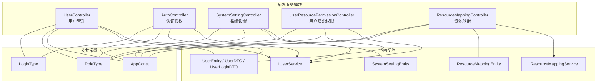
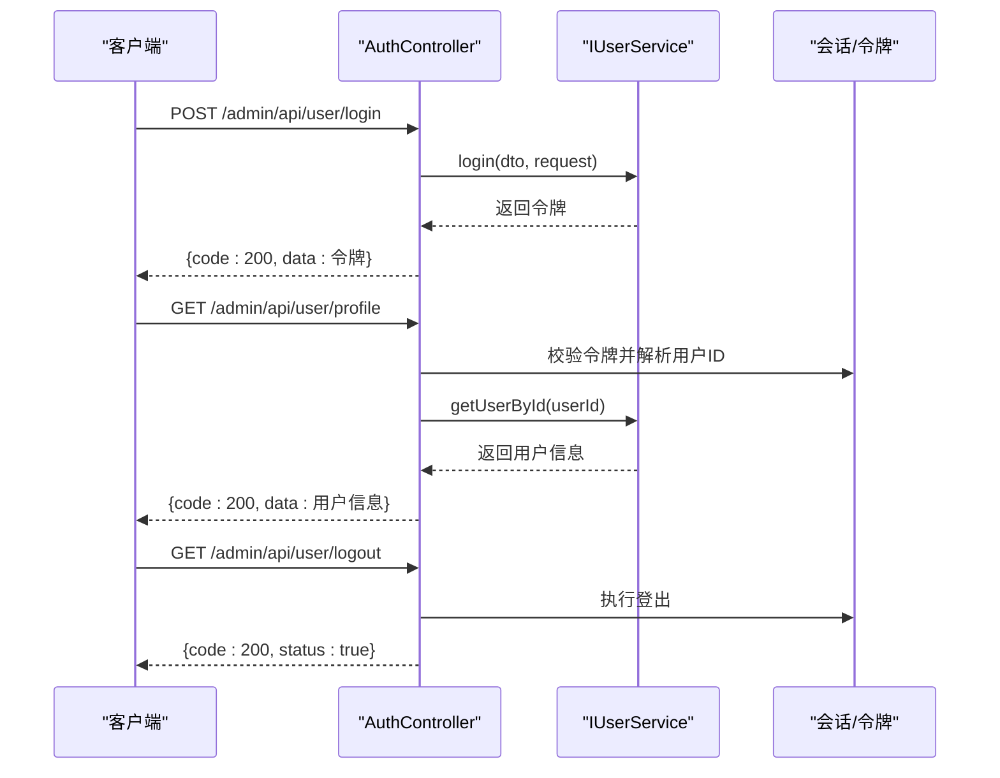
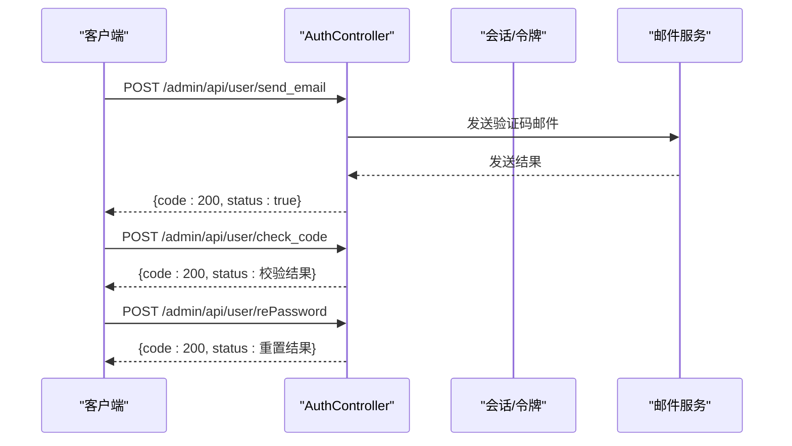
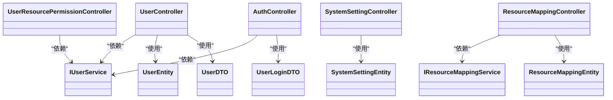

# 系统服务API

<cite>
**本文引用的文件**
- [UserController.java](file://maxkb4j-service/maxkb4j-system/src/main/java/com/maxkb4j/system/controller/UserController.java)
- [AuthController.java](file://maxkb4j-service/maxkb4j-system/src/main/java/com/maxkb4j/system/controller/AuthController.java)
- [SystemSettingController.java](file://maxkb4j-service/maxkb4j-system/src/main/java/com/maxkb4j/system/controller/SystemSettingController.java)
- [UserResourcePermissionController.java](file://maxkb4j-service/maxkb4j-system/src/main/java/com/maxkb4j/system/controller/UserResourcePermissionController.java)
- [ResourceMappingController.java](file://maxkb4j-service/maxkb4j-system/src/main/java/com/maxkb4j/system/controller/ResourceMappingController.java)
- [UserEntity.java](file://maxkb4j-service-api/maxkb4j-user-api/src/main/java/com/maxkb4j/user/entity/UserEntity.java)
- [UserDTO.java](file://maxkb4j-service-api/maxkb4j-user-api/src/main/java/com/maxkb4j/user/dto/UserDTO.java)
- [UserLoginDTO.java](file://maxkb4j-service-api/maxkb4j-user-api/src/main/java/com/maxkb4j/user/dto/UserLoginDTO.java)
- [SystemSettingEntity.java](file://maxkb4j-service-api/maxkb4j-system-api/src/main/java/com/maxkb4j/system/entity/SystemSettingEntity.java)
- [ResourceMappingEntity.java](file://maxkb4j-service-api/maxkb4j-system-api/src/main/java/com/maxkb4j/system/entity/ResourceMappingEntity.java)
- [IUserService.java](file://maxkb4j-service-api/maxkb4j-user-api/src/main/java/com/maxkb4j/user/service/IUserService.java)
- [IResourceMappingService.java](file://maxkb4j-service-api/maxkb4j-system-api/src/main/java/com/maxkb4j/system/service/IResourceMappingService.java)
- [AppConst.java](file://maxkb4j-common/src/main/java/com/maxkb4j/common/constant/AppConst.java)
- [RoleType.java](file://maxkb4j-common/src/main/java/com/maxkb4j/common/constant/RoleType.java)
- [LoginType.java](file://maxkb4j-common/src/main/java/com/maxkb4j/common/constant/LoginType.java)
</cite>

## 目录
1. [简介](#简介)
2. [项目结构](#项目结构)
3. [核心组件](#核心组件)
4. [架构总览](#架构总览)
5. [详细组件分析](#详细组件分析)
6. [依赖分析](#依赖分析)
7. [性能考虑](#性能考虑)
8. [故障排查指南](#故障排查指南)
9. [结论](#结论)
10. [附录](#附录)

## 简介
本文件为系统服务模块的API接口文档，聚焦于用户管理、权限控制与系统配置三大领域，覆盖用户创建、更新、删除、查询、角色与权限分配、认证与授权（登录、登出、验证码、重置密码）、系统设置（邮箱、展示信息）、资源映射与用户权限分页查询、以及工作空间默认路径下的资源关联查询等能力。文档以“可落地”的方式描述接口行为、请求/响应结构、鉴权要求与典型流程，帮助开发者快速构建安全可靠的企业级应用。

## 项目结构
系统服务模块位于 maxkb4j-service/maxkb4j-system，采用按功能域划分的目录组织，控制器层负责HTTP端点，服务层负责业务编排，API子模块提供实体、DTO、枚举与服务接口契约，公共模块提供常量与通用工具。

图表来源
- [UserController.java:26-96](file://maxkb4j-service/maxkb4j-system/src/main/java/com/maxkb4j/system/controller/UserController.java#L26-L96)
- [AuthController.java:27-98](file://maxkb4j-service/maxkb4j-system/src/main/java/com/maxkb4j/system/controller/AuthController.java#L27-L98)
- [SystemSettingController.java:21-67](file://maxkb4j-service/maxkb4j-system/src/main/java/com/maxkb4j/system/controller/SystemSettingController.java#L21-L67)
- [UserResourcePermissionController.java:25-69](file://maxkb4j-service/maxkb4j-system/src/main/java/com/maxkb4j/system/controller/UserResourcePermissionController.java#L25-L69)
- [ResourceMappingController.java:19-31](file://maxkb4j-service/maxkb4j-system/src/main/java/com/maxkb4j/system/controller/ResourceMappingController.java#L19-L31)
- [UserEntity.java:16-40](file://maxkb4j-service-api/maxkb4j-user-api/src/main/java/com/maxkb4j/user/entity/UserEntity.java#L16-L40)
- [UserDTO.java:10-17](file://maxkb4j-service-api/maxkb4j-user-api/src/main/java/com/maxkb4j/user/dto/UserDTO.java#L10-L17)
- [UserLoginDTO.java:7-13](file://maxkb4j-service-api/maxkb4j-user-api/src/main/java/com/maxkb4j/user/dto/UserLoginDTO.java#L7-L13)
- [SystemSettingEntity.java:14-27](file://maxkb4j-service-api/maxkb4j-system-api/src/main/java/com/maxkb4j/system/entity/SystemSettingEntity.java#L14-L27)
- [ResourceMappingEntity.java:12-20](file://maxkb4j-service-api/maxkb4j-system-api/src/main/java/com/maxkb4j/system/entity/ResourceMappingEntity.java#L12-L20)
- [IUserService.java:13-28](file://maxkb4j-service-api/maxkb4j-user-api/src/main/java/com/maxkb4j/user/service/IUserService.java#L13-L28)
- [IResourceMappingService.java:9-14](file://maxkb4j-service-api/maxkb4j-system-api/src/main/java/com/maxkb4j/system/service/IResourceMappingService.java#L9-L14)
- [AppConst.java:3-12](file://maxkb4j-common/src/main/java/com/maxkb4j/common/constant/AppConst.java#L3-L12)
- [RoleType.java:3-6](file://maxkb4j-common/src/main/java/com/maxkb4j/common/constant/RoleType.java#L3-L6)
- [LoginType.java:3-6](file://maxkb4j-common/src/main/java/com/maxkb4j/common/constant/LoginType.java#L3-L6)

章节来源
- [AppConst.java:3-12](file://maxkb4j-common/src/main/java/com/maxkb4j/common/constant/AppConst.java#L3-L12)

## 核心组件
- 用户管理控制器：提供用户分页查询、语言设置、创建、更新、删除、重置密码、发送邮件验证码等接口。
- 认证授权控制器：提供获取平台信息、获取当前用户资料、登录、验证码生成、忘记密码邮件发送与校验、重置密码、登出等接口。
- 系统设置控制器：提供邮箱配置读取/保存/测试连接、展示信息上传与读取等接口。
- 用户资源权限控制器：提供工作空间内用户列表、成员筛选、用户资源权限分页、资源用户权限分页、批量更新用户权限与资源权限等接口。
- 资源映射控制器：提供资源映射分页查询，支持按资源名、用户名、来源类型过滤。

章节来源
- [UserController.java:26-96](file://maxkb4j-service/maxkb4j-system/src/main/java/com/maxkb4j/system/controller/UserController.java#L26-L96)
- [AuthController.java:27-98](file://maxkb4j-service/maxkb4j-system/src/main/java/com/maxkb4j/system/controller/AuthController.java#L27-L98)
- [SystemSettingController.java:21-67](file://maxkb4j-service/maxkb4j-system/src/main/java/com/maxkb4j/system/controller/SystemSettingController.java#L21-L67)
- [UserResourcePermissionController.java:25-69](file://maxkb4j-service/maxkb4j-system/src/main/java/com/maxkb4j/system/controller/UserResourcePermissionController.java#L25-L69)
- [ResourceMappingController.java:19-31](file://maxkb4j-service/maxkb4j-system/src/main/java/com/maxkb4j/system/controller/ResourceMappingController.java#L19-L31)

## 架构总览
系统服务API基于REST风格，统一前缀为 admin/api；部分接口位于工作空间默认路径 workspace/default 下。控制器通过注解进行鉴权控制，调用对应服务接口完成业务处理，并以统一响应体返回结果。

图表来源
- [AuthController.java:44-96](file://maxkb4j-service/maxkb4j-system/src/main/java/com/maxkb4j/system/controller/AuthController.java#L44-L96)
- [IUserService.java:20-28](file://maxkb4j-service-api/maxkb4j-user-api/src/main/java/com/maxkb4j/user/service/IUserService.java#L20-L28)

## 详细组件分析

### 用户管理接口
- 接口前缀：admin/api
- 鉴权：需要管理员角色
- 主要接口
  - 分页查询用户
    - 方法：GET
    - 路径：/admin/api/user_manage/{page}/{size}
    - 查询参数：UserDTO（支持按用户名、昵称、邮箱、是否激活等条件）
    - 响应：分页用户列表
  - 设置用户语言
    - 方法：POST
    - 路径：/admin/api/user/language
    - 请求体：用户实体（含语言字段）
    - 响应：布尔状态
  - 创建用户
    - 方法：POST
    - 路径：/admin/api/user_manage
    - 请求体：用户实体（创建时无需ID）
    - 响应：布尔状态
  - 获取默认密码提示
    - 方法：GET
    - 路径：/admin/api/user_manage/password
    - 响应：包含默认密码提示的键值对
  - 更新用户
    - 方法：PUT
    - 路径：/admin/api/user_manage/{id}
    - 路径参数：用户ID
    - 请求体：用户实体（仅需传入需要更新的字段）
    - 响应：布尔状态
  - 删除用户
    - 方法：DELETE
    - 路径：/admin/api/user_manage/{id}
    - 路径参数：用户ID
    - 响应：布尔状态
  - 重置用户密码
    - 方法：PUT
    - 路径：/admin/api/user_manage/{id}/re_password
    - 路径参数：用户ID
    - 请求体：PasswordDTO（包含新密码与确认密码）
    - 校验：两次密码必须一致且非空
    - 响应：布尔状态
  - 当前用户发送邮箱验证码
    - 方法：POST
    - 路径：/admin/api/user/current/send_email
    - 响应：布尔状态
  - 当前用户重置密码
    - 方法：POST
    - 路径：/admin/api/user/current/reset_password
    - 请求体：PasswordDTO（邮箱验证码校验后使用）
    - 响应：布尔状态

章节来源
- [UserController.java:34-93](file://maxkb4j-service/maxkb4j-system/src/main/java/com/maxkb4j/system/controller/UserController.java#L34-L93)
- [UserDTO.java:10-17](file://maxkb4j-service-api/maxkb4j-user-api/src/main/java/com/maxkb4j/user/dto/UserDTO.java#L10-L17)
- [UserEntity.java:16-40](file://maxkb4j-service-api/maxkb4j-user-api/src/main/java/com/maxkb4j/user/entity/UserEntity.java#L16-L40)

### 认证授权接口
- 接口前缀：admin/api
- 鉴权：部分接口忽略鉴权，其余接口依赖会话/令牌
- 主要接口
  - 获取平台信息
    - 方法：GET
    - 路径：/admin/api/profile
    - 响应：包含版本、许可证状态等信息
  - 获取当前用户资料
    - 方法：GET
    - 路径：/admin/api/user/profile
    - 响应：当前用户信息
  - 登录
    - 方法：POST
    - 路径：/admin/api/user/login
    - 请求体：UserLoginDTO（用户名、密码、验证码）
    - 响应：登录成功返回令牌
  - 获取验证码
    - 方法：GET
    - 路径：/admin/api/user/captcha
    - 响应：包含验证码图片的Base64
  - 忘记密码-发送邮件验证码
    - 方法：POST
    - 路径：/admin/api/user/send_email
    - 请求体：ResetPasswordDTO（邮箱）
    - 响应：布尔状态
  - 忘记密码-校验验证码
    - 方法：POST
    - 路径：/admin/api/user/check_code
    - 请求体：ResetPasswordDTO（邮箱+验证码）
    - 响应：布尔状态
  - 忘记密码-重置密码
    - 方法：POST
    - 路径：/admin/api/user/rePassword
    - 请求体：ResetPasswordDTO（新密码与确认密码）
    - 校验：两次密码必须一致
    - 响应：布尔状态
  - 登出
    - 方法：POST
    - 路径：/admin/api/user/logout
    - 响应：布尔状态

图表来源
- [AuthController.java:66-88](file://maxkb4j-service/maxkb4j-system/src/main/java/com/maxkb4j/system/controller/AuthController.java#L66-L88)

章节来源
- [AuthController.java:34-96](file://maxkb4j-service/maxkb4j-system/src/main/java/com/maxkb4j/system/controller/AuthController.java#L34-L96)

### 系统设置接口
- 接口前缀：admin/api
- 鉴权：需要管理员角色
- 主要接口
  - 获取邮箱配置
    - 方法：GET
    - 路径：/admin/api/email_setting
    - 响应：JSON对象（邮箱配置）
  - 测试邮箱连接
    - 方法：POST
    - 路径：/admin/api/email_setting
    - 请求体：JSON对象（配置参数）
    - 响应：布尔状态（成功/失败）
  - 保存邮箱配置
    - 方法：PUT
    - 路径：/admin/api/email_setting
    - 请求体：JSON对象（配置参数）
    - 响应：布尔状态
  - 上传展示信息
    - 方法：POST
    - 路径：/admin/api/display/update
    - 内容类型：multipart/form-data
    - 请求体：表单数据（包含展示信息字段）
    - 响应：展示信息对象
  - 获取展示信息
    - 方法：GET
    - 路径：/admin/api/display/info
    - 响应：展示信息对象

章节来源
- [SystemSettingController.java:28-66](file://maxkb4j-service/maxkb4j-system/src/main/java/com/maxkb4j/system/controller/SystemSettingController.java#L28-L66)
- [SystemSettingEntity.java:14-27](file://maxkb4j-service-api/maxkb4j-system-api/src/main/java/com/maxkb4j/system/entity/SystemSettingEntity.java#L14-L27)

### 用户资源权限接口
- 接口前缀：admin/api/workspace/default
- 鉴权：需要管理员角色
- 主要接口
  - 工作空间用户列表
    - 方法：GET
    - 路径：/admin/api/workspace/default/user_list
    - 响应：用户名称列表
  - 工作空间成员列表
    - 方法：GET
    - 路径：/admin/api/workspace/default/user_member
    - 响应：成员用户列表
  - 用户资源权限分页
    - 方法：GET
    - 路径：/admin/api/workspace/default/user_resource_permission/user/{userId}/resource/{type}/{current}/{size}
    - 路径参数：用户ID、资源类型、页码、大小
    - 响应：用户资源权限分页结果
  - 资源用户权限分页
    - 方法：GET
    - 路径：/admin/api/workspace/default/resource_user_permission/resource/{resourceId}/resource/{type}/{current}/{size}
    - 路径参数：资源ID、资源类型、页码、大小
    - 查询参数：nickname、username、permission[]
    - 响应：资源用户权限分页结果
  - 更新资源权限
    - 方法：PUT
    - 路径：/admin/api/workspace/default/resource_user_permission/resource/{resourceId}/resource/{type}
    - 请求体：权限列表（目标资源的用户权限集合）
    - 响应：布尔状态
  - 更新用户权限
    - 方法：PUT
    - 路径：/admin/api/workspace/default/user_resource_permission/user/{userId}/resource/{type}
    - 请求体：权限列表（目标用户的资源权限集合）
    - 响应：布尔状态

章节来源
- [UserResourcePermissionController.java:33-68](file://maxkb4j-service/maxkb4j-system/src/main/java/com/maxkb4j/system/controller/UserResourcePermissionController.java#L33-L68)

### 资源映射接口
- 接口前缀：admin/api/workspace/default
- 鉴权：需要管理员角色
- 主要接口
  - 资源映射分页查询
    - 方法：GET
    - 路径：/admin/api/workspace/default/resource_mapping/{resourceType}/{resourceId}/{current}/{size}
    - 路径参数：资源类型、资源ID、页码、大小
    - 查询参数：resourceName、userName、sourceType[]
    - 响应：资源使用情况分页结果

章节来源
- [ResourceMappingController.java:26-29](file://maxkb4j-service/maxkb4j-system/src/main/java/com/maxkb4j/system/controller/ResourceMappingController.java#L26-L29)

## 依赖分析
- 控制器依赖服务接口，服务接口依赖实体与DTO，控制器通过统一响应体返回结果。
- 鉴权通过注解实现，管理员角色访问受限接口。
- 常量定义统一了API前缀与默认工作空间标识。

图表来源
- [UserController.java:31-32](file://maxkb4j-service/maxkb4j-system/src/main/java/com/maxkb4j/system/controller/UserController.java#L31-L32)
- [AuthController.java:32-32](file://maxkb4j-service/maxkb4j-system/src/main/java/com/maxkb4j/system/controller/AuthController.java#L32-L32)
- [SystemSettingController.java:26-26](file://maxkb4j-service/maxkb4j-system/src/main/java/com/maxkb4j/system/controller/SystemSettingController.java#L26-L26)
- [UserResourcePermissionController.java:30-31](file://maxkb4j-service/maxkb4j-system/src/main/java/com/maxkb4j/system/controller/UserResourcePermissionController.java#L30-L31)
- [ResourceMappingController.java:24-24](file://maxkb4j-service/maxkb4j-system/src/main/java/com/maxkb4j/system/controller/ResourceMappingController.java#L24-L24)
- [IUserService.java:13-28](file://maxkb4j-service-api/maxkb4j-user-api/src/main/java/com/maxkb4j/user/service/IUserService.java#L13-L28)
- [IResourceMappingService.java:9-14](file://maxkb4j-service-api/maxkb4j-system-api/src/main/java/com/maxkb4j/system/service/IResourceMappingService.java#L9-L14)
- [UserEntity.java:16-40](file://maxkb4j-service-api/maxkb4j-user-api/src/main/java/com/maxkb4j/user/entity/UserEntity.java#L16-L40)
- [UserDTO.java:10-17](file://maxkb4j-service-api/maxkb4j-user-api/src/main/java/com/maxkb4j/user/dto/UserDTO.java#L10-L17)
- [UserLoginDTO.java:7-13](file://maxkb4j-service-api/maxkb4j-user-api/src/main/java/com/maxkb4j/user/dto/UserLoginDTO.java#L7-L13)
- [SystemSettingEntity.java:14-27](file://maxkb4j-service-api/maxkb4j-system-api/src/main/java/com/maxkb4j/system/entity/SystemSettingEntity.java#L14-L27)
- [ResourceMappingEntity.java:12-20](file://maxkb4j-service-api/maxkb4j-system-api/src/main/java/com/maxkb4j/system/entity/ResourceMappingEntity.java#L12-L20)

章节来源
- [AppConst.java:3-12](file://maxkb4j-common/src/main/java/com/maxkb4j/common/constant/AppConst.java#L3-L12)
- [RoleType.java:3-6](file://maxkb4j-common/src/main/java/com/maxkb4j/common/constant/RoleType.java#L3-L6)
- [LoginType.java:3-6](file://maxkb4j-common/src/main/java/com/maxkb4j/common/constant/LoginType.java#L3-L6)

## 性能考虑
- 分页查询：用户管理、资源映射、用户资源权限、资源用户权限均支持分页，建议在大数据量场景下合理设置页码与大小，避免一次性加载过多数据。
- 缓存策略：系统具备缓存组件，可在高频读取场景中引入缓存（如用户昵称映射、系统设置），减少数据库压力。
- 并发控制：登录、验证码、重置密码等敏感操作建议结合限流与防刷机制，防止暴力破解与滥用。
- 数据传输：展示信息上传使用multipart/form-data，注意文件大小限制与类型校验。

## 故障排查指南
- 登录失败
  - 检查用户名/密码是否正确，验证码是否匹配。
  - 查看会话是否已过期或被强制登出。
- 邮件发送失败
  - 校验邮箱配置是否正确，网络连通性是否正常。
  - 使用“测试连接”接口验证SMTP配置。
- 权限不足
  - 确认当前用户角色是否为管理员。
  - 检查资源权限是否已正确分配。
- 分页查询为空
  - 检查查询条件是否过于严格，尝试放宽过滤参数。
  - 确认页码与大小是否合理。

## 结论
系统服务API围绕用户管理、认证授权与系统配置提供了完整的企业级能力，配合资源映射与用户权限分页查询，满足多租户与工作空间场景下的权限治理需求。通过统一的鉴权注解与响应体设计，开发者可以快速集成并扩展业务功能。

## 附录
- 统一响应体
  - 成功：{code: 200, data: ...}
  - 失败：{code: 错误码, msg: 错误信息}
  - 状态：{code: 200, status: true/false}
- 常用枚举与常量
  - 角色类型：ADMIN、USER
  - 登录类型：admin、user
  - API前缀：admin/api
  - 默认工作空间ID：default

章节来源
- [RoleType.java:3-6](file://maxkb4j-common/src/main/java/com/maxkb4j/common/constant/RoleType.java#L3-L6)
- [LoginType.java:3-6](file://maxkb4j-common/src/main/java/com/maxkb4j/common/constant/LoginType.java#L3-L6)
- [AppConst.java:3-12](file://maxkb4j-common/src/main/java/com/maxkb4j/common/constant/AppConst.java#L3-L12)