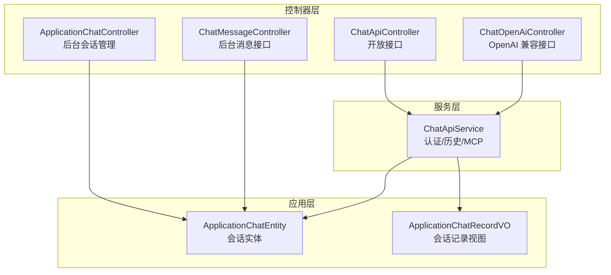
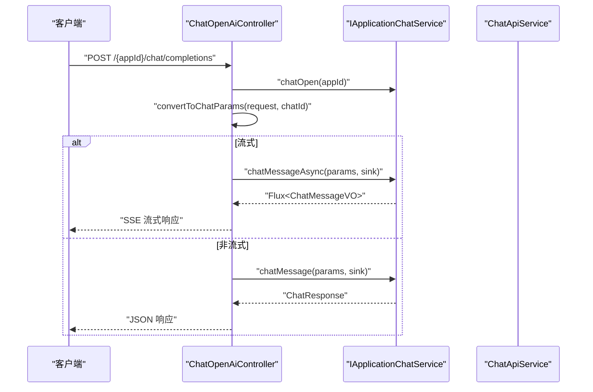
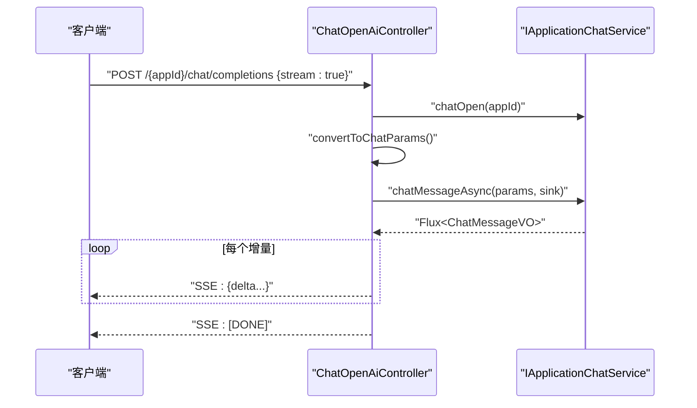
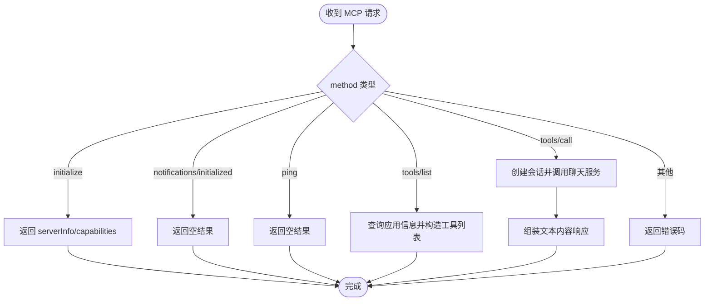
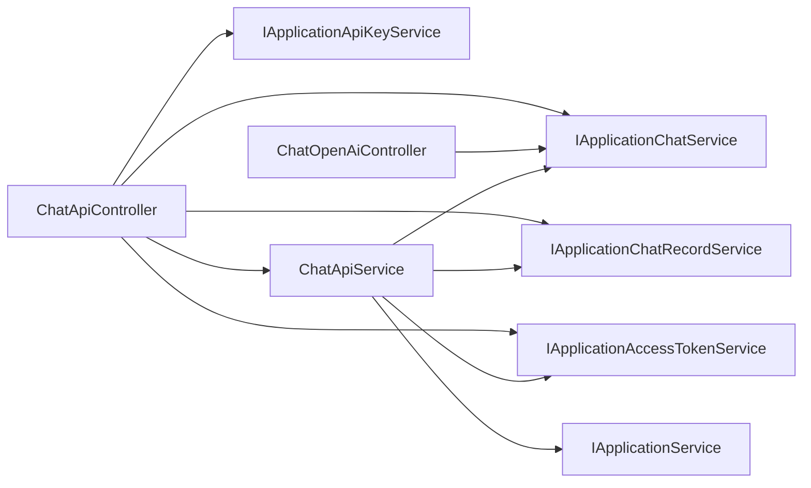

# 聊天服务API

<cite>
**本文引用的文件**
- [ChatApiController.java](file://maxkb4j-service/maxkb4j-chat/src/main/java/com/maxkb4j/chat/controller/ChatApiController.java)
- [ChatOpenAiController.java](file://maxkb4j-service/maxkb4j-chat/src/main/java/com/maxkb4j/chat/controller/ChatOpenAiController.java)
- [ChatApiService.java](file://maxkb4j-service/maxkb4j-chat/src/main/java/com/maxkb4j/chat/service/ChatApiService.java)
- [ApplicationChatController.java](file://maxkb4j-service/maxkb4j-application/src/main/java/com/maxkb4j/application/controller/ApplicationChatController.java)
- [ChatMessageController.java](file://maxkb4j-service/maxkb4j-application/src/main/java/com/maxkb4j/application/controller/ChatMessageController.java)
- [ChatParams.java](file://maxkb4j-common/src/main/java/com/maxkb4j/common/domain/dto/ChatParams.java)
- [ChatResponse.java](file://maxkb4j-common/src/main/java/com/maxkb4j/common/domain/dto/ChatResponse.java)
- [ApplicationChatEntity.java](file://maxkb4j-service-api/maxkb4j-application-api/src/main/java/com/maxkb4j/application/entity/ApplicationChatEntity.java)
- [ApplicationChatRecordVO.java](file://maxkb4j-service-api/maxkb4j-application-api/src/main/java/com/maxkb4j/application/vo/ApplicationChatRecordVO.java)
- [ChatQueryDTO.java](file://maxkb4j-service-api/maxkb4j-application-api/src/main/java/com/maxkb4j/application/dto/ChatQueryDTO.java)
- [ChatMessageDTO.java](file://maxkb4j-service-api/maxkb4j-application-api/src/main/java/com/maxkb4j/application/dto/ChatMessageDTO.java)
</cite>

## 目录
1. [简介](#简介)
2. [项目结构](#项目结构)
3. [核心组件](#核心组件)
4. [架构总览](#架构总览)
5. [详细组件分析](#详细组件分析)
6. [依赖分析](#依赖分析)
7. [性能考虑](#性能考虑)
8. [故障排查指南](#故障排查指南)
9. [结论](#结论)
10. [附录](#附录)

## 简介
本文件为 MaxKB4j 聊天服务模块的全面 API 接口文档，覆盖以下能力：
- 对话管理：创建会话、发送消息、历史查询、会话更新与删除、清空历史、投票统计更新
- OpenAI 兼容接口：聊天补全、流式响应、工具调用（MCP）
- 工作流聊天：通过表单数据、节点数据、子节点对象等扩展多模态与流程化对话
- 实时通信：基于 Server-Sent Events 的流式响应，支持长连接与双向数据传输
- 消息格式与响应结构：统一的请求参数模型与响应封装
- 错误处理与速率限制：异常处理策略与超时控制
- 音频与语音：语音转文本、文本转语音能力

## 项目结构
聊天服务主要由三层构成：
- 控制器层：对外暴露 REST API，分别提供开放接口与 OpenAI 兼容接口
- 服务层：封装认证、历史会话、MCP 工具调用等通用逻辑
- 应用层控制器：面向后台管理的会话与消息接口

图表来源
- [ChatApiController.java:47-222](file://maxkb4j-service/maxkb4j-chat/src/main/java/com/maxkb4j/chat/controller/ChatApiController.java#L47-L222)
- [ChatOpenAiController.java:29-132](file://maxkb4j-service/maxkb4j-chat/src/main/java/com/maxkb4j/chat/controller/ChatOpenAiController.java#L29-L132)
- [ChatApiService.java:37-181](file://maxkb4j-service/maxkb4j-chat/src/main/java/com/maxkb4j/chat/service/ChatApiService.java#L37-L181)
- [ApplicationChatController.java:31-63](file://maxkb4j-service/maxkb4j-application/src/main/java/com/maxkb4j/application/controller/ApplicationChatController.java#L31-L63)
- [ChatMessageController.java:26-48](file://maxkb4j-service/maxkb4j-application/src/main/java/com/maxkb4j/application/controller/ChatMessageController.java#L26-L48)

章节来源
- [ChatApiController.java:47-222](file://maxkb4j-service/maxkb4j-chat/src/main/java/com/maxkb4j/chat/controller/ChatApiController.java#L47-L222)
- [ChatOpenAiController.java:29-132](file://maxkb4j-service/maxkb4j-chat/src/main/java/com/maxkb4j/chat/controller/ChatOpenAiController.java#L29-L132)
- [ChatApiService.java:37-181](file://maxkb4j-service/maxkb4j-chat/src/main/java/com/maxkb4j/chat/service/ChatApiService.java#L37-L181)
- [ApplicationChatController.java:31-63](file://maxkb4j-service/maxkb4j-application/src/main/java/com/maxkb4j/application/controller/ApplicationChatController.java#L31-L63)
- [ChatMessageController.java:26-48](file://maxkb4j-service/maxkb4j-application/src/main/java/com/maxkb4j/application/controller/ChatMessageController.java#L26-L48)

## 核心组件
- ChatApiController：提供开放接口，包括会话打开、消息发送（支持流式）、历史会话查询与管理、MCP 工具调用、语音能力、嵌入脚本等
- ChatOpenAiController：提供 OpenAI 兼容的聊天补全接口，支持流式与非流式响应
- ChatApiService：封装认证令牌生成、应用信息查询、历史会话分页与清理、会话记录投票更新、MCP 请求处理
- ApplicationChatController：后台管理端的会话 CRUD、日志查询、导出
- ChatMessageController：后台管理端的消息发送接口，支持流式响应
- 数据模型：ChatParams、ChatResponse、ApplicationChatEntity、ApplicationChatRecordVO 等

章节来源
- [ChatApiController.java:47-222](file://maxkb4j-service/maxkb4j-chat/src/main/java/com/maxkb4j/chat/controller/ChatApiController.java#L47-L222)
- [ChatOpenAiController.java:29-132](file://maxkb4j-service/maxkb4j-chat/src/main/java/com/maxkb4j/chat/controller/ChatOpenAiController.java#L29-L132)
- [ChatApiService.java:37-181](file://maxkb4j-service/maxkb4j-chat/src/main/java/com/maxkb4j/chat/service/ChatApiService.java#L37-L181)
- [ApplicationChatController.java:31-63](file://maxkb4j-service/maxkb4j-application/src/main/java/com/maxkb4j/application/controller/ApplicationChatController.java#L31-L63)
- [ChatMessageController.java:26-48](file://maxkb4j-service/maxkb4j-application/src/main/java/com/maxkb4j/application/controller/ChatMessageController.java#L26-L48)
- [ChatParams.java:14-66](file://maxkb4j-common/src/main/java/com/maxkb4j/common/domain/dto/ChatParams.java#L14-L66)
- [ChatResponse.java:10-65](file://maxkb4j-common/src/main/java/com/maxkb4j/common/domain/dto/ChatResponse.java#L10-L65)
- [ApplicationChatEntity.java:11-36](file://maxkb4j-service-api/maxkb4j-application-api/src/main/java/com/maxkb4j/application/entity/ApplicationChatEntity.java#L11-L36)
- [ApplicationChatRecordVO.java:11-24](file://maxkb4j-service-api/maxkb4j-application-api/src/main/java/com/maxkb4j/application/vo/ApplicationChatRecordVO.java#L11-L24)

## 架构总览
聊天服务采用“控制器-服务-应用层”的分层设计，控制器负责协议适配（REST/OpenAI），服务层负责业务编排与外部集成，应用层提供持久化与视图模型。

图表来源
- [ChatOpenAiController.java:34-118](file://maxkb4j-service/maxkb4j-chat/src/main/java/com/maxkb4j/chat/controller/ChatOpenAiController.java#L34-L118)

章节来源
- [ChatOpenAiController.java:29-132](file://maxkb4j-service/maxkb4j-chat/src/main/java/com/maxkb4j/chat/controller/ChatOpenAiController.java#L29-L132)

## 详细组件分析

### 对话管理接口
- 会话打开
  - 方法：GET
  - 路径：/open
  - 功能：生成会话ID，用于后续消息发送
  - 返回：会话ID字符串
- 发送消息（流式/非流式）
  - 方法：POST
  - 路径：/chat_message/{chatId}
  - 参数：ChatParams（见下节）
  - 响应：流式返回 ChatMessageVO 或 JSON 包裹的 ChatResponse
- 历史会话查询
  - 方法：GET
  - 路径：/historical_conversation/{current}/{size}
  - 返回：分页的 ApplicationChatEntity 列表
- 会话详情查询
  - 方法：GET
  - 路径：/historical_conversation/{chatId}/record/{chatRecordId}
  - 返回：ApplicationChatRecordVO
- 更新会话
  - 方法：PUT
  - 路径：/historical_conversation/{chatId}
  - 参数：ApplicationChatEntity
  - 返回：布尔值
- 删除会话
  - 方法：DELETE
  - 路径：/historical_conversation/{chatId}
  - 返回：布尔值
- 清空历史
  - 方法：DELETE
  - 路径：/historical_conversation/clear
  - 返回：布尔值
- 会话记录分页
  - 方法：GET
  - 路径：/historical_conversation_record/{chatId}/{current}/{size}
  - 返回：分页的 ApplicationChatRecordVO
- 投票更新
  - 方法：PUT
  - 路径：/vote/chat/{chatId}/chat_record/{chatRecordId}
  - 参数：ApplicationChatRecordEntity
  - 返回：布尔值

章节来源
- [ChatApiController.java:87-174](file://maxkb4j-service/maxkb4j-chat/src/main/java/com/maxkb4j/chat/controller/ChatApiController.java#L87-L174)
- [ApplicationChatEntity.java:11-36](file://maxkb4j-service-api/maxkb4j-application-api/src/main/java/com/maxkb4j/application/entity/ApplicationChatEntity.java#L11-L36)
- [ApplicationChatRecordVO.java:11-24](file://maxkb4j-service-api/maxkb4j-application-api/src/main/java/com/maxkb4j/application/vo/ApplicationChatRecordVO.java#L11-L24)

### OpenAI 兼容接口
- 聊天补全
  - 方法：POST
  - 路径：/{appId}/chat/completions
  - 请求体：OpenAI 风格的聊天请求（最后一条用户消息）
  - 响应：
    - 非流式：JSON 响应，包含 completion ID、模型名、答案、token 统计
    - 流式：SSE 流，逐块返回增量内容，结束时发送 [DONE]
- 流式响应机制
  - 使用 Reactor Sinks 与 Flux 实现背压缓冲
  - 默认超时 10 分钟，异常时自动发送 [DONE] 结束标记

图表来源
- [ChatOpenAiController.java:34-97](file://maxkb4j-service/maxkb4j-chat/src/main/java/com/maxkb4j/chat/controller/ChatOpenAiController.java#L34-L97)

章节来源
- [ChatOpenAiController.java:29-132](file://maxkb4j-service/maxkb4j-chat/src/main/java/com/maxkb4j/chat/controller/ChatOpenAiController.java#L29-L132)

### 工作流聊天与多模态
- 表单数据与节点数据
  - 支持在 ChatParams 中传入 formData、nodeData、childNode 等，用于工作流节点渲染与执行
- 多媒体附件
  - 支持音频、文档、图片、其他文件列表，便于多模态问答
- 历史上下文
  - 可通过 historyChatRecords 注入历史消息，实现上下文增强

章节来源
- [ChatParams.java:14-66](file://maxkb4j-common/src/main/java/com/maxkb4j/common/domain/dto/ChatParams.java#L14-L66)

### MCP 工具调用（OpenAI 兼容）
- 接口路径：/mcp
- 请求体：MCP 协议请求（方法与参数）
- 支持方法：
  - initialize：返回协议版本、服务器信息与能力声明
  - notifications/initialized：初始化通知确认
  - ping：心跳检测
  - tools/list：列出可用工具（当前返回一个代理工具）
  - tools/call：调用工具，内部转发到聊天服务并返回文本内容
- 响应：标准 MCP 响应，包含 result 或 error

图表来源
- [ChatApiService.java:124-180](file://maxkb4j-service/maxkb4j-chat/src/main/java/com/maxkb4j/chat/service/ChatApiService.java#L124-L180)

章节来源
- [ChatApiController.java:118-130](file://maxkb4j-service/maxkb4j-chat/src/main/java/com/maxkb4j/chat/controller/ChatApiController.java#L118-L130)
- [ChatApiService.java:110-180](file://maxkb4j-service/maxkb4j-chat/src/main/java/com/maxkb4j/chat/service/ChatApiService.java#L110-L180)

### 语音与嵌入
- 语音转文本
  - 方法：POST
  - 路径：/speech_to_text
  - 参数：multipart/form-data（音频文件）
  - 返回：识别后的文本
- 文本转语音
  - 方法：POST
  - 路径：/text_to_speech
  - 参数：JSON（包含文本等）
  - 返回：音频字节数组（Content-Type: audio/mp3）
- 嵌入脚本
  - 方法：GET
  - 路径：/embed
  - 参数：EmbedDTO
  - 返回：JavaScript 内容类型

章节来源
- [ChatApiController.java:177-207](file://maxkb4j-service/maxkb4j-chat/src/main/java/com/maxkb4j/chat/controller/ChatApiController.java#L177-L207)

### 后台管理接口
- 会话管理
  - 更新会话：PUT /workspace/default/application/{id}/chat/client/{chatId}
  - 删除会话：DELETE /workspace/default/application/{id}/chat/client/{chatId}
  - 查询会话日志：GET /workspace/default/application/{id}/chat/{page}/{size}?summary=...&startTime=...&endTime=...
  - 导出会话：POST /workspace/default/application/{id}/chat/export
- 管理端消息接口
  - 打开会话：GET /workspace/default/application/{id}/open
  - 发送消息（流式）：POST /chat_message/{chatId}，返回 Flux<ChatMessageVO>

章节来源
- [ApplicationChatController.java:31-63](file://maxkb4j-service/maxkb4j-application/src/main/java/com/maxkb4j/application/controller/ApplicationChatController.java#L31-L63)
- [ChatMessageController.java:26-48](file://maxkb4j-service/maxkb4j-application/src/main/java/com/maxkb4j/application/controller/ChatMessageController.java#L26-L48)

## 依赖分析
- 控制器到服务层
  - ChatApiController 依赖 IApplicationChatService、IApplicationChatRecordService、ChatApiService、IApplicationAccessTokenService、IApplicationApiKeyService
  - ChatOpenAiController 依赖 IApplicationChatService
- 服务层到应用层
  - ChatApiService 依赖 IApplicationChatService、IApplicationChatRecordService、IApplicationAccessTokenService、IApplicationService
- 数据模型
  - ChatParams、ChatResponse 作为通用 DTO
  - ApplicationChatEntity、ApplicationChatRecordVO 作为持久化与视图模型

图表来源
- [ChatApiController.java:49-54](file://maxkb4j-service/maxkb4j-chat/src/main/java/com/maxkb4j/chat/controller/ChatApiController.java#L49-L54)
- [ChatOpenAiController.java:31](file://maxkb4j-service/maxkb4j-chat/src/main/java/com/maxkb4j/chat/controller/ChatOpenAiController.java#L31)
- [ChatApiService.java:39-43](file://maxkb4j-service/maxkb4j-chat/src/main/java/com/maxkb4j/chat/service/ChatApiService.java#L39-L43)

章节来源
- [ChatApiController.java:49-54](file://maxkb4j-service/maxkb4j-chat/src/main/java/com/maxkb4j/chat/controller/ChatApiController.java#L49-L54)
- [ChatOpenAiController.java:31](file://maxkb4j-service/maxkb4j-chat/src/main/java/com/maxkb4j/chat/controller/ChatOpenAiController.java#L31)
- [ChatApiService.java:39-43](file://maxkb4j-service/maxkb4j-chat/src/main/java/com/maxkb4j/chat/service/ChatApiService.java#L39-L43)

## 性能考虑
- 流式响应
  - 使用 Reactor Flux 与背压缓冲，避免内存峰值
  - SSE 超时默认 10 分钟，建议客户端设置合理的重连策略
- 并发与异步
  - MCP 请求使用 @Async 异步处理，避免阻塞主线程
- 资源释放
  - 流式完成后自动发送 [DONE]，确保客户端正确关闭连接
- 建议
  - 客户端侧实现指数退避重连与断线恢复
  - 对高频调用场景增加本地缓存与限流

## 故障排查指南
- 认证失败
  - 检查访问令牌有效性与状态
  - OpenAI 兼容接口需使用 API Key 进行校验
- 流式连接中断
  - 关注服务端超时与网络波动
  - 客户端需处理 [DONE] 结束标记与异常恢复
- MCP 方法不支持
  - 当前仅支持 initialize、notifications/initialized、ping、tools/list、tools/call
  - 其他方法将返回错误码
- 历史会话查询为空
  - 确认当前用户与应用绑定的会话归属
- 投票更新失败
  - 确保 chatRecordId 对应的记录存在且属于当前 chatId

章节来源
- [ChatApiController.java:122-129](file://maxkb4j-service/maxkb4j-chat/src/main/java/com/maxkb4j/chat/controller/ChatApiController.java#L122-L129)
- [ChatOpenAiController.java:91-96](file://maxkb4j-service/maxkb4j-chat/src/main/java/com/maxkb4j/chat/controller/ChatOpenAiController.java#L91-L96)
- [ChatApiService.java:174-179](file://maxkb4j-service/maxkb4j-chat/src/main/java/com/maxkb4j/chat/service/ChatApiService.java#L174-L179)

## 结论
MaxKB4j 聊天服务提供了从基础对话到 OpenAI 兼容、从流式响应到工具调用的完整能力集，结合工作流与多模态输入，可支撑高性能的智能聊天应用。建议在生产环境中配合限流、缓存与监控体系，确保稳定性与可维护性。

## 附录

### 请求与响应数据模型

- ChatParams（请求）
  - 字段概览：message、chatId、chatRecordId、runtimeNodeId、stream、formData、nodeData、childNode、audioList、documentList、imageList、otherList、reChat、ipAddress、source、appId、debug、chatUserId、chatUserType、historyChatRecords、chatRecord
  - 说明：必填字段为 message 与 chatId；reChat 必须显式指定
- ChatResponse（非流式响应）
  - 字段概览：answerTextList、messageTokens、answerTokens、runDetails
  - 说明：answerTextList 为答案片段列表；runDetails 为运行明细（含 token 统计）

章节来源
- [ChatParams.java:14-66](file://maxkb4j-common/src/main/java/com/maxkb4j/common/domain/dto/ChatParams.java#L14-L66)
- [ChatResponse.java:10-65](file://maxkb4j-common/src/main/java/com/maxkb4j/common/domain/dto/ChatResponse.java#L10-L65)

### OpenAI 兼容响应字段
- 非流式响应包含：
  - id：completion ID（以 chatcmpl- 开头）
  - model：模型名称
  - choices[0].message.content：最终答案
  - usage：message_tokens 与 answer_tokens
- 流式响应包含：
  - data: channels 中的增量内容
  - 结束标记：data: [DONE]

章节来源
- [ChatOpenAiController.java:102-118](file://maxkb4j-service/maxkb4j-chat/src/main/java/com/maxkb4j/chat/controller/ChatOpenAiController.java#L102-L118)
- [ChatOpenAiController.java:66-97](file://maxkb4j-service/maxkb4j-chat/src/main/java/com/maxkb4j/chat/controller/ChatOpenAiController.java#L66-L97)

### 历史查询与导出
- 历史查询参数：summary、startTime、endTime、minStar、minTrample
- 导出：选择多个会话 ID，后端输出对应日志

章节来源
- [ChatQueryDTO.java:7-14](file://maxkb4j-service-api/maxkb4j-application-api/src/main/java/com/maxkb4j/application/dto/ChatQueryDTO.java#L7-L14)
- [ApplicationChatController.java:54-58](file://maxkb4j-service/maxkb4j-application/src/main/java/com/maxkb4j/application/controller/ApplicationChatController.java#L54-L58)