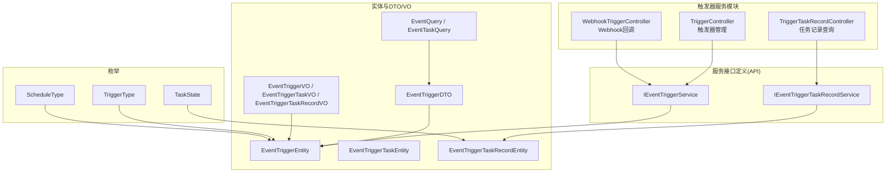
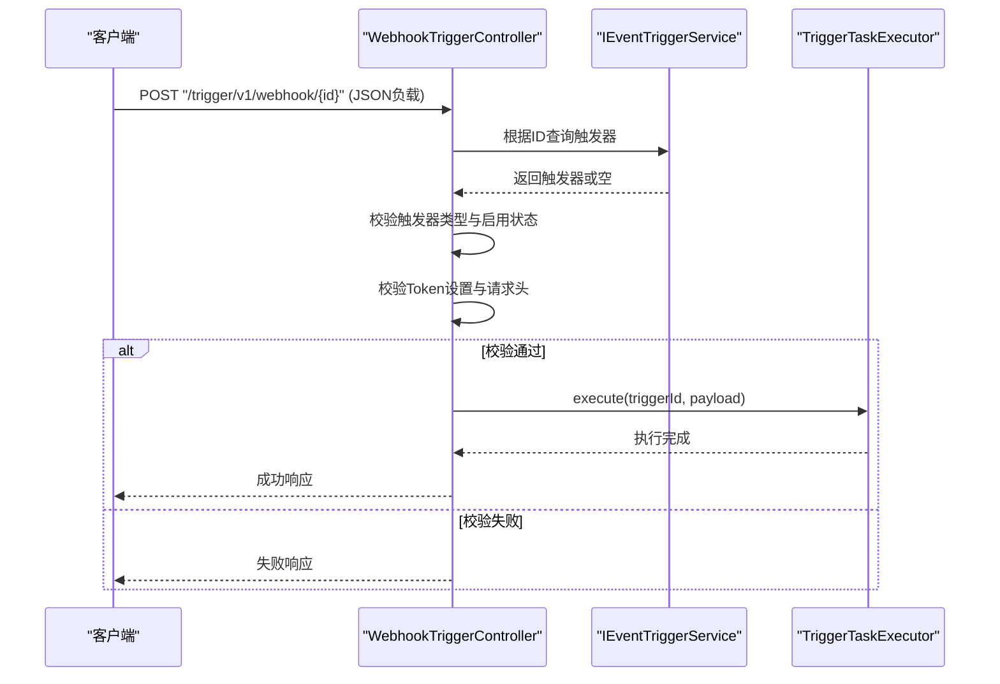
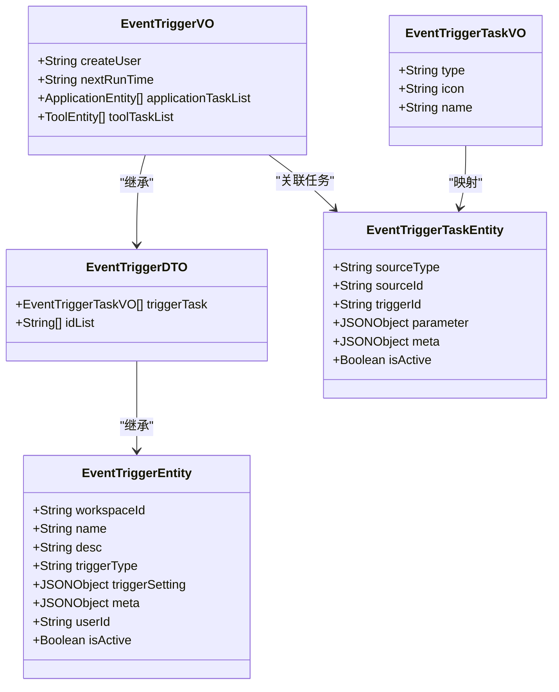
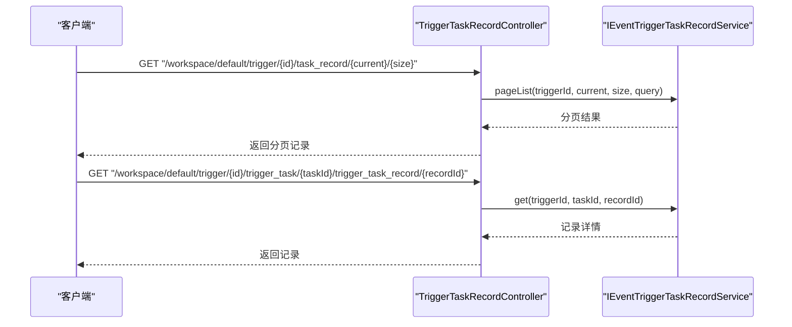
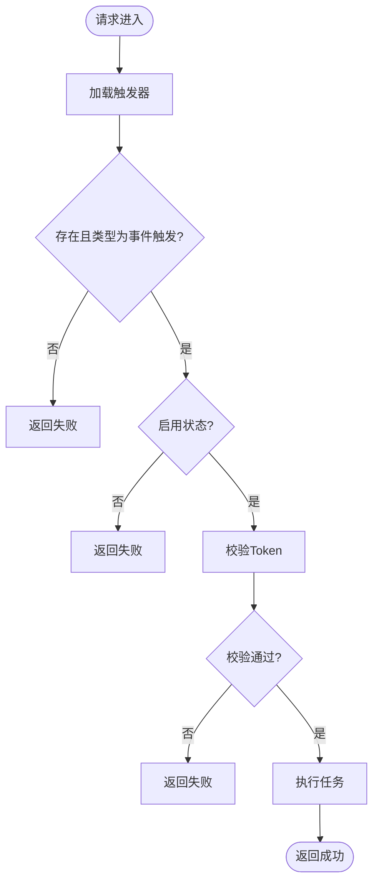
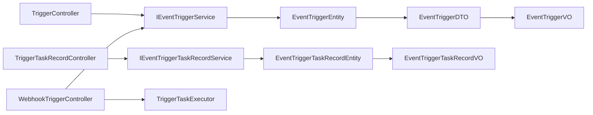

# 触发器服务API

<cite>
**本文引用的文件**
- [TriggerController.java](file://maxkb4j-service/maxkb4j-trigger/src/main/java/com/maxkb4j/trigger/controller/TriggerController.java)
- [TriggerTaskRecordController.java](file://maxkb4j-service/maxkb4j-trigger/src/main/java/com/maxkb4j/trigger/controller/TriggerTaskRecordController.java)
- [WebhookTriggerController.java](file://maxkb4j-service/maxkb4j-trigger/src/main/java/com/maxkb4j/trigger/controller/WebhookTriggerController.java)
- [IEventTriggerService.java](file://maxkb4j-service-api/maxkb4j-trigger-api/src/main/java/com/maxkb4j/trigger/service/IEventTriggerService.java)
- [IEventTriggerTaskRecordService.java](file://maxkb4j-service-api/maxkb4j-trigger-api/src/main/java/com/maxkb4j/trigger/service/IEventTriggerTaskRecordService.java)
- [EventTriggerEntity.java](file://maxkb4j-service-api/maxkb4j-trigger-api/src/main/java/com/maxkb4j/trigger/entity/EventTriggerEntity.java)
- [EventTriggerTaskEntity.java](file://maxkb4j-service-api/maxkb4j-trigger-api/src/main/java/com/maxkb4j/trigger/entity/EventTriggerTaskEntity.java)
- [EventTriggerTaskRecordEntity.java](file://maxkb4j-service-api/maxkb4j-trigger-api/src/main/java/com/maxkb4j/trigger/entity/EventTriggerTaskRecordEntity.java)
- [EventTriggerDTO.java](file://maxkb4j-service-api/maxkb4j-trigger-api/src/main/java/com/maxkb4j/trigger/dto/EventTriggerDTO.java)
- [EventQuery.java](file://maxkb4j-service-api/maxkb4j-trigger-api/src/main/java/com/maxkb4j/trigger/dto/EventQuery.java)
- [EventTaskQuery.java](file://maxkb4j-service-api/maxkb4j-trigger-api/src/main/java/com/maxkb4j/trigger/dto/EventTaskQuery.java)
- [EventTriggerVO.java](file://maxkb4j-service-api/maxkb4j-trigger-api/src/main/java/com/maxkb4j/trigger/vo/EventTriggerVO.java)
- [EventTriggerTaskRecordVO.java](file://maxkb4j-service-api/maxkb4j-trigger-api/src/main/java/com/maxkb4j/trigger/vo/EventTriggerTaskRecordVO.java)
- [EventTriggerTaskVO.java](file://maxkb4j-service-api/maxkb4j-trigger-api/src/main/java/com/maxkb4j/trigger/vo/EventTriggerTaskVO.java)
- [TriggerType.java](file://maxkb4j-service/maxkb4j-trigger/src/main/java/com/maxkb4j/trigger/enums/TriggerType.java)
- [ScheduleType.java](file://maxkb4j-service/maxkb4j-trigger/src/main/java/com/maxkb4j/trigger/enums/ScheduleType.java)
- [TaskState.java](file://maxkb4j-service/maxkb4j-trigger/src/main/java/com/maxkb4j/trigger/enums/TaskState.java)
</cite>

## 目录
1. [简介](#简介)
2. [项目结构](#项目结构)
3. [核心组件](#核心组件)
4. [架构总览](#架构总览)
5. [详细组件分析](#详细组件分析)
6. [依赖分析](#依赖分析)
7. [性能考虑](#性能考虑)
8. [故障排查指南](#故障排查指南)
9. [结论](#结论)
10. [附录](#附录)

## 简介
本文件为触发器服务模块的API接口文档，覆盖定时任务与事件触发两大能力域，以及Webhook回调接收与处理。文档面向开发者与运维人员，提供触发器的创建、配置、启用/禁用、批量操作、删除等管理接口；对定时任务提供完整的CRUD与分页查询；对任务执行记录提供分页查询与明细查询；对Webhook提供基于Token鉴权的回调入口。同时给出事件驱动架构的API规范（事件类型、订阅管理、消息路由）与监控、日志、性能统计等运维能力说明，帮助构建可靠的自动化系统。

## 项目结构
触发器服务位于独立模块中，采用“控制层-服务层-数据模型”分层设计，配合API定义模块提供统一的数据传输对象与视图对象。

图表来源
- [TriggerController.java:1-123](file://maxkb4j-service/maxkb4j-trigger/src/main/java/com/maxkb4j/trigger/controller/TriggerController.java#L1-L123)
- [TriggerTaskRecordController.java:1-47](file://maxkb4j-service/maxkb4j-trigger/src/main/java/com/maxkb4j/trigger/controller/TriggerTaskRecordController.java#L1-L47)
- [WebhookTriggerController.java:1-60](file://maxkb4j-service/maxkb4j-trigger/src/main/java/com/maxkb4j/trigger/controller/WebhookTriggerController.java#L1-L60)
- [IEventTriggerService.java:1-30](file://maxkb4j-service-api/maxkb4j-trigger-api/src/main/java/com/maxkb4j/trigger/service/IEventTriggerService.java#L1-L30)
- [IEventTriggerTaskRecordService.java:1-14](file://maxkb4j-service-api/maxkb4j-trigger-api/src/main/java/com/maxkb4j/trigger/service/IEventTriggerTaskRecordService.java#L1-L14)
- [EventTriggerEntity.java:1-28](file://maxkb4j-service-api/maxkb4j-trigger-api/src/main/java/com/maxkb4j/trigger/entity/EventTriggerEntity.java#L1-L28)
- [EventTriggerTaskEntity.java:1-25](file://maxkb4j-service-api/maxkb4j-trigger-api/src/main/java/com/maxkb4j/trigger/entity/EventTriggerTaskEntity.java#L1-L25)
- [EventTriggerTaskRecordEntity.java:1-25](file://maxkb4j-service-api/maxkb4j-trigger-api/src/main/java/com/maxkb4j/trigger/entity/EventTriggerTaskRecordEntity.java#L1-L25)
- [EventTriggerDTO.java:1-16](file://maxkb4j-service-api/maxkb4j-trigger-api/src/main/java/com/maxkb4j/trigger/dto/EventTriggerDTO.java#L1-L16)
- [EventQuery.java:1-13](file://maxkb4j-service-api/maxkb4j-trigger-api/src/main/java/com/maxkb4j/trigger/dto/EventQuery.java#L1-L13)
- [EventTaskQuery.java:1-12](file://maxkb4j-service-api/maxkb4j-trigger-api/src/main/java/com/maxkb4j/trigger/dto/EventTaskQuery.java#L1-L12)
- [EventTriggerVO.java:1-19](file://maxkb4j-service-api/maxkb4j-trigger-api/src/main/java/com/maxkb4j/trigger/vo/EventTriggerVO.java#L1-L19)
- [EventTriggerTaskRecordVO.java:1-12](file://maxkb4j-service-api/maxkb4j-trigger-api/src/main/java/com/maxkb4j/trigger/vo/EventTriggerTaskRecordVO.java#L1-L12)
- [EventTriggerTaskVO.java:1-14](file://maxkb4j-service-api/maxkb4j-trigger-api/src/main/java/com/maxkb4j/trigger/vo/EventTriggerTaskVO.java#L1-L14)
- [TriggerType.java:1-7](file://maxkb4j-service/maxkb4j-trigger/src/main/java/com/maxkb4j/trigger/enums/TriggerType.java#L1-L7)
- [ScheduleType.java:1-30](file://maxkb4j-service/maxkb4j-trigger/src/main/java/com/maxkb4j/trigger/enums/ScheduleType.java#L1-L30)
- [TaskState.java:1-9](file://maxkb4j-service/maxkb4j-trigger/src/main/java/com/maxkb4j/trigger/enums/TaskState.java#L1-L9)

章节来源
- [TriggerController.java:1-123](file://maxkb4j-service/maxkb4j-trigger/src/main/java/com/maxkb4j/trigger/controller/TriggerController.java#L1-L123)
- [TriggerTaskRecordController.java:1-47](file://maxkb4j-service/maxkb4j-trigger/src/main/java/com/maxkb4j/trigger/controller/TriggerTaskRecordController.java#L1-L47)
- [WebhookTriggerController.java:1-60](file://maxkb4j-service/maxkb4j-trigger/src/main/java/com/maxkb4j/trigger/controller/WebhookTriggerController.java#L1-L60)

## 核心组件
- 控制器层
  - 触发器管理控制器：提供分页查询、新增、编辑、删除、批量删除、批量启用/禁用、按来源查询等接口。
  - 任务记录控制器：提供按触发器分页查询任务执行记录、按记录ID查询明细。
  - Webhook控制器：提供Webhook回调入口，支持Token鉴权与执行触发器任务。
- 服务接口层
  - IEventTriggerService：触发器分页、保存、批量启停、删除、详情查询、按来源查询等。
  - IEventTriggerTaskRecordService：任务记录分页查询与明细查询。
- 数据模型与传输对象
  - 触发器实体、任务实体、任务记录实体，以及对应的DTO/VO，承载JSON配置字段与业务扩展信息。
- 枚举
  - 触发器类型、调度类型、任务状态，用于约束配置与状态流转。

章节来源
- [IEventTriggerService.java:1-30](file://maxkb4j-service-api/maxkb4j-trigger-api/src/main/java/com/maxkb4j/trigger/service/IEventTriggerService.java#L1-L30)
- [IEventTriggerTaskRecordService.java:1-14](file://maxkb4j-service-api/maxkb4j-trigger-api/src/main/java/com/maxkb4j/trigger/service/IEventTriggerTaskRecordService.java#L1-L14)
- [EventTriggerEntity.java:1-28](file://maxkb4j-service-api/maxkb4j-trigger-api/src/main/java/com/maxkb4j/trigger/entity/EventTriggerEntity.java#L1-L28)
- [EventTriggerTaskEntity.java:1-25](file://maxkb4j-service-api/maxkb4j-trigger-api/src/main/java/com/maxkb4j/trigger/entity/EventTriggerTaskEntity.java#L1-L25)
- [EventTriggerTaskRecordEntity.java:1-25](file://maxkb4j-service-api/maxkb4j-trigger-api/src/main/java/com/maxkb4j/trigger/entity/EventTriggerTaskRecordEntity.java#L1-L25)
- [EventTriggerDTO.java:1-16](file://maxkb4j-service-api/maxkb4j-trigger-api/src/main/java/com/maxkb4j/trigger/dto/EventTriggerDTO.java#L1-L16)
- [EventTriggerVO.java:1-19](file://maxkb4j-service-api/maxkb4j-trigger-api/src/main/java/com/maxkb4j/trigger/vo/EventTriggerVO.java#L1-L19)
- [EventTriggerTaskRecordVO.java:1-12](file://maxkb4j-service-api/maxkb4j-trigger-api/src/main/java/com/maxkb4j/trigger/vo/EventTriggerTaskRecordVO.java#L1-L12)
- [EventTriggerTaskVO.java:1-14](file://maxkb4j-service-api/maxkb4j-trigger-api/src/main/java/com/maxkb4j/trigger/vo/EventTriggerTaskVO.java#L1-L14)
- [TriggerType.java:1-7](file://maxkb4j-service/maxkb4j-trigger/src/main/java/com/maxkb4j/trigger/enums/TriggerType.java#L1-L7)
- [ScheduleType.java:1-30](file://maxkb4j-service/maxkb4j-trigger/src/main/java/com/maxkb4j/trigger/enums/ScheduleType.java#L1-L30)
- [TaskState.java:1-9](file://maxkb4j-service/maxkb4j-trigger/src/main/java/com/maxkb4j/trigger/enums/TaskState.java#L1-L9)

## 架构总览
触发器服务采用REST风格API，控制器负责请求接入与响应封装，服务接口定义业务契约，实体与DTO/VO承载数据结构。Webhook入口通过Token校验后交由任务执行器触发对应任务。

图表来源
- [WebhookTriggerController.java:32-56](file://maxkb4j-service/maxkb4j-trigger/src/main/java/com/maxkb4j/trigger/controller/WebhookTriggerController.java#L32-L56)
- [IEventTriggerService.java:1-30](file://maxkb4j-service-api/maxkb4j-trigger-api/src/main/java/com/maxkb4j/trigger/service/IEventTriggerService.java#L1-L30)

## 详细组件分析

### 触发器管理API（定时任务/事件触发）
- 接口概览
  - 分页查询触发器列表
  - 新增触发器
  - 获取触发器详情
  - 编辑触发器
  - 删除触发器
  - 批量删除触发器
  - 批量启用/禁用触发器
  - 按来源类型与来源ID查询触发器
  - 按来源类型与来源ID新增/更新/删除触发器
- 请求与响应
  - 请求体使用EventTriggerDTO，包含触发器名称、描述、类型、启用状态、JSON配置、任务列表等。
  - 响应体使用EventTriggerVO，包含用户信息、下次运行时间、应用与工具任务列表等。
- 关键配置项
  - 触发器类型：定时任务或事件触发。
  - 调度类型：每日、每周、每月、间隔。
  - 启用状态：布尔值控制是否生效。
  - 触发器配置：JSON对象，可包含Token等鉴权参数。
  - 任务列表：每条任务包含来源类型、来源ID、参数、元数据、启用状态等。

图表来源
- [EventTriggerEntity.java:1-28](file://maxkb4j-service-api/maxkb4j-trigger-api/src/main/java/com/maxkb4j/trigger/entity/EventTriggerEntity.java#L1-L28)
- [EventTriggerDTO.java:1-16](file://maxkb4j-service-api/maxkb4j-trigger-api/src/main/java/com/maxkb4j/trigger/dto/EventTriggerDTO.java#L1-L16)
- [EventTriggerVO.java:1-19](file://maxkb4j-service-api/maxkb4j-trigger-api/src/main/java/com/maxkb4j/trigger/vo/EventTriggerVO.java#L1-L19)
- [EventTriggerTaskEntity.java:1-25](file://maxkb4j-service-api/maxkb4j-trigger-api/src/main/java/com/maxkb4j/trigger/entity/EventTriggerTaskEntity.java#L1-L25)
- [EventTriggerTaskVO.java:1-14](file://maxkb4j-service-api/maxkb4j-trigger-api/src/main/java/com/maxkb4j/trigger/vo/EventTriggerTaskVO.java#L1-L14)

章节来源
- [TriggerController.java:35-120](file://maxkb4j-service/maxkb4j-trigger/src/main/java/com/maxkb4j/trigger/controller/TriggerController.java#L35-L120)
- [IEventTriggerService.java:14-28](file://maxkb4j-service-api/maxkb4j-trigger-api/src/main/java/com/maxkb4j/trigger/service/IEventTriggerService.java#L14-L28)
- [EventTriggerDTO.java:10-16](file://maxkb4j-service-api/maxkb4j-trigger-api/src/main/java/com/maxkb4j/trigger/dto/EventTriggerDTO.java#L10-L16)
- [EventTriggerVO.java:11-19](file://maxkb4j-service-api/maxkb4j-trigger-api/src/main/java/com/maxkb4j/trigger/vo/EventTriggerVO.java#L11-L19)
- [EventTriggerTaskVO.java:7-14](file://maxkb4j-service-api/maxkb4j-trigger-api/src/main/java/com/maxkb4j/trigger/vo/EventTriggerTaskVO.java#L7-L14)

### 任务执行记录API
- 接口概览
  - 分页查询某触发器的任务执行记录
  - 查询某次任务执行记录的明细
- 请求与响应
  - EventTaskQuery支持按名称、状态、来源类型、排序等过滤。
  - 响应体使用EventTriggerTaskRecordVO，包含来源名称等扩展信息。

图表来源
- [TriggerTaskRecordController.java:34-42](file://maxkb4j-service/maxkb4j-trigger/src/main/java/com/maxkb4j/trigger/controller/TriggerTaskRecordController.java#L34-L42)
- [IEventTriggerTaskRecordService.java:9-13](file://maxkb4j-service-api/maxkb4j-trigger-api/src/main/java/com/maxkb4j/trigger/service/IEventTriggerTaskRecordService.java#L9-L13)
- [EventTriggerTaskRecordEntity.java:1-25](file://maxkb4j-service-api/maxkb4j-trigger-api/src/main/java/com/maxkb4j/trigger/entity/EventTriggerTaskRecordEntity.java#L1-L25)
- [EventTriggerTaskRecordVO.java:7-12](file://maxkb4j-service-api/maxkb4j-trigger-api/src/main/java/com/maxkb4j/trigger/vo/EventTriggerTaskRecordVO.java#L7-L12)

章节来源
- [TriggerTaskRecordController.java:34-42](file://maxkb4j-service/maxkb4j-trigger/src/main/java/com/maxkb4j/trigger/controller/TriggerTaskRecordController.java#L34-L42)
- [IEventTriggerTaskRecordService.java:9-13](file://maxkb4j-service-api/maxkb4j-trigger-api/src/main/java/com/maxkb4j/trigger/service/IEventTriggerTaskRecordService.java#L9-L13)
- [EventTriggerTaskRecordVO.java:7-12](file://maxkb4j-service-api/maxkb4j-trigger-api/src/main/java/com/maxkb4j/trigger/vo/EventTriggerTaskRecordVO.java#L7-L12)

### Webhook回调API
- 接口概览
  - POST "/trigger/v1/webhook/{id}"：接收Webhook回调，执行对应触发器任务。
- 鉴权与流程
  - 校验触发器是否存在且类型为事件触发。
  - 校验触发器启用状态。
  - 校验触发器配置中的Token与请求头携带的Token一致。
  - 通过校验后调用任务执行器执行。
- 错误处理
  - 触发器不存在、类型不匹配、未启用、Token校验失败均返回错误。

图表来源
- [WebhookTriggerController.java:32-56](file://maxkb4j-service/maxkb4j-trigger/src/main/java/com/maxkb4j/trigger/controller/WebhookTriggerController.java#L32-L56)

章节来源
- [WebhookTriggerController.java:32-56](file://maxkb4j-service/maxkb4j-trigger/src/main/java/com/maxkb4j/trigger/controller/WebhookTriggerController.java#L32-L56)

### 事件驱动架构API规范
- 事件类型定义
  - 触发器类型：定时任务（SCHEDULED）、事件触发（EVENT）。
  - 调度类型：每日（DAILY）、每周（WEEKLY）、每月（MONTHLY）、间隔（INTERVAL）。
  - 任务状态：成功（SUCCESS）、失败（FAILURE）、撤销（REVOKED/REVOKE）。
- 订阅管理
  - 通过来源类型与来源ID进行绑定，支持按来源查询触发器列表。
- 消息路由
  - 触发器任务实体包含来源类型、来源ID、参数、元数据等，用于路由到具体任务执行单元。

章节来源
- [TriggerType.java:3-6](file://maxkb4j-service/maxkb4j-trigger/src/main/java/com/maxkb4j/trigger/enums/TriggerType.java#L3-L6)
- [ScheduleType.java:6-10](file://maxkb4j-service/maxkb4j-trigger/src/main/java/com/maxkb4j/trigger/enums/ScheduleType.java#L6-L10)
- [TaskState.java:3-8](file://maxkb4j-service/maxkb4j-trigger/src/main/java/com/maxkb4j/trigger/enums/TaskState.java#L3-L8)
- [EventTriggerTaskEntity.java:14-22](file://maxkb4j-service-api/maxkb4j-trigger-api/src/main/java/com/maxkb4j/trigger/entity/EventTriggerTaskEntity.java#L14-L22)
- [TriggerController.java:112-115](file://maxkb4j-service/maxkb4j-trigger/src/main/java/com/maxkb4j/trigger/controller/TriggerController.java#L112-L115)

## 依赖分析
- 控制器依赖服务接口，服务接口依赖实体与DTO/VO。
- Webhook控制器依赖触发器服务与任务执行器。
- 实体使用JSONB类型处理器存储JSON配置与元数据。

图表来源
- [TriggerController.java:30-31](file://maxkb4j-service/maxkb4j-trigger/src/main/java/com/maxkb4j/trigger/controller/TriggerController.java#L30-L31)
- [TriggerTaskRecordController.java:29-30](file://maxkb4j-service/maxkb4j-trigger/src/main/java/com/maxkb4j/trigger/controller/TriggerTaskRecordController.java#L29-L30)
- [WebhookTriggerController.java:29-30](file://maxkb4j-service/maxkb4j-trigger/src/main/java/com/maxkb4j/trigger/controller/WebhookTriggerController.java#L29-L30)
- [IEventTriggerService.java:14-28](file://maxkb4j-service-api/maxkb4j-trigger-api/src/main/java/com/maxkb4j/trigger/service/IEventTriggerService.java#L14-L28)
- [IEventTriggerTaskRecordService.java:9-13](file://maxkb4j-service-api/maxkb4j-trigger-api/src/main/java/com/maxkb4j/trigger/service/IEventTriggerTaskRecordService.java#L9-L13)
- [EventTriggerEntity.java:13-27](file://maxkb4j-service-api/maxkb4j-trigger-api/src/main/java/com/maxkb4j/trigger/entity/EventTriggerEntity.java#L13-L27)
- [EventTriggerTaskRecordEntity.java:13-24](file://maxkb4j-service-api/maxkb4j-trigger-api/src/main/java/com/maxkb4j/trigger/entity/EventTriggerTaskRecordEntity.java#L13-L24)
- [EventTriggerDTO.java:10-16](file://maxkb4j-service-api/maxkb4j-trigger-api/src/main/java/com/maxkb4j/trigger/dto/EventTriggerDTO.java#L10-L16)
- [EventTriggerVO.java:11-19](file://maxkb4j-service-api/maxkb4j-trigger-api/src/main/java/com/maxkb4j/trigger/vo/EventTriggerVO.java#L11-L19)
- [EventTriggerTaskRecordVO.java:7-12](file://maxkb4j-service-api/maxkb4j-trigger-api/src/main/java/com/maxkb4j/trigger/vo/EventTriggerTaskRecordVO.java#L7-L12)

章节来源
- [TriggerController.java:30-31](file://maxkb4j-service/maxkb4j-trigger/src/main/java/com/maxkb4j/trigger/controller/TriggerController.java#L30-L31)
- [TriggerTaskRecordController.java:29-30](file://maxkb4j-service/maxkb4j-trigger/src/main/java/com/maxkb4j/trigger/controller/TriggerTaskRecordController.java#L29-L30)
- [WebhookTriggerController.java:29-30](file://maxkb4j-service/maxkb4j-trigger/src/main/java/com/maxkb4j/trigger/controller/WebhookTriggerController.java#L29-L30)

## 性能考虑
- 分页查询：建议在大量数据场景下使用分页接口，避免一次性返回过多记录。
- JSON配置字段：触发器配置与任务参数采用JSON存储，注意控制字段大小与层级，避免影响序列化/反序列化性能。
- 任务执行：Webhook回调需快速鉴权与转发，避免阻塞IO；可结合异步执行与队列机制提升吞吐。
- 缓存策略：对常用触发器配置与来源绑定关系可引入缓存，降低数据库压力。

## 故障排查指南
- Webhook鉴权失败
  - 检查触发器配置中是否设置了Token，请求头是否携带正确Token。
  - 确认触发器类型为事件触发且处于启用状态。
- 触发器不存在或类型不匹配
  - 确认ID有效且触发器类型为事件触发。
- 任务记录查询为空
  - 检查过滤条件（名称、状态、来源类型、排序）是否过于严格。
  - 确认触发器与任务记录的时间范围与状态。

章节来源
- [WebhookTriggerController.java:32-56](file://maxkb4j-service/maxkb4j-trigger/src/main/java/com/maxkb4j/trigger/controller/WebhookTriggerController.java#L32-L56)
- [TriggerTaskRecordController.java:34-42](file://maxkb4j-service/maxkb4j-trigger/src/main/java/com/maxkb4j/trigger/controller/TriggerTaskRecordController.java#L34-L42)

## 结论
触发器服务提供了完善的定时任务与事件触发能力，并通过Webhook实现外部系统的事件接入。通过清晰的分层设计与标准化的DTO/VO，开发者可以便捷地构建自动化工作流。建议在生产环境中结合分页查询、缓存与异步执行策略，确保高并发下的稳定性与性能。

## 附录

### API清单与说明

- 触发器管理
  - GET "/workspace/default/trigger/{current}/{size}"：分页查询触发器列表（查询参数：名称、创建人、类型、任务、启用状态）。
  - POST "/workspace/default/trigger"：新增触发器（请求体：EventTriggerDTO）。
  - GET "/workspace/default/trigger/{id}"：获取触发器详情（响应体：EventTriggerVO）。
  - PUT "/workspace/default/trigger/{id}"：编辑触发器（请求体：EventTriggerDTO）。
  - DELETE "/workspace/default/trigger/{id}"：删除触发器。
  - PUT "/workspace/default/trigger/batch_delete"：批量删除（请求体：EventTriggerDTO，包含ID列表）。
  - PUT "/workspace/default/trigger/batch_activate"：批量启用/禁用（请求体：EventTriggerDTO，包含ID列表与启用状态）。
  - GET "/workspace/default/{sourceType}/{sourceId}/trigger"：按来源类型与来源ID查询触发器列表。
  - POST "/workspace/default/{sourceType}/{sourceId}/trigger"：按来源类型与来源ID新增触发器。
  - GET "/workspace/default/{sourceType}/{sourceId}/trigger/{id}"：按来源类型与来源ID查询触发器详情。
  - PUT "/workspace/default/{sourceType}/{sourceId}/trigger/{id}"：按来源类型与来源ID编辑触发器。
  - DELETE "/workspace/default/{sourceType}/{sourceId}/trigger/{id}"：按来源类型与来源ID删除触发器。

- 任务执行记录
  - GET "/workspace/default/trigger/{id}/task_record/{current}/{size}"：分页查询任务执行记录（查询参数：名称、状态、来源类型、排序）。
  - GET "/workspace/default/trigger/{id}/trigger_task/{taskId}/trigger_task_record/{recordId}"：查询任务执行记录明细。

- Webhook回调
  - POST "/trigger/v1/webhook/{id}"：Webhook回调入口（请求体：JSON负载），需携带与触发器配置一致的Token。

章节来源
- [TriggerController.java:35-120](file://maxkb4j-service/maxkb4j-trigger/src/main/java/com/maxkb4j/trigger/controller/TriggerController.java#L35-L120)
- [TriggerTaskRecordController.java:34-42](file://maxkb4j-service/maxkb4j-trigger/src/main/java/com/maxkb4j/trigger/controller/TriggerTaskRecordController.java#L34-L42)
- [WebhookTriggerController.java:32-56](file://maxkb4j-service/maxkb4j-trigger/src/main/java/com/maxkb4j/trigger/controller/WebhookTriggerController.java#L32-L56)
- [EventQuery.java:6-12](file://maxkb4j-service-api/maxkb4j-trigger-api/src/main/java/com/maxkb4j/trigger/dto/EventQuery.java#L6-L12)
- [EventTaskQuery.java:6-11](file://maxkb4j-service-api/maxkb4j-trigger-api/src/main/java/com/maxkb4j/trigger/dto/EventTaskQuery.java#L6-L11)