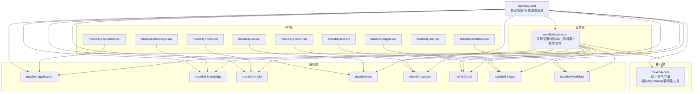
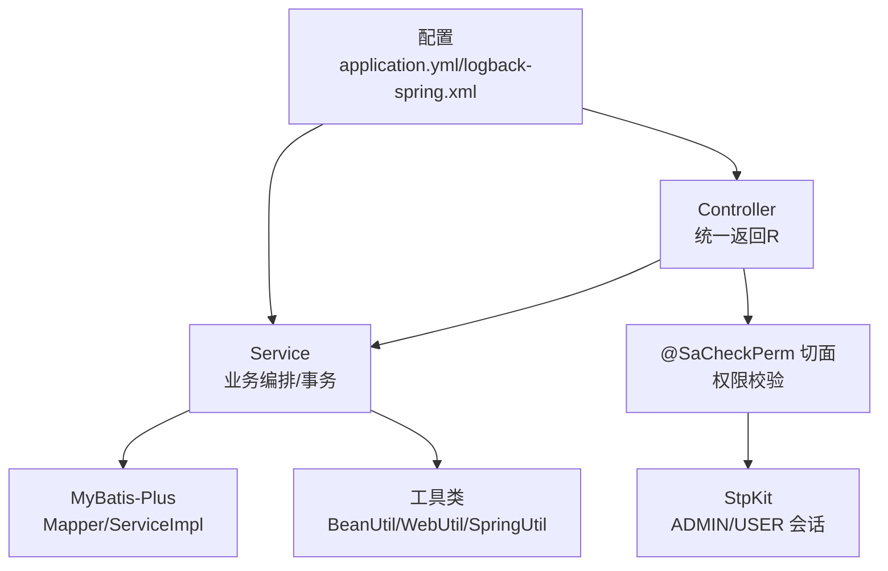
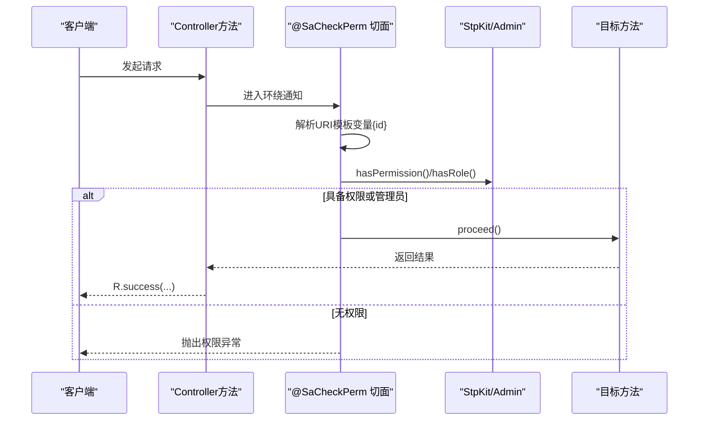
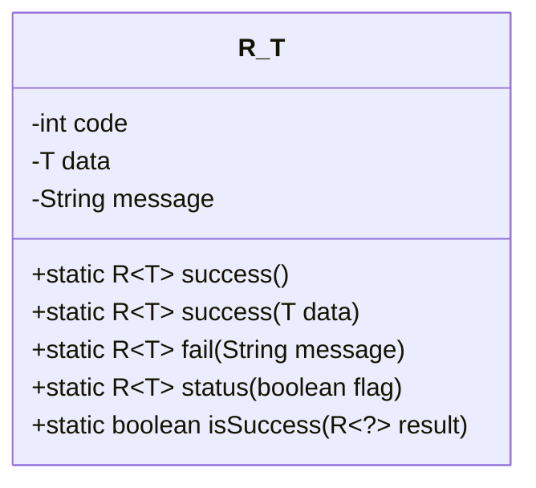
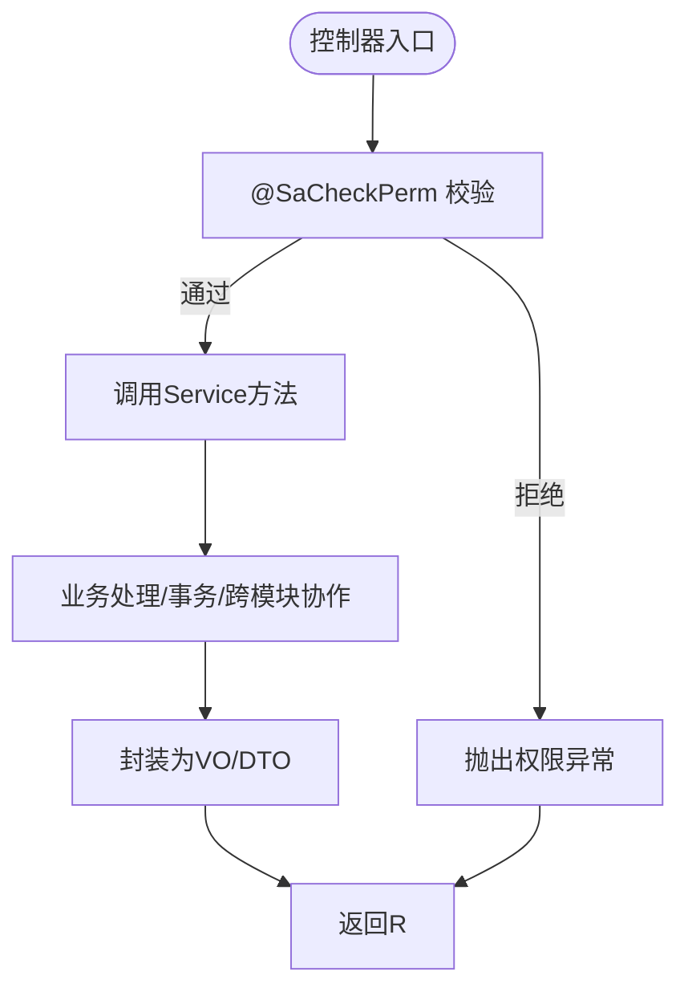
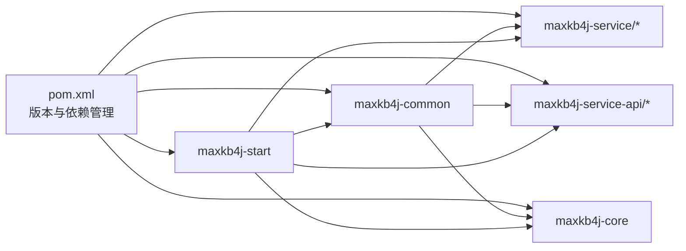

# 代码规范与最佳实践

<cite>
**本文引用的文件**
- [maxkb4j-common/src/main/java/com/maxkb4j/common/annotation/SaCheckPerm.java](file://maxkb4j-common/src/main/java/com/maxkb4j/common/annotation/SaCheckPerm.java)
- [maxkb4j-common/src/main/java/com/maxkb4j/common/aspect/SaCheckPermAspect.java](file://maxkb4j-common/src/main/java/com/maxkb4j/common/aspect/SaCheckPermAspect.java)
- [maxkb4j-common/src/main/java/com/maxkb4j/common/api/R.java](file://maxkb4j-common/src/main/java/com/maxkb4j/common/api/R.java)
- [maxkb4j-common/src/main/java/com/maxkb4j/common/util/SpringUtil.java](file://maxkb4j-common/src/main/java/com/maxkb4j/common/util/SpringUtil.java)
- [maxkb4j-common/src/main/java/com/maxkb4j/common/util/WebUtil.java](file://maxkb4j-common/src/main/java/com/maxkb4j/common/util/WebUtil.java)
- [maxkb4j-common/src/main/java/com/maxkb4j/common/enums/PermissionEnum.java](file://maxkb4j-common/src/main/java/com/maxkb4j/common/enums/PermissionEnum.java)
- [maxkb4j-common/src/main/java/com/maxkb4j/common/util/StpKit.java](file://maxkb4j-common/src/main/java/com/maxkb4j/common/util/StpKit.java)
- [maxkb4j-common/src/main/java/com/maxkb4j/common/constant/Permission.java](file://maxkb4j-common/src/main/java/com/maxkb4j/common/constant/Permission.java)
- [maxkb4j-common/src/main/java/com/maxkb4j/common/util/BeanUtil.java](file://maxkb4j-common/src/main/java/com/maxkb4j/common/util/BeanUtil.java)
- [maxkb4j-common/src/main/java/com/maxkb4j/common/util/ObjectUtil.java](file://maxkb4j-common/src/main/java/com/maxkb4j/common/util/ObjectUtil.java)
- [maxkb4j-service/maxkb4j-application/src/main/java/com/maxkb4j/application/controller/ApplicationController.java](file://maxkb4j-service/maxkb4j-application/src/main/java/com/maxkb4j/application/controller/ApplicationController.java)
- [maxkb4j-service/maxkb4j-application/src/main/java/com/maxkb4j/application/service/ApplicationService.java](file://maxkb4j-service/maxkb4j-application/src/main/java/com/maxkb4j/application/service/ApplicationService.java)
- [maxkb4j-start/src/main/resources/application.yml](file://maxkb4j-start/src/main/resources/application.yml)
- [maxkb4j-start/src/main/resources/logback-spring.xml](file://maxkb4j-start/src/main/resources/logback-spring.xml)
- [pom.xml](file://pom.xml)
</cite>

## 目录
1. [引言](#引言)
2. [项目结构](#项目结构)
3. [核心组件](#核心组件)
4. [架构总览](#架构总览)
5. [详细组件分析](#详细组件分析)
6. [依赖分析](#依赖分析)
7. [性能考虑](#性能考虑)
8. [故障排查指南](#故障排查指南)
9. [结论](#结论)
10. [附录](#附录)

## 引言
本指南面向MaxKB4j团队与贡献者，系统性制定Java编码规范与最佳实践，覆盖命名约定、类设计原则、方法组织方式、注解使用规范（尤其是权限注解@SaCheckPerm）、代码格式化、日志记录、异常处理模式、模块化设计（接口设计、依赖注入、配置管理）、性能优化、内存管理、线程安全以及代码审查清单与质量保证流程。目标是统一风格、提升可维护性与可读性，并降低运行时风险。

## 项目结构
MaxKB4j采用多模块Maven聚合工程，核心模块包括：
- maxkb4j-common：通用能力（注解、切面、响应封装、工具类、常量、枚举、异常、类型处理器等）
- maxkb4j-core：核心业务与事件、拦截器、LangChain4j集成、监听器、工具
- maxkb4j-service：服务层（应用、知识库、模型、OSS、系统、工具、触发器、工作流等子模块）
- maxkb4j-service-api：各服务的API定义（DTO、实体、Mapper、Service接口、VO）
- maxkb4j-start：启动入口、配置、静态资源、模板、数据库迁移脚本

图表来源
- [pom.xml:57-63](file://pom.xml#L57-L63)

章节来源
- [pom.xml:57-63](file://pom.xml#L57-L63)

## 核心组件
本节聚焦通用能力与权限控制相关的核心构件，明确职责边界与使用规范。

- 注解与切面
  - @SaCheckPerm：声明式权限注解，标注在Controller方法上，用于基于资源权限字符串进行鉴权
  - SaCheckPermAspect：环绕切面，解析路径变量生成具体权限字符串，结合StpKit进行权限校验
- 响应封装
  - R<T>：统一响应体，包含code、data、message；提供success/fail/status/data等静态工厂方法
- 工具与实用类
  - SpringUtil：ApplicationContext持有与事件发布、Bean注册辅助
  - WebUtil：请求上下文、Cookie、JSON输出、IP解析、Header与Token提取
  - BeanUtil：Bean拷贝（含忽略null）、集合转换、反射转Map
  - ObjectUtil：安全相等比较、简单类型判断
- 枚举与常量
  - PermissionEnum：权限元数据（资源类型、资源标识、操作、权限级别），支持生成资源级权限字符串
  - Permission：权限级别常量（管理/查看/未认证）
  - StpKit：Sa-Token逻辑实例（ADMIN/USER）及Token名称拼接定制

章节来源
- [maxkb4j-common/src/main/java/com/maxkb4j/common/annotation/SaCheckPerm.java:11-15](file://maxkb4j-common/src/main/java/com/maxkb4j/common/annotation/SaCheckPerm.java#L11-L15)
- [maxkb4j-common/src/main/java/com/maxkb4j/common/aspect/SaCheckPermAspect.java:26-60](file://maxkb4j-common/src/main/java/com/maxkb4j/common/aspect/SaCheckPermAspect.java#L26-L60)
- [maxkb4j-common/src/main/java/com/maxkb4j/common/api/R.java:16-150](file://maxkb4j-common/src/main/java/com/maxkb4j/common/api/R.java#L16-L150)
- [maxkb4j-common/src/main/java/com/maxkb4j/common/util/SpringUtil.java:18-73](file://maxkb4j-common/src/main/java/com/maxkb4j/common/util/SpringUtil.java#L18-L73)
- [maxkb4j-common/src/main/java/com/maxkb4j/common/util/WebUtil.java:25-151](file://maxkb4j-common/src/main/java/com/maxkb4j/common/util/WebUtil.java#L25-L151)
- [maxkb4j-common/src/main/java/com/maxkb4j/common/enums/PermissionEnum.java:12-120](file://maxkb4j-common/src/main/java/com/maxkb4j/common/enums/PermissionEnum.java#L12-L120)
- [maxkb4j-common/src/main/java/com/maxkb4j/common/util/StpKit.java:8-37](file://maxkb4j-common/src/main/java/com/maxkb4j/common/util/StpKit.java#L8-L37)
- [maxkb4j-common/src/main/java/com/maxkb4j/common/constant/Permission.java:3-8](file://maxkb4j-common/src/main/java/com/maxkb4j/common/constant/Permission.java#L3-L8)
- [maxkb4j-common/src/main/java/com/maxkb4j/common/util/BeanUtil.java:24-122](file://maxkb4j-common/src/main/java/com/maxkb4j/common/util/BeanUtil.java#L24-L122)
- [maxkb4j-common/src/main/java/com/maxkb4j/common/util/ObjectUtil.java:7-62](file://maxkb4j-common/src/main/java/com/maxkb4j/common/util/ObjectUtil.java#L7-L62)

## 架构总览
MaxKB4j遵循分层与模块化设计：
- 表现层：Controller（Spring MVC），统一返回R<T>
- 业务层：Service（Spring），事务与复杂编排
- 数据访问层：MyBatis-Plus Mapper/ServiceImpl
- 安全与权限：Sa-Token + 自定义注解+切面
- 日志与监控：Logback + SpringDoc/Knife4j
- 配置：Spring Boot多环境配置

图表来源
- [maxkb4j-service/maxkb4j-application/src/main/java/com/maxkb4j/application/controller/ApplicationController.java:42-187](file://maxkb4j-service/maxkb4j-application/src/main/java/com/maxkb4j/application/controller/ApplicationController.java#L42-L187)
- [maxkb4j-common/src/main/java/com/maxkb4j/common/aspect/SaCheckPermAspect.java:26-60](file://maxkb4j-common/src/main/java/com/maxkb4j/common/aspect/SaCheckPermAspect.java#L26-L60)
- [maxkb4j-common/src/main/java/com/maxkb4j/common/util/StpKit.java:8-37](file://maxkb4j-common/src/main/java/com/maxkb4j/common/util/StpKit.java#L8-L37)
- [maxkb4j-start/src/main/resources/application.yml](file://maxkb4j-start/src/main/resources/application.yml)
- [maxkb4j-start/src/main/resources/logback-spring.xml](file://maxkb4j-start/src/main/resources/logback-spring.xml)

## 详细组件分析

### 权限注解与切面：@SaCheckPerm 与 SaCheckPermAspect
- 设计要点
  - 注解仅作用于方法，通过枚举PermissionEnum描述资源、操作与权限级别
  - 切面在环绕通知中解析请求上下文与URI模板变量，动态生成资源级权限字符串
  - 结合StpKit.Admin与角色判定，实现“管理员放行”与“精确权限校验”
- 使用规范
  - Controller方法上使用@SaCheckPerm(PermissionEnum.XXX)，确保资源粒度权限一致
  - 路径变量{id}会被自动替换到权限字符串模板中，避免硬编码
  - 管理员角色拥有最高权限，普通用户需满足具体资源权限
- 错误处理
  - 无法获取请求上下文时抛出运行时异常
  - 无权限时抛出NotPermissionException，由全局异常处理捕获并返回统一响应

图表来源
- [maxkb4j-common/src/main/java/com/maxkb4j/common/aspect/SaCheckPermAspect.java:26-60](file://maxkb4j-common/src/main/java/com/maxkb4j/common/aspect/SaCheckPermAspect.java#L26-L60)
- [maxkb4j-common/src/main/java/com/maxkb4j/common/util/StpKit.java:8-37](file://maxkb4j-common/src/main/java/com/maxkb4j/common/util/StpKit.java#L8-L37)
- [maxkb4j-common/src/main/java/com/maxkb4j/common/enums/PermissionEnum.java:109-115](file://maxkb4j-common/src/main/java/com/maxkb4j/common/enums/PermissionEnum.java#L109-L115)

章节来源
- [maxkb4j-common/src/main/java/com/maxkb4j/common/annotation/SaCheckPerm.java:11-15](file://maxkb4j-common/src/main/java/com/maxkb4j/common/annotation/SaCheckPerm.java#L11-L15)
- [maxkb4j-common/src/main/java/com/maxkb4j/common/aspect/SaCheckPermAspect.java:26-60](file://maxkb4j-common/src/main/java/com/maxkb4j/common/aspect/SaCheckPermAspect.java#L26-L60)
- [maxkb4j-common/src/main/java/com/maxkb4j/common/enums/PermissionEnum.java:109-115](file://maxkb4j-common/src/main/java/com/maxkb4j/common/enums/PermissionEnum.java#L109-L115)
- [maxkb4j-common/src/main/java/com/maxkb4j/common/util/StpKit.java:8-37](file://maxkb4j-common/src/main/java/com/maxkb4j/common/util/StpKit.java#L8-L37)

### 统一响应体：R<T>
- 设计要点
  - 内部字段：code、data、message
  - 提供多种静态工厂方法：success/fail/status/data
  - 与IResultCode配合，保证状态码一致性
- 使用规范
  - 控制器统一返回R<T>，避免直接返回原始对象
  - 成功场景优先使用success(data)/data(data,message)
  - 失败场景使用fail(code/message/IResultCode)
  - 使用isSuccess/isNotSuccess进行快速判断

图表来源
- [maxkb4j-common/src/main/java/com/maxkb4j/common/api/R.java:16-150](file://maxkb4j-common/src/main/java/com/maxkb4j/common/api/R.java#L16-L150)

章节来源
- [maxkb4j-common/src/main/java/com/maxkb4j/common/api/R.java:16-150](file://maxkb4j-common/src/main/java/com/maxkb4j/common/api/R.java#L16-L150)

### 工具类与实用方法
- SpringUtil
  - 提供Bean获取、事件发布、BeanDefinition注册等能力
  - 注意：尽量通过依赖注入获取Bean，避免直接使用静态工具
- WebUtil
  - 统一封装请求上下文、Cookie、JSON输出、IP解析、Header与Token提取
  - 输出JSON时统一字符集与内容类型
- BeanUtil/ObjectUtil
  - Bean拷贝（含忽略null）、集合转换、反射转Map
  - 安全相等比较与简单类型判断，避免空指针与类型不一致

章节来源
- [maxkb4j-common/src/main/java/com/maxkb4j/common/util/SpringUtil.java:18-73](file://maxkb4j-common/src/main/java/com/maxkb4j/common/util/SpringUtil.java#L18-L73)
- [maxkb4j-common/src/main/java/com/maxkb4j/common/util/WebUtil.java:25-151](file://maxkb4j-common/src/main/java/com/maxkb4j/common/util/WebUtil.java#L25-L151)
- [maxkb4j-common/src/main/java/com/maxkb4j/common/util/BeanUtil.java:24-122](file://maxkb4j-common/src/main/java/com/maxkb4j/common/util/BeanUtil.java#L24-L122)
- [maxkb4j-common/src/main/java/com/maxkb4j/common/util/ObjectUtil.java:7-62](file://maxkb4j-common/src/main/java/com/maxkb4j/common/util/ObjectUtil.java#L7-L62)

### 控制器与服务示例：ApplicationController 与 ApplicationService
- 控制器
  - 使用@SaCheckPerm标注各端点，确保权限最小化
  - 统一返回R<T>，部分端点返回二进制流或SSE
- 服务
  - 复杂业务编排、事务控制、跨模块协作
  - 使用工具类完成Bean拷贝、分页、日期时间处理等
  - 对外暴露清晰的Service接口，便于单元测试与替换

图表来源
- [maxkb4j-service/maxkb4j-application/src/main/java/com/maxkb4j/application/controller/ApplicationController.java:53-187](file://maxkb4j-service/maxkb4j-application/src/main/java/com/maxkb4j/application/controller/ApplicationController.java#L53-L187)
- [maxkb4j-service/maxkb4j-application/src/main/java/com/maxkb4j/application/service/ApplicationService.java:83-126](file://maxkb4j-service/maxkb4j-application/src/main/java/com/maxkb4j/application/service/ApplicationService.java#L83-L126)

章节来源
- [maxkb4j-service/maxkb4j-application/src/main/java/com/maxkb4j/application/controller/ApplicationController.java:42-187](file://maxkb4j-service/maxkb4j-application/src/main/java/com/maxkb4j/application/controller/ApplicationController.java#L42-L187)
- [maxkb4j-service/maxkb4j-application/src/main/java/com/maxkb4j/application/service/ApplicationService.java:66-564](file://maxkb4j-service/maxkb4j-application/src/main/java/com/maxkb4j/application/service/ApplicationService.java#L66-564)

## 依赖分析
- 版本与依赖管理
  - Java版本：21
  - Spring Boot 3.5.1
  - MyBatis-Plus 3.5.9
  - Sa-Token 1.39.0
  - LangChain4j 1.13.0
  - Knife4j/SpringDoc OpenAPI
  - Lombok（provided）
- 模块间耦合
  - 服务层依赖API层接口，避免反向依赖
  - 公共层被所有业务模块依赖，保持低耦合高内聚
  - 配置集中在start模块，其他模块按需引入

图表来源
- [pom.xml:19-602](file://pom.xml#L19-L602)

章节来源
- [pom.xml:19-602](file://pom.xml#L19-L602)

## 性能考虑
- 编译与构建
  - 启用JVM参数-parameters，便于调试与反射
  - 使用spring-boot-maven-plugin与flatten插件，减少POM冗余
- 运行时
  - 优先使用流式响应（SSE/Flux）处理大体量数据，避免阻塞
  - 控制器返回R<T>，减少序列化开销与重复封装
  - 合理使用工具类（BeanUtil/ObjectUtil）避免深层拷贝与空值判断成本
- 数据访问
  - MyBatis-Plus分页查询与条件构造器，避免一次性加载全表
  - 事务边界明确，避免长事务锁表
- 安全与鉴权
  - 权限字符串模板化，避免硬编码与重复计算
  - 管理员快速放行策略，减少不必要的权限判断

## 故障排查指南
- 权限相关
  - 症状：无权限异常
  - 排查：确认@SaCheckPerm注解与PermissionEnum是否匹配；检查StpKit登录态与角色；核对URI模板变量{id}是否正确解析
- 响应与序列化
  - 症状：返回体不符合预期
  - 排查：确认控制器返回R<T>；检查IResultCode与message；避免直接返回原始对象
- Web工具
  - 症状：IP解析或Header取值异常
  - 排查：使用WebUtil.getIP()/getHeader()；确认请求上下文存在
- 日志
  - 症状：日志缺失或格式异常
  - 排查：检查logback-spring.xml配置；确认Logger级别与输出位置

章节来源
- [maxkb4j-common/src/main/java/com/maxkb4j/common/aspect/SaCheckPermAspect.java:26-60](file://maxkb4j-common/src/main/java/com/maxkb4j/common/aspect/SaCheckPermAspect.java#L26-L60)
- [maxkb4j-common/src/main/java/com/maxkb4j/common/api/R.java:16-150](file://maxkb4j-common/src/main/java/com/maxkb4j/common/api/R.java#L16-L150)
- [maxkb4j-common/src/main/java/com/maxkb4j/common/util/WebUtil.java:85-109](file://maxkb4j-common/src/main/java/com/maxkb4j/common/util/WebUtil.java#L85-L109)
- [maxkb4j-start/src/main/resources/logback-spring.xml](file://maxkb4j-start/src/main/resources/logback-spring.xml)

## 结论
通过统一的注解驱动权限体系、标准化的响应封装、完善的工具类与严格的模块划分，MaxKB4j实现了高内聚、低耦合、易维护的架构。建议在后续迭代中持续完善代码审查清单与自动化质量门禁，确保规范落地与演进。

## 附录

### Java编码规范与最佳实践清单
- 命名约定
  - 包名：com.maxkb4j.{模块}
  - 类名：名词或复合词，首字母大写；接口以I前缀或抽象类以Abs前缀
  - 方法：动词短语，小驼峰；布尔方法以is/has/can前缀
  - 常量：全大写，下划线分隔
  - 变量：小驼峰；避免缩写，必要时使用语义明确的缩略
- 类设计原则
  - 单一职责：每个类/接口职责明确，避免“上帝类”
  - 依赖倒置：面向接口编程，通过构造器/Setter注入
  - 开闭原则：对扩展开放，对修改关闭（通过SPI/注册机制）
- 方法组织方式
  - 先声明后实现；私有方法尽量靠近使用处
  - 参数顺序：必填在前，可选在后；同功能参数分组
  - 返回值：优先返回不可变集合；空值统一处理
- 注解使用规范
  - @SaCheckPerm：仅用于Controller方法；枚举值与资源权限一致
  - @RequiredArgsConstructor + final字段：强制依赖注入，避免可变状态
  - Swagger注解：为公共API补充Schema描述
- 代码格式化
  - 统一使用UTF-8编码与LF换行
  - 缩进：4空格；行宽不超过120字符
  - 导包：按字母序，静态导入单独一组
- 日志记录规范
  - 使用SLF4J；避免System.out/System.err
  - 关键路径记录trace/debug/info/warn/error；敏感信息脱敏
  - 使用MDC传递TraceId/RequestId，便于链路追踪
- 异常处理模式
  - 自定义异常：区分业务异常与系统异常
  - 控制器：统一由全局异常处理返回R<T>
  - 服务层：明确异常传播边界，必要时包装为业务异常
- 模块化开发
  - 接口设计：API层定义接口，服务层实现；避免循环依赖
  - 依赖注入：优先构造器注入；避免XML配置
  - 配置管理：多环境配置分离；敏感配置外部化
- 性能优化建议
  - 减少反射与动态代理开销；合理缓存热点数据
  - 流式处理大数据；分页查询与投影查询
  - 数据库索引与SQL优化；连接池参数调优
- 内存管理最佳实践
  - 避免长时间持有大对象；及时释放临时缓冲区
  - 使用轻量级集合与基本类型；避免装箱拆箱
  - 定期检查GC日志，识别内存泄漏
- 线程安全考虑
  - 无状态Bean；避免共享可变状态
  - 并发场景使用原子类/并发容器；加锁范围最小化
  - 异步任务使用线程池；避免线程泄露
- 代码审查检查清单
  - 是否遵循命名与设计原则
  - 权限注解是否正确使用
  - 是否使用R<T>统一返回
  - 是否存在硬编码与魔法数
  - 是否有充分的单元测试与边界覆盖
  - 是否考虑异常分支与降级策略
  - 是否有性能瓶颈与内存隐患
  - 是否符合日志与审计要求