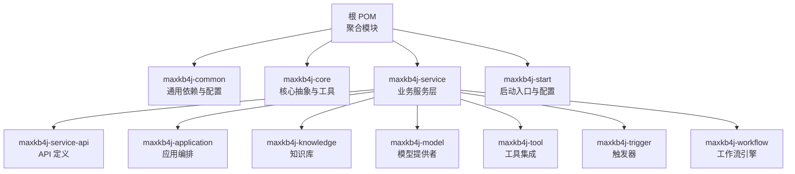
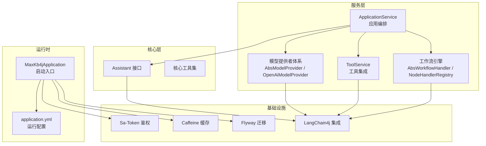
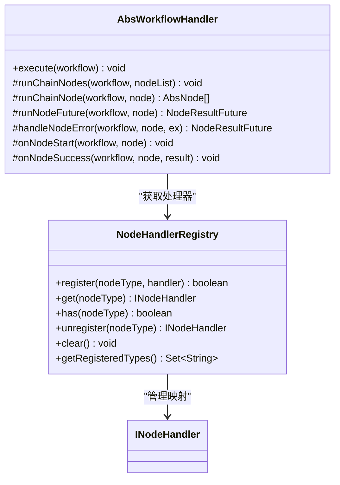
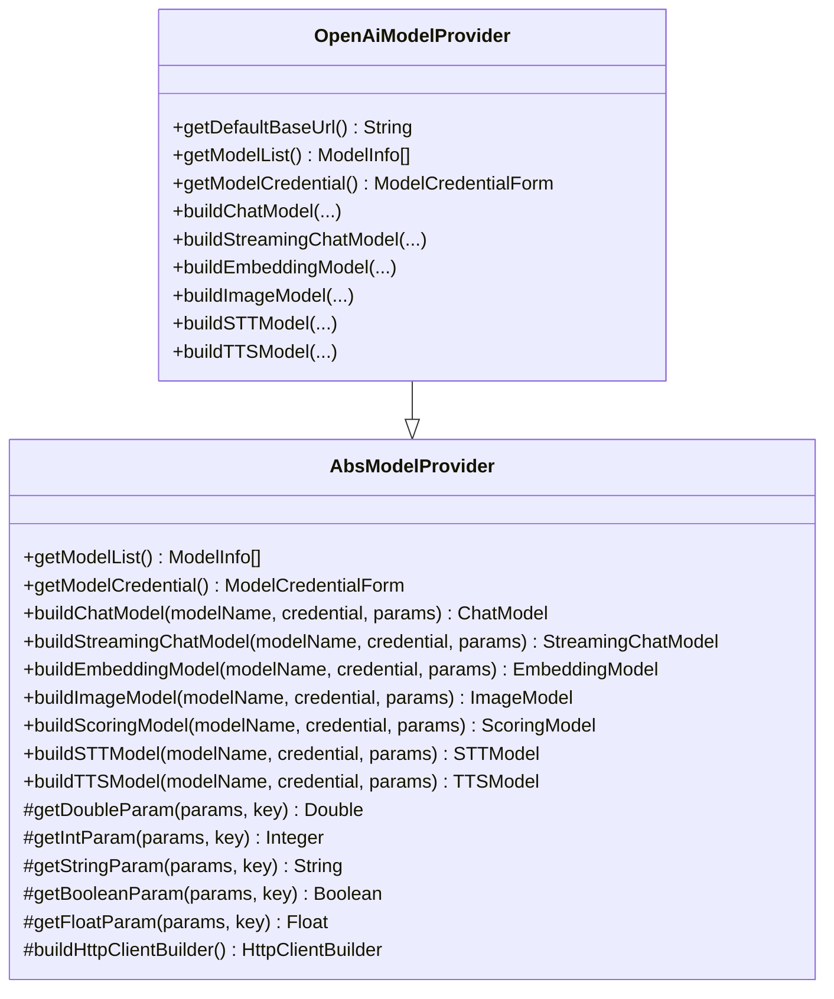
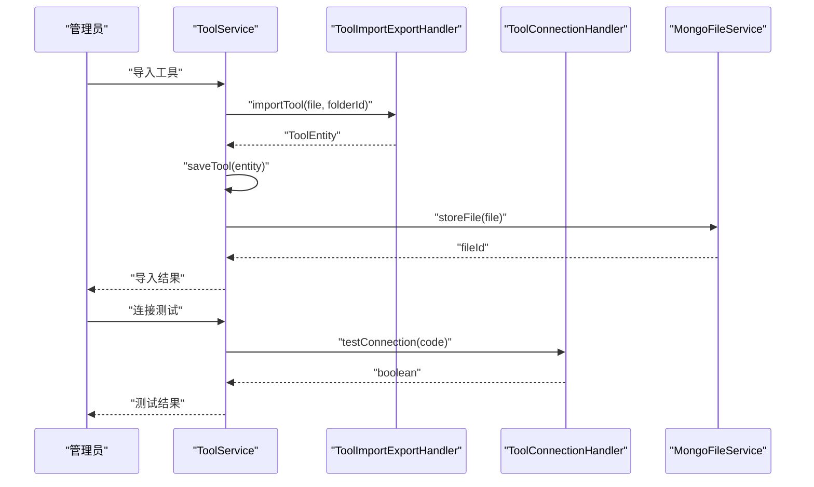
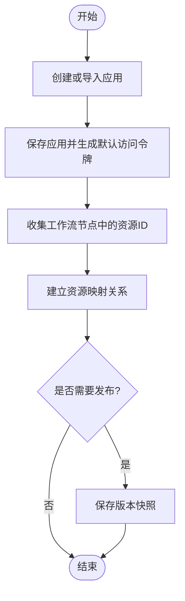
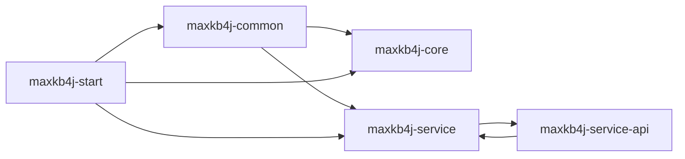

# 开发指南

<cite>
**本文引用的文件**
- [README.md](file://README.md)
- [pom.xml](file://pom.xml)
- [MaxKb4jApplication.java](file://maxkb4j-start/src/main/java/com/maxkb4j/start/MaxKb4jApplication.java)
- [application.yml](file://maxkb4j-start/src/main/resources/application.yml)
- [maxkb4j-common/pom.xml](file://maxkb4j-common/pom.xml)
- [maxkb4j-core/pom.xml](file://maxkb4j-core/pom.xml)
- [Assistant.java](file://maxkb4j-core/src/main/java/com/maxkb4j/core/assistant/Assistant.java)
- [AbsModelProvider.java](file://maxkb4j-service/maxkb4j-model/src/main/java/com/maxkb4j/model/provider/AbsModelProvider.java)
- [OpenAiModelProvider.java](file://maxkb4j-service/maxkb4j-model/src/main/java/com/maxkb4j/model/provider/OpenAiModelProvider.java)
- [AbsWorkflowHandler.java](file://maxkb4j-service/maxkb4j-workflow/src/main/java/com/maxkb4j/workflow/handler/AbsWorkflowHandler.java)
- [NodeHandlerRegistry.java](file://maxkb4j-service/maxkb4j-workflow/src/main/java/com/maxkb4j/workflow/registry/NodeHandlerRegistry.java)
- [ToolService.java](file://maxkb4j-service/maxkb4j-tool/src/main/java/com/maxkb4j/tool/service/ToolService.java)
- [ApplicationService.java](file://maxkb4j-service/maxkb4j-application/src/main/java/com/maxkb4j/application/service/ApplicationService.java)
</cite>

## 目录
1. [简介](#简介)
2. [项目结构](#项目结构)
3. [核心组件](#核心组件)
4. [架构总览](#架构总览)
5. [详细组件分析](#详细组件分析)
6. [依赖分析](#依赖分析)
7. [性能考虑](#性能考虑)
8. [故障排查指南](#故障排查指南)
9. [结论](#结论)
10. [附录](#附录)

## 简介
本开发指南面向希望参与 MaxKB4j 项目的贡献者，目标是帮助你快速理解并高效扩展系统功能。内容涵盖开发环境搭建、IDE 配置、代码规范与提交流程；深入讲解核心开发模式（节点处理器开发、模型提供者扩展、工具集成开发）；提供插件开发最佳实践（接口实现、异常处理、性能优化）；说明单元测试与集成测试策略及调试技巧；明确代码审查标准、持续集成配置与发布流程；并给出扩展点识别方法与自定义组件开发指南，形成从入门到精通的学习路径。

## 项目结构
MaxKB4j 采用多模块 Maven 结构，核心模块包括：
- maxkb4j-common：通用能力（安全、缓存、MyBatis Plus、LangChain4j 集成等）
- maxkb4j-core：核心抽象与工具（助手接口、事件、监听器、工具集等）
- maxkb4j-service：业务服务层（应用、知识库、模型、工具、触发器、工作流等子模块）
- maxkb4j-service-api：各服务的 API 定义与实体、Mapper、VO、DTO
- maxkb4j-start：启动入口与配置（Spring Boot 启动类、YAML 配置）

图表来源
- [pom.xml:57-63](file://pom.xml#L57-L63)
- [maxkb4j-common/pom.xml:14-89](file://maxkb4j-common/pom.xml#L14-L89)
- [maxkb4j-core/pom.xml:19-39](file://maxkb4j-core/pom.xml#L19-L39)

章节来源
- [pom.xml:57-63](file://pom.xml#L57-L63)
- [maxkb4j-common/pom.xml:14-89](file://maxkb4j-common/pom.xml#L14-L89)
- [maxkb4j-core/pom.xml:19-39](file://maxkb4j-core/pom.xml#L19-L39)

## 核心组件
- 应用启动与配置
  - 启动类负责自动激活 dev 配置文件、开启定时与缓存注解
  - YAML 提供端口、缓存、Flyway 迁移、Sa-Token、multipart 等基础配置
- 通用模块
  - 聚合了 LangChain4j、Sa-Token、MyBatis Plus、Caffeine、FastJSON 等关键依赖
- 核心抽象
  - Assistant 接口定义聊天与流式聊天能力
- 模型提供者
  - 抽象基类封装参数解析、HTTP 客户端构建、模型工厂方法
  - 典型实现如 OpenAI 提供者，支持多种模型类型与参数表单
- 工作流引擎
  - 抽象处理器封装节点执行、并发与超时控制、异常链处理
  - 注册表管理节点类型到处理器的映射
- 工具服务
  - 封装工具导入导出、连接测试、权限过滤、文件存储与技能包解压
- 应用服务
  - 应用创建/发布、资源映射、TTS/STT、Prompt 生成、嵌入页渲染等

章节来源
- [MaxKb4jApplication.java:10-20](file://maxkb4j-start/src/main/java/com/maxkb4j/start/MaxKb4jApplication.java#L10-L20)
- [application.yml:1-69](file://maxkb4j-start/src/main/resources/application.yml#L1-L69)
- [maxkb4j-common/pom.xml:14-89](file://maxkb4j-common/pom.xml#L14-L89)
- [Assistant.java:11-21](file://maxkb4j-core/src/main/java/com/maxkb4j/core/assistant/Assistant.java#L11-L21)
- [AbsModelProvider.java:36-244](file://maxkb4j-service/maxkb4j-model/src/main/java/com/maxkb4j/model/provider/AbsModelProvider.java#L36-L244)
- [OpenAiModelProvider.java:29-125](file://maxkb4j-service/maxkb4j-model/src/main/java/com/maxkb4j/model/provider/OpenAiModelProvider.java#L29-L125)
- [AbsWorkflowHandler.java:27-189](file://maxkb4j-service/maxkb4j-workflow/src/main/java/com/maxkb4j/workflow/handler/AbsWorkflowHandler.java#L27-L189)
- [NodeHandlerRegistry.java:18-122](file://maxkb4j-service/maxkb4j-workflow/src/main/java/com/maxkb4j/workflow/registry/NodeHandlerRegistry.java#L18-L122)
- [ToolService.java:49-290](file://maxkb4j-service/maxkb4j-tool/src/main/java/com/maxkb4j/tool/service/ToolService.java#L49-L290)
- [ApplicationService.java:68-563](file://maxkb4j-service/maxkb4j-application/src/main/java/com/maxkb4j/application/service/ApplicationService.java#L68-L563)

## 架构总览
系统基于 Spring Boot 3 + Java 21，结合 LangChain4j 实现 RAG 与 LLM 工作流编排；通过多模块划分实现关注点分离；使用 Sa-Token 实现鉴权，Caffeine 缓存提升性能；MyBatis Plus 访问关系数据库，Flyway 自动迁移；支持 MCP、Skills 等工具协议扩展。

图表来源
- [MaxKb4jApplication.java:10-20](file://maxkb4j-start/src/main/java/com/maxkb4j/start/MaxKb4jApplication.java#L10-L20)
- [application.yml:1-69](file://maxkb4j-start/src/main/resources/application.yml#L1-L69)
- [Assistant.java:11-21](file://maxkb4j-core/src/main/java/com/maxkb4j/core/assistant/Assistant.java#L11-L21)
- [AbsModelProvider.java:36-244](file://maxkb4j-service/maxkb4j-model/src/main/java/com/maxkb4j/model/provider/AbsModelProvider.java#L36-L244)
- [OpenAiModelProvider.java:29-125](file://maxkb4j-service/maxkb4j-model/src/main/java/com/maxkb4j/model/provider/OpenAiModelProvider.java#L29-L125)
- [ToolService.java:49-290](file://maxkb4j-service/maxkb4j-tool/src/main/java/com/maxkb4j/tool/service/ToolService.java#L49-L290)
- [AbsWorkflowHandler.java:27-189](file://maxkb4j-service/maxkb4j-workflow/src/main/java/com/maxkb4j/workflow/handler/AbsWorkflowHandler.java#L27-L189)
- [NodeHandlerRegistry.java:18-122](file://maxkb4j-service/maxkb4j-workflow/src/main/java/com/maxkb4j/workflow/registry/NodeHandlerRegistry.java#L18-L122)

## 详细组件分析

### 节点处理器开发
- 设计要点
  - 使用注册表集中管理节点类型到处理器的映射，遵循单一职责
  - 抽象处理器封装节点执行、并发执行、超时控制与异常链处理
  - 通过钩子方法在节点执行前后注入调度逻辑
- 关键流程
  - 获取处理器 -> 记录执行轨迹 -> 执行节点 -> 成功钩子 -> 写上下文与详情
  - 异常统一由异常解析链处理，设置节点状态为错误
- 并发与超时
  - 并行执行多个兄弟节点，按分钟级超时控制，超时后取消任务并进入异常链

图表来源
- [NodeHandlerRegistry.java:18-122](file://maxkb4j-service/maxkb4j-workflow/src/main/java/com/maxkb4j/workflow/registry/NodeHandlerRegistry.java#L18-L122)
- [AbsWorkflowHandler.java:27-189](file://maxkb4j-service/maxkb4j-workflow/src/main/java/com/maxkb4j/workflow/handler/AbsWorkflowHandler.java#L27-L189)

章节来源
- [NodeHandlerRegistry.java:18-122](file://maxkb4j-service/maxkb4j-workflow/src/main/java/com/maxkb4j/workflow/registry/NodeHandlerRegistry.java#L18-L122)
- [AbsWorkflowHandler.java:27-189](file://maxkb4j-service/maxkb4j-workflow/src/main/java/com/maxkb4j/workflow/handler/AbsWorkflowHandler.java#L27-L189)

### 模型提供者扩展
- 设计要点
  - 抽象基类提供参数解析、延迟初始化 HTTP 客户端、模型工厂方法
  - 支持不同模型类型（LLM、Embedding、Vision、TTI、STT、TTS）的构建
  - 可自定义凭据表单与参数表单
- 开发步骤
  - 继承抽象基类，实现模型清单与凭据表单
  - 重写对应模型构建方法，使用凭据与参数装配具体模型
  - 在启动时注册或通过自动注册机制暴露给上层调用
- 示例参考
  - OpenAI 提供者展示了如何构建聊天、流式聊天、嵌入、图像、STT、TTS 模型

图表来源
- [AbsModelProvider.java:36-244](file://maxkb4j-service/maxkb4j-model/src/main/java/com/maxkb4j/model/provider/AbsModelProvider.java#L36-L244)
- [OpenAiModelProvider.java:29-125](file://maxkb4j-service/maxkb4j-model/src/main/java/com/maxkb4j/model/provider/OpenAiModelProvider.java#L29-L125)

章节来源
- [AbsModelProvider.java:36-244](file://maxkb4j-service/maxkb4j-model/src/main/java/com/maxkb4j/model/provider/AbsModelProvider.java#L36-L244)
- [OpenAiModelProvider.java:29-125](file://maxkb4j-service/maxkb4j-model/src/main/java/com/maxkb4j/model/provider/OpenAiModelProvider.java#L29-L125)

### 工具集成开发
- 设计要点
  - ToolService 封装工具的分页、导入导出、连接测试、权限过滤、文件存储与技能包处理
  - 通过工具处理器链完成验证、导入导出、连接测试等横切逻辑
- 关键流程
  - 导入：解析文件、创建实体、持久化、建立权限映射
  - 连接测试：调用连接处理器进行连通性校验
  - 技能包：对 Skill 类型工具进行解压与目录维护

图表来源
- [ToolService.java:105-140](file://maxkb4j-service/maxkb4j-tool/src/main/java/com/maxkb4j/tool/service/ToolService.java#L105-L140)

章节来源
- [ToolService.java:49-290](file://maxkb4j-service/maxkb4j-tool/src/main/java/com/maxkb4j/tool/service/ToolService.java#L49-L290)

### 应用编排与资源映射
- 设计要点
  - ApplicationService 负责应用创建、发布、资源映射、TTS/STT、Prompt 生成、嵌入页渲染
  - 自动收集工作流节点中的知识库、工具、模型等资源并建立映射关系
- 关键流程
  - 创建应用：支持模板导入与直接创建，生成默认访问令牌与权限映射
  - 发布应用：保存当前版本快照，便于回溯与审计
  - 资源映射：遍历工作流节点，收集知识库、工具、模型 ID 并持久化映射

图表来源
- [ApplicationService.java:208-245](file://maxkb4j-service/maxkb4j-application/src/main/java/com/maxkb4j/application/service/ApplicationService.java#L208-L245)
- [ApplicationService.java:396-413](file://maxkb4j-service/maxkb4j-application/src/main/java/com/maxkb4j/application/service/ApplicationService.java#L396-L413)

章节来源
- [ApplicationService.java:68-563](file://maxkb4j-service/maxkb4j-application/src/main/java/com/maxkb4j/application/service/ApplicationService.java#L68-L563)

## 依赖分析
- 技术栈与版本
  - Java 21、Spring Boot 3、LangChain4j 1.x、Sa-Token、MyBatis Plus、Caffeine、FastJSON、Knife4j、Flyway 等
- 模块间耦合
  - maxkb4j-core 依赖 maxkb4j-common
  - 服务模块依赖 API 模块与通用模块
  - 启动模块聚合所有子模块
- 外部依赖集成
  - LangChain4j 提供模型与工具集成能力
  - Sa-Token 提供鉴权与会话管理
  - Flyway 负责数据库迁移

图表来源
- [pom.xml:57-63](file://pom.xml#L57-L63)
- [maxkb4j-common/pom.xml:14-89](file://maxkb4j-common/pom.xml#L14-L89)
- [maxkb4j-core/pom.xml:19-39](file://maxkb4j-core/pom.xml#L19-L39)

章节来源
- [pom.xml:57-63](file://pom.xml#L57-L63)
- [maxkb4j-common/pom.xml:14-89](file://maxkb4j-common/pom.xml#L14-L89)
- [maxkb4j-core/pom.xml:19-39](file://maxkb4j-core/pom.xml#L19-L39)

## 性能考虑
- 并发与异步
  - 工作流节点采用 CompletableFuture 并行执行，结合线程池与超时控制，避免阻塞
- 缓存
  - Caffeine 缓存用于加速热点数据访问，减少重复计算与外部调用
- 数据库与迁移
  - MyBatis Plus 与 Flyway 配合，确保数据库结构演进与查询性能
- 模型调用
  - 抽象模型提供者延迟初始化 HTTP 客户端，减少启动开销
- I/O 与文件
  - 工具导入导出与技能包解压采用流式处理，降低内存占用

章节来源
- [AbsWorkflowHandler.java:58-84](file://maxkb4j-service/maxkb4j-workflow/src/main/java/com/maxkb4j/workflow/handler/AbsWorkflowHandler.java#L58-L84)
- [application.yml:19-20](file://maxkb4j-start/src/main/resources/application.yml#L19-L20)
- [AbsModelProvider.java:44-60](file://maxkb4j-service/maxkb4j-model/src/main/java/com/maxkb4j/model/provider/AbsModelProvider.java#L44-L60)
- [ToolService.java:105-140](file://maxkb4j-service/maxkb4j-tool/src/main/java/com/maxkb4j/tool/service/ToolService.java#L105-L140)

## 故障排查指南
- 启动与配置
  - 若未设置 active profile，启动类会默认使用 dev；检查 application.yml 中的端口、缓存、Flyway、Sa-Token 等配置
- 模型提供者
  - 若模型构建失败，检查凭据与参数是否正确传递至构建方法；确认默认 BaseURL 与凭据表单
- 工具集成
  - 导入失败时查看异常日志，确认文件解析与存储是否成功；连接测试失败需检查网络与凭据
- 工作流执行
  - 节点超时：根据超时分钟数调整配置并检查下游依赖；异常链会统一记录并设置节点状态为错误
- 应用发布
  - 发布失败或版本缺失：检查资源映射是否正确收集，确认版本保存逻辑

章节来源
- [MaxKb4jApplication.java:15-19](file://maxkb4j-start/src/main/java/com/maxkb4j/start/MaxKb4jApplication.java#L15-L19)
- [application.yml:1-69](file://maxkb4j-start/src/main/resources/application.yml#L1-L69)
- [AbsModelProvider.java:161-229](file://maxkb4j-service/maxkb4j-model/src/main/java/com/maxkb4j/model/provider/AbsModelProvider.java#L161-L229)
- [ToolService.java:118-140](file://maxkb4j-service/maxkb4j-tool/src/main/java/com/maxkb4j/tool/service/ToolService.java#L118-L140)
- [AbsWorkflowHandler.java:64-84](file://maxkb4j-service/maxkb4j-workflow/src/main/java/com/maxkb4j/workflow/handler/AbsWorkflowHandler.java#L64-L84)
- [ApplicationService.java:396-413](file://maxkb4j-service/maxkb4j-application/src/main/java/com/maxkb4j/application/service/ApplicationService.java#L396-L413)

## 结论
MaxKB4j 通过清晰的模块划分与抽象设计，提供了可扩展的模型提供者、工作流引擎与工具集成能力。遵循本文档的开发与扩展方法，你可以快速定位扩展点、实现自定义组件，并在保证性能与稳定性的同时，持续迭代系统功能。

## 附录

### 开发环境搭建与 IDE 配置
- 系统要求
  - Java 21+
  - PostgreSQL 12+（启用 pgvector）
  - MongoDB 6.0+（可选）
- 启动方式
  - 本地 JAR 启动或 Docker Compose 推荐
  - 默认访问地址与初始账号密码见项目说明
- IDE 建议
  - IntelliJ IDEA：启用 Lombok 插件；配置 Maven 自动导入；设置编码为 UTF-8；启用编译参数

章节来源
- [README.md:51-98](file://README.md#L51-L98)

### 代码规范与提交流程
- 规范
  - 遵循阿里巴巴 Java 开发手册；保持模块内高内聚、低耦合；新增功能配套单元测试
- 提交流程
  - Fork 项目 → 新建分支 → 提交变更 → 推送分支 → 提交 PR；描述变更动机与影响范围

章节来源
- [README.md:120-129](file://README.md#L120-L129)

### 单元测试与集成测试
- 单元测试
  - 针对 Service 层方法进行 Mock 与断言；覆盖正常路径与异常路径
- 集成测试
  - 使用容器化数据库（PostgreSQL/MongoDB）进行端到端验证；覆盖模型提供者、工具导入导出、工作流执行等关键路径

[本节为通用指导，不直接分析具体文件]

### 调试技巧
- 启动参数
  - 设置 spring.profiles.active=dev；配置 Sa-Token JWT 秘钥；开启 p6spy 日志
- 关键断点
  - 模型提供者构建入口、工作流节点执行入口、工具连接测试入口、应用发布版本保存入口

章节来源
- [MaxKb4jApplication.java:15-19](file://maxkb4j-start/src/main/java/com/maxkb4j/start/MaxKb4jApplication.java#L15-L19)
- [application.yml:38-66](file://maxkb4j-start/src/main/resources/application.yml#L38-L66)
- [AbsModelProvider.java:55-60](file://maxkb4j-service/maxkb4j-model/src/main/java/com/maxkb4j/model/provider/AbsModelProvider.java#L55-L60)
- [AbsWorkflowHandler.java:125-148](file://maxkb4j-service/maxkb4j-workflow/src/main/java/com/maxkb4j/workflow/handler/AbsWorkflowHandler.java#L125-L148)
- [ToolService.java:133-140](file://maxkb4j-service/maxkb4j-tool/src/main/java/com/maxkb4j/tool/service/ToolService.java#L133-L140)
- [ApplicationService.java:396-413](file://maxkb4j-service/maxkb4j-application/src/main/java/com/maxkb4j/application/service/ApplicationService.java#L396-L413)

### 代码审查标准
- 可读性：命名规范、注释清晰、方法粒度合理
- 正确性：边界条件、异常处理、幂等性
- 性能：避免阻塞调用、合理使用缓存与并发
- 安全：输入校验、鉴权与授权、敏感信息脱敏

[本节为通用指导，不直接分析具体文件]

### 持续集成与发布
- CI/CD 建议
  - Maven 构建与测试流水线；容器镜像构建与推送；自动化部署脚本
- 发布流程
  - 版本号管理（使用 Maven revision）；发布前检查依赖与兼容性；发布后验证核心功能

章节来源
- [pom.xml:19-24](file://pom.xml#L19-L24)
- [MaxKb4jApplication.java:15-19](file://maxkb4j-start/src/main/java/com/maxkb4j/start/MaxKb4jApplication.java#L15-L19)

### 扩展点识别与自定义组件开发
- 扩展点
  - 模型提供者：实现 AbsModelProvider 并注册
  - 节点处理器：实现 INodeHandler 并注册到 NodeHandlerRegistry
  - 工具处理器：实现验证/导入导出/连接测试接口并接入 ToolService
- 最佳实践
  - 参数与凭据分离；异常统一处理；性能优先（延迟初始化、并发执行、缓存命中）
  - 文档与测试同步完善

章节来源
- [AbsModelProvider.java:36-244](file://maxkb4j-service/maxkb4j-model/src/main/java/com/maxkb4j/model/provider/AbsModelProvider.java#L36-L244)
- [NodeHandlerRegistry.java:39-53](file://maxkb4j-service/maxkb4j-workflow/src/main/java/com/maxkb4j/workflow/registry/NodeHandlerRegistry.java#L39-L53)
- [ToolService.java:118-140](file://maxkb4j-service/maxkb4j-tool/src/main/java/com/maxkb4j/tool/service/ToolService.java#L118-L140)