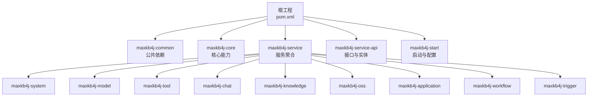
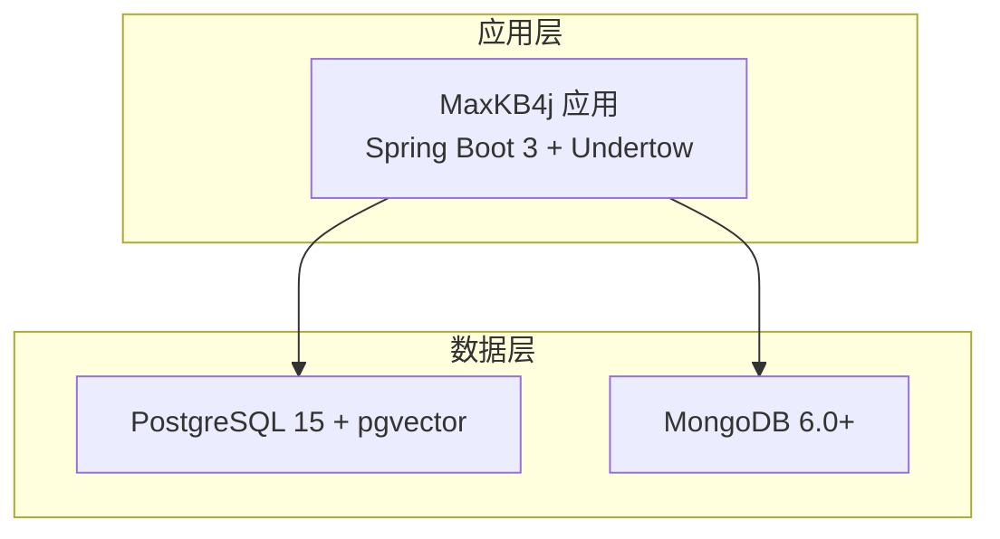
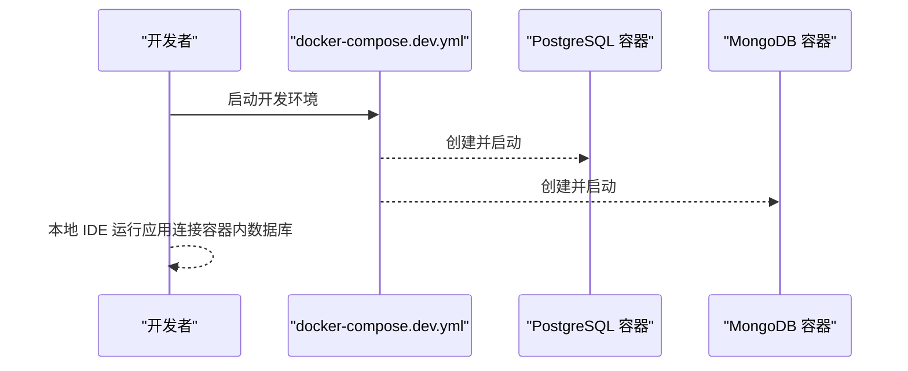
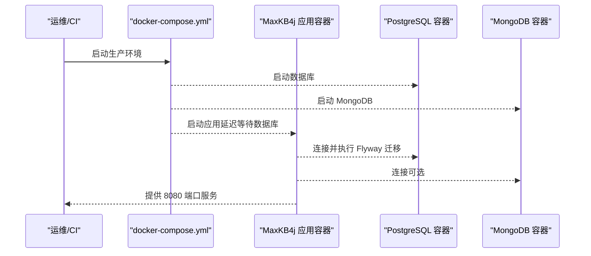
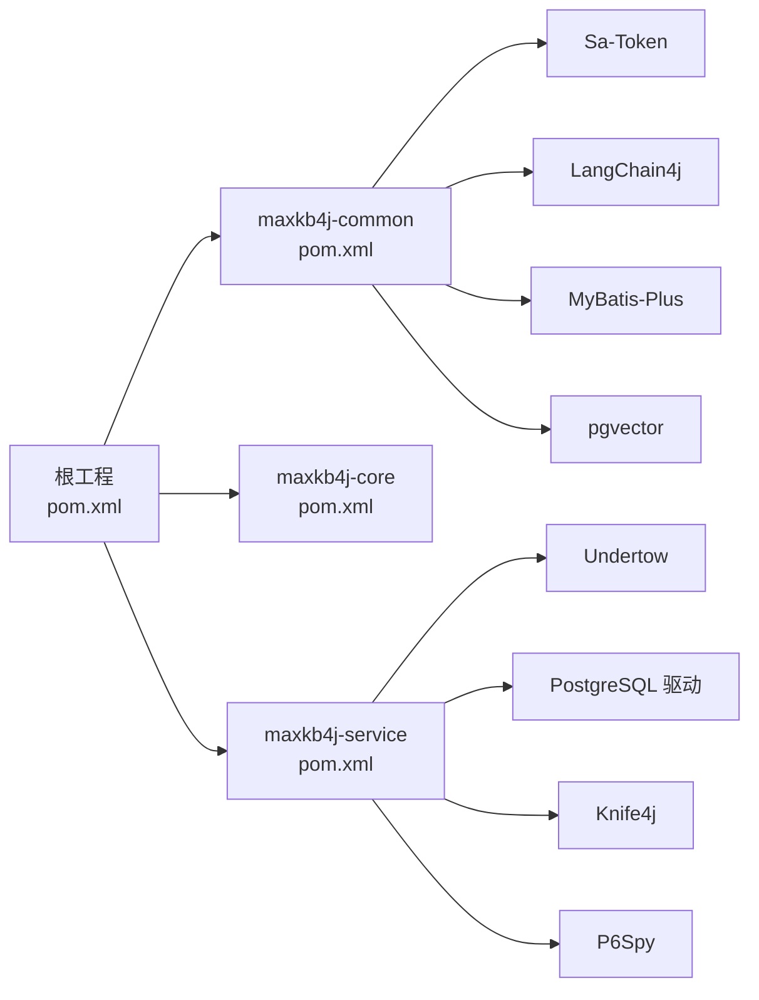

# 开发环境搭建

<cite>
**本文引用的文件**
- [pom.xml](file://pom.xml)
- [README.md](file://README.md)
- [docker-compose.yml](file://docker-compose.yml)
- [docker-compose.dev.yml](file://docker-compose.dev.yml)
- [Dockerfile](file://maxkb4j-start/Dockerfile)
- [application.yml](file://maxkb4j-start/src/main/resources/application.yml)
- [application-dev.yml](file://maxkb4j-start/src/main/resources/application-dev.yml)
- [MaxKb4jApplication.java](file://maxkb4j-start/src/main/java/com/maxkb4j/start/MaxKb4jApplication.java)
- [maxkb4j-common/pom.xml](file://maxkb4j-common/pom.xml)
- [maxkb4j-core/pom.xml](file://maxkb4j-core/pom.xml)
- [maxkb4j-service/pom.xml](file://maxkb4j-service/pom.xml)
- [.gitignore](file://.gitignore)
</cite>

## 目录
1. [简介](#简介)
2. [项目结构](#项目结构)
3. [核心组件](#核心组件)
4. [架构总览](#架构总览)
5. [详细组件分析](#详细组件分析)
6. [依赖分析](#依赖分析)
7. [性能考虑](#性能考虑)
8. [故障排除指南](#故障排除指南)
9. [结论](#结论)
10. [附录](#附录)

## 简介
本指南面向希望在本地搭建 MaxKB4j 开发环境的工程师与技术团队，覆盖以下内容：
- 必备软件与版本要求：Java 21+、Maven、PostgreSQL（含 pgvector 扩展）、MongoDB
- IDE 配置建议（IntelliJ IDEA 或 Eclipse）
- 项目克隆、依赖下载、数据库初始化步骤
- Docker 容器化开发与生产部署方案
- 开发环境变量、数据库连接、API 密钥等配置要点
- 常见问题排查与解决思路

## 项目结构
MaxKB4j 采用多模块 Maven 工程组织，核心模块包括：
- maxkb4j-common：公共依赖与工具
- maxkb4j-core：核心能力与工具集
- maxkb4j-service：业务服务聚合模块（包含多个子模块）
- maxkb4j-service-api：各业务领域实体与 Mapper 层定义
- maxkb4j-start：Spring Boot 启动模块与资源配置

图表来源
- [pom.xml](file://pom.xml)
- [maxkb4j-service/pom.xml](file://maxkb4j-service/pom.xml)

章节来源
- [pom.xml](file://pom.xml)
- [maxkb4j-service/pom.xml](file://maxkb4j-service/pom.xml)

## 核心组件
- 后端框架：Spring Boot 3.x（基于 Java 21）
- 认证授权：Sa-Token
- 文档与监控：Knife4j + P6Spy
- ORM 与数据库：MyBatis-Plus + PostgreSQL（pgvector 扩展）+ 可选 MongoDB
- AI 能力：LangChain4j 生态（多模型提供商适配）
- Web 容器：Undertow（非 Tomcat）

章节来源
- [pom.xml](file://pom.xml)
- [maxkb4j-common/pom.xml](file://maxkb4j-common/pom.xml)
- [maxkb4j-core/pom.xml](file://maxkb4j-core/pom.xml)
- [maxkb4j-service/pom.xml](file://maxkb4j-service/pom.xml)

## 架构总览
MaxKB4j 的运行时由应用容器与数据存储容器组成。应用通过 JDBC 连接 PostgreSQL（含 pgvector），通过 MongoDB（可选）进行全文检索；Flyway 自动迁移数据库结构。

图表来源
- [application.yml](file://maxkb4j-start/src/main/resources/application.yml)
- [docker-compose.yml](file://docker-compose.yml)

## 详细组件分析

### 1) 必需软件与版本要求
- Java 21+：用于编译与运行
- Maven：用于构建与依赖管理
- PostgreSQL 12+：配合 pgvector 扩展
- MongoDB 6.0+：可选，用于全文检索

章节来源
- [README.md](file://README.md)
- [pom.xml](file://pom.xml)

### 2) IDE 配置建议（IntelliJ IDEA/Eclipse）
- 编译级别与参数
  - Java 版本：21
  - 编译参数：启用 -parameters
  - 字符编码：UTF-8
- 插件建议
  - Lombok（简化实体类）
  - MyBatis/X路径提示（Mapper/XML）
  - Alibaba Java Coding Guidelines（代码规范）
  - .ignore（忽略规则）
- 代码格式化
  - 使用阿里巴巴 Java 编码规范
  - 统一注释风格与缩进
- 运行配置
  - Spring Boot 主类：MaxKb4jApplication
  - 默认激活 profile：dev（若未显式设置）

章节来源
- [pom.xml](file://pom.xml)
- [MaxKb4jApplication.java](file://maxkb4j-start/src/main/java/com/maxkb4j/start/MaxKb4jApplication.java)
- [.gitignore](file://.gitignore)

### 3) 项目克隆与依赖下载
- 克隆仓库后，使用 Maven 下载依赖并构建
- 若首次运行，Flyway 将自动执行数据库迁移脚本（位于资源目录中）
- 若未找到迁移脚本，请确认资源目录结构与打包产物完整

章节来源
- [application.yml](file://maxkb4j-start/src/main/resources/application.yml)
- [pom.xml](file://pom.xml)

### 4) 数据库初始化步骤
- PostgreSQL
  - 安装 PostgreSQL 15 并启用 pgvector 扩展
  - Flyway 将根据 classpath:db/migration 自动迁移
- MongoDB（可选）
  - 安装 MongoDB 6.0+
  - 用于全文检索场景（如知识库解析后的索引）
- 初始化流程
  - 首次启动会自动初始化数据库与集合
  - 如需手动迁移，确保 Flyway 配置正确且数据库可达

章节来源
- [application.yml](file://maxkb4j-start/src/main/resources/application.yml)
- [docker-compose.yml](file://docker-compose.yml)

### 5) Docker 环境搭建
- 开发模式（仅数据库）
  - 使用 docker-compose.dev.yml 启动 PostgreSQL 与 MongoDB
  - 适用于本地开发联调
- 生产/集成模式
  - 使用 docker-compose.yml 启动应用容器，并挂载日志与证书
  - 应用容器依赖数据库容器，启动时延时等待数据库就绪
- 应用镜像
  - 基于 Amazon Corretto 21
  - 对外暴露 8080 端口
  - 默认以 UTF-8 启动

图表来源
- [docker-compose.dev.yml](file://docker-compose.dev.yml)

图表来源
- [docker-compose.yml](file://docker-compose.yml)
- [Dockerfile](file://maxkb4j-start/Dockerfile)

### 6) 开发环境变量与配置
- 默认端口与缓存
  - 服务器端口：8080
  - 缓存类型：Caffeine
- 数据源与迁移
  - Flyway：classpath:db/migration
  - 表名/列名格式：双引号包裹
- Sa-Token JWT 密钥
  - 通过环境变量注入（默认值为占位符）
- 系统默认账户
  - 用户名：admin
  - 密码：可通过环境变量覆盖
- 开发配置示例
  - application-dev.yml 中提供数据库与 MongoDB 的连接样例

章节来源
- [application.yml](file://maxkb4j-start/src/main/resources/application.yml)
- [application-dev.yml](file://maxkb4j-start/src/main/resources/application-dev.yml)
- [MaxKb4jApplication.java](file://maxkb4j-start/src/main/java/com/maxkb4j/start/MaxKb4jApplication.java)

### 7) API 文档与调试
- Knife4j 文档：集成 OpenAPI 文档
- P6Spy SQL 日志：可按需开启 SQL 观察

章节来源
- [pom.xml](file://pom.xml)
- [application.yml](file://maxkb4j-start/src/main/resources/application.yml)

## 依赖分析
- 核心依赖链
  - 根工程统一管理版本与依赖范围
  - maxkb4j-common 引入 Sa-Token、LangChain4j、MyBatis-Plus、PgVector 等
  - maxkb4j-core 依赖 common，并引入 EasyExcel 等工具
  - maxkb4j-service 聚合各业务模块，统一 Web 容器与数据库驱动
- 关键外部组件
  - PostgreSQL + pgvector：向量检索
  - MongoDB：可选全文检索
  - Undertow：高性能 Web 容器
  - Sa-Token：认证授权
  - Knife4j + P6Spy：文档与 SQL 观察

图表来源
- [pom.xml](file://pom.xml)
- [maxkb4j-common/pom.xml](file://maxkb4j-common/pom.xml)
- [maxkb4j-core/pom.xml](file://maxkb4j-core/pom.xml)
- [maxkb4j-service/pom.xml](file://maxkb4j-service/pom.xml)

章节来源
- [pom.xml](file://pom.xml)
- [maxkb4j-common/pom.xml](file://maxkb4j-common/pom.xml)
- [maxkb4j-core/pom.xml](file://maxkb4j-core/pom.xml)
- [maxkb4j-service/pom.xml](file://maxkb4j-service/pom.xml)

## 性能考虑
- 使用 Java 21 与虚拟线程提升并发性能
- Undertow 替代 Tomcat，降低资源占用
- Caffeine 本地缓存加速热点数据访问
- Flyway 自动迁移减少手工维护成本
- SQL 监控与文档集成便于性能分析与排障

## 故障排除指南
- 端口冲突
  - 修改 application.yml 中 server.port 或停止占用进程
- 数据库连接失败
  - 检查 application-dev.yml 或环境变量中的 JDBC/MongoDB URI
  - 确认容器网络与主机映射（Docker 环境）
- Flyway 迁移异常
  - 确认 classpath:db/migration 资源存在且命名规范
  - 查看应用日志中的 Flyway 执行状态
- JWT 密钥未配置
  - 设置 SA_TOKEN_JWT_SECRET_KEY 环境变量
- 首次启动无数据
  - 确认数据库已初始化，且默认管理员账户可用
- IDE 运行 profile 未生效
  - 确保未设置 spring.profiles.active 时，程序默认使用 dev

章节来源
- [application.yml](file://maxkb4j-start/src/main/resources/application.yml)
- [application-dev.yml](file://maxkb4j-start/src/main/resources/application-dev.yml)
- [MaxKb4jApplication.java](file://maxkb4j-start/src/main/java/com/maxkb4j/start/MaxKb4jApplication.java)
- [docker-compose.yml](file://docker-compose.yml)

## 结论
按照本指南完成软件安装、数据库初始化与容器配置后，即可在本地快速启动 MaxKB4j 开发环境。建议优先使用 Docker Compose 进行开发联调，再结合 IDE 进行功能迭代与调试。遇到问题时，优先检查数据库连通性、迁移状态与环境变量配置。

## 附录
- 快速启动（本地 JAR）
  - 使用命令行直接运行打包好的 JAR 文件
- Docker 镜像构建
  - 基于 Amazon Corretto 21，暴露 8080 端口，使用 UTF-8 启动

章节来源
- [README.md](file://README.md)
- [Dockerfile](file://maxkb4j-start/Dockerfile)