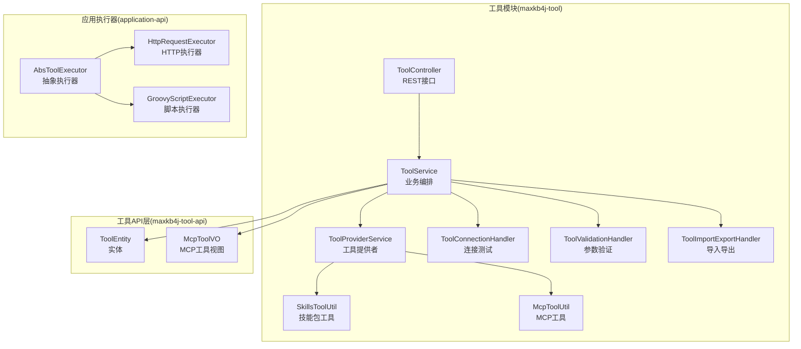
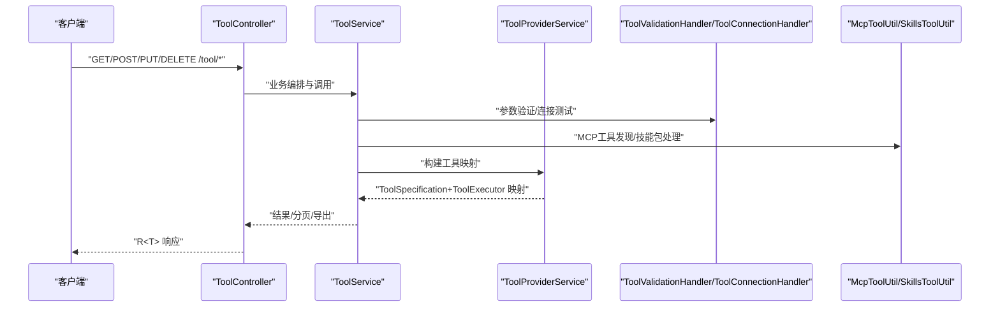
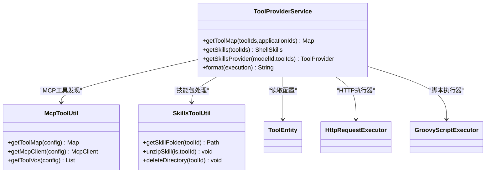
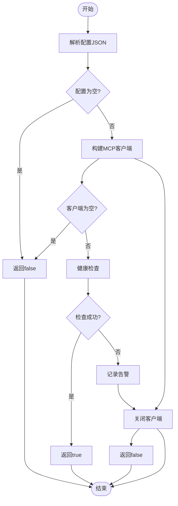
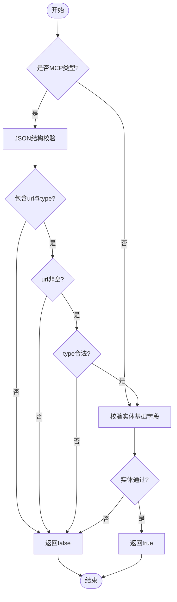
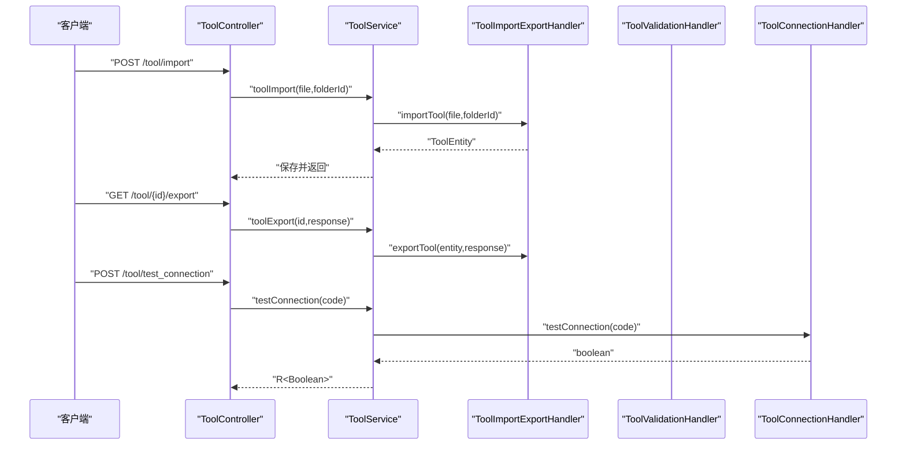
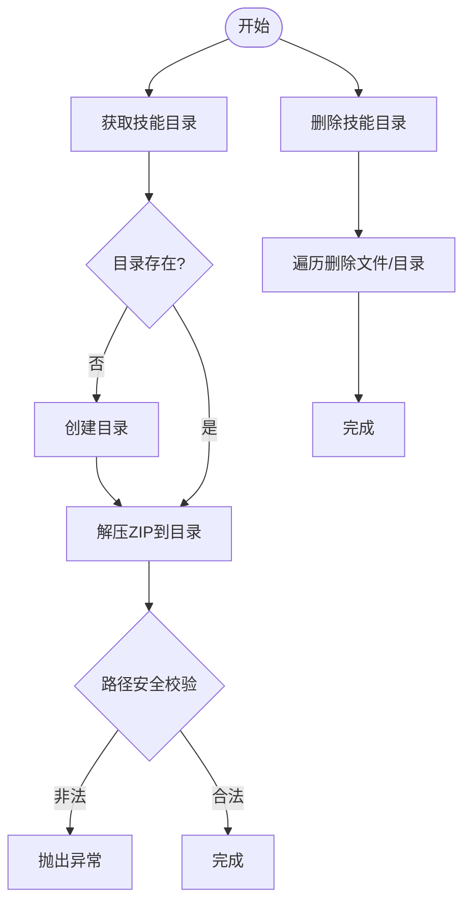
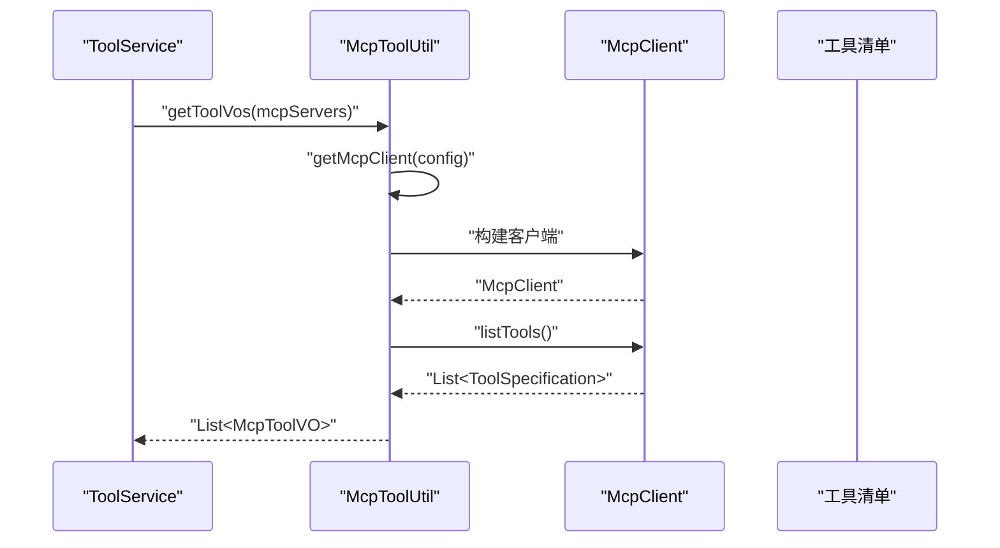
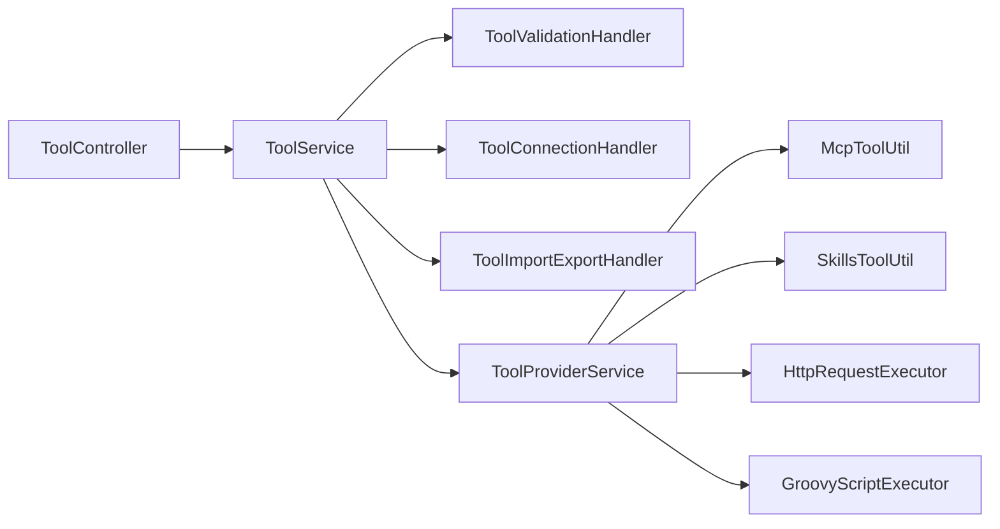

# 工具集成扩展开发

<cite>
**本文引用的文件**
- [ToolProviderService.java](file://maxkb4j-service/maxkb4j-tool/src/main/java/com/maxkb4j/tool/service/ToolProviderService.java)
- [ToolConnectionHandler.java](file://maxkb4j-service/maxkb4j-tool/src/main/java/com/maxkb4j/tool/handler/ToolConnectionHandler.java)
- [ToolValidationHandler.java](file://maxkb4j-service/maxkb4j-tool/src/main/java/com/maxkb4j/tool/handler/ToolValidationHandler.java)
- [SkillsToolUtil.java](file://maxkb4j-service/maxkb4j-tool/src/main/java/com/maxkb4j/tool/util/SkillsToolUtil.java)
- [McpToolUtil.java](file://maxkb4j-service/maxkb4j-tool/src/main/java/com/maxkb4j/tool/util/McpToolUtil.java)
- [ToolController.java](file://maxkb4j-service/maxkb4j-tool/src/main/java/com/maxkb4j/tool/controller/ToolController.java)
- [ToolConstants.java](file://maxkb4j-service/maxkb4j-tool/src/main/java/com/maxkb4j/tool/consts/ToolConstants.java)
- [ToolService.java](file://maxkb4j-service/maxkb4j-tool/src/main/java/com/maxkb4j/tool/service/ToolService.java)
- [ToolImportExportHandler.java](file://maxkb4j-service/maxkb4j-tool/src/main/java/com/maxkb4j/tool/handler/ToolImportExportHandler.java)
- [ToolEntity.java](file://maxkb4j-service-api/maxkb4j-tool-api/src/main/java/com/maxkb4j/tool/entity/ToolEntity.java)
- [McpToolVO.java](file://maxkb4j-service-api/maxkb4j-tool-api/src/main/java/com/maxkb4j/tool/vo/McpToolVO.java)
- [AbsToolExecutor.java](file://maxkb4j-service-api/maxkb4j-application-api/src/main/java/com/maxkb4j/application/executor/AbsToolExecutor.java)
- [HttpRequestExecutor.java](file://maxkb4j-service-api/maxkb4j-application-api/src/main/java/com/maxkb4j/application/executor/HttpRequestExecutor.java)
- [GroovyScriptExecutor.java](file://maxkb4j-service-api/maxkb4j-application-api/src/main/java/com/maxkb4j/application/executor/GroovyScriptExecutor.java)
- [ToolException.java](file://maxkb4j-service/maxkb4j-tool/src/main/java/com/maxkb4j/tool/exception/ToolException.java)
</cite>

## 目录
1. [简介](#简介)
2. [项目结构](#项目结构)
3. [核心组件](#核心组件)
4. [架构总览](#架构总览)
5. [详细组件分析](#详细组件分析)
6. [依赖分析](#依赖分析)
7. [性能考虑](#性能考虑)
8. [故障排查指南](#故障排查指南)
9. [结论](#结论)
10. [附录](#附录)

## 简介
本指南面向MaxKB4j工具集成扩展开发者，系统讲解工具提供者服务架构与工具提供者注册机制，覆盖连接测试、参数验证、导入导出、MCP协议支持、工具发现与动态加载策略，并给出自定义工具开发的完整流程与最佳实践。文档同时提供数据库工具、消息推送工具、搜索引擎工具等实际扩展示例思路，帮助快速落地。

## 项目结构
MaxKB4j采用多模块分层设计，工具集成相关能力集中在maxkb4j-tool模块及API层，配合application-api中的执行器抽象，形成“控制器-服务-处理器-工具库”的清晰职责划分。

**图表来源**
- [ToolController.java:35-182](file://maxkb4j-service/maxkb4j-tool/src/main/java/com/maxkb4j/tool/controller/ToolController.java#L35-L182)
- [ToolService.java:47-290](file://maxkb4j-service/maxkb4j-tool/src/main/java/com/maxkb4j/tool/service/ToolService.java#L47-L290)
- [ToolProviderService.java:50-310](file://maxkb4j-service/maxkb4j-tool/src/main/java/com/maxkb4j/tool/service/ToolProviderService.java#L50-L310)
- [ToolConnectionHandler.java:9-46](file://maxkb4j-service/maxkb4j-tool/src/main/java/com/maxkb4j/tool/handler/ToolConnectionHandler.java#L9-L46)
- [ToolValidationHandler.java:12-119](file://maxkb4j-service/maxkb4j-tool/src/main/java/com/maxkb4j/tool/handler/ToolValidationHandler.java#L12-L119)
- [ToolImportExportHandler.java:20-83](file://maxkb4j-service/maxkb4j-tool/src/main/java/com/maxkb4j/tool/handler/ToolImportExportHandler.java#L20-L83)
- [SkillsToolUtil.java:14-90](file://maxkb4j-service/maxkb4j-tool/src/main/java/com/maxkb4j/tool/util/SkillsToolUtil.java#L14-L90)
- [McpToolUtil.java:18-132](file://maxkb4j-service/maxkb4j-tool/src/main/java/com/maxkb4j/tool/util/McpToolUtil.java#L18-L132)
- [ToolEntity.java:16-49](file://maxkb4j-service-api/maxkb4j-tool-api/src/main/java/com/maxkb4j/tool/entity/ToolEntity.java#L16-L49)
- [McpToolVO.java:6-12](file://maxkb4j-service-api/maxkb4j-tool-api/src/main/java/com/maxkb4j/tool/vo/McpToolVO.java#L6-L12)
- [AbsToolExecutor.java:13-65](file://maxkb4j-service-api/maxkb4j-application-api/src/main/java/com/maxkb4j/application/executor/AbsToolExecutor.java#L13-L65)
- [HttpRequestExecutor.java:18-102](file://maxkb4j-service-api/maxkb4j-application-api/src/main/java/com/maxkb4j/application/executor/HttpRequestExecutor.java#L18-L102)
- [GroovyScriptExecutor.java:11-41](file://maxkb4j-service-api/maxkb4j-application-api/src/main/java/com/maxkb4j/application/executor/GroovyScriptExecutor.java#L11-L41)

**章节来源**
- [ToolController.java:35-182](file://maxkb4j-service/maxkb4j-tool/src/main/java/com/maxkb4j/tool/controller/ToolController.java#L35-L182)
- [ToolService.java:47-290](file://maxkb4j-service/maxkb4j-tool/src/main/java/com/maxkb4j/tool/service/ToolService.java#L47-L290)

## 核心组件
- 工具提供者服务：负责根据工具ID或应用ID构建LangChain4j工具规范与执行器映射，支持MCP、HTTP、自定义脚本、技能包等多种类型。
- 连接测试处理器：基于MCP客户端进行健康检查，验证MCP服务器连通性。
- 参数验证处理器：校验工具实体与MCP配置的合法性，保证运行期安全与稳定性。
- 导入导出处理器：提供工具配置的序列化导出与反序列化导入，支持批量与单个工具操作。
- 工具实用类：封装MCP工具发现与动态加载、技能包解压与清理等通用能力。
- 控制器：对外暴露REST接口，包括分页查询、调试、导入导出、连接测试、技能文件上传等。

**章节来源**
- [ToolProviderService.java:50-310](file://maxkb4j-service/maxkb4j-tool/src/main/java/com/maxkb4j/tool/service/ToolProviderService.java#L50-L310)
- [ToolConnectionHandler.java:9-46](file://maxkb4j-service/maxkb4j-tool/src/main/java/com/maxkb4j/tool/handler/ToolConnectionHandler.java#L9-L46)
- [ToolValidationHandler.java:12-119](file://maxkb4j-service/maxkb4j-tool/src/main/java/com/maxkb4j/tool/handler/ToolValidationHandler.java#L12-L119)
- [ToolImportExportHandler.java:20-83](file://maxkb4j-service/maxkb4j-tool/src/main/java/com/maxkb4j/tool/handler/ToolImportExportHandler.java#L20-L83)
- [SkillsToolUtil.java:14-90](file://maxkb4j-service/maxkb4j-tool/src/main/java/com/maxkb4j/tool/util/SkillsToolUtil.java#L14-L90)
- [McpToolUtil.java:18-132](file://maxkb4j-service/maxkb4j-tool/src/main/java/com/maxkb4j/tool/util/McpToolUtil.java#L18-L132)
- [ToolController.java:35-182](file://maxkb4j-service/maxkb4j-tool/src/main/java/com/maxkb4j/tool/controller/ToolController.java#L35-L182)

## 架构总览
工具集成扩展围绕“工具提供者服务”为核心，通过控制器触发服务层，服务层调用处理器与工具实用类完成参数验证、连接测试、导入导出、MCP工具发现与动态加载，最终向LangChain4j提供可执行的工具规范与执行器。

**图表来源**
- [ToolController.java:35-182](file://maxkb4j-service/maxkb4j-tool/src/main/java/com/maxkb4j/tool/controller/ToolController.java#L35-L182)
- [ToolService.java:47-290](file://maxkb4j-service/maxkb4j-tool/src/main/java/com/maxkb4j/tool/service/ToolService.java#L47-L290)
- [ToolProviderService.java:50-310](file://maxkb4j-service/maxkb4j-tool/src/main/java/com/maxkb4j/tool/service/ToolProviderService.java#L50-L310)
- [ToolValidationHandler.java:12-119](file://maxkb4j-service/maxkb4j-tool/src/main/java/com/maxkb4j/tool/handler/ToolValidationHandler.java#L12-L119)
- [ToolConnectionHandler.java:9-46](file://maxkb4j-service/maxkb4j-tool/src/main/java/com/maxkb4j/tool/handler/ToolConnectionHandler.java#L9-L46)
- [McpToolUtil.java:18-132](file://maxkb4j-service/maxkb4j-tool/src/main/java/com/maxkb4j/tool/util/McpToolUtil.java#L18-L132)
- [SkillsToolUtil.java:14-90](file://maxkb4j-service/maxkb4j-tool/src/main/java/com/maxkb4j/tool/util/SkillsToolUtil.java#L14-L90)

## 详细组件分析

### 工具提供者服务架构与注册机制
- 支持的工具类型：MCP、HTTP、自定义脚本、技能包。
- 注册机制：
  - MCP：从配置中解析服务器清单，建立MCP客户端，拉取工具清单并转换为LangChain4j工具规范与执行器。
  - HTTP：将HTTP请求配置转为HttpRequestExecutor，按参数schema动态渲染请求。
  - 自定义脚本：将Groovy脚本与初始化参数注入Binding，按请求参数动态执行。
  - 技能包：从OSS读取ZIP文件，解压至本地skills目录，按需加载Shell技能，动态构造工具规范与执行器。
- 工具映射构建：根据工具ID或应用ID分别构建映射，支持合并与去重；提供格式化输出，便于消息渲染与可观测性。

**图表来源**
- [ToolProviderService.java:50-310](file://maxkb4j-service/maxkb4j-tool/src/main/java/com/maxkb4j/tool/service/ToolProviderService.java#L50-L310)
- [McpToolUtil.java:18-132](file://maxkb4j-service/maxkb4j-tool/src/main/java/com/maxkb4j/tool/util/McpToolUtil.java#L18-L132)
- [SkillsToolUtil.java:14-90](file://maxkb4j-service/maxkb4j-tool/src/main/java/com/maxkb4j/tool/util/SkillsToolUtil.java#L14-L90)
- [HttpRequestExecutor.java:18-102](file://maxkb4j-service-api/maxkb4j-application-api/src/main/java/com/maxkb4j/application/executor/HttpRequestExecutor.java#L18-L102)
- [GroovyScriptExecutor.java:11-41](file://maxkb4j-service-api/maxkb4j-application-api/src/main/java/com/maxkb4j/application/executor/GroovyScriptExecutor.java#L11-L41)
- [ToolEntity.java:16-49](file://maxkb4j-service-api/maxkb4j-tool-api/src/main/java/com/maxkb4j/tool/entity/ToolEntity.java#L16-L49)

**章节来源**
- [ToolProviderService.java:50-310](file://maxkb4j-service/maxkb4j-tool/src/main/java/com/maxkb4j/tool/service/ToolProviderService.java#L50-L310)
- [ToolConstants.java:8-68](file://maxkb4j-service/maxkb4j-tool/src/main/java/com/maxkb4j/tool/consts/ToolConstants.java#L8-L68)

### 连接处理流程（ToolConnectionHandler）
- 输入：MCP服务器配置JSON字符串。
- 处理：解析配置，构建MCP客户端，调用健康检查接口。
- 输出：布尔值表示连通性；异常与资源释放均做保护处理。

**图表来源**
- [ToolConnectionHandler.java:9-46](file://maxkb4j-service/maxkb4j-tool/src/main/java/com/maxkb4j/tool/handler/ToolConnectionHandler.java#L9-L46)

**章节来源**
- [ToolConnectionHandler.java:9-46](file://maxkb4j-service/maxkb4j-tool/src/main/java/com/maxkb4j/tool/handler/ToolConnectionHandler.java#L9-L46)

### 验证机制（ToolValidationHandler）
- MCP配置验证：要求每个键对应的值为对象，包含url与type字段；url非空字符串；type限定为“streamable_http”或“sse”。
- 工具实体验证：校验名称、描述长度与必填性，工具类型合法性，以及MCP配置有效性。

**图表来源**
- [ToolValidationHandler.java:12-119](file://maxkb4j-service/maxkb4j-tool/src/main/java/com/maxkb4j/tool/handler/ToolValidationHandler.java#L12-L119)

**章节来源**
- [ToolValidationHandler.java:12-119](file://maxkb4j-service/maxkb4j-tool/src/main/java/com/maxkb4j/tool/handler/ToolValidationHandler.java#L12-L119)

### 工具导入导出与连接测试
- 导入：读取上传的工具配置文件，清洗字段（清空ID、设置默认状态、归属当前用户），返回ToolEntity供保存。
- 导出：将ToolEntity序列化为JSON字节流，设置响应头触发下载。
- 连接测试：委托ToolConnectionHandler进行MCP健康检查，异常捕获并返回false。

**图表来源**
- [ToolController.java:157-179](file://maxkb4j-service/maxkb4j-tool/src/main/java/com/maxkb4j/tool/controller/ToolController.java#L157-L179)
- [ToolService.java:122-140](file://maxkb4j-service/maxkb4j-tool/src/main/java/com/maxkb4j/tool/service/ToolService.java#L122-L140)
- [ToolImportExportHandler.java:20-83](file://maxkb4j-service/maxkb4j-tool/src/main/java/com/maxkb4j/tool/handler/ToolImportExportHandler.java#L20-L83)
- [ToolValidationHandler.java:12-119](file://maxkb4j-service/maxkb4j-tool/src/main/java/com/maxkb4j/tool/handler/ToolValidationHandler.java#L12-L119)
- [ToolConnectionHandler.java:9-46](file://maxkb4j-service/maxkb4j-tool/src/main/java/com/maxkb4j/tool/handler/ToolConnectionHandler.java#L9-L46)

**章节来源**
- [ToolController.java:157-179](file://maxkb4j-service/maxkb4j-tool/src/main/java/com/maxkb4j/tool/controller/ToolController.java#L157-L179)
- [ToolService.java:122-140](file://maxkb4j-service/maxkb4j-tool/src/main/java/com/maxkb4j/tool/service/ToolService.java#L122-L140)
- [ToolImportExportHandler.java:20-83](file://maxkb4j-service/maxkb4j-tool/src/main/java/com/maxkb4j/tool/handler/ToolImportExportHandler.java#L20-L83)

### SkillsToolUtil工具实用类
- 功能：技能包目录管理、ZIP解压（含防zip slip）、递归删除。
- 使用场景：工具类型为技能包时，首次使用或更新时解压至本地skills目录，按需加载Shell技能。

**图表来源**
- [SkillsToolUtil.java:14-90](file://maxkb4j-service/maxkb4j-tool/src/main/java/com/maxkb4j/tool/util/SkillsToolUtil.java#L14-L90)

**章节来源**
- [SkillsToolUtil.java:14-90](file://maxkb4j-service/maxkb4j-tool/src/main/java/com/maxkb4j/tool/util/SkillsToolUtil.java#L14-L90)

### MCP协议支持与工具发现机制
- MCP客户端：根据配置选择SSE或HTTP传输，支持自定义请求头与日志。
- 工具发现：通过MCP客户端列举可用工具，转换为LangChain4j工具规范与执行器映射。
- 视图转换：将工具参数schema转换为JSON结构，便于前端展示与交互。

**图表来源**
- [McpToolUtil.java:18-132](file://maxkb4j-service/maxkb4j-tool/src/main/java/com/maxkb4j/tool/util/McpToolUtil.java#L18-L132)
- [ToolService.java:278-281](file://maxkb4j-service/maxkb4j-tool/src/main/java/com/maxkb4j/tool/service/ToolService.java#L278-L281)

**章节来源**
- [McpToolUtil.java:18-132](file://maxkb4j-service/maxkb4j-tool/src/main/java/com/maxkb4j/tool/util/McpToolUtil.java#L18-L132)
- [McpToolVO.java:6-12](file://maxkb4j-service-api/maxkb4j-tool-api/src/main/java/com/maxkb4j/tool/vo/McpToolVO.java#L6-L12)

### 动态加载策略
- 技能包：按需解压与加载，支持运行时更新与清理。
- MCP工具：按服务器配置动态构建客户端并拉取工具清单，支持多服务器聚合。
- HTTP/脚本工具：按工具配置即时构建执行器，参数按请求动态渲染。

**章节来源**
- [ToolProviderService.java:107-172](file://maxkb4j-service/maxkb4j-tool/src/main/java/com/maxkb4j/tool/service/ToolProviderService.java#L107-L172)
- [SkillsToolUtil.java:14-90](file://maxkb4j-service/maxkb4j-tool/src/main/java/com/maxkb4j/tool/util/SkillsToolUtil.java#L14-L90)
- [McpToolUtil.java:18-132](file://maxkb4j-service/maxkb4j-tool/src/main/java/com/maxkb4j/tool/util/McpToolUtil.java#L18-L132)

### 自定义工具开发完整流程
- 接口实现与注册：
  - 若为MCP工具：提供符合验证规则的配置JSON，服务端自动发现并注册。
  - 若为HTTP工具：编写HTTP请求配置，服务端构建HttpRequestExecutor并注册。
  - 若为自定义脚本工具：编写Groovy脚本与初始化参数，服务端构建GroovyScriptExecutor并注册。
  - 若为技能包工具：上传ZIP文件，服务端解压至skills目录并按需加载。
- 参数schema：在工具输入字段中定义参数类型与必填项，LangChain4j将据此生成参数schema。
- 调试与发布：使用调试接口验证参数与返回；通过导入导出在团队间共享工具配置。

**章节来源**
- [ToolController.java:100-121](file://maxkb4j-service/maxkb4j-tool/src/main/java/com/maxkb4j/tool/controller/ToolController.java#L100-L121)
- [ToolService.java:105-131](file://maxkb4j-service/maxkb4j-tool/src/main/java/com/maxkb4j/tool/service/ToolService.java#L105-L131)
- [ToolValidationHandler.java:12-119](file://maxkb4j-service/maxkb4j-tool/src/main/java/com/maxkb4j/tool/handler/ToolValidationHandler.java#L12-L119)

### 实际扩展示例思路
- 数据库工具：通过HTTP工具封装数据库访问API，或在自定义脚本中调用数据库驱动，实现SQL执行与结果返回。
- 消息推送工具：通过HTTP工具调用第三方推送服务，支持鉴权与模板渲染。
- 搜索引擎工具：通过HTTP工具调用搜索API，参数schema定义查询词、过滤条件等。

[本节为概念性指导，无需列出具体文件来源]

## 依赖分析
- 组件耦合：
  - ToolService聚合多个处理器与工具实用类，承担编排职责，保持高内聚低耦合。
  - ToolProviderService依赖MCP与技能包工具实用类，负责工具规范与执行器的动态构建。
  - 控制器仅负责接口与权限控制，业务逻辑下沉至服务层。
- 外部依赖：
  - MCP客户端库用于协议通信与工具发现。
  - LangChain4j用于工具规范与执行器抽象。
  - Hutool用于JSON解析与HTTP请求。

**图表来源**
- [ToolController.java:35-182](file://maxkb4j-service/maxkb4j-tool/src/main/java/com/maxkb4j/tool/controller/ToolController.java#L35-L182)
- [ToolService.java:47-290](file://maxkb4j-service/maxkb4j-tool/src/main/java/com/maxkb4j/tool/service/ToolService.java#L47-L290)
- [ToolProviderService.java:50-310](file://maxkb4j-service/maxkb4j-tool/src/main/java/com/maxkb4j/tool/service/ToolProviderService.java#L50-L310)
- [McpToolUtil.java:18-132](file://maxkb4j-service/maxkb4j-tool/src/main/java/com/maxkb4j/tool/util/McpToolUtil.java#L18-L132)
- [SkillsToolUtil.java:14-90](file://maxkb4j-service/maxkb4j-tool/src/main/java/com/maxkb4j/tool/util/SkillsToolUtil.java#L14-L90)
- [HttpRequestExecutor.java:18-102](file://maxkb4j-service-api/maxkb4j-application-api/src/main/java/com/maxkb4j/application/executor/HttpRequestExecutor.java#L18-L102)
- [GroovyScriptExecutor.java:11-41](file://maxkb4j-service-api/maxkb4j-application-api/src/main/java/com/maxkb4j/application/executor/GroovyScriptExecutor.java#L11-L41)

**章节来源**
- [ToolService.java:47-290](file://maxkb4j-service/maxkb4j-tool/src/main/java/com/maxkb4j/tool/service/ToolService.java#L47-L290)

## 性能考虑
- 工具发现与加载：
  - MCP工具发现建议缓存客户端与工具清单，减少重复连接与拉取开销。
  - 技能包解压仅在首次或更新时执行，避免频繁IO。
- 请求渲染：
  - HTTP执行器对参数与模板进行按需渲染，避免不必要的字符串处理。
- 并发与资源：
  - 连接测试与导入导出建议异步化，避免阻塞主线程。
  - 客户端资源在finally块中释放，防止泄漏。

[本节提供一般性建议，无需列出具体文件来源]

## 故障排查指南
- 连接测试失败：
  - 检查MCP配置URL与类型是否符合验证规则。
  - 查看连接测试日志与客户端关闭异常。
- 导入导出异常：
  - 确认上传文件格式为JSON且可解析。
  - 导出时检查响应头设置与输出流写入。
- 技能包异常：
  - 关注解压过程中的路径安全校验与目录创建异常。
- 工具执行异常：
  - 校验参数schema与必填项，确认渲染后的请求参数有效。
  - 对脚本执行器捕获异常并记录上下文。

**章节来源**
- [ToolConnectionHandler.java:9-46](file://maxkb4j-service/maxkb4j-tool/src/main/java/com/maxkb4j/tool/handler/ToolConnectionHandler.java#L9-L46)
- [ToolImportExportHandler.java:20-83](file://maxkb4j-service/maxkb4j-tool/src/main/java/com/maxkb4j/tool/handler/ToolImportExportHandler.java#L20-L83)
- [SkillsToolUtil.java:14-90](file://maxkb4j-service/maxkb4j-tool/src/main/java/com/maxkb4j/tool/util/SkillsToolUtil.java#L14-L90)
- [ToolException.java:10-28](file://maxkb4j-service/maxkb4j-tool/src/main/java/com/maxkb4j/tool/exception/ToolException.java#L10-L28)

## 结论
MaxKB4j工具集成扩展提供了完善的工具提供者服务、参数验证、连接测试、导入导出与MCP协议支持。通过SkillsToolUtil与McpToolUtil实现技能包与MCP工具的动态加载，结合控制器与服务层的清晰职责划分，开发者可以快速扩展数据库、消息推送、搜索引擎等各类工具，并遵循安全验证、性能监控与故障处理的最佳实践。

## 附录
- 常用工具类型与执行器映射：
  - MCP：McpToolUtil + McpToolExecutor
  - HTTP：HttpRequestExecutor
  - 自定义脚本：GroovyScriptExecutor
  - 技能包：SkillsToolUtil + ShellSkills
- 参数schema与必填项：
  - 在工具输入字段中定义类型与必填项，LangChain4j自动生成schema。

[本节为概要说明，无需列出具体文件来源]