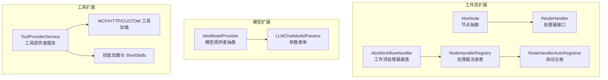
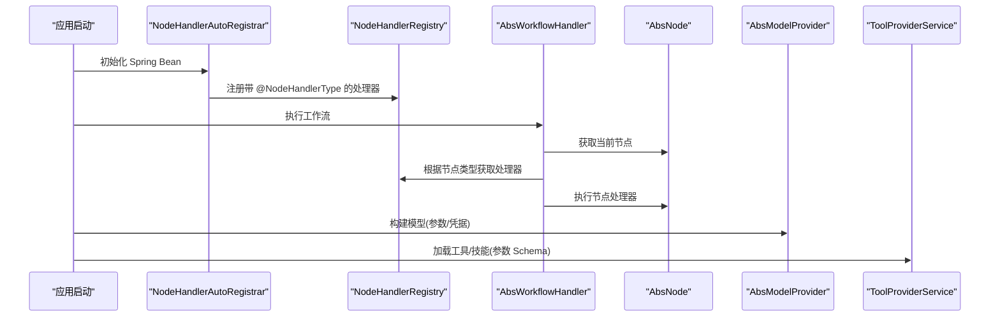
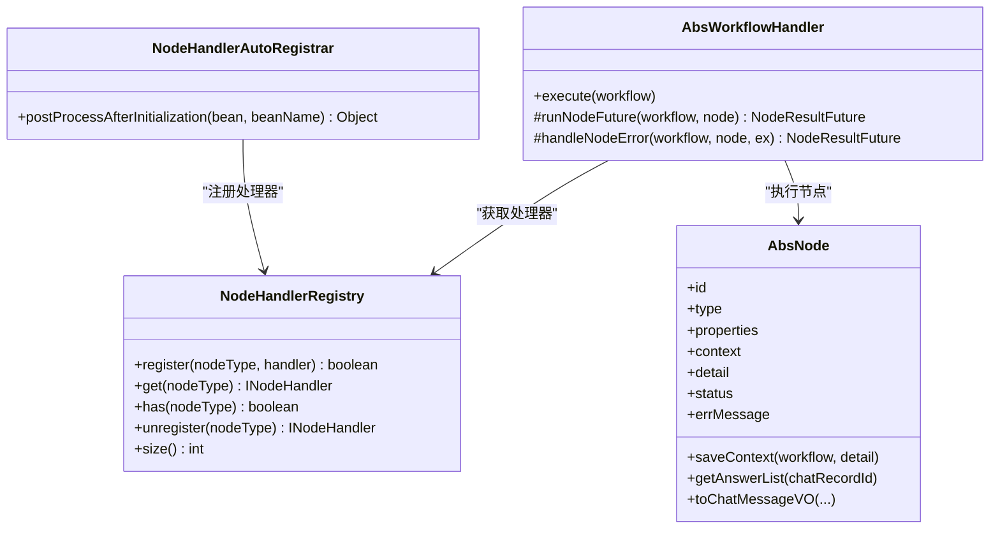
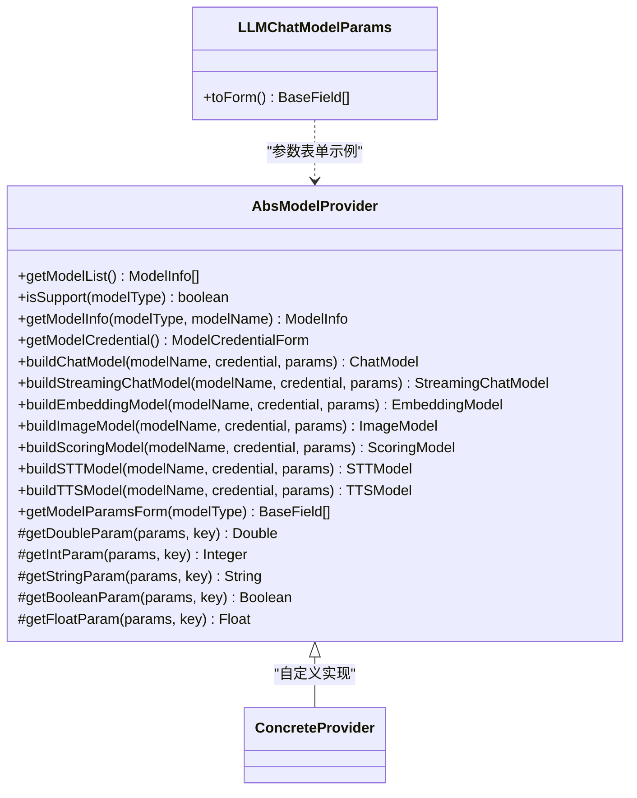
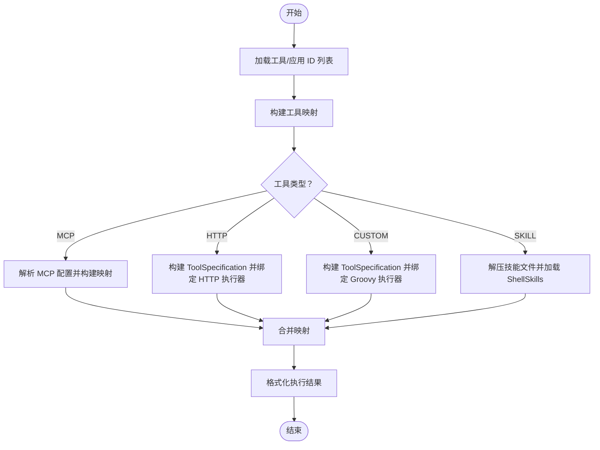
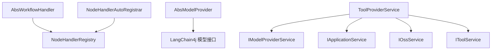

# 扩展开发指南

<cite>
**本文引用的文件**   
- [AbsWorkflowHandler.java](file://maxkb4j-service/maxkb4j-workflow/src/main/java/com/maxkb4j/workflow/handler/AbsWorkflowHandler.java)
- [NodeHandlerRegistry.java](file://maxkb4j-service/maxkb4j-workflow/src/main/java/com/maxkb4j/workflow/registry/NodeHandlerRegistry.java)
- [NodeHandlerAutoRegistrar.java](file://maxkb4j-service/maxkb4j-workflow/src/main/java/com/maxkb4j/workflow/processor/NodeHandlerAutoRegistrar.java)
- [AbsNode.java](file://maxkb4j-service-api/maxkb4j-workflow-api/src/main/java/com/maxkb4j/workflow/node/AbsNode.java)
- [NodeHandlerType.java](file://maxkb4j-service/maxkb4j-workflow/src/main/java/com/maxkb4j/workflow/annotation/NodeHandlerType.java)
- [AbsModelProvider.java](file://maxkb4j-service/maxkb4j-model/src/main/java/com/maxkb4j/model/provider/AbsModelProvider.java)
- [LLMChatModelParams.java](file://maxkb4j-service/maxkb4j-model/src/main/java/com/maxkb4j/model/custom/params/impl/LLMChatModelParams.java)
- [ToolProviderService.java](file://maxkb4j-service/maxkb4j-tool/src/main/java/com/maxkb4j/tool/service/ToolProviderService.java)
</cite>

## 目录
1. [简介](#简介)
2. [项目结构](#项目结构)
3. [核心组件](#核心组件)
4. [架构总览](#架构总览)
5. [详细组件分析](#详细组件分析)
6. [依赖分析](#依赖分析)
7. [性能考量](#性能考量)
8. [故障排查指南](#故障排查指南)
9. [结论](#结论)
10. [附录](#附录)

## 简介
本指南面向希望在 MaxKB4j 中进行扩展开发的工程师，系统讲解三类扩展能力：
- 节点处理器扩展：基于 AbsNode 与 INodeHandler 的节点处理体系，通过注解与自动注册机制完成扩展。
- 模型提供者扩展：基于 AbsModelProvider 的模型工厂扩展，支持参数表单、认证与多种模型类型构建。
- 工具集成扩展：基于 ToolProviderService 的工具与技能加载、参数 Schema 构建与执行器绑定。

文档将从接口设计、实现步骤、注册机制、异常处理、性能与版本兼容性等方面给出完整开发流程，并提供可视化图示与常见问题解决方案。

## 项目结构
MaxKB4j 将扩展能力分布在多个模块中：
- 工作流扩展：工作流节点抽象、处理器注册与自动注册、处理器接口与基类。
- 模型扩展：模型提供者抽象、参数表单、模型类型构建。
- 工具扩展：工具服务、MCP/HTTP/CUSTOM 工具与技能加载、参数 Schema 构建。

图表来源
- [AbsNode.java:1-132](file://maxkb4j-service-api/maxkb4j-workflow-api/src/main/java/com/maxkb4j/workflow/node/AbsNode.java#L1-L132)
- [NodeHandlerRegistry.java:1-123](file://maxkb4j-service/maxkb4j-workflow/src/main/java/com/maxkb4j/workflow/registry/NodeHandlerRegistry.java#L1-L123)
- [NodeHandlerAutoRegistrar.java:1-40](file://maxkb4j-service/maxkb4j-workflow/src/main/java/com/maxkb4j/workflow/processor/NodeHandlerAutoRegistrar.java#L1-L40)
- [AbsWorkflowHandler.java:1-189](file://maxkb4j-service/maxkb4j-workflow/src/main/java/com/maxkb4j/workflow/handler/AbsWorkflowHandler.java#L1-L189)
- [AbsModelProvider.java:1-245](file://maxkb4j-service/maxkb4j-model/src/main/java/com/maxkb4j/model/provider/AbsModelProvider.java#L1-L245)
- [LLMChatModelParams.java:1-20](file://maxkb4j-service/maxkb4j-model/src/main/java/com/maxkb4j/model/custom/params/impl/LLMChatModelParams.java#L1-L20)
- [ToolProviderService.java:1-310](file://maxkb4j-service/maxkb4j-tool/src/main/java/com/maxkb4j/tool/service/ToolProviderService.java#L1-L310)

章节来源
- [AbsWorkflowHandler.java:1-189](file://maxkb4j-service/maxkb4j-workflow/src/main/java/com/maxkb4j/workflow/handler/AbsWorkflowHandler.java#L1-L189)
- [AbsModelProvider.java:1-245](file://maxkb4j-service/maxkb4j-model/src/main/java/com/maxkb4j/model/provider/AbsModelProvider.java#L1-L245)
- [ToolProviderService.java:1-310](file://maxkb4j-service/maxkb4j-tool/src/main/java/com/maxkb4j/tool/service/ToolProviderService.java#L1-L310)

## 核心组件
- 节点抽象与处理器
  - AbsNode：工作流节点抽象，负责运行时 ID、上下文、详情、状态与消息转换。
  - INodeHandler：节点处理器接口，由具体节点类型实现执行逻辑。
  - NodeHandlerRegistry：处理器注册表，维护节点类型到处理器实例的映射。
  - NodeHandlerAutoRegistrar：Bean 后置处理器，扫描带注解的处理器并自动注册。
  - AbsWorkflowHandler：工作流执行基类，封装节点执行、并发控制、异常处理与钩子。
- 模型提供者
  - AbsModelProvider：模型提供者抽象，提供参数读取辅助、模型类型支持判断、各模型类型构建默认禁用实现与参数表单。
  - LLMChatModelParams：LLM 参数表单示例，定义温度、最大 tokens 等字段。
- 工具集成
  - ToolProviderService：工具提供者服务，支持 MCP、HTTP、CUSTOM 工具与技能加载，构建 ToolSpecification 与 ToolExecutor 映射。

章节来源
- [AbsNode.java:1-132](file://maxkb4j-service-api/maxkb4j-workflow-api/src/main/java/com/maxkb4j/workflow/node/AbsNode.java#L1-L132)
- [NodeHandlerRegistry.java:1-123](file://maxkb4j-service/maxkb4j-workflow/src/main/java/com/maxkb4j/workflow/registry/NodeHandlerRegistry.java#L1-L123)
- [NodeHandlerAutoRegistrar.java:1-40](file://maxkb4j-service/maxkb4j-workflow/src/main/java/com/maxkb4j/workflow/processor/NodeHandlerAutoRegistrar.java#L1-L40)
- [AbsWorkflowHandler.java:1-189](file://maxkb4j-service/maxkb4j-workflow/src/main/java/com/maxkb4j/workflow/handler/AbsWorkflowHandler.java#L1-L189)
- [AbsModelProvider.java:1-245](file://maxkb4j-service/maxkb4j-model/src/main/java/com/maxkb4j/model/provider/AbsModelProvider.java#L1-L245)
- [LLMChatModelParams.java:1-20](file://maxkb4j-service/maxkb4j-model/src/main/java/com/maxkb4j/model/custom/params/impl/LLMChatModelParams.java#L1-L20)
- [ToolProviderService.java:1-310](file://maxkb4j-service/maxkb4j-tool/src/main/java/com/maxkb4j/tool/service/ToolProviderService.java#L1-L310)

## 架构总览
下图展示了扩展开发的关键交互路径：节点处理器的自动注册、工作流执行时的节点调度、模型提供者的参数表单与模型构建、工具提供者的工具与技能加载。

图表来源
- [NodeHandlerAutoRegistrar.java:1-40](file://maxkb4j-service/maxkb4j-workflow/src/main/java/com/maxkb4j/workflow/processor/NodeHandlerAutoRegistrar.java#L1-L40)
- [NodeHandlerRegistry.java:1-123](file://maxkb4j-service/maxkb4j-workflow/src/main/java/com/maxkb4j/workflow/registry/NodeHandlerRegistry.java#L1-L123)
- [AbsWorkflowHandler.java:1-189](file://maxkb4j-service/maxkb4j-workflow/src/main/java/com/maxkb4j/workflow/handler/AbsWorkflowHandler.java#L1-L189)
- [AbsNode.java:1-132](file://maxkb4j-service-api/maxkb4j-workflow-api/src/main/java/com/maxkb4j/workflow/node/AbsNode.java#L1-L132)
- [AbsModelProvider.java:1-245](file://maxkb4j-service/maxkb4j-model/src/main/java/com/maxkb4j/model/provider/AbsModelProvider.java#L1-L245)
- [ToolProviderService.java:1-310](file://maxkb4j-service/maxkb4j-tool/src/main/java/com/maxkb4j/tool/service/ToolProviderService.java#L1-L310)

## 详细组件分析

### 节点处理器开发（工作流扩展）
- 继承与实现
  - 节点抽象：继承 AbsNode，实现 saveContext 以持久化节点上下文与详情。
  - 处理器接口：实现 INodeHandler 并标注 @NodeHandlerType，声明支持的节点类型键值。
  - 自动注册：NodeHandlerAutoRegistrar 在 Bean 初始化后扫描并注册处理器到 NodeHandlerRegistry。
- 节点参数配置
  - 节点属性：通过 AbsNode.properties 传递节点数据；getNodeData 可提取 nodeData 字段。
  - 上游节点：setUpNodeIdList 用于设置上游节点列表并生成运行时节点 ID。
  - 状态与错误：节点状态由工作流处理器统一管理，错误信息写入 errMessage。
- 异常处理机制
  - 工作流基类：AbsWorkflowHandler 统一封装节点执行、超时与异常处理，交由异常解析链处理。
  - 责任链：异常解析链对节点执行失败进行统一处理与状态标记。

图表来源
- [AbsNode.java:1-132](file://maxkb4j-service-api/maxkb4j-workflow-api/src/main/java/com/maxkb4j/workflow/node/AbsNode.java#L1-L132)
- [NodeHandlerRegistry.java:1-123](file://maxkb4j-service/maxkb4j-workflow/src/main/java/com/maxkb4j/workflow/registry/NodeHandlerRegistry.java#L1-L123)
- [NodeHandlerAutoRegistrar.java:1-40](file://maxkb4j-service/maxkb4j-workflow/src/main/java/com/maxkb4j/workflow/processor/NodeHandlerAutoRegistrar.java#L1-L40)
- [AbsWorkflowHandler.java:1-189](file://maxkb4j-service/maxkb4j-workflow/src/main/java/com/maxkb4j/workflow/handler/AbsWorkflowHandler.java#L1-L189)

章节来源
- [AbsNode.java:1-132](file://maxkb4j-service-api/maxkb4j-workflow-api/src/main/java/com/maxkb4j/workflow/node/AbsNode.java#L1-L132)
- [NodeHandlerRegistry.java:1-123](file://maxkb4j-service/maxkb4j-workflow/src/main/java/com/maxkb4j/workflow/registry/NodeHandlerRegistry.java#L1-L123)
- [NodeHandlerAutoRegistrar.java:1-40](file://maxkb4j-service/maxkb4j-workflow/src/main/java/com/maxkb4j/workflow/processor/NodeHandlerAutoRegistrar.java#L1-L40)
- [AbsWorkflowHandler.java:1-189](file://maxkb4j-service/maxkb4j-workflow/src/main/java/com/maxkb4j/workflow/handler/AbsWorkflowHandler.java#L1-L189)

### 模型提供者扩展（模型扩展）
- 实现要点
  - 继承 AbsModelProvider，重写 getModelList 返回可用模型清单。
  - 可选：重写 buildChatModel/buildStreamingChatModel/buildEmbeddingModel 等构建对应模型实例。
  - 参数读取：使用 getStringParam/getIntParam/getDoubleParam/getBooleanParam/getFloatParam 安全读取参数。
  - 参数表单：重写 getModelParamsForm 或复用 LLMChatModelParams 示例。
  - 凭证与认证：通过 getModelCredential 配置凭证表单；凭据对象由框架注入。
- 认证与凭据
  - 模型凭据表单：默认启用输入与校验，可在子类中定制。
  - 模型类型支持：isSupport 与 getModelInfo 提供模型类型与名称匹配查询。

图表来源
- [AbsModelProvider.java:1-245](file://maxkb4j-service/maxkb4j-model/src/main/java/com/maxkb4j/model/provider/AbsModelProvider.java#L1-L245)
- [LLMChatModelParams.java:1-20](file://maxkb4j-service/maxkb4j-model/src/main/java/com/maxkb4j/model/custom/params/impl/LLMChatModelParams.java#L1-L20)

章节来源
- [AbsModelProvider.java:1-245](file://maxkb4j-service/maxkb4j-model/src/main/java/com/maxkb4j/model/provider/AbsModelProvider.java#L1-L245)
- [LLMChatModelParams.java:1-20](file://maxkb4j-service/maxkb4j-model/src/main/java/com/maxkb4j/model/custom/params/impl/LLMChatModelParams.java#L1-L20)

### 工具集成开发（工具扩展）
- 使用工具提供者
  - ToolProviderService.getToolMap：根据工具 ID 与应用 ID 列表构建工具规范与执行器映射。
  - 支持类型：MCP、HTTP、CUSTOM、技能（SKILL）。
  - 参数 Schema：根据 ToolInputField 动态构建 ToolSpecification，支持 string/int/number/boolean/array/object 类型与必填项。
- 连接与验证机制
  - MCP：从工具代码解析配置并调用工具映射工具构建工具集。
  - HTTP：使用 HTTP 请求执行器执行请求。
  - CUSTOM：使用 Groovy 脚本执行器执行脚本，支持初始化参数注入。
  - 技能：从文件系统加载 ShellSkills，动态解析可用技能并构建工具规范。
- 结果格式化
  - ToolProviderService.format：将工具执行请求与结果格式化为统一的消息渲染文本，包含图标、名称、类型、参数与结果。

图表来源
- [ToolProviderService.java:1-310](file://maxkb4j-service/maxkb4j-tool/src/main/java/com/maxkb4j/tool/service/ToolProviderService.java#L1-L310)

章节来源
- [ToolProviderService.java:1-310](file://maxkb4j-service/maxkb4j-tool/src/main/java/com/maxkb4j/tool/service/ToolProviderService.java#L1-L310)

## 依赖分析
- 节点处理器依赖
  - AbsWorkflowHandler 依赖 NodeHandlerRegistry 获取处理器实例，并通过异常解析链统一处理异常。
  - NodeHandlerAutoRegistrar 依赖 Spring BeanPostProcessor 机制扫描并注册处理器。
- 模型提供者依赖
  - AbsModelProvider 依赖 LangChain4j 的模型接口，默认返回禁用实现，便于按需启用。
- 工具提供者依赖
  - ToolProviderService 依赖模型工厂、应用服务、文件服务与工具服务，结合 JSoup 解析技能描述，构建统一的工具规范与执行器。

图表来源
- [AbsWorkflowHandler.java:1-189](file://maxkb4j-service/maxkb4j-workflow/src/main/java/com/maxkb4j/workflow/handler/AbsWorkflowHandler.java#L1-L189)
- [NodeHandlerRegistry.java:1-123](file://maxkb4j-service/maxkb4j-workflow/src/main/java/com/maxkb4j/workflow/registry/NodeHandlerRegistry.java#L1-L123)
- [NodeHandlerAutoRegistrar.java:1-40](file://maxkb4j-service/maxkb4j-workflow/src/main/java/com/maxkb4j/workflow/processor/NodeHandlerAutoRegistrar.java#L1-L40)
- [AbsModelProvider.java:1-245](file://maxkb4j-service/maxkb4j-model/src/main/java/com/maxkb4j/model/provider/AbsModelProvider.java#L1-L245)
- [ToolProviderService.java:1-310](file://maxkb4j-service/maxkb4j-tool/src/main/java/com/maxkb4j/tool/service/ToolProviderService.java#L1-L310)

章节来源
- [AbsWorkflowHandler.java:1-189](file://maxkb4j-service/maxkb4j-workflow/src/main/java/com/maxkb4j/workflow/handler/AbsWorkflowHandler.java#L1-L189)
- [NodeHandlerRegistry.java:1-123](file://maxkb4j-service/maxkb4j-workflow/src/main/java/com/maxkb4j/workflow/registry/NodeHandlerRegistry.java#L1-L123)
- [NodeHandlerAutoRegistrar.java:1-40](file://maxkb4j-service/maxkb4j-workflow/src/main/java/com/maxkb4j/workflow/processor/NodeHandlerAutoRegistrar.java#L1-L40)
- [AbsModelProvider.java:1-245](file://maxkb4j-service/maxkb4j-model/src/main/java/com/maxkb4j/model/provider/AbsModelProvider.java#L1-L245)
- [ToolProviderService.java:1-310](file://maxkb4j-service/maxkb4j-tool/src/main/java/com/maxkb4j/tool/service/ToolProviderService.java#L1-L310)

## 性能考量
- 工作流并发执行
  - AbsWorkflowHandler 对多分支节点采用 CompletableFuture 并行执行，受节点执行超时分钟数限制，避免长时间阻塞。
- HTTP 客户端延迟初始化
  - AbsModelProvider 的 HttpClientBuilder 采用延迟初始化与双重检查锁定，减少构造阶段开销。
- 工具加载与缓存
  - 技能文件解压与加载仅在首次访问时执行，后续直接使用已加载的 ShellSkills，降低重复 IO 开销。

章节来源
- [AbsWorkflowHandler.java:50-85](file://maxkb4j-service/maxkb4j-workflow/src/main/java/com/maxkb4j/workflow/handler/AbsWorkflowHandler.java#L50-L85)
- [AbsModelProvider.java:38-60](file://maxkb4j-service/maxkb4j-model/src/main/java/com/maxkb4j/model/provider/AbsModelProvider.java#L38-L60)
- [ToolProviderService.java:94-104](file://maxkb4j-service/maxkb4j-tool/src/main/java/com/maxkb4j/tool/service/ToolProviderService.java#L94-L104)

## 故障排查指南
- 节点处理器未生效
  - 检查是否正确标注 @NodeHandlerType 且传入的节点类型键值与节点定义一致。
  - 确认处理器 Bean 已被 Spring 扫描并完成初始化。
  - 查看 NodeHandlerRegistry 是否存在该节点类型的处理器映射。
- 节点执行超时或异常
  - 关注工作流处理器对超时与异常的统一处理，检查异常解析链是否正确记录错误与状态。
- 工具加载失败
  - MCP 配置解析失败或 HTTP/CUSTOM 执行器参数不匹配时，确认工具代码与输入字段定义一致。
  - 技能加载失败时，检查技能文件是否存在、解压是否成功以及 ShellSkills 是否可解析。
- 模型构建失败
  - 确认参数键名与类型与表单定义一致；必要时在子类中覆写相应构建方法并添加认证头或代理配置。

章节来源
- [NodeHandlerAutoRegistrar.java:24-39](file://maxkb4j-service/maxkb4j-workflow/src/main/java/com/maxkb4j/workflow/processor/NodeHandlerAutoRegistrar.java#L24-L39)
- [NodeHandlerRegistry.java:62-68](file://maxkb4j-service/maxkb4j-workflow/src/main/java/com/maxkb4j/workflow/registry/NodeHandlerRegistry.java#L62-L68)
- [AbsWorkflowHandler.java:182-186](file://maxkb4j-service/maxkb4j-workflow/src/main/java/com/maxkb4j/workflow/handler/AbsWorkflowHandler.java#L182-L186)
- [ToolProviderService.java:164-172](file://maxkb4j-service/maxkb4j-tool/src/main/java/com/maxkb4j/tool/service/ToolProviderService.java#L164-L172)
- [AbsModelProvider.java:68-115](file://maxkb4j-service/maxkb4j-model/src/main/java/com/maxkb4j/model/provider/AbsModelProvider.java#L68-L115)

## 结论
通过以上扩展点与机制，开发者可以：
- 快速实现新的工作流节点处理器并通过注解与自动注册机制无缝接入。
- 便捷地扩展模型提供者，统一参数表单与模型构建流程，并按需启用认证与网络配置。
- 灵活集成各类工具与技能，统一参数 Schema 与执行器绑定，提升工具生态的可维护性与一致性。

## 附录
- 开发流程建议
  - 工作流节点：定义节点属性与运行时上下文，实现 INodeHandler 并标注节点类型，确保自动注册生效。
  - 模型提供者：实现模型清单与参数表单，按需覆写模型构建方法，完善参数校验与认证处理。
  - 工具集成：定义输入字段与 Schema，选择合适的执行器类型（MCP/HTTP/CUSTOM），并处理技能加载与结果格式化。
- 插件注册机制
  - 使用 @NodeHandlerType 与 NodeHandlerAutoRegistrar 实现处理器自动注册；NodeHandlerRegistry 提供注册、查询与注销能力。
- 版本兼容性
  - 保持对 LangChain4j 接口的最小依赖，优先使用默认禁用实现，按需启用具体模型；工具与模型参数表单应向后兼容新增字段。