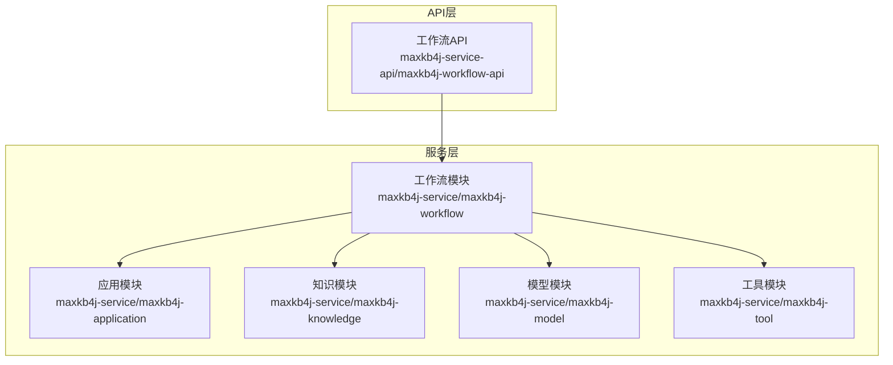
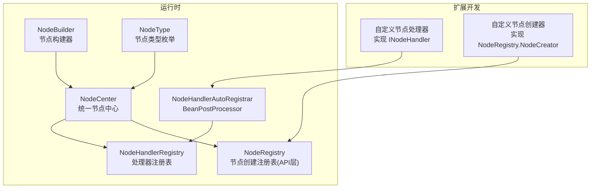
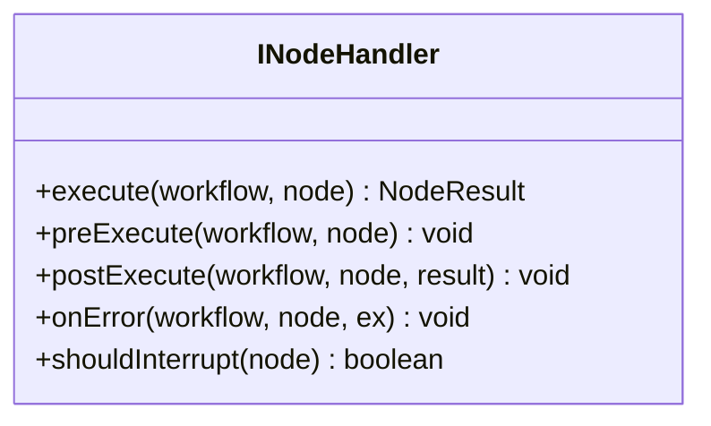
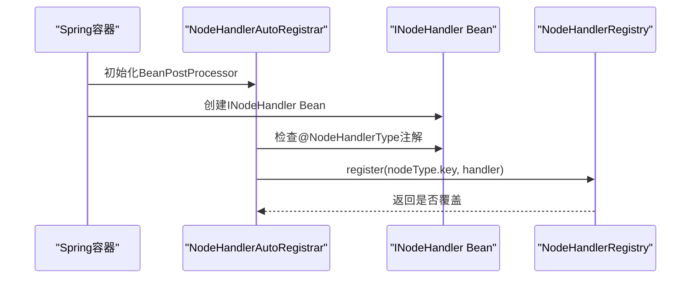
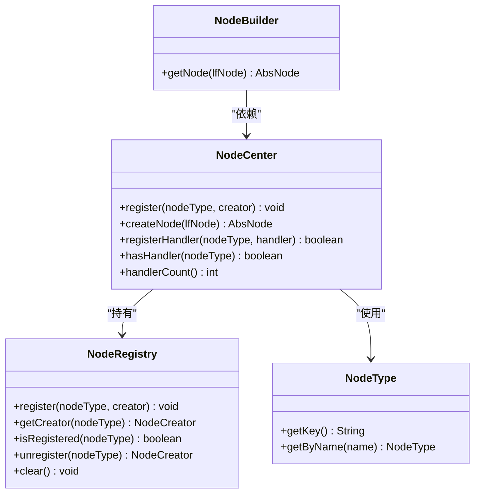
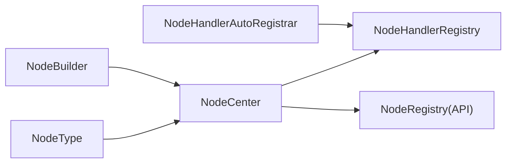

# 扩展开发最佳实践

<cite>
**本文引用的文件**
- [NodeHandlerRegistry.java](file://maxkb4j-service/maxkb4j-workflow/src/main/java/com/maxkb4j/workflow/registry/NodeHandlerRegistry.java)
- [NodeHandlerAutoRegistrar.java](file://maxkb4j-service/maxkb4j-workflow/src/main/java/com/maxkb4j/workflow/processor/NodeHandlerAutoRegistrar.java)
- [NodeHandlerType.java](file://maxkb4j-service/maxkb4j-workflow/src/main/java/com/maxkb4j/workflow/annotation/NodeHandlerType.java)
- [INodeHandler.java](file://maxkb4j-service/maxkb4j-workflow/src/main/java/com/maxkb4j/workflow/handler/node/INodeHandler.java)
- [NodeCenter.java](file://maxkb4j-service/maxkb4j-workflow/src/main/java/com/maxkb4j/workflow/registry/NodeCenter.java)
- [NodeRegistry.java](file://maxkb4j-service-api/maxkb4j-workflow-api/src/main/java/com/maxkb4j/workflow/factory/NodeRegistry.java)
- [NodeBuilder.java](file://maxkb4j-service-api/maxkb4j-workflow-api/src/main/java/com/maxkb4j/workflow/builder/NodeBuilder.java)
- [NodeType.java](file://maxkb4j-service-api/maxkb4j-workflow-api/src/main/java/com/maxkb4j/workflow/enums/NodeType.java)
</cite>

## 目录
1. [简介](#简介)
2. [项目结构](#项目结构)
3. [核心组件](#核心组件)
4. [架构总览](#架构总览)
5. [详细组件分析](#详细组件分析)
6. [依赖分析](#依赖分析)
7. [性能考量](#性能考量)
8. [故障排查指南](#故障排查指南)
9. [结论](#结论)
10. [附录](#附录)

## 简介
本指南面向MaxKB4j扩展开发者，聚焦于工作流扩展点的设计与实现，包括节点处理器扩展、节点创建扩展、模型提供者适配、工具集成等。文档围绕以下主题展开：
- 扩展点识别与选择策略：节点处理器、节点创建、模型提供者、工具集成的适用场景与边界
- 插件注册机制与自动注册流程：NodeHandlerRegistry与NodeHandlerAutoRegistrar的工作原理
- 架构设计原则、代码组织规范与命名约定
- 版本兼容性管理、向后兼容性保证与API稳定性维护
- 测试策略：单元测试、集成测试、性能测试
- 调试技巧、日志记录与错误追踪
- 部署策略、配置管理与监控告警

## 项目结构
MaxKB4j采用多模块分层架构，工作流扩展主要分布在以下模块：
- maxkb4j-service/maxkb4j-workflow：运行时工作流引擎与扩展注册
- maxkb4j-service-api/maxkb4j-workflow-api：工作流API与节点类型定义

[本图为概念性结构示意，无需“图示来源”]

## 核心组件
本节聚焦工作流扩展的核心组件及其职责：
- 节点处理器接口与生命周期钩子：INodeHandler
- 节点处理器注册表：NodeHandlerRegistry
- 自动注册器：NodeHandlerAutoRegistrar
- 统一节点中心：NodeCenter（整合节点创建与处理器注册）
- 节点注册表（API层）：NodeRegistry
- 节点构建器：NodeBuilder
- 节点类型枚举：NodeType

**章节来源**
- [INodeHandler.java:1-71](file://maxkb4j-service/maxkb4j-workflow/src/main/java/com/maxkb4j/workflow/handler/node/INodeHandler.java#L1-L71)
- [NodeHandlerRegistry.java:1-123](file://maxkb4j-service/maxkb4j-workflow/src/main/java/com/maxkb4j/workflow/registry/NodeHandlerRegistry.java#L1-L123)
- [NodeHandlerAutoRegistrar.java:1-40](file://maxkb4j-service/maxkb4j-workflow/src/main/java/com/maxkb4j/workflow/processor/NodeHandlerAutoRegistrar.java#L1-L40)
- [NodeCenter.java:1-165](file://maxkb4j-service/maxkb4j-workflow/src/main/java/com/maxkb4j/workflow/registry/NodeCenter.java#L1-L165)
- [NodeRegistry.java:1-112](file://maxkb4j-service-api/maxkb4j-workflow-api/src/main/java/com/maxkb4j/workflow/factory/NodeRegistry.java#L1-L112)
- [NodeBuilder.java:1-38](file://maxkb4j-service-api/maxkb4j-workflow-api/src/main/java/com/maxkb4j/workflow/builder/NodeBuilder.java#L1-L38)
- [NodeType.java:1-117](file://maxkb4j-service-api/maxkb4j-workflow-api/src/main/java/com/maxkb4j/workflow/enums/NodeType.java#L1-L117)

## 架构总览
下图展示了工作流扩展的注册与执行路径，涵盖节点处理器与节点创建两个维度：

**图示来源**
- [NodeHandlerAutoRegistrar.java:1-40](file://maxkb4j-service/maxkb4j-workflow/src/main/java/com/maxkb4j/workflow/processor/NodeHandlerAutoRegistrar.java#L1-L40)
- [NodeHandlerRegistry.java:1-123](file://maxkb4j-service/maxkb4j-workflow/src/main/java/com/maxkb4j/workflow/registry/NodeHandlerRegistry.java#L1-L123)
- [NodeCenter.java:1-165](file://maxkb4j-service/maxkb4j-workflow/src/main/java/com/maxkb4j/workflow/registry/NodeCenter.java#L1-L165)
- [NodeRegistry.java:1-112](file://maxkb4j-service-api/maxkb4j-workflow-api/src/main/java/com/maxkb4j/workflow/factory/NodeRegistry.java#L1-L112)
- [NodeBuilder.java:1-38](file://maxkb4j-service-api/maxkb4j-workflow-api/src/main/java/com/maxkb4j/workflow/builder/NodeBuilder.java#L1-L38)
- [NodeType.java:1-117](file://maxkb4j-service-api/maxkb4j-workflow-api/src/main/java/com/maxkb4j/workflow/enums/NodeType.java#L1-L117)

## 详细组件分析

### 节点处理器扩展（INodeHandler）
- 设计要点
  - 必须实现execute方法；可选实现preExecute、postExecute、onError生命周期钩子
  - shouldInterrupt用于声明是否中断工作流
- 适用场景
  - 自定义业务逻辑节点（如工具调用、数据写入、意图分类、NL2SQL等）
  - 需要对执行前后进行可观测与控制的节点
- 开发建议
  - 将复杂逻辑拆分为可测试的子步骤，便于单元测试
  - 在onError中统一记录异常上下文，避免吞异常

**图示来源**
- [INodeHandler.java:1-71](file://maxkb4j-service/maxkb4j-workflow/src/main/java/com/maxkb4j/workflow/handler/node/INodeHandler.java#L1-L71)

**章节来源**
- [INodeHandler.java:1-71](file://maxkb4j-service/maxkb4j-workflow/src/main/java/com/maxkb4j/workflow/handler/node/INodeHandler.java#L1-L71)

### 节点处理器注册与自动注册（NodeHandlerRegistry 与 NodeHandlerAutoRegistrar）
- NodeHandlerRegistry
  - 提供register/unregister/get/has/size/clear等能力
  - 线程安全，基于ConcurrentHashMap
- NodeHandlerAutoRegistrar
  - BeanPostProcessor，在Bean初始化后扫描带@NodeHandlerType注解的INodeHandler
  - 通过注解中的NodeType数组批量注册到注册表
- 最佳实践
  - 为每个INodeHandler实现类标注@NodeHandlerType，明确支持的节点类型key
  - 避免重复注册同一key，关注覆盖日志
  - 在测试环境可clear注册表以隔离用例

**图示来源**
- [NodeHandlerAutoRegistrar.java:1-40](file://maxkb4j-service/maxkb4j-workflow/src/main/java/com/maxkb4j/workflow/processor/NodeHandlerAutoRegistrar.java#L1-L40)
- [NodeHandlerRegistry.java:1-123](file://maxkb4j-service/maxkb4j-workflow/src/main/java/com/maxkb4j/workflow/registry/NodeHandlerRegistry.java#L1-L123)
- [NodeHandlerType.java:1-16](file://maxkb4j-service/maxkb4j-workflow/src/main/java/com/maxkb4j/workflow/annotation/NodeHandlerType.java#L1-L16)

**章节来源**
- [NodeHandlerRegistry.java:1-123](file://maxkb4j-service/maxkb4j-workflow/src/main/java/com/maxkb4j/workflow/registry/NodeHandlerRegistry.java#L1-L123)
- [NodeHandlerAutoRegistrar.java:1-40](file://maxkb4j-service/maxkb4j-workflow/src/main/java/com/maxkb4j/workflow/processor/NodeHandlerAutoRegistrar.java#L1-L40)
- [NodeHandlerType.java:1-16](file://maxkb4j-service/maxkb4j-workflow/src/main/java/com/maxkb4j/workflow/annotation/NodeHandlerType.java#L1-L16)

### 节点创建扩展（NodeRegistry 与 NodeCenter）
- NodeRegistry（API层）
  - 定义NodeCreator函数式接口，注册/查询/注销节点创建器
  - 通过ConcurrentHashMap实现线程安全
- NodeCenter
  - 统一管理NodeRegistry与NodeHandlerRegistry
  - 内置默认节点创建器注册（迁移自旧工厂）
  - 对外暴露createNode、registerHandler、hasHandler等方法
- NodeBuilder
  - 通过依赖注入获取，调用getNode创建节点实例
- NodeType
  - 定义节点类型key与名称，提供O(1)键值查找

**图示来源**
- [NodeRegistry.java:1-112](file://maxkb4j-service-api/maxkb4j-workflow-api/src/main/java/com/maxkb4j/workflow/factory/NodeRegistry.java#L1-L112)
- [NodeCenter.java:1-165](file://maxkb4j-service/maxkb4j-workflow/src/main/java/com/maxkb4j/workflow/registry/NodeCenter.java#L1-L165)
- [NodeBuilder.java:1-38](file://maxkb4j-service-api/maxkb4j-workflow-api/src/main/java/com/maxkb4j/workflow/builder/NodeBuilder.java#L1-L38)
- [NodeType.java:1-117](file://maxkb4j-service-api/maxkb4j-workflow-api/src/main/java/com/maxkb4j/workflow/enums/NodeType.java#L1-L117)

**章节来源**
- [NodeRegistry.java:1-112](file://maxkb4j-service-api/maxkb4j-workflow-api/src/main/java/com/maxkb4j/workflow/factory/NodeRegistry.java#L1-L112)
- [NodeCenter.java:1-165](file://maxkb4j-service/maxkb4j-workflow/src/main/java/com/maxkb4j/workflow/registry/NodeCenter.java#L1-L165)
- [NodeBuilder.java:1-38](file://maxkb4j-service-api/maxkb4j-workflow-api/src/main/java/com/maxkb4j/workflow/builder/NodeBuilder.java#L1-L38)
- [NodeType.java:1-117](file://maxkb4j-service-api/maxkb4j-workflow-api/src/main/java/com/maxkb4j/workflow/enums/NodeType.java#L1-L117)

### 模型提供者与工具集成扩展
- 模型提供者扩展
  - 适用场景：接入新的大模型或推理后端（如OpenAI、Azure、本地模型等）
  - 实现策略：参考现有模型提供者实现，遵循统一的模型服务接口与配置约定
  - 关注点：凭证管理、参数映射、错误处理与降级
- 工具集成扩展
  - 适用场景：HTTP客户端、外部系统对接、MCP服务器等
  - 实现策略：在工作流中使用HTTP节点或工具节点，结合工具服务与连接处理器
  - 关注点：超时控制、重试策略、参数校验与安全防护

[本小节为概念性说明，无需“章节来源”]

## 依赖分析
- 组件耦合
  - NodeCenter同时依赖NodeRegistry与NodeHandlerRegistry，承担统一入口职责
  - NodeBuilder依赖NodeCenter，形成“构建器-中心-注册表”的依赖链
- 外部依赖
  - Spring BeanPostProcessor用于自动注册
  - 日志框架用于运行时可观测性
- 循环依赖风险
  - 当前结构未见循环依赖；扩展实现应避免反向依赖注册表

**图示来源**
- [NodeHandlerAutoRegistrar.java:1-40](file://maxkb4j-service/maxkb4j-workflow/src/main/java/com/maxkb4j/workflow/processor/NodeHandlerAutoRegistrar.java#L1-L40)
- [NodeHandlerRegistry.java:1-123](file://maxkb4j-service/maxkb4j-workflow/src/main/java/com/maxkb4j/workflow/registry/NodeHandlerRegistry.java#L1-L123)
- [NodeCenter.java:1-165](file://maxkb4j-service/maxkb4j-workflow/src/main/java/com/maxkb4j/workflow/registry/NodeCenter.java#L1-L165)
- [NodeRegistry.java:1-112](file://maxkb4j-service-api/maxkb4j-workflow-api/src/main/java/com/maxkb4j/workflow/factory/NodeRegistry.java#L1-L112)
- [NodeBuilder.java:1-38](file://maxkb4j-service-api/maxkb4j-workflow-api/src/main/java/com/maxkb4j/workflow/builder/NodeBuilder.java#L1-L38)
- [NodeType.java:1-117](file://maxkb4j-service-api/maxkb4j-workflow-api/src/main/java/com/maxkb4j/workflow/enums/NodeType.java#L1-L117)

**章节来源**
- [NodeCenter.java:1-165](file://maxkb4j-service/maxkb4j-workflow/src/main/java/com/maxkb4j/workflow/registry/NodeCenter.java#L1-L165)
- [NodeBuilder.java:1-38](file://maxkb4j-service-api/maxkb4j-workflow-api/src/main/java/com/maxkb4j/workflow/builder/NodeBuilder.java#L1-L38)

## 性能考量
- 注册表并发访问
  - 使用ConcurrentHashMap，避免锁竞争；注册/查询为O(1)
- 生命周期钩子开销
  - 钩子默认空实现，实际扩展应尽量轻量；避免在preExecute/postExecute中执行阻塞操作
- 节点创建与执行
  - NodeBuilder与NodeCenter解耦，减少初始化成本；优先复用Spring单例Bean
- 日志与监控
  - 利用注册表与自动注册器的日志输出定位问题；结合应用监控指标评估节点执行耗时

[本节为通用指导，无需“章节来源”]

## 故障排查指南
- 常见问题
  - “未找到处理器”：确认@NodeHandlerType注解与NodeType.key一致，且处理器已注册
  - “处理器被覆盖”：关注注册日志，避免重复注册相同key
  - “节点类型不受支持”：确认NodeCenter已注册对应节点创建器，或扩展模块正确加载
- 调试技巧
  - 在INodeHandler的onError中记录完整上下文（workflow、node、ex）
  - 使用NodeCenter的handlerCount与getRegisteredTypes辅助诊断
  - 在NodeBuilder创建失败时检查NodeRegistry的isRegistered与NodeCenter的createNode分支
- 日志与追踪
  - 关注注册表与自动注册器的日志级别，必要时提升至DEBUG
  - 结合应用日志与分布式追踪系统定位跨模块调用链

**章节来源**
- [NodeHandlerRegistry.java:1-123](file://maxkb4j-service/maxkb4j-workflow/src/main/java/com/maxkb4j/workflow/registry/NodeHandlerRegistry.java#L1-L123)
- [NodeCenter.java:1-165](file://maxkb4j-service/maxkb4j-workflow/src/main/java/com/maxkb4j/workflow/registry/NodeCenter.java#L1-L165)

## 结论
MaxKB4j为扩展开发提供了清晰的注册与执行框架：通过INodeHandler实现节点逻辑，借助NodeHandlerAutoRegistrar与NodeHandlerRegistry完成自动注册；通过NodeRegistry与NodeCenter实现节点创建与统一管理。遵循本文的扩展点识别、架构设计、测试与运维建议，可确保扩展的稳定性、可维护性与可演进性。

[本节为总结性内容，无需“章节来源”]

## 附录

### 扩展点识别与选择策略
- 节点处理器（INodeHandler）
  - 适用：需要自定义执行逻辑、生命周期控制与错误处理的节点
  - 选择：优先考虑已有节点类型是否满足需求；若不满足再新增节点类型
- 节点创建（NodeRegistry.NodeCreator）
  - 适用：新增节点类型或替换默认节点实现
  - 选择：与NodeType.key保持一致，确保NodeCenter可解析
- 模型提供者
  - 适用：接入新模型厂商或后端
  - 选择：遵循现有提供者模式，统一凭证与参数映射
- 工具集成
  - 适用：HTTP请求、外部系统对接、MCP等
  - 选择：优先使用HTTP节点或工具节点，配合工具服务与连接处理器

[本小节为概念性说明，无需“章节来源”]

### 架构设计原则与代码组织规范
- 单一职责：处理器仅负责执行逻辑，创建器仅负责实例化
- 开闭原则：通过注册表扩展，不修改既有实现
- 依赖倒置：扩展通过接口与抽象交互，避免直接依赖具体实现
- 命名约定
  - 处理器类：MyFeatureNodeHandler
  - 节点类型：my_feature_node
  - 注解：@NodeHandlerType(value = NodeType.MY_FEATURE_NODE)

[本小节为通用规范，无需“章节来源”]

### 版本兼容性与API稳定性
- 节点类型key稳定：NodeType.key变更需谨慎，避免破坏扩展
- 注解与接口稳定：@NodeHandlerType与INodeHandler保持向后兼容
- 注册表扩展：通过新增注册项实现功能增强，不破坏既有注册

[本小节为通用指导，无需“章节来源”]

### 测试策略
- 单元测试
  - 针对INodeHandler的execute、preExecute、postExecute、onError进行隔离测试
  - 使用Mock模拟workflow与node，验证分支与异常路径
- 集成测试
  - 通过NodeBuilder与NodeCenter组合测试节点创建与执行链路
  - 验证自动注册器在Spring容器中的行为
- 性能测试
  - 对热点节点处理器进行压测，关注并发下的注册表与执行耗时
  - 结合应用监控指标评估端到端延迟

[本小节为通用指导，无需“章节来源”]

### 部署策略、配置管理与监控告警
- 部署策略
  - 将扩展模块打包为独立JAR，随应用启动加载
  - 使用Spring Profile区分开发/生产环境
- 配置管理
  - 通过application.yml管理扩展开关与参数
  - 模型提供者与工具连接参数集中管理
- 监控告警
  - 关键指标：节点执行成功率、平均耗时、异常率
  - 告警阈值：针对处理器异常与节点创建失败设置告警

[本小节为通用指导，无需“章节来源”]