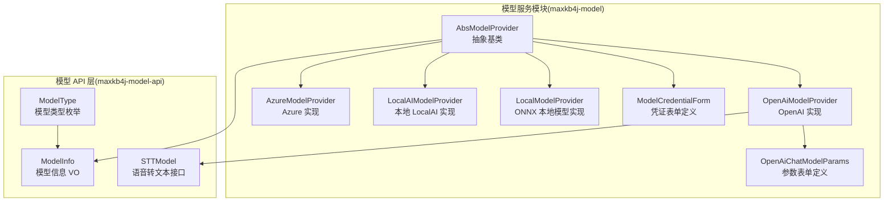
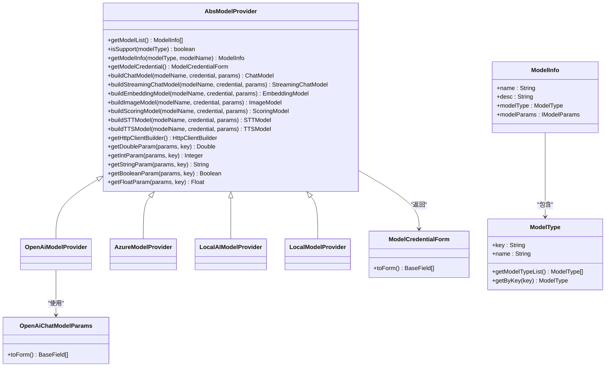
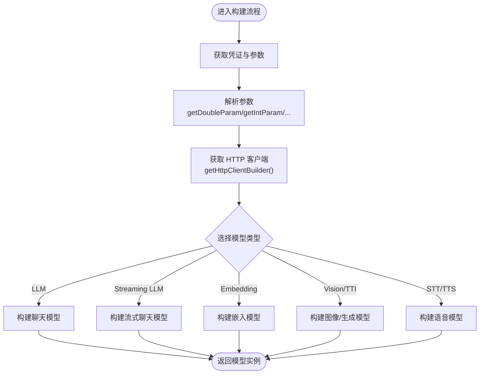
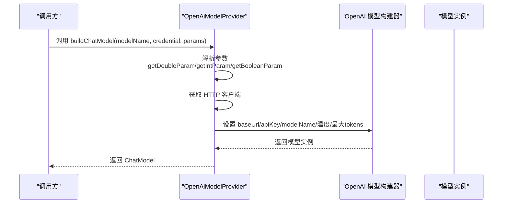
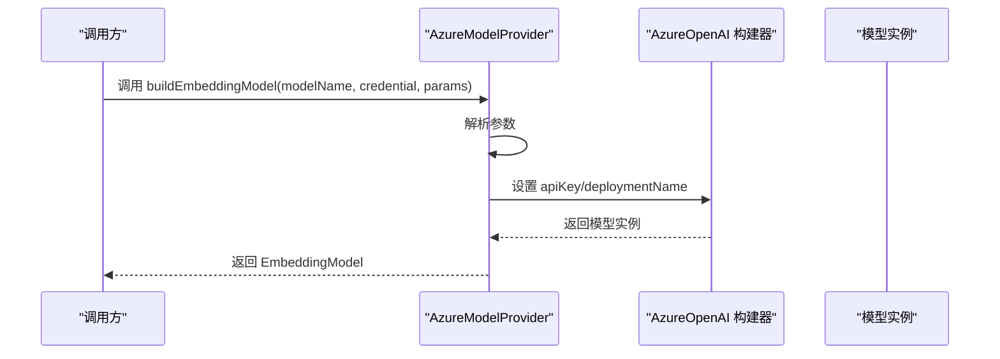
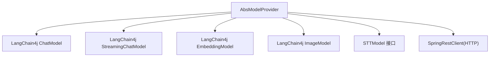

# 模型提供者扩展开发

<cite>
**本文引用的文件**
- [AbsModelProvider.java](file://maxkb4j-service/maxkb4j-model/src/main/java/com/maxkb4j/model/provider/AbsModelProvider.java)
- [OpenAiModelProvider.java](file://maxkb4j-service/maxkb4j-model/src/main/java/com/maxkb4j/model/provider/OpenAiModelProvider.java)
- [AzureModelProvider.java](file://maxkb4j-service/maxkb4j-model/src/main/java/com/maxkb4j/model/provider/AzureModelProvider.java)
- [LocalAIModelProvider.java](file://maxkb4j-service/maxkb4j-model/src/main/java/com/maxkb4j/model/provider/LocalAIModelProvider.java)
- [LocalModelProvider.java](file://maxkb4j-service/maxkb4j-model/src/main/java/com/maxkb4j/model/provider/LocalModelProvider.java)
- [OpenAiChatModelParams.java](file://maxkb4j-service/maxkb4j-model/src/main/java/com/maxkb4j/model/custom/params/impl/OpenAiChatModelParams.java)
- [ModelCredentialForm.java](file://maxkb4j-service/maxkb4j-model/src/main/java/com/maxkb4j/model/custom/credential/ModelCredentialForm.java)
- [ModelType.java](file://maxkb4j-service-api/maxkb4j-model-api/src/main/java/com/maxkb4j/model/enums/ModelType.java)
- [ModelInfo.java](file://maxkb4j-service-api/maxkb4j-model-api/src/main/java/com/maxkb4j/model/vo/ModelInfo.java)
- [STTModel.java](file://maxkb4j-service-api/maxkb4j-model-api/src/main/java/com/maxkb4j/model/service/STTModel.java)
</cite>

## 目录
1. [简介](#简介)
2. [项目结构](#项目结构)
3. [核心组件](#核心组件)
4. [架构总览](#架构总览)
5. [详细组件分析](#详细组件分析)
6. [依赖分析](#依赖分析)
7. [性能考虑](#性能考虑)
8. [故障排查指南](#故障排查指南)
9. [结论](#结论)
10. [附录](#附录)

## 简介
本指南面向希望为 MaxKB4j 扩展“模型提供者”的开发者，系统讲解 AbsModelProvider 抽象类的设计与继承实现模式，覆盖初始化流程、配置参数管理、认证机制处理，并对 OpenAiModelProvider、AzureModelProvider 等内置提供者进行实现分析。同时给出自定义模型提供者的开发步骤（接口实现、参数校验、错误处理）、模型参数配置与凭证管理、连接池优化建议，以及 STT、TTS、图像生成等多类型模型的集成方法。最后提供扩展示例思路（单元测试、集成测试、部署验证）以帮助快速落地。

## 项目结构
MaxKB4j 的模型提供者位于 maxkb4j-model 模块中，采用“抽象基类 + 多实现”的分层设计，结合 API 层的枚举与 VO 定义，形成清晰的类型体系与构建流程。

图表来源
- [AbsModelProvider.java:36-244](file://maxkb4j-service/maxkb4j-model/src/main/java/com/maxkb4j/model/provider/AbsModelProvider.java#L36-L244)
- [OpenAiModelProvider.java:29-125](file://maxkb4j-service/maxkb4j-model/src/main/java/com/maxkb4j/model/provider/OpenAiModelProvider.java#L29-L125)
- [AzureModelProvider.java:21-77](file://maxkb4j-service/maxkb4j-model/src/main/java/com/maxkb4j/model/provider/AzureModelProvider.java#L21-L77)
- [LocalAIModelProvider.java:19-62](file://maxkb4j-service/maxkb4j-model/src/main/java/com/maxkb4j/model/provider/LocalAIModelProvider.java#L19-L62)
- [LocalModelProvider.java:11-26](file://maxkb4j-service/maxkb4j-model/src/main/java/com/maxkb4j/model/provider/LocalModelProvider.java#L11-L26)
- [OpenAiChatModelParams.java:12-21](file://maxkb4j-service/maxkb4j-model/src/main/java/com/maxkb4j/model/custom/params/impl/OpenAiChatModelParams.java#L12-L21)
- [ModelCredentialForm.java:10-37](file://maxkb4j-service/maxkb4j-model/src/main/java/com/maxkb4j/model/custom/credential/ModelCredentialForm.java#L10-L37)
- [ModelType.java:12-53](file://maxkb4j-service-api/maxkb4j-model-api/src/main/java/com/maxkb4j/model/enums/ModelType.java#L12-L53)
- [ModelInfo.java:9-31](file://maxkb4j-service-api/maxkb4j-model-api/src/main/java/com/maxkb4j/model/vo/ModelInfo.java#L9-L31)
- [STTModel.java:4-6](file://maxkb4j-service-api/maxkb4j-model-api/src/main/java/com/maxkb4j/model/service/STTModel.java#L4-L6)

章节来源
- [AbsModelProvider.java:36-244](file://maxkb4j-service/maxkb4j-model/src/main/java/com/maxkb4j/model/provider/AbsModelProvider.java#L36-L244)
- [ModelType.java:12-53](file://maxkb4j-service-api/maxkb4j-model-api/src/main/java/com/maxkb4j/model/enums/ModelType.java#L12-L53)
- [ModelInfo.java:9-31](file://maxkb4j-service-api/maxkb4j-model-api/src/main/java/com/maxkb4j/model/vo/ModelInfo.java#L9-L31)

## 核心组件
- 抽象基类 AbsModelProvider：定义统一的模型提供者契约，包括模型列表查询、按类型支持判断、参数解析工具、HTTP 客户端延迟初始化、以及各类模型构建器的默认禁用实现。
- 内置提供者：
  - OpenAiModelProvider：覆盖 LLM、EMBEDDING、STT、TTS、VISION、TTI 等多种模型类型，支持参数表单与凭证表单。
  - AzureModelProvider：覆盖 LLM、EMBEDDING、VISION、TTI 等类型，使用部署名作为模型名。
  - LocalAIModelProvider：本地部署场景，提供聊天与嵌入模型构建。
  - LocalModelProvider：ONNX 本地模型占位实现。
- 参数与凭证：
  - OpenAiChatModelParams：定义温度、最大 tokens、是否返回思考等参数表单。
  - ModelCredentialForm：定义 baseUrl 与 apiKey 的表单渲染策略与默认值。
- 类型与信息：
  - ModelType：统一的模型类型枚举（LLM、EMBEDDING、STT、TTS、VISION、TTI、RERANKER）。
  - ModelInfo：模型名称、描述、类型及参数模型的载体。

章节来源
- [AbsModelProvider.java:36-244](file://maxkb4j-service/maxkb4j-model/src/main/java/com/maxkb4j/model/provider/AbsModelProvider.java#L36-L244)
- [OpenAiModelProvider.java:29-125](file://maxkb4j-service/maxkb4j-model/src/main/java/com/maxkb4j/model/provider/OpenAiModelProvider.java#L29-L125)
- [AzureModelProvider.java:21-77](file://maxkb4j-service/maxkb4j-model/src/main/java/com/maxkb4j/model/provider/AzureModelProvider.java#L21-L77)
- [LocalAIModelProvider.java:19-62](file://maxkb4j-service/maxkb4j-model/src/main/java/com/maxkb4j/model/provider/LocalAIModelProvider.java#L19-L62)
- [LocalModelProvider.java:11-26](file://maxkb4j-service/maxkb4j-model/src/main/java/com/maxkb4j/model/provider/LocalModelProvider.java#L11-L26)
- [OpenAiChatModelParams.java:12-21](file://maxkb4j-service/maxkb4j-model/src/main/java/com/maxkb4j/model/custom/params/impl/OpenAiChatModelParams.java#L12-L21)
- [ModelCredentialForm.java:10-37](file://maxkb4j-service/maxkb4j-model/src/main/java/com/maxkb4j/model/custom/credential/ModelCredentialForm.java#L10-L37)
- [ModelType.java:12-53](file://maxkb4j-service-api/maxkb4j-model-api/src/main/java/com/maxkb4j/model/enums/ModelType.java#L12-L53)
- [ModelInfo.java:9-31](file://maxkb4j-service-api/maxkb4j-model-api/src/main/java/com/maxkb4j/model/vo/ModelInfo.java#L9-L31)

## 架构总览
下图展示了模型提供者在系统中的角色与交互关系：抽象基类定义契约，具体提供者实现不同厂商或本地模型；参数与凭证通过表单定义参与构建；类型枚举与模型信息 VO 提供统一的数据结构。

图表来源
- [AbsModelProvider.java:36-244](file://maxkb4j-service/maxkb4j-model/src/main/java/com/maxkb4j/model/provider/AbsModelProvider.java#L36-L244)
- [OpenAiModelProvider.java:29-125](file://maxkb4j-service/maxkb4j-model/src/main/java/com/maxkb4j/model/provider/OpenAiModelProvider.java#L29-L125)
- [AzureModelProvider.java:21-77](file://maxkb4j-service/maxkb4j-model/src/main/java/com/maxkb4j/model/provider/AzureModelProvider.java#L21-L77)
- [LocalAIModelProvider.java:19-62](file://maxkb4j-service/maxkb4j-model/src/main/java/com/maxkb4j/model/provider/LocalAIModelProvider.java#L19-L62)
- [LocalModelProvider.java:11-26](file://maxkb4j-service/maxkb4j-model/src/main/java/com/maxkb4j/model/provider/LocalModelProvider.java#L11-L26)
- [OpenAiChatModelParams.java:12-21](file://maxkb4j-service/maxkb4j-model/src/main/java/com/maxkb4j/model/custom/params/impl/OpenAiChatModelParams.java#L12-L21)
- [ModelCredentialForm.java:10-37](file://maxkb4j-service/maxkb4j-model/src/main/java/com/maxkb4j/model/custom/credential/ModelCredentialForm.java#L10-L37)
- [ModelType.java:12-53](file://maxkb4j-service-api/maxkb4j-model-api/src/main/java/com/maxkb4j/model/enums/ModelType.java#L12-L53)
- [ModelInfo.java:9-31](file://maxkb4j-service-api/maxkb4j-model-api/src/main/java/com/maxkb4j/model/vo/ModelInfo.java#L9-L31)

## 详细组件分析

### 抽象基类 AbsModelProvider 设计与实现模式
- 初始化流程
  - HTTP 客户端采用延迟初始化与双重检查锁定，避免构造阶段的阻塞与资源浪费。
  - 提供 buildHttpClientBuilder 钩子，便于子类覆盖以注入代理、超时等配置。
- 配置参数管理
  - 提供 getDoubleParam、getIntParam、getStringParam、getBooleanParam、getFloatParam 等安全解析方法，统一处理空值与类型转换。
- 认证机制处理
  - 通过 getModelCredential 返回 ModelCredentialForm，控制 baseUrl 与 apiKey 的可见性与默认值，OpenAI 默认提供默认域名。
- 模型构建器
  - 为 ChatModel、StreamingChatModel、EmbeddingModel、ImageModel、ScoringModel、STTModel、TTSModel 提供默认禁用实现，子类仅需覆盖所需类型。
- 类型支持与模型信息
  - isSupport 与 getModelInfo 基于 getModelList 过滤，确保类型匹配与名称一致。

图表来源
- [AbsModelProvider.java:44-115](file://maxkb4j-service/maxkb4j-model/src/main/java/com/maxkb4j/model/provider/AbsModelProvider.java#L44-L115)
- [AbsModelProvider.java:161-229](file://maxkb4j-service/maxkb4j-model/src/main/java/com/maxkb4j/model/provider/AbsModelProvider.java#L161-L229)

章节来源
- [AbsModelProvider.java:36-244](file://maxkb4j-service/maxkb4j-model/src/main/java/com/maxkb4j/model/provider/AbsModelProvider.java#L36-L244)

### OpenAiModelProvider 实现分析
- 模型清单：覆盖 LLM、EMBEDDING、STT、TTS、VISION、TTI 等类型，便于统一注册与检索。
- 凭证与表单：默认提供 baseUrl 与 apiKey 表单项，便于用户填写。
- 参数表单：温度、最大 tokens、是否返回思考等参数通过 OpenAiChatModelParams 定义。
- 构建流程：基于 LangChain4j OpenAI 组件，传入 baseUrl、apiKey、modelName、温度、maxTokens 等参数；STT/TTS 使用自定义实现封装。

图表来源
- [OpenAiModelProvider.java:66-76](file://maxkb4j-service/maxkb4j-model/src/main/java/com/maxkb4j/model/provider/OpenAiModelProvider.java#L66-L76)
- [AbsModelProvider.java:161-163](file://maxkb4j-service/maxkb4j-model/src/main/java/com/maxkb4j/model/provider/AbsModelProvider.java#L161-L163)

章节来源
- [OpenAiModelProvider.java:29-125](file://maxkb4j-service/maxkb4j-model/src/main/java/com/maxkb4j/model/provider/OpenAiModelProvider.java#L29-L125)
- [OpenAiChatModelParams.java:12-21](file://maxkb4j-service/maxkb4j-model/src/main/java/com/maxkb4j/model/custom/params/impl/OpenAiChatModelParams.java#L12-L21)
- [ModelCredentialForm.java:10-37](file://maxkb4j-service/maxkb4j-model/src/main/java/com/maxkb4j/model/custom/credential/ModelCredentialForm.java#L10-L37)

### AzureModelProvider 实现分析
- 模型清单：覆盖 LLM、EMBEDDING、VISION、TTI 等类型，模型名直接映射到部署名。
- 构建流程：使用 AzureOpenAi* 组件，通过 apiKey 与 deploymentName（即模型名）完成构建，参数包括温度与最大 tokens。

图表来源
- [AzureModelProvider.java:63-67](file://maxkb4j-service/maxkb4j-model/src/main/java/com/maxkb4j/model/provider/AzureModelProvider.java#L63-L67)

章节来源
- [AzureModelProvider.java:21-77](file://maxkb4j-service/maxkb4j-model/src/main/java/com/maxkb4j/model/provider/AzureModelProvider.java#L21-L77)

### LocalAIModelProvider 与 LocalModelProvider
- LocalAIModelProvider：提供本地部署场景下的聊天与嵌入模型构建，支持温度、maxTokens、maxRetries 等参数。
- LocalModelProvider：ONNX 本地模型占位实现，默认不显示任何模型，适合自定义本地推理后端接入。

章节来源
- [LocalAIModelProvider.java:19-62](file://maxkb4j-service/maxkb4j-model/src/main/java/com/maxkb4j/model/provider/LocalAIModelProvider.java#L19-L62)
- [LocalModelProvider.java:11-26](file://maxkb4j-service/maxkb4j-model/src/main/java/com/maxkb4j/model/provider/LocalModelProvider.java#L11-L26)

### 参数与凭证管理
- 参数表单：通过 IModelParams.toForm 返回 BaseField 列表，支持滑块、开关等控件，便于前端渲染与校验。
- 凭证表单：ModelCredentialForm 控制 baseUrl 与 apiKey 的可见性与默认值，OpenAI 默认提供默认域名，便于快速接入。

章节来源
- [OpenAiChatModelParams.java:12-21](file://maxkb4j-service/maxkb4j-model/src/main/java/com/maxkb4j/model/custom/params/impl/OpenAiChatModelParams.java#L12-L21)
- [ModelCredentialForm.java:10-37](file://maxkb4j-service/maxkb4j-model/src/main/java/com/maxkb4j/model/custom/credential/ModelCredentialForm.java#L10-L37)

### 不同类型模型的集成方法
- LLM：通过 buildChatModel/buildStreamingChatModel 构建，参数包括温度、最大 tokens、是否返回思考。
- EMBEDDING：通过 buildEmbeddingModel 构建，参数通常包含模型名与维度等。
- VISION/TTI：通过 buildImageModel 构建，参数包括尺寸、质量、风格等。
- STT/TTS：通过 buildSTTModel/buildTTSModel 构建，OpenAI 提供专用实现封装。

章节来源
- [AbsModelProvider.java:161-229](file://maxkb4j-service/maxkb4j-model/src/main/java/com/maxkb4j/model/provider/AbsModelProvider.java#L161-L229)
- [OpenAiModelProvider.java:117-124](file://maxkb4j-service/maxkb4j-model/src/main/java/com/maxkb4j/model/provider/OpenAiModelProvider.java#L117-L124)

## 依赖分析
- 组件耦合
  - AbsModelProvider 与各具体提供者之间为“抽象依赖”，降低耦合度，便于扩展新提供者。
  - 具体提供者依赖 LangChain4j 的对应模型组件，遵循其构建器模式。
- 外部依赖
  - HTTP 客户端由 SpringRestClient 包装，底层基于 Apache HttpClient，具备连接池与超时配置能力。
- 接口契约
  - STTModel 为语音转文本的最小接口，便于替换不同厂商的 STT 实现。

图表来源
- [AbsModelProvider.java:161-229](file://maxkb4j-service/maxkb4j-model/src/main/java/com/maxkb4j/model/provider/AbsModelProvider.java#L161-L229)
- [OpenAiModelProvider.java:66-113](file://maxkb4j-service/maxkb4j-model/src/main/java/com/maxkb4j/model/provider/OpenAiModelProvider.java#L66-L113)
- [AzureModelProvider.java:43-76](file://maxkb4j-service/maxkb4j-model/src/main/java/com/maxkb4j/model/provider/AzureModelProvider.java#L43-L76)
- [STTModel.java:4-6](file://maxkb4j-service-api/maxkb4j-model-api/src/main/java/com/maxkb4j/model/service/STTModel.java#L4-L6)

章节来源
- [AbsModelProvider.java:38-60](file://maxkb4j-service/maxkb4j-model/src/main/java/com/maxkb4j/model/provider/AbsModelProvider.java#L38-L60)
- [OpenAiModelProvider.java:29-125](file://maxkb4j-service/maxkb4j-model/src/main/java/com/maxkb4j/model/provider/OpenAiModelProvider.java#L29-L125)
- [AzureModelProvider.java:21-77](file://maxkb4j-service/maxkb4j-model/src/main/java/com/maxkb4j/model/provider/AzureModelProvider.java#L21-L77)
- [STTModel.java:4-6](file://maxkb4j-service-api/maxkb4j-model-api/src/main/java/com/maxkb4j/model/service/STTModel.java#L4-L6)

## 性能考虑
- HTTP 客户端复用：通过延迟初始化与单例客户端减少连接建立开销。
- 参数裁剪：合理设置温度与最大 tokens，避免过长上下文导致延迟与成本上升。
- 连接池优化：根据并发请求量调整底层 HttpClient 的连接池大小与超时时间，必要时在 buildHttpClientBuilder 中注入自定义配置。
- 流式响应：优先使用 StreamingChatModel 以提升用户体验，减少首字节延迟。

## 故障排查指南
- 凭证缺失或错误
  - 确认 baseUrl 与 apiKey 是否正确填写；OpenAI 默认域名可通过 getModelCredential 的默认值覆盖。
- 参数解析异常
  - 检查参数键名与类型是否与解析方法一致；使用 getDoubleParam/getIntParam/getBooleanParam 等方法避免空指针。
- 模型不支持
  - 使用 isSupport 判断类型是否受支持；通过 getModelInfo 获取模型详情。
- STT/TTS 未生效
  - 确认已实现 STTModel 接口并返回有效实现；检查音频格式与后缀。

章节来源
- [ModelCredentialForm.java:10-37](file://maxkb4j-service/maxkb4j-model/src/main/java/com/maxkb4j/model/custom/credential/ModelCredentialForm.java#L10-L37)
- [AbsModelProvider.java:68-115](file://maxkb4j-service/maxkb4j-model/src/main/java/com/maxkb4j/model/provider/AbsModelProvider.java#L68-L115)
- [AbsModelProvider.java:122-139](file://maxkb4j-service/maxkb4j-model/src/main/java/com/maxkb4j/model/provider/AbsModelProvider.java#L122-L139)
- [STTModel.java:4-6](file://maxkb4j-service-api/maxkb4j-model-api/src/main/java/com/maxkb4j/model/service/STTModel.java#L4-L6)

## 结论
AbsModelProvider 以抽象契约与默认禁用实现为核心，屏蔽了不同模型厂商与本地部署的差异，使扩展新的模型提供者变得简单可控。通过统一的参数与凭证表单、类型枚举与模型信息 VO，系统实现了良好的可扩展性与可维护性。建议在扩展时遵循“只覆盖所需类型”“保持参数命名一致性”“完善错误处理与日志记录”的原则，以获得稳定可靠的集成效果。

## 附录

### 自定义模型提供者开发步骤
- 继承 AbsModelProvider 并实现以下方法：
  - getModelList：返回该提供者支持的模型清单（名称、描述、类型）。
  - getModelCredential：返回凭证表单（是否显示 baseUrl/apiKey 及默认值）。
  - getChatModelParamsForm：返回聊天模型参数表单（如温度、最大 tokens、是否返回思考）。
  - buildChatModel/buildStreamingChatModel/buildEmbeddingModel/buildImageModel：按需覆盖所需类型的构建逻辑。
- 参数验证与错误处理
  - 使用 getDoubleParam/getIntParam/getBooleanParam 等方法进行安全解析。
  - 对缺失或非法参数抛出明确异常，便于上层捕获与提示。
- 凭证管理
  - 通过 ModelCredentialForm 控制 baseUrl 与 apiKey 的可见性与默认值。
- 连接池优化
  - 在 buildHttpClientBuilder 中注入自定义 HttpClient 配置，如连接池大小、超时时间等。
- 多类型模型集成
  - LLM：设置温度、最大 tokens、是否返回思考。
  - EMBEDDING：设置模型名与维度。
  - VISION/TTI：设置尺寸、质量、风格等。
  - STT/TTS：实现 STTModel 接口并返回有效实现。

章节来源
- [AbsModelProvider.java:152-242](file://maxkb4j-service/maxkb4j-model/src/main/java/com/maxkb4j/model/provider/AbsModelProvider.java#L152-L242)
- [OpenAiChatModelParams.java:12-21](file://maxkb4j-service/maxkb4j-model/src/main/java/com/maxkb4j/model/custom/params/impl/OpenAiChatModelParams.java#L12-L21)
- [ModelCredentialForm.java:10-37](file://maxkb4j-service/maxkb4j-model/src/main/java/com/maxkb4j/model/custom/credential/ModelCredentialForm.java#L10-L37)

### 单元测试与集成测试建议
- 单元测试
  - 测试参数解析：覆盖空值、边界值、非法类型等场景。
  - 测试类型支持：验证 isSupport 与 getModelInfo 的过滤逻辑。
  - 测试凭证表单：验证 baseUrl 与 apiKey 的可见性与默认值。
- 集成测试
  - 调用 buildChatModel/buildStreamingChatModel 等构建器，验证返回实例可用性。
  - 验证 HTTP 客户端配置（超时、连接池）对实际请求的影响。
- 部署验证
  - 在真实环境中验证 baseUrl 与 apiKey 生效，确认网络连通性与权限配置。

### 扩展示例思路
- 示例一：新增某云厂商提供者
  - 继承 AbsModelProvider，实现 getModelList 与 getModelCredential。
  - 仅覆盖所需类型的构建器（如 LLM 与 EMBEDDING）。
  - 编写参数表单与凭证表单，确保前端可正确渲染。
- 示例二：本地 STT/TTS 集成
  - 实现 STTModel 接口，提供语音转文本能力。
  - 在 buildSTTModel 中返回该实现，确保参数传递正确。