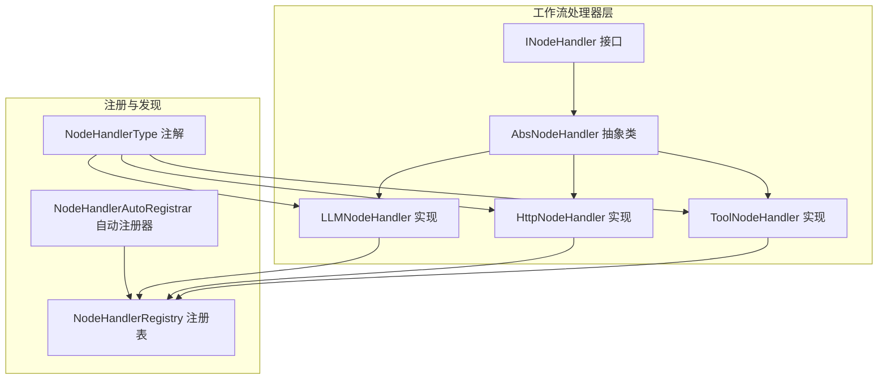
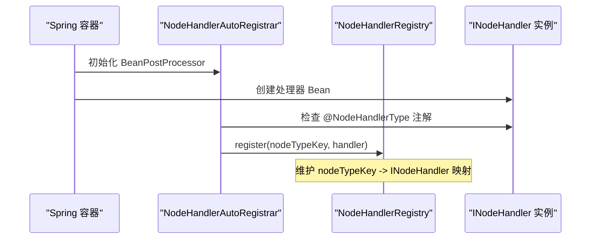
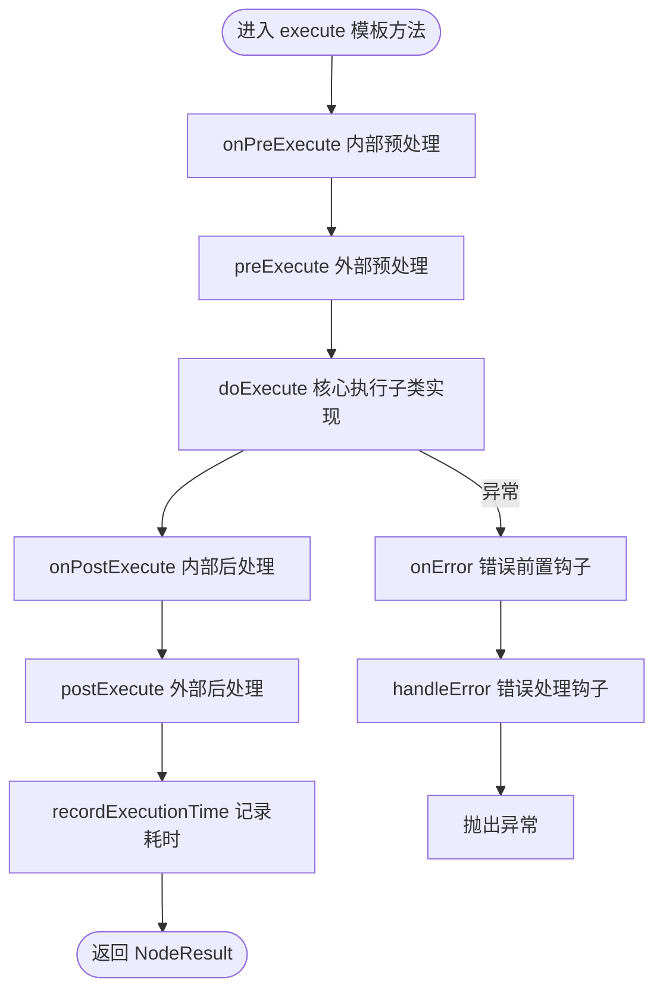
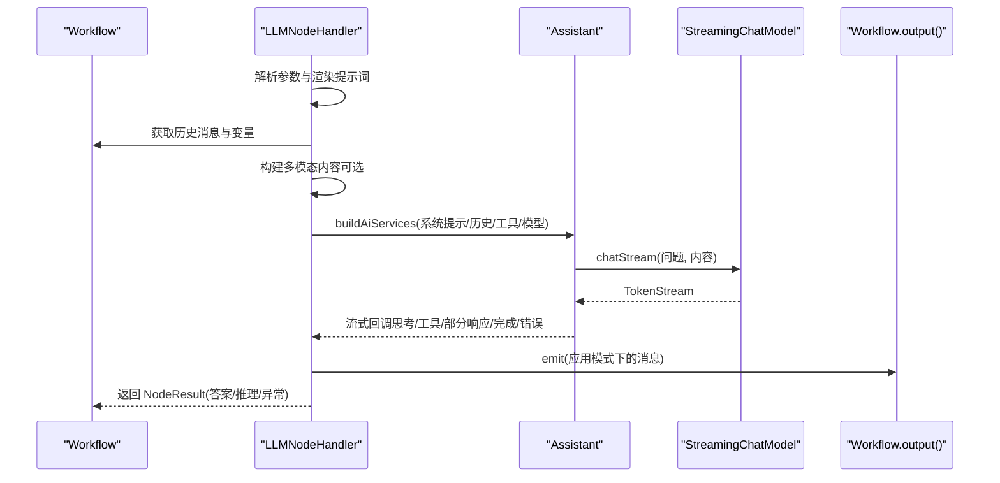
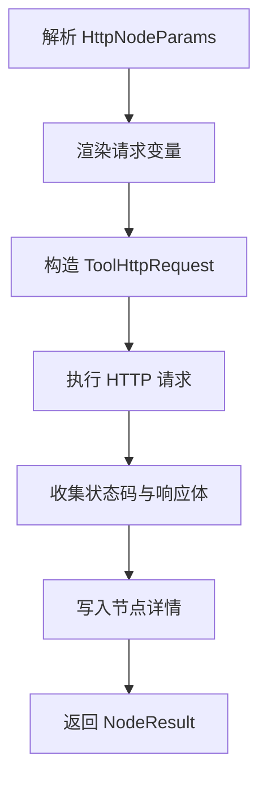
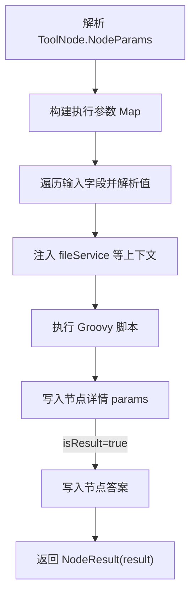
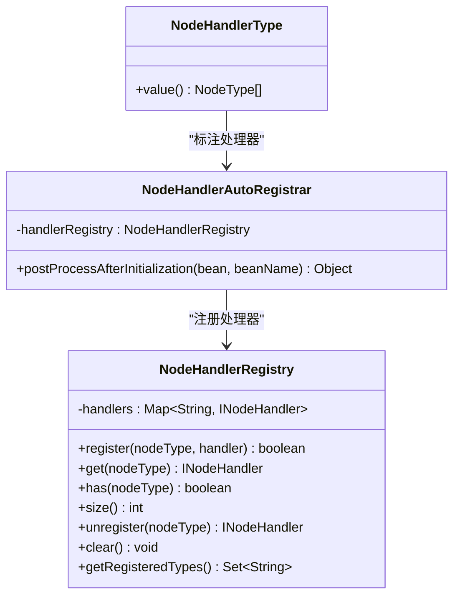

# 节点处理器扩展开发

<cite>
**本文引用的文件**
- [AbsNodeHandler.java](file://maxkb4j-service/maxkb4j-workflow/src/main/java/com/maxkb4j/workflow/handler/node/AbsNodeHandler.java)
- [INodeHandler.java](file://maxkb4j-service/maxkb4j-workflow/src/main/java/com/maxkb4j/workflow/handler/node/INodeHandler.java)
- [LLMNodeHandler.java](file://maxkb4j-service/maxkb4j-workflow/src/main/java/com/maxkb4j/workflow/handler/node/impl/LLMNodeHandler.java)
- [HttpNodeHandler.java](file://maxkb4j-service/maxkb4j-workflow/src/main/java/com/maxkb4j/workflow/handler/node/impl/HttpNodeHandler.java)
- [ToolNodeHandler.java](file://maxkb4j-service/maxkb4j-workflow/src/main/java/com/maxkb4j/workflow/handler/node/impl/ToolNodeHandler.java)
- [NodeHandlerAutoRegistrar.java](file://maxkb4j-service/maxkb4j-workflow/src/main/java/com/maxkb4j/workflow/processor/NodeHandlerAutoRegistrar.java)
- [NodeHandlerRegistry.java](file://maxkb4j-service/maxkb4j-workflow/src/main/java/com/maxkb4j/workflow/registry/NodeHandlerRegistry.java)
- [NodeHandlerType.java](file://maxkb4j-service/maxkb4j-workflow/src/main/java/com/maxkb4j/workflow/annotation/NodeHandlerType.java)
</cite>

## 目录
1. [简介](#简介)
2. [项目结构](#项目结构)
3. [核心组件](#核心组件)
4. [架构总览](#架构总览)
5. [详细组件分析](#详细组件分析)
6. [依赖分析](#依赖分析)
7. [性能考虑](#性能考虑)
8. [故障排查指南](#故障排查指南)
9. [结论](#结论)
10. [附录](#附录)

## 简介
本指南面向希望为 MaxKB4j 工作流系统开发“节点处理器”的开发者，围绕 AbsNodeHandler 抽象类的设计理念与继承模式，系统讲解节点处理器的核心接口方法、参数解析机制、输入输出数据处理、异常处理与错误恢复策略，并对内置处理器 LLMNodeHandler、HttpNodeHandler、ToolNodeHandler 进行实现级分析。同时提供自定义节点处理器的开发流程、注册机制、执行生命周期、并发处理与性能优化建议，以及单元测试与调试方法。

## 项目结构
MaxKB4j 的工作流模块位于 maxkb4j-service/maxkb4j-workflow 中，节点处理器相关代码主要分布在以下位置：
- 接口与抽象基类：handler/node
- 具体处理器实现：handler/node/impl
- 注册与自动装配：processor、registry
- 注解：annotation

下图给出与节点处理器扩展直接相关的模块关系概览：



图表来源
- [AbsNodeHandler.java:1-222](file://maxkb4j-service/maxkb4j-workflow/src/main/java/com/maxkb4j/workflow/handler/node/AbsNodeHandler.java#L1-L222)
- [INodeHandler.java:1-71](file://maxkb4j-service/maxkb4j-workflow/src/main/java/com/maxkb4j/workflow/handler/node/INodeHandler.java#L1-L71)
- [LLMNodeHandler.java:1-220](file://maxkb4j-service/maxkb4j-workflow/src/main/java/com/maxkb4j/workflow/handler/node/impl/LLMNodeHandler.java#L1-L220)
- [HttpNodeHandler.java:1-42](file://maxkb4j-service/maxkb4j-workflow/src/main/java/com/maxkb4j/workflow/handler/node/impl/HttpNodeHandler.java#L1-L42)
- [ToolNodeHandler.java:1-48](file://maxkb4j-service/maxkb4j-workflow/src/main/java/com/maxkb4j/workflow/handler/node/impl/ToolNodeHandler.java#L1-L48)
- [NodeHandlerType.java:1-16](file://maxkb4j-service/maxkb4j-workflow/src/main/java/com/maxkb4j/workflow/annotation/NodeHandlerType.java#L1-L16)
- [NodeHandlerAutoRegistrar.java:1-40](file://maxkb4j-service/maxkb4j-workflow/src/main/java/com/maxkb4j/workflow/processor/NodeHandlerAutoRegistrar.java#L1-L40)
- [NodeHandlerRegistry.java:1-123](file://maxkb4j-service/maxkb4j-workflow/src/main/java/com/maxkb4j/workflow/registry/NodeHandlerRegistry.java#L1-L123)

章节来源
- [AbsNodeHandler.java:1-222](file://maxkb4j-service/maxkb4j-workflow/src/main/java/com/maxkb4j/workflow/handler/node/AbsNodeHandler.java#L1-L222)
- [INodeHandler.java:1-71](file://maxkb4j-service/maxkb4j-workflow/src/main/java/com/maxkb4j/workflow/handler/node/INodeHandler.java#L1-L71)
- [NodeHandlerType.java:1-16](file://maxkb4j-service/maxkb4j-workflow/src/main/java/com/maxkb4j/workflow/annotation/NodeHandlerType.java#L1-L16)
- [NodeHandlerAutoRegistrar.java:1-40](file://maxkb4j-service/maxkb4j-workflow/src/main/java/com/maxkb4j/workflow/processor/NodeHandlerAutoRegistrar.java#L1-L40)
- [NodeHandlerRegistry.java:1-123](file://maxkb4j-service/maxkb4j-workflow/src/main/java/com/maxkb4j/workflow/registry/NodeHandlerRegistry.java#L1-L123)

## 核心组件
本节聚焦于节点处理器的抽象与接口设计，帮助理解扩展点与职责边界。

- INodeHandler 接口
  - 定义了 execute、preExecute、postExecute、onError、shouldInterrupt 等生命周期钩子，便于在不同阶段插入横切逻辑。
  - 适合在自定义处理器中按需覆盖钩子，实现参数校验、结果后处理、错误恢复等。

- AbsNodeHandler 抽象类
  - 提供 execute 模板方法，封装完整的执行流程：参数解析、内部/外部预处理、核心执行、内部/外部后处理、错误处理、执行时间统计。
  - 提供 parseParams、putDetail、putDetails、setAnswer、getReferenceField 等常用辅助方法，简化参数解析与结果写入。
  - 将异常处理委托给异常解析责任链，子类可通过 handleError 钩子补充自定义错误处理逻辑。

章节来源
- [INodeHandler.java:1-71](file://maxkb4j-service/maxkb4j-workflow/src/main/java/com/maxkb4j/workflow/handler/node/INodeHandler.java#L1-L71)
- [AbsNodeHandler.java:1-222](file://maxkb4j-service/maxkb4j-workflow/src/main/java/com/maxkb4j/workflow/handler/node/AbsNodeHandler.java#L1-L222)

## 架构总览
下图展示节点处理器的注册与发现机制，以及处理器在工作流中的角色定位：



图表来源
- [NodeHandlerAutoRegistrar.java:1-40](file://maxkb4j-service/maxkb4j-workflow/src/main/java/com/maxkb4j/workflow/processor/NodeHandlerAutoRegistrar.java#L1-L40)
- [NodeHandlerRegistry.java:1-123](file://maxkb4j-service/maxkb4j-workflow/src/main/java/com/maxkb4j/workflow/registry/NodeHandlerRegistry.java#L1-L123)
- [NodeHandlerType.java:1-16](file://maxkb4j-service/maxkb4j-workflow/src/main/java/com/maxkb4j/workflow/annotation/NodeHandlerType.java#L1-L16)

## 详细组件分析

### 抽象类与接口：AbsNodeHandler 与 INodeHandler
- 设计要点
  - 模板方法 execute 将生命周期管理与核心执行解耦，子类仅需实现 doExecute。
  - 参数解析通过 parseParams 将节点的 nodeData 自动反序列化为强类型参数对象，支持空安全与告警。
  - 生命周期钩子分层：onPreExecute/onPostExecute 为框架内部钩子；preExecute/postExecute/onError 为子类可覆写的扩展点。
  - 辅助方法统一写入节点详情与答案文本，便于调试与可观测性。

- 关键流程图（基于模板方法）


图表来源
- [AbsNodeHandler.java:46-76](file://maxkb4j-service/maxkb4j-workflow/src/main/java/com/maxkb4j/workflow/handler/node/AbsNodeHandler.java#L46-L76)

章节来源
- [AbsNodeHandler.java:1-222](file://maxkb4j-service/maxkb4j-workflow/src/main/java/com/maxkb4j/workflow/handler/node/AbsNodeHandler.java#L1-L222)
- [INodeHandler.java:1-71](file://maxkb4j-service/maxkb4j-workflow/src/main/java/com/maxkb4j/workflow/handler/node/INodeHandler.java#L1-L71)

### LLMNodeHandler：大模型对话与工具调用
- 功能概述
  - 解析 AiChatNodeParams，渲染提示词与系统提示，构建历史消息上下文。
  - 支持多模态输入（图片），从 OSS 加载并编码为图像内容。
  - 构建 Assistant 服务，注入工具提供者与工具映射，启用流式聊天模型。
  - 流式输出处理：思考内容、工具执行、部分响应、完成与错误回调。
  - 将最终答案写入节点答案与结果集，并记录令牌用量等指标。

- 关键流程图（流式聊天）


图表来源
- [LLMNodeHandler.java:57-220](file://maxkb4j-service/maxkb4j-workflow/src/main/java/com/maxkb4j/workflow/handler/node/impl/LLMNodeHandler.java#L57-L220)

章节来源
- [LLMNodeHandler.java:1-220](file://maxkb4j-service/maxkb4j-workflow/src/main/java/com/maxkb4j/workflow/handler/node/impl/LLMNodeHandler.java#L1-L220)

### HttpNodeHandler：HTTP 客户端节点
- 功能概述
  - 解析 HttpNodeParams，渲染请求变量，构造 ToolHttpRequest。
  - 使用 HttpRequestExecutor 发起 HTTP 请求，收集状态码与响应体。
  - 将请求详情写入节点详情，返回状态码与响应体作为结果。

- 关键流程图（HTTP 调用）


图表来源
- [HttpNodeHandler.java:22-42](file://maxkb4j-service/maxkb4j-workflow/src/main/java/com/maxkb4j/workflow/handler/node/impl/HttpNodeHandler.java#L22-L42)

章节来源
- [HttpNodeHandler.java:1-42](file://maxkb4j-service/maxkb4j-workflow/src/main/java/com/maxkb4j/workflow/handler/node/impl/HttpNodeHandler.java#L1-L42)

### ToolNodeHandler：脚本工具节点
- 功能概述
  - 解析 ToolNode.NodeParams，遍历输入字段列表，从工作流上下文中解析各字段值。
  - 将 fileService 与输入参数注入 GroovyScriptExecutor，执行脚本。
  - 将执行参数写入节点详情，若配置为结果节点，则将脚本结果写入节点答案。

- 关键流程图（Groovy 脚本执行）


图表来源
- [ToolNodeHandler.java:27-48](file://maxkb4j-service/maxkb4j-workflow/src/main/java/com/maxkb4j/workflow/handler/node/impl/ToolNodeHandler.java#L27-L48)

章节来源
- [ToolNodeHandler.java:1-48](file://maxkb4j-service/maxkb4j-workflow/src/main/java/com/maxkb4j/workflow/handler/node/impl/ToolNodeHandler.java#L1-L48)

### 注册与发现：NodeHandlerType、NodeHandlerAutoRegistrar、NodeHandlerRegistry
- 注解 NodeHandlerType
  - 作用：声明处理器支持的节点类型数组（NodeType 的 key 值）。
- 自动注册器 NodeHandlerAutoRegistrar
  - 作用：Bean 初始化后扫描实现了 INodeHandler 且带有 @NodeHandlerType 的 Bean，将其注册到注册表。
- 注册表 NodeHandlerRegistry
  - 作用：维护 nodeTypeKey -> INodeHandler 的并发映射，提供注册、查询、注销、清空等能力。

- 类图（注册与发现）


图表来源
- [NodeHandlerType.java:1-16](file://maxkb4j-service/maxkb4j-workflow/src/main/java/com/maxkb4j/workflow/annotation/NodeHandlerType.java#L1-L16)
- [NodeHandlerAutoRegistrar.java:1-40](file://maxkb4j-service/maxkb4j-workflow/src/main/java/com/maxkb4j/workflow/processor/NodeHandlerAutoRegistrar.java#L1-L40)
- [NodeHandlerRegistry.java:1-123](file://maxkb4j-service/maxkb4j-workflow/src/main/java/com/maxkb4j/workflow/registry/NodeHandlerRegistry.java#L1-L123)

章节来源
- [NodeHandlerType.java:1-16](file://maxkb4j-service/maxkb4j-workflow/src/main/java/com/maxkb4j/workflow/annotation/NodeHandlerType.java#L1-L16)
- [NodeHandlerAutoRegistrar.java:1-40](file://maxkb4j-service/maxkb4j-workflow/src/main/java/com/maxkb4j/workflow/processor/NodeHandlerAutoRegistrar.java#L1-L40)
- [NodeHandlerRegistry.java:1-123](file://maxkb4j-service/maxkb4j-workflow/src/main/java/com/maxkb4j/workflow/registry/NodeHandlerRegistry.java#L1-L123)

## 依赖分析
- 组件内聚与耦合
  - AbsNodeHandler 与具体处理器之间通过模板方法与接口解耦，符合开闭原则。
  - 注册表与自动注册器通过注解与 Spring Bean 生命周期配合，降低手动配置成本。
- 外部依赖
  - LLMNodeHandler 依赖模型工厂、工具提供者、OSS 服务与流式模型，体现跨模块协作。
  - HttpNodeHandler 依赖 HTTP 执行器与请求对象，职责清晰。
  - ToolNodeHandler 依赖脚本执行器与文件服务，便于工具化扩展。

- 依赖关系图
```mermaid
graph LR
Abs["AbsNodeHandler"] --> INode["INodeHandler"]
LLM["LLMNodeHandler"] --> Abs
HTTP["HttpNodeHandler"] --> Abs
TOOL["ToolNodeHandler"] --> Abs
REG["NodeHandlerRegistry"] --> INode
REG <- --> LLM
REG <- --> HTTP
REG <- --> TOOL
AUTO["NodeHandlerAutoRegistrar"] --> REG
TYPE["NodeHandlerType"] --> LLM
TYPE --> HTTP
TYPE --> TOOL
```

图表来源
- [AbsNodeHandler.java:1-222](file://maxkb4j-service/maxkb4j-workflow/src/main/java/com/maxkb4j/workflow/handler/node/AbsNodeHandler.java#L1-L222)
- [INodeHandler.java:1-71](file://maxkb4j-service/maxkb4j-workflow/src/main/java/com/maxkb4j/workflow/handler/node/INodeHandler.java#L1-L71)
- [LLMNodeHandler.java:1-220](file://maxkb4j-service/maxkb4j-workflow/src/main/java/com/maxkb4j/workflow/handler/node/impl/LLMNodeHandler.java#L1-L220)
- [HttpNodeHandler.java:1-42](file://maxkb4j-service/maxkb4j-workflow/src/main/java/com/maxkb4j/workflow/handler/node/impl/HttpNodeHandler.java#L1-L42)
- [ToolNodeHandler.java:1-48](file://maxkb4j-service/maxkb4j-workflow/src/main/java/com/maxkb4j/workflow/handler/node/impl/ToolNodeHandler.java#L1-L48)
- [NodeHandlerRegistry.java:1-123](file://maxkb4j-service/maxkb4j-workflow/src/main/java/com/maxkb4j/workflow/registry/NodeHandlerRegistry.java#L1-L123)
- [NodeHandlerAutoRegistrar.java:1-40](file://maxkb4j-service/maxkb4j-workflow/src/main/java/com/maxkb4j/workflow/processor/NodeHandlerAutoRegistrar.java#L1-L40)
- [NodeHandlerType.java:1-16](file://maxkb4j-service/maxkb4j-workflow/src/main/java/com/maxkb4j/workflow/annotation/NodeHandlerType.java#L1-L16)

## 性能考虑
- 流式处理与背压
  - LLMNodeHandler 使用 TokenStream 进行流式输出，建议在应用模式下按需 emit，避免阻塞。
- 资源加载与缓存
  - 图片等资源从 OSS 加载时，建议结合缓存策略减少重复下载与编码开销。
- 并发与线程安全
  - 注册表采用并发映射，注册与查询为原子操作；自定义处理器内部应避免共享可变状态。
- 超时与重试
  - HTTP 调用与模型推理建议设置合理超时与重试策略，防止长时间阻塞。
- 指标与可观测性
  - 利用 recordExecutionTime 与 putDetails 记录运行时指标，便于性能分析与问题定位。

## 故障排查指南
- 参数解析失败
  - 现象：parseParams 返回 null 或警告日志。
  - 排查：确认 node.getNodeData() 是否为空，paramsClass 是否正确，节点参数是否按预期序列化。
- 异常处理
  - AbsNodeHandler 将异常交由异常解析责任链处理，子类可通过 handleError 钩子补充自定义处理逻辑。
- 注册缺失
  - 现象：根据节点类型找不到处理器。
  - 排查：确认 @NodeHandlerType 注解是否正确声明节点类型，Bean 是否被 Spring 扫描并完成初始化。
- 输出异常
  - LLMNodeHandler 在工具调用失败时会发出空输出，但异常仍会传播，需关注上层处理。

章节来源
- [AbsNodeHandler.java:85-96](file://maxkb4j-service/maxkb4j-workflow/src/main/java/com/maxkb4j/workflow/handler/node/AbsNodeHandler.java#L85-L96)
- [AbsNodeHandler.java:132-134](file://maxkb4j-service/maxkb4j-workflow/src/main/java/com/maxkb4j/workflow/handler/node/AbsNodeHandler.java#L132-L134)
- [NodeHandlerRegistry.java:62-68](file://maxkb4j-service/maxkb4j-workflow/src/main/java/com/maxkb4j/workflow/registry/NodeHandlerRegistry.java#L62-L68)

## 结论
通过 AbsNodeHandler 抽象类与 INodeHandler 接口，MaxKB4j 为节点处理器提供了清晰的扩展点与一致的生命周期管理。借助 NodeHandlerType、NodeHandlerAutoRegistrar 与 NodeHandlerRegistry，系统实现了零样板的自动注册与发现。内置的 LLMNodeHandler、HttpNodeHandler、ToolNodeHandler 展示了参数解析、输入输出处理与错误恢复的最佳实践。开发者可据此快速实现自定义节点处理器，并在保证性能与可观测性的前提下，安全地集成到工作流执行引擎中。

## 附录

### 自定义节点处理器开发流程
- 步骤
  - 新建类实现 INodeHandler 或继承 AbsNodeHandler。
  - 在类上使用 @NodeHandlerType 声明支持的节点类型数组。
  - 在 doExecute 中实现核心逻辑，必要时使用 parseParams、putDetail、setAnswer 等辅助方法。
  - 如需生命周期钩子，可覆写 preExecute、postExecute、onError、onPostExecute。
  - 确保 Bean 被 Spring 扫描，等待 NodeHandlerAutoRegistrar 自动注册。
- 参考实现
  - [LLMNodeHandler.java:1-220](file://maxkb4j-service/maxkb4j-workflow/src/main/java/com/maxkb4j/workflow/handler/node/impl/LLMNodeHandler.java#L1-L220)
  - [HttpNodeHandler.java:1-42](file://maxkb4j-service/maxkb4j-workflow/src/main/java/com/maxkb4j/workflow/handler/node/impl/HttpNodeHandler.java#L1-L42)
  - [ToolNodeHandler.java:1-48](file://maxkb4j-service/maxkb4j-workflow/src/main/java/com/maxkb4j/workflow/handler/node/impl/ToolNodeHandler.java#L1-L48)

### 单元测试与调试建议
- 单元测试
  - 使用 Mockito 模拟 Workflow、AbsNode、NodeResult，验证 doExecute 的行为与异常分支。
  - 验证 parseParams 对空 nodeData 与空 paramsClass 的处理。
  - 验证注册表的注册、查询、替换与注销行为。
- 调试方法
  - 在处理器中使用 putDetail 记录关键上下文，利用 recordExecutionTime 观察耗时。
  - 在应用模式下通过 workflow.output().emit 输出中间结果，便于前端联调。