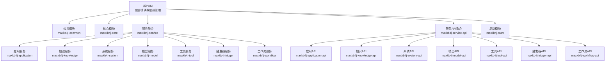
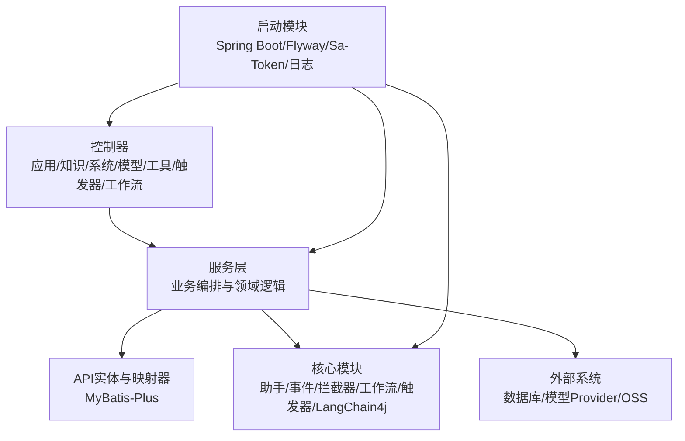
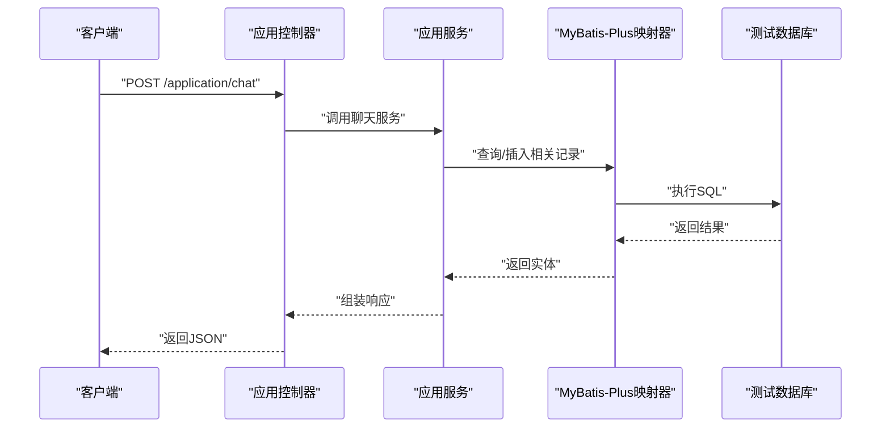
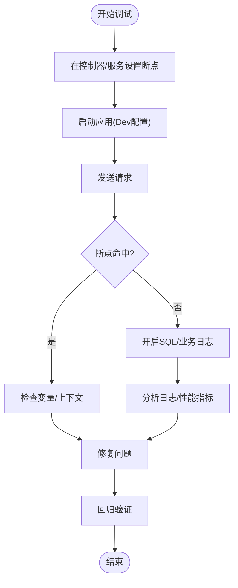
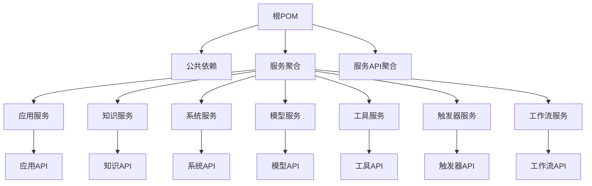

# 测试与调试

<cite>
**本文引用的文件**
- [根POM](file://pom.xml)
- [公共模块POM](file://maxkb4j-common/pom.xml)
- [服务聚合POM](file://maxkb4j-service/pom.xml)
- [应用服务POM](file://maxkb4j-service/maxkb4j-application/pom.xml)
- [知识服务POM](file://maxkb4j-service/maxkb4j-knowledge/pom.xml)
- [启动模块POM](file://maxkb4j-start/pom.xml)
- [启动配置application.yml](file://maxkb4j-start/src/main/resources/application.yml)
- [启动配置application-dev.yml](file://maxkb4j-start/src/main/resources/application-dev.yml)
- [启动配置application-prod.yml](file://maxkb4j-start/src/main/resources/application-prod.yml)
- [启动配置logback-spring.xml](file://maxkb4j-start/src/main/resources/logback-spring.xml)
- [应用API实体-聊天记录实体](file://maxkb4j-service-api/maxkb4j-application-api/src/main/java/com/maxkb4j/application/entity/ApplicationChatEntity.java)
- [应用API实体-应用实体](file://maxkb4j-service-api/maxkb4j-application-api/src/main/java/com/maxkb4j/application/entity/ApplicationEntity.java)
- [应用API映射器-聊天记录映射器](file://maxkb4j-service-api/maxkb4j-application-api/src/main/java/com/maxkb4j/application/mapper/ApplicationChatMapper.java)
- [应用API映射器-聊天记录映射XML](file://maxkb4j-service-api/maxkb4j-application-api/src/main/java/com/maxkb4j/application/mapper/ApplicationChatMapper.xml)
- [应用API映射器-用户统计映射XML](file://maxkb4j-service-api/maxkb4j-application-api/src/main/java/com/maxkb4j/application/mapper/ApplicationChatUserStatsMapper.xml)
- [知识API实体-文档实体](file://maxkb4j-service-api/maxkb4j-knowledge-api/src/main/java/com/maxkb4j/knowledge/entity/DocumentEntity.java)
- [知识API实体-段落实体](file://maxkb4j-service-api/maxkb4j-knowledge-api/src/main/java/com/maxkb4j/knowledge/entity/ParagraphEntity.java)
- [知识API实体-知识库实体](file://maxkb4j-service-api/maxkb4j-knowledge-api/src/main/java/com/maxkb4j/knowledge/entity/KnowledgeEntity.java)
- [知识API映射器-文档映射XML](file://maxkb4j-service-api/maxkb4j-knowledge-api/src/main/java/com/maxkb4j/knowledge/mapper/DocumentMapper.xml)
- [知识API映射器-嵌入向量映射XML](file://maxkb4j-service-api/maxkb4j-knowledge-api/src/main/java/com/maxkb4j/knowledge/mapper/EmbeddingMapper.xml)
- [触发器API实体-事件触发实体](file://maxkb4j-service-api/maxkb4j-trigger-api/src/main/java/com/maxkb4j/trigger/entity/EventTriggerEntity.java)
- [触发器API实体-任务实体](file://maxkb4j-service-api/maxkb4j-trigger-api/src/main/java/com/maxkb4j/trigger/entity/EventTriggerTaskEntity.java)
- [触发器API映射器-事件触发映射XML](file://maxkb4j-service-api/maxkb4j-trigger-api/src/main/java/com/maxkb4j/trigger/mapper/EventTriggerMapper.xml)
- [触发器API映射器-任务记录映射XML](file://maxkb4j-service-api/maxkb4j-trigger-api/src/main/java/com/maxkb4j/trigger/mapper/EventTriggerTaskRecordMapper.xml)
- [工作流API模型-工作流上下文](file://maxkb4j-service-api/maxkb4j-workflow-api/src/main/java/com/maxkb4j/workflow/model/WorkflowContext.java)
- [工作流API模型-节点结果](file://maxkb4j-service-api/maxkb4j-workflow-api/src/main/java/com/maxkb4j/workflow/model/NodeResult.java)
- [工作流API模型-变量解析器](file://maxkb4j-service-api/maxkb4j-workflow-api/src/main/java/com/maxkb4j/workflow/model/VariableResolver.java)
- [工作流API逻辑-逻辑流](file://maxkb4j-service-api/maxkb4j-workflow-api/src/main/java/com/maxkb4j/workflow/logic/LogicFlow.java)
- [工作流API工厂-节点注册表](file://maxkb4j-service-api/maxkb4j-workflow-api/src/main/java/com/maxkb4j/workflow/factory/NodeRegistry.java)
- [工作流API比较器-比较接口](file://maxkb4j-service-api/maxkb4j-workflow-api/src/main/java/com/maxkb4j/workflow/compare/Compare.java)
- [工作流API处理器-工作流处理器](file://maxkb4j-service-api/maxkb4j-workflow-api/src/main/java/com/maxkb4j/workflow/handler/AbsWorkflowHandler.java)
- [工作流API服务-工作流执行器](file://maxkb4j-service-api/maxkb4j-workflow-api/src/main/java/com/maxkb4j/workflow/service/WorkFlowActuator.java)
- [工作流实现-条件工具](file://maxkb4j-service/maxkb4j-workflow/src/main/java/com/maxkb4j/workflow/util/ConditionUtil.java)
- [工作流实现-工作流配置](file://maxkb4j-service/maxkb4j-workflow/src/main/java/com/maxkb4j/workflow/config/WorkflowConfig.java)
- [工作流实现-异常解析链](file://maxkb4j-service/maxkb4j-workflow/src/main/java/com/maxkb4j/workflow/exception/ExceptionResolverChain.java)
- [工作流实现-节点中心](file://maxkb4j-service/maxkb4j-workflow/src/main/java/com/maxkb4j/workflow/registry/NodeCenter.java)
- [工作流实现-节点处理器注册表](file://maxkb4j-service/maxkb4j-workflow/src/main/java/com/maxkb4j/workflow/registry/NodeHandlerRegistry.java)
- [工作流实现-处理器自动注册](file://maxkb4j-service/maxkb4j-workflow/src/main/java/com/maxkb4j/workflow/processor/NodeHandlerAutoRegistrar.java)
- [工作流实现-比较器自动注册](file://maxkb4j-service/maxkb4j-workflow/src/main/java/com/maxkb4j/workflow/processor/CompareAutoRegistrar.java)
- [工作流实现-触发器服务](file://maxkb4j-service/maxkb4j-workflow/src/main/java/com/maxkb4j/workflow/service/WorkFlowActuator.java)
- [核心工具-消息工具](file://maxkb4j-core/src/main/java/com/maxkb4j/core/util/MessageUtils.java)
- [核心工具-文本分割器](file://maxkb4j-core/src/main/java/com/maxkb4j/core/util/TextSplitter.java)
- [核心工具-句子分割器](file://maxkb4j-core/src/main/java/com/maxkb4j/core/util/SentenceSplitter.java)
- [核心工具-数据库工具](file://maxkb4j-core/src/main/java/com/maxkb4j/core/util/DatabaseUtil.java)
- [核心助手-NL2SQL助手](file://maxkb4j-core/src/main/java/com/maxkb4j/core/assistant/NL2SqlAssistant.java)
- [核心助手-参数提取助手](file://maxkb4j-core/src/main/java/com/maxkb4j/core/assistant/ParameterExtractionAssistant.java)
- [核心助手-意图分类助手](file://maxkb4j-core/src/main/java/com/maxkb4j/core/assistant/IntentClassifyAssistant.java)
- [核心助手-查询扩展助手](file://maxkb4j-core/src/main/java/com/maxkb4j/core/assistant/ExpandingQueryAssistant.java)
- [核心助手-查询压缩助手](file://maxkb4j-core/src/main/java/com/maxkb4j/core/assistant/CompressingQueryAssistant.java)
- [核心助手-路由助手](file://maxkb4j-core/src/main/java/com/maxkb4j/core/assistant/RouterAssistant.java)
- [核心助手-问题生成助手](file://maxkb4j-core/src/main/java/com/maxkb4j/core/assistant/ProblemGenerateAssistant.java)
- [核心事件-文档索引事件](file://maxkb4j-core/src/main/java/com/maxkb4j/core/event/DocumentIndexEvent.java)
- [核心事件-段落索引事件](file://maxkb4j-core/src/main/java/com/maxkb4j/core/event/ParagraphIndexEvent.java)
- [核心事件-生成问题事件](file://maxkb4j-core/src/main/java/com/maxkb4j/core/event/GenerateProblemEvent.java)
- [核心事件-创建网页文档事件](file://maxkb4j-core/src/main/java/com/maxkb4j/core/event/CreateWebDocsEvent.java)
- [核心监听器-助手开始监听器](file://maxkb4j-core/src/main/java/com/maxkb4j/core/listener/AssistantStartedListener.java)
- [核心监听器-助手完成监听器](file://maxkb4j-core/src/main/java/com/maxkb4j/core/listener/AssistantCompletedListener.java)
- [核心监听器-助手错误监听器](file://maxkb4j-core/src/main/java/com/maxkb4j/core/listener/AssistantErrorListener.java)
- [核心监听器-工具执行事件监听器](file://maxkb4j-core/src/main/java/com/maxkb4j/core/listener/AssistantToolExecutedEventListener.java)
- [核心拦截器-认证拦截器](file://maxkb4j-core/src/main/java/com/maxkb4j/core/interceptor/AuthInterceptor.java)
- [核心处理器-认证处理器](file://maxkb4j-core/src/main/java/com/maxkb4j/core/handler/AuthHandler.java)
- [LangChain4j-应用聊天内存](file://maxkb4j-core/src/main/java/com/maxkb4j/core/langchain4j/AppChatMemory.java)
- [LangChain4j-助手服务](file://maxkb4j-core/src/main/java/com/maxkb4j/core/langchain4j/AssistantServices.java)
- [系统控制器-用户控制器](file://maxkb4j-service/maxkb4j-system/src/main/java/com/maxkb4j/system/controller/UserController.java)
- [系统服务-系统设置服务](file://maxkb4j-service/maxkb4j-system/src/main/java/com/maxkb4j/system/service/SystemSettingService.java)
- [知识控制器-文档控制器](file://maxkb4j-service/maxkb4j-knowledge/src/main/java/com/maxkb4j/knowledge/controller/DocumentController.java)
- [知识服务-文档服务](file://maxkb4j-service/maxkb4j-knowledge/src/main/java/com/maxkb4j/knowledge/service/DocumentService.java)
- [知识服务-检索服务](file://maxkb4j-service/maxkb4j-knowledge/src/main/java/com/maxkb4j/knowledge/service/RetrieveService.java)
- [应用控制器-应用控制器](file://maxkb4j-service/maxkb4j-application/src/main/java/com/maxkb4j/application/controller/ApplicationController.java)
- [应用服务-应用服务](file://maxkb4j-service/maxkb4j-application/src/main/java/com/maxkb4j/application/service/ApplicationService.java)
- [应用服务-聊天服务](file://maxkb4j-service/maxkb4j-application/src/main/java/com/maxkb4j/application/service/ApplicationChatService.java)
- [应用服务-聊天记录服务](file://maxkb4j-service/maxkb4j-application/src/main/java/com/maxkb4j/application/service/ApplicationChatRecordService.java)
- [应用服务-访问密钥服务](file://maxkb4j-service/maxkb4j-application/src/main/java/com/maxkb4j/application/service/ApplicationAccessTokenService.java)
- [应用服务-API密钥服务](file://maxkb4j-service/maxkb4j-application/src/main/java/com/maxkb4j/application/service/ApplicationApiKeyService.java)
- [应用服务-导出服务](file://maxkb4j-service/maxkb4j-application/src/main/java/com/maxkb4j/application/service/ApplicationExportService.java)
- [应用服务-统计服务](file://maxkb4j-service/maxkb4j-application/src/main/java/com/maxkb4j/application/service/ApplicationStatsService.java)
- [应用服务-版本服务](file://maxkb4j-service/maxkb4j-application/src/main/java/com/maxkb4j/application/service/ApplicationVersionService.java)
- [应用服务-聊天用户统计服务](file://maxkb4j-service/maxkb4j-application/src/main/java/com/maxkb4j/application/service/ApplicationChatUserStatsService.java)
- [应用服务-访问权限服务](file://maxkb4j-service/maxkb4j-application/src/main/java/com/maxkb4j/application/service/ApplicationAccessService.java)
- [应用服务-聊天消息控制器](file://maxkb4j-service/maxkb4j-application/src/main/java/com/maxkb4j/application/controller/ChatMessageController.java)
- [应用服务-应用聊天控制器](file://maxkb4j-service/maxkb4j-application/src/main/java/com/maxkb4j/application/controller/ApplicationChatController.java)
- [应用服务-应用聊天记录控制器](file://maxkb4j-service/maxkb4j-application/src/main/java/com/maxkb4j/application/controller/ApplicationChatRecordController.java)
- [应用服务-应用访问控制器](file://maxkb4j-service/maxkb4j-application/src/main/java/com/maxkb4j/application/controller/ApplicationAccessController.java)
- [应用服务-应用密钥控制器](file://maxkb4j-service/maxkb4j-application/src/main/java/com/maxkb4j/application/controller/ApplicationKeyController.java)
- [应用服务-应用商店控制器](file://maxkb4j-service/maxkb4j-application/src/main/java/com/maxkb4j/application/controller/ApplicationStoreController.java)
- [应用服务-应用版本控制器](file://maxkb4j-service/maxkb4j-application/src/main/java/com/maxkb4j/application/controller/ApplicationVersionController.java)
- [应用服务-应用API DTO](file://maxkb4j-service/maxkb4j-application/src/main/java/com/maxkb4j/application/dto/MaxKb4J.java)
- [应用服务-应用构建器](file://maxkb4j-service/maxkb4j-application/src/main/java/com/maxkb4j/application/builder/ChatServiceBuilder.java)
- [应用服务-管道管理](file://maxkb4j-service/maxkb4j-application/src/main/java/com/maxkb4j/application/pipeline/PipelineManage.java)
- [应用服务-步骤抽象](file://maxkb4j-service/maxkb4j-application/src/main/java/com/maxkb4j/application/pipeline/AbsStep.java)
- [应用服务-步骤包](file://maxkb4j-service/maxkb4j-application/src/main/java/com/maxkb4j/application/pipeline/step/)
- [应用服务-响应处理器](file://maxkb4j-service/maxkb4j-application/src/main/java/com/maxkb4j/application/handler/PostResponseHandler.java)
- [应用服务-资源工具](file://maxkb4j-service/maxkb4j-application/src/main/java/com/maxkb4j/application/util/ResourceUtil.java)
- [应用服务-Shell工具](file://maxkb4j-service/maxkb4j-application/src/main/java/com/maxkb4j/application/util/ShellTool.java)
- [触发器控制器-触发器控制器](file://maxkb4j-service/maxkb4j-trigger/src/main/java/com/maxkb4j/trigger/controller/TriggerController.java)
- [触发器控制器-Webhook触发控制器](file://maxkb4j-service/maxkb4j-trigger/src/main/java/com/maxkb4j/trigger/controller/WebhookTriggerController.java)
- [触发器控制器-任务记录控制器](file://maxkb4j-service/maxkb4j-trigger/src/main/java/com/maxkb4j/trigger/controller/TriggerTaskRecordController.java)
- [触发器服务-事件触发服务](file://maxkb4j-service/maxkb4j-trigger/src/main/java/com/maxkb4j/trigger/service/EventTriggerService.java)
- [触发器服务-事件触发任务处理器](file://maxkb4j-service/maxkb4j-trigger/src/main/java/com/maxkb4j/trigger/service/EventTriggerTaskProcessor.java)
- [触发器服务-事件触发任务记录服务](file://maxkb4j-service/maxkb4j-trigger/src/main/java/com/maxkb4j/trigger/service/EventTriggerTaskRecordService.java)
- [触发器服务-事件触发任务服务](file://maxkb4j-service/maxkb4j-trigger/src/main/java/com/maxkb4j/trigger/service/EventTriggerTaskService.java)
- [触发器服务-调度器配置](file://maxkb4j-service/maxkb4j-trigger/src/main/java/com/maxkb4j/trigger/config/SchedulerConfig.java)
- [触发器服务-触发器调度器](file://maxkb4j-service/maxkb4j-trigger/src/main/java/com/maxkb4j/trigger/service/TriggerScheduler.java)
- [触发器服务-触发器任务执行器](file://maxkb4j-service/maxkb4j-trigger/src/main/java/com/maxkb4j/trigger/service/TriggerTaskExecutor.java)
- [触发器服务-下一次运行时间计算器](file://maxkb4j-service/maxkb4j-trigger/src/main/java/com/maxkb4j/trigger/service/NextRunTimeCalculator.java)
- [工具API实体-工具实体](file://maxkb4j-service-api/maxkb4j-tool-api/src/main/java/com/maxkb4j/tool/entity/ToolEntity.java)
- [工具API实体-MCP服务器配置](file://maxkb4j-service-api/maxkb4j-tool-api/src/main/java/com/maxkb4j/tool/dto/McpServerConfig.java)
- [工具API实体-MCP服务器DTO](file://maxkb4j-service-api/maxkb4j-tool-api/src/main/java/com/maxkb4j/tool/dto/McpServersDTO.java)
- [工具API实体-工具DTO](file://maxkb4j-service-api/maxkb4j-tool-api/src/main/java/com/maxkb4j/tool/dto/ToolDTO.java)
- [工具API实体-工具查询DTO](file://maxkb4j-service-api/maxkb4j-tool-api/src/main/java/com/maxkb4j/tool/dto/ToolQuery.java)
- [工具API服务-工具提供者服务](file://maxkb4j-service-api/maxkb4j-tool-api/src/main/java/com/maxkb4j/tool/service/IToolProviderService.java)
- [工具API服务-工具服务](file://maxkb4j-service-api/maxkb4j-tool-api/src/main/java/com/maxkb4j/tool/service/IToolService.java)
- [工具API服务-工具异常](file://maxkb4j-service-api/maxkb4j-tool-api/src/main/java/com/maxkb4j/tool/exception/ToolException.java)
- [工具API服务-工具连接异常](file://maxkb4j-service-api/maxkb4j-tool-api/src/main/java/com/maxkb4j/tool/exception/ToolConnectionException.java)
- [工具API服务-工具导入导出异常](file://maxkb4j-service-api/maxkb4j-tool-api/src/main/java/com/maxkb4j/tool/exception/ToolImportExportException.java)
- [工具API服务-工具验证异常](file://maxkb4j-service-api/maxkb4j-tool-api/src/main/java/com/maxkb4j/tool/exception/ToolValidationException.java)
- [工具服务-工具提供者服务](file://maxkb4j-service/maxkb4j-tool/src/main/java/com/maxkb4j/tool/service/ToolProviderService.java)
- [工具服务-工具服务](file://maxkb4j-service/maxkb4j-tool/src/main/java/com/maxkb4j/tool/service/ToolService.java)
- [工具服务-工具常量](file://maxkb4j-service/maxkb4j-tool/src/main/java/com/maxkb4j/tool/consts/ToolConstants.java)
- [工具服务-工具连接处理器](file://maxkb4j-service/maxkb4j-tool/src/main/java/com/maxkb4j/tool/handler/ToolConnectionHandler.java)
- [工具服务-工具导入导出处理器](file://maxkb4j-service/maxkb4j-tool/src/main/java/com/maxkb4j/tool/handler/ToolImportExportHandler.java)
- [工具服务-工具验证处理器](file://maxkb4j-service/maxkb4j-tool/src/main/java/com/maxkb4j/tool/handler/ToolValidationHandler.java)
- [工具服务-MCP工具工具](file://maxkb4j-service/maxkb4j-tool/src/main/java/com/maxkb4j/tool/util/McpToolUtil.java)
- [工具服务-技能工具工具](file://maxkb4j-service/maxkb4j-tool/src/main/java/com/maxkb4j/tool/util/SkillsToolUtil.java)
- [模型API实体-模型实体](file://maxkb4j-service-api/maxkb4j-model-api/src/main/java/com/maxkb4j/model/entity/ModelEntity.java)
- [模型API枚举-模型类型](file://maxkb4j-service-api/maxkb4j-model-api/src/main/java/com/maxkb4j/model/enums/ModelType.java)
- [模型API服务-模型提供者服务](file://maxkb4j-service-api/maxkb4j-model-api/src/main/java/com/maxkb4j/model/service/IModelProviderService.java)
- [模型API服务-模型参数接口](file://maxkb4j-service-api/maxkb4j-model-api/src/main/java/com/maxkb4j/model/service/IModelParams.java)
- [模型API服务-STT模型](file://maxkb4j-service-api/maxkb4j-model-api/src/main/java/com/maxkb4j/model/service/STTModel.java)
- [模型API服务-TTS模型](file://maxkb4j-service-api/maxkb4j-model-api/src/main/java/com/maxkb4j/model/service/TTSModel.java)
- [模型实现-模型提供者抽象](file://maxkb4j-service/maxkb4j-model/src/main/java/com/maxkb4j/model/provider/AbsModelProvider.java)
- [模型实现-OpenAI提供者](file://maxkb4j-service/maxkb4j-model/src/main/java/com/maxkb4j/model/provider/OpenAiModelProvider.java)
- [模型实现-Azure提供者](file://maxkb4j-service/maxkb4j-model/src/main/java/com/maxkb4j/model/provider/AzureModelProvider.java)
- [模型实现-本地AI提供者](file://maxkb4j-service/maxkb4j-model/src/main/java/com/maxkb4j/model/provider/LocalAIModelProvider.java)
- [模型实现-本地模型提供者](file://maxkb4j-service/maxkb4j-model/src/main/java/com/maxkb4j/model/provider/LocalModelProvider.java)
- [模型实现-通义千问提供者](file://maxkb4j-service/maxkb4j-model/src/main/java/com/maxkb4j/model/provider/WenXinModelProvider.java)
- [模型实现-文心一言提供者](file://maxkb4j-service/maxkb4j-model/src/main/java/com/maxkb4j/model/provider/XunFeiModelProvider.java)
- [模型实现-讯飞星火提供者](file://maxkb4j-service/maxkb4j-model/src/main/java/com/maxkb4j/model/provider/ZhiPuModelProvider.java)
- [模型实现-智谱清言提供者](file://maxkb4j-service/maxkb4j-model/src/main/java/com/maxkb4j/model/provider/GeminiModelProvider.java)
- [模型实现-Gemini提供者](file://maxkb4j-service/maxkb4j-model/src/main/java/com/maxkb4j/model/provider/GeminiModelProvider.java)
- [模型实现-火山引擎提供者](file://maxkb4j-service/maxkb4j-model/src/main/java/com/maxkb4j/model/provider/VolcanicEngineModelProvider.java)
- [模型实现-阿里百炼提供者](file://maxkb4j-service/maxkb4j-model/src/main/java/com/maxkb4j/model/provider/AliYunBaiLianModelProvider.java)
- [模型实现-DeepSeek提供者](file://maxkb4j-service/maxkb4j-model/src/main/java/com/maxkb4j/model/provider/DeepSeekModelProvider.java)
- [模型实现-Kimi提供者](file://maxkb4j-service/maxkb4j-model/src/main/java/com/maxkb4j/model/provider/KimiModelProvider.java)
- [模型实现-Ollama提供者](file://maxkb4j-service/maxkb4j-model/src/main/java/com/maxkb4j/model/provider/OLlamaModelProvider.java)
- [模型实现-Anthropic提供者](file://maxkb4j-service/maxkb4j-model/src/main/java/com/maxkb4j/model/provider/AnthropicProvider.java)
- [模型实现-Xinference提供者](file://maxkb4j-service/maxkb4j-model/src/main/java/com/maxkb4j/model/provider/XInferenceModelProvider.java)
- [模型实现-腾讯混元提供者](file://maxkb4j-service/maxkb4j-model/src/main/java/com/maxkb4j/model/provider/TencentModelProvider.java)
- [模型实现-硅基流动提供者](file://maxkb4j-service/maxkb4j-model/src/main/java/com/maxkb4j/model/provider/SiliconFlowModelProvider.java)
- [模型实现-禁用提供者包](file://maxkb4j-service/maxkb4j-model/src/main/java/com/maxkb4j/model/custom/disabled/)
- [模型实现-自定义参数实现包](file://maxkb4j-service/maxkb4j-model/src/main/java/com/maxkb4j/model/custom/params/impl/)
- [模型实现-自定义模型包](file://maxkb4j-service/maxkb4j-model/src/main/java/com/maxkb4j/model/custom/model/)
- [模型实现-凭证包](file://maxkb4j-service/maxkb4j-model/src/main/java/com/maxkb4j/model/custom/credential/)
- [模型实现-模型服务](file://maxkb4j-service/maxkb4j-model/src/main/java/com/maxkb4j/model/service/ModelService.java)
- [模型实现-模型提供者服务](file://maxkb4j-service/maxkb4j-model/src/main/java/com/maxkb4j/model/service/ModelProviderService.java)
- [模型实现-模型提供者信息](file://maxkb4j-service/maxkb4j-model/src/main/java/com/maxkb4j/model/vo/ModelProviderInfo.java)
- [OSS API实体-文件实体](file://maxkb4j-service-api/maxkb4j-oss-api/src/main/java/com/maxkb4j/oss/entity/FileEntity.java)
- [OSS API服务-对象存储服务接口](file://maxkb4j-service-api/maxkb4j-oss-api/src/main/java/com/maxkb4j/oss/service/IOssService.java)
- [OSS API视图-文件视图](file://maxkb4j-service-api/maxkb4j-oss-api/src/main/java/com/maxkb4j/oss/vo/FileVO.java)
- [OSS服务-文件控制器](file://maxkb4j-service/maxkb4j-oss/src/main/java/com/maxkb4j/oss/controller/FileController.java)
- [OSS服务-Mongo文件服务](file://maxkb4j-service/maxkb4j-oss/src/main/java/com/maxkb4j/oss/service/MongoFileService.java)
- [系统API实体-系统设置实体](file://maxkb4j-service-api/maxkb4j-system-api/src/main/java/com/maxkb4j/system/entity/SystemSettingEntity.java)
- [系统API实体-资源映射实体](file://maxkb4j-service-api/maxkb4j-system-api/src/main/java/com/maxkb4j/system/entity/ResourceMappingEntity.java)
- [系统API服务-资源映射服务接口](file://maxkb4j-service-api/maxkb4j-system-api/src/main/java/com/maxkb4j/system/service/IResourceMappingService.java)
- [系统API枚举-设置类型](file://maxkb4j-service-api/maxkb4j-system-api/src/main/java/com/maxkb4j/system/enums/SettingType.java)
- [系统服务-系统设置控制器](file://maxkb4j-service/maxkb4j-system/src/main/java/com/maxkb4j/system/controller/SystemSettingController.java)
- [系统服务-系统设置服务](file://maxkb4j-service/maxkb4j-system/src/main/java/com/maxkb4j/system/service/SystemSettingService.java)
- [系统服务-资源映射服务](file://maxkb4j-service/maxkb4j-system/src/main/java/com/maxkb4j/system/service/ResourceMappingService.java)
- [系统服务-用户控制器](file://maxkb4j-service/maxkb4j-system/src/main/java/com/maxkb4j/system/controller/UserController.java)
- [系统服务-用户服务](file://maxkb4j-service/maxkb4j-system/src/main/java/com/maxkb4j/system/service/UserService.java)
- [系统服务-认证控制器](file://maxkb4j-service/maxkb4j-system/src/main/java/com/maxkb4j/system/controller/AuthController.java)
- [系统服务-用户资源权限控制器](file://maxkb4j-service/maxkb4j-system/src/main/java/com/maxkb4j/system/controller/UserResourcePermissionController.java)
- [系统服务-邮件服务](file://maxkb4j-service/maxkb4j-system/src/main/java/com/maxkb4j/system/service/EmailService.java)
- [系统服务-邮件配置服务](file://maxkb4j-service/maxkb4j-system/src/main/java/com/maxkb4j/system/service/MailConfigService.java)
- [聊天API控制器-聊天API控制器](file://maxkb4j-service/maxkb4j-chat/src/main/java/com/maxkb4j/chat/controller/ChatApiController.java)
- [聊天API控制器-聊天OpenAI控制器](file://maxkb4j-service/maxkb4j-chat/src/main/java/com/maxkb4j/chat/controller/ChatOpenAiController.java)
- [聊天API服务-聊天API服务](file://maxkb4j-service/maxkb4j-chat/src/main/java/com/maxkb4j/chat/service/ChatApiService.java)
- [知识解析器-文档解析器](file://maxkb4j-service/maxkb4j-knowledge/src/main/java/com/maxkb4j/knowledge/parser/DocumentParser.java)
- [知识解析器实现包](file://maxkb4j-service/maxkb4j-knowledge/src/main/java/com/maxkb4j/knowledge/parser/impl/)
- [知识监听器-Excel数据监听器](file://maxkb4j-service/maxkb4j-knowledge/src/main/java/com/maxkb4j/knowledge/listener/ExcelDataListener.java)
- [知识存储-复合存储实现](file://maxkb4j-service/maxkb4j-knowledge/src/main/java/com/maxkb4j/knowledge/store/CompositeStoreImpl.java)
- [知识存储-全文存储实现](file://maxkb4j-service/maxkb4j-knowledge/src/main/java/com/maxkb4j/knowledge/store/FullTextStoreImpl.java)
- [知识存储-向量存储实现](file://maxkb4j-service/maxkb4j-knowledge/src/main/java/com/maxkb4j/knowledge/store/VectorStoreImpl.java)
- [知识工具-Jsoup工具](file://maxkb4j-service/maxkb4j-knowledge/src/main/java/com/maxkb4j/knowledge/util/JsoupUtil.java)
- [知识工具-分词器](file://maxkb4j-service/maxkb4j-knowledge/src/main/java/com/maxkb4j/knowledge/util/Tokenizer.java)
- [知识Excel-知识库Excel](file://maxkb4j-service/maxkb4j-knowledge/src/main/java/com/maxkb4j/knowledge/excel/KnowledgeExcel.java)
- [知识Excel-聊天记录详情Excel](file://maxkb4j-service/maxkb4j-application/src/main/java/com/maxkb4j/application/excel/ChatRecordDetailExcel.java)
</cite>

## 目录
1. [简介](#简介)
2. [项目结构](#项目结构)
3. [核心组件](#核心组件)
4. [架构总览](#架构总览)
5. [详细组件分析](#详细组件分析)
6. [依赖分析](#依赖分析)
7. [性能考虑](#性能考虑)
8. [故障排查指南](#故障排查指南)
9. [结论](#结论)
10. [附录](#附录)

## 简介
本指南面向MaxKB4j项目的测试与调试，覆盖单元测试编写规范、集成测试策略、调试技巧、覆盖率与CI流程建议、性能与安全测试最佳实践，以及常见测试场景与用例设计模式。由于当前仓库未包含显式的测试源码与配置，本指南基于现有工程结构、依赖与模块划分，给出可落地的测试与调试方案，并在涉及具体实现细节时明确标注“章节来源”以便追溯。

## 项目结构
MaxKB4j采用多模块Maven聚合结构，核心模块包括：
- 公共模块(maxkb4j-common)：通用依赖与基础设施
- 核心模块(maxkb4j-core)：助手、事件、拦截器、LangChain4j集成等
- 服务模块(maxkb4j-service)：各领域服务(应用、知识、系统、模型、工具、触发器、工作流等)
- 服务API模块(maxkb4j-service-api)：各领域API实体、映射器、服务接口
- 启动模块(maxkb4j-start)：Spring Boot启动入口与配置

图表来源
- [根POM:57-63](file://pom.xml#L57-L63)
- [公共模块POM:1-103](file://maxkb4j-common/pom.xml#L1-L103)
- [服务聚合POM:34-69](file://maxkb4j-service/pom.xml#L34-L69)
- [应用服务POM:1-54](file://maxkb4j-service/maxkb4j-application/pom.xml#L1-L54)
- [知识服务POM:1-118](file://maxkb4j-service/maxkb4j-knowledge/pom.xml#L1-L118)
- [启动模块POM](file://maxkb4j-start/pom.xml)

章节来源
- [根POM:57-63](file://pom.xml#L57-L63)
- [公共模块POM:1-103](file://maxkb4j-common/pom.xml#L1-L103)
- [服务聚合POM:34-69](file://maxkb4j-service/pom.xml#L34-L69)
- [应用服务POM:1-54](file://maxkb4j-service/maxkb4j-application/pom.xml#L1-L54)
- [知识服务POM:1-118](file://maxkb4j-service/maxkb4j-knowledge/pom.xml#L1-L118)
- [启动模块POM](file://maxkb4j-start/pom.xml)

## 核心组件
- 助手体系：NL2SQL、参数提取、意图分类、查询扩展/压缩、路由、问题生成等
- 事件与监听：文档/段落索引事件、问题生成事件、创建网页文档事件；助手生命周期监听
- 工作流：节点注册、比较器注册、异常解析链、工作流执行器
- 触发器：定时/事件驱动任务、调度器、任务执行器
- 知识：文档/段落/知识库实体与映射、解析器、存储(全文/向量/复合)
- 应用：聊天、记录、访问/密钥、版本、统计、导出等
- 模型：多Provider适配(OpenAI、Azure、本地、通义、文心、Gemini、Anthropic等)
- 工具：MCP/HTTP/脚本等工具执行与校验
- 系统：用户、权限、资源映射、系统设置、邮件
- 启动与配置：Spring Boot、Flyway迁移、Sa-Token、MyBatis-Plus、日志

章节来源
- [核心助手-NL2SQL助手](file://maxkb4j-core/src/main/java/com/maxkb4j/core/assistant/NL2SqlAssistant.java)
- [核心助手-参数提取助手](file://maxkb4j-core/src/main/java/com/maxkb4j/core/assistant/ParameterExtractionAssistant.java)
- [核心助手-意图分类助手](file://maxkb4j-core/src/main/java/com/maxkb4j/core/assistant/IntentClassifyAssistant.java)
- [核心助手-查询扩展助手](file://maxkb4j-core/src/main/java/com/maxkb4j/core/assistant/ExpandingQueryAssistant.java)
- [核心助手-查询压缩助手](file://maxkb4j-core/src/main/java/com/maxkb4j/core/assistant/CompressingQueryAssistant.java)
- [核心助手-路由助手](file://maxkb4j-core/src/main/java/com/maxkb4j/core/assistant/RouterAssistant.java)
- [核心助手-问题生成助手](file://maxkb4j-core/src/main/java/com/maxkb4j/core/assistant/ProblemGenerateAssistant.java)
- [核心事件-文档索引事件](file://maxkb4j-core/src/main/java/com/maxkb4j/core/event/DocumentIndexEvent.java)
- [核心事件-段落索引事件](file://maxkb4j-core/src/main/java/com/maxkb4j/core/event/ParagraphIndexEvent.java)
- [核心事件-生成问题事件](file://maxkb4j-core/src/main/java/com/maxkb4j/core/event/GenerateProblemEvent.java)
- [核心事件-创建网页文档事件](file://maxkb4j-core/src/main/java/com/maxkb4j/core/event/CreateWebDocsEvent.java)
- [核心监听器-助手开始监听器](file://maxkb4j-core/src/main/java/com/maxkb4j/core/listener/AssistantStartedListener.java)
- [核心监听器-助手完成监听器](file://maxkb4j-core/src/main/java/com/maxkb4j/core/listener/AssistantCompletedListener.java)
- [核心监听器-助手错误监听器](file://maxkb4j-core/src/main/java/com/maxkb4j/core/listener/AssistantErrorListener.java)
- [核心监听器-工具执行事件监听器](file://maxkb4j-core/src/main/java/com/maxkb4j/core/listener/AssistantToolExecutedEventListener.java)
- [工作流API模型-工作流上下文](file://maxkb4j-service-api/maxkb4j-workflow-api/src/main/java/com/maxkb4j/workflow/model/WorkflowContext.java)
- [工作流API模型-节点结果](file://maxkb4j-service-api/maxkb4j-workflow-api/src/main/java/com/maxkb4j/workflow/model/NodeResult.java)
- [工作流API模型-变量解析器](file://maxkb4j-service-api/maxkb4j-workflow-api/src/main/java/com/maxkb4j/workflow/model/VariableResolver.java)
- [工作流API逻辑-逻辑流](file://maxkb4j-service-api/maxkb4j-workflow-api/src/main/java/com/maxkb4j/workflow/logic/LogicFlow.java)
- [工作流API工厂-节点注册表](file://maxkb4j-service-api/maxkb4j-workflow-api/src/main/java/com/maxkb4j/workflow/factory/NodeRegistry.java)
- [工作流API比较器-比较接口](file://maxkb4j-service-api/maxkb4j-workflow-api/src/main/java/com/maxkb4j/workflow/compare/Compare.java)
- [工作流API处理器-工作流处理器](file://maxkb4j-service-api/maxkb4j-workflow-api/src/main/java/com/maxkb4j/workflow/handler/AbsWorkflowHandler.java)
- [工作流API服务-工作流执行器](file://maxkb4j-service-api/maxkb4j-workflow-api/src/main/java/com/maxkb4j/workflow/service/WorkFlowActuator.java)
- [工作流实现-条件工具](file://maxkb4j-service/maxkb4j-workflow/src/main/java/com/maxkb4j/workflow/util/ConditionUtil.java)
- [工作流实现-工作流配置](file://maxkb4j-service/maxkb4j-workflow/src/main/java/com/maxkb4j/workflow/config/WorkflowConfig.java)
- [工作流实现-异常解析链](file://maxkb4j-service/maxkb4j-workflow/src/main/java/com/maxkb4j/workflow/exception/ExceptionResolverChain.java)
- [工作流实现-节点中心](file://maxkb4j-service/maxkb4j-workflow/src/main/java/com/maxkb4j/workflow/registry/NodeCenter.java)
- [工作流实现-节点处理器注册表](file://maxkb4j-service/maxkb4j-workflow/src/main/java/com/maxkb4j/workflow/registry/NodeHandlerRegistry.java)
- [工作流实现-处理器自动注册](file://maxkb4j-service/maxkb4j-workflow/src/main/java/com/maxkb4j/workflow/processor/NodeHandlerAutoRegistrar.java)
- [工作流实现-比较器自动注册](file://maxkb4j-service/maxkb4j-workflow/src/main/java/com/maxkb4j/workflow/processor/CompareAutoRegistrar.java)
- [触发器服务-事件触发服务](file://maxkb4j-service/maxkb4j-trigger/src/main/java/com/maxkb4j/trigger/service/EventTriggerService.java)
- [触发器服务-事件触发任务处理器](file://maxkb4j-service/maxkb4j-trigger/src/main/java/com/maxkb4j/trigger/service/EventTriggerTaskProcessor.java)
- [触发器服务-事件触发任务记录服务](file://maxkb4j-service/maxkb4j-trigger/src/main/java/com/maxkb4j/trigger/service/EventTriggerTaskRecordService.java)
- [触发器服务-事件触发任务服务](file://maxkb4j-service/maxkb4j-trigger/src/main/java/com/maxkb4j/trigger/service/EventTriggerTaskService.java)
- [触发器服务-调度器配置](file://maxkb4j-service/maxkb4j-trigger/src/main/java/com/maxkb4j/trigger/config/SchedulerConfig.java)
- [触发器服务-触发器调度器](file://maxkb4j-service/maxkb4j-trigger/src/main/java/com/maxkb4j/trigger/service/TriggerScheduler.java)
- [触发器服务-触发器任务执行器](file://maxkb4j-service/maxkb4j-trigger/src/main/java/com/maxkb4j/trigger/service/TriggerTaskExecutor.java)
- [触发器服务-下一次运行时间计算器](file://maxkb4j-service/maxkb4j-trigger/src/main/java/com/maxkb4j/trigger/service/NextRunTimeCalculator.java)
- [知识API实体-文档实体](file://maxkb4j-service-api/maxkb4j-knowledge-api/src/main/java/com/maxkb4j/knowledge/entity/DocumentEntity.java)
- [知识API实体-段落实体](file://maxkb4j-service-api/maxkb4j-knowledge-api/src/main/java/com/maxkb4j/knowledge/entity/ParagraphEntity.java)
- [知识API实体-知识库实体](file://maxkb4j-service-api/maxkb4j-knowledge-api/src/main/java/com/maxkb4j/knowledge/entity/KnowledgeEntity.java)
- [知识控制器-文档控制器](file://maxkb4j-service/maxkb4j-knowledge/src/main/java/com/maxkb4j/knowledge/controller/DocumentController.java)
- [知识服务-文档服务](file://maxkb4j-service/maxkb4j-knowledge/src/main/java/com/maxkb4j/knowledge/service/DocumentService.java)
- [知识服务-检索服务](file://maxkb4j-service/maxkb4j-knowledge/src/main/java/com/maxkb4j/knowledge/service/RetrieveService.java)
- [应用控制器-应用控制器](file://maxkb4j-service/maxkb4j-application/src/main/java/com/maxkb4j/application/controller/ApplicationController.java)
- [应用服务-应用服务](file://maxkb4j-service/maxkb4j-application/src/main/java/com/maxkb4j/application/service/ApplicationService.java)
- [应用服务-聊天服务](file://maxkb4j-service/maxkb4j-application/src/main/java/com/maxkb4j/application/service/ApplicationChatService.java)
- [应用服务-聊天记录服务](file://maxkb4j-service/maxkb4j-application/src/main/java/com/maxkb4j/application/service/ApplicationChatRecordService.java)
- [应用服务-访问密钥服务](file://maxkb4j-service/maxkb4j-application/src/main/java/com/maxkb4j/application/service/ApplicationAccessTokenService.java)
- [应用服务-API密钥服务](file://maxkb4j-service/maxkb4j-application/src/main/java/com/maxkb4j/application/service/ApplicationApiKeyService.java)
- [应用服务-导出服务](file://maxkb4j-service/maxkb4j-application/src/main/java/com/maxkb4j/application/service/ApplicationExportService.java)
- [应用服务-统计服务](file://maxkb4j-service/maxkb4j-application/src/main/java/com/maxkb4j/application/service/ApplicationStatsService.java)
- [应用服务-版本服务](file://maxkb4j-service/maxkb4j-application/src/main/java/com/maxkb4j/application/service/ApplicationVersionService.java)
- [应用服务-聊天用户统计服务](file://maxkb4j-service/maxkb4j-application/src/main/java/com/maxkb4j/application/service/ApplicationChatUserStatsService.java)
- [应用服务-访问权限服务](file://maxkb4j-service/maxkb4j-application/src/main/java/com/maxkb4j/application/service/ApplicationAccessService.java)
- [系统控制器-用户控制器](file://maxkb4j-service/maxkb4j-system/src/main/java/com/maxkb4j/system/controller/UserController.java)
- [系统服务-系统设置服务](file://maxkb4j-service/maxkb4j-system/src/main/java/com/maxkb4j/system/service/SystemSettingService.java)
- [模型实现-模型提供者抽象](file://maxkb4j-service/maxkb4j-model/src/main/java/com/maxkb4j/model/provider/AbsModelProvider.java)
- [模型实现-OpenAI提供者](file://maxkb4j-service/maxkb4j-model/src/main/java/com/maxkb4j/model/provider/OpenAiModelProvider.java)
- [模型实现-Azure提供者](file://maxkb4j-service/maxkb4j-model/src/main/java/com/maxkb4j/model/provider/AzureModelProvider.java)
- [模型实现-本地AI提供者](file://maxkb4j-service/maxkb4j-model/src/main/java/com/maxkb4j/model/provider/LocalAIModelProvider.java)
- [模型实现-本地模型提供者](file://maxkb4j-service/maxkb4j-model/src/main/java/com/maxkb4j/model/provider/LocalModelProvider.java)
- [模型实现-通义千问提供者](file://maxkb4j-service/maxkb4j-model/src/main/java/com/maxkb4j/model/provider/WenXinModelProvider.java)
- [模型实现-文心一言提供者](file://maxkb4j-service/maxkb4j-model/src/main/java/com/maxkb4j/model/provider/XunFeiModelProvider.java)
- [模型实现-讯飞星火提供者](file://maxkb4j-service/maxkb4j-model/src/main/java/com/maxkb4j/model/provider/ZhiPuModelProvider.java)
- [模型实现-智谱清言提供者](file://maxkb4j-service/maxkb4j-model/src/main/java/com/maxkb4j/model/provider/GeminiModelProvider.java)
- [模型实现-Gemini提供者](file://maxkb4j-service/maxkb4j-model/src/main/java/com/maxkb4j/model/provider/GeminiModelProvider.java)
- [模型实现-火山引擎提供者](file://maxkb4j-service/maxkb4j-model/src/main/java/com/maxkb4j/model/provider/VolcanicEngineModelProvider.java)
- [模型实现-阿里百炼提供者](file://maxkb4j-service/maxkb4j-model/src/main/java/com/maxkb4j/model/provider/AliYunBaiLianModelProvider.java)
- [模型实现-DeepSeek提供者](file://maxkb4j-service/maxkb4j-model/src/main/java/com/maxkb4j/model/provider/DeepSeekModelProvider.java)
- [模型实现-Kimi提供者](file://maxkb4j-service/maxkb4j-model/src/main/java/com/maxkb4j/model/provider/KimiModelProvider.java)
- [模型实现-Ollama提供者](file://maxkb4j-service/maxkb4j-model/src/main/java/com/maxkb4j/model/provider/OLlamaModelProvider.java)
- [模型实现-Anthropic提供者](file://maxkb4j-service/maxkb4j-model/src/main/java/com/maxkb4j/model/provider/AnthropicProvider.java)
- [模型实现-Xinference提供者](file://maxkb4j-service/maxkb4j-model/src/main/java/com/maxkb4j/model/provider/XInferenceModelProvider.java)
- [模型实现-腾讯混元提供者](file://maxkb4j-service/maxkb4j-model/src/main/java/com/maxkb4j/model/provider/TencentModelProvider.java)
- [模型实现-硅基流动提供者](file://maxkb4j-service/maxkb4j-model/src/main/java/com/maxkb4j/model/provider/SiliconFlowModelProvider.java)
- [工具API实体-工具实体](file://maxkb4j-service-api/maxkb4j-tool-api/src/main/java/com/maxkb4j/tool/entity/ToolEntity.java)
- [工具服务-工具提供者服务](file://maxkb4j-service/maxkb4j-tool/src/main/java/com/maxkb4j/tool/service/ToolProviderService.java)
- [工具服务-工具服务](file://maxkb4j-service/maxkb4j-tool/src/main/java/com/maxkb4j/tool/service/ToolService.java)
- [聊天API控制器-聊天API控制器](file://maxkb4j-service/maxkb4j-chat/src/main/java/com/maxkb4j/chat/controller/ChatApiController.java)
- [聊天API控制器-聊天OpenAI控制器](file://maxkb4j-service/maxkb4j-chat/src/main/java/com/maxkb4j/chat/controller/ChatOpenAiController.java)
- [聊天API服务-聊天API服务](file://maxkb4j-service/maxkb4j-chat/src/main/java/com/maxkb4j/chat/service/ChatApiService.java)

## 架构总览
MaxKB4j采用分层架构与模块化设计，核心交互路径如下：
- 控制器(Controller)接收请求，调用服务(Service)处理业务
- 服务层通过API实体与映射器(MyBatis-Plus)访问数据库
- 核心模块提供助手、事件、拦截器、工作流、触发器等横切能力
- LangChain4j集成用于大模型交互与记忆管理
- 启动模块负责Spring Boot引导、Flyway迁移、Sa-Token认证、日志配置

图表来源
- [启动配置application.yml:1-69](file://maxkb4j-start/src/main/resources/application.yml#L1-L69)
- [启动配置application-dev.yml](file://maxkb4j-start/src/main/resources/application-dev.yml)
- [启动配置application-prod.yml](file://maxkb4j-start/src/main/resources/application-prod.yml)
- [启动配置logback-spring.xml](file://maxkb4j-start/src/main/resources/logback-spring.xml)

章节来源
- [启动配置application.yml:1-69](file://maxkb4j-start/src/main/resources/application.yml#L1-L69)
- [启动配置application-dev.yml](file://maxkb4j-start/src/main/resources/application-dev.yml)
- [启动配置application-prod.yml](file://maxkb4j-start/src/main/resources/application-prod.yml)
- [启动配置logback-spring.xml](file://maxkb4j-start/src/main/resources/logback-spring.xml)

## 详细组件分析

### 单元测试编写规范
- 测试框架与约定
  - 建议使用JUnit 5与Mockito进行单元测试，确保每个类/接口都有对应的测试套件
  - 使用Spring Boot Test注解加载ApplicationContext，按需启用Web环境
  - 将测试类置于与被测类同包或test目录下，命名以Test结尾
- Mock策略
  - 对外部依赖(如数据库、远程模型Provider、OSS)使用Mock或桩对象
  - 对复杂工具类(消息、分割器、数据库工具)使用Mock验证行为
- 测试数据准备
  - 使用DTO/Entity构造最小可运行输入，避免真实数据库依赖
  - 对MyBatis-Plus Mapper使用内存数据库(H2)或Mock
- 断言与覆盖率
  - 关键分支与边界条件必须覆盖，目标行覆盖率≥80%，分支覆盖率≥70%
  - 对异常路径进行显式断言，确保异常传播正确

章节来源
- [核心工具-消息工具](file://maxkb4j-core/src/main/java/com/maxkb4j/core/util/MessageUtils.java)
- [核心工具-文本分割器](file://maxkb4j-core/src/main/java/com/maxkb4j/core/util/TextSplitter.java)
- [核心工具-句子分割器](file://maxkb4j-core/src/main/java/com/maxkb4j/core/util/SentenceSplitter.java)
- [核心工具-数据库工具](file://maxkb4j-core/src/main/java/com/maxkb4j/core/util/DatabaseUtil.java)

### 集成测试策略
- 数据库测试
  - 使用Flyway迁移脚本初始化测试数据库，确保Schema一致性
  - 针对Mapper的动态SQL(如时间范围、状态过滤)编写集成测试，覆盖边界条件
  - 示例：应用聊天记录映射器的时间区间查询、知识库文档映射器的激活状态与命中处理方法过滤
- API测试
  - 使用Spring Boot Test与MockMvc或REST Assured对控制器进行端到端测试
  - 覆盖认证、鉴权、参数校验、业务异常、成功路径
  - 对工作流、触发器、模型Provider等外部集成点进行契约测试
- 工作流测试
  - 通过工作流执行器与节点注册表，构造逻辑流并断言节点执行顺序与结果
  - 验证异常解析链在节点失败时的行为
- 触发器测试
  - 模拟事件触发与定时任务，验证任务调度与执行器行为
  - 校验任务记录与下一次运行时间计算

图表来源
- [应用控制器-应用控制器](file://maxkb4j-service/maxkb4j-application/src/main/java/com/maxkb4j/application/controller/ApplicationController.java)
- [应用服务-聊天服务](file://maxkb4j-service/maxkb4j-application/src/main/java/com/maxkb4j/application/service/ApplicationChatService.java)
- [应用API映射器-聊天记录映射器](file://maxkb4j-service-api/maxkb4j-application-api/src/main/java/com/maxkb4j/application/mapper/ApplicationChatMapper.java)
- [应用API映射器-聊天记录映射XML:22-73](file://maxkb4j-service-api/maxkb4j-application-api/src/main/java/com/maxkb4j/application/mapper/ApplicationChatMapper.xml#L22-L73)

章节来源
- [应用API映射器-聊天记录映射XML:22-73](file://maxkb4j-service-api/maxkb4j-application-api/src/main/java/com/maxkb4j/application/mapper/ApplicationChatMapper.xml#L22-L73)
- [应用API映射器-用户统计映射XML:12-15](file://maxkb4j-service-api/maxkb4j-application-api/src/main/java/com/maxkb4j/application/mapper/ApplicationChatUserStatsMapper.xml#L12-L15)
- [知识API映射器-文档映射XML:77-83](file://maxkb4j-service-api/maxkb4j-knowledge-api/src/main/java/com/maxkb4j/knowledge/mapper/DocumentMapper.xml#L77-L83)
- [知识API映射器-嵌入向量映射XML:13-58](file://maxkb4j-service-api/maxkb4j-knowledge-api/src/main/java/com/maxkb4j/knowledge/mapper/EmbeddingMapper.xml#L13-L58)

### 调试技巧
- IDE调试配置
  - 启动模块使用Spring Boot插件，IDE直接运行启动类
  - 设置断点于控制器与服务边界，观察请求进入与响应返回
- 日志分析
  - 启动模块配置Logback，结合p6spy SQL日志定位慢查询
  - Sa-Token日志开关便于跟踪认证与权限流程
- 性能分析
  - 结合LangChain4j内存与工具执行监听器，定位耗时环节
  - 对工作流与触发器任务进行时间线分析

图表来源
- [启动配置application-dev.yml](file://maxkb4j-start/src/main/resources/application-dev.yml)
- [启动配置logback-spring.xml](file://maxkb4j-start/src/main/resources/logback-spring.xml)
- [启动配置application.yml:60-66](file://maxkb4j-start/src/main/resources/application.yml#L60-L66)

章节来源
- [启动配置application.yml:60-66](file://maxkb4j-start/src/main/resources/application.yml#L60-L66)
- [启动配置logback-spring.xml](file://maxkb4j-start/src/main/resources/logback-spring.xml)

### 测试覆盖率与持续集成
- 覆盖率目标
  - 行覆盖率≥80%，分支覆盖率≥70%，关键路径100%
- CI流程建议
  - Maven构建阶段：编译→测试→覆盖率报告→打包
  - 测试阶段使用内存数据库(H2)与Mock外部依赖
  - 集成测试阶段拉起PostgreSQL与MongoDB容器
- 自动化测试配置
  - 在根POM中引入JaCoCo插件生成覆盖率报告
  - 在CI中上传覆盖率至覆盖率平台

章节来源
- [根POM:518-598](file://pom.xml#L518-L598)

### 常见测试场景与用例设计模式
- 场景一：应用聊天记录查询
  - 输入：开始/结束时间、用户ID、应用ID
  - 步骤：构造查询条件→调用Mapper→断言结果集大小与字段
  - 边界：空时间区间、无匹配数据、超大数据量
- 场景二：知识库文档检索
  - 输入：文档名称、激活状态、命中处理方法
  - 步骤：调用检索服务→断言返回的段落数量与相似度
  - 边界：空名称、无效状态、大量文档
- 场景三：工作流节点执行
  - 输入：工作流上下文、节点参数
  - 步骤：注册节点→执行工作流→断言节点结果与异常链
  - 边界：节点失败、循环、并发
- 场景四：触发器任务调度
  - 输入：事件/定时配置、下次运行时间
  - 步骤：注册任务→调度器推进→断言执行次数与时间
  - 边界：重复执行、系统重启后恢复

章节来源
- [应用API映射器-聊天记录映射XML:22-73](file://maxkb4j-service-api/maxkb4j-application-api/src/main/java/com/maxkb4j/application/mapper/ApplicationChatMapper.xml#L22-L73)
- [应用API映射器-用户统计映射XML:12-15](file://maxkb4j-service-api/maxkb4j-application-api/src/main/java/com/maxkb4j/application/mapper/ApplicationChatUserStatsMapper.xml#L12-L15)
- [知识API映射器-文档映射XML:77-83](file://maxkb4j-service-api/maxkb4j-knowledge-api/src/main/java/com/maxkb4j/knowledge/mapper/DocumentMapper.xml#L77-L83)
- [知识API映射器-嵌入向量映射XML:13-58](file://maxkb4j-service-api/maxkb4j-knowledge-api/src/main/java/com/maxkb4j/knowledge/mapper/EmbeddingMapper.xml#L13-L58)
- [工作流API模型-工作流上下文](file://maxkb4j-service-api/maxkb4j-workflow-api/src/main/java/com/maxkb4j/workflow/model/WorkflowContext.java)
- [工作流API模型-节点结果](file://maxkb4j-service-api/maxkb4j-workflow-api/src/main/java/com/maxkb4j/workflow/model/NodeResult.java)
- [工作流实现-异常解析链](file://maxkb4j-service/maxkb4j-workflow/src/main/java/com/maxkb4j/workflow/exception/ExceptionResolverChain.java)
- [触发器服务-触发器调度器](file://maxkb4j-service/maxkb4j-trigger/src/main/java/com/maxkb4j/trigger/service/TriggerScheduler.java)
- [触发器服务-下一次运行时间计算器](file://maxkb4j-service/maxkb4j-trigger/src/main/java/com/maxkb4j/trigger/service/NextRunTimeCalculator.java)

### 性能测试、压力测试与安全测试
- 性能测试
  - 使用JMeter或Gatling对高频接口(聊天、检索、导出)进行RPS与延迟测试
  - 分析LangChain4j调用耗时与缓存命中率
- 压力测试
  - 逐步提升并发与数据规模，观察数据库锁、内存与GC情况
  - 对工作流与触发器任务进行峰值负载测试
- 安全测试
  - 使用OWASP ZAP或Burp Suite扫描认证绕过、SQL注入、XSS
  - 验证Sa-Token权限控制与资源映射

章节来源
- [模型实现-OpenAI提供者](file://maxkb4j-service/maxkb4j-model/src/main/java/com/maxkb4j/model/provider/OpenAiModelProvider.java)
- [模型实现-本地AI提供者](file://maxkb4j-service/maxkb4j-model/src/main/java/com/maxkb4j/model/provider/LocalAIModelProvider.java)
- [系统服务-认证控制器](file://maxkb4j-service/maxkb4j-system/src/main/java/com/maxkb4j/system/controller/AuthController.java)
- [系统服务-用户资源权限控制器](file://maxkb4j-service/maxkb4j-system/src/main/java/com/maxkb4j/system/controller/UserResourcePermissionController.java)

## 依赖分析
- 外部依赖
  - Spring Boot Starter(Web、Undertow、Validation、MyBatis-Plus、Flyway)
  - Sa-Token(认证与鉴权)
  - LangChain4j(大模型集成)
  - PostgreSQL/MySQL驱动与PgVector
  - p6spy(SQL日志)
  - Knife4j/SpringDoc(OpenAPI)
- 内部模块依赖
  - 服务模块依赖对应API模块与公共模块
  - 应用服务依赖知识、系统、模型、工具、工作流API

图表来源
- [根POM:64-492](file://pom.xml#L64-L492)
- [公共模块POM:14-88](file://maxkb4j-common/pom.xml#L14-L88)
- [服务聚合POM:34-69](file://maxkb4j-service/pom.xml#L34-L69)
- [应用服务POM:16-51](file://maxkb4j-service/maxkb4j-application/pom.xml#L16-L51)
- [知识服务POM:16-77](file://maxkb4j-service/maxkb4j-knowledge/pom.xml#L16-L77)

章节来源
- [根POM:64-492](file://pom.xml#L64-L492)
- [公共模块POM:14-88](file://maxkb4j-common/pom.xml#L14-L88)
- [服务聚合POM:34-69](file://maxkb4j-service/pom.xml#L34-L69)
- [应用服务POM:16-51](file://maxkb4j-service/maxkb4j-application/pom.xml#L16-L51)
- [知识服务POM:16-77](file://maxkb4j-service/maxkb4j-knowledge/pom.xml#L16-L77)

## 性能考虑
- SQL优化
  - 利用Mapper XML中的动态条件(时间范围、状态、列表)减少全表扫描
  - 为常用查询字段建立索引，关注嵌入向量与知识库关联查询
- 缓存策略
  - 使用Caffeine缓存热点数据，降低数据库压力
- 并发与限流
  - 对高频接口实施限流与熔断，防止雪崩
- 日志与监控
  - 开启p6spy SQL日志与业务日志，结合Prometheus/Grafana监控

章节来源
- [启动配置application.yml:19-25](file://maxkb4j-start/src/main/resources/application.yml#L19-L25)
- [应用API映射器-聊天记录映射XML:22-73](file://maxkb4j-service-api/maxkb4j-application-api/src/main/java/com/maxkb4j/application/mapper/ApplicationChatMapper.xml#L22-L73)
- [知识API映射器-嵌入向量映射XML:13-58](file://maxkb4j-service-api/maxkb4j-knowledge-api/src/main/java/com/maxkb4j/knowledge/mapper/EmbeddingMapper.xml#L13-L58)

## 故障排查指南
- 认证与权限
  - 检查Sa-Token配置与JWT密钥，确认Token传递与解析
- 数据库迁移
  - Flyway迁移失败时，检查迁移脚本与数据库版本
- SQL异常
  - 开启p6spy日志，定位慢SQL与异常语句
- 工作流与触发器
  - 查看异常解析链与任务记录，确认节点执行状态
- 日志分析
  - 使用Logback配置，结合业务日志定位问题根因

章节来源
- [启动配置application.yml:38-57](file://maxkb4j-start/src/main/resources/application.yml#L38-L57)
- [启动配置application.yml:21-25](file://maxkb4j-start/src/main/resources/application.yml#L21-L25)
- [启动配置application.yml:62-66](file://maxkb4j-start/src/main/resources/application.yml#L62-L66)
- [工作流实现-异常解析链](file://maxkb4j-service/maxkb4j-workflow/src/main/java/com/maxkb4j/workflow/exception/ExceptionResolverChain.java)
- [触发器API映射器-事件触发映射XML](file://maxkb4j-service-api/maxkb4j-trigger-api/src/main/java/com/maxkb4j/trigger/mapper/EventTriggerMapper.xml)
- [触发器API映射器-任务记录映射XML](file://maxkb4j-service-api/maxkb4j-trigger-api/src/main/java/com/maxkb4j/trigger/mapper/EventTriggerTaskRecordMapper.xml)

## 结论
本指南提供了MaxKB4j的测试与调试实践蓝图：以单元测试为基础、以集成测试为骨干、以性能与安全测试为保障，并结合IDE调试、日志分析与性能工具形成闭环。建议在现有模块基础上补充测试源码与配置，逐步完善覆盖率与CI流程，确保系统质量与稳定性。

## 附录
- 调试工具推荐
  - IDE：IntelliJ IDEA(断点、远程调试、覆盖率)
  - 日志：Logback + p6spy
  - 性能：JProfiler/JFR、Async Profiler
  - API：Postman/Swagger UI
  - 安全：OWASP ZAP/Burp Suite
- 常用配置位置
  - 启动配置：application.yml、application-dev.yml、application-prod.yml、logback-spring.xml
  - 依赖与插件：根POM与各模块POM

章节来源
- [启动配置application.yml:1-69](file://maxkb4j-start/src/main/resources/application.yml#L1-L69)
- [启动配置application-dev.yml](file://maxkb4j-start/src/main/resources/application-dev.yml)
- [启动配置application-prod.yml](file://maxkb4j-start/src/main/resources/application-prod.yml)
- [启动配置logback-spring.xml](file://maxkb4j-start/src/main/resources/logback-spring.xml)
- [根POM:518-598](file://pom.xml#L518-L598)