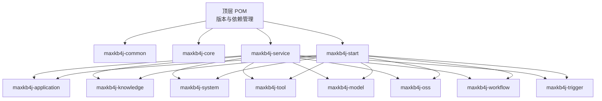
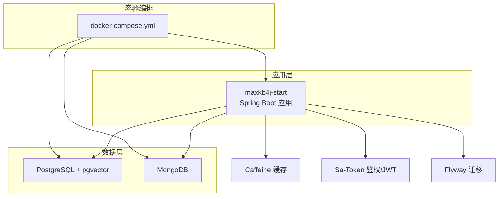
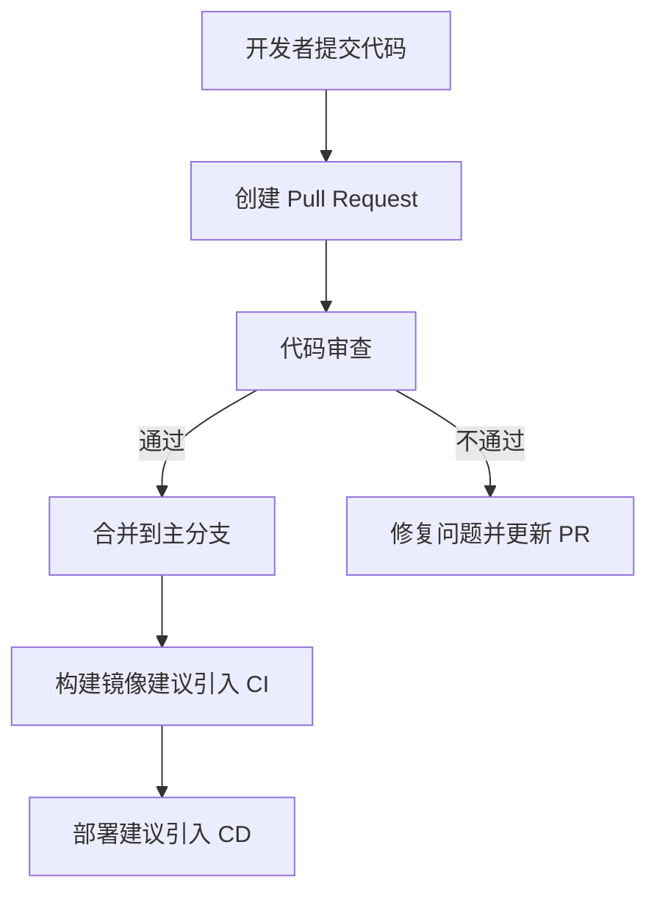
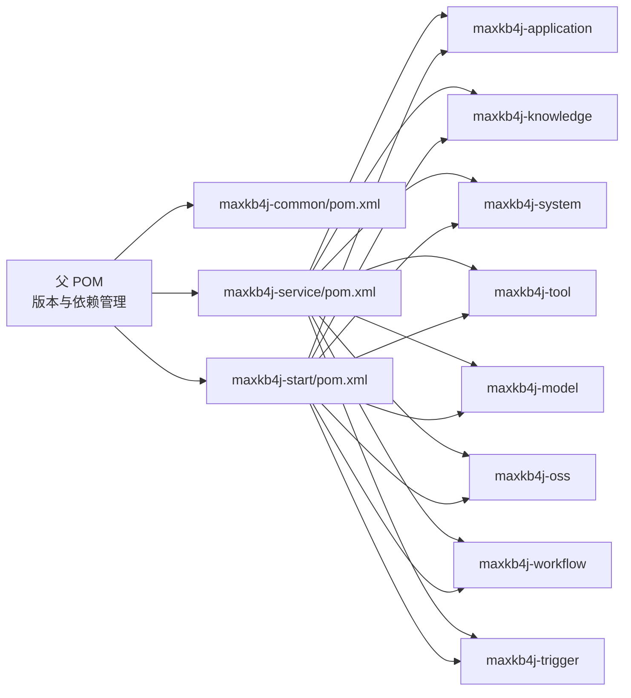

# 贡献流程

<cite>
**本文引用的文件**
- [README_CN.md](file://README_CN.md)
- [README.md](file://README.md)
- [pom.xml](file://pom.xml)
- [.gitignore](file://.gitignore)
- [docker-compose.yml](file://docker-compose.yml)
- [maxkb4j-start/Dockerfile](file://maxkb4j-start/Dockerfile)
- [maxkb4j-start/src/main/resources/application.yml](file://maxkb4j-start/src/main/resources/application.yml)
- [maxkb4j-service/pom.xml](file://maxkb4j-service/pom.xml)
- [maxkb4j-common/pom.xml](file://maxkb4j-common/pom.xml)
- [maxkb4j-start/pom.xml](file://maxkb4j-start/pom.xml)
- [maxkb4j-common/src/main/java/com/maxkb4j/common/constant/AppConst.java](file://maxkb4j-common/src/main/java/com/maxkb4j/common/constant/AppConst.java)
- [maxkb4j-common/src/main/java/com/maxkb4j/common/util/BeanUtil.java](file://maxkb4j-common/src/main/java/com/maxkb4j/common/util/BeanUtil.java)
- [maxkb4j-common/src/main/java/com/maxkb4j/common/exception/ApiException.java](file://maxkb4j-common/src/main/java/com/maxkb4j/common/exception/ApiException.java)
</cite>

## 目录
1. [简介](#简介)
2. [项目结构](#项目结构)
3. [核心组件](#核心组件)
4. [架构总览](#架构总览)
5. [详细组件分析](#详细组件分析)
6. [依赖分析](#依赖分析)
7. [性能考虑](#性能考虑)
8. [故障排查指南](#故障排查指南)
9. [结论](#结论)
10. [附录](#附录)

## 简介
本指南面向希望为 MaxKB4j 贡献代码与文档的社区成员，覆盖 GitHub 协作流程（Fork、分支、提交、PR）、代码审查标准与合并要求、持续集成与部署现状、提交信息规范、分支命名约定、标签管理策略、问题报告与功能请求流程、社区交流规范以及许可证与版权要求。  
MaxKB4j 是一个基于 Java 21 + Spring Boot 3 的企业级智能问答系统，采用多模块 Maven 结构，提供 RAG + LLM 工作流引擎能力，并支持多种模型与工具集成。

章节来源
- [README_CN.md:120-129](file://README_CN.md#L120-L129)
- [README.md:120-129](file://README.md#L120-L129)

## 项目结构
MaxKB4j 采用多模块 Maven 结构，顶层 POM 管理版本与依赖，各功能域拆分为独立模块，便于团队协作与边界清晰。典型模块包括：
- maxkb4j-common：通用工具、常量、异常、类型处理器等
- maxkb4j-core：核心能力（助手、事件、拦截器、工具等）
- maxkb4j-service：服务聚合模块，聚合各业务子模块
- maxkb4j-service-api：各业务领域的 API 定义与实体
- maxkb4j-application、maxkb4j-knowledge、maxkb4j-system、maxkb4j-tool、maxkb4j-model、maxkb4j-oss、maxkb4j-workflow、maxkb4j-trigger：具体业务模块
- maxkb4j-start：打包与启动模块，整合各子模块并提供 Docker 镜像与部署配置

图表来源
- [pom.xml:57-63](file://pom.xml#L57-L63)
- [maxkb4j-service/pom.xml:15-25](file://maxkb4j-service/pom.xml#L15-L25)
- [maxkb4j-start/pom.xml:15-60](file://maxkb4j-start/pom.xml#L15-L60)

章节来源
- [pom.xml:19-56](file://pom.xml#L19-L56)
- [maxkb4j-service/pom.xml:1-97](file://maxkb4j-service/pom.xml#L1-L97)
- [maxkb4j-common/pom.xml:1-103](file://maxkb4j-common/pom.xml#L1-L103)
- [maxkb4j-start/pom.xml:1-85](file://maxkb4j-start/pom.xml#L1-L85)

## 核心组件
- 通用常量与工具：AppConst 提供 API 前缀与默认工作空间标识；BeanUtil 提供 Bean 拷贝、列表复制、对象转 Map 等常用工具；ApiException 作为统一异常基类，便于集中处理错误。
- 配置与部署：application.yml 定义服务端口、缓存、Flyway 初始化、Sa-Token JWT 等；Dockerfile 与 docker-compose.yml 提供容器化部署与依赖服务编排。

章节来源
- [maxkb4j-common/src/main/java/com/maxkb4j/common/constant/AppConst.java:1-13](file://maxkb4j-common/src/main/java/com/maxkb4j/common/constant/AppConst.java#L1-L13)
- [maxkb4j-common/src/main/java/com/maxkb4j/common/util/BeanUtil.java:1-122](file://maxkb4j-common/src/main/java/com/maxkb4j/common/util/BeanUtil.java#L1-L122)
- [maxkb4j-common/src/main/java/com/maxkb4j/common/exception/ApiException.java:1-30](file://maxkb4j-common/src/main/java/com/maxkb4j/common/exception/ApiException.java#L1-L30)
- [maxkb4j-start/src/main/resources/application.yml:1-69](file://maxkb4j-start/src/main/resources/application.yml#L1-L69)
- [maxkb4j-start/Dockerfile:1-27](file://maxkb4j-start/Dockerfile#L1-L27)
- [docker-compose.yml:1-58](file://docker-compose.yml#L1-L58)

## 架构总览
MaxKB4j 的部署架构围绕 Spring Boot 应用展开，配合 PostgreSQL（含 pgvector 扩展）与 MongoDB，通过 Flyway 进行数据库迁移，使用 Caffeine 作为本地缓存，Sa-Token 实现鉴权与 JWT 签发。Docker Compose 将数据库与应用容器编排，应用启动后延迟等待数据库就绪再启动服务。

图表来源
- [maxkb4j-start/src/main/resources/application.yml:19-69](file://maxkb4j-start/src/main/resources/application.yml#L19-L69)
- [docker-compose.yml:1-58](file://docker-compose.yml#L1-L58)
- [maxkb4j-start/Dockerfile:1-27](file://maxkb4j-start/Dockerfile#L1-L27)

## 详细组件分析

### 贡献协作流程（GitHub）
- Fork 项目：在 GitHub 上 Fork 主仓库至个人账户
- 创建分支：基于主分支创建功能/修复分支，遵循分支命名约定
- 提交代码：保持一次提交聚焦一个改动点，提交信息清晰
- 推送分支：推送至个人 Fork 的对应分支
- 发起 PR：在主仓库创建 Pull Request，填写模板信息，等待审查与 CI 检查

章节来源
- [README_CN.md:120-129](file://README_CN.md#L120-L129)
- [README.md:120-129](file://README.md#L120-L129)

### 代码审查流程与合并要求
- 审查标准：遵循阿里巴巴 Java 编码规范；新增功能需配套单元测试；文档同步更新
- 反馈处理：根据 Reviewer 意见逐项修改，必要时补充测试与说明
- 合并要求：至少一名维护者批准；无冲突；CI 通过；文档与变更一致

章节来源
- [README_CN.md:127-129](file://README_CN.md#L127-L129)
- [README.md:127-129](file://README.md#L127-L129)

### 持续集成与部署现状
- 当前仓库未发现标准 CI/CD 配置文件（如 GitHub Actions、GitLab CI 等），因此暂无自动化测试与构建产物发布流水线
- 项目提供 Dockerfile 与 docker-compose.yml，可用于本地与生产环境容器化部署
- 建议后续引入 CI/CD 流水线，包含：代码风格检查、单元测试、打包、镜像构建与推送、部署验证

图表来源
- [maxkb4j-start/Dockerfile:1-27](file://maxkb4j-start/Dockerfile#L1-L27)
- [docker-compose.yml:1-58](file://docker-compose.yml#L1-L58)

章节来源
- [maxkb4j-start/Dockerfile:1-27](file://maxkb4j-start/Dockerfile#L1-L27)
- [docker-compose.yml:1-58](file://docker-compose.yml#L1-L58)

### 提交信息规范、分支命名约定与标签策略
- 提交信息规范（建议）：类型: 概述；正文: 背景/动机；脚注: 关联 Issue/PR
- 分支命名约定（建议）：feat/xxx、fix/xxx、docs/xxx、style/xxx、refactor/xxx、test/xxx、chore/xxx
- 标签管理策略（建议）：enhancement、bug、documentation、breaking-change、wip、review-needed

说明：以上为通用最佳实践建议，当前仓库未发现明确的提交与分支命名规范文件。

### 问题报告与功能请求流程
- 问题报告：在 Issues 中按模板填写，包含环境信息、复现步骤、期望与实际结果
- 功能请求：描述背景、目标、影响范围与验收标准
- 社区交流：遵循友好、尊重的交流规范，避免人身攻击与无关讨论

章节来源
- [README_CN.md:120-129](file://README_CN.md#L120-L129)
- [README.md:120-129](file://README.md#L120-L129)

### 社区交流规范
- 尊重与包容：禁止歧视、骚扰与攻击性言论
- 技术讨论：基于事实与证据，提供可验证的信息
- 避免剧透：不泄露敏感信息或未公开漏洞细节
- 遵守法律法规：不传播违法不良信息

说明：以上为通用社区准则建议，当前仓库未发现专门的社区行为准则文件。

### 法律与合规要求
- 许可证：项目采用 GPLv3 许可证，使用、修改与分发需遵循该许可证条款
- 版权声明：保留项目版权信息
- 贡献者需确保对所提交内容拥有合法权利，不侵犯第三方权益

章节来源
- [README_CN.md:161-170](file://README_CN.md#L161-L170)
- [README.md:161-170](file://README.md#L161-L170)

## 依赖分析
顶层 POM 管理版本与依赖，子模块通过父 POM 继承依赖管理，避免版本冲突；maxkb4j-start 聚合各业务模块并引入 Flyway 用于数据库迁移。

图表来源
- [pom.xml:57-63](file://pom.xml#L57-L63)
- [maxkb4j-service/pom.xml:15-25](file://maxkb4j-service/pom.xml#L15-L25)
- [maxkb4j-start/pom.xml:15-60](file://maxkb4j-start/pom.xml#L15-L60)

章节来源
- [pom.xml:19-56](file://pom.xml#L19-L56)
- [maxkb4j-service/pom.xml:1-97](file://maxkb4j-service/pom.xml#L1-L97)
- [maxkb4j-start/pom.xml:1-85](file://maxkb4j-start/pom.xml#L1-L85)

## 性能考虑
- 并发与响应：项目基于 Java 21 + Spring Boot 3 + 虚拟线程与响应式模型，具备高并发与低延迟潜力
- 缓存策略：内置 Caffeine 多级缓存，加速知识检索与模型调用链路
- 数据库与索引：PostgreSQL + pgvector 提供向量检索能力，建议合理配置索引与查询策略
- 部署建议：使用 Docker Compose 编排，按需调整资源限制与副本数

说明：以上为项目技术栈与配置带来的性能特征总结，具体性能表现取决于业务负载与硬件资源。

## 故障排查指南
- 启动失败：检查数据库连接参数、端口占用与容器日志；确认 Flyway 迁移是否成功
- 权限与鉴权：核对 Sa-Token JWT 密钥与超时配置；确认登录凭据正确
- 文件上传与大小限制：检查 multipart 最大文件与请求大小配置
- 依赖服务：确认 PostgreSQL 与 MongoDB 已启动并可通过容器网络访问

章节来源
- [maxkb4j-start/src/main/resources/application.yml:19-69](file://maxkb4j-start/src/main/resources/application.yml#L19-L69)
- [docker-compose.yml:1-58](file://docker-compose.yml#L1-L58)

## 结论
MaxKB4j 提供了清晰的多模块结构与容器化部署能力，建议在现有基础上引入标准化的 CI/CD 流水线、明确的提交与分支命名规范、问题与功能请求模板，以及社区行为准则，以进一步提升协作效率与质量稳定性。贡献者在遵循 GPLv3 许可证与版权要求的前提下，可按本指南完成从 Fork 到 PR 的全流程贡献。

## 附录
- 快速开始与部署参考：见项目根目录 README 与 docker-compose.yml
- 通用工具与常量：见 maxkb4j-common 模块中的工具类与常量定义
- 顶层版本与依赖：见顶层 pom.xml 的版本与依赖管理

章节来源
- [README_CN.md:50-98](file://README_CN.md#L50-L98)
- [README.md:49-98](file://README.md#L49-L98)
- [docker-compose.yml:1-58](file://docker-compose.yml#L1-L58)
- [maxkb4j-common/src/main/java/com/maxkb4j/common/constant/AppConst.java:1-13](file://maxkb4j-common/src/main/java/com/maxkb4j/common/constant/AppConst.java#L1-L13)
- [maxkb4j-common/src/main/java/com/maxkb4j/common/util/BeanUtil.java:1-122](file://maxkb4j-common/src/main/java/com/maxkb4j/common/util/BeanUtil.java#L1-L122)
- [maxkb4j-common/src/main/java/com/maxkb4j/common/exception/ApiException.java:1-30](file://maxkb4j-common/src/main/java/com/maxkb4j/common/exception/ApiException.java#L1-L30)
- [pom.xml:19-56](file://pom.xml#L19-L56)