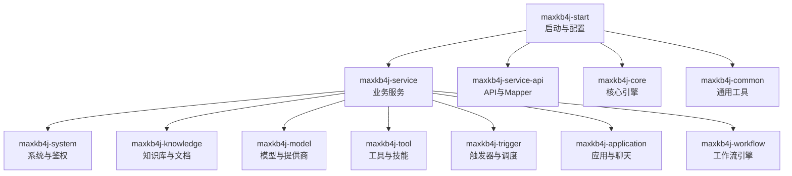
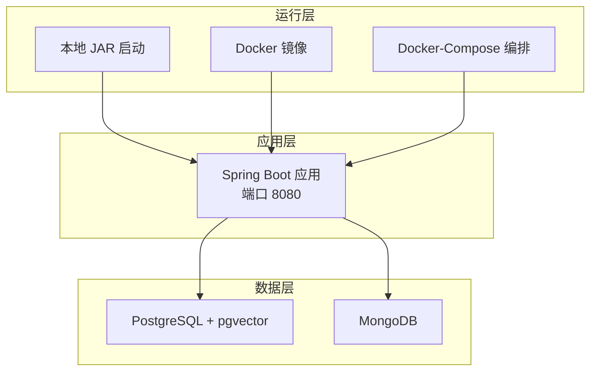
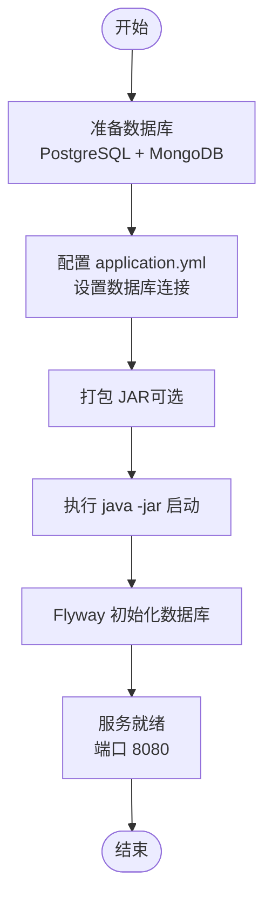
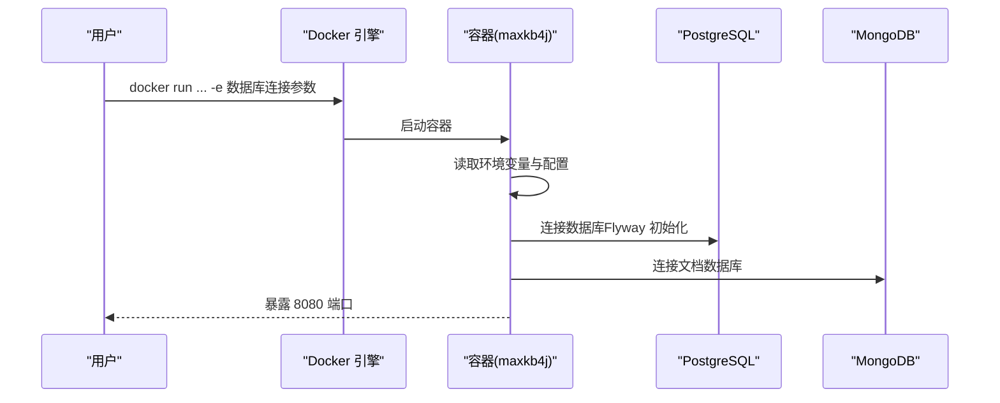
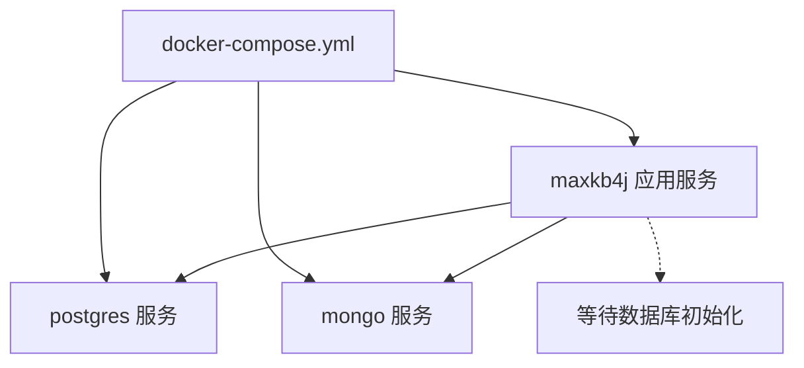
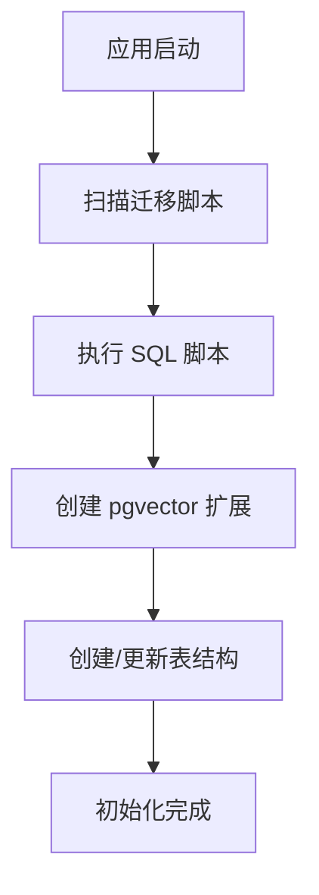
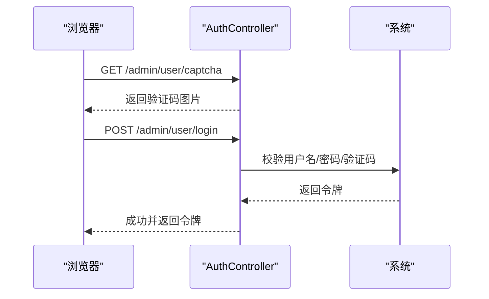
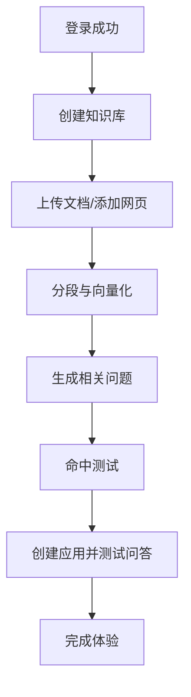
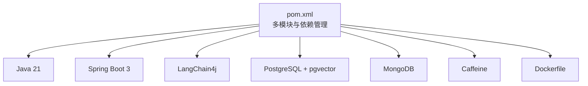

# 快速开始

<cite>
**本文引用的文件**
- [README_CN.md](file://README_CN.md)
- [pom.xml](file://pom.xml)
- [application.yml](file://maxkb4j-start/src/main/resources/application.yml)
- [application-dev.yml](file://maxkb4j-start/src/main/resources/application-dev.yml)
- [application-prod.yml](file://maxkb4j-start/src/main/resources/application-prod.yml)
- [docker-compose.yml](file://docker-compose.yml)
- [Dockerfile](file://maxkb4j-start/Dockerfile)
- [MaxKb4jApplication.java](file://maxkb4j-start/src/main/java/com/maxkb4j/start/MaxKb4jApplication.java)
- [V1__init_tables.sql](file://maxkb4j-start/src/main/resources/db/migration/V1__init_tables.sql)
- [AuthController.java](file://maxkb4j-service/maxkb4j-system/src/main/java/com/maxkb4j/system/controller/AuthController.java)
- [KnowledgeController.java](file://maxkb4j-service/maxkb4j-knowledge/src/main/java/com/maxkb4j/knowledge/controller/KnowledgeController.java)
- [DocumentController.java](file://maxkb4j-service/maxkb4j-knowledge/src/main/java/com/maxkb4j/knowledge/controller/DocumentController.java)
</cite>

## 目录
1. [简介](#简介)
2. [项目结构](#项目结构)
3. [核心组件](#核心组件)
4. [架构概览](#架构概览)
5. [详细组件分析](#详细组件分析)
6. [依赖分析](#依赖分析)
7. [性能考虑](#性能考虑)
8. [故障排除指南](#故障排除指南)
9. [结论](#结论)
10. [附录](#附录)

## 简介
本指南面向首次接触 MaxKB4j 的用户，帮助你在最短时间内完成系统部署与基础使用。你将学到：
- 系统环境要求（Java 21+、PostgreSQL 12+、MongoDB 6.0+）
- 三种部署方式：本地 JAR 启动、Docker 部署、Docker-Compose 部署
- 数据库初始化流程与默认账号密码
- Web 界面访问方式与首次登录后的基础配置（创建知识库、上传文档、测试问答）

目标是在 30 分钟内完成从零到一的完整体验。

## 项目结构
MaxKB4j 采用多模块 Maven 结构，核心模块包括：
- maxkb4j-start：Spring Boot 启动模块，包含配置、Flyway 初始化脚本与 Dockerfile
- maxkb4j-service：业务服务层，覆盖系统、知识库、模型、工具、触发器等子模块
- maxkb4j-service-api：各服务的数据传输对象与 Mapper
- maxkb4j-core：核心算法与工作流引擎
- maxkb4j-common：通用常量、工具类、类型处理器与缓存

**图表来源**
- [pom.xml:57-62](file://pom.xml#L57-L62)

**章节来源**
- [pom.xml:57-62](file://pom.xml#L57-L62)

## 核心组件
- 启动入口：Spring Boot 应用入口负责激活 dev 配置文件并启动服务
- 配置中心：application.yml 控制端口、缓存、Flyway 迁移路径与默认管理员账号
- 数据库初始化：Flyway 自动执行 db/migration 下的 SQL 脚本
- 鉴权与登录：基于 Sa-Token 的登录接口与验证码
- 知识库与文档：提供创建知识库、上传文档、向量化、问题生成、命中测试等能力

**章节来源**
- [MaxKb4jApplication.java:14-20](file://maxkb4j-start/src/main/java/com/maxkb4j/start/MaxKb4jApplication.java#L14-L20)
- [application.yml:1-69](file://maxkb4j-start/src/main/resources/application.yml#L1-L69)
- [V1__init_tables.sql:1-200](file://maxkb4j-start/src/main/resources/db/migration/V1__init_tables.sql#L1-L200)
- [AuthController.java:50-58](file://maxkb4j-service/maxkb4j-system/src/main/java/com/maxkb4j/system/controller/AuthController.java#L50-L58)

## 架构概览
MaxKB4j 的部署与运行涉及三个层面：
- 应用层：Spring Boot 应用监听 8080 端口，提供 REST API 与后台管理界面
- 数据层：PostgreSQL（启用 pgvector 扩展）存储结构化数据；MongoDB 存储文档与全文索引
- 运行层：支持本地 JAR、Docker、Docker-Compose 三种部署方式

**图表来源**
- [application.yml:1-25](file://maxkb4j-start/src/main/resources/application.yml#L1-L25)
- [docker-compose.yml:27-56](file://docker-compose.yml#L27-L56)
- [Dockerfile:1-27](file://maxkb4j-start/Dockerfile#L1-L27)

## 详细组件分析

### 环境要求与准备
- Java：21+
- PostgreSQL：12+（需启用 pgvector 扩展）
- MongoDB：6.0+（可选，用于全文检索）
- 端口：8080（默认）

**章节来源**
- [README_CN.md:52-56](file://README_CN.md#L52-L56)

### 部署方式一：本地 JAR 启动
- 步骤
  1) 准备数据库：安装 PostgreSQL 与 MongoDB，并确保端口可用
  2) 修改配置：在 application.yml 中设置正确的数据库连接参数
  3) 启动应用：执行 java -jar maxkb4j-start.jar
  4) 访问界面：浏览器打开 http://localhost:8080/admin/login

**图表来源**
- [application.yml:1-69](file://maxkb4j-start/src/main/resources/application.yml#L1-L69)
- [MaxKb4jApplication.java:14-20](file://maxkb4j-start/src/main/java/com/maxkb4j/start/MaxKb4jApplication.java#L14-L20)

**章节来源**
- [README_CN.md:59-63](file://README_CN.md#L59-L63)
- [application-dev.yml:1-11](file://maxkb4j-start/src/main/resources/application-dev.yml#L1-L11)

### 部署方式二：Docker 部署
- 步骤
  1) 拉取镜像：docker pull registry.cn-hangzhou.aliyuncs.com/tarzanx/maxkb4j
  2) 设置数据库连接参数：SPRING_DATASOURCE_URL、SPRING_DATASOURCE_USERNAME、SPRING_DATASOURCE_PASSWORD、SPRING_DATA_MONGODB_URI
  3) 运行容器：docker run --name maxkb4j -d --restart always -p 8080:8080 -e ... registry.cn-hangzhou.aliyuncs.com/tarzanx/maxkb4j

**图表来源**
- [README_CN.md:65-71](file://README_CN.md#L65-L71)
- [docker-compose.yml:44-48](file://docker-compose.yml#L44-L48)

**章节来源**
- [README_CN.md:65-71](file://README_CN.md#L65-L71)

### 部署方式三：Docker-Compose 部署（推荐）
- 步骤
  1) 准备 docker-compose.yml（项目根目录）
  2) 执行 docker-compose up -d 启动
  3) 等待容器初始化（含数据库初始化与应用启动）

**图表来源**
- [docker-compose.yml:1-58](file://docker-compose.yml#L1-L58)

**章节来源**
- [README_CN.md:73-77](file://README_CN.md#L73-L77)
- [docker-compose.yml:1-58](file://docker-compose.yml#L1-L58)

### 数据库初始化流程
- Flyway 自动迁移：应用启动时扫描 classpath:db/migration 下的 SQL 文件并执行
- 关键表：system_setting、user、application、document、paragraph 等
- pgvector 扩展：在初始化脚本中创建，用于向量相似度检索

**图表来源**
- [application.yml:21-25](file://maxkb4j-start/src/main/resources/application.yml#L21-L25)
- [V1__init_tables.sql:1-200](file://maxkb4j-start/src/main/resources/db/migration/V1__init_tables.sql#L1-L200)

**章节来源**
- [application.yml:21-25](file://maxkb4j-start/src/main/resources/application.yml#L21-L25)
- [V1__init_tables.sql:1-200](file://maxkb4j-start/src/main/resources/db/migration/V1__init_tables.sql#L1-L200)

### 默认账号与登录
- 登录地址：http://localhost:8080/admin/login
- 默认账号：admin
- 默认密码：tarzan@123456
- 验证码：登录接口提供图形验证码生成

**图表来源**
- [AuthController.java:50-64](file://maxkb4j-service/maxkb4j-system/src/main/java/com/maxkb4j/system/controller/AuthController.java#L50-L64)

**章节来源**
- [README_CN.md:92-96](file://README_CN.md#L92-L96)
- [application.yml:67-69](file://maxkb4j-start/src/main/resources/application.yml#L67-L69)
- [AuthController.java:50-64](file://maxkb4j-service/maxkb4j-system/src/main/java/com/maxkb4j/system/controller/AuthController.java#L50-L64)

### 首次登录后的基础配置（30 分钟体验清单）
- 创建第一个知识库
  - 进入“知识库”页面，点击“创建知识库”
  - 选择类型：本地文档、网页爬取或工作流
- 上传文档
  - 在知识库详情页上传 PDF/Word/TXT/Markdown 等文件
  - 或添加网页链接进行采集
- 文档分段与向量化
  - 对上传的文档进行分段与向量化，以便后续检索
- 生成相关问题
  - 自动生成与文档相关的问答对，提升检索效果
- 命中测试
  - 使用“命中测试”验证检索效果
- 创建应用并测试问答
  - 在“应用”中创建一个应用，配置提示词与模型
  - 在聊天窗口输入问题，验证回答质量

**章节来源**
- [KnowledgeController.java:52-76](file://maxkb4j-service/maxkb4j-knowledge/src/main/java/com/maxkb4j/knowledge/controller/KnowledgeController.java#L52-L76)
- [DocumentController.java:34-75](file://maxkb4j-service/maxkb4j-knowledge/src/main/java/com/maxkb4j/knowledge/controller/DocumentController.java#L34-L75)

## 依赖分析
- 运行时依赖
  - Java 21、Spring Boot 3、Sa-Token（鉴权）
  - LangChain4j（AI 框架）
  - PostgreSQL 15 + pgvector（向量检索）
  - MongoDB（全文检索）
  - Caffeine（缓存）
- 构建与打包
  - Maven 多模块聚合构建
  - Spring Boot Maven 插件打包
  - Dockerfile 基于 Amazon Corretto 21

**图表来源**
- [pom.xml:19-60](file://pom.xml#L19-L60)
- [Dockerfile:1-27](file://maxkb4j-start/Dockerfile#L1-L27)

**章节来源**
- [pom.xml:19-60](file://pom.xml#L19-L60)
- [Dockerfile:1-27](file://maxkb4j-start/Dockerfile#L1-L27)

## 性能考虑
- 基于 Java 21 与虚拟线程（Project Loom）的高并发模型
- 响应式编程与异步非阻塞 I/O，降低延迟
- 多级缓存（Caffeine）加速检索与模型调用
- 向量检索（pgvector）与全文检索（MongoDB）组合提升召回质量

[本节为通用性能建议，不直接分析具体文件]

## 故障排除指南
- 端口冲突
  - 现象：应用无法启动或端口占用
  - 处理：修改 application.yml 中 server.port 或释放 8080 端口
- 数据库连接失败
  - 现象：启动时报数据库连接异常
  - 处理：检查 SPRING_DATASOURCE_URL、SPRING_DATASOURCE_USERNAME、SPRING_DATASOURCE_PASSWORD 与 SPRING_DATA_MONGODB_URI
- Flyway 初始化失败
  - 现象：数据库表未创建或迁移失败
  - 处理：确认 PostgreSQL 已启用 pgvector 扩展，检查迁移脚本权限
- 登录验证码错误
  - 现象：登录时验证码不匹配
  - 处理：重新获取验证码并正确填写

**章节来源**
- [application.yml:1-25](file://maxkb4j-start/src/main/resources/application.yml#L1-L25)
- [docker-compose.yml:44-48](file://docker-compose.yml#L44-L48)
- [V1__init_tables.sql:1-200](file://maxkb4j-start/src/main/resources/db/migration/V1__init_tables.sql#L1-L200)
- [AuthController.java:55-64](file://maxkb4j-service/maxkb4j-system/src/main/java/com/maxkb4j/system/controller/AuthController.java#L55-L64)

## 结论
通过本快速开始指南，你已经完成了 MaxKB4j 的环境准备、三种部署方式的实践、数据库初始化以及首次登录后的基础配置。现在你可以继续探索更高级的功能，如模型对接、工作流编排、工具集成与触发器自动化。

[本节为总结性内容，不直接分析具体文件]

## 附录

### 访问与默认凭据
- Web 界面：http://localhost:8080/admin/login
- 默认账号：admin
- 默认密码：tarzan@123456

**章节来源**
- [README_CN.md:92-96](file://README_CN.md#L92-L96)
- [application.yml:67-69](file://maxkb4j-start/src/main/resources/application.yml#L67-L69)

### 关键配置参考
- 端口与缓存：server.port、spring.cache.type
- 数据库连接：spring.datasource.*、spring.data.mongodb.uri
- Flyway 迁移：spring.flyway.locations
- 默认管理员：system.default-username、system.default-password

**章节来源**
- [application.yml:1-69](file://maxkb4j-start/src/main/resources/application.yml#L1-L69)
- [application-dev.yml:1-11](file://maxkb4j-start/src/main/resources/application-dev.yml#L1-L11)
- [application-prod.yml:1-9](file://maxkb4j-start/src/main/resources/application-prod.yml#L1-L9)