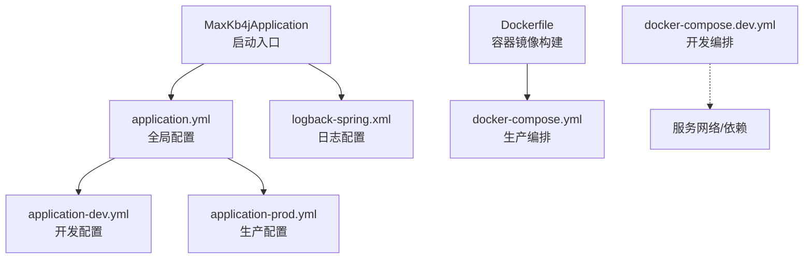
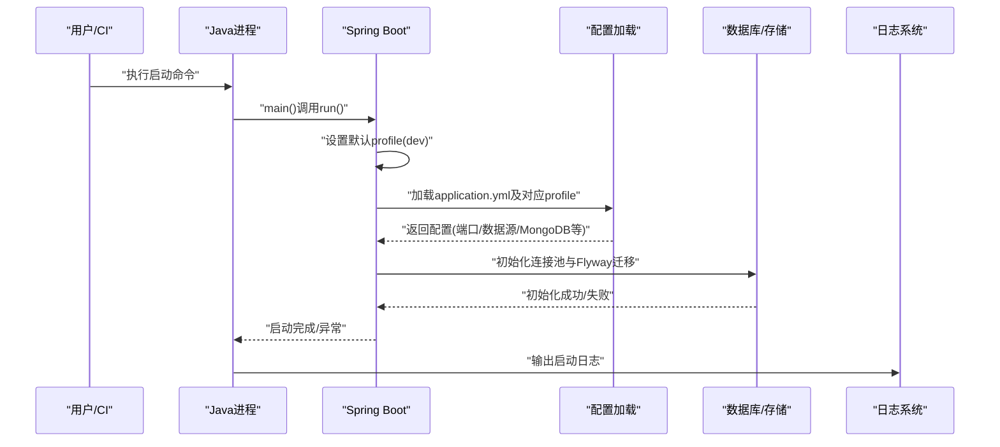
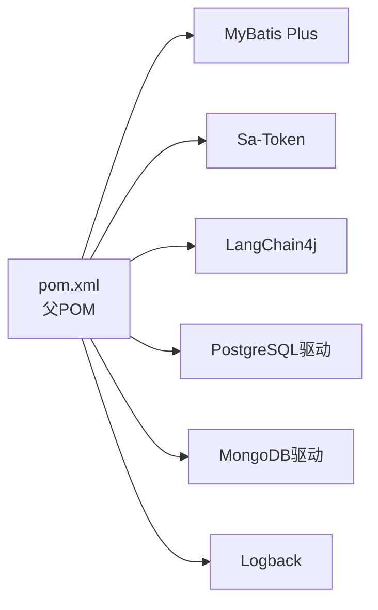
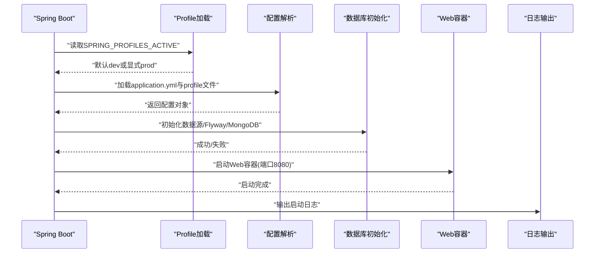

# 启动问题排查

<cite>
**本文引用的文件**   
- [MaxKb4jApplication.java](file://maxkb4j-start/src/main/java/com/maxkb4j/start/MaxKb4jApplication.java)
- [application.yml](file://maxkb4j-start/src/main/resources/application.yml)
- [application-dev.yml](file://maxkb4j-start/src/main/resources/application-dev.yml)
- [application-prod.yml](file://maxkb4j-start/src/main/resources/application-prod.yml)
- [logback-spring.xml](file://maxkb4j-start/src/main/resources/logback-spring.xml)
- [Dockerfile](file://maxkb4j-start/Dockerfile)
- [docker-compose.yml](file://docker-compose.yml)
- [docker-compose.dev.yml](file://docker-compose.dev.yml)
- [pom.xml](file://pom.xml)
</cite>

## 目录
1. [简介](#简介)
2. [项目结构](#项目结构)
3. [核心组件](#核心组件)
4. [架构总览](#架构总览)
5. [详细组件分析](#详细组件分析)
6. [依赖分析](#依赖分析)
7. [性能考虑](#性能考虑)
8. [故障排查指南](#故障排查指南)
9. [结论](#结论)
10. [附录](#附录)

## 简介
本指南面向MaxKB4j在不同环境（开发、测试、生产）中的启动问题排查，覆盖端口占用、配置文件错误、依赖缺失、JVM参数问题、数据库与存储连接初始化失败、启动超时与内存不足、Docker容器启动诊断以及启动脚本与环境变量验证方法。文档基于仓库中实际存在的启动入口、配置与日志配置进行分析，并提供可视化图示帮助快速定位问题。

## 项目结构
MaxKB4j采用多模块Maven工程，启动入口位于maxkb4j-start模块，核心配置与日志配置位于该模块的资源目录；Docker与Compose用于容器化部署。

图表来源
- [MaxKb4jApplication.java:14-20](file://maxkb4j-start/src/main/java/com/maxkb4j/start/MaxKb4jApplication.java#L14-L20)
- [application.yml:1-69](file://maxkb4j-start/src/main/resources/application.yml#L1-L69)
- [application-dev.yml:1-11](file://maxkb4j-start/src/main/resources/application-dev.yml#L1-L11)
- [application-prod.yml:1-9](file://maxkb4j-start/src/main/resources/application-prod.yml#L1-L9)
- [logback-spring.xml:111-139](file://maxkb4j-start/src/main/resources/logback-spring.xml#L111-L139)
- [Dockerfile:1-27](file://maxkb4j-start/Dockerfile#L1-L27)
- [docker-compose.yml:1-58](file://docker-compose.yml#L1-L58)
- [docker-compose.dev.yml:1-28](file://docker-compose.dev.yml#L1-L28)

章节来源
- [MaxKb4jApplication.java:14-20](file://maxkb4j-start/src/main/java/com/maxkb4j/start/MaxKb4jApplication.java#L14-L20)
- [application.yml:1-69](file://maxkb4j-start/src/main/resources/application.yml#L1-L69)
- [application-dev.yml:1-11](file://maxkb4j-start/src/main/resources/application-dev.yml#L1-L11)
- [application-prod.yml:1-9](file://maxkb4j-start/src/main/resources/application-prod.yml#L1-L9)
- [logback-spring.xml:111-139](file://maxkb4j-start/src/main/resources/logback-spring.xml#L111-L139)
- [Dockerfile:1-27](file://maxkb4j-start/Dockerfile#L1-L27)
- [docker-compose.yml:1-58](file://docker-compose.yml#L1-L58)
- [docker-compose.dev.yml:1-28](file://docker-compose.dev.yml#L1-L28)

## 核心组件
- 启动入口类负责设置默认活动profile并启动Spring Boot应用。
- 全局配置文件定义服务器端口、缓存类型、MyBatis Plus、Sa-Token、Flyway迁移等。
- 开发/生产配置文件分别覆盖数据源与MongoDB连接信息。
- 日志配置按环境输出到控制台与异步滚动文件，并对关键组件设置日志级别。
- Dockerfile与Compose用于本地或远程容器化部署，包含端口暴露、环境变量注入与健康依赖等待。

章节来源
- [MaxKb4jApplication.java:14-20](file://maxkb4j-start/src/main/java/com/maxkb4j/start/MaxKb4jApplication.java#L14-L20)
- [application.yml:1-69](file://maxkb4j-start/src/main/resources/application.yml#L1-L69)
- [application-dev.yml:1-11](file://maxkb4j-start/src/main/resources/application-dev.yml#L1-L11)
- [application-prod.yml:1-9](file://maxkb4j-start/src/main/resources/application-prod.yml#L1-L9)
- [logback-spring.xml:111-139](file://maxkb4j-start/src/main/resources/logback-spring.xml#L111-L139)
- [Dockerfile:19-25](file://maxkb4j-start/Dockerfile#L19-L25)
- [docker-compose.yml:27-56](file://docker-compose.yml#L27-L56)

## 架构总览
MaxKB4j启动涉及以下关键路径：启动入口 -> Spring Profile选择 -> 加载配置 -> 初始化数据库与缓存 -> 启动Web容器 -> 输出日志。

图表来源
- [MaxKb4jApplication.java:14-20](file://maxkb4j-start/src/main/java/com/maxkb4j/start/MaxKb4jApplication.java#L14-L20)
- [application.yml:1-69](file://maxkb4j-start/src/main/resources/application.yml#L1-L69)
- [logback-spring.xml:111-139](file://maxkb4j-start/src/main/resources/logback-spring.xml#L111-L139)

## 详细组件分析

### 启动入口与Profile策略
- 启动入口会在未显式设置活动profile时，默认启用dev环境，确保开发场景下能直接启动。
- 建议在生产环境显式设置活动profile，避免默认行为导致的配置偏差。

章节来源
- [MaxKb4jApplication.java:14-20](file://maxkb4j-start/src/main/java/com/maxkb4j/start/MaxKb4jApplication.java#L14-L20)

### 配置文件与关键项
- 服务器端口默认8080，可通过环境变量或命令行覆盖。
- 数据源与MongoDB连接在各profile中定义，需确保与实际后端一致。
- Flyway迁移开启，迁移脚本位于classpath:db/migration。
- Sa-Token JWT密钥支持从环境变量注入，建议在生产环境强制设置。
- MyBatis Plus Mapper与TypeHandlers扫描路径已配置。

章节来源
- [application.yml:1-69](file://maxkb4j-start/src/main/resources/application.yml#L1-L69)
- [application-dev.yml:1-11](file://maxkb4j-start/src/main/resources/application-dev.yml#L1-L11)
- [application-prod.yml:1-9](file://maxkb4j-start/src/main/resources/application-prod.yml#L1-L9)

### 日志系统与级别
- 开发/生产环境均输出到控制台与异步文件，INFO及以上级别分档落盘。
- 对Spring、MyBatis、Hikari、LangChain4j、MongoDB等组件设置适当日志级别，便于定位问题。

章节来源
- [logback-spring.xml:111-139](file://maxkb4j-start/src/main/resources/logback-spring.xml#L111-L139)
- [logback-spring.xml:141-157](file://maxkb4j-start/src/main/resources/logback-spring.xml#L141-L157)

### 容器化与编排
- Dockerfile基于Amazon Corretto 21，暴露8080端口，使用UTF-8编码启动。
- docker-compose.yml定义了PostgreSQL、MongoDB与应用服务，应用服务依赖数据库启动，且通过环境变量注入连接信息。
- docker-compose.dev.yml提供开发环境的数据库服务编排，便于本地联调。

章节来源
- [Dockerfile:1-27](file://maxkb4j-start/Dockerfile#L1-L27)
- [docker-compose.yml:1-58](file://docker-compose.yml#L1-L58)
- [docker-compose.dev.yml:1-28](file://docker-compose.dev.yml#L1-L28)

## 依赖分析
- 项目基于Spring Boot 3.5.1与Java 21，使用MyBatis Plus、Sa-Token、LangChain4j等生态组件。
- 数据库驱动与pgvector、MongoDB驱动在父POM中统一管理。
- 日志系统采用Logback，结合异步Appender提升性能。

图表来源
- [pom.xml:64-493](file://pom.xml#L64-L493)

章节来源
- [pom.xml:64-493](file://pom.xml#L64-L493)

## 性能考虑
- 异步日志与滚动文件有助于降低I/O阻塞，建议在高并发场景下保持异步配置。
- Hikari连接池与数据库迁移在启动阶段执行，建议合理设置连接数与迁移脚本复杂度。
- JVM参数（如堆大小、GC策略）应在容器或宿主机层面优化，避免频繁Full GC导致启动卡顿。

## 故障排查指南

### 一、启动失败：端口占用
- 现象：启动报错显示端口被占用或无法绑定。
- 排查要点：
  - 检查application.yml中的server.port是否被其他进程占用。
  - 临时修改端口或释放占用进程。
  - 在容器环境中确认EXPOSE与映射端口一致。
- 相关配置参考
  - [application.yml:1-69](file://maxkb4j-start/src/main/resources/application.yml#L1-L69)
  - [Dockerfile:19-25](file://maxkb4j-start/Dockerfile#L19-L25)

章节来源
- [application.yml:1-69](file://maxkb4j-start/src/main/resources/application.yml#L1-L69)
- [Dockerfile:19-25](file://maxkb4j-start/Dockerfile#L19-L25)

### 二、启动失败：配置文件错误
- 现象：启动阶段出现配置解析异常或Bean创建失败。
- 排查要点：
  - 确认application.yml语法正确，缩进与冒号后空格符合YAML规范。
  - 检查profile是否正确加载（开发默认dev，生产需显式设置）。
  - 核对数据源与MongoDB连接字符串、用户名密码是否匹配实际服务。
- 相关配置参考
  - [application.yml:1-69](file://maxkb4j-start/src/main/resources/application.yml#L1-L69)
  - [application-dev.yml:1-11](file://maxkb4j-start/src/main/resources/application-dev.yml#L1-L11)
  - [application-prod.yml:1-9](file://maxkb4j-start/src/main/resources/application-prod.yml#L1-L9)

章节来源
- [application.yml:1-69](file://maxkb4j-start/src/main/resources/application.yml#L1-L69)
- [application-dev.yml:1-11](file://maxkb4j-start/src/main/resources/application-dev.yml#L1-L11)
- [application-prod.yml:1-9](file://maxkb4j-start/src/main/resources/application-prod.yml#L1-L9)

### 三、启动失败：依赖缺失或版本不兼容
- 现象：启动时报ClassNotFoundException或MethodNotFound等。
- 排查要点：
  - 确认构建产物包含完整依赖（Spring Boot Maven Plugin生成可执行jar）。
  - 检查父POM中依赖版本管理，避免与第三方库冲突。
  - 在容器内确认JRE版本与项目要求一致（Java 21）。
- 相关配置参考
  - [pom.xml:19-23](file://pom.xml#L19-L23)
  - [pom.xml:64-493](file://pom.xml#L64-L493)
  - [Dockerfile:4](file://maxkb4j-start/Dockerfile#L4)

章节来源
- [pom.xml:19-23](file://pom.xml#L19-L23)
- [pom.xml:64-493](file://pom.xml#L64-L493)
- [Dockerfile:4](file://maxkb4j-start/Dockerfile#L4)

### 四、启动失败：JVM参数问题
- 现象：启动缓慢、OOM、GC频繁。
- 排查要点：
  - 在容器启动命令中添加合适的JVM参数（如堆大小、GC策略、字符集）。
  - 确保-Dfile.encoding=UTF-8已在Dockerfile中设置。
- 相关配置参考
  - [Dockerfile:25](file://maxkb4j-start/Dockerfile#L25)

章节来源
- [Dockerfile:25](file://maxkb4j-start/Dockerfile#L25)

### 五、数据库连接初始化失败
- 现象：启动过程中数据库连接超时、认证失败或迁移失败。
- 排查要点：
  - 确认PostgreSQL/MongoDB服务可用且网络可达（容器环境下检查服务名与端口）。
  - 校验application.yml中数据源URL、用户名、密码与实际数据库一致。
  - 检查Flyway迁移脚本是否存在、命名规范是否正确。
  - 查看日志中数据库与连接池相关错误信息。
- 相关配置参考
  - [application.yml:21-25](file://maxkb4j-start/src/main/resources/application.yml#L21-L25)
  - [application-dev.yml:2-6](file://maxkb4j-start/src/main/resources/application-dev.yml#L2-L6)
  - [application-prod.yml:2-6](file://maxkb4j-start/src/main/resources/application-prod.yml#L2-L6)
  - [logback-spring.xml:147-148](file://maxkb4j-start/src/main/resources/logback-spring.xml#L147-L148)

章节来源
- [application.yml:21-25](file://maxkb4j-start/src/main/resources/application.yml#L21-L25)
- [application-dev.yml:2-6](file://maxkb4j-start/src/main/resources/application-dev.yml#L2-L6)
- [application-prod.yml:2-6](file://maxkb4j-start/src/main/resources/application-prod.yml#L2-L6)
- [logback-spring.xml:147-148](file://maxkb4j-start/src/main/resources/logback-spring.xml#L147-L148)

### 六、启动超时与内存不足
- 现象：容器启动后立即退出或长时间无响应。
- 排查要点：
  - 在docker-compose中为应用服务设置合理的restart策略与重启延迟。
  - 在entrypoint中增加sleep以等待数据库完全就绪后再启动应用。
  - 调整JVM堆大小与GC参数，避免频繁Full GC。
- 相关配置参考
  - [docker-compose.yml:34-56](file://docker-compose.yml#L34-L56)
  - [Dockerfile:25](file://maxkb4j-start/Dockerfile#L25)

章节来源
- [docker-compose.yml:34-56](file://docker-compose.yml#L34-L56)
- [Dockerfile:25](file://maxkb4j-start/Dockerfile#L25)

### 七、Docker容器启动问题诊断
- 现象：容器启动即退出、日志为空或无法访问。
- 排查要点：
  - 检查镜像构建是否成功，确认/opt/running目录存在jar包。
  - 校验EXPOSE端口与容器映射一致。
  - 使用docker logs查看容器标准输出与错误输出。
  - 在容器内手动执行java -jar命令验证启动。
- 相关配置参考
  - [Dockerfile:13-25](file://maxkb4j-start/Dockerfile#L13-L25)
  - [docker-compose.yml:27-56](file://docker-compose.yml#L27-L56)

章节来源
- [Dockerfile:13-25](file://maxkb4j-start/Dockerfile#L13-L25)
- [docker-compose.yml:27-56](file://docker-compose.yml#L27-L56)

### 八、启动脚本调试与环境变量验证
- 现象：启动脚本不生效或环境变量未被识别。
- 排查要点：
  - 在容器entrypoint中显式设置环境变量，确保与application.yml中的占位符一致。
  - 在容器内执行env查看环境变量是否注入。
  - 通过-Dspring.profiles.active或SPRING_PROFILES_ACTIVE验证profile切换。
- 相关配置参考
  - [MaxKb4jApplication.java:16-18](file://maxkb4j-start/src/main/java/com/maxkb4j/start/MaxKb4jApplication.java#L16-L18)
  - [docker-compose.yml:44-48](file://docker-compose.yml#L44-L48)

章节来源
- [MaxKb4jApplication.java:16-18](file://maxkb4j-start/src/main/java/com/maxkb4j/start/MaxKb4jApplication.java#L16-L18)
- [docker-compose.yml:44-48](file://docker-compose.yml#L44-L48)

### 九、启动日志分析方法
- 关键阶段与日志要点：
  - Profile加载：确认是否使用dev或prod。
  - 配置加载：关注数据源与MongoDB连接信息是否正确。
  - 数据库初始化：关注Flyway迁移与连接池状态。
  - Web容器启动：关注端口绑定与静态资源加载。
- 日志级别建议：
  - 开发环境：INFO及以上，便于快速定位。
  - 生产环境：INFO及以上，配合异步落盘与滚动策略。
- 相关配置参考
  - [logback-spring.xml:111-139](file://maxkb4j-start/src/main/resources/logback-spring.xml#L111-L139)
  - [logback-spring.xml:141-157](file://maxkb4j-start/src/main/resources/logback-spring.xml#L141-L157)

章节来源
- [logback-spring.xml:111-139](file://maxkb4j-start/src/main/resources/logback-spring.xml#L111-L139)
- [logback-spring.xml:141-157](file://maxkb4j-start/src/main/resources/logback-spring.xml#L141-L157)

### 十、不同环境启动检查清单

- 开发环境（本地/Dev）
  - 确认application-dev.yml中数据源与MongoDB连接正确。
  - 确认未设置SPRING_PROFILES_ACTIVE时默认使用dev。
  - 使用docker-compose.dev.yml启动数据库服务。
  - 端口8080未被占用。
  - 章节来源
    - [application-dev.yml:1-11](file://maxkb4j-start/src/main/resources/application-dev.yml#L1-L11)
    - [MaxKb4jApplication.java:16-18](file://maxkb4j-start/src/main/java/com/maxkb4j/start/MaxKb4jApplication.java#L16-L18)
    - [docker-compose.dev.yml:1-28](file://docker-compose.dev.yml#L1-L28)

- 测试环境
  - 显式设置SPRING_PROFILES_ACTIVE=prod。
  - 注入SA_TOKEN_JWT_SECRET_KEY、数据库与MongoDB连接信息。
  - 校验容器网络与服务依赖顺序。
  - 章节来源
    - [application-prod.yml:1-9](file://maxkb4j-start/src/main/resources/application-prod.yml#L1-L9)
    - [docker-compose.yml:44-48](file://docker-compose.yml#L44-L48)

- 生产环境
  - 使用docker-compose.yml编排，确保数据库先于应用启动。
  - 设置合理的JVM参数与容器重启策略。
  - 章节来源
    - [docker-compose.yml:1-58](file://docker-compose.yml#L1-L58)
    - [Dockerfile:25](file://maxkb4j-start/Dockerfile#L25)

## 结论
MaxKB4j的启动问题通常集中在配置、端口、数据库与容器依赖四个方面。通过明确的检查清单、日志分析方法与容器编排策略，可以高效定位并解决问题。建议在生产环境强制设置profile与敏感配置（如JWT密钥），并在容器内完善依赖等待与JVM参数优化。

## 附录

### A. 启动阶段关键日志流程序列图

图表来源
- [MaxKb4jApplication.java:16-18](file://maxkb4j-start/src/main/java/com/maxkb4j/start/MaxKb4jApplication.java#L16-L18)
- [application.yml:1-69](file://maxkb4j-start/src/main/resources/application.yml#L1-L69)
- [logback-spring.xml:111-139](file://maxkb4j-start/src/main/resources/logback-spring.xml#L111-L139)