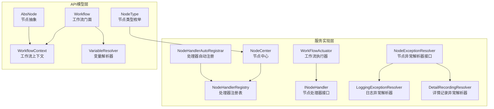
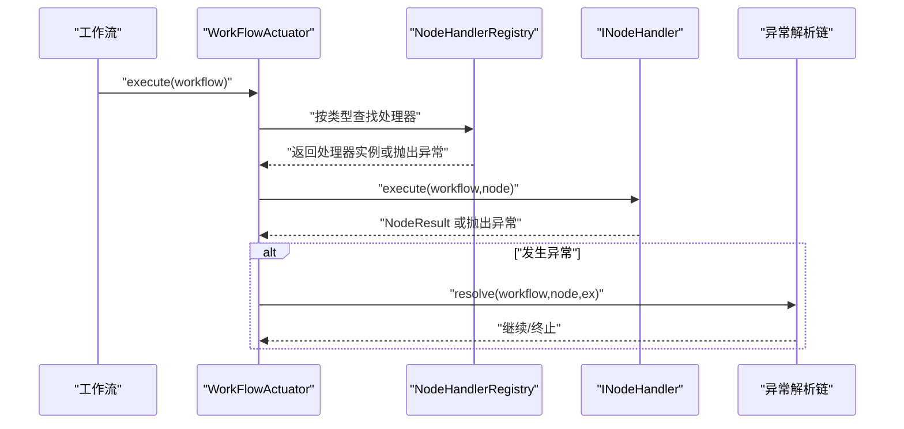
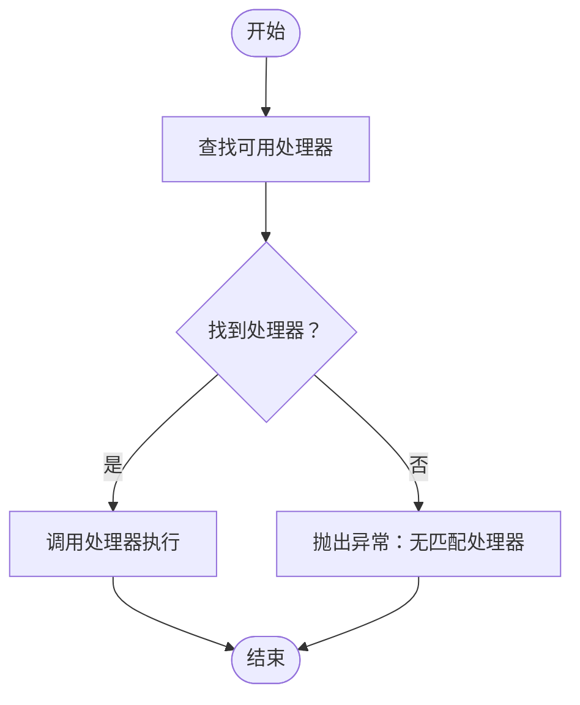
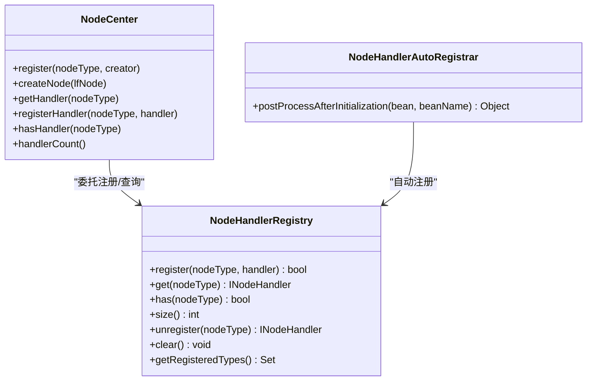
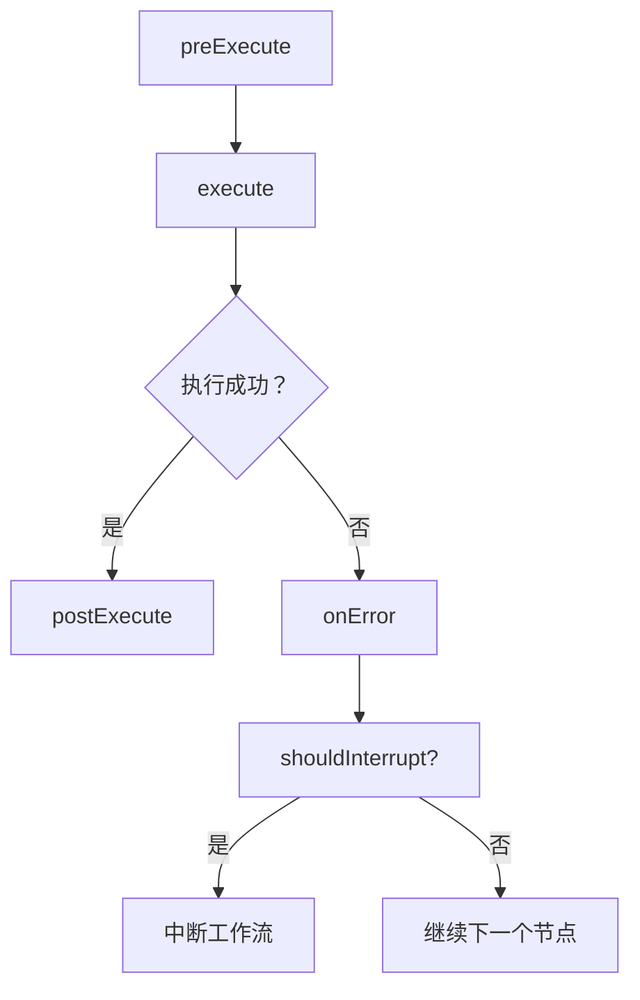
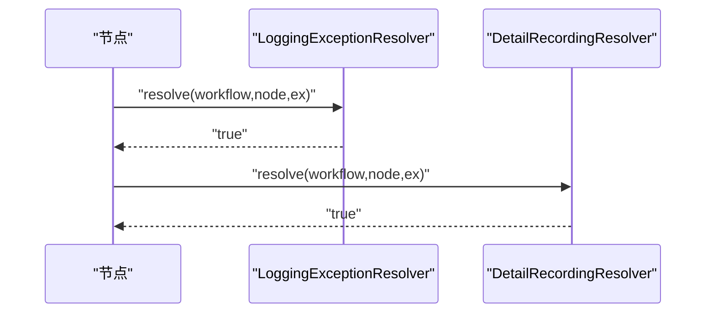
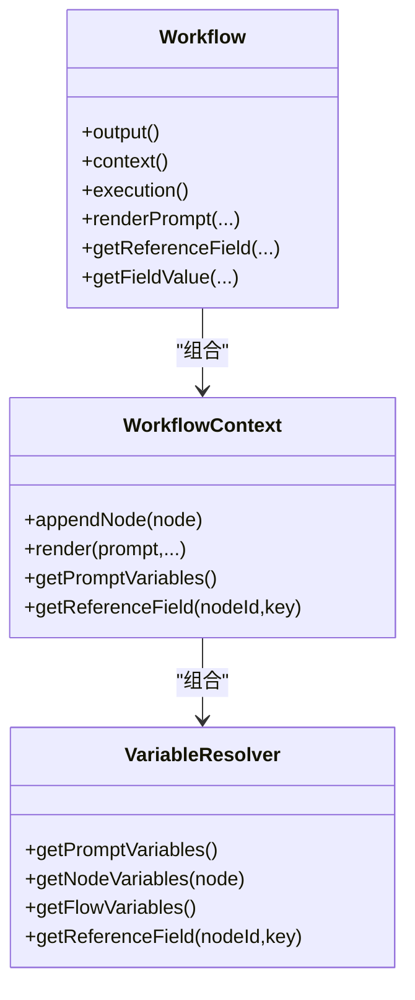
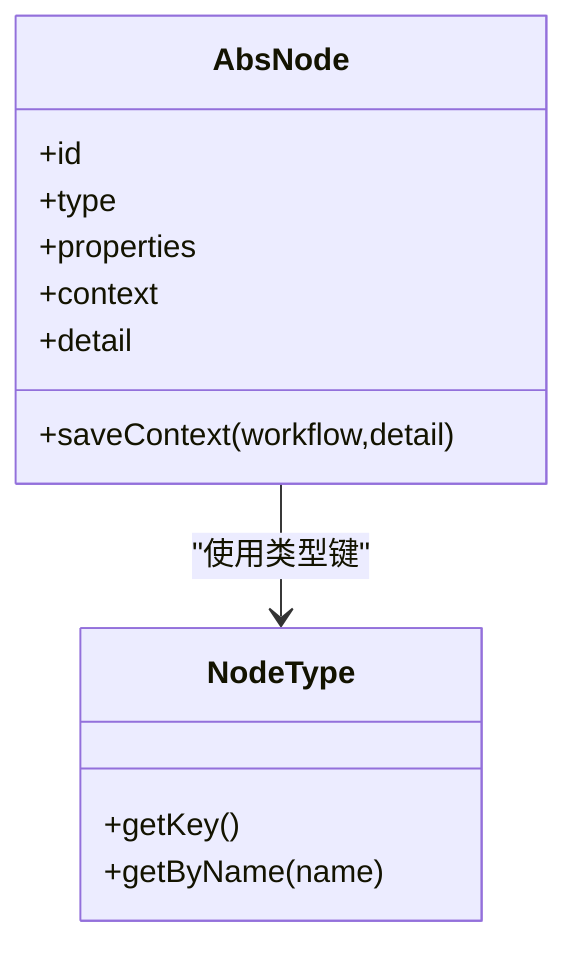
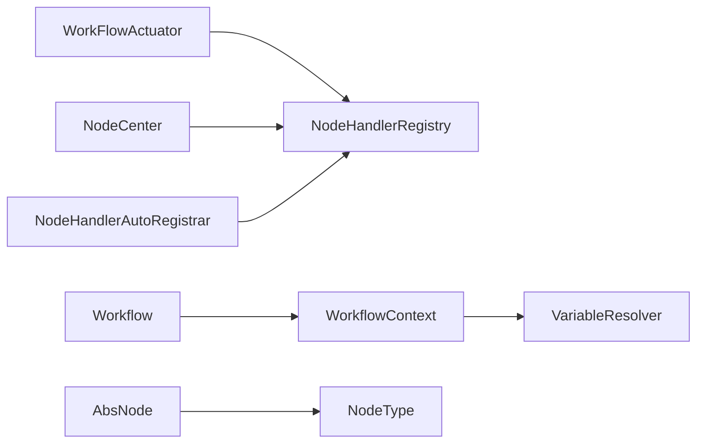

# 工作流执行问题排查

<cite>
**本文引用的文件**
- [WorkFlowActuator.java](file://maxkb4j-service/maxkb4j-workflow/src/main/java/com/maxkb4j/workflow/service/WorkFlowActuator.java)
- [NodeCenter.java](file://maxkb4j-service/maxkb4j-workflow/src/main/java/com/maxkb4j/workflow/registry/NodeCenter.java)
- [NodeHandlerRegistry.java](file://maxkb4j-service/maxkb4j-workflow/src/main/java/com/maxkb4j/workflow/registry/NodeHandlerRegistry.java)
- [NodeHandlerAutoRegistrar.java](file://maxkb4j-service/maxkb4j-workflow/src/main/java/com/maxkb4j/workflow/processor/NodeHandlerAutoRegistrar.java)
- [INodeHandler.java](file://maxkb4j-service/maxkb4j-workflow/src/main/java/com/maxkb4j/workflow/handler/node/INodeHandler.java)
- [NodeExceptionResolver.java](file://maxkb4j-service/maxkb4j-workflow/src/main/java/com/maxkb4j/workflow/exception/NodeExceptionResolver.java)
- [LoggingExceptionResolver.java](file://maxkb4j-service/maxkb4j-workflow/src/main/java/com/maxkb4j/workflow/exception/impl/LoggingExceptionResolver.java)
- [DetailRecordingResolver.java](file://maxkb4j-service/maxkb4j-workflow/src/main/java/com/maxkb4j/workflow/exception/impl/DetailRecordingResolver.java)
- [Workflow.java](file://maxkb4j-service-api/maxkb4j-workflow-api/src/main/java/com/maxkb4j/workflow/model/Workflow.java)
- [AbsNode.java](file://maxkb4j-service-api/maxkb4j-workflow-api/src/main/java/com/maxkb4j/workflow/node/AbsNode.java)
- [NodeType.java](file://maxkb4j-service-api/maxkb4j-workflow-api/src/main/java/com/maxkb4j/workflow/enums/NodeType.java)
- [WorkflowContext.java](file://maxkb4j-service-api/maxkb4j-workflow-api/src/main/java/com/maxkb4j/workflow/model/WorkflowContext.java)
- [VariableResolver.java](file://maxkb4j-service-api/maxkb4j-workflow-api/src/main/java/com/maxkb4j/workflow/model/VariableResolver.java)
</cite>

## 目录
1. [简介](#简介)
2. [项目结构](#项目结构)
3. [核心组件](#核心组件)
4. [架构总览](#架构总览)
5. [详细组件分析](#详细组件分析)
6. [依赖分析](#依赖分析)
7. [性能考虑](#性能考虑)
8. [故障排查指南](#故障排查指南)
9. [结论](#结论)
10. [附录](#附录)

## 简介
本指南聚焦于MaxKB4j工作流在执行阶段的深度排查方法，覆盖节点注册失败、处理器加载异常、参数验证错误、节点间数据传递问题、并发与资源竞争、死锁与无限循环、内存溢出、性能瓶颈与监控指标，以及调试与测试最佳实践。目标是帮助开发者快速定位并解决问题，提升工作流稳定性与可维护性。

## 项目结构
MaxKB4j将工作流能力拆分为“服务实现”与“API模型”两部分：
- 服务实现层（maxkb4j-workflow）：负责节点处理器注册、自动装配、异常解析链、工作流执行调度等。
- API模型层（maxkb4j-workflow-api）：定义工作流模型、节点抽象、上下文与变量解析、模板渲染等。

图示来源
- [WorkFlowActuator.java:1-37](file://maxkb4j-service/maxkb4j-workflow/src/main/java/com/maxkb4j/workflow/service/WorkFlowActuator.java#L1-L37)
- [NodeCenter.java:1-165](file://maxkb4j-service/maxkb4j-workflow/src/main/java/com/maxkb4j/workflow/registry/NodeCenter.java#L1-L165)
- [NodeHandlerRegistry.java:1-123](file://maxkb4j-service/maxkb4j-workflow/src/main/java/com/maxkb4j/workflow/registry/NodeHandlerRegistry.java#L1-L123)
- [NodeHandlerAutoRegistrar.java:1-40](file://maxkb4j-service/maxkb4j-workflow/src/main/java/com/maxkb4j/workflow/processor/NodeHandlerAutoRegistrar.java#L1-L40)
- [INodeHandler.java:1-71](file://maxkb4j-service/maxkb4j-workflow/src/main/java/com/maxkb4j/workflow/handler/node/INodeHandler.java#L1-L71)
- [NodeExceptionResolver.java:1-34](file://maxkb4j-service/maxkb4j-workflow/src/main/java/com/maxkb4j/workflow/exception/NodeExceptionResolver.java#L1-L34)
- [LoggingExceptionResolver.java:1-30](file://maxkb4j-service/maxkb4j-workflow/src/main/java/com/maxkb4j/workflow/exception/impl/LoggingExceptionResolver.java#L1-L30)
- [DetailRecordingResolver.java:1-32](file://maxkb4j-service/maxkb4j-workflow/src/main/java/com/maxkb4j/workflow/exception/impl/DetailRecordingResolver.java#L1-L32)
- [Workflow.java:1-263](file://maxkb4j-service-api/maxkb4j-workflow-api/src/main/java/com/maxkb4j/workflow/model/Workflow.java#L1-L263)
- [AbsNode.java:1-132](file://maxkb4j-service-api/maxkb4j-workflow-api/src/main/java/com/maxkb4j/workflow/node/AbsNode.java#L1-L132)
- [NodeType.java:1-117](file://maxkb4j-service-api/maxkb4j-workflow-api/src/main/java/com/maxkb4j/workflow/enums/NodeType.java#L1-L117)
- [WorkflowContext.java:1-82](file://maxkb4j-service-api/maxkb4j-workflow-api/src/main/java/com/maxkb4j/workflow/model/WorkflowContext.java#L1-L82)
- [VariableResolver.java:1-139](file://maxkb4j-service-api/maxkb4j-workflow-api/src/main/java/com/maxkb4j/workflow/model/VariableResolver.java#L1-L139)

章节来源
- [WorkFlowActuator.java:1-37](file://maxkb4j-service/maxkb4j-workflow/src/main/java/com/maxkb4j/workflow/service/WorkFlowActuator.java#L1-L37)
- [Workflow.java:1-263](file://maxkb4j-service-api/maxkb4j-workflow-api/src/main/java/com/maxkb4j/workflow/model/Workflow.java#L1-L263)

## 核心组件
- 工作流执行器：根据工作流类型选择对应处理器，若未找到处理器则抛出不可恢复异常。
- 节点中心：统一管理节点创建与处理器注册，提供默认节点类型注册与处理器查询/注册能力。
- 处理器注册表：基于并发安全的映射表管理节点类型到处理器实例的映射，支持注册、查询、注销、清空与统计。
- 处理器自动注册：扫描带有特定注解的处理器Bean并按节点类型自动注册。
- 节点处理器接口：定义节点执行、预处理、后处理、错误处理与中断判定的生命周期钩子。
- 异常解析链：责任链模式，先记录日志再记录节点详情，支持顺序与扩展。
- 工作流门面：提供便捷方法与分层访问器，封装上下文、历史、输出、执行访问器与配置。
- 节点抽象：统一节点属性、上下文、详情、运行时ID生成与消息转换。
- 节点类型枚举：标准化节点类型键值，提供O(1)查找。
- 上下文与变量解析：管理全局/聊天/循环/节点上下文，提供变量合并、引用字段解析与模板渲染。

章节来源
- [WorkFlowActuator.java:18-34](file://maxkb4j-service/maxkb4j-workflow/src/main/java/com/maxkb4j/workflow/service/WorkFlowActuator.java#L18-L34)
- [NodeCenter.java:25-165](file://maxkb4j-service/maxkb4j-workflow/src/main/java/com/maxkb4j/workflow/registry/NodeCenter.java#L25-L165)
- [NodeHandlerRegistry.java:18-123](file://maxkb4j-service/maxkb4j-workflow/src/main/java/com/maxkb4j/workflow/registry/NodeHandlerRegistry.java#L18-L123)
- [NodeHandlerAutoRegistrar.java:20-40](file://maxkb4j-service/maxkb4j-workflow/src/main/java/com/maxkb4j/workflow/processor/NodeHandlerAutoRegistrar.java#L20-L40)
- [INodeHandler.java:12-71](file://maxkb4j-service/maxkb4j-workflow/src/main/java/com/maxkb4j/workflow/handler/node/INodeHandler.java#L12-L71)
- [NodeExceptionResolver.java:13-34](file://maxkb4j-service/maxkb4j-workflow/src/main/java/com/maxkb4j/workflow/exception/NodeExceptionResolver.java#L13-L34)
- [LoggingExceptionResolver.java:14-30](file://maxkb4j-service/maxkb4j-workflow/src/main/java/com/maxkb4j/workflow/exception/impl/LoggingExceptionResolver.java#L14-L30)
- [DetailRecordingResolver.java:15-32](file://maxkb4j-service/maxkb4j-workflow/src/main/java/com/maxkb4j/workflow/exception/impl/DetailRecordingResolver.java#L15-L32)
- [Workflow.java:34-263](file://maxkb4j-service-api/maxkb4j-workflow-api/src/main/java/com/maxkb4j/workflow/model/Workflow.java#L34-L263)
- [AbsNode.java:26-132](file://maxkb4j-service-api/maxkb4j-workflow-api/src/main/java/com/maxkb4j/workflow/node/AbsNode.java#L26-L132)
- [NodeType.java:13-117](file://maxkb4j-service-api/maxkb4j-workflow-api/src/main/java/com/maxkb4j/workflow/enums/NodeType.java#L13-L117)
- [WorkflowContext.java:16-82](file://maxkb4j-service-api/maxkb4j-workflow-api/src/main/java/com/maxkb4j/workflow/model/WorkflowContext.java#L16-L82)
- [VariableResolver.java:13-139](file://maxkb4j-service-api/maxkb4j-workflow-api/src/main/java/com/maxkb4j/workflow/model/VariableResolver.java#L13-L139)

## 架构总览
工作流执行的关键流程如下：
- 执行器根据工作流类型选择处理器；
- 处理器通过节点中心获取节点处理器；
- 节点处理器执行生命周期钩子；
- 异常进入异常解析链；
- 上下文与变量解析贯穿执行全程。

图示来源
- [WorkFlowActuator.java:22-34](file://maxkb4j-service/maxkb4j-workflow/src/main/java/com/maxkb4j/workflow/service/WorkFlowActuator.java#L22-L34)
- [NodeHandlerRegistry.java:62-68](file://maxkb4j-service/maxkb4j-workflow/src/main/java/com/maxkb4j/workflow/registry/NodeHandlerRegistry.java#L62-L68)
- [INodeHandler.java:23-23](file://maxkb4j-service/maxkb4j-workflow/src/main/java/com/maxkb4j/workflow/handler/node/INodeHandler.java#L23-L23)
- [NodeExceptionResolver.java:23-23](file://maxkb4j-service/maxkb4j-workflow/src/main/java/com/maxkb4j/workflow/exception/NodeExceptionResolver.java#L23-L23)

## 详细组件分析

### 组件A：工作流执行器（策略选择）
- 职责：根据工作流类型选择处理器；若无匹配处理器则抛出不可恢复异常。
- 关键点：处理器选择依赖canHandle判断，建议在扩展新工作流类型时确保处理器存在。
- 故障风险：类型不匹配或缺失处理器会导致执行失败。

图示来源
- [WorkFlowActuator.java:22-34](file://maxkb4j-service/maxkb4j-workflow/src/main/java/com/maxkb4j/workflow/service/WorkFlowActuator.java#L22-L34)

章节来源
- [WorkFlowActuator.java:18-34](file://maxkb4j-service/maxkb4j-workflow/src/main/java/com/maxkb4j/workflow/service/WorkFlowActuator.java#L18-L34)

### 组件B：节点中心与处理器注册
- 节点中心：统一注册默认节点类型与处理器；提供节点创建与处理器查询/注册能力。
- 处理器注册表：并发安全映射，支持注册、查询、注销、清空与统计；注册重复会记录警告。
- 自动注册：扫描带注解的Bean并按节点类型注册，避免手工遗漏。

图示来源
- [NodeCenter.java:25-165](file://maxkb4j-service/maxkb4j-workflow/src/main/java/com/maxkb4j/workflow/registry/NodeCenter.java#L25-L165)
- [NodeHandlerRegistry.java:18-123](file://maxkb4j-service/maxkb4j-workflow/src/main/java/com/maxkb4j/workflow/registry/NodeHandlerRegistry.java#L18-L123)
- [NodeHandlerAutoRegistrar.java:20-40](file://maxkb4j-service/maxkb4j-workflow/src/main/java/com/maxkb4j/workflow/processor/NodeHandlerAutoRegistrar.java#L20-L40)

章节来源
- [NodeCenter.java:49-165](file://maxkb4j-service/maxkb4j-workflow/src/main/java/com/maxkb4j/workflow/registry/NodeCenter.java#L49-L165)
- [NodeHandlerRegistry.java:39-104](file://maxkb4j-service/maxkb4j-workflow/src/main/java/com/maxkb4j/workflow/registry/NodeHandlerRegistry.java#L39-L104)
- [NodeHandlerAutoRegistrar.java:25-38](file://maxkb4j-service/maxkb4j-workflow/src/main/java/com/maxkb4j/workflow/processor/NodeHandlerAutoRegistrar.java#L25-L38)

### 组件C：节点处理器接口与生命周期
- 生命周期钩子：preExecute、execute、postExecute、onError、shouldInterrupt。
- 作用：参数校验、状态初始化、结果后处理、错误日志与恢复、中断控制。
- 建议：在处理器中实现必要的校验与清理逻辑，避免状态泄漏。

图示来源
- [INodeHandler.java:32-68](file://maxkb4j-service/maxkb4j-workflow/src/main/java/com/maxkb4j/workflow/handler/node/INodeHandler.java#L32-L68)

章节来源
- [INodeHandler.java:12-71](file://maxkb4j-service/maxkb4j-workflow/src/main/java/com/maxkb4j/workflow/handler/node/INodeHandler.java#L12-L71)

### 组件D：异常解析链（责任链）
- LoggingExceptionResolver：记录节点执行失败的日志。
- DetailRecordingResolver：将错误信息写入节点详情（消息、时间、类名）。
- 顺序：Logging优先，DetailRecording次之，便于快速定位与持久化。

图示来源
- [NodeExceptionResolver.java:23-33](file://maxkb4j-service/maxkb4j-workflow/src/main/java/com/maxkb4j/workflow/exception/NodeExceptionResolver.java#L23-L33)
- [LoggingExceptionResolver.java:21-24](file://maxkb4j-service/maxkb4j-workflow/src/main/java/com/maxkb4j/workflow/exception/impl/LoggingExceptionResolver.java#L21-L24)
- [DetailRecordingResolver.java:21-26](file://maxkb4j-service/maxkb4j-workflow/src/main/java/com/maxkb4j/workflow/exception/impl/DetailRecordingResolver.java#L21-L26)

章节来源
- [NodeExceptionResolver.java:13-34](file://maxkb4j-service/maxkb4j-workflow/src/main/java/com/maxkb4j/workflow/exception/NodeExceptionResolver.java#L13-L34)
- [LoggingExceptionResolver.java:14-30](file://maxkb4j-service/maxkb4j-workflow/src/main/java/com/maxkb4j/workflow/exception/impl/LoggingExceptionResolver.java#L14-L30)
- [DetailRecordingResolver.java:15-32](file://maxkb4j-service/maxkb4j-workflow/src/main/java/com/maxkb4j/workflow/exception/impl/DetailRecordingResolver.java#L15-L32)

### 组件E：工作流门面与上下文
- 门面职责：提供便捷方法与分层访问器，封装配置、上下文、历史、执行与输出管理。
- 上下文：全局/聊天/循环/节点上下文，支持节点追加与变量渲染。
- 变量解析：合并多作用域变量，支持节点变量与引用字段解析。

图示来源
- [Workflow.java:34-263](file://maxkb4j-service-api/maxkb4j-workflow-api/src/main/java/com/maxkb4j/workflow/model/Workflow.java#L34-L263)
- [WorkflowContext.java:16-82](file://maxkb4j-service-api/maxkb4j-workflow-api/src/main/java/com/maxkb4j/workflow/model/WorkflowContext.java#L16-L82)
- [VariableResolver.java:13-139](file://maxkb4j-service-api/maxkb4j-workflow-api/src/main/java/com/maxkb4j/workflow/model/VariableResolver.java#L13-L139)

章节来源
- [Workflow.java:34-263](file://maxkb4j-service-api/maxkb4j-workflow-api/src/main/java/com/maxkb4j/workflow/model/Workflow.java#L34-L263)
- [WorkflowContext.java:16-82](file://maxkb4j-service-api/maxkb4j-workflow-api/src/main/java/com/maxkb4j/workflow/model/WorkflowContext.java#L16-L82)
- [VariableResolver.java:13-139](file://maxkb4j-service-api/maxkb4j-workflow-api/src/main/java/com/maxkb4j/workflow/model/VariableResolver.java#L13-L139)

### 组件F：节点抽象与类型
- 节点抽象：统一属性、上下文、详情、运行时ID生成与消息转换。
- 节点类型：标准化键值，提供O(1)查找，避免字符串散落。

图示来源
- [AbsNode.java:26-132](file://maxkb4j-service-api/maxkb4j-workflow-api/src/main/java/com/maxkb4j/workflow/node/AbsNode.java#L26-L132)
- [NodeType.java:13-117](file://maxkb4j-service-api/maxkb4j-workflow-api/src/main/java/com/maxkb4j/workflow/enums/NodeType.java#L13-L117)

章节来源
- [AbsNode.java:26-132](file://maxkb4j-service-api/maxkb4j-workflow-api/src/main/java/com/maxkb4j/workflow/node/AbsNode.java#L26-L132)
- [NodeType.java:13-117](file://maxkb4j-service-api/maxkb4j-workflow-api/src/main/java/com/maxkb4j/workflow/enums/NodeType.java#L13-L117)

## 依赖分析
- 组件耦合：执行器依赖处理器注册表；节点中心委托处理器注册表；自动注册器依赖Spring Bean容器。
- 外部依赖：并发安全的注册表使用ConcurrentHashMap；上下文使用CopyOnWriteArrayList以降低遍历开销。
- 潜在循环：当前结构为单向依赖，无明显循环依赖迹象。

图示来源
- [WorkFlowActuator.java:20-20](file://maxkb4j-service/maxkb4j-workflow/src/main/java/com/maxkb4j/workflow/service/WorkFlowActuator.java#L20-L20)
- [NodeHandlerRegistry.java:25-29](file://maxkb4j-service/maxkb4j-workflow/src/main/java/com/maxkb4j/workflow/registry/NodeHandlerRegistry.java#L25-L29)
- [NodeCenter.java:36-41](file://maxkb4j-service/maxkb4j-workflow/src/main/java/com/maxkb4j/workflow/registry/NodeCenter.java#L36-L41)
- [NodeHandlerAutoRegistrar.java:22-22](file://maxkb4j-service/maxkb4j-workflow/src/main/java/com/maxkb4j/workflow/processor/NodeHandlerAutoRegistrar.java#L22-L22)
- [Workflow.java:52-56](file://maxkb4j-service-api/maxkb4j-workflow-api/src/main/java/com/maxkb4j/workflow/model/Workflow.java#L52-L56)
- [WorkflowContext.java:41-49](file://maxkb4j-service-api/maxkb4j-workflow-api/src/main/java/com/maxkb4j/workflow/model/WorkflowContext.java#L41-L49)
- [AbsNode.java:26-50](file://maxkb4j-service-api/maxkb4j-workflow-api/src/main/java/com/maxkb4j/workflow/node/AbsNode.java#L26-L50)
- [NodeType.java:99-114](file://maxkb4j-service-api/maxkb4j-workflow-api/src/main/java/com/maxkb4j/workflow/enums/NodeType.java#L99-L114)

章节来源
- [WorkFlowActuator.java:20-20](file://maxkb4j-service/maxkb4j-workflow/src/main/java/com/maxkb4j/workflow/service/WorkFlowActuator.java#L20-L20)
- [NodeHandlerRegistry.java:25-29](file://maxkb4j-service/maxkb4j-workflow/src/main/java/com/maxkb4j/workflow/registry/NodeHandlerRegistry.java#L25-L29)
- [NodeCenter.java:36-41](file://maxkb4j-service/maxkb4j-workflow/src/main/java/com/maxkb4j/workflow/registry/NodeCenter.java#L36-L41)
- [NodeHandlerAutoRegistrar.java:22-22](file://maxkb4j-service/maxkb4j-workflow/src/main/java/com/maxkb4j/workflow/processor/NodeHandlerAutoRegistrar.java#L22-L22)
- [Workflow.java:52-56](file://maxkb4j-service-api/maxkb4j-workflow-api/src/main/java/com/maxkb4j/workflow/model/Workflow.java#L52-L56)
- [WorkflowContext.java:41-49](file://maxkb4j-service-api/maxkb4j-workflow-api/src/main/java/com/maxkb4j/workflow/model/WorkflowContext.java#L41-L49)
- [AbsNode.java:26-50](file://maxkb4j-service-api/maxkb4j-workflow-api/src/main/java/com/maxkb4j/workflow/node/AbsNode.java#L26-L50)
- [NodeType.java:99-114](file://maxkb4j-service-api/maxkb4j-workflow-api/src/main/java/com/maxkb4j/workflow/enums/NodeType.java#L99-L114)

## 性能考虑
- 并发与线程安全
  - 处理器注册表使用并发映射，适合高并发注册/查询场景。
  - 上下文节点列表使用CopyOnWriteArrayList，适合读多写少的场景，写入时复制带来一定开销。
- 内存与对象分配
  - 变量解析器在合并变量时进行容量估算，减少扩容次数。
  - 节点运行时ID生成与消息转换在高频节点中需关注对象创建频率。
- 执行超时与中断
  - 工作流门面提供节点执行超时分钟数配置，处理器应配合实现超时控制与中断判定。
- 监控指标建议
  - 处理器注册数量、节点执行耗时分布、异常解析链命中率、上下文变量大小、节点详情错误条目数。

章节来源
- [NodeHandlerRegistry.java:25-29](file://maxkb4j-service/maxkb4j-workflow/src/main/java/com/maxkb4j/workflow/registry/NodeHandlerRegistry.java#L25-L29)
- [WorkflowContext.java:44-44](file://maxkb4j-service-api/maxkb4j-workflow-api/src/main/java/com/maxkb4j/workflow/model/WorkflowContext.java#L44-L44)
- [VariableResolver.java:34-35](file://maxkb4j-service-api/maxkb4j-workflow-api/src/main/java/com/maxkb4j/workflow/model/VariableResolver.java#L34-L35)
- [Workflow.java:215-217](file://maxkb4j-service-api/maxkb4j-workflow-api/src/main/java/com/maxkb4j/workflow/model/Workflow.java#L215-L217)
- [INodeHandler.java:66-68](file://maxkb4j-service/maxkb4j-workflow/src/main/java/com/maxkb4j/workflow/handler/node/INodeHandler.java#L66-L68)

## 故障排查指南

### 一、节点注册失败与处理器加载异常
- 症状
  - 执行器无法选择处理器，抛出“无匹配处理器”的异常。
  - 节点中心创建节点时返回空，日志提示不支持的节点类型。
  - 处理器注册表查询抛出“无处理器”的异常。
- 定位步骤
  - 检查节点类型键值是否与节点类型枚举一致。
  - 确认处理器是否被自动注册器扫描并注册到注册表。
  - 核对处理器是否正确标注节点类型注解且未被覆盖。
  - 查看注册表中是否存在重复注册导致的覆盖日志。
- 解决方案
  - 修正节点类型键值或处理器注解。
  - 确保处理器Bean在Spring容器中可被扫描。
  - 如需替换处理器，明确替换流程并记录日志。
  - 清理或重建注册表以排除脏数据。

章节来源
- [WorkFlowActuator.java:29-33](file://maxkb4j-service/maxkb4j-workflow/src/main/java/com/maxkb4j/workflow/service/WorkFlowActuator.java#L29-L33)
- [NodeCenter.java:104-118](file://maxkb4j-service/maxkb4j-workflow/src/main/java/com/maxkb4j/workflow/registry/NodeCenter.java#L104-L118)
- [NodeHandlerRegistry.java:62-68](file://maxkb4j-service/maxkb4j-workflow/src/main/java/com/maxkb4j/workflow/registry/NodeHandlerRegistry.java#L62-L68)
- [NodeHandlerAutoRegistrar.java:26-36](file://maxkb4j-service/maxkb4j-workflow/src/main/java/com/maxkb4j/workflow/processor/NodeHandlerAutoRegistrar.java#L26-L36)

### 二、参数验证错误与节点执行失败
- 症状
  - 节点执行抛出异常，异常解析链记录日志并写入节点详情。
  - 节点详情包含错误消息、时间戳与异常类名。
- 定位步骤
  - 查看异常解析链顺序，确认日志与详情均已记录。
  - 在处理器的preExecute中加入参数校验与边界检查。
  - 结合节点详情与日志定位具体节点与输入。
- 解决方案
  - 在处理器中完善参数校验与边界检查。
  - 对异常进行分类处理，必要时实现自定义异常解析器。
  - 在postExecute中补充状态清理与资源回收。

章节来源
- [LoggingExceptionResolver.java:21-23](file://maxkb4j-service/maxkb4j-workflow/src/main/java/com/maxkb4j/workflow/exception/impl/LoggingExceptionResolver.java#L21-L23)
- [DetailRecordingResolver.java:21-25](file://maxkb4j-service/maxkb4j-workflow/src/main/java/com/maxkb4j/workflow/exception/impl/DetailRecordingResolver.java#L21-L25)
- [INodeHandler.java:32-58](file://maxkb4j-service/maxkb4j-workflow/src/main/java/com/maxkb4j/workflow/handler/node/INodeHandler.java#L32-L58)

### 三、节点间数据传递问题
- 症状
  - 变量解析失败，引用字段为空或类型不匹配。
  - 节点上下文缺失，模板渲染报错。
- 定位步骤
  - 使用工作流门面的引用字段解析方法，核对节点ID与字段键。
  - 检查上下文变量合并顺序与命名空间（global/chat/loop/node）。
  - 核对节点上下文是否在appendNode后正确更新。
- 解决方案
  - 规范变量命名与作用域，避免同名覆盖。
  - 在节点保存上下文时确保关键字段完整写入。
  - 在模板渲染前进行变量完整性检查。

章节来源
- [Workflow.java:168-189](file://maxkb4j-service-api/maxkb4j-workflow-api/src/main/java/com/maxkb4j/workflow/model/Workflow.java#L168-L189)
- [WorkflowContext.java:54-64](file://maxkb4j-service-api/maxkb4j-workflow-api/src/main/java/com/maxkb4j/workflow/model/WorkflowContext.java#L54-L64)
- [VariableResolver.java:129-136](file://maxkb4j-service-api/maxkb4j-workflow-api/src/main/java/com/maxkb4j/workflow/model/VariableResolver.java#L129-L136)

### 四、执行异常：死锁、无限循环、内存溢出
- 死锁与无限循环
  - 循环节点与条件分支不当可能导致死循环。
  - 建议在循环节点中设置最大迭代次数与退出条件。
  - 在处理器中实现超时控制与中断判定。
- 内存溢出
  - 上下文变量过多或节点上下文增长过快。
  - 建议定期清理临时变量，限制上下文大小。
  - 对高频节点的消息转换与对象创建进行优化。
- 解决方案
  - 在工作流门面中启用节点执行超时。
  - 在处理器中实现shouldInterrupt与超时中断。
  - 对上下文与变量解析进行容量估算与阈值控制。

章节来源
- [Workflow.java:215-217](file://maxkb4j-service-api/maxkb4j-workflow-api/src/main/java/com/maxkb4j/workflow/model/Workflow.java#L215-L217)
- [INodeHandler.java:66-68](file://maxkb4j-service/maxkb4j-workflow/src/main/java/com/maxkb4j/workflow/handler/node/INodeHandler.java#L66-L68)
- [WorkflowContext.java:44-44](file://maxkb4j-service-api/maxkb4j-workflow-api/src/main/java/com/maxkb4j/workflow/model/WorkflowContext.java#L44-L44)
- [VariableResolver.java:34-35](file://maxkb4j-service-api/maxkb4j-workflow-api/src/main/java/com/maxkb4j/workflow/model/VariableResolver.java#L34-L35)

### 五、并发执行中的问题
- 线程安全
  - 处理器注册表为并发安全；上下文节点列表为读多写少。
  - 避免在处理器中直接修改共享状态，使用局部变量与只读上下文。
- 资源竞争与状态同步
  - 处理器应避免共享可变资源；如需共享，使用同步原语或无锁结构。
  - 在postExecute中进行状态同步与一致性检查。
- 解决方案
  - 将处理器设计为无副作用或幂等；必要时引入轻量级锁。
  - 在异常解析链中记录并发相关的错误信息以便追踪。

章节来源
- [NodeHandlerRegistry.java:25-29](file://maxkb4j-service/maxkb4j-workflow/src/main/java/com/maxkb4j/workflow/registry/NodeHandlerRegistry.java#L25-L29)
- [WorkflowContext.java:44-44](file://maxkb4j-service-api/maxkb4j-workflow-api/src/main/java/com/maxkb4j/workflow/model/WorkflowContext.java#L44-L44)
- [INodeHandler.java:32-58](file://maxkb4j-service/maxkb4j-workflow/src/main/java/com/maxkb4j/workflow/handler/node/INodeHandler.java#L32-L58)

### 六、性能优化与监控
- 优化建议
  - 减少上下文变量数量与层级；合并相似变量。
  - 对高频节点的模板渲染与消息转换进行缓存或复用。
  - 控制循环与递归深度，设置上限与早停条件。
- 监控指标
  - 处理器注册数量、节点执行耗时分布、异常解析链命中率、上下文变量大小、节点详情错误条目数。
  - 工作流整体吞吐量与平均响应时间。

章节来源
- [VariableResolver.java:34-35](file://maxkb4j-service-api/maxkb4j-workflow-api/src/main/java/com/maxkb4j/workflow/model/VariableResolver.java#L34-L35)
- [Workflow.java:215-217](file://maxkb4j-service-api/maxkb4j-workflow-api/src/main/java/com/maxkb4j/workflow/model/Workflow.java#L215-L217)

### 七、调试与测试最佳实践
- 调试
  - 在preExecute中打印关键参数与上下文摘要。
  - 使用异常解析链记录详细错误信息，便于回溯。
  - 对高频节点增加执行耗时埋点。
- 测试
  - 单元测试覆盖处理器生命周期钩子与边界条件。
  - 集成测试验证节点间数据传递与变量解析。
  - 压力测试评估并发下的稳定性与资源占用。

章节来源
- [INodeHandler.java:32-58](file://maxkb4j-service/maxkb4j-workflow/src/main/java/com/maxkb4j/workflow/handler/node/INodeHandler.java#L32-L58)
- [LoggingExceptionResolver.java:21-23](file://maxkb4j-service/maxkb4j-workflow/src/main/java/com/maxkb4j/workflow/exception/impl/LoggingExceptionResolver.java#L21-L23)
- [DetailRecordingResolver.java:21-25](file://maxkb4j-service/maxkb4j-workflow/src/main/java/com/maxkb4j/workflow/exception/impl/DetailRecordingResolver.java#L21-L25)

## 结论
通过系统化的组件分析与排查流程，可有效定位MaxKB4j工作流执行中的注册、处理器加载、参数验证、数据传递、并发与性能等问题。建议在开发与运维中结合异常解析链、上下文与变量解析、并发安全与性能监控，形成闭环的质量保障体系。

## 附录
- 快速检查清单
  - 节点类型键值与枚举一致
  - 处理器已注册且未被覆盖
  - 参数校验与边界检查完备
  - 上下文变量命名规范、作用域清晰
  - 循环与递归设置上限与早停
  - 并发场景下无共享可变状态
  - 异常解析链已启用并记录详细信息
  - 性能监控指标已接入