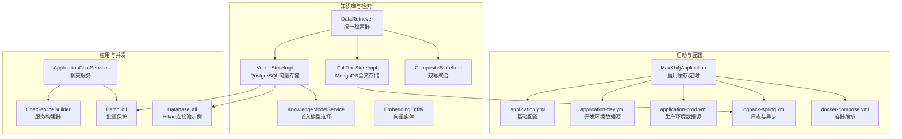
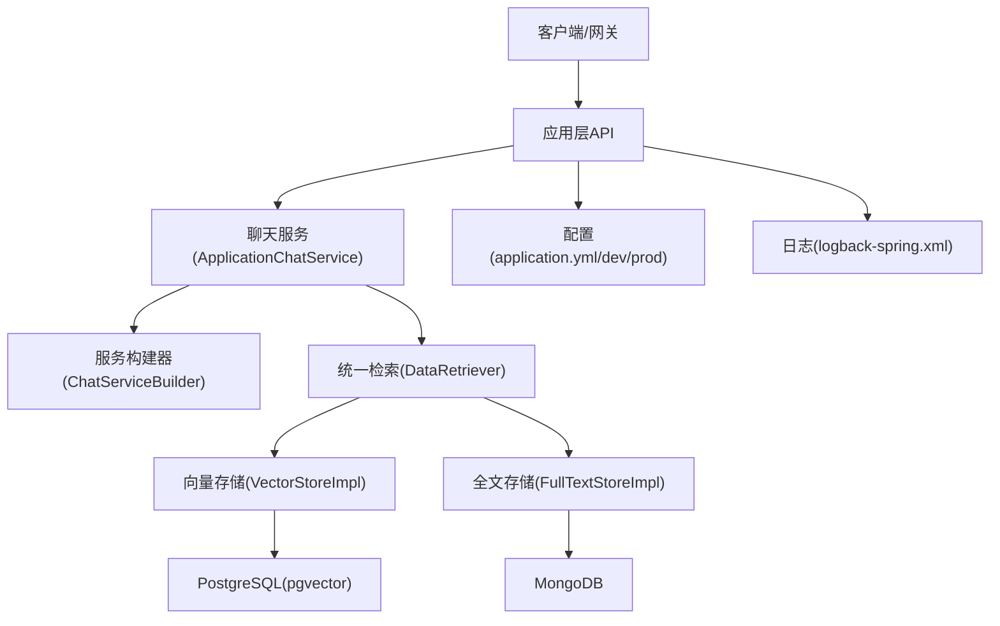
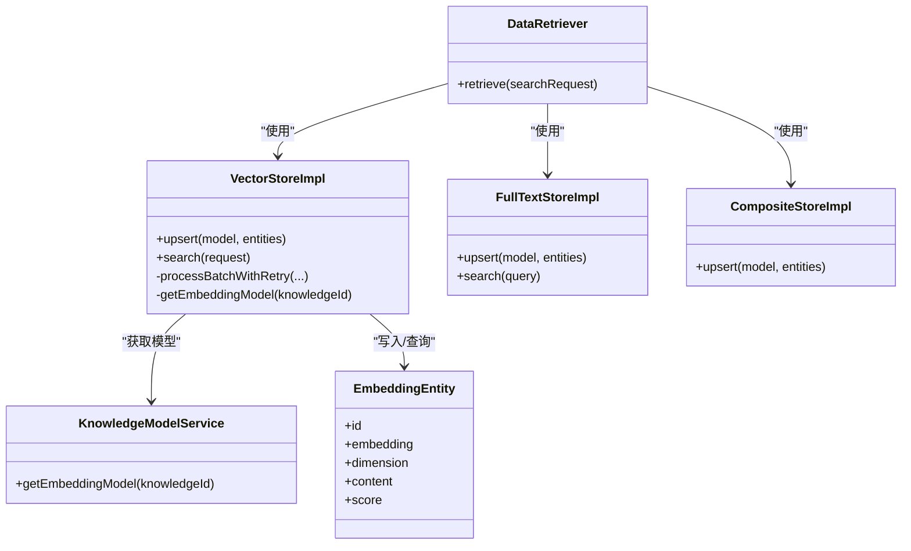
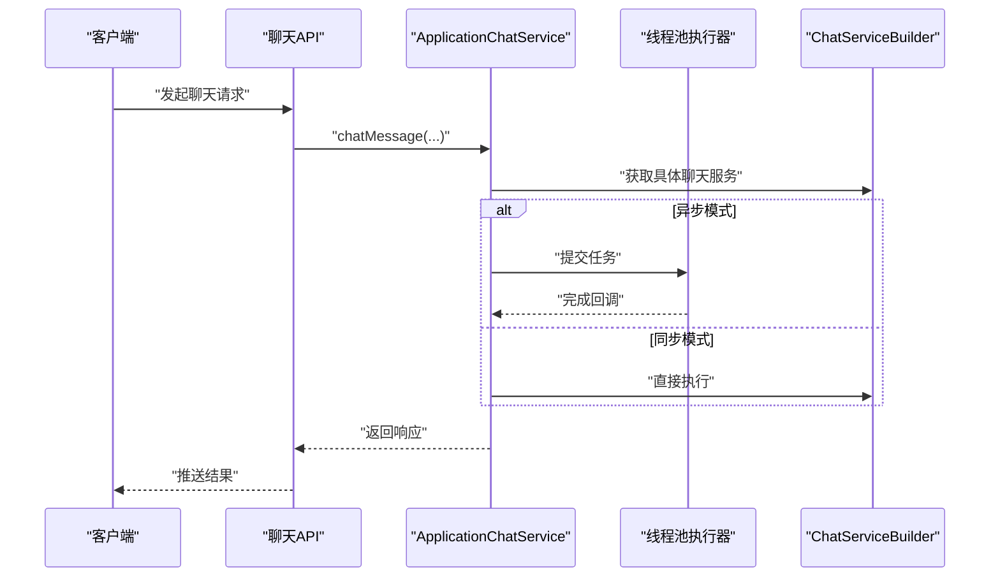
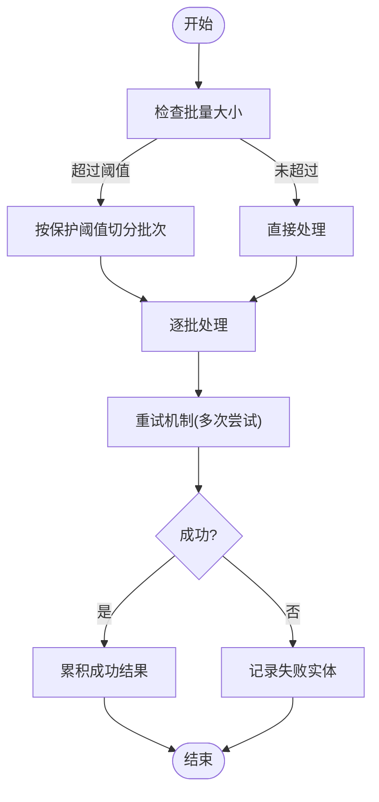
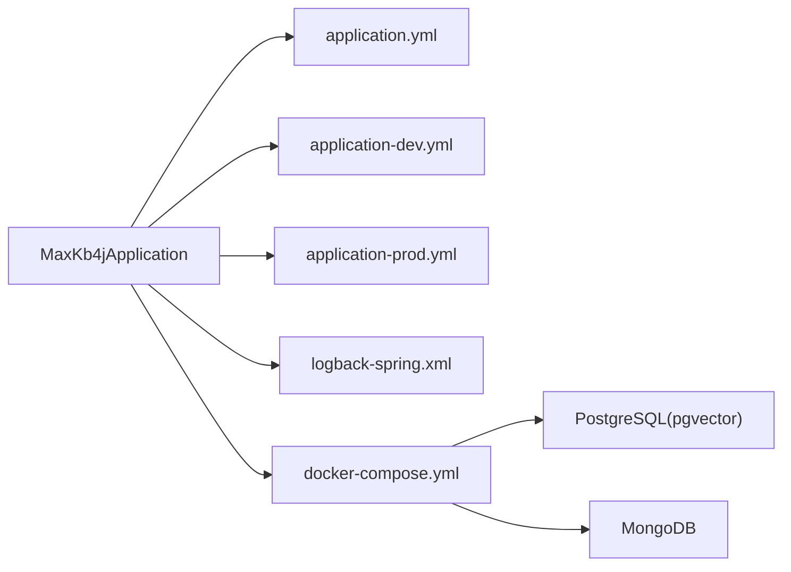

# 性能问题排查

<cite>
**本文引用的文件**
- [application.yml](file://maxkb4j-start/src/main/resources/application.yml)
- [application-dev.yml](file://maxkb4j-start/src/main/resources/application-dev.yml)
- [application-prod.yml](file://maxkb4j-start/src/main/resources/application-prod.yml)
- [logback-spring.xml](file://maxkb4j-start/src/main/resources/logback-spring.xml)
- [MaxKb4jApplication.java](file://maxkb4j-start/src/main/java/com/maxkb4j/start/MaxKb4jApplication.java)
- [docker-compose.yml](file://docker-compose.yml)
- [BatchUtil.java](file://maxkb4j-common/src/main/java/com/maxkb4j/common/util/BatchUtil.java)
- [DatabaseUtil.java](file://maxkb4j-core/src/main/java/com/maxkb4j/core/util/DatabaseUtil.java)
- [VectorStoreImpl.java](file://maxkb4j-service/maxkb4j-knowledge/src/main/java/com/maxkb4j/knowledge/store/VectorStoreImpl.java)
- [FullTextStoreImpl.java](file://maxkb4j-service/maxkb4j-knowledge/src/main/java/com/maxkb4j/knowledge/store/FullTextStoreImpl.java)
- [CompositeStoreImpl.java](file://maxkb4j-service/maxkb4j-knowledge/src/main/java/com/maxkb4j/knowledge/store/CompositeStoreImpl.java)
- [DataRetriever.java](file://maxkb4j-service/maxkb4j-knowledge/src/main/java/com/maxkb4j/knowledge/retriever/DataRetriever.java)
- [KnowledgeModelService.java](file://maxkb4j-service/maxkb4j-knowledge/src/main/java/com/maxkb4j/knowledge/service/KnowledgeModelService.java)
- [EmbeddingEntity.java](file://maxkb4j-service-api/maxkb4j-knowledge-api/src/main/java/com/maxkb4j/knowledge/entity/EmbeddingEntity.java)
- [AuthCodeCache.java](file://maxkb4j-common/src/main/java/com/maxkb4j/common/cache/AuthCodeCache.java)
- [ChatCache.java](file://maxkb4j-common/src/main/java/com/maxkb4j/common/cache/ChatCache.java)
- [SystemCache.java](file://maxkb4j-common/src/main/java/com/maxkb4j/common/cache/SystemCache.java)
- [ApplicationChatService.java](file://maxkb4j-service/maxkb4j-application/src/main/java/com/maxkb4j/application/service/ApplicationChatService.java)
- [ChatServiceBuilder.java](file://maxkb4j-service/maxkb4j-application/src/main/java/com/maxkb4j/application/builder/ChatServiceBuilder.java)
</cite>

## 目录
1. [简介](#简介)
2. [项目结构](#项目结构)
3. [核心组件](#核心组件)
4. [架构总览](#架构总览)
5. [详细组件分析](#详细组件分析)
6. [依赖分析](#依赖分析)
7. [性能考虑](#性能考虑)
8. [故障排查指南](#故障排查指南)
9. [结论](#结论)
10. [附录](#附录)

## 简介
本指南面向MaxKB4j在生产与开发环境中的性能问题排查，覆盖系统级指标采集与分析（CPU、内存、磁盘IO、网络）、数据库性能诊断（查询优化、索引使用、连接池配置）、缓存性能问题（命中率、失效、内存溢出）、向量化检索性能优化（向量维度、索引算法、相似度计算）、并发性能问题（线程池配置、锁竞争、资源争用），并提供性能瓶颈定位工具与最佳实践建议。

## 项目结构
MaxKB4j采用多模块Maven工程组织，核心模块包括：
- common：通用工具、缓存、异常、类型处理器等
- core：核心能力封装（如数据库工具）
- service-api：各领域实体、Mapper、服务接口定义
- service：业务实现（应用、知识库、模型、触发器、工作流等）
- start：Spring Boot启动入口、配置与容器编排

**图表来源**
- [MaxKb4jApplication.java:10-22](file://maxkb4j-start/src/main/java/com/maxkb4j/start/MaxKb4jApplication.java#L10-L22)
- [application.yml:1-69](file://maxkb4j-start/src/main/resources/application.yml#L1-L69)
- [application-dev.yml:1-11](file://maxkb4j-start/src/main/resources/application-dev.yml#L1-L11)
- [application-prod.yml:1-9](file://maxkb4j-start/src/main/resources/application-prod.yml#L1-L9)
- [logback-spring.xml:1-157](file://maxkb4j-start/src/main/resources/logback-spring.xml#L1-L157)
- [docker-compose.yml:1-58](file://docker-compose.yml#L1-L58)
- [VectorStoreImpl.java:1-288](file://maxkb4j-service/maxkb4j-knowledge/src/main/java/com/maxkb4j/knowledge/store/VectorStoreImpl.java#L1-L288)
- [FullTextStoreImpl.java:1-37](file://maxkb4j-service/maxkb4j-knowledge/src/main/java/com/maxkb4j/knowledge/store/FullTextStoreImpl.java#L1-L37)
- [CompositeStoreImpl.java:1-37](file://maxkb4j-service/maxkb4j-knowledge/src/main/java/com/maxkb4j/knowledge/store/CompositeStoreImpl.java#L1-L37)
- [DataRetriever.java:1-37](file://maxkb4j-service/maxkb4j-knowledge/src/main/java/com/maxkb4j/knowledge/retriever/DataRetriever.java#L1-L37)
- [KnowledgeModelService.java:1-30](file://maxkb4j-service/maxkb4j-knowledge/src/main/java/com/maxkb4j/knowledge/service/KnowledgeModelService.java#L1-L30)
- [EmbeddingEntity.java:1-51](file://maxkb4j-service-api/maxkb4j-knowledge-api/src/main/java/com/maxkb4j/knowledge/entity/EmbeddingEntity.java#L1-L51)
- [ApplicationChatService.java:126-147](file://maxkb4j-service/maxkb4j-application/src/main/java/com/maxkb4j/application/service/ApplicationChatService.java#L126-L147)
- [ChatServiceBuilder.java:1-37](file://maxkb4j-service/maxkb4j-application/src/main/java/com/maxkb4j/application/builder/ChatServiceBuilder.java#L1-L37)
- [BatchUtil.java:1-90](file://maxkb4j-common/src/main/java/com/maxkb4j/common/util/BatchUtil.java#L1-L90)
- [DatabaseUtil.java:1-36](file://maxkb4j-core/src/main/java/com/maxkb4j/core/util/DatabaseUtil.java#L1-L36)

**章节来源**
- [MaxKb4jApplication.java:10-22](file://maxkb4j-start/src/main/java/com/maxkb4j/start/MaxKb4jApplication.java#L10-L22)
- [application.yml:1-69](file://maxkb4j-start/src/main/resources/application.yml#L1-L69)
- [logback-spring.xml:111-157](file://maxkb4j-start/src/main/resources/logback-spring.xml#L111-L157)
- [docker-compose.yml:1-58](file://docker-compose.yml#L1-L58)

## 核心组件
- 缓存层：基于Caffeine的本地缓存（验证码、会话信息等），支持容量与过期策略配置，适合高频读取场景
- 数据存储：PostgreSQL（pgvector扩展）+ MongoDB（全文检索），通过CompositeStore实现双写一致性
- 检索引擎：统一检索器DataRetriever，支持向量与全文混合检索
- 并发执行：应用聊天服务支持异步执行，并通过线程池调度器隔离任务
- 日志与监控：Logback异步Appender，结合系统日志级别控制，便于性能观测

**章节来源**
- [AuthCodeCache.java:1-27](file://maxkb4j-common/src/main/java/com/maxkb4j/common/cache/AuthCodeCache.java#L1-L27)
- [ChatCache.java:1-30](file://maxkb4j-common/src/main/java/com/maxkb4j/common/cache/ChatCache.java#L1-L30)
- [CompositeStoreImpl.java:1-37](file://maxkb4j-service/maxkb4j-knowledge/src/main/java/com/maxkb4j/knowledge/store/CompositeStoreImpl.java#L1-L37)
- [DataRetriever.java:1-37](file://maxkb4j-service/maxkb4j-knowledge/src/main/java/com/maxkb4j/knowledge/retriever/DataRetriever.java#L1-L37)
- [ApplicationChatService.java:126-147](file://maxkb4j-service/maxkb4j-application/src/main/java/com/maxkb4j/application/service/ApplicationChatService.java#L126-L147)

## 架构总览
系统以Spring Boot为核心，启动时自动装配缓存与定时任务；知识库模块负责向量化与全文双写存储；检索模块统一聚合向量与全文结果；应用模块提供聊天服务并支持异步执行；日志系统采用异步落盘，降低I/O对主线程影响。

**图表来源**
- [ApplicationChatService.java:126-147](file://maxkb4j-service/maxkb4j-application/src/main/java/com/maxkb4j/application/service/ApplicationChatService.java#L126-L147)
- [ChatServiceBuilder.java:1-37](file://maxkb4j-service/maxkb4j-application/src/main/java/com/maxkb4j/application/builder/ChatServiceBuilder.java#L1-L37)
- [DataRetriever.java:1-37](file://maxkb4j-service/maxkb4j-knowledge/src/main/java/com/maxkb4j/knowledge/retriever/DataRetriever.java#L1-L37)
- [VectorStoreImpl.java:1-288](file://maxkb4j-service/maxkb4j-knowledge/src/main/java/com/maxkb4j/knowledge/store/VectorStoreImpl.java#L1-L288)
- [FullTextStoreImpl.java:1-37](file://maxkb4j-service/maxkb4j-knowledge/src/main/java/com/maxkb4j/knowledge/store/FullTextStoreImpl.java#L1-L37)
- [application.yml:1-69](file://maxkb4j-start/src/main/resources/application.yml#L1-L69)
- [logback-spring.xml:111-157](file://maxkb4j-start/src/main/resources/logback-spring.xml#L111-L157)

## 详细组件分析

### 向量存储与检索组件
- VectorStoreImpl：负责向量嵌入生成、批量处理、重试机制、插入PG、排序去重与TopK裁剪
- FullTextStoreImpl：基于MongoTemplate的全文检索实现
- CompositeStoreImpl：双写PG与Mongo，保证一致性
- DataRetriever：统一检索入口，支持向量/全文模式切换
- KnowledgeModelService：按知识库选择嵌入模型
- EmbeddingEntity：向量实体，包含向量、维度、内容与分数字段

**图表来源**
- [VectorStoreImpl.java:1-288](file://maxkb4j-service/maxkb4j-knowledge/src/main/java/com/maxkb4j/knowledge/store/VectorStoreImpl.java#L1-L288)
- [FullTextStoreImpl.java:1-37](file://maxkb4j-service/maxkb4j-knowledge/src/main/java/com/maxkb4j/knowledge/store/FullTextStoreImpl.java#L1-L37)
- [CompositeStoreImpl.java:1-37](file://maxkb4j-service/maxkb4j-knowledge/src/main/java/com/maxkb4j/knowledge/store/CompositeStoreImpl.java#L1-L37)
- [DataRetriever.java:1-37](file://maxkb4j-service/maxkb4j-knowledge/src/main/java/com/maxkb4j/knowledge/retriever/DataRetriever.java#L1-L37)
- [KnowledgeModelService.java:1-30](file://maxkb4j-service/maxkb4j-knowledge/src/main/java/com/maxkb4j/knowledge/service/KnowledgeModelService.java#L1-L30)
- [EmbeddingEntity.java:1-51](file://maxkb4j-service-api/maxkb4j-knowledge-api/src/main/java/com/maxkb4j/knowledge/entity/EmbeddingEntity.java#L1-L51)

**章节来源**
- [VectorStoreImpl.java:66-152](file://maxkb4j-service/maxkb4j-knowledge/src/main/java/com/maxkb4j/knowledge/store/VectorStoreImpl.java#L66-L152)
- [VectorStoreImpl.java:257-278](file://maxkb4j-service/maxkb4j-knowledge/src/main/java/com/maxkb4j/knowledge/store/VectorStoreImpl.java#L257-L278)
- [CompositeStoreImpl.java:27-37](file://maxkb4j-service/maxkb4j-knowledge/src/main/java/com/maxkb4j/knowledge/store/CompositeStoreImpl.java#L27-L37)
- [DataRetriever.java:25-37](file://maxkb4j-service/maxkb4j-knowledge/src/main/java/com/maxkb4j/knowledge/retriever/DataRetriever.java#L25-L37)
- [KnowledgeModelService.java:19-28](file://maxkb4j-service/maxkb4j-knowledge/src/main/java/com/maxkb4j/knowledge/service/KnowledgeModelService.java#L19-L28)
- [EmbeddingEntity.java:29-51](file://maxkb4j-service-api/maxkb4j-knowledge-api/src/main/java/com/maxkb4j/knowledge/entity/EmbeddingEntity.java#L29-L51)

### 并发与异步执行
- ApplicationChatService：支持同步与异步聊天执行，异步通过自定义线程池执行器调度
- ChatServiceBuilder：应用类型到具体聊天服务的映射注册表

**图表来源**
- [ApplicationChatService.java:126-147](file://maxkb4j-service/maxkb4j-application/src/main/java/com/maxkb4j/application/service/ApplicationChatService.java#L126-L147)
- [ChatServiceBuilder.java:14-37](file://maxkb4j-service/maxkb4j-application/src/main/java/com/maxkb4j/application/builder/ChatServiceBuilder.java#L14-L37)

**章节来源**
- [ApplicationChatService.java:126-147](file://maxkb4j-service/maxkb4j-application/src/main/java/com/maxkb4j/application/service/ApplicationChatService.java#L126-L147)
- [ChatServiceBuilder.java:14-37](file://maxkb4j-service/maxkb4j-application/src/main/java/com/maxkb4j/application/builder/ChatServiceBuilder.java#L14-L37)

### 批处理与重试机制
- BatchUtil：对大批量数据进行分片保护，避免单次请求过大导致超时或失败
- VectorStoreImpl：在嵌入生成过程中引入重试与延迟，提升稳定性

**图表来源**
- [BatchUtil.java:33-83](file://maxkb4j-common/src/main/java/com/maxkb4j/common/util/BatchUtil.java#L33-L83)
- [VectorStoreImpl.java:66-152](file://maxkb4j-service/maxkb4j-knowledge/src/main/java/com/maxkb4j/knowledge/store/VectorStoreImpl.java#L66-L152)

**章节来源**
- [BatchUtil.java:1-90](file://maxkb4j-common/src/main/java/com/maxkb4j/common/util/BatchUtil.java#L1-L90)
- [VectorStoreImpl.java:66-152](file://maxkb4j-service/maxkb4j-knowledge/src/main/java/com/maxkb4j/knowledge/store/VectorStoreImpl.java#L66-L152)

## 依赖分析
- 启动与配置：MaxKb4jApplication启用缓存与定时；application.yml集中管理端口、缓存类型、P6Spy开关、系统默认账户等；dev/prod分别指向不同数据源
- 日志：logback-spring.xml配置异步Appender与级别过滤，降低I/O开销
- 存储：docker-compose定义PostgreSQL与MongoDB容器，maxkb4j容器通过环境变量注入数据源连接
- 连接池：DatabaseUtil展示HikariCP典型配置项，可用于评估连接池参数合理性

**图表来源**
- [MaxKb4jApplication.java:10-22](file://maxkb4j-start/src/main/java/com/maxkb4j/start/MaxKb4jApplication.java#L10-L22)
- [application.yml:1-69](file://maxkb4j-start/src/main/resources/application.yml#L1-L69)
- [application-dev.yml:1-11](file://maxkb4j-start/src/main/resources/application-dev.yml#L1-L11)
- [application-prod.yml:1-9](file://maxkb4j-start/src/main/resources/application-prod.yml#L1-L9)
- [logback-spring.xml:87-109](file://maxkb4j-start/src/main/resources/logback-spring.xml#L87-L109)
- [docker-compose.yml:1-58](file://docker-compose.yml#L1-L58)
- [DatabaseUtil.java:18-31](file://maxkb4j-core/src/main/java/com/maxkb4j/core/util/DatabaseUtil.java#L18-L31)

**章节来源**
- [docker-compose.yml:1-58](file://docker-compose.yml#L1-L58)
- [DatabaseUtil.java:18-31](file://maxkb4j-core/src/main/java/com/maxkb4j/core/util/DatabaseUtil.java#L18-L31)

## 性能考虑
- CPU与内存
  - 启用异步日志与异步Appender，减少I/O阻塞对CPU的影响
  - 合理设置JVM堆大小与GC策略，结合容器资源限制
- 磁盘IO
  - 日志滚动与异步落盘，避免频繁刷盘
  - PostgreSQL与MongoDB持久化卷分离，避免热点争用
- 网络
  - 容器间通过内部网络通信，减少外网依赖
  - 适当设置连接超时与重试策略，避免请求堆积
- 数据库
  - 使用HikariCP连接池，合理设置最大连接数、空闲超时、生命周期
  - 开启P6Spy日志（开发环境）观察慢SQL
- 缓存
  - Caffeine缓存容量与过期策略需结合业务峰值与访问模式调优
  - 注意缓存键设计与序列化成本
- 向量化检索
  - 嵌入维度与相似度计算成本成正比，需在精度与性能间平衡
  - 检索阶段先粗排再精排，减少后续排序成本
- 并发
  - 异步执行与线程池隔离，避免阻塞主线程
  - 避免热点对象的全局锁，使用无锁或细粒度锁

[本节为通用指导，无需列出具体文件来源]

## 故障排查指南

### 系统性能监控与指标采集
- CPU使用率：容器资源监控（CPU使用率、平均负载）
- 内存消耗：JVM堆/非堆使用、GC频率与停顿时间
- 磁盘IO：读写吞吐、队列长度、I/O等待时间
- 网络延迟：请求往返时间、连接建立耗时
- 日志与追踪：开启TraceId，结合异步日志定位热点路径

**章节来源**
- [logback-spring.xml:111-157](file://maxkb4j-start/src/main/resources/logback-spring.xml#L111-L157)

### 数据库性能诊断
- 连接池配置
  - 依据QPS与事务持续时间估算最大连接数，避免连接池耗尽
  - 观察连接超时与拒绝次数，必要时扩容或优化SQL
- 查询优化
  - 使用P6Spy（开发环境）查看慢SQL与执行计划
  - 为高并发查询建立合适索引，避免全表扫描
- 存储层
  - PostgreSQL启用pgvector扩展，确保向量字段与索引维护
  - MongoDB使用文本索引与聚合管道优化全文检索

**章节来源**
- [application.yml:60-66](file://maxkb4j-start/src/main/resources/application.yml#L60-L66)
- [DatabaseUtil.java:18-31](file://maxkb4j-core/src/main/java/com/maxkb4j/core/util/DatabaseUtil.java#L18-L31)
- [docker-compose.yml:1-58](file://docker-compose.yml#L1-L58)

### 缓存性能问题排查
- 命中率偏低
  - 检查缓存键是否稳定、过期策略是否过短
  - 评估热点数据分布，避免缓存雪崩
- 缓存失效
  - 关注写后读一致性，必要时采用写穿透或延迟双删
- 内存溢出
  - 限制缓存最大容量与条目大小，定期清理无效键
  - 监控堆外内存（如使用Off-Heap）

**章节来源**
- [AuthCodeCache.java:10-18](file://maxkb4j-common/src/main/java/com/maxkb4j/common/cache/AuthCodeCache.java#L10-L18)
- [ChatCache.java:12-16](file://maxkb4j-common/src/main/java/com/maxkb4j/common/cache/ChatCache.java#L12-L16)
- [SystemCache.java:8-35](file://maxkb4j-common/src/main/java/com/maxkb4j/common/cache/SystemCache.java#L8-L35)

### 向量化检索性能优化
- 向量维度
  - 维度越高精度越高但计算与存储成本更高，建议从较小维度起步逐步调优
- 索引算法
  - PostgreSQL pgvector索引类型与参数需结合数据规模与查询模式
- 相似度计算
  - 优先使用内积/余弦距离，减少高维空间的计算复杂度
- 检索流程
  - 先粗排（如IVF/HNSW近似检索）再精排（BM25/向量二次排序），控制TopK规模

**章节来源**
- [VectorStoreImpl.java:257-278](file://maxkb4j-service/maxkb4j-knowledge/src/main/java/com/maxkb4j/knowledge/store/VectorStoreImpl.java#L257-L278)
- [KnowledgeModelService.java:19-28](file://maxkb4j-service/maxkb4j-knowledge/src/main/java/com/maxkb4j/knowledge/service/KnowledgeModelService.java#L19-L28)
- [EmbeddingEntity.java:29-51](file://maxkb4j-service-api/maxkb4j-knowledge-api/src/main/java/com/maxkb4j/knowledge/entity/EmbeddingEntity.java#L29-L51)

### 并发性能问题分析
- 线程池配置
  - 根据CPU核数与IO密集度设置核心/最大线程数、队列长度与拒绝策略
- 锁竞争
  - 减少全局锁范围，使用无锁容器或分段锁
- 资源争用
  - 数据库连接池与外部模型服务连接池需独立配置，避免相互影响

**章节来源**
- [ApplicationChatService.java:139-147](file://maxkb4j-service/maxkb4j-application/src/main/java/com/maxkb4j/application/service/ApplicationChatService.java#L139-L147)
- [ChatServiceBuilder.java:14-37](file://maxkb4j-service/maxkb4j-application/src/main/java/com/maxkb4j/application/builder/ChatServiceBuilder.java#L14-L37)

### 性能瓶颈定位工具与方法
- JVM与容器
  - 使用JFR/JMC采集火焰图，定位CPU热点
  - 使用容器监控（CPU/内存/IO）识别资源瓶颈
- 数据库
  - 开启慢查询日志与执行计划分析
  - 使用pg_stat_statements（PostgreSQL）与MongoDB Profiler
- 日志与追踪
  - 结合TraceId串联请求链路，定位耗时环节
  - 利用异步日志降低观测开销

**章节来源**
- [logback-spring.xml:111-157](file://maxkb4j-start/src/main/resources/logback-spring.xml#L111-L157)
- [application.yml:60-66](file://maxkb4j-start/src/main/resources/application.yml#L60-L66)

### 性能调优最佳实践
- 分层限流与熔断，避免级联故障
- 批量处理与异步化，提升吞吐
- 缓存预热与热点数据驻留
- 向量化检索分阶段降噪，控制召回规模
- 连接池参数与GC策略协同优化

[本节为通用指导，无需列出具体文件来源]

## 结论
MaxKB4j通过异步日志、缓存与双存储架构实现了较好的性能基础。针对性能问题，应从系统指标入手，结合数据库、缓存、向量化检索与并发执行四个维度进行定位与优化。建议在开发环境开启P6Spy与异步日志，在生产环境严格控制日志级别与队列容量，配合容器资源限制与连接池参数，持续迭代调优。

[本节为总结性内容，无需列出具体文件来源]

## 附录
- 配置文件位置参考
  - [application.yml:1-69](file://maxkb4j-start/src/main/resources/application.yml#L1-L69)
  - [application-dev.yml:1-11](file://maxkb4j-start/src/main/resources/application-dev.yml#L1-L11)
  - [application-prod.yml:1-9](file://maxkb4j-start/src/main/resources/application-prod.yml#L1-L9)
  - [logback-spring.xml:1-157](file://maxkb4j-start/src/main/resources/logback-spring.xml#L1-L157)
  - [docker-compose.yml:1-58](file://docker-compose.yml#L1-L58)
- 关键实现参考
  - [BatchUtil.java:1-90](file://maxkb4j-common/src/main/java/com/maxkb4j/common/util/BatchUtil.java#L1-L90)
  - [DatabaseUtil.java:1-36](file://maxkb4j-core/src/main/java/com/maxkb4j/core/util/DatabaseUtil.java#L1-L36)
  - [VectorStoreImpl.java:1-288](file://maxkb4j-service/maxkb4j-knowledge/src/main/java/com/maxkb4j/knowledge/store/VectorStoreImpl.java#L1-L288)
  - [FullTextStoreImpl.java:1-37](file://maxkb4j-service/maxkb4j-knowledge/src/main/java/com/maxkb4j/knowledge/store/FullTextStoreImpl.java#L1-L37)
  - [CompositeStoreImpl.java:1-37](file://maxkb4j-service/maxkb4j-knowledge/src/main/java/com/maxkb4j/knowledge/store/CompositeStoreImpl.java#L1-L37)
  - [DataRetriever.java:1-37](file://maxkb4j-service/maxkb4j-knowledge/src/main/java/com/maxkb4j/knowledge/retriever/DataRetriever.java#L1-L37)
  - [KnowledgeModelService.java:1-30](file://maxkb4j-service/maxkb4j-knowledge/src/main/java/com/maxkb4j/knowledge/service/KnowledgeModelService.java#L1-L30)
  - [EmbeddingEntity.java:1-51](file://maxkb4j-service-api/maxkb4j-knowledge-api/src/main/java/com/maxkb4j/knowledge/entity/EmbeddingEntity.java#L1-L51)
  - [AuthCodeCache.java:1-27](file://maxkb4j-common/src/main/java/com/maxkb4j/common/cache/AuthCodeCache.java#L1-L27)
  - [ChatCache.java:1-30](file://maxkb4j-common/src/main/java/com/maxkb4j/common/cache/ChatCache.java#L1-L30)
  - [ApplicationChatService.java:126-147](file://maxkb4j-service/maxkb4j-application/src/main/java/com/maxkb4j/application/service/ApplicationChatService.java#L126-L147)
  - [ChatServiceBuilder.java:1-37](file://maxkb4j-service/maxkb4j-application/src/main/java/com/maxkb4j/application/builder/ChatServiceBuilder.java#L1-L37)