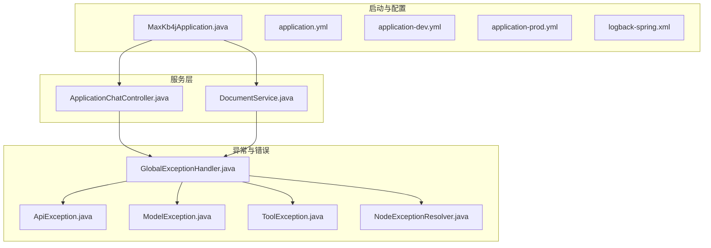
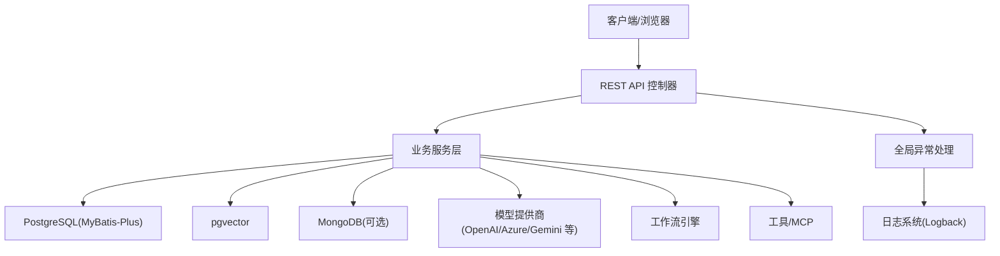
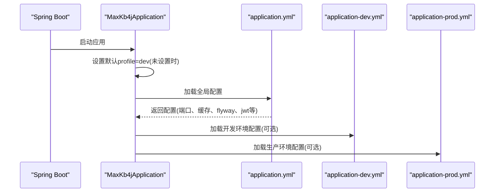
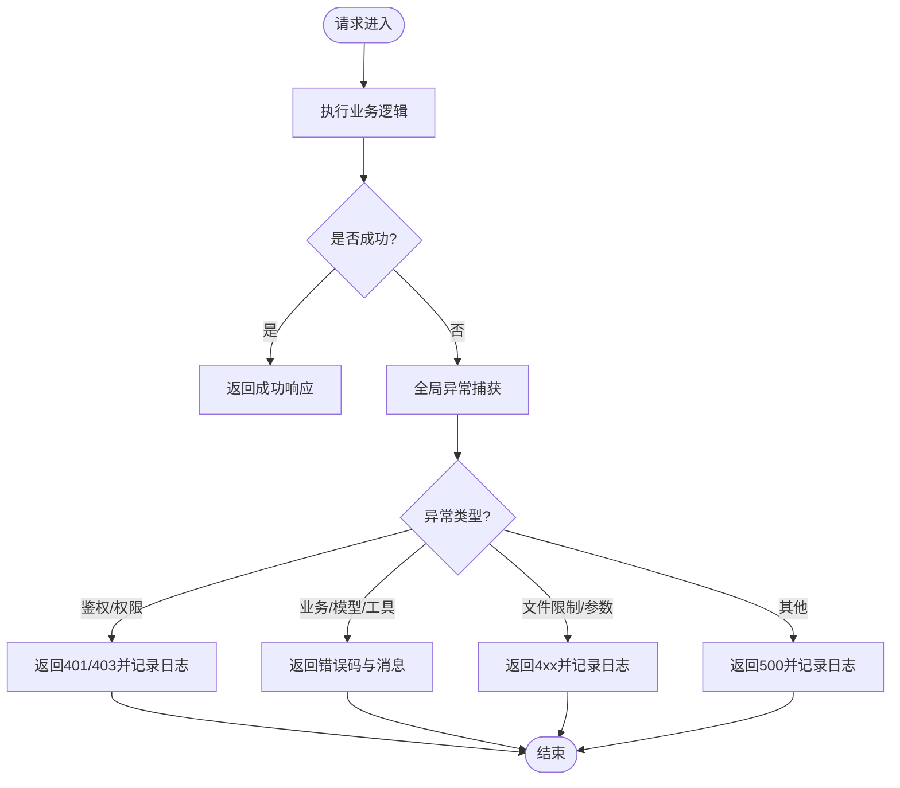
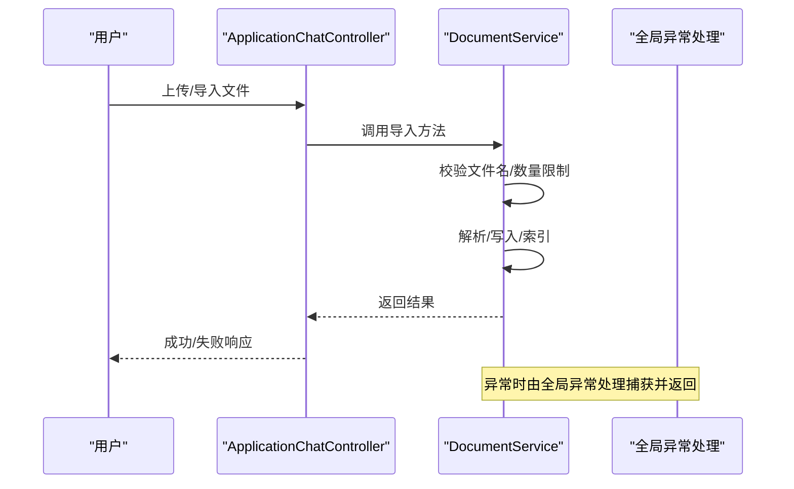
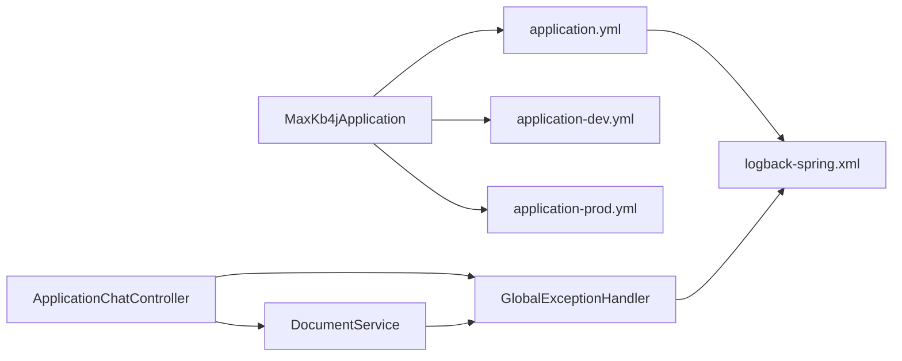

# 故障排除

<cite>
**本文引用的文件**
- [README_CN.md](file://README_CN.md)
- [MaxKb4jApplication.java](file://maxkb4j-start/src/main/java/com/MaxKB4j/start/MaxKb4jApplication.java)
- [application.yml](file://maxkb4j-start/src/main/resources/application.yml)
- [application-dev.yml](file://maxkb4j-start/src/main/resources/application-dev.yml)
- [application-prod.yml](file://maxkb4j-start/src/main/resources/application-prod.yml)
- [logback-spring.xml](file://maxkb4j-start/src/main/resources/logback-spring.xml)
- [GlobalExceptionHandler.java](file://maxkb4j-common/src/main/java/com/maxkb4j/common/handler/GlobalExceptionHandler.java)
- [ApiException.java](file://maxkb4j-common/src/main/java/com/maxkb4j/common/exception/ApiException.java)
- [ModelException.java](file://maxkb4j-service/maxkb4j-model/src/main/java/com/maxkb4j/model/exception/ModelException.java)
- [NodeExceptionResolver.java](file://maxkb4j-service/maxkb4j-workflow/src/main/java/com/maxkb4j/workflow/exception/NodeExceptionResolver.java)
- [ToolException.java](file://maxkb4j-service/maxkb4j-tool/src/main/java/com/maxkb4j/tool/exception/ToolException.java)
- [DocumentService.java](file://maxkb4j-service/maxkb4j-knowledge/src/main/java/com/maxkb4j/knowledge/service/DocumentService.java)
- [ApplicationChatController.java](file://maxkb4j-service/maxkb4j-application/src/main/java/com/maxkb4j/application/controller/ApplicationChatController.java)
- [docker-compose.yml](file://docker-compose.yml)
- [docker-compose.dev.yml](file://docker-compose.dev.yml)
</cite>

## 目录
1. [简介](#简介)
2. [项目结构](#项目结构)
3. [核心组件](#核心组件)
4. [架构总览](#架构总览)
5. [详细组件分析](#详细组件分析)
6. [依赖分析](#依赖分析)
7. [性能考虑](#性能考虑)
8. [故障排除指南](#故障排除指南)
9. [结论](#结论)
10. [附录](#附录)

## 简介
本指南面向用户与开发者，帮助快速定位与解决 MaxKB4j 在启动、数据库连接、模型调用、工作流执行、性能与监控等方面的常见问题。文档提供日志分析方法、关键日志信息解读、排查步骤、应急处理方案以及社区支持渠道。

## 项目结构
MaxKB4j 采用多模块 Maven 结构，核心模块包括：
- 公共基础与异常处理：maxkb4j-common
- 应用与聊天：maxkb4j-application
- 知识库与文档处理：maxkb4j-knowledge
- 模型与提供商：maxkb4j-model
- 工作流引擎：maxkb4j-workflow
- 触发器与调度：maxkb4j-trigger
- 工具与 MCP：maxkb4j-tool
- 系统与权限：maxkb4j-system
- 对外 API 定义：maxkb4j-service-api
- 启动与配置：maxkb4j-start

图表来源
- [MaxKb4jApplication.java:1-23](file://maxkb4j-start/src/main/java/com/MaxKB4j/start/MaxKb4jApplication.java#L1-L23)
- [application.yml:1-69](file://maxkb4j-start/src/main/resources/application.yml#L1-L69)
- [application-dev.yml:1-11](file://maxkb4j-start/src/main/resources/application-dev.yml#L1-L11)
- [application-prod.yml:1-9](file://maxkb4j-start/src/main/resources/application-prod.yml#L1-L9)
- [logback-spring.xml:1-157](file://maxkb4j-start/src/main/resources/logback-spring.xml#L1-L157)
- [ApplicationChatController.java:1-64](file://maxkb4j-service/maxkb4j-application/src/main/java/com/maxkb4j/application/controller/ApplicationChatController.java#L1-L64)
- [DocumentService.java:1-200](file://maxkb4j-service/maxkb4j-knowledge/src/main/java/com/maxkb4j/knowledge/service/DocumentService.java#L1-L200)
- [GlobalExceptionHandler.java:1-168](file://maxkb4j-common/src/main/java/com/maxkb4j/common/handler/GlobalExceptionHandler.java#L1-L168)
- [ApiException.java:1-30](file://maxkb4j-common/src/main/java/com/maxkb4j/common/exception/ApiException.java#L1-L30)
- [ModelException.java:1-12](file://maxkb4j-service/maxkb4j-model/src/main/java/com/maxkb4j/model/exception/ModelException.java#L1-L12)
- [ToolException.java:1-29](file://maxkb4j-service/maxkb4j-tool/src/main/java/com/maxkb4j/tool/exception/ToolException.java#L1-L29)
- [NodeExceptionResolver.java:1-34](file://maxkb4j-service/maxkb4j-workflow/src/main/java/com/maxkb4j/workflow/exception/NodeExceptionResolver.java#L1-L34)

章节来源
- [README_CN.md:1-185](file://README_CN.md#L1-L185)
- [MaxKb4jApplication.java:1-23](file://maxkb4j-start/src/main/java/com/MaxKB4j/start/MaxKb4jApplication.java#L1-L23)
- [application.yml:1-69](file://maxkb4j-start/src/main/resources/application.yml#L1-L69)
- [application-dev.yml:1-11](file://maxkb4j-start/src/main/resources/application-dev.yml#L1-L11)
- [application-prod.yml:1-9](file://maxkb4j-start/src/main/resources/application-prod.yml#L1-L9)
- [logback-spring.xml:1-157](file://maxkb4j-start/src/main/resources/logback-spring.xml#L1-L157)

## 核心组件
- 启动入口与默认配置：Spring Boot 启动类负责设置默认激活的 profile，并加载全局配置与日志。
- 配置中心：application.yml 提供全局配置项，application-dev.yml 与 application-prod.yml 提供环境差异化配置。
- 日志系统：logback-spring.xml 定义了 INFO/WARN/ERROR 的滚动日志与异步输出策略，便于生产环境观测。
- 全局异常处理：统一捕获鉴权、业务、速率限制、文件限制等异常，标准化返回与状态码。
- 服务控制器：如 ApplicationChatController 提供会话管理接口，DocumentService 负责文档导入/导出与索引相关流程。

章节来源
- [MaxKb4jApplication.java:14-20](file://maxkb4j-start/src/main/java/com/MaxKB4j/start/MaxKb4jApplication.java#L14-L20)
- [application.yml:1-69](file://maxkb4j-start/src/main/resources/application.yml#L1-L69)
- [logback-spring.xml:111-139](file://maxkb4j-start/src/main/resources/logback-spring.xml#L111-L139)
- [GlobalExceptionHandler.java:35-163](file://maxkb4j-common/src/main/java/com/maxkb4j/common/handler/GlobalExceptionHandler.java#L35-L163)
- [ApplicationChatController.java:35-58](file://maxkb4j-service/maxkb4j-application/src/main/java/com/maxkb4j/application/controller/ApplicationChatController.java#L35-L58)
- [DocumentService.java:124-178](file://maxkb4j-service/maxkb4j-knowledge/src/main/java/com/maxkb4j/knowledge/service/DocumentService.java#L124-L178)

## 架构总览
MaxKB4j 采用 Spring Boot 3 + Java 21 架构，结合 LangChain4j 实现 RAG 与工作流编排。系统通过统一异常处理与日志体系，保障可观测性与稳定性。

图表来源
- [README_CN.md:102-112](file://README_CN.md#L102-L112)
- [GlobalExceptionHandler.java:35-163](file://maxkb4j-common/src/main/java/com/maxkb4j/common/handler/GlobalExceptionHandler.java#L35-L163)
- [logback-spring.xml:111-139](file://maxkb4j-start/src/main/resources/logback-spring.xml#L111-L139)

## 详细组件分析

### 启动与配置组件
- 默认 profile：若未显式设置 spring.profiles.active，则默认 dev，便于本地开发调试。
- 配置加载：application.yml 作为主配置，包含 Jackson 时区、Flyway、Caffeine 缓存、Sa-Token、multipart 限制、系统默认账号密码等。
- 环境配置：application-dev.yml 与 application-prod.yml 提供数据库与 MongoDB 的连接参数，便于切换环境。

图表来源
- [MaxKb4jApplication.java:14-20](file://maxkb4j-start/src/main/java/com/MaxKB4j/start/MaxKb4jApplication.java#L14-L20)
- [application.yml:1-69](file://maxkb4j-start/src/main/resources/application.yml#L1-L69)
- [application-dev.yml:1-11](file://maxkb4j-start/src/main/resources/application-dev.yml#L1-L11)
- [application-prod.yml:1-9](file://maxkb4j-start/src/main/resources/application-prod.yml#L1-L9)

章节来源
- [MaxKb4jApplication.java:14-20](file://maxkb4j-start/src/main/java/com/MaxKB4j/start/MaxKb4jApplication.java#L14-L20)
- [application.yml:1-69](file://maxkb4j-start/src/main/resources/application.yml#L1-L69)
- [application-dev.yml:1-11](file://maxkb4j-start/src/main/resources/application-dev.yml#L1-L11)
- [application-prod.yml:1-9](file://maxkb4j-start/src/main/resources/application-prod.yml#L1-L9)

### 日志与异常处理组件
- 日志：INFO/WARN/ERROR 分层滚动日志，异步输出，控制台与文件双通道，便于生产与开发环境观测。
- 全局异常：统一处理未登录、权限不足、RSA 解密、空指针、速率限制、文件大小限制、非法参数等，返回标准化结果与状态码。

图表来源
- [GlobalExceptionHandler.java:35-163](file://maxkb4j-common/src/main/java/com/maxkb4j/common/handler/GlobalExceptionHandler.java#L35-L163)
- [logback-spring.xml:111-139](file://maxkb4j-start/src/main/resources/logback-spring.xml#L111-L139)

章节来源
- [logback-spring.xml:111-139](file://maxkb4j-start/src/main/resources/logback-spring.xml#L111-L139)
- [GlobalExceptionHandler.java:35-163](file://maxkb4j-common/src/main/java/com/maxkb4j/common/handler/GlobalExceptionHandler.java#L35-L163)

### 文档导入与知识库组件
- 导入流程：支持 QA/表格文件批量导入，ZIP 批量处理，文件名安全校验，超过限制抛出文件限制异常。
- 写入与索引：导入完成后写入数据库并触发索引事件，保证检索可用性。

图表来源
- [ApplicationChatController.java:35-58](file://maxkb4j-service/maxkb4j-application/src/main/java/com/maxkb4j/application/controller/ApplicationChatController.java#L35-L58)
- [DocumentService.java:124-178](file://maxkb4j-service/maxkb4j-knowledge/src/main/java/com/maxkb4j/knowledge/service/DocumentService.java#L124-L178)
- [GlobalExceptionHandler.java:159-163](file://maxkb4j-common/src/main/java/com/maxkb4j/common/handler/GlobalExceptionHandler.java#L159-L163)

章节来源
- [DocumentService.java:124-178](file://maxkb4j-service/maxkb4j-knowledge/src/main/java/com/maxkb4j/knowledge/service/DocumentService.java#L124-L178)
- [ApplicationChatController.java:35-58](file://maxkb4j-service/maxkb4j-application/src/main/java/com/maxkb4j/application/controller/ApplicationChatController.java#L35-L58)
- [GlobalExceptionHandler.java:159-163](file://maxkb4j-common/src/main/java/com/maxkb4j/common/handler/GlobalExceptionHandler.java#L159-L163)

## 依赖分析
- 启动类与配置：MaxKb4jApplication 作为入口，加载 application.yml 与环境配置文件。
- 日志：logback-spring.xml 控制 INFO/WARN/ERROR 输出与异步队列。
- 异常：GlobalExceptionHandler 作为统一出口，向上游控制器与服务层暴露标准化错误。
- 服务：ApplicationChatController 与 DocumentService 依赖异常处理与配置，形成闭环。

图表来源
- [MaxKb4jApplication.java:14-20](file://maxkb4j-start/src/main/java/com/MaxKB4j/start/MaxKb4jApplication.java#L14-L20)
- [application.yml:1-69](file://maxkb4j-start/src/main/resources/application.yml#L1-L69)
- [application-dev.yml:1-11](file://maxkb4j-start/src/main/resources/application-dev.yml#L1-L11)
- [application-prod.yml:1-9](file://maxkb4j-start/src/main/resources/application-prod.yml#L1-L9)
- [logback-spring.xml:111-139](file://maxkb4j-start/src/main/resources/logback-spring.xml#L111-L139)
- [ApplicationChatController.java:35-58](file://maxkb4j-service/maxkb4j-application/src/main/java/com/maxkb4j/application/controller/ApplicationChatController.java#L35-L58)
- [DocumentService.java:124-178](file://maxkb4j-service/maxkb4j-knowledge/src/main/java/com/maxkb4j/knowledge/service/DocumentService.java#L124-L178)
- [GlobalExceptionHandler.java:35-163](file://maxkb4j-common/src/main/java/com/maxkb4j/common/handler/GlobalExceptionHandler.java#L35-L163)

章节来源
- [MaxKb4jApplication.java:14-20](file://maxkb4j-start/src/main/java/com/MaxKB4j/start/MaxKb4jApplication.java#L14-L20)
- [application.yml:1-69](file://maxkb4j-start/src/main/resources/application.yml#L1-L69)
- [logback-spring.xml:111-139](file://maxkb4j-start/src/main/resources/logback-spring.xml#L111-L139)
- [GlobalExceptionHandler.java:35-163](file://maxkb4j-common/src/main/java/com/maxkb4j/common/handler/GlobalExceptionHandler.java#L35-L163)

## 性能考虑
- 并发与响应式：基于 Java 21 + Spring Boot 3 + 虚拟线程与响应式模型，适合高并发场景。
- 缓存：Caffeine 缓存与多级缓存策略降低数据库与模型调用压力。
- 日志异步：INFO/WARN/ERROR 异步落盘，避免 I/O 阻塞影响业务。
- 数据库：Flyway 初始化与 MyBatis-Plus 映射，pgvector 与 MongoDB 可选，需关注连接池与索引性能。

章节来源
- [README_CN.md:37-45](file://README_CN.md#L37-L45)
- [application.yml:19-25](file://maxkb4j-start/src/main/resources/application.yml#L19-L25)
- [logback-spring.xml:87-109](file://maxkb4j-start/src/main/resources/logback-spring.xml#L87-L109)

## 故障排除指南

### 一、启动失败
- 现象
  - 应用无法启动或端口占用
  - 配置文件缺失或 profile 未生效
- 诊断步骤
  - 检查默认 profile：若未设置，应用会默认使用 dev，确认是否符合预期。
  - 检查 server.port 是否被占用，或在 application.yml 中调整端口。
  - 确认 application.yml、application-dev.yml、application-prod.yml 是否存在且语法正确。
- 解决方案
  - 设置 spring.profiles.active 或通过环境变量指定
  - 修改端口或释放占用端口
  - 修正配置文件中的键值或注释语法问题

章节来源
- [MaxKb4jApplication.java:14-20](file://maxkb4j-start/src/main/java/com/MaxKB4j/start/MaxKb4jApplication.java#L14-L20)
- [application.yml:1-69](file://maxkb4j-start/src/main/resources/application.yml#L1-L69)

### 二、数据库连接问题
- 现象
  - 启动时报数据库连接失败
  - Flyway 迁移失败或表不存在
- 诊断步骤
  - 检查 application-dev.yml 与 application-prod.yml 中的数据库 URL、用户名、密码是否正确
  - 确认 PostgreSQL 已安装并启用 pgvector 扩展
  - 查看日志中是否有 SQL 异常或连接超时
- 解决方案
  - 更新正确的 JDBC URL、用户名与密码
  - 安装并启用 pgvector 扩展后再启动
  - 调整连接池参数与超时设置

章节来源
- [application-dev.yml:1-11](file://maxkb4j-start/src/main/resources/application-dev.yml#L1-L11)
- [application-prod.yml:1-9](file://maxkb4j-start/src/main/resources/application-prod.yml#L1-L9)
- [README_CN.md:52-56](file://README_CN.md#L52-L56)

### 三、模型调用异常
- 现象
  - 调用模型提供商接口报错（如限流、鉴权失败）
- 诊断步骤
  - 查看全局异常处理对 RateLimitException、ModelException 的处理
  - 检查模型提供商配置（如 API Key、Endpoint）是否正确
- 解决方案
  - 重试或降级策略，检查配额与限额
  - 更新模型提供商凭据与参数

章节来源
- [GlobalExceptionHandler.java:107-112](file://maxkb4j-common/src/main/java/com/maxkb4j/common/handler/GlobalExceptionHandler.java#L107-L112)
- [ModelException.java:1-12](file://maxkb4j-service/maxkb4j-model/src/main/java/com/maxkb4j/model/exception/ModelException.java#L1-L12)

### 四、工作流执行错误
- 现象
  - 工作流节点执行失败，流程中断
- 诊断步骤
  - 使用 NodeExceptionResolver 责任链逐级解析异常
  - 查看工作流日志与节点上下文
- 解决方案
  - 修复节点输入/输出或前置条件
  - 调整节点顺序或增加重试/降级逻辑

章节来源
- [NodeExceptionResolver.java:13-34](file://maxkb4j-service/maxkb4j-workflow/src/main/java/com/maxkb4j/workflow/exception/NodeExceptionResolver.java#L13-L34)

### 五、工具调用异常
- 现象
  - 工具执行失败，返回特定错误码
- 诊断步骤
  - 检查 ToolException 的错误码与消息
  - 核对工具配置（MCP、HTTP、技能等）
- 解决方案
  - 修正工具参数或重新注册工具
  - 检查网络与鉴权

章节来源
- [ToolException.java:1-29](file://maxkb4j-service/maxkb4j-tool/src/main/java/com/maxkb4j/tool/exception/ToolException.java#L1-L29)

### 六、文件导入/导出异常
- 现象
  - 导入文件报“文件数量超出限制”
- 诊断步骤
  - 检查 DocumentService 中的文件数量限制逻辑
  - 确认文件名合法性与 ZIP 批量处理
- 解决方案
  - 减少单次导入文件数量或调整限制
  - 清理非法文件名并重试

章节来源
- [DocumentService.java:124-178](file://maxkb4j-service/maxkb4j-knowledge/src/main/java/com/maxkb4j/knowledge/service/DocumentService.java#L124-L178)

### 七、日志分析方法与关键信息定位
- 日志位置与级别
  - INFO/WARN/ERROR 分层滚动，INFO 为主输出，异步落盘
  - 控制台与文件双通道，便于容器环境观测
- 关键字段
  - 时间戳、线程、traceId、Logger、级别、消息
- 定位技巧
  - 使用 traceId 关联一次请求的全链路日志
  - 结合异常处理日志定位业务异常来源
  - 生产环境建议开启异步与阈值过滤，避免日志风暴

章节来源
- [logback-spring.xml:111-139](file://maxkb4j-start/src/main/resources/logback-spring.xml#L111-L139)

### 八、性能问题排查（高延迟、内存泄漏、并发瓶颈）
- 高延迟
  - 检查数据库慢查询与索引（pgvector、全文检索）
  - 关注模型调用耗时与限流
  - 评估缓存命中率与热点数据
- 内存泄漏
  - 关注长时间运行任务的资源释放
  - 检查大文件导入/导出过程中的临时对象
- 并发瓶颈
  - 检查虚拟线程与响应式模型使用情况
  - 评估连接池与队列长度（日志异步队列）

章节来源
- [README_CN.md:37-45](file://README_CN.md#L37-L45)
- [logback-spring.xml:87-109](file://maxkb4j-start/src/main/resources/logback-spring.xml#L87-L109)

### 九、监控指标与告警处理
- 指标建议
  - QPS、P95/P99 延迟、错误率、模型调用耗时、数据库连接数、日志队列长度
- 告警策略
  - 错误率突增、延迟超阈、日志队列积压、数据库连接池耗尽
- 处理流程
  - 快速定位 traceId，查看异常日志与堆栈
  - 临时降级或限流，修复后恢复

章节来源
- [logback-spring.xml:111-139](file://maxkb4j-start/src/main/resources/logback-spring.xml#L111-L139)

### 十、不同环境下的排查清单与应急方案
- 开发环境（dev）
  - 检查 application-dev.yml 的数据库/MongoDB 连接
  - 使用控制台日志快速定位问题
- 生产环境（prod）
  - 检查 application-prod.yml 与环境变量
  - 开启异步日志与阈值过滤，避免 I/O 压力
  - 使用容器日志采集与集中化存储
- Docker/Compose
  - 确认端口映射、环境变量注入与卷挂载
  - 使用 docker-compose.yml/docker-compose.dev.yml 对照配置

章节来源
- [application-dev.yml:1-11](file://maxkb4j-start/src/main/resources/application-dev.yml#L1-L11)
- [application-prod.yml:1-9](file://maxkb4j-start/src/main/resources/application-prod.yml#L1-L9)
- [docker-compose.yml](file://docker-compose.yml)
- [docker-compose.dev.yml](file://docker-compose.dev.yml)

### 十一、社区支持与问题反馈
- 社区渠道
  - Issues 提交与讨论
  - 微信/支付宝赞赏支持与交流群
- 反馈流程
  - 提供环境信息、配置片段、日志片段与复现步骤
  - 按照贡献指南提交 Issue/Pull Request

章节来源
- [README_CN.md:120-129](file://README_CN.md#L120-L129)
- [README_CN.md:130-142](file://README_CN.md#L130-L142)

## 结论
通过统一的启动与配置、完善的日志与异常处理、清晰的服务边界与工作流异常解析机制，MaxKB4j 在启动、数据库、模型、工具与工作流等关键环节具备良好的可观测性与可维护性。遵循本指南的诊断步骤与排查清单，可快速定位并解决问题，保障系统稳定运行。

## 附录
- 快速检查清单
  - 端口与 profile 正确
  - 数据库/MongoDB 连接参数正确
  - 日志级别与异步队列配置合理
  - 文件数量与大小限制满足业务
  - 模型提供商凭据与配额正常
  - 工作流节点输入/输出与前置条件完整