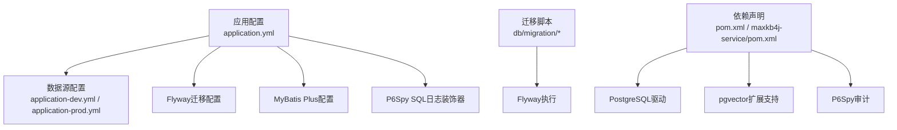
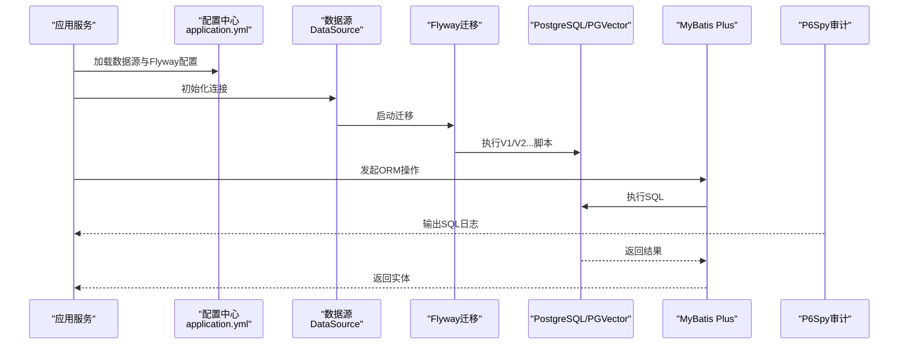
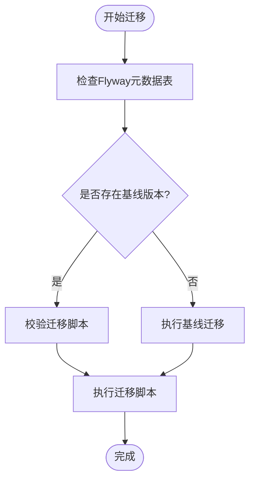
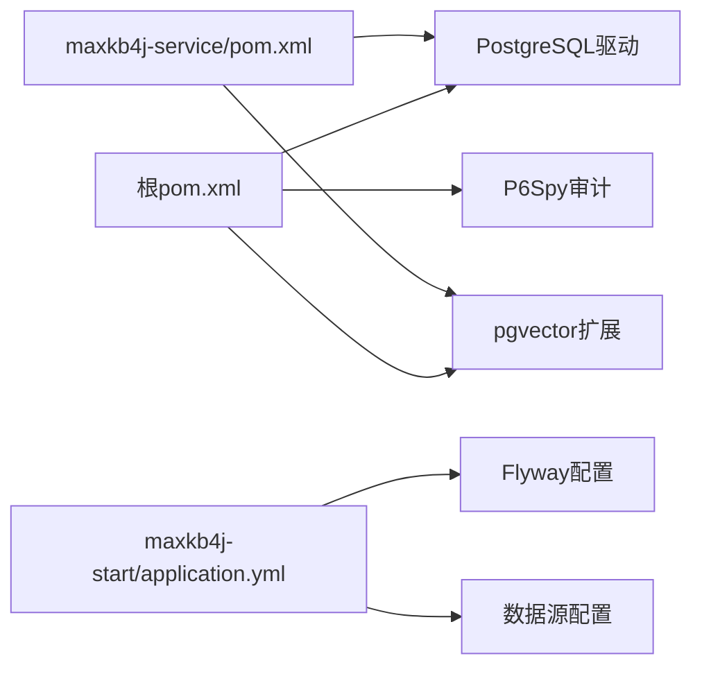

# 数据库问题排查

<cite>
**本文引用的文件**   
- [application.yml](file://maxkb4j-start/src/main/resources/application.yml)
- [application-dev.yml](file://maxkb4j-start/src/main/resources/application-dev.yml)
- [application-prod.yml](file://maxkb4j-start/src/main/resources/application-prod.yml)
- [V1__init_tables.sql](file://maxkb4j-start/src/main/resources/db/migration/V1__init_tables.sql)
- [V2__add_table.sql](file://maxkb4j-start/src/main/resources/db/migration/V2__add_table.sql)
- [pom.xml](file://pom.xml)
- [maxkb4j-service/pom.xml](file://maxkb4j-service/pom.xml)
- [docker-compose.dev.yml](file://docker-compose.dev.yml)
- [ApiException.java](file://maxkb4j-common/src/main/java/com/maxkb4j/common/exception/ApiException.java)
- [AccessException.java](file://maxkb4j-common/src/main/java/com/maxkb4j/common/exception/AccessException.java)
</cite>

## 目录
1. [简介](#简介)
2. [项目结构与数据库相关配置概览](#项目结构与数据库相关配置概览)
3. [核心组件与依赖关系](#核心组件与依赖关系)
4. [架构总览](#架构总览)
5. [详细组件分析与排查要点](#详细组件分析与排查要点)
6. [依赖关系分析](#依赖关系分析)
7. [性能问题定位与优化建议](#性能问题定位与优化建议)
8. [故障排查指南](#故障排查指南)
9. [结论](#结论)
10. [附录：最佳实践与迁移建议](#附录最佳实践与迁移建议)

## 简介
本指南面向MaxKB4j在PostgreSQL与pgvector场景下的数据库问题排查，覆盖连接失败、迁移失败、性能问题、数据一致性、备份恢复与数据迁移等主题。文档基于仓库中的配置与迁移脚本进行分析，提供可执行的诊断步骤与可视化图示，帮助快速定位并解决问题。

## 项目结构与数据库相关配置概览
- 配置文件集中于启动模块资源目录，包含Spring Boot数据源、Flyway迁移、MyBatis Plus全局配置、P6Spy SQL日志装饰器等。
- 迁移脚本位于db/migration目录，采用Flyway默认命名规范，包含扩展启用、表结构、索引、约束与外键等DDL。
- 依赖中明确引入PostgreSQL驱动与pgvector扩展支持，并通过P6Spy进行SQL审计。

**图表来源**
- [application.yml:1-69](file://maxkb4j-start/src/main/resources/application.yml#L1-L69)
- [application-dev.yml:1-11](file://maxkb4j-start/src/main/resources/application-dev.yml#L1-L11)
- [application-prod.yml:1-9](file://maxkb4j-start/src/main/resources/application-prod.yml#L1-L9)
- [pom.xml:132-175](file://pom.xml#L132-L175)
- [maxkb4j-service/pom.xml:34-97](file://maxkb4j-service/pom.xml#L34-L97)

**章节来源**
- [application.yml:1-69](file://maxkb4j-start/src/main/resources/application.yml#L1-L69)
- [application-dev.yml:1-11](file://maxkb4j-start/src/main/resources/application-dev.yml#L1-L11)
- [application-prod.yml:1-9](file://maxkb4j-start/src/main/resources/application-prod.yml#L1-L9)
- [pom.xml:132-175](file://pom.xml#L132-L175)
- [maxkb4j-service/pom.xml:34-97](file://maxkb4j-service/pom.xml#L34-L97)

## 核心组件与依赖关系
- 数据源与驱动
  - 明确使用PostgreSQL驱动类名与URL格式，适用于本地或容器化部署。
  - Docker编排提供PostgreSQL与pgvector镜像及初始化参数，便于快速复现环境。
- 迁移与版本控制
  - Flyway启用，迁移脚本位于classpath:db/migration，按顺序执行。
  - 初始脚本启用vector扩展，后续脚本新增业务表，体现向量检索能力。
- ORM与SQL审计
  - MyBatis Plus全局配置开启表/列加双引号格式，mapper与类型处理器包扫描。
  - P6Spy装饰器用于SQL日志输出，便于定位慢查询与异常SQL。

**章节来源**
- [application-dev.yml:1-11](file://maxkb4j-start/src/main/resources/application-dev.yml#L1-L11)
- [application-prod.yml:1-9](file://maxkb4j-start/src/main/resources/application-prod.yml#L1-L9)
- [application.yml:21-25](file://maxkb4j-start/src/main/resources/application.yml#L21-L25)
- [V1__init_tables.sql:1-800](file://maxkb4j-start/src/main/resources/db/migration/V1__init_tables.sql#L1-L800)
- [V2__add_table.sql:1-17](file://maxkb4j-start/src/main/resources/db/migration/V2__add_table.sql#L1-L17)
- [pom.xml:132-175](file://pom.xml#L132-L175)
- [maxkb4j-service/pom.xml:34-97](file://maxkb4j-service/pom.xml#L34-L97)
- [docker-compose.dev.yml:1-28](file://docker-compose.dev.yml#L1-L28)

## 架构总览
下图展示从应用到数据库的典型调用链路，以及迁移与审计的关键节点。

**图表来源**
- [application.yml:1-69](file://maxkb4j-start/src/main/resources/application.yml#L1-L69)
- [application-dev.yml:1-11](file://maxkb4j-start/src/main/resources/application-dev.yml#L1-L11)
- [application-prod.yml:1-9](file://maxkb4j-start/src/main/resources/application-prod.yml#L1-L9)
- [V1__init_tables.sql:1-800](file://maxkb4j-start/src/main/resources/db/migration/V1__init_tables.sql#L1-L800)
- [V2__add_table.sql:1-17](file://maxkb4j-start/src/main/resources/db/migration/V2__add_table.sql#L1-L17)
- [pom.xml:132-175](file://pom.xml#L132-L175)
- [maxkb4j-service/pom.xml:34-97](file://maxkb4j-service/pom.xml#L34-L97)

## 详细组件分析与排查要点

### 组件一：数据源与连接配置
- 关键点
  - JDBC URL、用户名、密码、驱动类名需与目标数据库一致。
  - 开发/生产环境配置分离，确保不同环境正确加载。
  - 若使用容器化，确认容器网络与端口映射。
- 常见问题
  - 连接字符串格式错误、主机不可达、端口不通、认证失败、数据库不存在。
- 排查步骤
  - 检查配置文件对应环境的URL与凭据。
  - 使用ping/nc或telnet验证网络连通性与端口可达。
  - 尝试使用命令行客户端连接验证凭据与权限。
  - 查看应用启动日志中数据源初始化与连接超时信息。

**章节来源**
- [application-dev.yml:1-11](file://maxkb4j-start/src/main/resources/application-dev.yml#L1-L11)
- [application-prod.yml:1-9](file://maxkb4j-start/src/main/resources/application-prod.yml#L1-L9)

### 组件二：Flyway迁移与版本管理
- 关键点
  - Flyway启用，迁移路径为classpath:db/migration。
  - 初始脚本启用vector扩展，后续脚本创建业务表。
  - baseline-on-migrate启用，首次运行会以基线方式处理。
- 常见问题
  - 版本冲突（历史版本缺失或重复）、SQL语法错误、对象已存在、扩展未启用。
- 排查步骤
  - 查看Flyway元数据表状态，确认当前schema_version。
  - 对照迁移脚本逐条验证DDL合法性与兼容性。
  - 若出现“对象已存在”，先清理或回滚至基线版本再重试。
  - 确保PostgreSQL版本与pgvector扩展版本兼容。

**图表来源**
- [application.yml:21-25](file://maxkb4j-start/src/main/resources/application.yml#L21-L25)
- [V1__init_tables.sql:1-800](file://maxkb4j-start/src/main/resources/db/migration/V1__init_tables.sql#L1-L800)
- [V2__add_table.sql:1-17](file://maxkb4j-start/src/main/resources/db/migration/V2__add_table.sql#L1-L17)

**章节来源**
- [application.yml:21-25](file://maxkb4j-start/src/main/resources/application.yml#L21-L25)
- [V1__init_tables.sql:1-800](file://maxkb4j-start/src/main/resources/db/migration/V1__init_tables.sql#L1-L800)
- [V2__add_table.sql:1-17](file://maxkb4j-start/src/main/resources/db/migration/V2__add_table.sql#L1-L17)

### 组件三：ORM配置与SQL审计
- 关键点
  - MyBatis Plus开启表/列双引号格式，mapper与类型处理器包扫描。
  - P6Spy装饰器可输出SQL执行时间与原始SQL，便于定位问题。
- 常见问题
  - 类型处理器未生效导致JSON/数组字段异常、SQL格式不匹配。
- 排查步骤
  - 确认类型处理器包扫描路径与实体注解一致。
  - 临时开启P6SPY日志，观察实际执行SQL与参数绑定。
  - 对比实体字段与表结构，核对大小写与约束。

**章节来源**
- [application.yml:28-36](file://maxkb4j-start/src/main/resources/application.yml#L28-L36)
- [application.yml:60-66](file://maxkb4j-start/src/main/resources/application.yml#L60-L66)
- [maxkb4j-service/pom.xml:34-97](file://maxkb4j-service/pom.xml#L34-L97)

### 组件四：PostgreSQL与pgvector特定问题
- 关键点
  - 迁移脚本显式启用vector扩展，业务表包含向量字段与索引。
  - Docker编排提供pgvector镜像，便于本地复现。
- 常见问题
  - 扩展未安装/启用、向量维度不匹配、Gin/Gist索引缺失导致检索性能差。
- 排查步骤
  - 确认数据库已启用vector扩展。
  - 校验embedding表的dimension与模型维度一致。
  - 检查向量相似度检索SQL与索引使用情况。

**章节来源**
- [V1__init_tables.sql:1-800](file://maxkb4j-start/src/main/resources/db/migration/V1__init_tables.sql#L1-L800)
- [docker-compose.dev.yml:1-28](file://docker-compose.dev.yml#L1-L28)

## 依赖关系分析
- 外部依赖
  - PostgreSQL驱动与pgvector扩展由根pom与service层pom统一声明。
  - P6Spy作为SQL审计依赖，配合装饰器配置启用日志输出。
- 内部模块
  - 启动模块负责配置与迁移；服务模块负责业务实现与ORM交互。
- 循环依赖风险
  - 从现有结构看，模块间无直接循环依赖迹象，但需避免在业务层直接耦合底层驱动细节。

**图表来源**
- [pom.xml:132-175](file://pom.xml#L132-L175)
- [maxkb4j-service/pom.xml:34-97](file://maxkb4j-service/pom.xml#L34-L97)
- [application.yml:1-69](file://maxkb4j-start/src/main/resources/application.yml#L1-L69)

**章节来源**
- [pom.xml:132-175](file://pom.xml#L132-L175)
- [maxkb4j-service/pom.xml:34-97](file://maxkb4j-service/pom.xml#L34-L97)
- [application.yml:1-69](file://maxkb4j-start/src/main/resources/application.yml#L1-L69)

## 性能问题定位与优化建议
- 慢查询定位
  - 启用P6Spy日志，筛选高耗时SQL，结合执行计划分析索引使用情况。
  - 关注向量检索SQL与全文检索索引（tsvector）的使用。
- 锁等待与并发
  - 观察事务隔离级别与锁等待超时设置，避免长事务持有行锁。
  - 对高频更新表采用批量提交与合理的分区策略。
- 连接池耗尽
  - 校验连接池最大连接数、空闲超时与获取超时阈值。
  - 结合应用日志与数据库pg_stat_statements（如可用）分析连接占用。

[本节为通用性能指导，无需具体文件引用]

## 故障排查指南

### 一、数据库连接失败
- 症状
  - 应用启动报连接超时、拒绝连接、认证失败。
- 诊断步骤
  - 确认开发/生产配置文件中的URL、用户名、密码与驱动类名。
  - 使用网络工具验证主机与端口连通性。
  - 使用命令行客户端尝试连接，排除驱动或权限问题。
  - 查看应用启动日志中的数据源初始化与异常堆栈。
- 参考文件
  - [application-dev.yml:1-11](file://maxkb4j-start/src/main/resources/application-dev.yml#L1-L11)
  - [application-prod.yml:1-9](file://maxkb4j-start/src/main/resources/application-prod.yml#L1-L9)

**章节来源**
- [application-dev.yml:1-11](file://maxkb4j-start/src/main/resources/application-dev.yml#L1-L11)
- [application-prod.yml:1-9](file://maxkb4j-start/src/main/resources/application-prod.yml#L1-L9)

### 二、Flyway迁移失败
- 症状
  - 迁移中断、版本冲突、SQL语法错误、对象已存在。
- 诊断步骤
  - 查看Flyway元数据表，确认当前版本与待执行版本。
  - 对照迁移脚本，逐条验证DDL合法性与兼容性。
  - 若对象已存在，先清理或回滚至基线版本再重试。
  - 确保PostgreSQL与pgvector版本兼容，扩展已启用。
- 参考文件
  - [application.yml:21-25](file://maxkb4j-start/src/main/resources/application.yml#L21-L25)
  - [V1__init_tables.sql:1-800](file://maxkb4j-start/src/main/resources/db/migration/V1__init_tables.sql#L1-L800)
  - [V2__add_table.sql:1-17](file://maxkb4j-start/src/main/resources/db/migration/V2__add_table.sql#L1-L17)

**章节来源**
- [application.yml:21-25](file://maxkb4j-start/src/main/resources/application.yml#L21-L25)
- [V1__init_tables.sql:1-800](file://maxkb4j-start/src/main/resources/db/migration/V1__init_tables.sql#L1-L800)
- [V2__add_table.sql:1-17](file://maxkb4j-start/src/main/resources/db/migration/V2__add_table.sql#L1-L17)

### 三、数据一致性问题
- 症状
  - 查询结果与预期不符、主从不一致、索引缺失导致查询异常。
- 诊断步骤
  - 对比实体与表结构定义，核对字段类型、约束与索引。
  - 检查JSON/数组字段的类型处理器是否正确映射。
  - 使用P6Spy日志核对最终执行SQL与参数。
- 参考文件
  - [application.yml:28-36](file://maxkb4j-start/src/main/resources/application.yml#L28-L36)
  - [maxkb4j-service/pom.xml:34-97](file://maxkb4j-service/pom.xml#L34-L97)

**章节来源**
- [application.yml:28-36](file://maxkb4j-start/src/main/resources/application.yml#L28-L36)
- [maxkb4j-service/pom.xml:34-97](file://maxkb4j-service/pom.xml#L34-L97)

### 四、PostgreSQL与pgvector特定问题
- 症状
  - 向量扩展未启用、检索性能差、维度不匹配。
- 诊断步骤
  - 确认数据库已启用vector扩展。
  - 校验embedding表的dimension与模型维度一致。
  - 检查向量相似度检索SQL与索引使用情况。
- 参考文件
  - [V1__init_tables.sql:1-800](file://maxkb4j-start/src/main/resources/db/migration/V1__init_tables.sql#L1-L800)
  - [docker-compose.dev.yml:1-28](file://docker-compose.dev.yml#L1-L28)

**章节来源**
- [V1__init_tables.sql:1-800](file://maxkb4j-start/src/main/resources/db/migration/V1__init_tables.sql#L1-L800)
- [docker-compose.dev.yml:1-28](file://docker-compose.dev.yml#L1-L28)

### 五、异常与错误处理
- 症状
  - 运行期抛出自定义异常，影响业务流程。
- 诊断步骤
  - 定位异常抛出处，结合上下文判断是业务异常还是系统异常。
  - 对于访问类异常，检查权限与鉴权逻辑。
- 参考文件
  - [ApiException.java:1-30](file://maxkb4j-common/src/main/java/com/maxkb4j/common/exception/ApiException.java#L1-L30)
  - [AccessException.java:1-9](file://maxkb4j-common/src/main/java/com/maxkb4j/common/exception/AccessException.java#L1-L9)

**章节来源**
- [ApiException.java:1-30](file://maxkb4j-common/src/main/java/com/maxkb4j/common/exception/ApiException.java#L1-L30)
- [AccessException.java:1-9](file://maxkb4j-common/src/main/java/com/maxkb4j/common/exception/AccessException.java#L1-L9)

## 结论
MaxKB4j的数据库问题排查应围绕“连接配置—迁移执行—ORM与审计—扩展与性能”四个维度展开。通过对照配置文件与迁移脚本、启用SQL审计、核对扩展与索引、以及分场景定位异常，可高效定位并解决大多数数据库相关问题。建议在生产环境实施严格的迁移前检查与回滚预案，并持续利用审计日志进行性能与稳定性监控。

## 附录：最佳实践与迁移建议
- 迁移前准备
  - 备份数据库，记录当前schema_version与关键表结构。
  - 在测试环境复现迁移流程，验证DDL与数据类型兼容性。
- 迁移执行
  - 优先执行基础扩展与核心表，再逐步引入业务表与索引。
  - 对大表变更采用分批处理与维护窗口，避免长时间锁表。
- 性能与监控
  - 启用P6Spy日志，定期审查慢查询与异常SQL。
  - 对向量检索与全文检索建立并维护索引，定期分析执行计划。
- 备份与恢复
  - 使用数据库原生命令或容器卷快照进行备份。
  - 制定恢复演练计划，验证备份数据的完整性与可恢复性。
- 数据迁移
  - 采用结构与数据分离的迁移策略，先迁移结构，再迁移数据。
  - 对JSON/数组字段进行类型转换与兼容性验证，确保类型处理器正确映射。

[本节为通用最佳实践，无需具体文件引用]