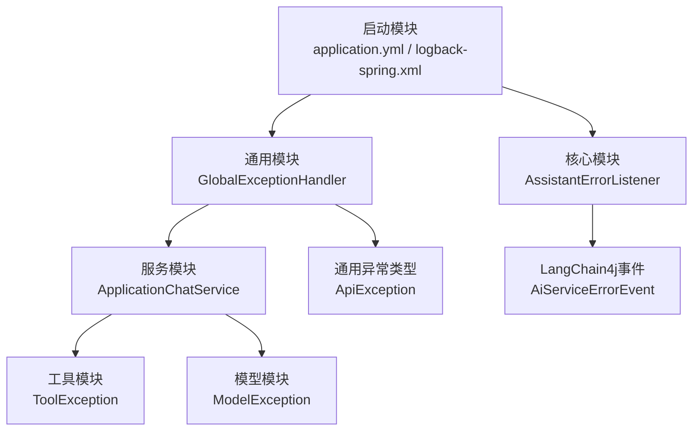
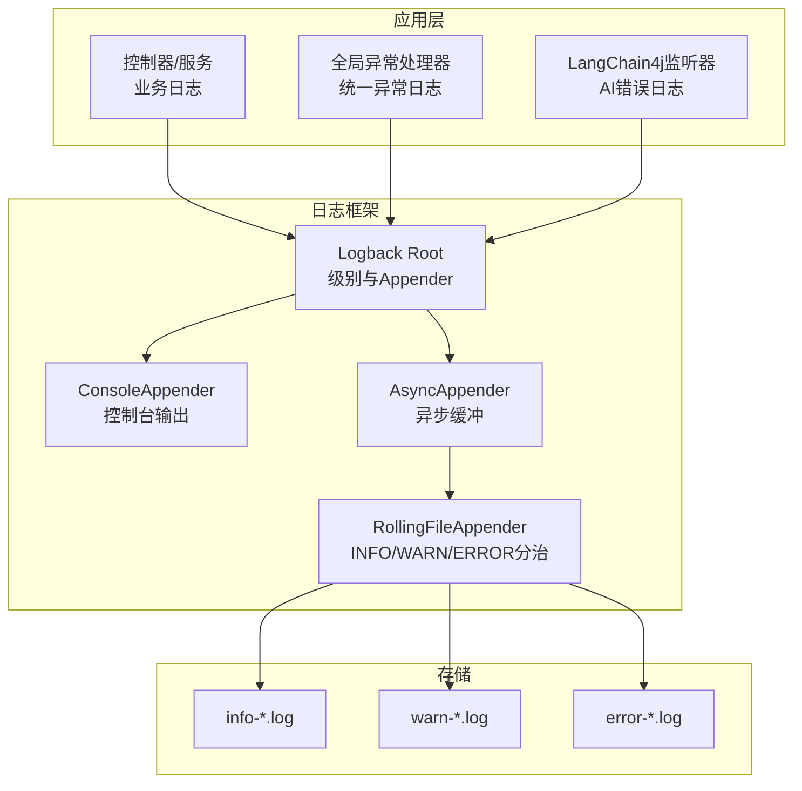
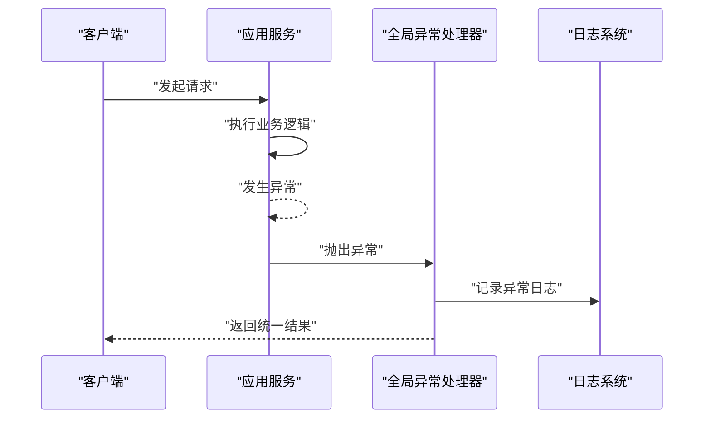
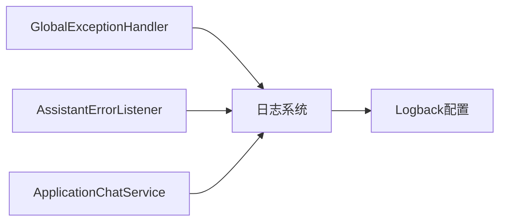
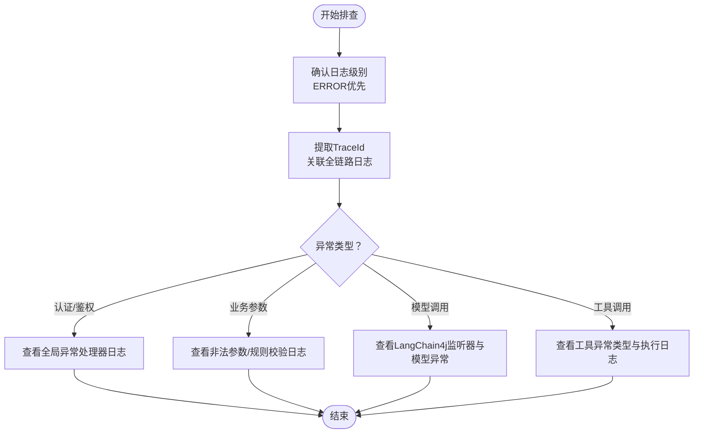

# 日志分析与诊断

<cite>
**本文引用的文件**
- [logback-spring.xml](file://maxkb4j-start/src/main/resources/logback-spring.xml)
- [application.yml](file://maxkb4j-start/src/main/resources/application.yml)
- [application-dev.yml](file://maxkb4j-start/src/main/resources/application-dev.yml)
- [application-prod.yml](file://maxkb4j-start/src/main/resources/application-prod.yml)
- [GlobalExceptionHandler.java](file://maxkb4j-common/src/main/java/com/maxkb4j/common/handler/GlobalExceptionHandler.java)
- [AssistantErrorListener.java](file://maxkb4j-core/src/main/java/com/maxkb4j/core/listener/AssistantErrorListener.java)
- [ApplicationChatService.java](file://maxkb4j-service/maxkb4j-application/src/main/java/com/maxkb4j/application/service/ApplicationChatService.java)
- [ApiException.java](file://maxkb4j-common/src/main/java/com/maxkb4j/common/exception/ApiException.java)
- [ModelException.java](file://maxkb4j-service/maxkb4j-model/src/main/java/com/maxkb4j/model/exception/ModelException.java)
- [ToolException.java](file://maxkb4j-service/maxkb4j-tool/src/main/java/com/maxkb4j/tool/exception/ToolException.java)
- [SpringUtil.java](file://maxkb4j-common/src/main/java/com/maxkb4j/common/util/SpringUtil.java)
- [WebUtil.java](file://maxkb4j-common/src/main/java/com/maxkb4j/common/util/WebUtil.java)
</cite>

## 目录
1. [简介](#简介)
2. [项目结构](#项目结构)
3. [核心组件](#核心组件)
4. [架构总览](#架构总览)
5. [详细组件分析](#详细组件分析)
6. [依赖分析](#依赖分析)
7. [性能考量](#性能考量)
8. [故障排查指南](#故障排查指南)
9. [结论](#结论)
10. [附录](#附录)

## 简介
本指南面向MaxKB4j的日志分析与诊断，聚焦于Logback配置、日志级别策略（开发/测试/生产）、关键日志信息的解读方法（错误堆栈、请求追踪、性能指标）、异常日志分类与处理（全局异常、工作流异常、模型调用异常）、日志聚合与分析工具集成（ELK/Prometheus）、日志轮转与存储最佳实践以及日志安全与隐私保护。内容基于仓库中实际存在的配置与代码实现，帮助读者快速定位问题、优化可观测性并保障生产稳定。

## 项目结构
MaxKB4j采用多模块Maven工程，日志相关的关键位置如下：
- 配置层：启动模块提供Spring Boot配置与Logback配置文件
- 异常层：通用模块提供全局异常处理器
- 核心监听层：核心模块提供LangChain4j错误监听器
- 服务层：应用服务在异步任务中显式记录异常日志
- 工具与异常类型：工具与模型模块提供特定异常类型

图表来源
- [logback-spring.xml:1-157](file://maxkb4j-start/src/main/resources/logback-spring.xml#L1-L157)
- [application.yml:1-69](file://maxkb4j-start/src/main/resources/application.yml#L1-L69)
- [GlobalExceptionHandler.java:1-168](file://maxkb4j-common/src/main/java/com/maxkb4j/common/handler/GlobalExceptionHandler.java#L1-L168)
- [AssistantErrorListener.java:1-14](file://maxkb4j-core/src/main/java/com/maxkb4j/core/listener/AssistantErrorListener.java#L1-L14)
- [ApplicationChatService.java:126-147](file://maxkb4j-service/maxkb4j-application/src/main/java/com/maxkb4j/application/service/ApplicationChatService.java#L126-L147)
- [ApiException.java:1-30](file://maxkb4j-common/src/main/java/com/maxkb4j/common/exception/ApiException.java#L1-L30)
- [ModelException.java:1-12](file://maxkb4j-service/maxkb4j-model/src/main/java/com/maxkb4j/model/exception/ModelException.java#L1-L12)
- [ToolException.java:1-29](file://maxkb4j-service/maxkb4j-tool/src/main/java/com/maxkb4j/tool/exception/ToolException.java#L1-L29)

章节来源
- [logback-spring.xml:1-157](file://maxkb4j-start/src/main/resources/logback-spring.xml#L1-L157)
- [application.yml:1-69](file://maxkb4j-start/src/main/resources/application.yml#L1-L69)

## 核心组件
- Logback配置与输出策略：控制台彩色输出、INFO/WARN/ERROR三色分治落盘、异步队列缓冲、按日期与大小滚动、阈值过滤与标记排除
- 全局异常处理：集中捕获认证、鉴权、参数、业务、速率限制、加密、登录等异常，统一返回与日志记录
- LangChain4j错误监听：捕获AI服务错误事件并记录
- 应用服务异步日志：在CompletableFuture异常路径显式记录异常
- 日志级别与模块控制：根级别、系统包级别、第三方库级别分级控制

章节来源
- [logback-spring.xml:111-157](file://maxkb4j-start/src/main/resources/logback-spring.xml#L111-L157)
- [GlobalExceptionHandler.java:35-163](file://maxkb4j-common/src/main/java/com/maxkb4j/common/handler/GlobalExceptionHandler.java#L35-L163)
- [AssistantErrorListener.java:8-13](file://maxkb4j-core/src/main/java/com/maxkb4j/core/listener/AssistantErrorListener.java#L8-L13)
- [ApplicationChatService.java:139-147](file://maxkb4j-service/maxkb4j-application/src/main/java/com/maxkb4j/application/service/ApplicationChatService.java#L139-L147)

## 架构总览
下图展示日志从应用到落盘与异步缓冲的整体路径，以及异常处理与LangChain4j事件的接入点。

图表来源
- [logback-spring.xml:16-109](file://maxkb4j-start/src/main/resources/logback-spring.xml#L16-L109)
- [GlobalExceptionHandler.java:35-163](file://maxkb4j-common/src/main/java/com/maxkb4j/common/handler/GlobalExceptionHandler.java#L35-L163)
- [AssistantErrorListener.java:8-13](file://maxkb4j-core/src/main/java/com/maxkb4j/core/listener/AssistantErrorListener.java#L8-L13)

## 详细组件分析

### Logback配置与日志级别策略
- 输出目标与格式
  - 控制台：彩色输出，包含时间、线程、TraceId、Logger、级别与消息
  - 文件：统一格式，包含时间、线程、TraceId、Logger、级别与消息
- 分级落盘
  - INFO：info-*.log（阈值过滤，排除特定标记）
  - WARN：warn-*.log（仅接收WARN）
  - ERROR：error-*.log（仅接收ERROR）
- 异步缓冲
  - INFO/WARN/ERROR分别配置独立AsyncAppender，队列大小与丢弃阈值按级别设定
- 环境策略
  - dev/prod/profile默认均输出控制台并落盘INFO/WARN/ERROR
- 模块级别
  - 根级别INFO；系统包com.maxkb4j为INFO；第三方如Spring、MyBatis、LangChain4j、MongoDB、Logback等按需降级

章节来源
- [logback-spring.xml:1-157](file://maxkb4j-start/src/main/resources/logback-spring.xml#L1-L157)

### 开发/测试/生产环境日志策略
- 开发环境（dev）
  - 输出控制台与INFO/WARN/ERROR异步落盘，便于本地调试
- 测试/默认环境
  - 与开发类似，确保日志可见性
- 生产环境（prod）
  - 同样输出控制台，便于容器日志采集；INFO/WARN/ERROR异步落盘，降低同步IO对业务影响

章节来源
- [logback-spring.xml:111-129](file://maxkb4j-start/src/main/resources/logback-spring.xml#L111-L129)

### 关键日志信息的解读方法
- 时间与线程
  - 时间戳用于定位事件发生顺序与延时；线程名有助于识别并发热点
- TraceId
  - 日志模式包含TraceId占位，建议在网关或拦截器注入TraceId，便于跨服务链路追踪
- Logger与级别
  - 区分INFO/WARN/ERROR，快速识别问题严重程度
- 堆栈与上下文
  - 全局异常处理器与LangChain4j监听器均记录异常堆栈，结合业务参数与用户标识进行复盘

章节来源
- [logback-spring.xml:8-13](file://maxkb4j-start/src/main/resources/logback-spring.xml#L8-L13)
- [GlobalExceptionHandler.java:35-163](file://maxkb4j-common/src/main/java/com/maxkb4j/common/handler/GlobalExceptionHandler.java#L35-L163)
- [AssistantErrorListener.java:8-13](file://maxkb4j-core/src/main/java/com/maxkb4j/core/listener/AssistantErrorListener.java#L8-L13)

### 异常日志分类与处理
- 全局异常捕获
  - 认证/鉴权类：未登录、权限不足、JWT异常
  - 参数与业务类：非法参数、业务规则校验失败、登录异常、访问限制
  - 平台与加密类：RSA解密异常、未知异常
  - 结果：统一返回R结构并记录对应级别日志
- LangChain4j错误
  - 捕获AiServiceErrorEvent，记录错误消息
- 应用服务异步异常
  - CompletableFuture异常路径显式记录异常，必要时向客户端回传错误

图表来源
- [GlobalExceptionHandler.java:35-163](file://maxkb4j-common/src/main/java/com/maxkb4j/common/handler/GlobalExceptionHandler.java#L35-L163)
- [ApplicationChatService.java:139-147](file://maxkb4j-service/maxkb4j-application/src/main/java/com/maxkb4j/application/service/ApplicationChatService.java#L139-L147)

章节来源
- [GlobalExceptionHandler.java:35-163](file://maxkb4j-common/src/main/java/com/maxkb4j/common/handler/GlobalExceptionHandler.java#L35-L163)
- [AssistantErrorListener.java:8-13](file://maxkb4j-core/src/main/java/com/maxkb4j/core/listener/AssistantErrorListener.java#L8-L13)
- [ApplicationChatService.java:139-147](file://maxkb4j-service/maxkb4j-application/src/main/java/com/maxkb4j/application/service/ApplicationChatService.java#L139-L147)

### 日志聚合与分析工具集成
- ELK Stack（Elasticsearch/Filebeat/Logstash/Kibana）
  - 使用RollingFileAppender生成INFO/WARN/ERROR日志文件，配合Filebeat收集至Logstash/Elasticsearch
  - 在Kibana中构建仪表板，按TraceId、Logger、级别、时间序列检索
- Prometheus/Grafana
  - 若需指标化日志（如错误率、响应时长），可在应用侧埋点或通过日志解析生成指标
  - Grafana中以日志查询语言（如PromQL）或日志面板展示趋势
- 建议
  - 统一日志字段（TraceId、应用名、模块、级别、时间、消息体）
  - 对敏感字段脱敏（见“日志安全与隐私保护”）

（本节为概念性说明，无需文件来源）

### 日志轮转与存储策略最佳实践
- 轮转策略
  - 按日期与文件大小滚动，避免单文件过大
  - 控制保留天数与总容量上限，防止磁盘耗尽
- 异步落盘
  - INFO/WARN/ERROR分别异步落盘，提高吞吐并降低阻塞
- 存储与备份
  - 定期归档历史日志，保留合规要求的最短期限
  - 配置监控与告警，当磁盘使用率接近阈值时预警

章节来源
- [logback-spring.xml:24-85](file://maxkb4j-start/src/main/resources/logback-spring.xml#L24-L85)

### 日志安全与隐私保护
- 敏感信息脱敏
  - 用户密码、Token、Cookie、请求体中的敏感字段在日志中脱敏显示
- 日志最小化
  - 仅记录必要的上下文信息，避免泄露业务细节
- 访问控制
  - 日志文件权限最小化，仅允许运维与审计访问
- 合规与审计
  - 明确日志保留期限与销毁流程，满足数据主体权利与监管要求

（本节为通用指导，无需文件来源）

## 依赖分析
- 全局异常处理器依赖Spring MVC与统一返回结构，覆盖常见运行时异常
- LangChain4j监听器依赖LangChain4j事件API，捕获AI服务错误
- 应用服务在异步执行中显式记录异常，保证异常路径可观测
- 日志框架通过Logback配置实现分级落盘与异步缓冲

图表来源
- [GlobalExceptionHandler.java:31-33](file://maxkb4j-common/src/main/java/com/maxkb4j/common/handler/GlobalExceptionHandler.java#L31-L33)
- [AssistantErrorListener.java:7-8](file://maxkb4j-core/src/main/java/com/maxkb4j/core/listener/AssistantErrorListener.java#L7-L8)
- [ApplicationChatService.java:139-147](file://maxkb4j-service/maxkb4j-application/src/main/java/com/maxkb4j/application/service/ApplicationChatService.java#L139-L147)
- [logback-spring.xml:111-129](file://maxkb4j-start/src/main/resources/logback-spring.xml#L111-L129)

章节来源
- [GlobalExceptionHandler.java:31-33](file://maxkb4j-common/src/main/java/com/maxkb4j/common/handler/GlobalExceptionHandler.java#L31-L33)
- [AssistantErrorListener.java:7-8](file://maxkb4j-core/src/main/java/com/maxkb4j/core/listener/AssistantErrorListener.java#L7-L8)
- [ApplicationChatService.java:139-147](file://maxkb4j-service/maxkb4j-application/src/main/java/com/maxkb4j/application/service/ApplicationChatService.java#L139-L147)
- [logback-spring.xml:111-129](file://maxkb4j-start/src/main/resources/logback-spring.xml#L111-L129)

## 性能考量
- 异步日志缓冲
  - INFO/WARN/ERROR分别配置不同队列长度与丢弃阈值，平衡延迟与吞吐
- 过滤与阈值
  - INFO使用阈值过滤与标记排除，减少重复与噪声
- 第三方库日志降噪
  - 对Spring、MyBatis、LangChain4j、MongoDB等设置合理级别，避免过度输出

章节来源
- [logback-spring.xml:35-46](file://maxkb4j-start/src/main/resources/logback-spring.xml#L35-L46)
- [logback-spring.xml:142-156](file://maxkb4j-start/src/main/resources/logback-spring.xml#L142-L156)

## 故障排查指南
- 快速定位
  - 使用TraceId串联一次请求的全链路日志
  - 优先查看ERROR级别日志，再回溯WARN与INFO
- 常见场景
  - 认证/鉴权失败：检查全局异常处理器对未登录、权限不足、JWT异常的记录
  - 业务参数错误：关注非法参数与业务规则校验失败日志
  - 模型调用异常：结合LangChain4j监听器与模型模块异常类型定位
  - 工具调用异常：关注工具模块异常类型与工具执行日志
- 异步任务异常
  - 确认CompletableFuture异常路径是否记录日志并回传错误

章节来源
- [GlobalExceptionHandler.java:35-163](file://maxkb4j-common/src/main/java/com/maxkb4j/common/handler/GlobalExceptionHandler.java#L35-L163)
- [AssistantErrorListener.java:8-13](file://maxkb4j-core/src/main/java/com/maxkb4j/core/listener/AssistantErrorListener.java#L8-L13)
- [ModelException.java:1-12](file://maxkb4j-service/maxkb4j-model/src/main/java/com/maxkb4j/model/exception/ModelException.java#L1-L12)
- [ToolException.java:1-29](file://maxkb4j-service/maxkb4j-tool/src/main/java/com/maxkb4j/tool/exception/ToolException.java#L1-L29)
- [ApplicationChatService.java:139-147](file://maxkb4j-service/maxkb4j-application/src/main/java/com/maxkb4j/application/service/ApplicationChatService.java#L139-L147)

## 结论
MaxKB4j的日志体系以Logback为核心，结合全局异常处理、LangChain4j监听与应用服务异步日志，形成覆盖全链路的可观测能力。通过分级别落盘、异步缓冲与合理的模块日志级别，既能满足开发调试需求，又能在生产环境中保持较低的I/O开销。配合ELK/Prometheus等工具，可进一步实现日志聚合、检索与指标化监控。遵循脱敏、最小化与合规原则，可有效规避日志安全风险。

## 附录
- 配置文件与关键片段路径
  - [Logback配置:1-157](file://maxkb4j-start/src/main/resources/logback-spring.xml#L1-L157)
  - [Spring主配置:1-69](file://maxkb4j-start/src/main/resources/application.yml#L1-L69)
  - [开发环境配置:1-11](file://maxkb4j-start/src/main/resources/application-dev.yml#L1-L11)
  - [生产环境配置:1-9](file://maxkb4j-start/src/main/resources/application-prod.yml#L1-L9)
- 异常与监听
  - [全局异常处理器:35-163](file://maxkb4j-common/src/main/java/com/maxkb4j/common/handler/GlobalExceptionHandler.java#L35-L163)
  - [LangChain4j错误监听器:8-13](file://maxkb4j-core/src/main/java/com/maxkb4j/core/listener/AssistantErrorListener.java#L8-L13)
  - [应用服务异步异常日志:139-147](file://maxkb4j-service/maxkb4j-application/src/main/java/com/maxkb4j/application/service/ApplicationChatService.java#L139-L147)
- 异常类型
  - [业务异常ApiException:1-30](file://maxkb4j-common/src/main/java/com/maxkb4j/common/exception/ApiException.java#L1-L30)
  - [模型异常ModelException:1-12](file://maxkb4j-service/maxkb4j-model/src/main/java/com/maxkb4j/model/exception/ModelException.java#L1-L12)
  - [工具异常ToolException:1-29](file://maxkb4j-service/maxkb4j-tool/src/main/java/com/maxkb4j/tool/exception/ToolException.java#L1-L29)
- 工具与辅助
  - [Spring工具类（含事件发布日志）:52-62](file://maxkb4j-common/src/main/java/com/maxkb4j/common/util/SpringUtil.java#L52-L62)
  - [Web工具类（渲染JSON时的日志）:69-83](file://maxkb4j-common/src/main/java/com/maxkb4j/common/util/WebUtil.java#L69-L83)