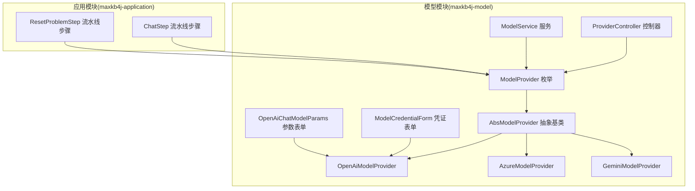
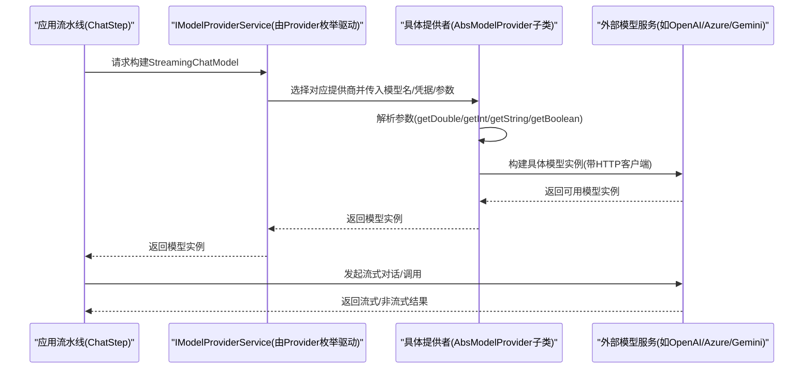
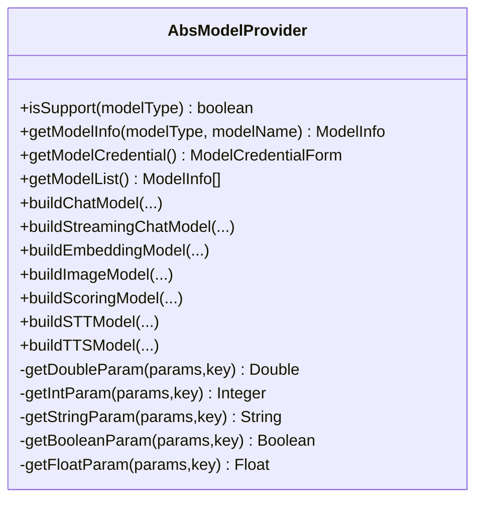
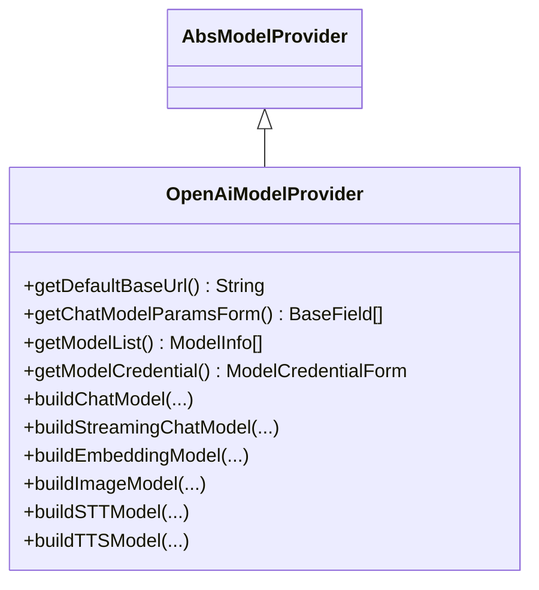
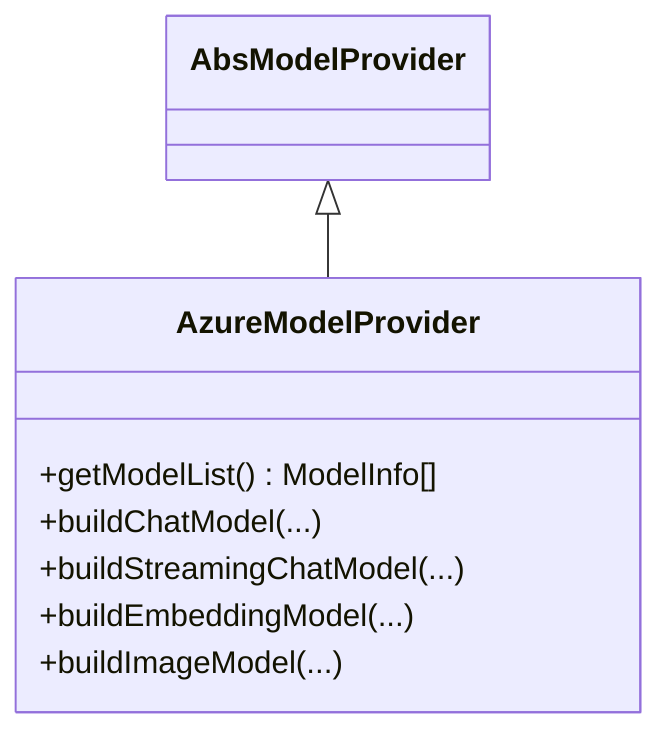
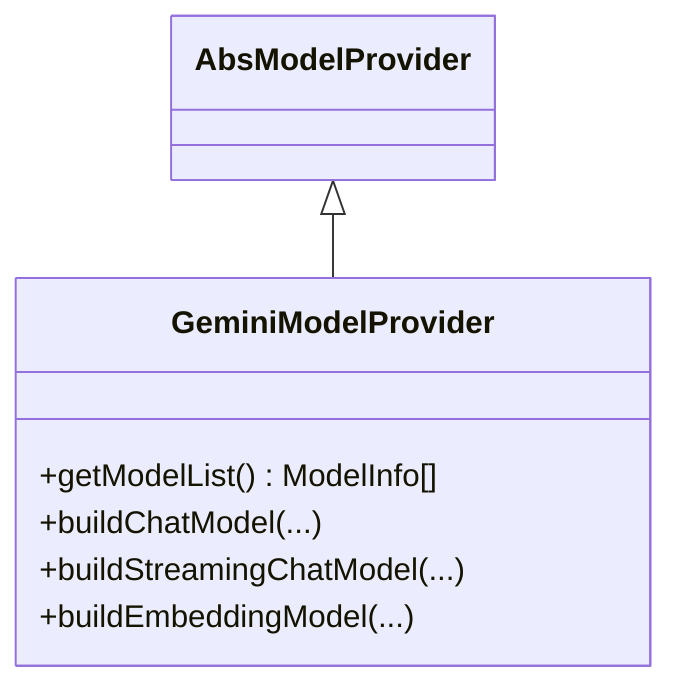
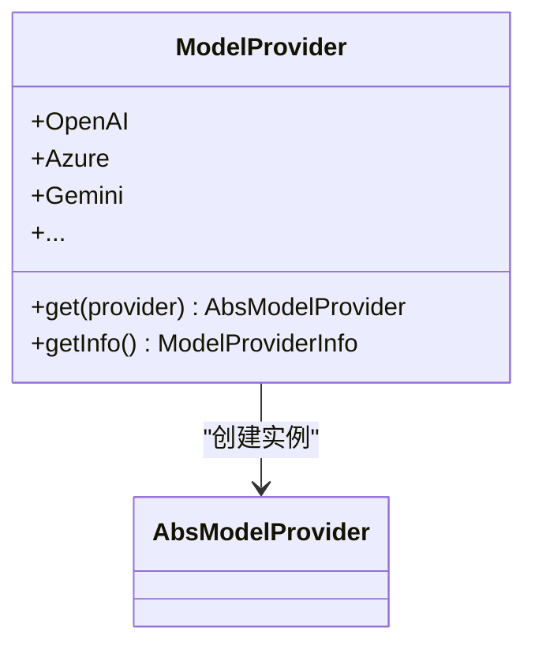
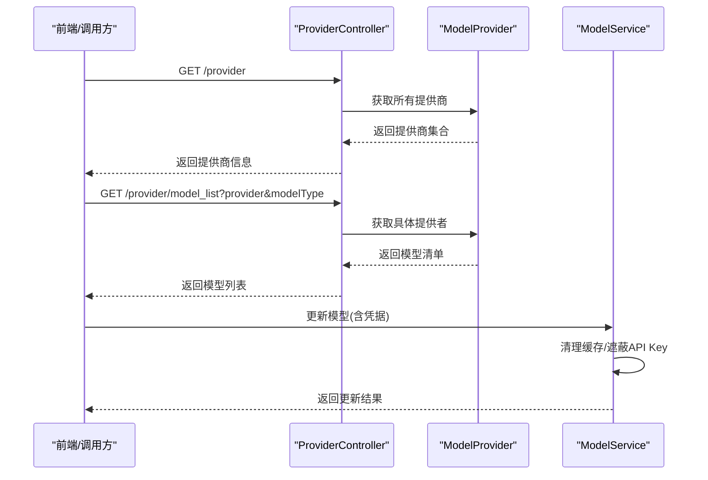
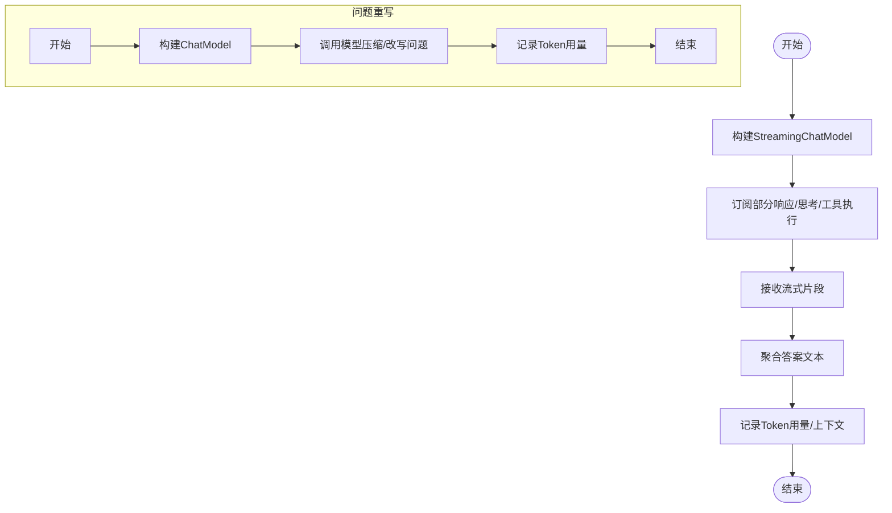
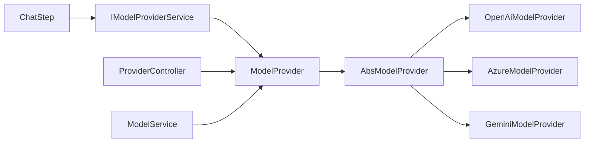

# 模型集成问题排查

<cite>
**本文引用的文件**
- [AbsModelProvider.java](file://maxkb4j-service/maxkb4j-model/src/main/java/com/maxkb4j/model/provider/AbsModelProvider.java)
- [OpenAiModelProvider.java](file://maxkb4j-service/maxkb4j-model/src/main/java/com/maxkb4j/model/provider/OpenAiModelProvider.java)
- [AzureModelProvider.java](file://maxkb4j-service/maxkb4j-model/src/main/java/com/maxkb4j/model/provider/AzureModelProvider.java)
- [GeminiModelProvider.java](file://maxkb4j-service/maxkb4j-model/src/main/java/com/maxkb4j/model/provider/GeminiModelProvider.java)
- [ModelCredentialForm.java](file://maxkb4j-service/maxkb4j-model/src/main/java/com/maxkb4j/model/custom/credential/ModelCredentialForm.java)
- [OpenAiChatModelParams.java](file://maxkb4j-service/maxkb4j-model/src/main/java/com/maxkb4j/model/custom/params/impl/OpenAiChatModelParams.java)
- [ProviderController.java](file://maxkb4j-service/maxkb4j-model/src/main/java/com/maxkb4j/model/controller/ProviderController.java)
- [ModelService.java](file://maxkb4j-service/maxkb4j-model/src/main/java/com/maxkb4j/model/service/ModelService.java)
- [ModelException.java](file://maxkb4j-service/maxkb4j-model/src/main/java/com/maxkb4j/model/exception/ModelException.java)
- [ModelProvider.java](file://maxkb4j-service/maxkb4j-model/src/main/java/com/maxkb4j/model/enums/ModelProvider.java)
- [ChatStep.java](file://maxkb4j-service/maxkb4j-application/src/main/java/com/maxkb4j/application/pipeline/step/chatstep/impl/ChatStep.java)
- [ResetProblemStep.java](file://maxkb4j-service/maxkb4j-application/src/main/java/com/maxkb4j/application/pipeline/step/resetproblemstep/impl/ResetProblemStep.java)
- [README.md](file://README.md)
</cite>

## 目录
1. [简介](#简介)
2. [项目结构](#项目结构)
3. [核心组件](#核心组件)
4. [架构总览](#架构总览)
5. [详细组件分析](#详细组件分析)
6. [依赖分析](#依赖分析)
7. [性能考虑](#性能考虑)
8. [故障排查指南](#故障排查指南)
9. [结论](#结论)
10. [附录](#附录)

## 简介
本指南面向MaxKB4j的模型集成与运行维护人员，聚焦于主流模型提供商（OpenAI、Azure、Gemini等）在实际部署与使用过程中可能遇到的连接问题、参数配置问题、请求超时、响应解析异常、资源限制以及性能瓶颈等。文档基于仓库源码进行系统化梳理，提供可落地的排查步骤、可视化流程图与回滚建议，帮助快速定位并解决问题。

## 项目结构
MaxKB4j采用多模块分层设计，模型集成相关能力主要集中在maxkb4j-model模块，通过抽象的模型提供者接口对接不同外部模型服务，并由应用流水线在运行时构建具体模型实例完成对话、嵌入、图像等任务。

图表来源
- [AbsModelProvider.java:36-244](file://maxkb4j-service/maxkb4j-model/src/main/java/com/maxkb4j/model/provider/AbsModelProvider.java#L36-L244)
- [OpenAiModelProvider.java:29-125](file://maxkb4j-service/maxkb4j-model/src/main/java/com/maxkb4j/model/provider/OpenAiModelProvider.java#L29-L125)
- [AzureModelProvider.java:21-77](file://maxkb4j-service/maxkb4j-model/src/main/java/com/maxkb4j/model/provider/AzureModelProvider.java#L21-L77)
- [GeminiModelProvider.java:19-65](file://maxkb4j-service/maxkb4j-model/src/main/java/com/maxkb4j/model/provider/GeminiModelProvider.java#L19-L65)
- [ModelProvider.java:11-95](file://maxkb4j-service/maxkb4j-model/src/main/java/com/maxkb4j/model/enums/ModelProvider.java#L11-L95)
- [ProviderController.java:27-88](file://maxkb4j-service/maxkb4j-model/src/main/java/com/maxkb4j/model/controller/ProviderController.java#L27-L88)
- [ModelService.java:40-173](file://maxkb4j-service/maxkb4j-model/src/main/java/com/maxkb4j/model/service/ModelService.java#L40-L173)
- [ModelCredentialForm.java:10-37](file://maxkb4j-service/maxkb4j-model/src/main/java/com/maxkb4j/model/custom/credential/ModelCredentialForm.java#L10-L37)
- [OpenAiChatModelParams.java:12-21](file://maxkb4j-service/maxkb4j-model/src/main/java/com/maxkb4j/model/custom/params/impl/OpenAiChatModelParams.java#L12-L21)
- [ChatStep.java:33-99](file://maxkb4j-service/maxkb4j-application/src/main/java/com/maxkb4j/application/pipeline/step/chatstep/impl/ChatStep.java#L33-L99)
- [ResetProblemStep.java:22-44](file://maxkb4j-service/maxkb4j-application/src/main/java/com/maxkb4j/application/pipeline/step/resetproblemstep/impl/ResetProblemStep.java#L22-L44)

章节来源
- [README.md:31-44](file://README.md#L31-L44)

## 核心组件
- 抽象模型提供者：定义统一的模型构建接口与通用参数解析工具，屏蔽不同提供商差异。
- 具体模型提供者：针对OpenAI、Azure、Gemini等提供具体的模型实例构建逻辑。
- 枚举与注册：通过枚举集中管理所有提供商，并提供映射查询。
- 控制器与服务：对外暴露模型与凭证配置的查询接口，支撑前端动态渲染与校验。
- 应用流水线：在运行时根据模型配置构建StreamingChatModel或ChatModel，驱动对话与问题重写等步骤。

章节来源
- [AbsModelProvider.java:36-244](file://maxkb4j-service/maxkb4j-model/src/main/java/com/maxkb4j/model/provider/AbsModelProvider.java#L36-L244)
- [OpenAiModelProvider.java:29-125](file://maxkb4j-service/maxkb4j-model/src/main/java/com/maxkb4j/model/provider/OpenAiModelProvider.java#L29-L125)
- [AzureModelProvider.java:21-77](file://maxkb4j-service/maxkb4j-model/src/main/java/com/maxkb4j/model/provider/AzureModelProvider.java#L21-L77)
- [GeminiModelProvider.java:19-65](file://maxkb4j-service/maxkb4j-model/src/main/java/com/maxkb4j/model/provider/GeminiModelProvider.java#L19-L65)
- [ModelProvider.java:11-95](file://maxkb4j-service/maxkb4j-model/src/main/java/com/maxkb4j/model/enums/ModelProvider.java#L11-L95)
- [ProviderController.java:27-88](file://maxkb4j-service/maxkb4j-model/src/main/java/com/maxkb4j/model/controller/ProviderController.java#L27-L88)
- [ModelService.java:40-173](file://maxkb4j-service/maxkb4j-model/src/main/java/com/maxkb4j/model/service/ModelService.java#L40-L173)
- [ChatStep.java:33-99](file://maxkb4j-service/maxkb4j-application/src/main/java/com/maxkb4j/application/pipeline/step/chatstep/impl/ChatStep.java#L33-L99)
- [ResetProblemStep.java:22-44](file://maxkb4j-service/maxkb4j-application/src/main/java/com/maxkb4j/application/pipeline/step/resetproblemstep/impl/ResetProblemStep.java#L22-L44)

## 架构总览
下图展示从应用流水线到具体模型提供者的调用链路，以及控制器与服务层对模型配置的支撑。

图表来源
- [ChatStep.java:40-90](file://maxkb4j-service/maxkb4j-application/src/main/java/com/maxkb4j/application/pipeline/step/chatstep/impl/ChatStep.java#L40-L90)
- [AbsModelProvider.java:68-115](file://maxkb4j-service/maxkb4j-model/src/main/java/com/maxkb4j/model/provider/AbsModelProvider.java#L68-L115)
- [OpenAiModelProvider.java:66-91](file://maxkb4j-service/maxkb4j-model/src/main/java/com/maxkb4j/model/provider/OpenAiModelProvider.java#L66-L91)
- [AzureModelProvider.java:43-60](file://maxkb4j-service/maxkb4j-model/src/main/java/com/maxkb4j/model/provider/AzureModelProvider.java#L43-L60)
- [GeminiModelProvider.java:36-55](file://maxkb4j-service/maxkb4j-model/src/main/java/com/maxkb4j/model/provider/GeminiModelProvider.java#L36-L55)

## 详细组件分析

### 抽象模型提供者与参数解析
- 统一参数解析：提供安全的Double/Integer/String/Boolean/Float解析方法，避免空值导致的异常。
- HTTP客户端复用：延迟初始化并复用HTTP客户端，降低构建开销。
- 可扩展点：未支持的模型类型默认禁用，便于按需启用。

图表来源
- [AbsModelProvider.java:36-244](file://maxkb4j-service/maxkb4j-model/src/main/java/com/maxkb4j/model/provider/AbsModelProvider.java#L36-L244)

章节来源
- [AbsModelProvider.java:36-244](file://maxkb4j-service/maxkb4j-model/src/main/java/com/maxkb4j/model/provider/AbsModelProvider.java#L36-L244)

### OpenAI 提供商
- 默认基础地址与模型清单：内置常用LLM、嵌入、语音与图像模型。
- 参数表单：温度、最大tokens、是否返回思考。
- 模型构建：支持同步与流式对话、嵌入、图像生成；HTTP客户端注入以支持代理与超时配置。

图表来源
- [OpenAiModelProvider.java:29-125](file://maxkb4j-service/maxkb4j-model/src/main/java/com/maxkb4j/model/provider/OpenAiModelProvider.java#L29-L125)
- [OpenAiChatModelParams.java:12-21](file://maxkb4j-service/maxkb4j-model/src/main/java/com/maxkb4j/model/custom/params/impl/OpenAiChatModelParams.java#L12-L21)
- [ModelCredentialForm.java:10-37](file://maxkb4j-service/maxkb4j-model/src/main/java/com/maxkb4j/model/custom/credential/ModelCredentialForm.java#L10-L37)

章节来源
- [OpenAiModelProvider.java:29-125](file://maxkb4j-service/maxkb4j-model/src/main/java/com/maxkb4j/model/provider/OpenAiModelProvider.java#L29-L125)
- [OpenAiChatModelParams.java:12-21](file://maxkb4j-service/maxkb4j-model/src/main/java/com/maxkb4j/model/custom/params/impl/OpenAiChatModelParams.java#L12-L21)
- [ModelCredentialForm.java:10-37](file://maxkb4j-service/maxkb4j-model/src/main/java/com/maxkb4j/model/custom/credential/ModelCredentialForm.java#L10-L37)

### Azure OpenAI 提供商
- 部署名作为模型名：构建时使用部署名而非模型名。
- 支持同步与流式对话、嵌入与图像模型。

图表来源
- [AzureModelProvider.java:21-77](file://maxkb4j-service/maxkb4j-model/src/main/java/com/maxkb4j/model/provider/AzureModelProvider.java#L21-L77)

章节来源
- [AzureModelProvider.java:21-77](file://maxkb4j-service/maxkb4j-model/src/main/java/com/maxkb4j/model/provider/AzureModelProvider.java#L21-L77)

### Gemini 提供商
- 支持LLM与嵌入模型；流式与非流式对话构建。
- 参数包含最大输出tokens与温度。

图表来源
- [GeminiModelProvider.java:19-65](file://maxkb4j-service/maxkb4j-model/src/main/java/com/maxkb4j/model/provider/GeminiModelProvider.java#L19-L65)

章节来源
- [GeminiModelProvider.java:19-65](file://maxkb4j-service/maxkb4j-model/src/main/java/com/maxkb4j/model/provider/GeminiModelProvider.java#L19-L65)

### 模型提供者枚举与注册
- 枚举集中管理提供商名称、图标与实例化逻辑。
- 提供静态映射，按提供商名称快速获取具体提供者实例。

图表来源
- [ModelProvider.java:11-95](file://maxkb4j-service/maxkb4j-model/src/main/java/com/maxkb4j/model/enums/ModelProvider.java#L11-L95)

章节来源
- [ModelProvider.java:11-95](file://maxkb4j-service/maxkb4j-model/src/main/java/com/maxkb4j/model/enums/ModelProvider.java#L11-L95)

### 控制器与服务：模型与凭证配置
- 控制器：提供查询提供商列表、模型类型、模型清单、参数表单等接口。
- 服务：模型信息缓存、凭据遮罩、更新与删除等。

图表来源
- [ProviderController.java:31-85](file://maxkb4j-service/maxkb4j-model/src/main/java/com/maxkb4j/model/controller/ProviderController.java#L31-L85)
- [ModelService.java:120-131](file://maxkb4j-service/maxkb4j-model/src/main/java/com/maxkb4j/model/service/ModelService.java#L120-L131)

章节来源
- [ProviderController.java:31-85](file://maxkb4j-service/maxkb4j-model/src/main/java/com/maxkb4j/model/controller/ProviderController.java#L31-L85)
- [ModelService.java:120-131](file://maxkb4j-service/maxkb4j-model/src/main/java/com/maxkb4j/model/service/ModelService.java#L120-L131)

### 应用流水线：对话与问题重写
- 对话步骤：构建流式模型，订阅部分响应与工具执行事件，聚合最终回答并记录token用量。
- 问题重写步骤：构建非流式模型，压缩与改写用户问题，记录token用量。

图表来源
- [ChatStep.java:40-99](file://maxkb4j-service/maxkb4j-application/src/main/java/com/maxkb4j/application/pipeline/step/chatstep/impl/ChatStep.java#L40-L99)
- [ResetProblemStep.java:27-44](file://maxkb4j-service/maxkb4j-application/src/main/java/com/maxkb4j/application/pipeline/step/resetproblemstep/impl/ResetProblemStep.java#L27-L44)

章节来源
- [ChatStep.java:40-99](file://maxkb4j-service/maxkb4j-application/src/main/java/com/maxkb4j/application/pipeline/step/chatstep/impl/ChatStep.java#L40-L99)
- [ResetProblemStep.java:27-44](file://maxkb4j-service/maxkb4j-application/src/main/java/com/maxkb4j/application/pipeline/step/resetproblemstep/impl/ResetProblemStep.java#L27-L44)

## 依赖分析
- 组件耦合：应用流水线通过IModelProviderService间接依赖Provider枚举与具体提供者，降低直接耦合。
- 外部依赖：各提供者通过LangChain4j适配不同模型服务，HTTP客户端统一由抽象类提供。
- 循环依赖：当前结构未见循环依赖迹象，提供者与控制器/服务之间为单向依赖。

图表来源
- [ChatStep.java:35-36](file://maxkb4j-service/maxkb4j-application/src/main/java/com/maxkb4j/application/pipeline/step/chatstep/impl/ChatStep.java#L35-L36)
- [ModelProvider.java:48-66](file://maxkb4j-service/maxkb4j-model/src/main/java/com/maxkb4j/model/enums/ModelProvider.java#L48-L66)
- [AbsModelProvider.java:36-53](file://maxkb4j-service/maxkb4j-model/src/main/java/com/maxkb4j/model/provider/AbsModelProvider.java#L36-L53)
- [ProviderController.java:37-38](file://maxkb4j-service/maxkb4j-model/src/main/java/com/maxkb4j/model/controller/ProviderController.java#L37-L38)
- [ModelService.java:164-171](file://maxkb4j-service/maxkb4j-model/src/main/java/com/maxkb4j/model/service/ModelService.java#L164-L171)

章节来源
- [ChatStep.java:35-36](file://maxkb4j-service/maxkb4j-application/src/main/java/com/maxkb4j/application/pipeline/step/chatstep/impl/ChatStep.java#L35-L36)
- [ModelProvider.java:48-66](file://maxkb4j-service/maxkb4j-model/src/main/java/com/maxkb4j/model/enums/ModelProvider.java#L48-L66)
- [AbsModelProvider.java:36-53](file://maxkb4j-service/maxkb4j-model/src/main/java/com/maxkb4j/model/provider/AbsModelProvider.java#L36-L53)
- [ProviderController.java:37-38](file://maxkb4j-service/maxkb4j-model/src/main/java/com/maxkb4j/model/controller/ProviderController.java#L37-L38)
- [ModelService.java:164-171](file://maxkb4j-service/maxkb4j-model/src/main/java/com/maxkb4j/model/service/ModelService.java#L164-L171)

## 性能考虑
- 并发与吞吐：项目特性描述中强调基于虚拟线程与响应式编程，具备高并发与低延迟能力，适合大规模并发请求场景。
- 缓存策略：模型服务对模型实体设置了短时缓存，减少数据库访问压力。
- Token统计：流水线步骤记录消息与回答的Token用量，便于成本与性能监控。

章节来源
- [README.md:36-37](file://README.md#L36-L37)
- [ModelService.java:45-52](file://maxkb4j-service/maxkb4j-model/src/main/java/com/maxkb4j/model/service/ModelService.java#L45-L52)
- [ChatStep.java:93-97](file://maxkb4j-service/maxkb4j-application/src/main/java/com/maxkb4j/application/pipeline/step/chatstep/impl/ChatStep.java#L93-L97)
- [ResetProblemStep.java:38-40](file://maxkb4j-service/maxkb4j-application/src/main/java/com/maxkb4j/application/pipeline/step/resetproblemstep/impl/ResetProblemStep.java#L38-L40)

## 故障排查指南

### 一、API密钥配置错误
- 现象
  - 认证失败、401/403等鉴权错误。
  - 响应解析异常或空响应。
- 排查步骤
  - 确认模型配置中的API Key是否正确填写且未被遮蔽。
  - 若前端显示为遮蔽状态，确认更新时未误用遮蔽值。
  - 检查默认基础地址是否与提供商要求一致（OpenAI默认地址由提供者类给出）。
- 关联实现
  - 凭证表单字段与默认基础地址由提供者类与表单类共同决定。
  - 模型服务在更新时会清理缓存并遮蔽敏感信息。

章节来源
- [ModelCredentialForm.java:27-36](file://maxkb4j-service/maxkb4j-model/src/main/java/com/maxkb4j/model/custom/credential/ModelCredentialForm.java#L27-L36)
- [OpenAiModelProvider.java:47-49](file://maxkb4j-service/maxkb4j-model/src/main/java/com/maxkb4j/model/provider/OpenAiModelProvider.java#L47-L49)
- [ModelService.java:120-131](file://maxkb4j-service/maxkb4j-model/src/main/java/com/maxkb4j/model/service/ModelService.java#L120-L131)

### 二、网络代理与超时问题
- 现象
  - 请求超时、连接失败、DNS解析异常。
- 排查步骤
  - 检查HTTP客户端是否正确注入，确保代理与超时配置生效。
  - 在OpenAI/Azure/Gemini等提供者构建模型时，确认HTTP客户端已注入。
  - 如需代理，请在部署环境配置系统级代理或容器网络代理。
- 关联实现
  - 抽象提供者统一构建HTTP客户端并注入到各模型实例。

章节来源
- [AbsModelProvider.java:44-60](file://maxkb4j-service/maxkb4j-model/src/main/java/com/maxkb4j/model/provider/AbsModelProvider.java#L44-L60)
- [OpenAiModelProvider.java:67-70](file://maxkb4j-service/maxkb4j-model/src/main/java/com/maxkb4j/model/provider/OpenAiModelProvider.java#L67-L70)
- [AzureModelProvider.java:44-46](file://maxkb4j-service/maxkb4j-model/src/main/java/com/maxkb4j/model/provider/AzureModelProvider.java#L44-L46)
- [GeminiModelProvider.java:38-40](file://maxkb4j-service/maxkb4j-model/src/main/java/com/maxkb4j/model/provider/GeminiModelProvider.java#L38-L40)

### 三、请求格式验证与参数不匹配
- 现象
  - 参数缺失或类型不匹配导致构建失败或行为异常。
- 排查步骤
  - 使用控制器接口查询模型参数表单，核对必填项与取值范围。
  - OpenAI参数包含温度、最大tokens、是否返回思考；Azure/Gemini参数略有差异。
  - 抽象提供者提供安全的参数解析方法，避免空指针。
- 关联实现
  - 参数表单由具体提供者类或模型信息定义。
  - 抽象提供者提供参数解析工具方法。

章节来源
- [ProviderController.java:55-73](file://maxkb4j-service/maxkb4j-model/src/main/java/com/maxkb4j/model/controller/ProviderController.java#L55-L73)
- [OpenAiChatModelParams.java:14-20](file://maxkb4j-service/maxkb4j-model/src/main/java/com/maxkb4j/model/custom/params/impl/OpenAiChatModelParams.java#L14-L20)
- [AbsModelProvider.java:68-115](file://maxkb4j-service/maxkb4j-model/src/main/java/com/maxkb4j/model/provider/AbsModelProvider.java#L68-L115)

### 四、响应解析错误与资源限制
- 现象
  - 响应为空、格式异常、Token用量为null。
- 排查步骤
  - 确认模型返回的Token用量是否可用，若为空则无法统计成本。
  - 检查提供商配额与速率限制，必要时升级账户或调整并发。
  - 观察流式回调是否正常触发，排查网络中断或服务端异常。
- 关联实现
  - 流水线步骤在完成时读取Token用量并写入上下文。
  - Azure/Gemini等提供者在构建时传入最大输出tokens等参数。

章节来源
- [ChatStep.java:93-97](file://maxkb4j-service/maxkb4j-application/src/main/java/com/maxkb4j/application/pipeline/step/chatstep/impl/ChatStep.java#L93-L97)
- [ResetProblemStep.java:38-40](file://maxkb4j-service/maxkb4j-application/src/main/java/com/maxkb4j/application/pipeline/step/resetproblemstep/impl/ResetProblemStep.java#L38-L40)
- [AzureModelProvider.java:47-48](file://maxkb4j-service/maxkb4j-model/src/main/java/com/maxkb4j/model/provider/AzureModelProvider.java#L47-L48)
- [GeminiModelProvider.java:41-42](file://maxkb4j-service/maxkb4j-model/src/main/java/com/maxkb4j/model/provider/GeminiModelProvider.java#L41-L42)

### 五、不同模型类型的特殊问题
- 嵌入模型维度不匹配
  - 现象：向量维度与向量库期望不一致，检索失败。
  - 排查：确认所选嵌入模型与向量库维度匹配；Azure提供多种嵌入尺寸，Gemini也有独立嵌入模型。
- 推理模型输出格式异常
  - 现象：流式输出片段拼接异常、思考内容未按预期呈现。
  - 排查：检查是否开启返回思考；确认流式回调链路完整；核对模型参数（如最大tokens、温度）。

章节来源
- [OpenAiModelProvider.java:38-42](file://maxkb4j-service/maxkb4j-model/src/main/java/com/maxkb4j/model/provider/OpenAiModelProvider.java#L38-L42)
- [AzureModelProvider.java:28-33](file://maxkb4j-service/maxkb4j-model/src/main/java/com/maxkb4j/model/provider/AzureModelProvider.java#L28-L33)
- [GeminiModelProvider.java:21-27](file://maxkb4j-service/maxkb4j-model/src/main/java/com/maxkb4j/model/provider/GeminiModelProvider.java#L21-L27)
- [ChatStep.java:63-89](file://maxkb4j-service/maxkb4j-application/src/main/java/com/maxkb4j/application/pipeline/step/chatstep/impl/ChatStep.java#L63-L89)

### 六、模型切换与回滚
- 切换步骤
  - 通过控制器查询目标提供商与模型清单，确认可用模型类型与名称。
  - 更新应用配置中的模型ID，保存后即刻生效。
  - 若出现异常，可回滚至上一个稳定模型ID。
- 回滚建议
  - 保留历史模型配置快照，便于一键回滚。
  - 在灰度环境中先小流量切换，观察Token用量与响应时间。

章节来源
- [ProviderController.java:76-85](file://maxkb4j-service/maxkb4j-model/src/main/java/com/maxkb4j/model/controller/ProviderController.java#L76-L85)
- [ModelService.java:120-131](file://maxkb4j-service/maxkb4j-model/src/main/java/com/maxkb4j/model/service/ModelService.java#L120-L131)

## 结论
通过对MaxKB4j模型集成架构的系统化梳理，可以发现其在“抽象统一、参数安全、HTTP客户端复用、运行时构建”等方面具备良好的可维护性与扩展性。结合本文提供的排查步骤与流程图，能够快速定位OpenAI、Azure、Gemini等提供商在认证、网络、参数与性能方面的问题，并通过模型切换与回滚保障业务连续性。

## 附录
- 常用接口参考
  - 查询提供商列表：GET /provider
  - 查询模型类型：GET /provider/model_type_list
  - 查询模型参数表单：GET /provider/model_params_form
  - 查询模型清单：GET /provider/model_list

章节来源
- [ProviderController.java:31-85](file://maxkb4j-service/maxkb4j-model/src/main/java/com/maxkb4j/model/controller/ProviderController.java#L31-L85)