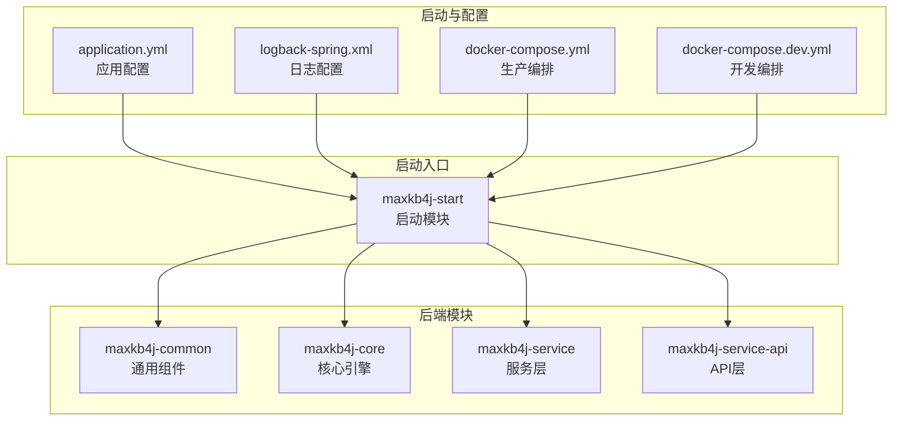
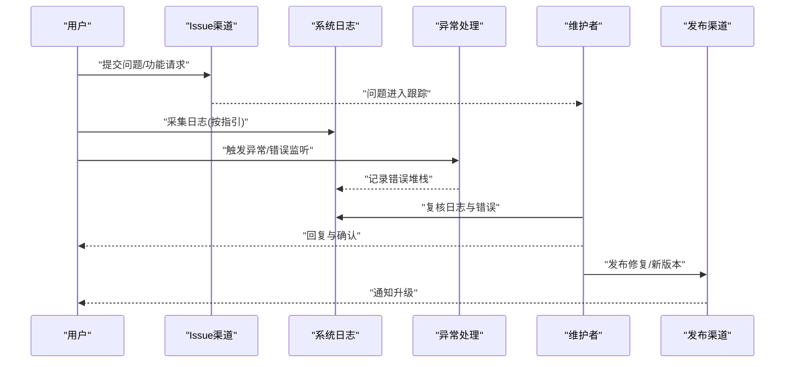
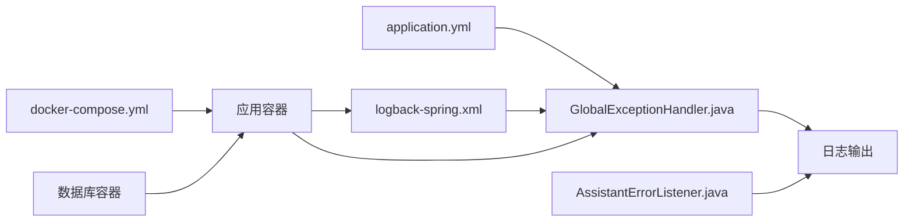
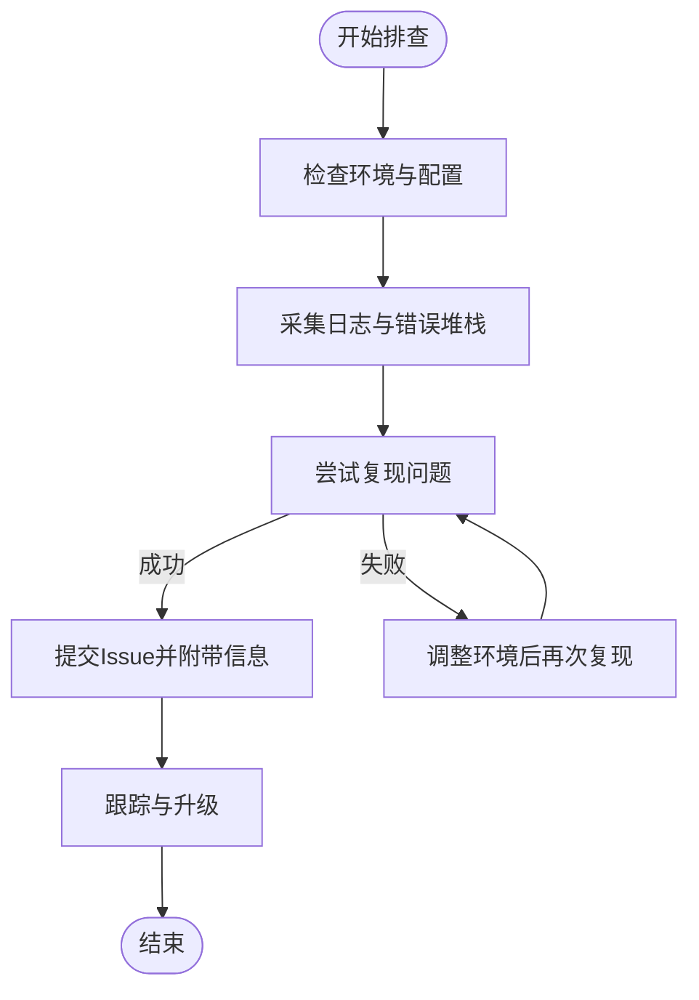

# 社区支持与问题反馈

<cite>
**本文引用的文件**   
- [README.md](file://README.md)
- [README_CN.md](file://README_CN.md)
- [application.yml](file://maxkb4j-start/src/main/resources/application.yml)
- [logback-spring.xml](file://maxkb4j-start/src/main/resources/logback-spring.xml)
- [docker-compose.yml](file://docker-compose.yml)
- [docker-compose.dev.yml](file://docker-compose.dev.yml)
- [GlobalExceptionHandler.java](file://maxkb4j-common/src/main/java/com/maxkb4j/common/handler/GlobalExceptionHandler.java)
- [AssistantErrorListener.java](file://maxkb4j-core/src/main/java/com/maxkb4j/core/listener/AssistantErrorListener.java)
- [ChatSource.java](file://maxkb4j-common/src/main/java/com/maxkb4j/common/enums/ChatSource.java)
</cite>

## 目录
1. [简介](#简介)
2. [项目结构](#项目结构)
3. [核心组件](#核心组件)
4. [架构总览](#架构总览)
5. [详细组件分析](#详细组件分析)
6. [依赖分析](#依赖分析)
7. [性能考虑](#性能考虑)
8. [故障排查指南](#故障排查指南)
9. [结论](#结论)
10. [附录](#附录)

## 简介
本指导文档面向MaxKB4j社区用户与贡献者，提供官方支持渠道、问题反馈标准流程、Bug与功能请求提交规范、社区贡献方式、常见问题自助解决路径以及版本发布与升级指引。文档以仓库中的实际信息为基础，帮助用户高效定位支持资源、正确收集问题信息、规范提交问题与建议，并在必要时进行日志采集与复现。

## 项目结构
MaxKB4j是一个基于Java 21 + Spring Boot 3的企业级智能问答系统，采用模块化分层架构，包含通用组件、核心引擎、服务层、API层与启动模块。项目提供Docker与本地部署方式，并内置日志与异常处理机制，便于问题定位与追踪。

**图表来源**
- [application.yml:1-69](file://maxkb4j-start/src/main/resources/application.yml#L1-L69)
- [logback-spring.xml:1-157](file://maxkb4j-start/src/main/resources/logback-spring.xml#L1-L157)
- [docker-compose.yml:1-58](file://docker-compose.yml#L1-L58)
- [docker-compose.dev.yml:1-28](file://docker-compose.dev.yml#L1-L28)

**章节来源**
- [application.yml:1-69](file://maxkb4j-start/src/main/resources/application.yml#L1-L69)
- [logback-spring.xml:1-157](file://maxkb4j-start/src/main/resources/logback-spring.xml#L1-L157)
- [docker-compose.yml:1-58](file://docker-compose.yml#L1-L58)
- [docker-compose.dev.yml:1-28](file://docker-compose.dev.yml#L1-L28)

## 核心组件
- 支持与赞助渠道：项目README明确提供了Issue提交入口与赞助支持通道，包含不同等级的赞助权益与联系方式。
- 异常与错误处理：全局异常处理器与AI服务错误监听器负责捕获与记录运行期异常，便于问题定位。
- 日志系统：Logback配置了多文件滚动与异步输出，区分INFO/WARN/ERROR级别，便于问题复现与审计。
- 部署与环境：提供Docker Compose与本地JAR两种部署方式，便于快速验证与问题复现。

**章节来源**
- [README.md:120-142](file://README.md#L120-L142)
- [README_CN.md:130-142](file://README_CN.md#L130-L142)
- [GlobalExceptionHandler.java:1-100](file://maxkb4j-common/src/main/java/com/maxkb4j/common/handler/GlobalExceptionHandler.java#L1-L100)
- [AssistantErrorListener.java:1-14](file://maxkb4j-core/src/main/java/com/maxkb4j/core/listener/AssistantErrorListener.java#L1-L14)
- [logback-spring.xml:1-157](file://maxkb4j-start/src/main/resources/logback-spring.xml#L1-L157)

## 架构总览
下图展示了问题反馈与支持流程的关键节点：用户通过Issue渠道提交问题，系统通过日志与异常处理机制记录问题，社区维护者据此进行复现与修复，并通过发布渠道告知用户升级。

**图表来源**
- [README.md:120-142](file://README.md#L120-L142)
- [logback-spring.xml:1-157](file://maxkb4j-start/src/main/resources/logback-spring.xml#L1-L157)
- [GlobalExceptionHandler.java:1-100](file://maxkb4j-common/src/main/java/com/maxkb4j/common/handler/GlobalExceptionHandler.java#L1-L100)
- [AssistantErrorListener.java:1-14](file://maxkb4j-core/src/main/java/com/maxkb4j/core/listener/AssistantErrorListener.java#L1-L14)

## 详细组件分析

### 官方支持渠道
- GitHub/Gitee Issues：用于提交Bug报告与功能请求，建议在提交前先搜索历史Issue，避免重复。
- 赞助与社群：提供不同等级的赞助通道，包含微信联系、核心群组、知识星球等，便于优先沟通与技术支持。
- 文档与资源：README中提供相关资源链接，便于查找模型库、MCP广场与Skills中心等生态资源。

**章节来源**
- [README.md:120-142](file://README.md#L120-L142)
- [README_CN.md:130-142](file://README_CN.md#L130-L142)

### 问题反馈标准流程
- 问题描述：清晰描述现象、期望行为与实际行为，尽量使用简洁标题。
- 环境信息：操作系统、Java版本、数据库版本、部署方式（Docker/本地JAR）、浏览器版本（如涉及前端）。
- 日志收集：按日志配置指引收集INFO/WARN/ERROR级别日志，附带时间戳与关键上下文。
- 复现步骤：提供最小可复现步骤，包括数据准备、接口调用或页面操作顺序。
- 附加信息：截图、配置片段、环境变量、网络拓扑等。

**章节来源**
- [logback-spring.xml:1-157](file://maxkb4j-start/src/main/resources/logback-spring.xml#L1-L157)
- [application.yml:1-69](file://maxkb4j-start/src/main/resources/application.yml#L1-L69)

### Bug报告与功能请求提交规范
- 分类与标签：按问题类型（Bug/功能请求/文档改进/性能）进行归类，便于跟踪。
- 优先级评估：根据影响范围、紧急程度与资源投入进行评估，社区维护者会在Issue中标注状态与计划。
- 跟踪管理：通过Issue编号进行跟踪，维护者会定期同步进展与计划发布版本。

**章节来源**
- [README.md:120-128](file://README.md#L120-L128)
- [README_CN.md:120-128](file://README_CN.md#L120-L128)

### 社区贡献指南
- 代码贡献：遵循阿里巴巴Java编码规范，提交PR前确保包含单元测试与文档更新。
- 文档改进：针对使用说明、部署步骤、FAQ等内容进行补充与修正。
- 问题回答：在Issue与社群中积极回答他人问题，分享最佳实践与经验。

**章节来源**
- [README.md:120-128](file://README.md#L120-L128)
- [README_CN.md:120-128](file://README_CN.md#L120-L128)

### 常见问题与自助解决方案
- 登录与鉴权：检查Sa-Token配置与JWT密钥，确认登录接口可用性。
- 数据库连接：核对PostgreSQL与pgvector、MongoDB连接参数与权限。
- 日志查看：在容器或主机/logs目录下查看INFO/WARN/ERROR日志文件。
- 客户端断开：异步请求中断属于正常情况，系统已静默处理，无需额外干预。

**章节来源**
- [application.yml:37-57](file://maxkb4j-start/src/main/resources/application.yml#L37-L57)
- [docker-compose.yml:44-56](file://docker-compose.yml#L44-L56)
- [logback-spring.xml:77-82](file://maxkb4j-start/src/main/resources/logback-spring.xml#L77-L82)

### 版本发布与升级指南
- 发布说明：关注官方发布的版本说明与变更摘要，了解新增功能与修复内容。
- 升级策略：优先在开发环境验证升级，再逐步迁移至生产；注意数据库迁移脚本与配置变更。
- Docker升级：更新镜像版本后重启容器，确认日志无异常并验证核心功能。

**章节来源**
- [README.md:173-181](file://README.md#L173-L181)
- [README_CN.md:173-181](file://README_CN.md#L173-L181)
- [docker-compose.yml:29-39](file://docker-compose.yml#L29-L39)

## 依赖分析
- 配置与日志：application.yml与logback-spring.xml共同决定运行时行为与可观测性。
- 异常处理：GlobalExceptionHandler集中处理认证、权限、API与通用异常；AssistantErrorListener记录AI服务错误。
- 部署依赖：docker-compose.yml定义数据库与应用服务的依赖关系与卷挂载。

**图表来源**
- [application.yml:1-69](file://maxkb4j-start/src/main/resources/application.yml#L1-L69)
- [logback-spring.xml:1-157](file://maxkb4j-start/src/main/resources/logback-spring.xml#L1-L157)
- [GlobalExceptionHandler.java:1-100](file://maxkb4j-common/src/main/java/com/maxkb4j/common/handler/GlobalExceptionHandler.java#L1-L100)
- [AssistantErrorListener.java:1-14](file://maxkb4j-core/src/main/java/com/maxkb4j/core/listener/AssistantErrorListener.java#L1-L14)
- [docker-compose.yml:1-58](file://docker-compose.yml#L1-L58)

**章节来源**
- [application.yml:1-69](file://maxkb4j-start/src/main/resources/application.yml#L1-L69)
- [logback-spring.xml:1-157](file://maxkb4j-start/src/main/resources/logback-spring.xml#L1-L157)
- [GlobalExceptionHandler.java:1-100](file://maxkb4j-common/src/main/java/com/maxkb4j/common/handler/GlobalExceptionHandler.java#L1-L100)
- [AssistantErrorListener.java:1-14](file://maxkb4j-core/src/main/java/com/maxkb4j/core/listener/AssistantErrorListener.java#L1-L14)
- [docker-compose.yml:1-58](file://docker-compose.yml#L1-L58)

## 性能考虑
- 日志级别与异步输出：INFO/WARN/ERROR分别落盘与异步处理，降低I/O阻塞风险。
- 数据库与缓存：Flyway迁移与Caffeine缓存配置有助于系统稳定性与性能。
- 部署模式：Docker Compose提供一键部署，便于快速验证与问题复现。

**章节来源**
- [logback-spring.xml:87-109](file://maxkb4j-start/src/main/resources/logback-spring.xml#L87-L109)
- [application.yml:19-25](file://maxkb4j-start/src/main/resources/application.yml#L19-L25)

## 故障排查指南
- 客户端断开与SSE：异步请求不可用异常属于正常断开，系统已静默处理，无需额外干预。
- 资源未找到：NoResourceFoundException会根据登录状态重定向至管理页或登录页，检查会话与路由。
- AI服务错误：AssistantErrorListener记录错误消息，结合日志定位具体环节。
- 部署与连接：核对Docker环境变量、端口映射与卷挂载，确保数据库与应用容器健康。

**图表来源**
- [GlobalExceptionHandler.java:77-98](file://maxkb4j-common/src/main/java/com/maxkb4j/common/handler/GlobalExceptionHandler.java#L77-L98)
- [AssistantErrorListener.java:9-13](file://maxkb4j-core/src/main/java/com/maxkb4j/core/listener/AssistantErrorListener.java#L9-L13)
- [logback-spring.xml:77-82](file://maxkb4j-start/src/main/resources/logback-spring.xml#L77-L82)

**章节来源**
- [GlobalExceptionHandler.java:77-98](file://maxkb4j-common/src/main/java/com/maxkb4j/common/handler/GlobalExceptionHandler.java#L77-L98)
- [AssistantErrorListener.java:9-13](file://maxkb4j-core/src/main/java/com/maxkb4j/core/listener/AssistantErrorListener.java#L9-L13)
- [logback-spring.xml:77-82](file://maxkb4j-start/src/main/resources/logback-spring.xml#L77-L82)

## 结论
通过规范的问题反馈流程、完善的日志与异常处理机制、清晰的社区支持渠道与版本发布说明，MaxKB4j能够为用户提供稳定的支持体验。建议在提交问题前充分准备环境信息与日志，并参考社区贡献指南积极参与，共同推动项目演进。

## 附录
- 官方支持与赞助：参见README中的Issue与赞助说明。
- 部署与访问：参考README中的Quick Start与Docker Compose部署说明。
- 相关资源：模型库、MCP广场与Skills中心等生态资源链接。

**章节来源**
- [README.md:120-181](file://README.md#L120-L181)
- [README_CN.md:120-181](file://README_CN.md#L120-L181)