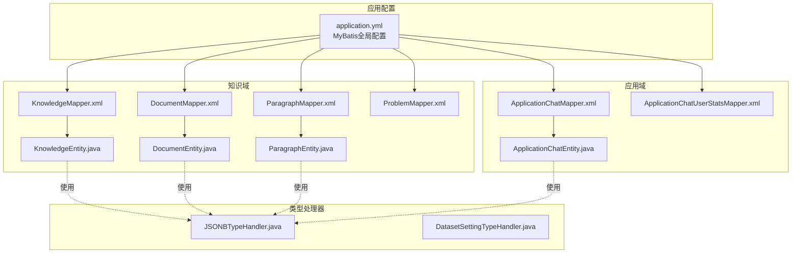
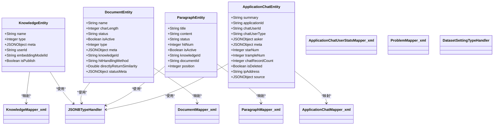
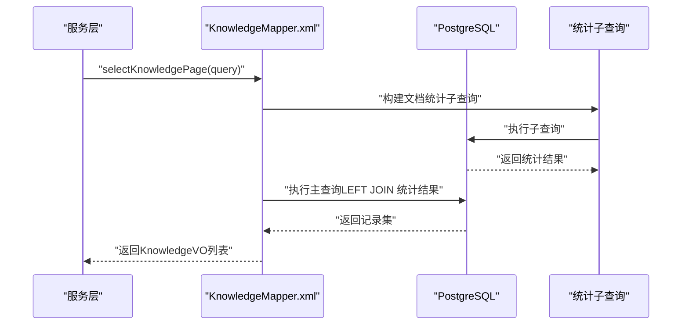
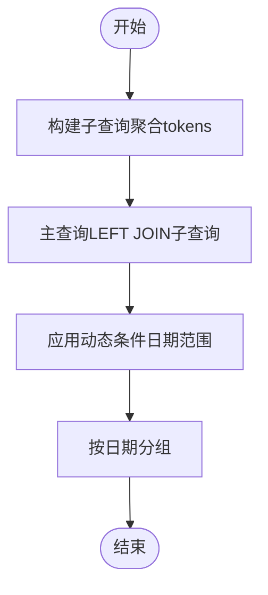
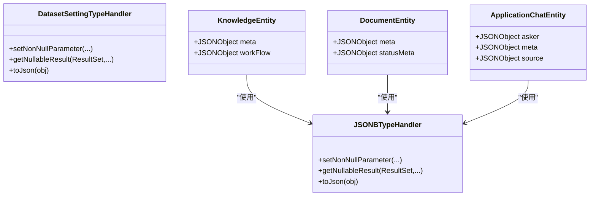
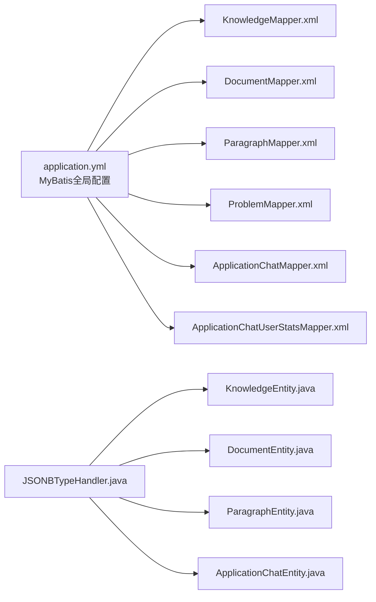

# 实体关系映射

<cite>
**本文引用的文件**
- [application.yml](file://maxkb4j-start/src/main/resources/application.yml)
- [ApplicationChatMapper.xml](file://maxkb4j-service-api/maxkb4j-application-api/src/main/java/com/maxkb4j/application/mapper/ApplicationChatMapper.xml)
- [ApplicationChatUserStatsMapper.xml](file://maxkb4j-service-api/maxkb4j-application-api/src/main/java/com/maxkb4j/application/mapper/ApplicationChatUserStatsMapper.xml)
- [DocumentMapper.xml](file://maxkb4j-service-api/maxkb4j-knowledge-api/src/main/java/com/maxkb4j/knowledge/mapper/DocumentMapper.xml)
- [KnowledgeMapper.xml](file://maxkb4j-service-api/maxkb4j-knowledge-api/src/main/java/com/maxkb4j/knowledge/mapper/KnowledgeMapper.xml)
- [ParagraphMapper.xml](file://maxkb4j-service-api/maxkb4j-knowledge-api/src/main/java/com/maxkb4j/knowledge/mapper/ParagraphMapper.xml)
- [ProblemMapper.xml](file://maxkb4j-service-api/maxkb4j-knowledge-api/src/main/java/com/maxkb4j/knowledge/mapper/ProblemMapper.xml)
- [ApplicationChatEntity.java](file://maxkb4j-service-api/maxkb4j-application-api/src/main/java/com/maxkb4j/application/entity/ApplicationChatEntity.java)
- [DocumentEntity.java](file://maxkb4j-service-api/maxkb4j-knowledge-api/src/main/java/com/maxkb4j/knowledge/entity/DocumentEntity.java)
- [KnowledgeEntity.java](file://maxkb4j-service-api/maxkb4j-knowledge-api/src/main/java/com/maxkb4j/knowledge/entity/KnowledgeEntity.java)
- [ParagraphEntity.java](file://maxkb4j-service-api/maxkb4j-knowledge-api/src/main/java/com/maxkb4j/knowledge/entity/ParagraphEntity.java)
- [JSONBTypeHandler.java](file://maxkb4j-common/src/main/java/com/maxkb4j/common/typehandler/JSONBTypeHandler.java)
- [DatasetSettingTypeHandler.java](file://maxkb4j-common/src/main/java/com/maxkb4j/common/typehandler/DatasetSettingTypeHandler.java)
</cite>

## 目录
1. 引言
2. 项目结构
3. 核心组件
4. 架构总览
5. 详细组件分析
6. 依赖分析
7. 性能考虑
8. 故障排查指南
9. 结论
10. 附录

## 引言
本文件聚焦于MaxKB4j的实体关系映射与MyBatis SQL实现，系统性梳理以下内容：
- MyBatis映射文件设计与SQL实现要点
- 实体与数据库表的映射关系、字段映射规则与类型处理器使用
- 复杂查询（联表、条件、聚合）的SQL实现与动态SQL参数绑定
- 查询性能优化策略、索引建议与查询计划分析方法
- SQL编写规范与调试技巧

## 项目结构
MaxKB4j采用多模块分层架构，MyBatis相关的核心位置如下：
- 映射文件集中于各模块的mapper目录下，命名空间与接口一致，遵循“包名.接口名”的约定
- 实体类位于对应模块的entity目录，使用注解定义表名与字段映射
- 类型处理器位于公共模块的typehandler包，统一处理JSONB等复杂类型

图表来源
- [application.yml:28-36](file://maxkb4j-start/src/main/resources/application.yml#L28-L36)
- [KnowledgeMapper.xml:1-69](file://maxkb4j-service-api/maxkb4j-knowledge-api/src/main/java/com/maxkb4j/knowledge/mapper/KnowledgeMapper.xml#L1-L69)
- [DocumentMapper.xml:1-92](file://maxkb4j-service-api/maxkb4j-knowledge-api/src/main/java/com/maxkb4j/knowledge/mapper/DocumentMapper.xml#L1-L92)
- [ParagraphMapper.xml:1-75](file://maxkb4j-service-api/maxkb4j-knowledge-api/src/main/java/com/maxkb4j/knowledge/mapper/ParagraphMapper.xml#L1-L75)
- [ProblemMapper.xml:1-31](file://maxkb4j-service-api/maxkb4j-knowledge-api/src/main/java/com/maxkb4j/knowledge/mapper/ProblemMapper.xml#L1-L31)
- [ApplicationChatMapper.xml:1-93](file://maxkb4j-service-api/maxkb4j-application-api/src/main/java/com/maxkb4j/application/mapper/ApplicationChatMapper.xml#L1-L93)
- [ApplicationChatUserStatsMapper.xml:1-24](file://maxkb4j-service-api/maxkb4j-application-api/src/main/java/com/maxkb4j/application/mapper/ApplicationChatUserStatsMapper.xml#L1-L24)
- [KnowledgeEntity.java:1-35](file://maxkb4j-service-api/maxkb4j-knowledge-api/src/main/java/com/maxkb4j/knowledge/entity/KnowledgeEntity.java#L1-L35)
- [DocumentEntity.java:1-66](file://maxkb4j-service-api/maxkb4j-knowledge-api/src/main/java/com/maxkb4j/knowledge/entity/DocumentEntity.java#L1-L66)
- [ParagraphEntity.java:1-28](file://maxkb4j-service-api/maxkb4j-knowledge-api/src/main/java/com/maxkb4j/knowledge/entity/ParagraphEntity.java#L1-L28)
- [ApplicationChatEntity.java:1-36](file://maxkb4j-service-api/maxkb4j-application-api/src/main/java/com/maxkb4j/application/entity/ApplicationChatEntity.java#L1-L36)
- [JSONBTypeHandler.java:1-60](file://maxkb4j-common/src/main/java/com/maxkb4j/common/typehandler/JSONBTypeHandler.java#L1-L60)
- [DatasetSettingTypeHandler.java:1-61](file://maxkb4j-common/src/main/java/com/maxkb4j/common/typehandler/DatasetSettingTypeHandler.java#L1-L61)

章节来源
- [application.yml:28-36](file://maxkb4j-start/src/main/resources/application.yml#L28-L36)

## 核心组件
本节从实体到映射文件，再到类型处理器，系统梳理核心组件及职责。

- 实体与表映射
  - 知识域：KnowledgeEntity、DocumentEntity、ParagraphEntity分别映射至knowledge、document、paragraph表
  - 应用域：ApplicationChatEntity映射至application_chat表
  - 注解层面通过@TableName指定表名；部分字段通过@TableField(typeHandler=...)指定类型处理器

- 类型处理器
  - JSONBTypeHandler：负责JSON/JSONB字段在Java与PostgreSQL之间的序列化/反序列化
  - DatasetSettingTypeHandler：用于特定领域设置对象的JSONB持久化

- 映射文件
  - 知识域：KnowledgeMapper.xml、DocumentMapper.xml、ParagraphMapper.xml、ProblemMapper.xml
  - 应用域：ApplicationChatMapper.xml、ApplicationChatUserStatsMapper.xml
  - 均采用标准MyBatis命名空间与动态SQL语法，支持条件查询、分组聚合与批量更新

章节来源
- [KnowledgeEntity.java:18-34](file://maxkb4j-service-api/maxkb4j-knowledge-api/src/main/java/com/maxkb4j/knowledge/entity/KnowledgeEntity.java#L18-L34)
- [DocumentEntity.java:22-45](file://maxkb4j-service-api/maxkb4j-knowledge-api/src/main/java/com/maxkb4j/knowledge/entity/DocumentEntity.java#L22-L45)
- [ParagraphEntity.java:14-27](file://maxkb4j-service-api/maxkb4j-knowledge-api/src/main/java/com/maxkb4j/knowledge/entity/ParagraphEntity.java#L14-L27)
- [ApplicationChatEntity.java:17-35](file://maxkb4j-service-api/maxkb4j-application-api/src/main/java/com/maxkb4j/application/entity/ApplicationChatEntity.java#L17-L35)
- [JSONBTypeHandler.java:15-59](file://maxkb4j-common/src/main/java/com/maxkb4j/common/typehandler/JSONBTypeHandler.java#L15-L59)
- [DatasetSettingTypeHandler.java:15-60](file://maxkb4j-common/src/main/java/com/maxkb4j/common/typehandler/DatasetSettingTypeHandler.java#L15-L60)

## 架构总览
下图展示实体、映射文件与类型处理器之间的关系，以及查询流程的关键节点。

图表来源
- [KnowledgeEntity.java:18-34](file://maxkb4j-service-api/maxkb4j-knowledge-api/src/main/java/com/maxkb4j/knowledge/entity/KnowledgeEntity.java#L18-L34)
- [DocumentEntity.java:22-45](file://maxkb4j-service-api/maxkb4j-knowledge-api/src/main/java/com/maxkb4j/knowledge/entity/DocumentEntity.java#L22-L45)
- [ParagraphEntity.java:14-27](file://maxkb4j-service-api/maxkb4j-knowledge-api/src/main/java/com/maxkb4j/knowledge/entity/ParagraphEntity.java#L14-L27)
- [ApplicationChatEntity.java:17-35](file://maxkb4j-service-api/maxkb4j-application-api/src/main/java/com/maxkb4j/application/entity/ApplicationChatEntity.java#L17-L35)
- [KnowledgeMapper.xml:1-69](file://maxkb4j-service-api/maxkb4j-knowledge-api/src/main/java/com/maxkb4j/knowledge/mapper/KnowledgeMapper.xml#L1-L69)
- [DocumentMapper.xml:1-92](file://maxkb4j-service-api/maxkb4j-knowledge-api/src/main/java/com/maxkb4j/knowledge/mapper/DocumentMapper.xml#L1-L92)
- [ParagraphMapper.xml:1-75](file://maxkb4j-service-api/maxkb4j-knowledge-api/src/main/java/com/maxkb4j/knowledge/mapper/ParagraphMapper.xml#L1-L75)
- [ApplicationChatMapper.xml:1-93](file://maxkb4j-service-api/maxkb4j-application-api/src/main/java/com/maxkb4j/application/mapper/ApplicationChatMapper.xml#L1-L93)
- [ApplicationChatUserStatsMapper.xml:1-24](file://maxkb4j-service-api/maxkb4j-application-api/src/main/java/com/maxkb4j/application/mapper/ApplicationChatUserStatsMapper.xml#L1-L24)
- [JSONBTypeHandler.java:15-59](file://maxkb4j-common/src/main/java/com/maxkb4j/common/typehandler/JSONBTypeHandler.java#L15-L59)

## 详细组件分析

### 知识域映射与查询
- 知识库分页查询（含聚合统计）
  - 功能：按名称、用户、文件夹、类型过滤，统计文档数量与字符长度，并计算应用映射数
  - 关键点：LEFT JOIN统计表、COALESCE处理空值、动态条件与IN列表
  - 参考路径：[selectKnowledgePage:10-66](file://maxkb4j-service-api/maxkb4j-knowledge-api/src/main/java/com/maxkb4j/knowledge/mapper/KnowledgeMapper.xml#L10-L66)

- 文档状态聚合更新
  - 功能：基于段落状态聚合生成文档状态元数据，使用JSONB函数进行合并与更新
  - 关键点：jsonb_agg/jsonb_delete/jsonb_build_object、子查询分组、批量IN列表
  - 参考路径：[updateStatusMetaByIds:10-39](file://maxkb4j-service-api/maxkb4j-knowledge-api/src/main/java/com/maxkb4j/knowledge/mapper/DocumentMapper.xml#L10-L39)

- 段落状态批量更新
  - 功能：对段落状态位进行位运算更新，并写入状态时间戳
  - 关键点：字符串反转与截取实现位替换、jsonb_set嵌套写入、批量IN列表
  - 参考路径：[updateStatusByIds:4-21](file://maxkb4j-service-api/maxkb4j-knowledge-api/src/main/java/com/maxkb4j/knowledge/mapper/ParagraphMapper.xml#L4-L21)

- 段落检索（联表）
  - 功能：根据ID集合检索段落并关联文档与知识库信息
  - 关键点：多表LEFT JOIN、IN列表、结果映射
  - 参考路径：[retrievalParagraph:43-60](file://maxkb4j-service-api/maxkb4j-knowledge-api/src/main/java/com/maxkb4j/knowledge/mapper/ParagraphMapper.xml#L43-L60)

- 问题分页查询（含聚合）
  - 功能：按知识库ID分页查询问题，统计关联段落数量并取最新文档/段落ID
  - 关键点：LEFT JOIN映射表、GROUP BY、ORDER BY
  - 参考路径：[pageByDatasetId:5-29](file://maxkb4j-service-api/maxkb4j-knowledge-api/src/main/java/com/maxkb4j/knowledge/mapper/ProblemMapper.xml#L5-L29)

图表来源
- [KnowledgeMapper.xml:10-66](file://maxkb4j-service-api/maxkb4j-knowledge-api/src/main/java/com/maxkb4j/knowledge/mapper/KnowledgeMapper.xml#L10-L66)

章节来源
- [KnowledgeMapper.xml:10-66](file://maxkb4j-service-api/maxkb4j-knowledge-api/src/main/java/com/maxkb4j/knowledge/mapper/KnowledgeMapper.xml#L10-L66)
- [DocumentMapper.xml:10-39](file://maxkb4j-service-api/maxkb4j-knowledge-api/src/main/java/com/maxkb4j/knowledge/mapper/DocumentMapper.xml#L10-L39)
- [ParagraphMapper.xml:4-21](file://maxkb4j-service-api/maxkb4j-knowledge-api/src/main/java/com/maxkb4j/knowledge/mapper/ParagraphMapper.xml#L4-L21)
- [ParagraphMapper.xml:43-60](file://maxkb4j-service-api/maxkb4j-knowledge-api/src/main/java/com/maxkb4j/knowledge/mapper/ParagraphMapper.xml#L43-L60)
- [ProblemMapper.xml:5-29](file://maxkb4j-service-api/maxkb4j-knowledge-api/src/main/java/com/maxkb4j/knowledge/mapper/ProblemMapper.xml#L5-L29)

### 应用域映射与统计
- 应用聊天统计（聚合与日期分组）
  - 功能：按天统计星标、踩、对话次数、token用量、客户数
  - 关键点：LEFT JOIN子查询聚合、日期转换、动态日期范围条件
  - 参考路径：[statistics:6-31](file://maxkb4j-service-api/maxkb4j-application-api/src/main/java/com/maxkb4j/application/mapper/ApplicationChatMapper.xml#L6-L31)

- 用户Token用量排行
  - 功能：按用户统计token用量
  - 关键点：INNER JOIN用户表、动态日期范围
  - 参考路径：[userTokenUsage:32-55](file://maxkb4j-service-api/maxkb4j-application-api/src/main/java/com/maxkb4j/application/mapper/ApplicationChatMapper.xml#L32-L55)

- 客户趋势统计
  - 功能：按天统计新增客户数
  - 关键点：日期转换、动态日期范围
  - 参考路径：[getCustomerCountTrend:5-21](file://maxkb4j-service-api/maxkb4j-application-api/src/main/java/com/maxkb4j/application/mapper/ApplicationChatUserStatsMapper.xml#L5-L21)

图表来源
- [ApplicationChatMapper.xml:6-31](file://maxkb4j-service-api/maxkb4j-application-api/src/main/java/com/maxkb4j/application/mapper/ApplicationChatMapper.xml#L6-L31)

章节来源
- [ApplicationChatMapper.xml:6-31](file://maxkb4j-service-api/maxkb4j-application-api/src/main/java/com/maxkb4j/application/mapper/ApplicationChatMapper.xml#L6-L31)
- [ApplicationChatMapper.xml:32-55](file://maxkb4j-service-api/maxkb4j-application-api/src/main/java/com/maxkb4j/application/mapper/ApplicationChatMapper.xml#L32-L55)
- [ApplicationChatUserStatsMapper.xml:5-21](file://maxkb4j-service-api/maxkb4j-application-api/src/main/java/com/maxkb4j/application/mapper/ApplicationChatUserStatsMapper.xml#L5-L21)

### 类型处理器与字段映射
- JSONB字段映射
  - 实体中通过@TableField(typeHandler=JSONBTypeHandler.class)标注JSON/JSONB字段
  - 类型处理器负责将Java对象序列化为JSON字符串或PG的JSONB对象
  - 参考路径：[JSONBTypeHandler:15-59](file://maxkb4j-common/src/main/java/com/maxkb4j/common/typehandler/JSONBTypeHandler.java#L15-L59)

- 特定领域设置映射
  - DatasetSettingTypeHandler用于特定设置对象的JSONB持久化
  - 参考路径：[DatasetSettingTypeHandler:15-60](file://maxkb4j-common/src/main/java/com/maxkb4j/common/typehandler/DatasetSettingTypeHandler.java#L15-L60)

图表来源
- [JSONBTypeHandler.java:15-59](file://maxkb4j-common/src/main/java/com/maxkb4j/common/typehandler/JSONBTypeHandler.java#L15-L59)
- [DatasetSettingTypeHandler.java:15-60](file://maxkb4j-common/src/main/java/com/maxkb4j/common/typehandler/DatasetSettingTypeHandler.java#L15-L60)
- [KnowledgeEntity.java:24-32](file://maxkb4j-service-api/maxkb4j-knowledge-api/src/main/java/com/maxkb4j/knowledge/entity/KnowledgeEntity.java#L24-L32)
- [DocumentEntity.java:35-45](file://maxkb4j-service-api/maxkb4j-knowledge-api/src/main/java/com/maxkb4j/knowledge/entity/DocumentEntity.java#L35-L45)
- [ApplicationChatEntity.java:23-34](file://maxkb4j-service-api/maxkb4j-application-api/src/main/java/com/maxkb4j/application/entity/ApplicationChatEntity.java#L23-L34)

章节来源
- [JSONBTypeHandler.java:15-59](file://maxkb4j-common/src/main/java/com/maxkb4j/common/typehandler/JSONBTypeHandler.java#L15-L59)
- [DatasetSettingTypeHandler.java:15-60](file://maxkb4j-common/src/main/java/com/maxkb4j/common/typehandler/DatasetSettingTypeHandler.java#L15-L60)
- [KnowledgeEntity.java:24-32](file://maxkb4j-service-api/maxkb4j-knowledge-api/src/main/java/com/maxkb4j/knowledge/entity/KnowledgeEntity.java#L24-L32)
- [DocumentEntity.java:35-45](file://maxkb4j-service-api/maxkb4j-knowledge-api/src/main/java/com/maxkb4j/knowledge/entity/DocumentEntity.java#L35-L45)
- [ApplicationChatEntity.java:23-34](file://maxkb4j-service-api/maxkb4j-application-api/src/main/java/com/maxkb4j/application/entity/ApplicationChatEntity.java#L23-L34)

## 依赖分析
- 组件耦合
  - 实体与映射文件通过命名空间与类路径强绑定，降低运行期耦合
  - 类型处理器与实体字段绑定，确保JSONB字段一致性

- 外部依赖
  - MyBatis Plus全局配置：表名/列名格式化、扫描mapper与实体包、类型处理器包
  - PostgreSQL JSONB类型与函数（如jsonb_agg、jsonb_set、to_char等）

图表来源
- [application.yml:28-36](file://maxkb4j-start/src/main/resources/application.yml#L28-L36)
- [KnowledgeMapper.xml:1-69](file://maxkb4j-service-api/maxkb4j-knowledge-api/src/main/java/com/maxkb4j/knowledge/mapper/KnowledgeMapper.xml#L1-L69)
- [DocumentMapper.xml:1-92](file://maxkb4j-service-api/maxkb4j-knowledge-api/src/main/java/com/maxkb4j/knowledge/mapper/DocumentMapper.xml#L1-L92)
- [ParagraphMapper.xml:1-75](file://maxkb4j-service-api/maxkb4j-knowledge-api/src/main/java/com/maxkb4j/knowledge/mapper/ParagraphMapper.xml#L1-L75)
- [ProblemMapper.xml:1-31](file://maxkb4j-service-api/maxkb4j-knowledge-api/src/main/java/com/maxkb4j/knowledge/mapper/ProblemMapper.xml#L1-L31)
- [ApplicationChatMapper.xml:1-93](file://maxkb4j-service-api/maxkb4j-application-api/src/main/java/com/maxkb4j/application/mapper/ApplicationChatMapper.xml#L1-L93)
- [ApplicationChatUserStatsMapper.xml:1-24](file://maxkb4j-service-api/maxkb4j-application-api/src/main/java/com/maxkb4j/application/mapper/ApplicationChatUserStatsMapper.xml#L1-L24)
- [JSONBTypeHandler.java:15-59](file://maxkb4j-common/src/main/java/com/maxkb4j/common/typehandler/JSONBTypeHandler.java#L15-L59)
- [KnowledgeEntity.java:18-34](file://maxkb4j-service-api/maxkb4j-knowledge-api/src/main/java/com/maxkb4j/knowledge/entity/KnowledgeEntity.java#L18-L34)
- [DocumentEntity.java:22-45](file://maxkb4j-service-api/maxkb4j-knowledge-api/src/main/java/com/maxkb4j/knowledge/entity/DocumentEntity.java#L22-L45)
- [ParagraphEntity.java:14-27](file://maxkb4j-service-api/maxkb4j-knowledge-api/src/main/java/com/maxkb4j/knowledge/entity/ParagraphEntity.java#L14-L27)
- [ApplicationChatEntity.java:17-35](file://maxkb4j-service-api/maxkb4j-application-api/src/main/java/com/maxkb4j/application/entity/ApplicationChatEntity.java#L17-L35)

章节来源
- [application.yml:28-36](file://maxkb4j-start/src/main/resources/application.yml#L28-L36)

## 性能考虑
- 索引建议
  - 知识域：knowledge(id)、document(knowledge_id)、paragraph(document_id,knowledge_id,status)
  - 应用域：application_chat(application_id,create_time)、application_chat_record(chat_id)
  - JSONB字段：若存在高频过滤，可考虑生成列+索引（视业务需求评估）

- 查询优化策略
  - 使用子查询预聚合（如应用域统计中的子查询聚合），减少主查询扫描
  - 动态SQL中避免SELECT *，仅选择必要字段，减少网络与解析开销
  - 对日期范围查询使用to_char或合适索引，避免函数作用在列上导致索引失效
  - 批量更新/删除使用IN列表，但注意列表大小阈值，必要时拆分批次

- 查询计划分析
  - 使用EXPLAIN/EXPLAIN ANALYZE观察执行计划，关注JOIN顺序、索引使用情况与排序/聚合成本
  - 对复杂子查询，先验证子查询独立执行效率再整合进主查询

- 其他建议
  - 合理使用COALESCE处理NULL，避免重复计算
  - JSONB写入使用原子函数（如jsonb_set）以减少锁竞争

## 故障排查指南
- 常见问题定位
  - 字段映射异常：检查实体注解@TableName与@TableField(typeHandler=...)是否正确
  - JSONB序列化失败：确认类型处理器已注册且参数非空
  - 动态SQL报错：核对<where>/<if>/<choose>标签闭合与参数命名

- 调试技巧
  - 开启SQL日志：application.yml中启用p6spy日志格式以便观察实际执行SQL
  - 分步验证：将复杂SQL拆分为子查询逐步验证，再整合
  - 参数绑定：确保传参与#{}占位符名称一致，避免类型不匹配

章节来源
- [application.yml:60-66](file://maxkb4j-start/src/main/resources/application.yml#L60-L66)

## 结论
MaxKB4j的实体关系映射与MyBatis实现遵循清晰的分层与约定：
- 实体通过注解明确表/字段映射与类型处理器
- 映射文件采用动态SQL与子查询实现复杂查询与聚合
- 类型处理器保障JSONB字段的一致性与可维护性
- 性能优化围绕索引、子查询预聚合与参数绑定展开

## 附录
- SQL编写规范
  - 命名规范：表/列使用小写下划线风格，字段别名清晰
  - 动态SQL：条件分支尽量使用<where>/<if>/<choose>，保持可读性
  - 聚合查询：先子查询后主查询，减少重复计算
  - JSONB操作：优先使用原子函数，避免全量覆盖

- 参数绑定清单（示例）
  - 应用域统计：appId、query.startTime、query.endTime
  - 知识域分页：knowledgeId、query.name、query.createUser、query.folderId、query.type、query.isAdmin、query.targetIds
  - 文档/段落批量：ids、paragraphIds、docIds、type、status、up、next
  - 参考路径：
    - [statistics:6-31](file://maxkb4j-service-api/maxkb4j-application-api/src/main/java/com/maxkb4j/application/mapper/ApplicationChatMapper.xml#L6-L31)
    - [selectKnowledgePage:10-66](file://maxkb4j-service-api/maxkb4j-knowledge-api/src/main/java/com/maxkb4j/knowledge/mapper/KnowledgeMapper.xml#L10-L66)
    - [updateStatusMetaByIds:10-39](file://maxkb4j-service-api/maxkb4j-knowledge-api/src/main/java/com/maxkb4j/knowledge/mapper/DocumentMapper.xml#L10-L39)
    - [updateStatusByIds:4-21](file://maxkb4j-service-api/maxkb4j-knowledge-api/src/main/java/com/maxkb4j/knowledge/mapper/ParagraphMapper.xml#L4-L21)