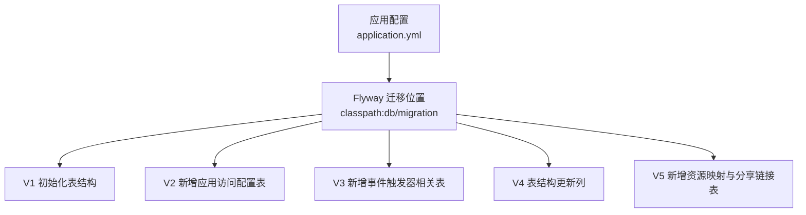
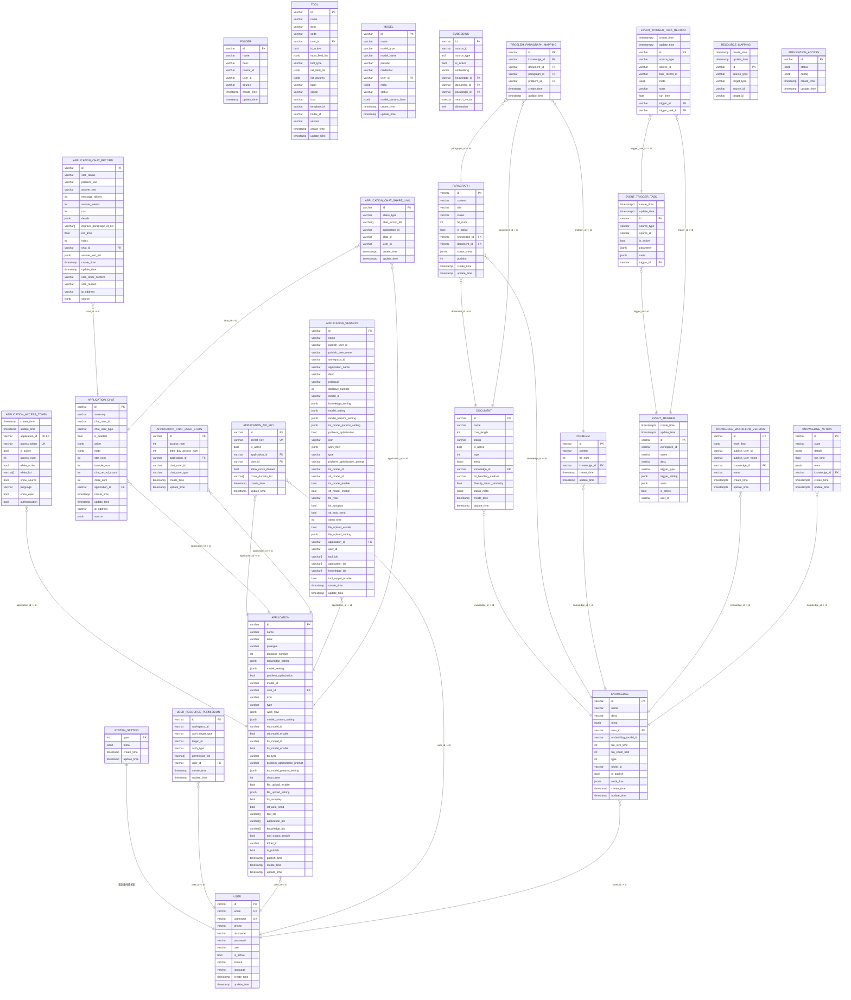
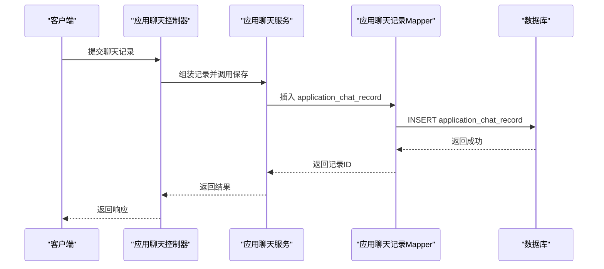

# 数据库架构

<cite>
**本文引用的文件**
- [application.yml](file://maxkb4j-start/src/main/resources/application.yml)
- [V1__init_tables.sql](file://maxkb4j-start/src/main/resources/db/migration/V1__init_tables.sql)
- [V2__add_table.sql](file://maxkb4j-start/src/main/resources/db/migration/V2__add_table.sql)
- [V3__add_trigger.sql](file://maxkb4j-start/src/main/resources/db/migration/V3__add_trigger.sql)
- [V4__update_table.sql](file://maxkb4j-start/src/main/resources/db/migration/V4__update_table.sql)
- [V5__add_table.sql](file://maxkb4j-start/src/main/resources/db/migration/V5__add_table.sql)
- [ApplicationEntity.java](file://maxkb4j-service-api/maxkb4j-application-api/src/main/java/com/maxkb4j/application/entity/ApplicationEntity.java)
- [KnowledgeEntity.java](file://maxkb4j-service-api/maxkb4j-knowledge-api/src/main/java/com/maxkb4j/knowledge/entity/KnowledgeEntity.java)
- [UserEntity.java](file://maxkb4j-service-api/maxkb4j-user-api/src/main/java/com/maxkb4j/user/entity/UserEntity.java)
- [SystemSettingEntity.java](file://maxkb4j-service-api/maxkb4j-system-api/src/main/java/com/maxkb4j/system/entity/SystemSettingEntity.java)
- [ApplicationMapper.java](file://maxkb4j-service-api/maxkb4j-application-api/src/main/java/com/maxkb4j/application/mapper/ApplicationMapper.java)
- [KnowledgeMapper.java](file://maxkb4j-service-api/maxkb4j-knowledge-api/src/main/java/com/maxkb4j/knowledge/mapper/KnowledgeMapper.java)
- [UserMapper.java](file://maxkb4j-service-api/maxkb4j-user-api/src/main/java/com/maxkb4j/user/mapper/UserMapper.java)
- [KnowledgeVersionEntity.java](file://maxkb4j-service-api/maxkb4j-knowledge-api/src/main/java/com/maxkb4j/knowledge/entity/KnowledgeVersionEntity.java)
</cite>

## 目录
1. [简介](#简介)
2. [项目结构](#项目结构)
3. [核心组件](#核心组件)
4. [架构总览](#架构总览)
5. [详细组件分析](#详细组件分析)
6. [依赖分析](#依赖分析)
7. [性能考虑](#性能考虑)
8. [故障排查指南](#故障排查指南)
9. [结论](#结论)
10. [附录](#附录)

## 简介
本文件面向数据库管理员与开发者，系统化梳理 MaxKB4j 的数据库架构与演进历程。基于 Flyway 数据库迁移框架，文档从初始表结构出发，逐版本说明表结构变更与新增功能的数据库支持；并结合实体类映射与 MyBatis Mapper 查询接口，给出完整的 ER 关系、索引与约束说明，以及版本管理策略、迁移顺序与回滚机制建议、性能优化与运维实践。

## 项目结构
MaxKB4j 的数据库迁移脚本位于应用模块资源目录中，Flyway 通过配置自动扫描并执行迁移脚本，确保数据库结构与应用版本一致。迁移脚本按版本号顺序命名，形成线性演进路径。

图表来源
- [application.yml:21-25](file://maxkb4j-start/src/main/resources/application.yml#L21-L25)
- [V1__init_tables.sql:1-10](file://maxkb4j-start/src/main/resources/db/migration/V1__init_tables.sql#L1-L10)
- [V2__add_table.sql:1-17](file://maxkb4j-start/src/main/resources/db/migration/V2__add_table.sql#L1-L17)
- [V3__add_trigger.sql:1-68](file://maxkb4j-start/src/main/resources/db/migration/V3__add_trigger.sql#L1-L68)
- [V4__update_table.sql:1-9](file://maxkb4j-start/src/main/resources/db/migration/V4__update_table.sql#L1-L9)
- [V5__add_table.sql:1-71](file://maxkb4j-start/src/main/resources/db/migration/V5__add_table.sql#L1-L71)

章节来源
- [application.yml:21-25](file://maxkb4j-start/src/main/resources/application.yml#L21-L25)

## 核心组件
- 数据库迁移与版本管理
  - Flyway 启用与扫描路径：在应用配置中启用 Flyway，并指定迁移脚本位置为 classpath:db/migration。
  - 基线迁移策略：开启基线迁移，确保首次部署时以现有数据库为基础进行版本对齐。
  - 迁移验证：关闭启动时验证，便于快速上线；生产环境建议在发布流程中显式校验。
- 实体与映射
  - 应用层实体通过 MyBatis-Plus 注解映射到数据库表，JSONB 字段使用自定义 TypeHandler 处理。
  - Mapper 接口继承 BaseMapper，提供通用 CRUD 能力及分页查询扩展。

章节来源
- [application.yml:21-25](file://maxkb4j-start/src/main/resources/application.yml#L21-L25)
- [ApplicationEntity.java:25](file://maxkb4j-service-api/maxkb4j-application-api/src/main/java/com/maxkb4j/application/entity/ApplicationEntity.java#L25)
- [KnowledgeEntity.java:18](file://maxkb4j-service-api/maxkb4j-knowledge-api/src/main/java/com/maxkb4j/knowledge/entity/KnowledgeEntity.java#L18)
- [UserEntity.java:18](file://maxkb4j-service-api/maxkb4j-user-api/src/main/java/com/maxkb4j/user/entity/UserEntity.java#L18)
- [SystemSettingEntity.java:15](file://maxkb4j-service-api/maxkb4j-system-api/src/main/java/com/maxkb4j/system/entity/SystemSettingEntity.java#L15)
- [ApplicationMapper.java:12](file://maxkb4j-service-api/maxkb4j-application-api/src/main/java/com/maxkb4j/application/mapper/ApplicationMapper.java#L12)
- [KnowledgeMapper.java:17](file://maxkb4j-service-api/maxkb4j-knowledge-api/src/main/java/com/maxkb4j/knowledge/mapper/KnowledgeMapper.java#L17)
- [UserMapper.java:16](file://maxkb4j-service-api/maxkb4j-user-api/src/main/java/com/maxkb4j/user/mapper/UserMapper.java#L16)

## 架构总览
下图展示数据库表之间的关系、主键、外键与关键索引，覆盖知识库、文档、段落、问题、嵌入向量、应用、用户、系统设置、事件触发器、资源映射等核心域。

图表来源
- [V1__init_tables.sql:1-800](file://maxkb4j-start/src/main/resources/db/migration/V1__init_tables.sql#L1-L800)
- [V2__add_table.sql:1-17](file://maxkb4j-start/src/main/resources/db/migration/V2__add_table.sql#L1-L17)
- [V3__add_trigger.sql:1-68](file://maxkb4j-start/src/main/resources/db/migration/V3__add_trigger.sql#L1-L68)
- [V4__update_table.sql:1-9](file://maxkb4j-start/src/main/resources/db/migration/V4__update_table.sql#L1-L9)
- [V5__add_table.sql:1-71](file://maxkb4j-start/src/main/resources/db/migration/V5__add_table.sql#L1-L71)

## 详细组件分析

### 版本演进与迁移脚本
- V1：初始化数据库，创建系统设置、用户、权限、应用、聊天、知识库、文档、段落、问题、工具、模型、嵌入向量、映射等核心表，并建立主键、唯一键、外键与索引。
- V2：新增应用访问配置表，用于存储应用访问状态与配置。
- V3：新增事件触发器相关表（事件触发器、任务、任务记录），支撑异步调度与事件驱动能力。
- V4：对聊天与聊天记录表增加投票补充内容、投票原因、IP 地址与来源字段，增强审计与统计维度。
- V5：新增资源映射表与应用聊天分享链接表，完善资源关联与分享能力。

章节来源
- [V1__init_tables.sql:1-800](file://maxkb4j-start/src/main/resources/db/migration/V1__init_tables.sql#L1-L800)
- [V2__add_table.sql:1-17](file://maxkb4j-start/src/main/resources/db/migration/V2__add_table.sql#L1-L17)
- [V3__add_trigger.sql:1-68](file://maxkb4j-start/src/main/resources/db/migration/V3__add_trigger.sql#L1-L68)
- [V4__update_table.sql:1-9](file://maxkb4j-start/src/main/resources/db/migration/V4__update_table.sql#L1-L9)
- [V5__add_table.sql:1-71](file://maxkb4j-start/src/main/resources/db/migration/V5__add_table.sql#L1-L71)

### 关键表结构与字段说明

- 系统设置（system_setting）
  - 主键：type
  - 字段：meta（JSONB）、create_time、update_time
  - 用途：集中存储系统级配置项，如邮箱、密钥等元数据。

- 用户（user）
  - 主键：id；唯一：email、username
  - 字段：基础身份信息、角色、状态、来源、语言等
  - 索引：email、username 模糊匹配索引

- 用户资源权限（user_resource_permission）
  - 主键：id
  - 字段：工作空间、授权目标类型、目标ID、授权类型、权限列表、用户ID
  - 用途：细粒度资源授权控制

- 应用（application）
  - 主键：id；外键：user_id → user(id)
  - 字段：名称、描述、开场白、对话轮数、知识设置、模型设置、STT/TTS 相关、工具与知识库集合、清理周期、文件上传开关与参数、工作流等
  - JSONB 字段：knowledge_setting、model_setting、model_params_setting、tts_model_params_setting、work_flow、file_upload_setting、problem_optimization_prompt
  - 索引：model_id、stt_model_id、tts_model_id、user_id

- 应用访问令牌（application_access_token）
  - 主键：application_id；唯一：access_token
  - 外键：application_id → application(id)
  - 字段：访问令牌、启用状态、访问次数、白名单、显示源语言/执行、鉴权开关等

- 应用 API Key（application_api_key）
  - 主键：id；唯一：secret_key
  - 外键：application_id → application(id)、user_id → user(id)
  - 字段：密钥、跨域配置、创建/更新时间

- 应用聊天（application_chat）
  - 主键：id；外键：application_id → application(id)
  - 字段：摘要、用户标识、类型、星标/踩/记录计数、元数据、asker 等
  - 索引：application_id、create_time、update_time

- 应用聊天记录（application_chat_record）
  - 主键：id；外键：chat_id → application_chat(id)
  - 字段：问题文本、答案文本、token 计费、成本、运行详情、排序索引、回答文本列表等
  - 索引：chat_id

- 应用聊天用户统计（application_chat_user_stats）
  - 主键：id；外键：application_id → application(id)
  - 字段：访问次数、当日访问次数、用户标识、类型、创建/更新时间
  - 索引：application_id

- 应用版本（application_version）
  - 主键：id；外键：application_id → application(id)
  - 字段：版本名、发布者、应用名、描述、开场白、对话轮数、模型与参数、STT/TTS 开关与参数、清理周期、文件上传开关与参数、工具/应用/知识库集合、工作流等
  - JSONB 字段：work_flow、model_setting、model_params_setting、tts_model_params_setting、knowledge_setting、problem_optimization_prompt

- 知识库（knowledge）
  - 主键：id；外键：user_id → user(id)
  - 字段：名称、描述、元数据、用户ID、嵌入模型ID、文件大小/数量限制、类型、目录ID、发布状态、工作流、创建/更新时间
  - 索引：embedding_model_id、user_id

- 文档（document）
  - 主键：id；外键：knowledge_id → knowledge(id)
  - 字段：名称、字符长度、状态、激活状态、类型、元数据、知识库ID、命中处理方式、相似度阈值、状态元数据、创建/更新时间
  - 索引：knowledge_id

- 段落（paragraph）
  - 主键：id；外键：knowledge_id → knowledge(id)、document_id → document(id)
  - 字段：内容、标题、状态、命中次数、激活状态、知识库ID、文档ID、状态元数据、位置、创建/更新时间
  - 索引：knowledge_id、document_id

- 问题（problem）
  - 主键：id；外键：knowledge_id → knowledge(id)
  - 字段：内容、命中次数、知识库ID、创建/更新时间
  - 索引：knowledge_id

- 目录（folder）
  - 主键：id
  - 字段：名称、描述、父ID、用户ID、来源、创建/更新时间
  - 索引：create_time、id、name、parent_id、update_time、user_id

- 工具（tool）
  - 主键：id；外键：user_id → user(id)
  - 字段：名称、描述、代码、用户ID、激活状态、输入字段、工具类型、初始化字段/参数、标签、作用域、图标、模板ID、目录ID、版本、创建/更新时间
  - 索引：user_id

- 模型（model）
  - 主键：id；唯一：name,user_id
  - 字段：名称、模型类型、模型名、提供商、凭证、用户ID、元数据、状态、模型参数表单、创建/更新时间
  - 索引：user_id

- 嵌入向量（embedding）
  - 主键：id；外键：knowledge_id → knowledge(id)、document_id → document(id)、paragraph_id → paragraph(id)
  - 字段：源ID、源类型、激活状态、向量、知识库ID、文档ID、段落ID、搜索向量、维度
  - 索引：knowledge_id、document_id、id、paragraph_id

- 问题-段落映射（problem_paragraph_mapping）
  - 主键：id；外键：document_id → document(id)
  - 字段：知识库ID、文档ID、段落ID、问题ID、创建/更新时间
  - 索引：knowledge_id、document_id、paragraph_id、problem_id

- 知识工作流版本（knowledge_workflow_version）
  - 主键：id；外键：knowledge_id → knowledge(id)
  - 字段：工作流、发布用户、知识库ID、名称、创建/更新时间
  - 索引：create_time、knowledge_id、update_time

- 知识动作（knowledge_action）
  - 主键：id；外键：knowledge_id → knowledge(id)
  - 字段：状态、详情、运行时长、元数据、知识库ID、创建/更新时间
  - 索引：create_time、knowledge_id、update_time

- 事件触发器（event_trigger）
  - 主键：id
  - 字段：工作空间ID、名称、描述、触发类型、触发设置、元数据、启用状态、用户ID、创建/更新时间

- 事件触发器任务（event_trigger_task）
  - 主键：id；外键：trigger_id → event_trigger(id)
  - 字段：源类型、源ID、启用状态、参数、元数据、触发器ID、创建/更新时间

- 事件触发器任务记录（event_trigger_task_record）
  - 主键：id；外键：trigger_id → event_trigger(id)、trigger_task_id → event_trigger_task(id)
  - 字段：源类型、源ID、任务记录ID、元数据、状态、运行时长、触发器ID、任务ID、创建/更新时间

- 资源映射（resource_mapping）
  - 主键：id
  - 字段：源类型、目标类型、源ID、目标ID、创建/更新时间
  - 索引：create_time、source_id、source_type、target_id、target_type、update_time

- 应用聊天分享链接（application_chat_share_link）
  - 主键：id
  - 字段：分享类型、聊天记录ID数组、应用ID、聊天ID、用户ID、创建/更新时间

- 应用访问（application_access）
  - 主键：id
  - 字段：状态、配置、创建/更新时间

章节来源
- [V1__init_tables.sql:7-14](file://maxkb4j-start/src/main/resources/db/migration/V1__init_tables.sql#L7-L14)
- [V1__init_tables.sql:22-58](file://maxkb4j-start/src/main/resources/db/migration/V1__init_tables.sql#L22-L58)
- [V1__init_tables.sql:60-78](file://maxkb4j-start/src/main/resources/db/migration/V1__init_tables.sql#L60-L78)
- [V1__init_tables.sql:82-141](file://maxkb4j-start/src/main/resources/db/migration/V1__init_tables.sql#L82-L141)
- [V1__init_tables.sql:144-181](file://maxkb4j-start/src/main/resources/db/migration/V1__init_tables.sql#L144-L181)
- [V1__init_tables.sql:184-225](file://maxkb4j-start/src/main/resources/db/migration/V1__init_tables.sql#L184-L225)
- [V1__init_tables.sql:228-264](file://maxkb4j-start/src/main/resources/db/migration/V1__init_tables.sql#L228-L264)
- [V1__init_tables.sql:267-297](file://maxkb4j-start/src/main/resources/db/migration/V1__init_tables.sql#L267-L297)
- [V1__init_tables.sql:300-324](file://maxkb4j-start/src/main/resources/db/migration/V1__init_tables.sql#L300-L324)
- [V1__init_tables.sql:332-377](file://maxkb4j-start/src/main/resources/db/migration/V1__init_tables.sql#L332-L377)
- [V1__init_tables.sql:380-412](file://maxkb4j-start/src/main/resources/db/migration/V1__init_tables.sql#L380-L412)
- [V1__init_tables.sql:422-455](file://maxkb4j-start/src/main/resources/db/migration/V1__init_tables.sql#L422-L455)
- [V1__init_tables.sql:458-494](file://maxkb4j-start/src/main/resources/db/migration/V1__init_tables.sql#L458-L494)
- [V1__init_tables.sql:499-520](file://maxkb4j-start/src/main/resources/db/migration/V1__init_tables.sql#L499-L520)
- [V1__init_tables.sql:525-569](file://maxkb4j-start/src/main/resources/db/migration/V1__init_tables.sql#L525-L569)
- [V1__init_tables.sql:575-615](file://maxkb4j-start/src/main/resources/db/migration/V1__init_tables.sql#L575-L615)
- [V1__init_tables.sql:620-652](file://maxkb4j-start/src/main/resources/db/migration/V1__init_tables.sql#L620-L652)
- [V1__init_tables.sql:657-691](file://maxkb4j-start/src/main/resources/db/migration/V1__init_tables.sql#L657-L691)
- [V1__init_tables.sql:695-732](file://maxkb4j-start/src/main/resources/db/migration/V1__init_tables.sql#L695-L732)
- [V1__init_tables.sql:735-764](file://maxkb4j-start/src/main/resources/db/migration/V1__init_tables.sql#L735-L764)
- [V1__init_tables.sql:769-798](file://maxkb4j-start/src/main/resources/db/migration/V1__init_tables.sql#L769-L798)
- [V2__add_table.sql:2-16](file://maxkb4j-start/src/main/resources/db/migration/V2__add_table.sql#L2-L16)
- [V3__add_trigger.sql:2-67](file://maxkb4j-start/src/main/resources/db/migration/V3__add_trigger.sql#L2-L67)
- [V4__update_table.sql:1-9](file://maxkb4j-start/src/main/resources/db/migration/V4__update_table.sql#L1-L9)
- [V5__add_table.sql:1-71](file://maxkb4j-start/src/main/resources/db/migration/V5__add_table.sql#L1-L71)

### 实体类与数据库映射
- 应用实体（ApplicationEntity）
  - 映射表：application
  - JSONB 字段：work_flow、model_params_setting、tts_model_params_setting、file_upload_setting、knowledge_setting、model_setting、problem_optimization_prompt
  - 列表字段：tool_ids、application_ids、knowledge_ids（字符串数组）

- 知识库实体（KnowledgeEntity）
  - 映射表：knowledge
  - JSONB 字段：meta、work_flow

- 用户实体（UserEntity）
  - 映射表：user
  - 角色字段：role（字符串集合）

- 系统设置实体（SystemSettingEntity）
  - 映射表：system_setting
  - 主键：type（整型）

章节来源
- [ApplicationEntity.java:25-103](file://maxkb4j-service-api/maxkb4j-application-api/src/main/java/com/maxkb4j/application/entity/ApplicationEntity.java#L25-L103)
- [KnowledgeEntity.java:18-34](file://maxkb4j-service-api/maxkb4j-knowledge-api/src/main/java/com/maxkb4j/knowledge/entity/KnowledgeEntity.java#L18-L34)
- [UserEntity.java:18-40](file://maxkb4j-service-api/maxkb4j-user-api/src/main/java/com/maxkb4j/user/entity/UserEntity.java#L18-L40)
- [SystemSettingEntity.java:15-27](file://maxkb4j-service-api/maxkb4j-system-api/src/main/java/com/maxkb4j/system/entity/SystemSettingEntity.java#L15-L27)
- [KnowledgeVersionEntity.java:17-25](file://maxkb4j-service-api/maxkb4j-knowledge-api/src/main/java/com/maxkb4j/knowledge/entity/KnowledgeVersionEntity.java#L17-L25)

### 迁移执行顺序与回滚机制
- 执行顺序
  - V1 → V2 → V3 → V4 → V5，按版本号升序执行。
- 回滚机制
  - 建议在开发/测试环境使用可逆迁移或手动回滚脚本；生产环境不建议回滚已上线版本，应通过新增迁移修复问题。
  - Flyway 默认不提供自动回滚，需结合发布流程与备份策略实施。

章节来源
- [application.yml:21-25](file://maxkb4j-start/src/main/resources/application.yml#L21-L25)

### 数据处理流程（示例：应用聊天记录写入）

图表来源
- [V1__init_tables.sql:267-297](file://maxkb4j-start/src/main/resources/db/migration/V1__init_tables.sql#L267-L297)
- [ApplicationMapper.java:12](file://maxkb4j-service-api/maxkb4j-application-api/src/main/java/com/maxkb4j/application/mapper/ApplicationMapper.java#L12)

## 依赖分析
- 组件耦合
  - 多表围绕“知识库-文档-段落-问题-嵌入向量”形成强关联，查询常涉及多表连接与 JSONB 字段解析。
  - 应用与用户、权限、API Key、访问令牌存在外键关系，保证业务边界清晰。
- 外部依赖
  - PostgreSQL 向量扩展（vector）用于高效相似度检索。
  - MyBatis-Plus 与 JSONB 类型处理器配合，简化复杂字段序列化。

图表来源
- [ApplicationEntity.java:25](file://maxkb4j-service-api/maxkb4j-application-api/src/main/java/com/maxkb4j/application/entity/ApplicationEntity.java#L25)
- [ApplicationMapper.java:12](file://maxkb4j-service-api/maxkb4j-application-api/src/main/java/com/maxkb4j/application/mapper/ApplicationMapper.java#L12)
- [V1__init_tables.sql:5](file://maxkb4j-start/src/main/resources/db/migration/V1__init_tables.sql#L5)

章节来源
- [V1__init_tables.sql:5](file://maxkb4j-start/src/main/resources/db/migration/V1__init_tables.sql#L5)
- [ApplicationMapper.java:12](file://maxkb4j-service-api/maxkb4j-application-api/src/main/java/com/maxkb4j/application/mapper/ApplicationMapper.java#L12)

## 性能考虑
- 索引策略
  - 高频过滤字段（如 user_id、knowledge_id、document_id、application_id）建立 B-tree 索引，提升 JOIN 与过滤效率。
  - JSONB 字段建议结合 GIN 或专用向量索引（如向量相似度）优化检索。
- 查询优化
  - 分页查询优先使用主键或高选择性字段排序，避免全表扫描。
  - 对大字段（如 work_flow、details、meta）仅在必要时加载，减少网络与内存开销。
- 存储与向量
  - 向量维度与存储格式直接影响检索性能，建议根据实际场景调整维度与索引策略。
- 并发与锁
  - 高并发写入场景下，合理拆分热点表或引入只读副本，降低写放大。

## 故障排查指南
- 迁移失败
  - 检查 Flyway 配置与迁移脚本路径是否正确。
  - 核对数据库版本状态与基线设置，避免重复执行或版本冲突。
- 查询异常
  - 核对实体类字段与数据库表字段映射，确认 JSONB 字段的 TypeHandler 是否正确注册。
  - 检查索引是否存在，必要时重建或添加缺失索引。
- 性能问题
  - 使用 EXPLAIN 分析慢查询，定位缺失索引或 N+1 查询。
  - 对大 JSONB 字段进行条件裁剪，避免一次性加载过多数据。

章节来源
- [application.yml:21-25](file://maxkb4j-start/src/main/resources/application.yml#L21-L25)
- [ApplicationEntity.java:25-103](file://maxkb4j-service-api/maxkb4j-application-api/src/main/java/com/maxkb4j/application/entity/ApplicationEntity.java#L25-L103)

## 结论
MaxKB4j 的数据库架构以 Flyway 管理为核心，通过线性版本演进逐步完善知识库、应用、聊天、事件触发器与资源映射等能力。借助 JSONB 与向量扩展，系统在结构灵活性与检索性能之间取得平衡。建议在生产环境中严格遵循迁移流程、索引规范与监控策略，持续优化查询与存储方案。

## 附录
- 版本管理最佳实践
  - 迁移脚本命名规范：V<版本号>_<简要描述>.sql
  - 生产发布前执行 Flyway 校验，确保脚本顺序与数据库状态一致
  - 备份策略：全量备份+增量备份，结合迁移脚本作为回滚依据
- 监控指标建议
  - 数据库连接数、慢查询、索引命中率、向量检索耗时、JSONB 字段访问频率