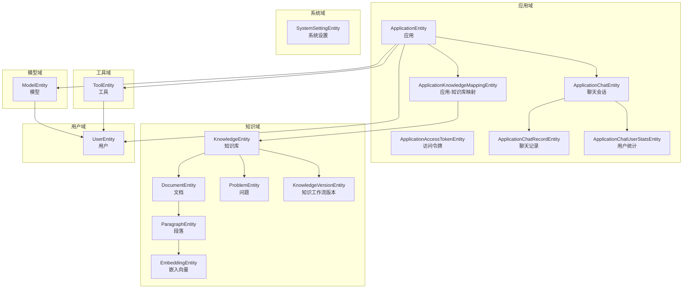
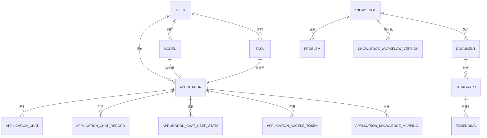
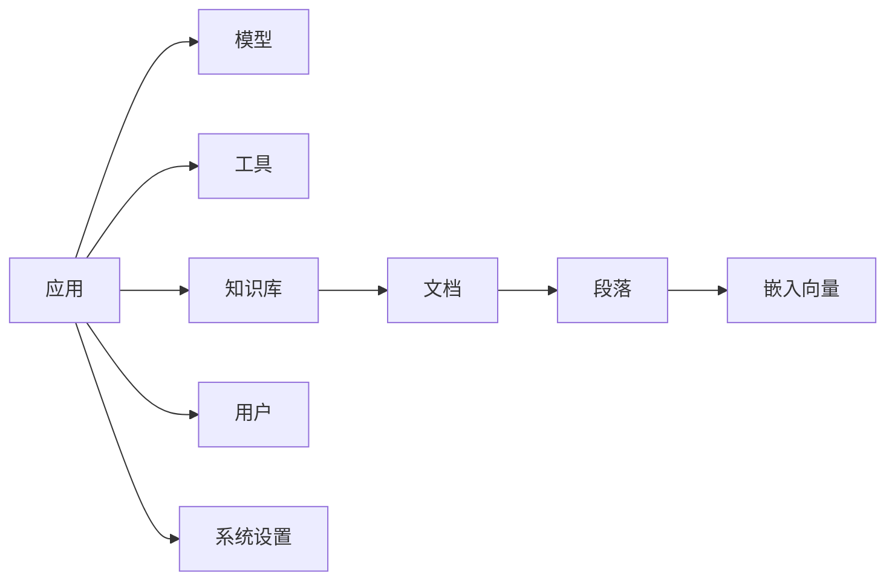

# 数据模型设计

<cite>
**本文引用的文件**
- [ApplicationEntity.java](file://maxkb4j-service-api/maxkb4j-application-api/src/main/java/com/maxkb4j/application/entity/ApplicationEntity.java)
- [ApplicationChatEntity.java](file://maxkb4j-service-api/maxkb4j-application-api/src/main/java/com/maxkb4j/application/entity/ApplicationChatEntity.java)
- [ApplicationChatRecordEntity.java](file://maxkb4j-service-api/maxkb4j-application-api/src/main/java/com/maxkb4j/application/entity/ApplicationChatRecordEntity.java)
- [ApplicationKnowledgeMappingEntity.java](file://maxkb4j-service-api/maxkb4j-application-api/src/main/java/com/maxkb4j/application/entity/ApplicationKnowledgeMappingEntity.java)
- [ApplicationAccessTokenEntity.java](file://maxkb4j-service-api/maxkb4j-application-api/src/main/java/com/maxkb4j/application/entity/ApplicationAccessTokenEntity.java)
- [ApplicationChatUserStatsEntity.java](file://maxkb4j-service-api/maxkb4j-application-api/src/main/java/com/maxkb4j/application/entity/ApplicationChatUserStatsEntity.java)
- [KnowledgeEntity.java](file://maxkb4j-service-api/maxkb4j-knowledge-api/src/main/java/com/maxkb4j/knowledge/entity/KnowledgeEntity.java)
- [DocumentEntity.java](file://maxkb4j-service-api/maxkb4j-knowledge-api/src/main/java/com/maxkb4j/knowledge/entity/DocumentEntity.java)
- [ParagraphEntity.java](file://maxkb4j-service-api/maxkb4j-knowledge-api/src/main/java/com/maxkb4j/knowledge/entity/ParagraphEntity.java)
- [KnowledgeVersionEntity.java](file://maxkb4j-service-api/maxkb4j-knowledge-api/src/main/java/com/maxkb4j/knowledge/entity/KnowledgeVersionEntity.java)
- [EmbeddingEntity.java](file://maxkb4j-service-api/maxkb4j-knowledge-api/src/main/java/com/maxkb4j/knowledge/entity/EmbeddingEntity.java)
- [ProblemEntity.java](file://maxkb4j-service-api/maxkb4j-knowledge-api/src/main/java/com/maxkb4j/knowledge/entity/ProblemEntity.java)
- [ModelEntity.java](file://maxkb4j-service-api/maxkb4j-model-api/src/main/java/com/maxkb4j/model/entity/ModelEntity.java)
- [UserEntity.java](file://maxkb4j-service-api/maxkb4j-user-api/src/main/java/com/maxkb4j/user/entity/UserEntity.java)
- [SystemSettingEntity.java](file://maxkb4j-service-api/maxkb4j-system-api/src/main/java/com/maxkb4j/system/entity/SystemSettingEntity.java)
- [ToolEntity.java](file://maxkb4j-service-api/maxkb4j-tool-api/src/main/java/com/maxkb4j/tool/entity/ToolEntity.java)
</cite>

## 目录
1. [简介](#简介)
2. [项目结构](#项目结构)
3. [核心组件](#核心组件)
4. [架构总览](#架构总览)
5. [详细组件分析](#详细组件分析)
6. [依赖分析](#依赖分析)
7. [性能考量](#性能考量)
8. [故障排查指南](#故障排查指南)
9. [结论](#结论)
10. [附录](#附录)

## 简介
本文件系统化梳理 MaxKB4j 的数据模型设计，围绕应用、知识库、文档、段落、嵌入向量、问题、模型、用户、系统设置与工具等核心实体，说明其字段定义、数据类型、约束关系与业务含义，并给出 ER 图与实体关系图，帮助开发者快速理解与扩展数据库结构。同时覆盖数据访问模式、缓存策略、性能优化、数据生命周期管理、迁移路径与版本兼容性处理建议。

## 项目结构
MaxKB4j 将数据模型按功能域拆分在多个模块中：
- 应用域：应用、聊天会话、聊天记录、访问令牌、统计、应用-知识库映射
- 知识域：知识库、文档、段落、嵌入向量、问题、知识工作流版本
- 模型域：模型（含凭证、参数）
- 用户域：用户
- 系统域：系统设置
- 工具域：工具

图表来源
- [ApplicationEntity.java:26](file://maxkb4j-service-api/maxkb4j-application-api/src/main/java/com/maxkb4j/application/entity/ApplicationEntity.java#L26)
- [ApplicationAccessTokenEntity.java:22](file://maxkb4j-service-api/maxkb4j-application-api/src/main/java/com/maxkb4j/application/entity/ApplicationAccessTokenEntity.java#L22)
- [ApplicationChatEntity.java:17](file://maxkb4j-service-api/maxkb4j-application-api/src/main/java/com/maxkb4j/application/entity/ApplicationChatEntity.java#L17)
- [ApplicationChatRecordEntity.java:21](file://maxkb4j-service-api/maxkb4j-application-api/src/main/java/com/maxkb4j/application/entity/ApplicationChatRecordEntity.java#L21)
- [ApplicationChatUserStatsEntity.java:14](file://maxkb4j-service-api/maxkb4j-application-api/src/main/java/com/maxkb4j/application/entity/ApplicationChatUserStatsEntity.java#L14)
- [ApplicationKnowledgeMappingEntity.java:14](file://maxkb4j-service-api/maxkb4j-application-api/src/main/java/com/maxkb4j/application/entity/ApplicationKnowledgeMappingEntity.java#L14)
- [KnowledgeEntity.java:18](file://maxkb4j-service-api/maxkb4j-knowledge-api/src/main/java/com/maxkb4j/knowledge/entity/KnowledgeEntity.java#L18)
- [DocumentEntity.java:22](file://maxkb4j-service-api/maxkb4j-knowledge-api/src/main/java/com/maxkb4j/knowledge/entity/DocumentEntity.java#L22)
- [ParagraphEntity.java:14](file://maxkb4j-service-api/maxkb4j-knowledge-api/src/main/java/com/maxkb4j/knowledge/entity/ParagraphEntity.java#L14)
- [EmbeddingEntity.java:24](file://maxkb4j-service-api/maxkb4j-knowledge-api/src/main/java/com/maxkb4j/knowledge/entity/EmbeddingEntity.java#L24)
- [ProblemEntity.java:13](file://maxkb4j-service-api/maxkb4j-knowledge-api/src/main/java/com/maxkb4j/knowledge/entity/ProblemEntity.java#L13)
- [KnowledgeVersionEntity.java:17](file://maxkb4j-service-api/maxkb4j-knowledge-api/src/main/java/com/maxkb4j/knowledge/entity/KnowledgeVersionEntity.java#L17)
- [ModelEntity.java:20](file://maxkb4j-service-api/maxkb4j-model-api/src/main/java/com/maxkb4j/model/entity/ModelEntity.java#L20)
- [UserEntity.java:18](file://maxkb4j-service-api/maxkb4j-user-api/src/main/java/com/maxkb4j/user/entity/UserEntity.java#L18)
- [SystemSettingEntity.java:15](file://maxkb4j-service-api/maxkb4j-system-api/src/main/java/com/maxkb4j/system/entity/SystemSettingEntity.java#L15)
- [ToolEntity.java:22](file://maxkb4j-service-api/maxkb4j-tool-api/src/main/java/com/maxkb4j/tool/entity/ToolEntity.java#L22)

章节来源
- [ApplicationEntity.java:26](file://maxkb4j-service-api/maxkb4j-application-api/src/main/java/com/maxkb4j/application/entity/ApplicationEntity.java#L26)
- [KnowledgeEntity.java:18](file://maxkb4j-service-api/maxkb4j-knowledge-api/src/main/java/com/maxkb4j/knowledge/entity/KnowledgeEntity.java#L18)
- [ModelEntity.java:20](file://maxkb4j-service-api/maxkb4j-model-api/src/main/java/com/maxkb4j/model/entity/ModelEntity.java#L20)
- [UserEntity.java:18](file://maxkb4j-service-api/maxkb4j-user-api/src/main/java/com/maxkb4j/user/entity/UserEntity.java#L18)
- [SystemSettingEntity.java:15](file://maxkb4j-service-api/maxkb4j-system-api/src/main/java/com/maxkb4j/system/entity/SystemSettingEntity.java#L15)
- [ToolEntity.java:22](file://maxkb4j-service-api/maxkb4j-tool-api/src/main/java/com/maxkb4j/tool/entity/ToolEntity.java#L22)

## 核心组件
本节对各实体进行字段与约束说明，突出主键、外键、索引与业务语义。

- 应用 ApplicationEntity
  - 主键：继承自基础实体
  - 关键字段：名称、描述、开场白、对话编号、知识设置、模型设置、问题优化开关、模型ID、所属用户ID、图标、类型、工作流配置、模型参数、语音相关模型与开关、发布状态与时间、问题优化提示、清理时长、文件上传开关与配置、目录ID、工具ID列表、应用ID列表、知识ID列表、工具输出开关
  - 类型处理：JSONB、DatasetSetting、LlmModelSetting、字符串列表
  - 业务含义：承载应用级配置、能力开关与资源绑定

- 访问令牌 ApplicationAccessTokenEntity
  - 主键：应用ID（表级主键）
  - 关键字段：访问口令、启用状态、累计访问次数、白名单开关与列表、来源展示、执行展示、鉴权开关、语言、创建/更新时间
  - 默认值：提供默认构造器
  - 业务含义：控制应用对外访问的权限与行为

- 聊天会话 ApplicationChatEntity
  - 主键：继承自基础实体
  - 关键字段：摘要、应用ID、聊天用户ID、用户类型、提问者元信息、元数据、点赞数、踩数、聊天记录数、标记总数、删除标记、IP地址、来源
  - 类型处理：JSONB
  - 业务含义：记录一次聊天会话的上下文与统计

- 聊天记录 ApplicationChatRecordEntity
  - 主键：继承自基础实体
  - 关键字段：投票状态/原因/其他内容、问题文本、答案文本、消息Token数、回答Token数、成本、详情、优化段落ID列表、运行时长、序号、会话ID、答案文本序列
  - 类型处理：JSONB、字符串列表
  - 业务含义：记录单轮问答的明细与指标

- 用户统计 ApplicationChatUserStatsEntity
  - 主键：继承自基础实体
  - 关键字段：访问次数、当日访问次数、应用ID、聊天用户ID、用户类型
  - 业务含义：按用户维度统计访问频次

- 应用-知识库映射 ApplicationKnowledgeMappingEntity
  - 主键：继承自基础实体
  - 关键字段：应用ID、知识库ID
  - 业务含义：多对多关联的中间表

- 知识库 KnowledgeEntity
  - 主键：继承自基础实体
  - 关键字段：名称、描述、类型、元数据、所属用户ID、嵌入模型ID、文件大小/数量限制、目录ID、工作流、发布状态
  - 类型处理：JSONB
  - 业务含义：知识库的元信息与治理配置

- 文档 DocumentEntity
  - 主键：继承自基础实体
  - 关键字段：名称、字符长度、状态、是否激活、类型、元数据、所属知识库ID、命中处理方式、直接返回相似度阈值、状态元数据
  - 默认构造：初始化状态、激活标志、长度、元数据、命中策略与阈值
  - 业务含义：文档级的解析与索引入口

- 段落 ParagraphEntity
  - 主键：继承自基础实体
  - 关键字段：标题、内容、状态、命中次数、是否激活、所属知识库ID、文档ID、位置
  - 业务含义：最小检索单元

- 嵌入向量 EmbeddingEntity
  - 主键：MyBatis Plus 表主键 + MongoDB 文档主键
  - 关键字段：源ID、源类型、是否激活、所属知识库/文档/段落ID、向量、文本索引字段、匹配度得分、维度
  - 类型处理：向量数组
  - 业务含义：支持向量检索与全文检索

- 问题 ProblemEntity
  - 主键：继承自基础实体
  - 关键字段：内容、命中次数、所属知识库ID
  - 默认构造：默认命中次数
  - 业务含义：问题库，用于意图识别与召回

- 知识工作流版本 KnowledgeVersionEntity
  - 主键：继承自基础实体
  - 关键字段：名称、发布人ID/名称、所属知识库ID、工作流配置
  - 类型处理：JSONB
  - 业务含义：知识库工作流的版本化管理

- 模型 ModelEntity
  - 主键：继承自基础实体
  - 关键字段：名称、模型类型、模型名、提供商、凭证、所属用户ID、元数据、状态、模型参数表单
  - 类型处理：JSONB、凭证处理器
  - 业务含义：统一管理各类大模型接入参数与凭据

- 用户 UserEntity
  - 主键：继承自基础实体
  - 关键字段：邮箱、手机、昵称、用户名、密码、角色集合、启用状态、来源、语言
  - 类型处理：字符串集合
  - 业务含义：系统用户主体

- 系统设置 SystemSettingEntity
  - 主键：类型（输入式）
  - 关键字段：创建/更新时间、类型、元数据
  - 类型处理：JSONB
  - 业务含义：系统级配置项

- 工具 ToolEntity
  - 主键：继承自基础实体
  - 关键字段：名称、描述、代码、输入字段列表、初始化字段列表、初始化参数、所属用户ID、启用状态、工具类型、标签、范围、图标、模板ID、目录ID、版本
  - 类型处理：JSONB、工具输入参数处理器
  - 业务含义：可编排的外部工具或脚本

章节来源
- [ApplicationEntity.java:26-103](file://maxkb4j-service-api/maxkb4j-application-api/src/main/java/com/maxkb4j/application/entity/ApplicationEntity.java#L26-L103)
- [ApplicationAccessTokenEntity.java:22-70](file://maxkb4j-service-api/maxkb4j-application-api/src/main/java/com/maxkb4j/application/entity/ApplicationAccessTokenEntity.java#L22-L70)
- [ApplicationChatEntity.java:17-35](file://maxkb4j-service-api/maxkb4j-application-api/src/main/java/com/maxkb4j/application/entity/ApplicationChatEntity.java#L17-L35)
- [ApplicationChatRecordEntity.java:21-41](file://maxkb4j-service-api/maxkb4j-application-api/src/main/java/com/maxkb4j/application/entity/ApplicationChatRecordEntity.java#L21-L41)
- [ApplicationChatUserStatsEntity.java:14-23](file://maxkb4j-service-api/maxkb4j-application-api/src/main/java/com/maxkb4j/application/entity/ApplicationChatUserStatsEntity.java#L14-L23)
- [ApplicationKnowledgeMappingEntity.java:14-19](file://maxkb4j-service-api/maxkb4j-application-api/src/main/java/com/maxkb4j/application/entity/ApplicationKnowledgeMappingEntity.java#L14-L19)
- [KnowledgeEntity.java:18-34](file://maxkb4j-service-api/maxkb4j-knowledge-api/src/main/java/com/maxkb4j/knowledge/entity/KnowledgeEntity.java#L18-L34)
- [DocumentEntity.java:22-65](file://maxkb4j-service-api/maxkb4j-knowledge-api/src/main/java/com/maxkb4j/knowledge/entity/DocumentEntity.java#L22-L65)
- [ParagraphEntity.java:14-27](file://maxkb4j-service-api/maxkb4j-knowledge-api/src/main/java/com/maxkb4j/knowledge/entity/ParagraphEntity.java#L14-L27)
- [EmbeddingEntity.java:24-51](file://maxkb4j-service-api/maxkb4j-knowledge-api/src/main/java/com/maxkb4j/knowledge/entity/EmbeddingEntity.java#L24-L51)
- [ProblemEntity.java:13-28](file://maxkb4j-service-api/maxkb4j-knowledge-api/src/main/java/com/maxkb4j/knowledge/entity/ProblemEntity.java#L13-L28)
- [KnowledgeVersionEntity.java:17-25](file://maxkb4j-service-api/maxkb4j-knowledge-api/src/main/java/com/maxkb4j/knowledge/entity/KnowledgeVersionEntity.java#L17-L25)
- [ModelEntity.java:20-43](file://maxkb4j-service-api/maxkb4j-model-api/src/main/java/com/maxkb4j/model/entity/ModelEntity.java#L20-L43)
- [UserEntity.java:18-40](file://maxkb4j-service-api/maxkb4j-user-api/src/main/java/com/maxkb4j/user/entity/UserEntity.java#L18-L40)
- [SystemSettingEntity.java:15-27](file://maxkb4j-service-api/maxkb4j-system-api/src/main/java/com/maxkb4j/system/entity/SystemSettingEntity.java#L15-L27)
- [ToolEntity.java:22-49](file://maxkb4j-service-api/maxkb4j-tool-api/src/main/java/com/maxkb4j/tool/entity/ToolEntity.java#L22-L49)

## 架构总览
下图展示实体间的主外键关系与典型查询路径：

图表来源
- [UserEntity.java:18](file://maxkb4j-service-api/maxkb4j-user-api/src/main/java/com/maxkb4j/user/entity/UserEntity.java#L18)
- [ApplicationEntity.java:26](file://maxkb4j-service-api/maxkb4j-application-api/src/main/java/com/maxkb4j/application/entity/ApplicationEntity.java#L26)
- [ApplicationChatEntity.java:17](file://maxkb4j-service-api/maxkb4j-application-api/src/main/java/com/maxkb4j/application/entity/ApplicationChatEntity.java#L17)
- [ApplicationChatRecordEntity.java:21](file://maxkb4j-service-api/maxkb4j-application-api/src/main/java/com/maxkb4j/application/entity/ApplicationChatRecordEntity.java#L21)
- [ApplicationChatUserStatsEntity.java:14](file://maxkb4j-service-api/maxkb4j-application-api/src/main/java/com/maxkb4j/application/entity/ApplicationChatUserStatsEntity.java#L14)
- [ApplicationAccessTokenEntity.java:22](file://maxkb4j-service-api/maxkb4j-application-api/src/main/java/com/maxkb4j/application/entity/ApplicationAccessTokenEntity.java#L22)
- [ApplicationKnowledgeMappingEntity.java:14](file://maxkb4j-service-api/maxkb4j-application-api/src/main/java/com/maxkb4j/application/entity/ApplicationKnowledgeMappingEntity.java#L14)
- [KnowledgeEntity.java:18](file://maxkb4j-service-api/maxkb4j-knowledge-api/src/main/java/com/maxkb4j/knowledge/entity/KnowledgeEntity.java#L18)
- [DocumentEntity.java:22](file://maxkb4j-service-api/maxkb4j-knowledge-api/src/main/java/com/maxkb4j/knowledge/entity/DocumentEntity.java#L22)
- [ParagraphEntity.java:14](file://maxkb4j-service-api/maxkb4j-knowledge-api/src/main/java/com/maxkb4j/knowledge/entity/ParagraphEntity.java#L14)
- [EmbeddingEntity.java:24](file://maxkb4j-service-api/maxkb4j-knowledge-api/src/main/java/com/maxkb4j/knowledge/entity/EmbeddingEntity.java#L24)
- [ProblemEntity.java:13](file://maxkb4j-service-api/maxkb4j-knowledge-api/src/main/java/com/maxkb4j/knowledge/entity/ProblemEntity.java#L13)
- [KnowledgeVersionEntity.java:17](file://maxkb4j-service-api/maxkb4j-knowledge-api/src/main/java/com/maxkb4j/knowledge/entity/KnowledgeVersionEntity.java#L17)
- [ModelEntity.java:20](file://maxkb4j-service-api/maxkb4j-model-api/src/main/java/com/maxkb4j/model/entity/ModelEntity.java#L20)
- [ToolEntity.java:22](file://maxkb4j-service-api/maxkb4j-tool-api/src/main/java/com/maxkb4j/tool/entity/ToolEntity.java#L22)

## 详细组件分析

### 应用域实体
- ApplicationEntity
  - 设计要点：集中式应用配置，通过 JSONB 存储复杂结构；通过字符串列表维护工具、应用、知识库的多对多关系；提供语音模型与参数开关，便于端到端能力集成。
  - 复杂度：O(n) 字段读写，JSONB 查询需注意索引与字段选择。
  - 优化：对常用查询字段建立复合索引；对 JSONB 内容限定查询范围。

- ApplicationAccessTokenEntity
  - 设计要点：以应用ID为主键，内置默认策略与口令生成逻辑；白名单、来源展示、执行展示与鉴权开关构成灵活的访问控制矩阵。
  - 复杂度：常量时间读写；口令生成与校验为 O(1)。
  - 优化：口令存储应加密；白名单列表查询可建二级索引。

- ApplicationChatEntity / ApplicationChatRecordEntity / ApplicationChatUserStatsEntity
  - 设计要点：聊天会话聚合统计，记录明细与指标；用户统计支持日活与总访问量；记录实体包含投票、Token、成本、运行时长等运营指标。
  - 复杂度：明细写入 O(1)，统计聚合 O(k)。
  - 优化：按应用ID+时间窗口建立分区或物化视图；投票与评分可异步汇总。

- ApplicationKnowledgeMappingEntity
  - 设计要点：标准中间表，支持多应用多知识库的灵活绑定。
  - 复杂度：插入/删除 O(1)，查询 O(1)。
  - 优化：复合唯一索引避免重复映射。

章节来源
- [ApplicationEntity.java:26-103](file://maxkb4j-service-api/maxkb4j-application-api/src/main/java/com/maxkb4j/application/entity/ApplicationEntity.java#L26-L103)
- [ApplicationAccessTokenEntity.java:22-70](file://maxkb4j-service-api/maxkb4j-application-api/src/main/java/com/maxkb4j/application/entity/ApplicationAccessTokenEntity.java#L22-L70)
- [ApplicationChatEntity.java:17-35](file://maxkb4j-service-api/maxkb4j-application-api/src/main/java/com/maxkb4j/application/entity/ApplicationChatEntity.java#L17-L35)
- [ApplicationChatRecordEntity.java:21-41](file://maxkb4j-service-api/maxkb4j-application-api/src/main/java/com/maxkb4j/application/entity/ApplicationChatRecordEntity.java#L21-L41)
- [ApplicationChatUserStatsEntity.java:14-23](file://maxkb4j-service-api/maxkb4j-application-api/src/main/java/com/maxkb4j/application/entity/ApplicationChatUserStatsEntity.java#L14-L23)
- [ApplicationKnowledgeMappingEntity.java:14-19](file://maxkb4j-service-api/maxkb4j-application-api/src/main/java/com/maxkb4j/application/entity/ApplicationKnowledgeMappingEntity.java#L14-L19)

### 知识域实体
- KnowledgeEntity / DocumentEntity / ParagraphEntity
  - 设计要点：三层结构（知识库-文档-段落），文档与段落均具备状态、命中次数、激活标志与元数据；文档限制名称长度，确保索引效率。
  - 复杂度：写入 O(1)，检索 O(log n) 或 O(k) 取决于索引。
  - 优化：为 knowledgeId、status、isActive 建立组合索引；段落 position 作为排序字段。

- EmbeddingEntity
  - 设计要点：MyBatis Plus 表主键 + MongoDB 文档主键，向量字段通过类型处理器持久化；支持全文索引与匹配度得分。
  - 复杂度：向量相似度计算 O(d·n)（d 为维度，n 为候选数）。
  - 优化：向量索引（如 HNSW/IVF）与倒排索引结合；定期归档低活跃向量。

- ProblemEntity / KnowledgeVersionEntity
  - 设计要点：问题库用于意图识别；知识工作流版本化，便于回滚与审计。
  - 复杂度：写入 O(1)，版本查询 O(1)。
  - 优化：版本按时间戳排序，必要时建立版本号唯一索引。

章节来源
- [KnowledgeEntity.java:18-34](file://maxkb4j-service-api/maxkb4j-knowledge-api/src/main/java/com/maxkb4j/knowledge/entity/KnowledgeEntity.java#L18-L34)
- [DocumentEntity.java:22-65](file://maxkb4j-service-api/maxkb4j-knowledge-api/src/main/java/com/maxkb4j/knowledge/entity/DocumentEntity.java#L22-L65)
- [ParagraphEntity.java:14-27](file://maxkb4j-service-api/maxkb4j-knowledge-api/src/main/java/com/maxkb4j/knowledge/entity/ParagraphEntity.java#L14-L27)
- [EmbeddingEntity.java:24-51](file://maxkb4j-service-api/maxkb4j-knowledge-api/src/main/java/com/maxkb4j/knowledge/entity/EmbeddingEntity.java#L24-L51)
- [ProblemEntity.java:13-28](file://maxkb4j-service-api/maxkb4j-knowledge-api/src/main/java/com/maxkb4j/knowledge/entity/ProblemEntity.java#L13-L28)
- [KnowledgeVersionEntity.java:17-25](file://maxkb4j-service-api/maxkb4j-knowledge-api/src/main/java/com/maxkb4j/knowledge/entity/KnowledgeVersionEntity.java#L17-L25)

### 模型域与工具域
- ModelEntity
  - 设计要点：凭证与参数通过类型处理器持久化；支持不同提供商与模型类型；元数据与参数表单用于动态配置。
  - 复杂度：读写 O(1)，参数解析 O(p)（p 为参数项数）。
  - 优化：参数表单预编译与缓存；凭证加密存储。

- ToolEntity
  - 设计要点：输入字段、初始化参数、模板与版本管理；支持脚本/插件式工具。
  - 复杂度：读写 O(1)，参数序列化 O(q)（q 为字段数）。
  - 优化：工具清单分页与版本过滤；模板变更审计。

章节来源
- [ModelEntity.java:20-43](file://maxkb4j-service-api/maxkb4j-model-api/src/main/java/com/maxkb4j/model/entity/ModelEntity.java#L20-L43)
- [ToolEntity.java:22-49](file://maxkb4j-service-api/maxkb4j-tool-api/src/main/java/com/maxkb4j/tool/entity/ToolEntity.java#L22-L49)

### 用户域与系统域
- UserEntity
  - 设计要点：角色集合、启用状态、来源与语言；基础认证与权限控制入口。
  - 复杂度：读写 O(1)，角色集合查询 O(r)（r 为角色数）。
  - 优化：用户名/邮箱唯一索引；角色集合查询加缓存。

- SystemSettingEntity
  - 设计要点：类型主键 + 元数据 JSONB；用于系统级配置。
  - 复杂度：读写 O(1)。
  - 优化：配置热加载与本地缓存；敏感配置加密存储。

章节来源
- [UserEntity.java:18-40](file://maxkb4j-service-api/maxkb4j-user-api/src/main/java/com/maxkb4j/user/entity/UserEntity.java#L18-L40)
- [SystemSettingEntity.java:15-27](file://maxkb4j-service-api/maxkb4j-system-api/src/main/java/com/maxkb4j/system/entity/SystemSettingEntity.java#L15-L27)

## 依赖分析
- 组件耦合
  - 应用依赖模型、工具与用户；知识域内部自洽；嵌入向量与段落强关联。
- 外部依赖
  - JSONB 类型处理器用于复杂结构持久化；向量类型处理器用于嵌入存储；字符串集合/列表处理器用于多值字段。
- 循环依赖
  - 当前模型未见循环依赖；映射表降低跨域耦合。

图表来源
- [ApplicationEntity.java:26](file://maxkb4j-service-api/maxkb4j-application-api/src/main/java/com/maxkb4j/application/entity/ApplicationEntity.java#L26)
- [ModelEntity.java:20](file://maxkb4j-service-api/maxkb4j-model-api/src/main/java/com/maxkb4j/model/entity/ModelEntity.java#L20)
- [ToolEntity.java:22](file://maxkb4j-service-api/maxkb4j-tool-api/src/main/java/com/maxkb4j/tool/entity/ToolEntity.java#L22)
- [KnowledgeEntity.java:18](file://maxkb4j-service-api/maxkb4j-knowledge-api/src/main/java/com/maxkb4j/knowledge/entity/KnowledgeEntity.java#L18)
- [DocumentEntity.java:22](file://maxkb4j-service-api/maxkb4j-knowledge-api/src/main/java/com/maxkb4j/knowledge/entity/DocumentEntity.java#L22)
- [ParagraphEntity.java:14](file://maxkb4j-service-api/maxkb4j-knowledge-api/src/main/java/com/maxkb4j/knowledge/entity/ParagraphEntity.java#L14)
- [EmbeddingEntity.java:24](file://maxkb4j-service-api/maxkb4j-knowledge-api/src/main/java/com/maxkb4j/knowledge/entity/EmbeddingEntity.java#L24)
- [UserEntity.java:18](file://maxkb4j-service-api/maxkb4j-user-api/src/main/java/com/maxkb4j/user/entity/UserEntity.java#L18)
- [SystemSettingEntity.java:15](file://maxkb4j-service-api/maxkb4j-system-api/src/main/java/com/maxkb4j/system/entity/SystemSettingEntity.java#L15)

## 性能考量
- 索引设计
  - 常用查询字段：应用ID、知识库ID、文档ID、段落ID、用户ID、模型ID、工具ID、状态、激活标志、类型、名称/关键词。
  - 建议索引：(应用ID, 创建时间)、(知识库ID, 状态, 是否激活)、(文档ID, 位置)、(模型ID, 提供商)、(工具ID, 启用状态)。
- 缓存策略
  - 热点配置：系统设置、模型参数表单、工具模板。
  - 会话与统计：聊天会话与用户统计可短期缓存，定期刷新。
- 异步与批处理
  - 聊天记录投票与评分、用户统计聚合采用异步任务。
- 分区与归档
  - 聊天记录按月/季度分区；低活跃嵌入向量定期归档。
- 向量检索
  - 使用近似最近邻索引（如 HNSW/IVF）加速相似度计算；批量向量写入与增量更新。

## 故障排查指南
- JSONB 结构异常
  - 现象：查询报错或字段为空。
  - 排查：检查类型处理器注册与字段注解；确认 JSONB 内容格式与字段存在性。
- 向量维度不一致
  - 现象：相似度计算失败或结果异常。
  - 排查：核对 embedding 维度与模型配置；确保写入时维度一致。
- 多值字段为空
  - 现象：工具/应用/知识库列表为空。
  - 排查：检查字符串列表/集合类型处理器；确认初始化与序列化。
- 访问令牌无效
  - 现象：接口 401。
  - 排查：核对口令生成逻辑、白名单与鉴权开关；检查时间戳与签名。
- 用户权限不足
  - 现象：资源访问受限。
  - 排查：核对角色集合与资源权限映射；确认系统设置中的权限策略。

章节来源
- [ApplicationAccessTokenEntity.java:22-70](file://maxkb4j-service-api/maxkb4j-application-api/src/main/java/com/maxkb4j/application/entity/ApplicationAccessTokenEntity.java#L22-L70)
- [EmbeddingEntity.java:24-51](file://maxkb4j-service-api/maxkb4j-knowledge-api/src/main/java/com/maxkb4j/knowledge/entity/EmbeddingEntity.java#L24-L51)
- [ToolEntity.java:22-49](file://maxkb4j-service-api/maxkb4j-tool-api/src/main/java/com/maxkb4j/tool/entity/ToolEntity.java#L22-L49)
- [UserEntity.java:18-40](file://maxkb4j-service-api/maxkb4j-user-api/src/main/java/com/maxkb4j/user/entity/UserEntity.java#L18-L40)

## 结论
MaxKB4j 的数据模型以“应用-知识库-文档-段落”为主线，配合“模型-工具-用户-系统设置”的支撑域，形成清晰的业务分层与稳定的实体关系。通过 JSONB 与类型处理器实现复杂配置的灵活存储，借助嵌入向量与问题库支撑检索增强。建议在生产环境中完善索引、缓存与分区策略，持续优化向量检索性能，并建立完善的配置与版本管理机制。

## 附录
- 数据生命周期管理
  - 清理策略：根据应用配置的清理时长自动归档或删除旧聊天记录；低活跃嵌入向量定期清理。
  - 审计与回滚：知识工作流版本化，支持回滚与审计追踪。
- 迁移路径与版本兼容
  - 新增字段：采用默认值与非空约束兼容旧数据；JSONB 字段新增键值需做存在性判断。
  - 结构变更：优先添加索引与默认值，再进行字段上线；对向量字段变更需重建索引。
- 最佳实践
  - 字段命名与注释规范化；复杂结构尽量 JSONB 化；多值字段使用集合/列表处理器；敏感信息加密存储；配置热加载与本地缓存；异步处理高频操作；监控与告警覆盖关键指标。