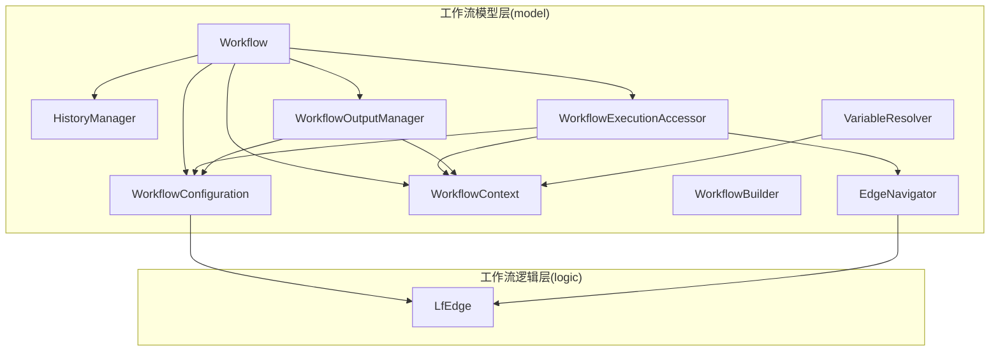
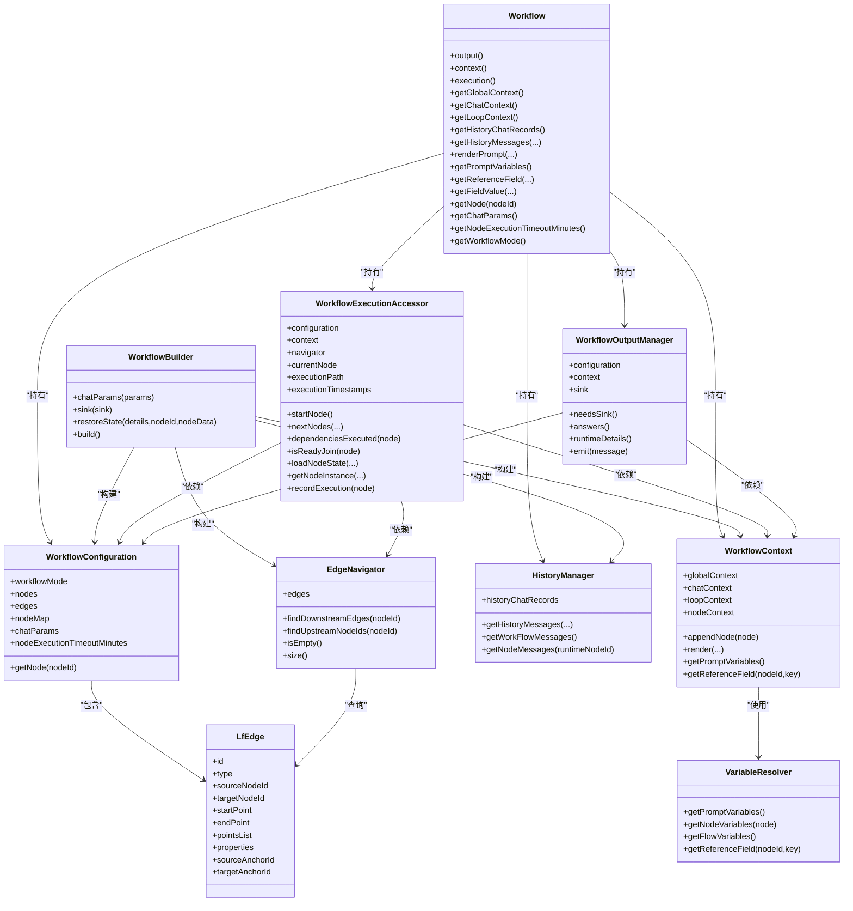
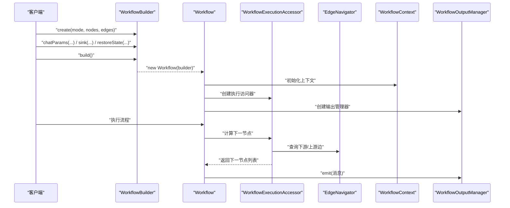
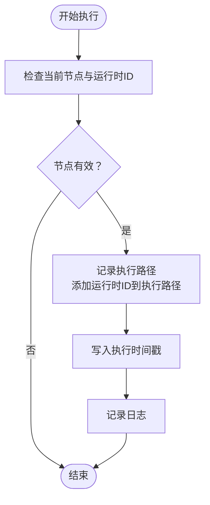
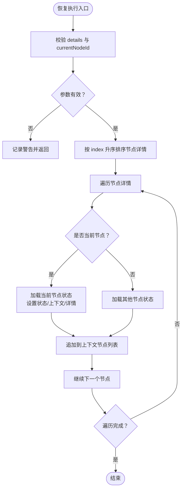
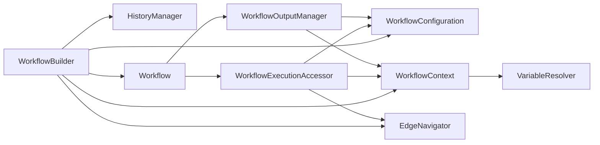

# 工作流实体模型

<cite>
**本文档引用的文件**
- [Workflow.java](file://maxkb4j-service-api/maxkb4j-workflow-api/src/main/java/com/maxkb4j/workflow/model/Workflow.java)
- [WorkflowContext.java](file://maxkb4j-service-api/maxkb4j-workflow-api/src/main/java/com/maxkb4j/workflow/model/WorkflowContext.java)
- [WorkflowConfiguration.java](file://maxkb4j-service-api/maxkb4j-workflow-api/src/main/java/com/maxkb4j/workflow/model/WorkflowConfiguration.java)
- [WorkflowBuilder.java](file://maxkb4j-service-api/maxkb4j-workflow-api/src/main/java/com/maxkb4j/workflow/model/WorkflowBuilder.java)
- [HistoryManager.java](file://maxkb4j-service-api/maxkb4j-workflow-api/src/main/java/com/maxkb4j/workflow/model/HistoryManager.java)
- [EdgeNavigator.java](file://maxkb4j-service-api/maxkb4j-workflow-api/src/main/java/com/maxkb4j/workflow/model/EdgeNavigator.java)
- [WorkflowExecutionAccessor.java](file://maxkb4j-service-api/maxkb4j-workflow-api/src/main/java/com/maxkb4j/workflow/model/WorkflowExecutionAccessor.java)
- [WorkflowOutputManager.java](file://maxkb4j-service-api/maxkb4j-workflow-api/src/main/java/com/maxkb4j/workflow/model/WorkflowOutputManager.java)
- [VariableResolver.java](file://maxkb4j-service-api/maxkb4j-workflow-api/src/main/java/com/maxkb4j/workflow/model/VariableResolver.java)
- [LfEdge.java](file://maxkb4j-service-api/maxkb4j-workflow-api/src/main/java/com/maxkb4j/workflow/logic/LfEdge.java)
</cite>

## 目录
1. [简介](#简介)
2. [项目结构](#项目结构)
3. [核心组件](#核心组件)
4. [架构总览](#架构总览)
5. [详细组件分析](#详细组件分析)
6. [依赖分析](#依赖分析)
7. [性能考量](#性能考量)
8. [故障排查指南](#故障排查指南)
9. [结论](#结论)
10. [附录](#附录)

## 简介
本文件系统化梳理 MaxKB4j 工作流实体模型，围绕 Workflow、WorkflowContext、WorkflowConfiguration、WorkflowBuilder、HistoryManager、EdgeNavigator、WorkflowExecutionAccessor、WorkflowOutputManager、VariableResolver、LfEdge 等核心实体，逐项说明其字段定义、数据类型、约束关系与业务含义；重点解释工作流设计、节点管理、边连接、上下文传递等核心功能的实体设计；给出实体间关联关系图与主键/外键/索引的设计考虑；并提供生命周期管理、数据验证规则与业务规则约束，以及最佳实践与扩展指导。

## 项目结构
工作流实体模型位于 maxkb4j-service-api 的 maxkb4j-workflow-api 模块中，采用“模型+逻辑”分层组织：
- model 包：工作流核心运行时模型（Workflow、WorkflowContext、WorkflowConfiguration、WorkflowBuilder、HistoryManager、EdgeNavigator、WorkflowExecutionAccessor、WorkflowOutputManager、VariableResolver）
- logic 包：工作流逻辑结构（如 LfEdge、LfNode、LogicFlow 等，用于描述图形拓扑）

图表来源
- [Workflow.java:1-263](file://maxkb4j-service-api/maxkb4j-workflow-api/src/main/java/com/maxkb4j/workflow/model/Workflow.java#L1-L263)
- [WorkflowConfiguration.java:1-95](file://maxkb4j-service-api/maxkb4j-workflow-api/src/main/java/com/maxkb4j/workflow/model/WorkflowConfiguration.java#L1-L95)
- [WorkflowContext.java:1-82](file://maxkb4j-service-api/maxkb4j-workflow-api/src/main/java/com/maxkb4j/workflow/model/WorkflowContext.java#L1-L82)
- [WorkflowBuilder.java:1-140](file://maxkb4j-service-api/maxkb4j-workflow-api/src/main/java/com/maxkb4j/workflow/model/WorkflowBuilder.java#L1-L140)
- [HistoryManager.java:1-103](file://maxkb4j-service-api/maxkb4j-workflow-api/src/main/java/com/maxkb4j/workflow/model/HistoryManager.java#L1-L103)
- [EdgeNavigator.java:1-72](file://maxkb4j-service-api/maxkb4j-workflow-api/src/main/java/com/maxkb4j/workflow/model/EdgeNavigator.java#L1-L72)
- [WorkflowExecutionAccessor.java:1-285](file://maxkb4j-service-api/maxkb4j-workflow-api/src/main/java/com/maxkb4j/workflow/model/WorkflowExecutionAccessor.java#L1-L285)
- [WorkflowOutputManager.java:1-140](file://maxkb4j-service-api/maxkb4j-workflow-api/src/main/java/com/maxkb4j/workflow/model/WorkflowOutputManager.java#L1-L140)
- [VariableResolver.java:1-139](file://maxkb4j-service-api/maxkb4j-workflow-api/src/main/java/com/maxkb4j/workflow/model/VariableResolver.java#L1-L139)
- [LfEdge.java:1-23](file://maxkb4j-service-api/maxkb4j-workflow-api/src/main/java/com/maxkb4j/workflow/logic/LfEdge.java#L1-L23)

章节来源
- [Workflow.java:1-263](file://maxkb4j-service-api/maxkb4j-workflow-api/src/main/java/com/maxkb4j/workflow/model/Workflow.java#L1-L263)
- [WorkflowBuilder.java:1-140](file://maxkb4j-service-api/maxkb4j-workflow-api/src/main/java/com/maxkb4j/workflow/model/WorkflowBuilder.java#L1-L140)

## 核心组件
本节对工作流实体进行逐项说明，包括字段、类型、约束与业务含义。

- Workflow（工作流门面）
  - 角色：对外统一入口，封装便捷方法与分层访问器，屏蔽内部组件复杂性
  - 关键字段与行为
    - configuration: WorkflowConfiguration（只读，工作流不可变配置）
    - workflowContext: WorkflowContext（上下文容器）
    - historyManager: HistoryManager（历史消息管理）
    - executionAccessor: WorkflowExecutionAccessor（执行控制）
    - outputManager: WorkflowOutputManager（输出管理）
    - 构造方式：通过 WorkflowBuilder 构建；支持从持久化状态恢复执行
    - 便捷方法：获取全局/聊天/循环上下文、渲染模板、获取历史消息、获取节点、获取聊天参数、获取超时时间、获取工作流模式等
    - 分层访问器：context()/execution()/output() 提供细粒度控制
  - 生命周期：由 WorkflowBuilder 初始化各子组件后创建；支持恢复执行（restoreState）
  - 约束与规则
    - 依赖注入顺序严格：先配置，再上下文，再历史，再导航器，最后创建 Workflow
    - 恢复执行时，按节点详情排序加载节点状态，设置当前节点与上下文
  - 章节来源
    - [Workflow.java:34-263](file://maxkb4j-service-api/maxkb4j-workflow-api/src/main/java/com/maxkb4j/workflow/model/Workflow.java#L34-L263)

- WorkflowConfiguration（工作流配置）
  - 角色：保存工作流不可变配置（模式、节点、边、聊天参数），提供 O(1) 节点查询
  - 关键字段与行为
    - workflowMode: WorkflowMode（工作流模式）
    - nodes: List<AbsNode>（不可变节点列表）
    - edges: List<LfEdge>（不可变边列表）
    - nodeMap: Map<String, AbsNode>（节点ID->节点映射）
    - chatParams: ChatParams（可设置）
    - nodeExecutionTimeoutMinutes: long（默认5分钟）
    - getNode(nodeId): 根据ID获取节点
  - 约束与规则
    - 构造时建立节点映射，保证查找效率
    - 节点/边列表设为不可变集合，确保线程安全
  - 章节来源
    - [WorkflowConfiguration.java:21-95](file://maxkb4j-service-api/maxkb4j-workflow-api/src/main/java/com/maxkb4j/workflow/model/WorkflowConfiguration.java#L21-L95)

- WorkflowContext（工作流上下文）
  - 角色：管理多级上下文（全局、聊天、循环、节点），并提供变量解析与模板渲染
  - 关键字段与行为
    - globalContext: Map<String, Object>（全局变量）
    - chatContext: Map<String, Object>（聊天变量）
    - loopContext: Map<String, Object>（循环变量）
    - nodeContext: List<AbsNode>（节点上下文列表，线程安全）
    - variableResolver: VariableResolver（变量解析器）
    - templateRenderer: TemplateRenderer（模板渲染器）
    - appendNode(currentNode): 追加或更新节点上下文
    - render(prompt[, addVariables]): 渲染模板
    - getPromptVariables(): 获取用于提示词渲染的变量集
    - getReferenceField(nodeId, key): 解析引用字段
  - 约束与规则
    - 节点上下文使用并发安全列表，避免并发修改问题
    - 变量解析器与模板渲染器按序初始化
  - 章节来源
    - [WorkflowContext.java:15-82](file://maxkb4j-service-api/maxkb4j-workflow-api/src/main/java/com/maxkb4j/workflow/model/WorkflowContext.java#L15-L82)

- WorkflowBuilder（工作流构建器）
  - 角色：分离复杂初始化逻辑，提供链式配置与统一构建流程
  - 关键字段与行为
    - 必需参数：workflowMode、nodes、edges
    - 可选参数：chatParams、sink、details、currentNodeId、currentNodeData、restoreState
    - 组件：configuration、context、historyManager、navigator（内部构建）
    - chatParams(params): 设置聊天参数并自动触发状态恢复
    - sink(sink): 设置响应式输出 Sink
    - restoreState(details, nodeId, nodeData): 标记恢复状态
    - build(): 依次构建配置、上下文、历史、导航器，最终创建 Workflow
    - create(mode, nodes, edges): 工厂方法
  - 约束与规则
    - 构建顺序固定，确保依赖满足
    - restoreState 由 chatParams 中的聊天记录决定
  - 章节来源
    - [WorkflowBuilder.java:35-140](file://maxkb4j-service-api/maxkb4j-workflow-api/src/main/java/com/maxkb4j/workflow/model/WorkflowBuilder.java#L35-L140)

- HistoryManager（历史消息管理）
  - 角色：管理历史聊天记录与节点历史消息，支持按轮次截取
  - 关键字段与行为
    - historyChatRecords: List<ChatRecordDTO>（历史记录）
    - getHistoryMessages(dialogueNumber, dialogueType, runtimeNodeId): 获取历史消息
    - getWorkFlowMessages(): 获取工作流级别消息（过滤表单渲染标记）
    - getNodeMessages(runtimeNodeId): 获取指定节点历史消息
  - 约束与规则
    - 基于正则过滤表单渲染消息
    - 按轮次计算起止索引，避免越界
  - 章节来源
    - [HistoryManager.java:24-103](file://maxkb4j-service-api/maxkb4j-workflow-api/src/main/java/com/maxkb4j/workflow/model/HistoryManager.java#L24-L103)

- EdgeNavigator（边导航器）
  - 角色：根据边集合提供节点上下游关系查询能力
  - 关键字段与行为
    - edges: List<LfEdge>（边列表）
    - findDownstreamEdges(nodeId): 返回下游边列表
    - findUpstreamNodeIds(nodeId): 返回上游节点ID列表
    - isEmpty()/size(): 查询状态与数量
  - 约束与规则
    - 输入为空时返回空集合，保证调用安全
  - 章节来源
    - [EdgeNavigator.java:15-72](file://maxkb4j-service-api/maxkb4j-workflow-api/src/main/java/com/maxkb4j/workflow/model/EdgeNavigator.java#L15-L72)

- WorkflowExecutionAccessor（执行访问器）
  - 角色：负责节点状态恢复、下一节点计算、依赖检查、Join节点判断、执行路径记录
  - 关键字段与行为
    - configuration: WorkflowConfiguration
    - context: WorkflowContext
    - navigator: EdgeNavigator
    - currentNode: AbsNode（当前执行节点）
    - executionPath: List<String>（执行路径）
    - executionTimestamps: Map<String, Long>（执行时间戳）
    - startNode(): 获取开始节点
    - nextNodes(currentNode, result): 计算下一节点（支持断言分支）
    - dependenciesExecuted(node): 检查上游依赖是否全部成功或跳过
    - isReadyJoin(node): 判断是否为就绪的 Join 节点
    - loadNodeState(workflow, details, currentNodeId, currentNodeData): 恢复节点状态
    - getNodeInstance(nodeId, upNodeIds, getNodeProperties): 获取节点实例
    - recordExecution(node): 记录执行轨迹
  - 约束与规则
    - 断言节点通过锚点ID匹配分支
    - Join 节点需等待非全部 SKIP 的上游节点
    - 恢复时按 index 排序加载节点详情
  - 章节来源
    - [WorkflowExecutionAccessor.java:21-285](file://maxkb4j-service-api/maxkb4j-workflow-api/src/main/java/com/maxkb4j/workflow/model/WorkflowExecutionAccessor.java#L21-L285)

- WorkflowOutputManager（输出管理器）
  - 角色：管理输出（响应式 Sink、答案列表、运行时详情）
  - 关键字段与行为
    - configuration: WorkflowConfiguration
    - context: WorkflowContext
    - sink: Sinks.Many<ChatMessageVO>（可忽略序列化）
    - needsSink(): 根据工作流模式判断是否需要输出
    - answers(): 汇总有效节点的答案
    - runtimeDetails(): 生成运行时详情 JSON（含索引、节点ID、名称、上游列表、运行时ID、类型、状态、错误信息）
    - emit(message): 向 Sink 发送消息
  - 约束与规则
    - 仅统计存在于配置中的节点
    - 知识库工作流不输出，应用类工作流输出
  - 章节来源
    - [WorkflowOutputManager.java:23-140](file://maxkb4j-service-api/maxkb4j-workflow-api/src/main/java/com/maxkb4j/workflow/model/WorkflowOutputManager.java#L23-L140)

- VariableResolver（变量解析器）
  - 角色：合并多作用域变量（全局、聊天、循环、节点），支持引用字段解析
  - 关键字段与行为
    - context: WorkflowContext
    - getPromptVariables(): 合并变量为统一格式（global.chat.loop.node）
    - getNodeVariables(node): 生成节点作用域变量（nodeName.key）
    - getFlowVariables(): 按作用域分组返回变量
    - getReferenceField(nodeId, key): 解析引用字段值
  - 约束与规则
    - 估算容量以减少扩容
    - 节点变量名前缀为节点名称
  - 章节来源
    - [VariableResolver.java:13-139](file://maxkb4j-service-api/maxkb4j-workflow-api/src/main/java/com/maxkb4j/workflow/model/VariableResolver.java#L13-L139)

- LfEdge（逻辑边）
  - 角色：描述节点间的连接关系与图形属性
  - 关键字段与行为
    - id: String（边ID）
    - type: String（边类型）
    - sourceNodeId/targetNodeId: String（源/目标节点ID）
    - startPoint/endPoint: LfPoint（起点/终点坐标）
    - pointsList: List<LfPoint>（折点列表）
    - properties: JSONObject（扩展属性）
    - sourceAnchorId/targetAnchorId: String（锚点ID）
  - 约束与规则
    - 作为拓扑结构载体，不包含业务逻辑
  - 章节来源
    - [LfEdge.java:8-23](file://maxkb4j-service-api/maxkb4j-workflow-api/src/main/java/com/maxkb4j/workflow/logic/LfEdge.java#L8-L23)

## 架构总览
下图展示工作流实体之间的高层交互关系与职责划分：

图表来源
- [Workflow.java:34-263](file://maxkb4j-service-api/maxkb4j-workflow-api/src/main/java/com/maxkb4j/workflow/model/Workflow.java#L34-L263)
- [WorkflowConfiguration.java:21-95](file://maxkb4j-service-api/maxkb4j-workflow-api/src/main/java/com/maxkb4j/workflow/model/WorkflowConfiguration.java#L21-L95)
- [WorkflowContext.java:15-82](file://maxkb4j-service-api/maxkb4j-workflow-api/src/main/java/com/maxkb4j/workflow/model/WorkflowContext.java#L15-L82)
- [WorkflowBuilder.java:35-140](file://maxkb4j-service-api/maxkb4j-workflow-api/src/main/java/com/maxkb4j/workflow/model/WorkflowBuilder.java#L35-L140)
- [HistoryManager.java:24-103](file://maxkb4j-service-api/maxkb4j-workflow-api/src/main/java/com/maxkb4j/workflow/model/HistoryManager.java#L24-L103)
- [EdgeNavigator.java:15-72](file://maxkb4j-service-api/maxkb4j-workflow-api/src/main/java/com/maxkb4j/workflow/model/EdgeNavigator.java#L15-L72)
- [WorkflowExecutionAccessor.java:21-285](file://maxkb4j-service-api/maxkb4j-workflow-api/src/main/java/com/maxkb4j/workflow/model/WorkflowExecutionAccessor.java#L21-L285)
- [WorkflowOutputManager.java:23-140](file://maxkb4j-service-api/maxkb4j-workflow-api/src/main/java/com/maxkb4j/workflow/model/WorkflowOutputManager.java#L23-L140)
- [VariableResolver.java:13-139](file://maxkb4j-service-api/maxkb4j-workflow-api/src/main/java/com/maxkb4j/workflow/model/VariableResolver.java#L13-L139)
- [LfEdge.java:8-23](file://maxkb4j-service-api/maxkb4j-workflow-api/src/main/java/com/maxkb4j/workflow/logic/LfEdge.java#L8-L23)

## 详细组件分析

### Workflow 执行序列

图表来源
- [WorkflowBuilder.java:111-126](file://maxkb4j-service-api/maxkb4j-workflow-api/src/main/java/com/maxkb4j/workflow/model/WorkflowBuilder.java#L111-L126)
- [Workflow.java:46-61](file://maxkb4j-service-api/maxkb4j-workflow-api/src/main/java/com/maxkb4j/workflow/model/Workflow.java#L46-L61)
- [WorkflowExecutionAccessor.java:84-112](file://maxkb4j-service-api/maxkb4j-workflow-api/src/main/java/com/maxkb4j/workflow/model/WorkflowExecutionAccessor.java#L84-L112)
- [EdgeNavigator.java:30-53](file://maxkb4j-service-api/maxkb4j-workflow-api/src/main/java/com/maxkb4j/workflow/model/EdgeNavigator.java#L30-L53)
- [WorkflowOutputManager.java:120-124](file://maxkb4j-service-api/maxkb4j-workflow-api/src/main/java/com/maxkb4j/workflow/model/WorkflowOutputManager.java#L120-L124)

### 执行路径记录流程

图表来源
- [WorkflowExecutionAccessor.java:275-283](file://maxkb4j-service-api/maxkb4j-workflow-api/src/main/java/com/maxkb4j/workflow/model/WorkflowExecutionAccessor.java#L275-L283)

### 恢复执行流程

图表来源
- [WorkflowExecutionAccessor.java:164-210](file://maxkb4j-service-api/maxkb4j-workflow-api/src/main/java/com/maxkb4j/workflow/model/WorkflowExecutionAccessor.java#L164-L210)

### 关联关系与主键/外键/索引设计
- 实体与关系
  - WorkflowConfiguration 持有 nodes 与 edges，提供 O(1) 节点查找（nodeMap）
  - EdgeNavigator 基于 edges 查询上下游关系
  - WorkflowExecutionAccessor 依赖 configuration 与 navigator 进行节点状态与路径控制
  - WorkflowOutputManager 依赖 configuration 与 context 生成运行时详情与答案列表
  - WorkflowContext 通过 VariableResolver 合并多作用域变量
- 主键/外键
  - LfEdge.sourceNodeId/targetNodeId 引用 AbsNode.id（逻辑外键）
  - WorkflowExecutionAccessor.currentNode 与 configuration.nodes 保持一致
- 索引设计考虑
  - nodeMap 基于节点ID的哈希映射，实现 O(1) 查找
  - edges 列表按需过滤，避免重复扫描
  - executionPath 与 executionTimestamps 以运行时ID为键，便于回溯与审计

章节来源
- [WorkflowConfiguration.java:76-93](file://maxkb4j-service-api/maxkb4j-workflow-api/src/main/java/com/maxkb4j/workflow/model/WorkflowConfiguration.java#L76-L93)
- [EdgeNavigator.java:30-53](file://maxkb4j-service-api/maxkb4j-workflow-api/src/main/java/com/maxkb4j/workflow/model/EdgeNavigator.java#L30-L53)
- [WorkflowExecutionAccessor.java:220-229](file://maxkb4j-service-api/maxkb4j-workflow-api/src/main/java/com/maxkb4j/workflow/model/WorkflowExecutionAccessor.java#L220-L229)
- [WorkflowOutputManager.java:132-139](file://maxkb4j-service-api/maxkb4j-workflow-api/src/main/java/com/maxkb4j/workflow/model/WorkflowOutputManager.java#L132-L139)
- [VariableResolver.java:102-136](file://maxkb4j-service-api/maxkb4j-workflow-api/src/main/java/com/maxkb4j/workflow/model/VariableResolver.java#L102-L136)

## 依赖分析
- 组件耦合
  - Workflow 对各子组件存在强依赖，但通过 Builder 解耦初始化顺序
  - ExecutionAccessor 与 OutputManager 与 Configuration/Context/Navigtor 存在横向依赖
  - Context 与 Resolver 形成“数据提供者-消费者”关系
- 可能的循环依赖
  - 未发现直接循环依赖；各方向依赖均为单向
- 外部依赖
  - FastJSON 用于 JSON 操作（VariableResolver、OutputManager）
  - Reactor Sinks 用于响应式输出（OutputManager）
  - LangChain4j ChatMessage 用于消息封装（HistoryManager）

图表来源
- [WorkflowBuilder.java:111-126](file://maxkb4j-service-api/maxkb4j-workflow-api/src/main/java/com/maxkb4j/workflow/model/WorkflowBuilder.java#L111-L126)
- [Workflow.java:52-55](file://maxkb4j-service-api/maxkb4j-workflow-api/src/main/java/com/maxkb4j/workflow/model/Workflow.java#L52-L55)
- [WorkflowExecutionAccessor.java:54-62](file://maxkb4j-service-api/maxkb4j-workflow-api/src/main/java/com/maxkb4j/workflow/model/WorkflowExecutionAccessor.java#L54-L62)
- [WorkflowOutputManager.java:42-48](file://maxkb4j-service-api/maxkb4j-workflow-api/src/main/java/com/maxkb4j/workflow/model/WorkflowOutputManager.java#L42-L48)

章节来源
- [WorkflowBuilder.java:111-126](file://maxkb4j-service-api/maxkb4j-workflow-api/src/main/java/com/maxkb4j/workflow/model/WorkflowBuilder.java#L111-L126)
- [WorkflowExecutionAccessor.java:54-62](file://maxkb4j-service-api/maxkb4j-workflow-api/src/main/java/com/maxkb4j/workflow/model/WorkflowExecutionAccessor.java#L54-L62)
- [WorkflowOutputManager.java:42-48](file://maxkb4j-service-api/maxkb4j-workflow-api/src/main/java/com/maxkb4j/workflow/model/WorkflowOutputManager.java#L42-L48)

## 性能考量
- 时间复杂度
  - 节点查找：WorkflowConfiguration.nodeMap 提供 O(1) 查找
  - 边查询：EdgeNavigator 基于过滤的线性扫描，复杂度 O(E)，其中 E 为边数
  - 依赖检查：遍历上游节点集合，复杂度 O(U)，U 为上游节点数
- 空间复杂度
  - executionPath 与 executionTimestamps 以运行时ID为键，空间与执行节点数线性相关
  - VariableResolver 预估容量，减少扩容开销
- 并发与线程安全
  - nodeContext 使用并发安全列表，避免并发修改异常
  - 不可变集合（nodes/edges/nodeMap）天然线程安全
- I/O 与序列化
  - OutputManager 的 sink 为响应式输出，避免阻塞主线程
  - JSON 操作集中在运行时详情生成阶段

## 故障排查指南
- 恢复执行失败
  - 检查 restoreState 参数是否正确传入（chatParams 中的聊天记录）
  - 确认 details 中的节点详情包含 index 字段且可排序
  - 核对 currentNodeId 与节点运行时ID一致
  - 参考路径：[WorkflowBuilder.restoreState:97-102](file://maxkb4j-service-api/maxkb4j-workflow-api/src/main/java/com/maxkb4j/workflow/model/WorkflowBuilder.java#L97-L102)，[WorkflowExecutionAccessor.loadNodeState:164-210](file://maxkb4j-service-api/maxkb4j-workflow-api/src/main/java/com/maxkb4j/workflow/model/WorkflowExecutionAccessor.java#L164-L210)
- 下一节点为空
  - 检查当前节点执行结果是否中断执行
  - 确认下游边是否存在，或断言分支是否匹配
  - 参考路径：[WorkflowExecutionAccessor.nextNodes:84-112](file://maxkb4j-service-api/maxkb4j-workflow-api/src/main/java/com/maxkb4j/workflow/model/WorkflowExecutionAccessor.java#L84-L112)
- Join 节点不触发
  - 检查上游节点是否全部为 SKIP（此时 Join 不就绪）
  - 参考路径：[WorkflowExecutionAccessor.isReadyJoin:139-152](file://maxkb4j-service-api/maxkb4j-workflow-api/src/main/java/com/maxkb4j/workflow/model/WorkflowExecutionAccessor.java#L139-L152)
- 输出未生效
  - 确认工作流模式是否为应用类（APPLICATION/APPLICATION_LOOP）
  - 检查 sink 是否设置
  - 参考路径：[WorkflowOutputManager.needsSink:57-60](file://maxkb4j-service-api/maxkb4j-workflow-api/src/main/java/com/maxkb4j/workflow/model/WorkflowOutputManager.java#L57-L60)，[WorkflowOutputManager.emit:120-124](file://maxkb4j-service-api/maxkb4j-workflow-api/src/main/java/com/maxkb4j/workflow/model/WorkflowOutputManager.java#L120-L124)
- 历史消息为空
  - 检查历史记录列表是否为空
  - 确认对话轮数与类型参数
  - 参考路径：[HistoryManager.getHistoryMessages:44-58](file://maxkb4j-service-api/maxkb4j-workflow-api/src/main/java/com/maxkb4j/workflow/model/HistoryManager.java#L44-L58)

章节来源
- [WorkflowBuilder.java:97-102](file://maxkb4j-service-api/maxkb4j-workflow-api/src/main/java/com/maxkb4j/workflow/model/WorkflowBuilder.java#L97-L102)
- [WorkflowExecutionAccessor.java:84-112](file://maxkb4j-service-api/maxkb4j-workflow-api/src/main/java/com/maxkb4j/workflow/model/WorkflowExecutionAccessor.java#L84-L112)
- [WorkflowExecutionAccessor.java:139-152](file://maxkb4j-service-api/maxkb4j-workflow-api/src/main/java/com/maxkb4j/workflow/model/WorkflowExecutionAccessor.java#L139-L152)
- [WorkflowOutputManager.java:57-60](file://maxkb4j-service-api/maxkb4j-workflow-api/src/main/java/com/maxkb4j/workflow/model/WorkflowOutputManager.java#L57-L60)
- [WorkflowOutputManager.java:120-124](file://maxkb4j-service-api/maxkb4j-workflow-api/src/main/java/com/maxkb4j/workflow/model/WorkflowOutputManager.java#L120-L124)
- [HistoryManager.java:44-58](file://maxkb4j-service-api/maxkb4j-workflow-api/src/main/java/com/maxkb4j/workflow/model/HistoryManager.java#L44-L58)

## 结论
本工作流实体模型通过“配置-上下文-执行-输出”的分层设计，实现了高内聚、低耦合的运行时结构。Workflow 作为门面统一入口，配合 Builder 完成初始化与恢复执行；ExecutionAccessor 与 Navigator 提供严谨的拓扑控制；OutputManager 与 Context 支持灵活的输出与变量解析。该设计既满足了复杂业务场景下的可扩展性，也兼顾了性能与并发安全。

## 附录
- 最佳实践
  - 使用 WorkflowBuilder 的链式配置，确保初始化顺序正确
  - 在恢复执行时，保证节点详情包含 index 并与运行时ID一致
  - 对于 Join 节点，避免上游全部为 SKIP 的情况
  - 合理设置 nodeExecutionTimeoutMinutes，防止长时间阻塞
  - 使用 VariableResolver 的作用域前缀规范变量命名，便于调试与维护
- 扩展指导
  - 新增节点类型：实现 AbsNode 并注册到节点中心（参考节点处理器注册机制）
  - 自定义比较器/断言：实现 Compare 接口并注册到比较器自动注册器
  - 自定义输出策略：扩展 WorkflowOutputManager 或替换 Sink 实现
  - 图形编辑器集成：LfEdge 与 LfPoint 为前端可视化提供基础数据结构