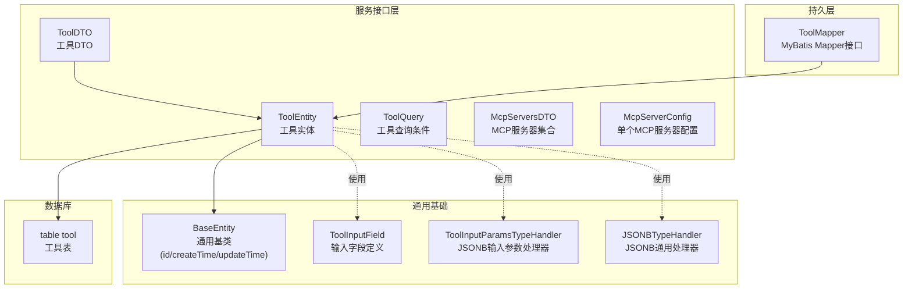
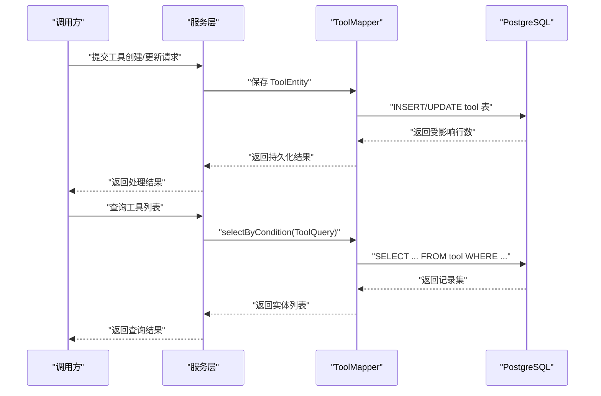
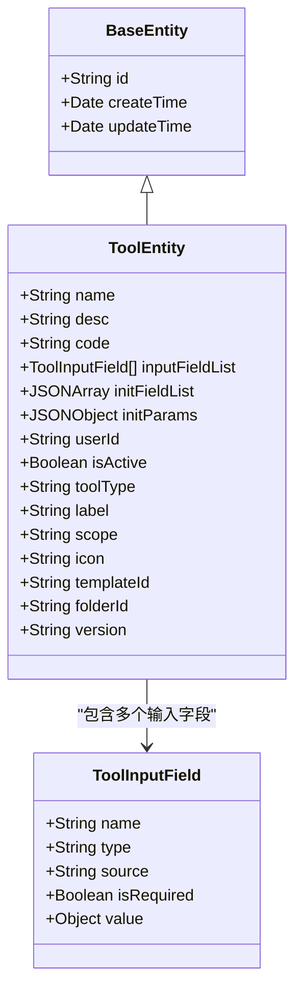
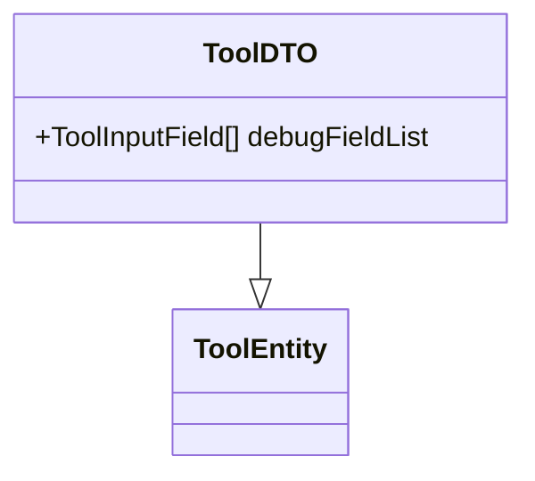
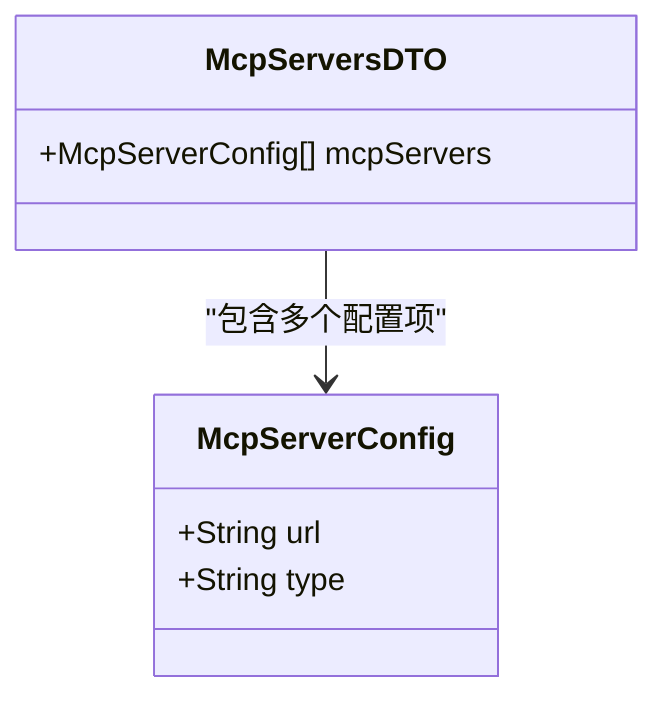
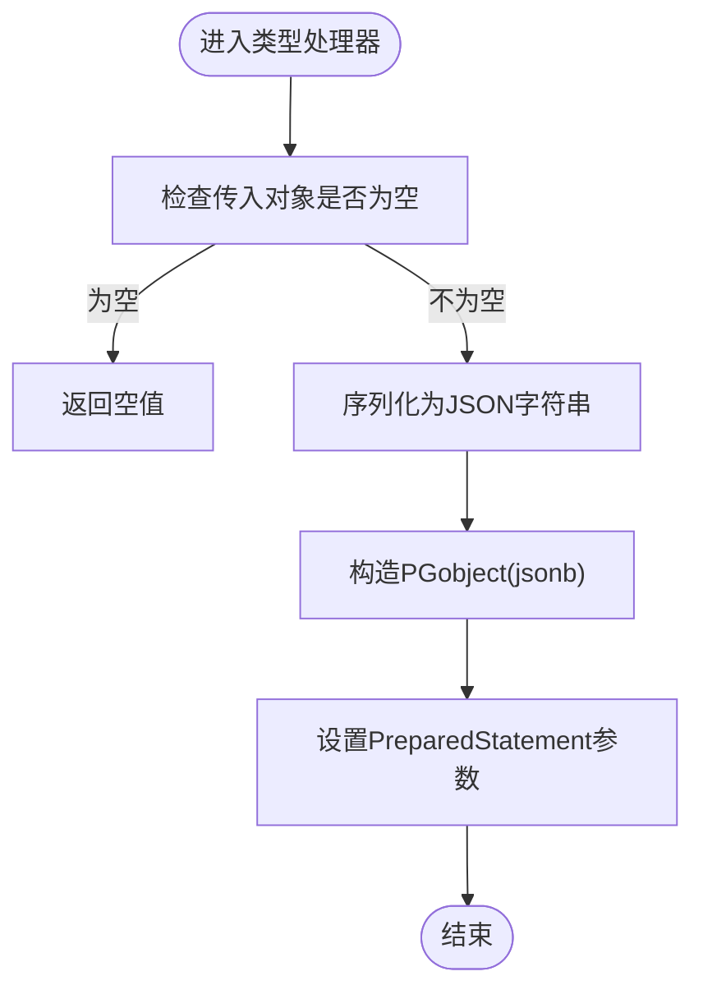
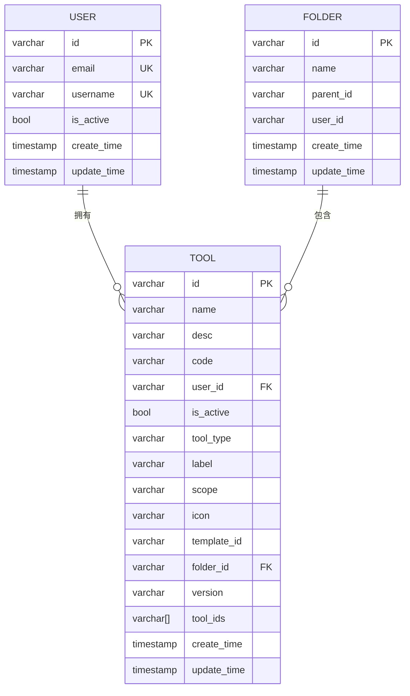

# 工具实体模型

<cite>
**本文引用的文件**
- [ToolEntity.java](file://maxkb4j-service-api/maxkb4j-tool-api/src/main/java/com/maxkb4j/tool/entity/ToolEntity.java)
- [McpServersDTO.java](file://maxkb4j-service-api/maxkb4j-tool-api/src/main/java/com/maxkb4j/tool/dto/McpServersDTO.java)
- [McpServerConfig.java](file://maxkb4j-service-api/maxkb4j-tool-api/src/main/java/com/maxkb4j/tool/dto/McpServerConfig.java)
- [ToolDTO.java](file://maxkb4j-service-api/maxkb4j-tool-api/src/main/java/com/maxkb4j/tool/dto/ToolDTO.java)
- [ToolQuery.java](file://maxkb4j-service-api/maxkb4j-tool-api/src/main/java/com/maxkb4j/tool/dto/ToolQuery.java)
- [ToolMapper.java](file://maxkb4j-service-api/maxkb4j-tool-api/src/main/java/com/maxkb4j/tool/mapper/ToolMapper.java)
- [BaseEntity.java](file://maxkb4j-common/src/main/java/com/maxkb4j/common/mp/base/BaseEntity.java)
- [ToolInputField.java](file://maxkb4j-common/src/main/java/com/maxkb4j/common/mp/entity/ToolInputField.java)
- [ToolInputParamsTypeHandler.java](file://maxkb4j-common/src/main/java/com/maxkb4j/common/typehandler/ToolInputParamsTypeHandler.java)
- [JSONBTypeHandler.java](file://maxkb4j-common/src/main/java/com/maxkb4j/common/typehandler/JSONBTypeHandler.java)
- [V1__init_tables.sql](file://maxkb4j-start/src/main/resources/db/migration/V1__init_tables.sql)
- [V5__add_table.sql](file://maxkb4j-start/src/main/resources/db/migration/V5__add_table.sql)
</cite>

## 目录
1. [简介](#简介)
2. [项目结构](#项目结构)
3. [核心组件](#核心组件)
4. [架构总览](#架构总览)
5. [详细组件分析](#详细组件分析)
6. [依赖分析](#依赖分析)
7. [性能考量](#性能考量)
8. [故障排查指南](#故障排查指南)
9. [结论](#结论)
10. [附录](#附录)

## 简介
本文件系统化梳理 MaxKB4j 工具模块的实体模型与相关 DTO，围绕 ToolEntity、McpServersDTO 等关键实体，详细说明字段定义、数据类型、约束关系与业务含义；重点解释工具管理与 MCP 服务器配置的核心设计；给出实体间关联关系图、主键/外键/索引设计考虑；并提供生命周期管理、数据校验与业务规则约束建议，以及最佳实践与扩展指导。

## 项目结构
工具实体与 DTO 主要位于以下模块与包中：
- 实体与映射：maxkb4j-service-api/maxkb4j-tool-api
  - entity：ToolEntity
  - dto：McpServersDTO、McpServerConfig、ToolDTO、ToolQuery
  - mapper：ToolMapper
- 基类与通用类型处理器：maxkb4j-common
  - mp.base：BaseEntity
  - mp.entity：ToolInputField
  - typehandler：ToolInputParamsTypeHandler、JSONBTypeHandler
- 数据库迁移：maxkb4j-start/resources/db/migration
  - V1__init_tables.sql：定义 tool 表及索引、约束
  - V5__add_table.sql：其他资源映射表（与工具实体无直接外键）

图表来源
- [ToolEntity.java:1-50](file://maxkb4j-service-api/maxkb4j-tool-api/src/main/java/com/maxkb4j/tool/entity/ToolEntity.java#L1-L50)
- [ToolDTO.java:1-15](file://maxkb4j-service-api/maxkb4j-tool-api/src/main/java/com/maxkb4j/tool/dto/ToolDTO.java#L1-L15)
- [ToolQuery.java:1-14](file://maxkb4j-service-api/maxkb4j-tool-api/src/main/java/com/maxkb4j/tool/dto/ToolQuery.java#L1-L14)
- [McpServersDTO.java:1-12](file://maxkb4j-service-api/maxkb4j-tool-api/src/main/java/com/maxkb4j/tool/dto/McpServersDTO.java#L1-L12)
- [McpServerConfig.java:1-10](file://maxkb4j-service-api/maxkb4j-tool-api/src/main/java/com/maxkb4j/tool/dto/McpServerConfig.java#L1-L10)
- [BaseEntity.java:1-25](file://maxkb4j-common/src/main/java/com/maxkb4j/common/mp/base/BaseEntity.java#L1-L25)
- [ToolInputField.java:1-14](file://maxkb4j-common/src/main/java/com/maxkb4j/common/mp/entity/ToolInputField.java#L1-L14)
- [ToolInputParamsTypeHandler.java:1-62](file://maxkb4j-common/src/main/java/com/maxkb4j/common/typehandler/ToolInputParamsTypeHandler.java#L1-L62)
- [JSONBTypeHandler.java:1-60](file://maxkb4j-common/src/main/java/com/maxkb4j/common/typehandler/JSONBTypeHandler.java#L1-L60)
- [ToolMapper.java:1-13](file://maxkb4j-service-api/maxkb4j-tool-api/src/main/java/com/maxkb4j/tool/mapper/ToolMapper.java#L1-L13)
- [V1__init_tables.sql:575-616](file://maxkb4j-start/src/main/resources/db/migration/V1__init_tables.sql#L575-L616)

章节来源
- [ToolEntity.java:1-50](file://maxkb4j-service-api/maxkb4j-tool-api/src/main/java/com/maxkb4j/tool/entity/ToolEntity.java#L1-L50)
- [ToolMapper.java:1-13](file://maxkb4j-service-api/maxkb4j-tool-api/src/main/java/com/maxkb4j/tool/mapper/ToolMapper.java#L1-L13)
- [BaseEntity.java:1-25](file://maxkb4j-common/src/main/java/com/maxkb4j/common/mp/base/BaseEntity.java#L1-L25)
- [ToolInputField.java:1-14](file://maxkb4j-common/src/main/java/com/maxkb4j/common/mp/entity/ToolInputField.java#L1-L14)
- [ToolInputParamsTypeHandler.java:1-62](file://maxkb4j-common/src/main/java/com/maxkb4j/common/typehandler/ToolInputParamsTypeHandler.java#L1-L62)
- [JSONBTypeHandler.java:1-60](file://maxkb4j-common/src/main/java/com/maxkb4j/common/typehandler/JSONBTypeHandler.java#L1-L60)
- [V1__init_tables.sql:575-616](file://maxkb4j-start/src/main/resources/db/migration/V1__init_tables.sql#L575-L616)

## 核心组件
本节聚焦工具实体模型的关键组成与职责边界：
- ToolEntity：工具领域实体，承载工具元数据、输入参数定义、初始化参数与模板/分类信息，并继承通用基类的时间戳字段。
- ToolDTO：在 ToolEntity 基础上扩展调试用输入字段列表，用于前端或调试场景的数据传输。
- ToolQuery：工具查询条件载体，支持按名称、创建人、分类、作用域、类型、状态等维度检索。
- McpServersDTO 与 McpServerConfig：MCP 服务器配置集合与单项配置，用于描述外部 MCP 服务器地址与类型。
- ToolMapper：MyBatis Mapper 接口，继承通用 BaseMapper，提供对 ToolEntity 的 CRUD 能力。
- BaseEntity：统一的主键与时间戳字段，采用 UUID 主键策略与自动填充创建/更新时间。
- ToolInputField：工具输入字段的通用定义，包含字段名、类型、来源、是否必填与默认值。
- ToolInputParamsTypeHandler 与 JSONBTypeHandler：自定义 MyBatis 类型处理器，负责将复杂对象序列化为 JSONB 并持久化到 PostgreSQL 的 jsonb 字段。

章节来源
- [ToolEntity.java:1-50](file://maxkb4j-service-api/maxkb4j-tool-api/src/main/java/com/maxkb4j/tool/entity/ToolEntity.java#L1-L50)
- [ToolDTO.java:1-15](file://maxkb4j-service-api/maxkb4j-tool-api/src/main/java/com/maxkb4j/tool/dto/ToolDTO.java#L1-L15)
- [ToolQuery.java:1-14](file://maxkb4j-service-api/maxkb4j-tool-api/src/main/java/com/maxkb4j/tool/dto/ToolQuery.java#L1-L14)
- [McpServersDTO.java:1-12](file://maxkb4j-service-api/maxkb4j-tool-api/src/main/java/com/maxkb4j/tool/dto/McpServersDTO.java#L1-L12)
- [McpServerConfig.java:1-10](file://maxkb4j-service-api/maxkb4j-tool-api/src/main/java/com/maxkb4j/tool/dto/McpServerConfig.java#L1-L10)
- [ToolMapper.java:1-13](file://maxkb4j-service-api/maxkb4j-tool-api/src/main/java/com/maxkb4j/tool/mapper/ToolMapper.java#L1-L13)
- [BaseEntity.java:1-25](file://maxkb4j-common/src/main/java/com/maxkb4j/common/mp/base/BaseEntity.java#L1-L25)
- [ToolInputField.java:1-14](file://maxkb4j-common/src/main/java/com/maxkb4j/common/mp/entity/ToolInputField.java#L1-L14)
- [ToolInputParamsTypeHandler.java:1-62](file://maxkb4j-common/src/main/java/com/maxkb4j/common/typehandler/ToolInputParamsTypeHandler.java#L1-L62)
- [JSONBTypeHandler.java:1-60](file://maxkb4j-common/src/main/java/com/maxkb4j/common/typehandler/JSONBTypeHandler.java#L1-L60)

## 架构总览
工具实体模型在系统中的位置与交互如下：

图表来源
- [ToolMapper.java:1-13](file://maxkb4j-service-api/maxkb4j-tool-api/src/main/java/com/maxkb4j/tool/mapper/ToolMapper.java#L1-L13)
- [ToolEntity.java:1-50](file://maxkb4j-service-api/maxkb4j-tool-api/src/main/java/com/maxkb4j/tool/entity/ToolEntity.java#L1-L50)
- [ToolQuery.java:1-14](file://maxkb4j-service-api/maxkb4j-tool-api/src/main/java/com/maxkb4j/tool/dto/ToolQuery.java#L1-L14)
- [V1__init_tables.sql:575-616](file://maxkb4j-start/src/main/resources/db/migration/V1__init_tables.sql#L575-L616)

## 详细组件分析

### ToolEntity 实体详解
- 继承关系：继承 BaseEntity，具备 id、createTime、updateTime。
- 关键字段与类型：
  - name：字符串，工具名称
  - desc：字符串，工具描述
  - code：字符串，工具代码/脚本内容
  - inputFieldList：列表，元素为 ToolInputField，通过 ToolInputParamsTypeHandler 持久化为 JSONB
  - initFieldList：JSON 数组，通过 JSONBTypeHandler 持久化
  - initParams：JSON 对象，通过 JSONBTypeHandler 持久化
  - userId：字符串，所属用户标识
  - isActive：布尔，是否启用
  - toolType：字符串，工具类型
  - label：字符串，标签
  - scope：字符串，作用域
  - icon：字符串，图标路径
  - templateId：字符串，模板标识
  - folderId：字符串，分类目录标识
  - version：字符串，版本号
- 映射关系：使用注解指定表名为 tool，开启 autoResultMap；inputFieldList、initFieldList、initParams 使用自定义类型处理器映射到 PostgreSQL 的 jsonb 字段。
- 业务含义：
  - 作为工具的“元数据+配置”载体，既可存储工具代码，也可存储运行时所需的初始化参数与输入字段定义。
  - 通过 userId 与 user 表建立外键关系，实现用户级隔离与权限控制。
  - 通过 folderId 与 folder 表建立外键关系，实现工具分类管理。
  - 通过 templateId 可与模板体系联动，便于批量生成或复用工具。

图表来源
- [ToolEntity.java:1-50](file://maxkb4j-service-api/maxkb4j-tool-api/src/main/java/com/maxkb4j/tool/entity/ToolEntity.java#L1-L50)
- [BaseEntity.java:1-25](file://maxkb4j-common/src/main/java/com/maxkb4j/common/mp/base/BaseEntity.java#L1-L25)
- [ToolInputField.java:1-14](file://maxkb4j-common/src/main/java/com/maxkb4j/common/mp/entity/ToolInputField.java#L1-L14)

章节来源
- [ToolEntity.java:1-50](file://maxkb4j-service-api/maxkb4j-tool-api/src/main/java/com/maxkb4j/tool/entity/ToolEntity.java#L1-L50)
- [BaseEntity.java:1-25](file://maxkb4j-common/src/main/java/com/maxkb4j/common/mp/base/BaseEntity.java#L1-L25)
- [ToolInputField.java:1-14](file://maxkb4j-common/src/main/java/com/maxkb4j/common/mp/entity/ToolInputField.java#L1-L14)
- [ToolInputParamsTypeHandler.java:1-62](file://maxkb4j-common/src/main/java/com/maxkb4j/common/typehandler/ToolInputParamsTypeHandler.java#L1-L62)
- [JSONBTypeHandler.java:1-60](file://maxkb4j-common/src/main/java/com/maxkb4j/common/typehandler/JSONBTypeHandler.java#L1-L60)

### ToolDTO 与 ToolQuery
- ToolDTO：在 ToolEntity 基础上增加 debugFieldList，用于调试阶段的输入字段渲染与校验。
- ToolQuery：提供多维检索条件，包括名称模糊匹配、创建人、分类、作用域、类型、状态等，便于前端分页与筛选。

图表来源
- [ToolDTO.java:1-15](file://maxkb4j-service-api/maxkb4j-tool-api/src/main/java/com/maxkb4j/tool/dto/ToolDTO.java#L1-L15)
- [ToolEntity.java:1-50](file://maxkb4j-service-api/maxkb4j-tool-api/src/main/java/com/maxkb4j/tool/entity/ToolEntity.java#L1-L50)

章节来源
- [ToolDTO.java:1-15](file://maxkb4j-service-api/maxkb4j-tool-api/src/main/java/com/maxkb4j/tool/dto/ToolDTO.java#L1-L15)
- [ToolQuery.java:1-14](file://maxkb4j-service-api/maxkb4j-tool-api/src/main/java/com/maxkb4j/tool/dto/ToolQuery.java#L1-L14)

### MCP 服务器配置模型
- McpServersDTO：封装一组 MCP 服务器配置。
- McpServerConfig：单个 MCP 服务器的地址与类型，用于外部工具执行或代理。

图表来源
- [McpServersDTO.java:1-12](file://maxkb4j-service-api/maxkb4j-tool-api/src/main/java/com/maxkb4j/tool/dto/McpServersDTO.java#L1-L12)
- [McpServerConfig.java:1-10](file://maxkb4j-service-api/maxkb4j-tool-api/src/main/java/com/maxkb4j/tool/dto/McpServerConfig.java#L1-L10)

章节来源
- [McpServersDTO.java:1-12](file://maxkb4j-service-api/maxkb4j-tool-api/src/main/java/com/maxkb4j/tool/dto/McpServersDTO.java#L1-L12)
- [McpServerConfig.java:1-10](file://maxkb4j-service-api/maxkb4j-tool-api/src/main/java/com/maxkb4j/tool/dto/McpServerConfig.java#L1-L10)

### 类型处理器与 JSONB 持久化
- ToolInputParamsTypeHandler：将 List<ToolInputField> 序列化为 JSONB 写入数据库，读取时反序列化为对象列表。
- JSONBTypeHandler：通用 JSONB 处理器，支持 JSONArray/JSONObject 等 JSON 结构的读写。
- 设计要点：
  - 使用 PostgreSQL jsonb 字段存储结构化配置，便于灵活扩展与查询。
  - 处理器确保空值安全与序列化特性（如 null 值处理、数组/字符串空值策略）。

图表来源
- [ToolInputParamsTypeHandler.java:1-62](file://maxkb4j-common/src/main/java/com/maxkb4j/common/typehandler/ToolInputParamsTypeHandler.java#L1-L62)
- [JSONBTypeHandler.java:1-60](file://maxkb4j-common/src/main/java/com/maxkb4j/common/typehandler/JSONBTypeHandler.java#L1-L60)

章节来源
- [ToolInputParamsTypeHandler.java:1-62](file://maxkb4j-common/src/main/java/com/maxkb4j/common/typehandler/ToolInputParamsTypeHandler.java#L1-L62)
- [JSONBTypeHandler.java:1-60](file://maxkb4j-common/src/main/java/com/maxkb4j/common/typehandler/JSONBTypeHandler.java#L1-L60)

## 依赖分析
- 实体与表结构映射：
  - ToolEntity 与数据库表 tool 一一对应，字段覆盖 name、desc、code、userId、isActive、toolType、label、scope、icon、templateId、folderId、version 等；inputFieldList/initFieldList/initParams 对应 jsonb 字段。
  - 外键关系：
    - tool.user_id → user.id（用户级隔离）
    - tool.folder_id → folder.id（分类管理）
- 索引与约束：
  - tool 表主键：id
  - tool 表索引：tool_user_id（user_id 列）
  - 外键约束：tool_user_id_fk_user_id（指向 user.id）

图表来源
- [V1__init_tables.sql:575-616](file://maxkb4j-start/src/main/resources/db/migration/V1__init_tables.sql#L575-L616)
- [ToolEntity.java:1-50](file://maxkb4j-service-api/maxkb4j-tool-api/src/main/java/com/maxkb4j/tool/entity/ToolEntity.java#L1-L50)

章节来源
- [V1__init_tables.sql:575-616](file://maxkb4j-start/src/main/resources/db/migration/V1__init_tables.sql#L575-L616)
- [ToolEntity.java:1-50](file://maxkb4j-service-api/maxkb4j-tool-api/src/main/java/com/maxkb4j/tool/entity/ToolEntity.java#L1-L50)

## 性能考量
- JSONB 存储优势：结构灵活、支持部分更新与查询，适合工具配置的动态性需求。
- 索引策略：当前仅对 user_id 建有索引；若存在高频按 toolType、label、scope、folderId 查询，建议评估新增复合索引以提升查询效率。
- 处理器序列化成本：大量工具配置的序列化/反序列化可能带来 CPU 开销，建议在批量操作时合并请求，避免频繁 I/O。
- 分页与过滤：ToolQuery 支持多维过滤，结合数据库索引与分页可有效降低查询压力。

## 故障排查指南
- JSONB 解析异常：
  - 现象：读取 inputFieldList/initFieldList/initParams 时出现解析错误。
  - 排查：确认数据库中对应字段为合法 JSONB；检查类型处理器是否正确注册；核对序列化特性（如 null 值处理）。
- 外键约束失败：
  - 现象：插入 tool 记录时报 user_id 或 folder_id 外键不存在。
  - 排查：确认 user 与 folder 表中对应的 id 是否存在且拼写一致。
- 主键冲突：
  - 现象：重复插入相同 id 导致主键冲突。
  - 排查：确认使用 UUID 生成策略，避免手动指定 id。

章节来源
- [ToolInputParamsTypeHandler.java:1-62](file://maxkb4j-common/src/main/java/com/maxkb4j/common/typehandler/ToolInputParamsTypeHandler.java#L1-L62)
- [JSONBTypeHandler.java:1-60](file://maxkb4j-common/src/main/java/com/maxkb4j/common/typehandler/JSONBTypeHandler.java#L1-L60)
- [V1__init_tables.sql:575-616](file://maxkb4j-start/src/main/resources/db/migration/V1__init_tables.sql#L575-L616)

## 结论
ToolEntity 与相关 DTO 构成了工具管理与 MCP 配置的核心数据模型。通过 BaseEntity 提供统一主键与时间戳，借助 JSONB 类型处理器实现灵活的结构化配置存储，并通过外键与索引保障数据完整性与查询效率。建议在实际使用中完善索引策略、加强输入校验与异常处理，并结合业务场景扩展工具生命周期与版本管理能力。

## 附录
- 最佳实践
  - 输入参数与初始化参数分离：inputFieldList 用于运行期输入定义，initFieldList/initParams 用于默认值与初始化配置，避免混淆。
  - 字段命名与类型一致性：保持字段名与数据库列名一致，类型与 JSONB 处理器兼容。
  - 版本化与模板化：利用 version 与 templateId 支持工具版本演进与模板复用。
  - 索引优化：根据查询模式为常用过滤字段建立索引，平衡写入与查询性能。
- 扩展指导
  - 新增工具类型：通过 toolType 扩展类型枚举，配合前端与后端逻辑分支处理。
  - MCP 服务器治理：通过 McpServersDTO/McpServerConfig 统一管理外部工具入口，支持多实例与高可用。
  - 审计与追踪：结合 BaseEntity 的时间戳与用户字段，完善变更审计与操作日志。