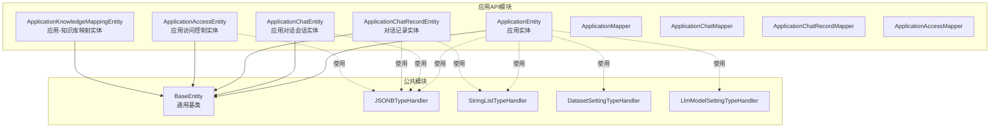
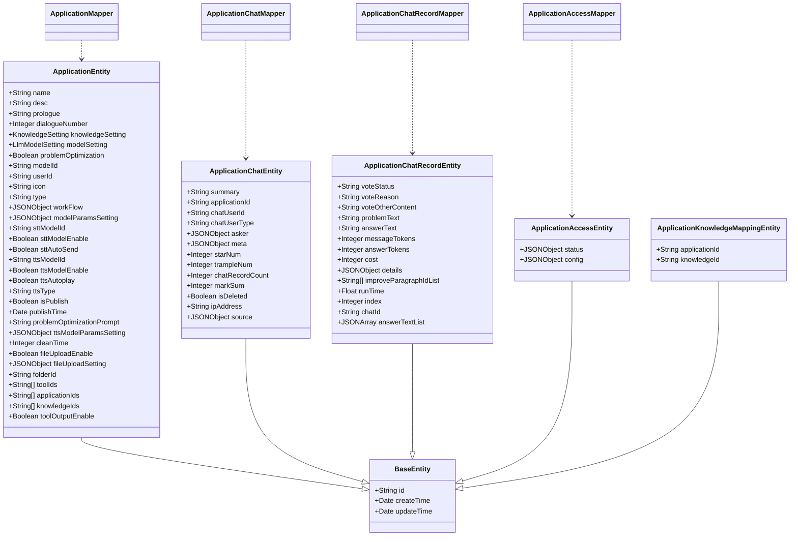
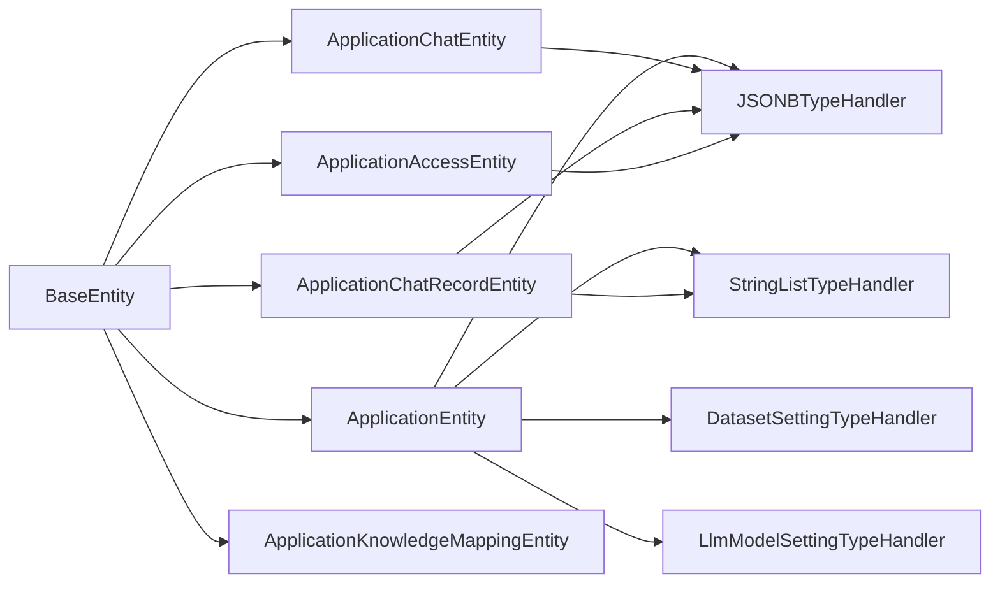

# 应用实体模型

<cite>
**本文引用的文件**
- [ApplicationEntity.java](file://maxkb4j-service-api/maxkb4j-application-api/src/main/java/com/maxkb4j/application/entity/ApplicationEntity.java)
- [ApplicationChatEntity.java](file://maxkb4j-service-api/maxkb4j-application-api/src/main/java/com/maxkb4j/application/entity/ApplicationChatEntity.java)
- [ApplicationChatRecordEntity.java](file://maxkb4j-service-api/maxkb4j-application-api/src/main/java/com/maxkb4j/application/entity/ApplicationChatRecordEntity.java)
- [ApplicationAccessEntity.java](file://maxkb4j-service-api/maxkb4j-application-api/src/main/java/com/maxkb4j/application/entity/ApplicationAccessEntity.java)
- [ApplicationKnowledgeMappingEntity.java](file://maxkb4j-service-api/maxkb4j-application-api/src/main/java/com/maxkb4j/application/entity/ApplicationKnowledgeMappingEntity.java)
- [BaseEntity.java](file://maxkb4j-common/src/main/java/com/maxkb4j/common/mp/base/BaseEntity.java)
- [JSONBTypeHandler.java](file://maxkb4j-common/src/main/java/com/maxkb4j/common/typehandler/JSONBTypeHandler.java)
- [StringListTypeHandler.java](file://maxkb4j-common/src/main/java/com/maxkb4j/common/typehandler/StringListTypeHandler.java)
- [DatasetSettingTypeHandler.java](file://maxkb4j-common/src/main/java/com/maxkb4j/common/typehandler/DatasetSettingTypeHandler.java)
- [LlmModelSettingTypeHandler.java](file://maxkb4j-common/src/main/java/com/maxkb4j/common/typehandler/LlmModelSettingTypeHandler.java)
- [ApplicationMapper.java](file://maxkb4j-service-api/maxkb4j-application-api/src/main/java/com/maxkb4j/application/mapper/ApplicationMapper.java)
- [ApplicationChatMapper.java](file://maxkb4j-service-api/maxkb4j-application-api/src/main/java/com/maxkb4j/application/mapper/ApplicationChatMapper.java)
- [ApplicationChatRecordMapper.java](file://maxkb4j-service-api/maxkb4j-application-api/src/main/java/com/maxkb4j/application/mapper/ApplicationChatRecordMapper.java)
- [ApplicationAccessMapper.java](file://maxkb4j-service-api/maxkb4j-application-api/src/main/java/com/maxkb4j/application/mapper/ApplicationAccessMapper.java)
</cite>

## 目录
1. [简介](#简介)
2. [项目结构](#项目结构)
3. [核心组件](#核心组件)
4. [架构总览](#架构总览)
5. [详细组件分析](#详细组件分析)
6. [依赖分析](#依赖分析)
7. [性能考量](#性能考量)
8. [故障排查指南](#故障排查指南)
9. [结论](#结论)
10. [附录](#附录)

## 简介
本文件系统化梳理 MaxKB4j 中“应用实体模型”的设计与实现，围绕 ApplicationEntity（应用）、ApplicationChatEntity（应用对话会话）、ApplicationChatRecordEntity（对话记录）、ApplicationAccessEntity（应用访问控制）、ApplicationKnowledgeMappingEntity（应用-知识库映射）等核心实体，逐项说明字段定义、数据类型、约束关系与业务含义；并结合 BaseEntity 基类与 MyBatis 类型处理器，解释主键、外键与索引的设计考量，给出生命周期管理、数据验证与业务规则约束建议，最后提供最佳实践与扩展指导。

## 项目结构
应用实体位于 application-api 模块中，采用按领域分层的组织方式：实体类集中于 entity 包，对应的 MyBatis Mapper 接口位于 mapper 包；公共基类 BaseEntity 与通用类型处理器位于 common 模块。该结构清晰分离了“数据模型”和“持久化接口”，便于维护与扩展。

图表来源
- [ApplicationEntity.java:1-104](file://maxkb4j-service-api/maxkb4j-application-api/src/main/java/com/maxkb4j/application/entity/ApplicationEntity.java#L1-L104)
- [ApplicationChatEntity.java:1-36](file://maxkb4j-service-api/maxkb4j-application-api/src/main/java/com/maxkb4j/application/entity/ApplicationChatEntity.java#L1-L36)
- [ApplicationChatRecordEntity.java:1-42](file://maxkb4j-service-api/maxkb4j-application-api/src/main/java/com/maxkb4j/application/entity/ApplicationChatRecordEntity.java#L1-L42)
- [ApplicationAccessEntity.java:1-20](file://maxkb4j-service-api/maxkb4j-application-api/src/main/java/com/maxkb4j/application/entity/ApplicationAccessEntity.java#L1-L20)
- [ApplicationKnowledgeMappingEntity.java:1-20](file://maxkb4j-service-api/maxkb4j-application-api/src/main/java/com/maxkb4j/application/entity/ApplicationKnowledgeMappingEntity.java#L1-L20)
- [BaseEntity.java:1-25](file://maxkb4j-common/src/main/java/com/maxkb4j/common/mp/base/BaseEntity.java#L1-L25)
- [JSONBTypeHandler.java:1-60](file://maxkb4j-common/src/main/java/com/maxkb4j/common/typehandler/JSONBTypeHandler.java#L1-L60)
- [StringListTypeHandler.java:1-48](file://maxkb4j-common/src/main/java/com/maxkb4j/common/typehandler/StringListTypeHandler.java#L1-L48)
- [DatasetSettingTypeHandler.java:1-61](file://maxkb4j-common/src/main/java/com/maxkb4j/common/typehandler/DatasetSettingTypeHandler.java#L1-L61)
- [LlmModelSettingTypeHandler.java:1-61](file://maxkb4j-common/src/main/java/com/maxkb4j/common/typehandler/LlmModelSettingTypeHandler.java#L1-L61)

章节来源
- [ApplicationEntity.java:1-104](file://maxkb4j-service-api/maxkb4j-application-api/src/main/java/com/maxkb4j/application/entity/ApplicationEntity.java#L1-L104)
- [ApplicationChatEntity.java:1-36](file://maxkb4j-service-api/maxkb4j-application-api/src/main/java/com/maxkb4j/application/entity/ApplicationChatEntity.java#L1-L36)
- [ApplicationChatRecordEntity.java:1-42](file://maxkb4j-service-api/maxkb4j-application-api/src/main/java/com/maxkb4j/application/entity/ApplicationChatRecordEntity.java#L1-L42)
- [ApplicationAccessEntity.java:1-20](file://maxkb4j-service-api/maxkb4j-application-api/src/main/java/com/maxkb4j/application/entity/ApplicationAccessEntity.java#L1-L20)
- [ApplicationKnowledgeMappingEntity.java:1-20](file://maxkb4j-service-api/maxkb4j-application-api/src/main/java/com/maxkb4j/application/entity/ApplicationKnowledgeMappingEntity.java#L1-L20)
- [BaseEntity.java:1-25](file://maxkb4j-common/src/main/java/com/maxkb4j/common/mp/base/BaseEntity.java#L1-L25)

## 核心组件
本节对各应用实体进行字段级说明，包括字段名、数据类型、是否可空、业务含义及与类型处理器的关系。所有实体均继承 BaseEntity，具备统一的主键与时间戳字段。

- ApplicationEntity（应用）
  - 字段概览与要点
    - 名称与描述：name（字符串）、desc（字符串）、prologue（字符串）
    - 对话配置：dialogueNumber（整数）
    - 知识库设置：knowledgeSetting（对象，经 DatasetSettingTypeHandler 映射至 JSONB）
    - 大模型设置：modelSetting（对象，经 LlmModelSettingTypeHandler 映射至 JSONB）
    - 问题优化：problemOptimization（布尔）、problemOptimizationPrompt（字符串）
    - 模型选择：modelId（字符串）、sttModelId（字符串）、ttsModelId（字符串）
    - 语音能力开关：sttModelEnable（布尔）、sttAutoSend（布尔）、ttsModelEnable（布尔）、ttsAutoplay（布尔）、ttsType（字符串）、ttsModelParamsSetting（JSONB）
    - 发布状态：isPublish（布尔）、publishTime（日期）
    - 清理策略：cleanTime（整数，单位天）
    - 文件上传：fileUploadEnable（布尔）、fileUploadSetting（JSONB）
    - 分组归属：folderId（字符串）
    - 工具与依赖：toolIds（字符串数组，经 StringListTypeHandler）、toolOutputEnable（布尔）、applicationIds（字符串数组）、knowledgeIds（字符串数组）
    - 流程编排：workFlow（JSONB）、modelParamsSetting（JSONB）
    - 用户归属：userId（字符串）
  - 关系与约束
    - 与知识库：通过 knowledgeIds 与知识库集合关联；独立映射表 ApplicationKnowledgeMappingEntity 提供更细粒度绑定
    - 与工具：通过 toolIds 引用外部工具集合
    - 与模型：通过 modelId、sttModelId、ttsModelId 关联具体模型
    - 与发布：isPublish/publishTime 控制发布生命周期
  - 生命周期
    - 创建：由系统或用户创建，填充基础元信息与配置
    - 配置变更：更新 workFlow、modelSetting、knowledgeSetting 等 JSONB 字段
    - 发布/下线：切换 isPublish 并写入 publishTime
    - 清理：依据 cleanTime 定期清理历史会话与记录
  - 数据验证与业务规则
    - 必填校验：name、userId、modelId
    - 数值范围：dialogueNumber、cleanTime 非负
    - JSON 结构：workFlow、modelParamsSetting、knowledgeSetting、modelSetting、fileUploadSetting 等需符合预期结构
    - 互斥/联动：语音开关与自动行为（如 sttAutoSend、ttsAutoplay）应成对配置
    - 权限：userId 与所属用户/组织关联，避免越权访问

- ApplicationChatEntity（应用对话会话）
  - 字段概览与要点
    - 会话摘要：summary（字符串）
    - 应用关联：applicationId（字符串）
    - 用户标识：chatUserId（字符串）、chatUserType（字符串）
    - 元数据：asker（JSONB）、meta（JSONB）、source（JSONB）
    - 统计指标：starNum（整数）、trampleNum（整数）、chatRecordCount（整数）、markSum（整数）
    - 删除标记：isDeleted（布尔）
    - 来源信息：ipAddress（字符串）
  - 关系与约束
    - 一对多：一个会话包含多个对话记录（ApplicationChatRecordEntity）
    - 外键：applicationId 指向应用；chatUserId 与用户域解耦（支持匿名/第三方用户）
  - 生命周期
    - 创建：首次发起对话时生成
    - 追加：每次新增记录时更新 chatRecordCount 等统计
    - 归档：删除标记 isDeleted 用于软删除
  - 数据验证与业务规则
    - 必填校验：applicationId、chatUserId、chatUserType
    - 统计一致性：chatRecordCount 应与实际记录数一致
    - JSON 结构：asker、meta、source 需满足前端/流程期望

- ApplicationChatRecordEntity（对话记录）
  - 字段概览与要点
    - 投票与反馈：voteStatus（字符串）、voteReason（字符串）、voteOtherContent（字符串）
    - 问题与答案：problemText（字符串）、answerText（字符串）、answerTextList（JSONB 数组）
    - 计费与耗时：messageTokens（整数）、answerTokens（整数）、cost（整数）、runTime（浮点数）、index（整数）
    - 细节与增强：details（JSONB）、improveParagraphIdList（字符串数组）
    - 会话关联：chatId（字符串）
  - 关系与约束
    - 多对一：每条记录属于一个会话（ApplicationChatEntity）
    - 增强链路：improveParagraphIdList 与知识库增强流程关联
  - 生命周期
    - 创建：回答生成后写入
    - 反馈：投票与评价更新 vote* 字段
    - 历史归档：可按时间与会话维度归档
  - 数据验证与业务规则
    - 必填校验：chatId、problemText、answerText
    - 计费一致性：messageTokens、answerTokens、cost 应与模型计费策略一致
    - JSON 结构：details、answerTextList 需符合预期格式

- ApplicationAccessEntity（应用访问控制）
  - 字段概览与要点
    - 状态：status（JSONB）
    - 配置：config（JSONB）
  - 关系与约束
    - 一对一：通常与某个应用存在唯一访问控制配置
  - 生命周期
    - 初始化：创建应用时初始化默认配置
    - 动态调整：运行时根据策略更新 config 与 status
  - 数据验证与业务规则
    - JSON 结构：status、config 需满足访问控制策略定义

- ApplicationKnowledgeMappingEntity（应用-知识库映射）
  - 字段概览与要点
    - 应用标识：applicationId（字符串）
    - 知识库标识：knowledgeId（字符串）
  - 关系与约束
    - 多对多：应用可绑定多个知识库；知识库可被多个应用引用
    - 唯一性：applicationId+knowledgeId 组合建议建立唯一索引以避免重复绑定
  - 生命周期
    - 创建：绑定新知识库时新增映射
    - 解绑：移除知识库时删除映射
  - 数据验证与业务规则
    - 必填校验：applicationId、knowledgeId
    - 存在性：确保目标应用与知识库均存在且有效

章节来源
- [ApplicationEntity.java:1-104](file://maxkb4j-service-api/maxkb4j-application-api/src/main/java/com/maxkb4j/application/entity/ApplicationEntity.java#L1-L104)
- [ApplicationChatEntity.java:1-36](file://maxkb4j-service-api/maxkb4j-application-api/src/main/java/com/maxkb4j/application/entity/ApplicationChatEntity.java#L1-L36)
- [ApplicationChatRecordEntity.java:1-42](file://maxkb4j-service-api/maxkb4j-application-api/src/main/java/com/maxkb4j/application/entity/ApplicationChatRecordEntity.java#L1-L42)
- [ApplicationAccessEntity.java:1-20](file://maxkb4j-service-api/maxkb4j-application-api/src/main/java/com/maxkb4j/application/entity/ApplicationAccessEntity.java#L1-L20)
- [ApplicationKnowledgeMappingEntity.java:1-20](file://maxkb4j-service-api/maxkb4j-application-api/src/main/java/com/maxkb4j/application/entity/ApplicationKnowledgeMappingEntity.java#L1-L20)

## 架构总览
应用实体与 MyBatis Mapper 的关系如下：

图表来源
- [ApplicationEntity.java:1-104](file://maxkb4j-service-api/maxkb4j-application-api/src/main/java/com/maxkb4j/application/entity/ApplicationEntity.java#L1-L104)
- [ApplicationChatEntity.java:1-36](file://maxkb4j-service-api/maxkb4j-application-api/src/main/java/com/maxkb4j/application/entity/ApplicationChatEntity.java#L1-L36)
- [ApplicationChatRecordEntity.java:1-42](file://maxkb4j-service-api/maxkb4j-application-api/src/main/java/com/maxkb4j/application/entity/ApplicationChatRecordEntity.java#L1-L42)
- [ApplicationAccessEntity.java:1-20](file://maxkb4j-service-api/maxkb4j-application-api/src/main/java/com/maxkb4j/application/entity/ApplicationAccessEntity.java#L1-L20)
- [ApplicationKnowledgeMappingEntity.java:1-20](file://maxkb4j-service-api/maxkb4j-application-api/src/main/java/com/maxkb4j/application/entity/ApplicationKnowledgeMappingEntity.java#L1-L20)
- [ApplicationMapper.java:1-15](file://maxkb4j-service-api/maxkb4j-application-api/src/main/java/com/maxkb4j/application/mapper/ApplicationMapper.java#L1-L15)
- [ApplicationChatMapper.java:1-27](file://maxkb4j-service-api/maxkb4j-application-api/src/main/java/com/maxkb4j/application/mapper/ApplicationChatMapper.java#L1-L27)
- [ApplicationChatRecordMapper.java:1-15](file://maxkb4j-service-api/maxkb4j-application-api/src/main/java/com/maxkb4j/application/mapper/ApplicationChatRecordMapper.java#L1-L15)
- [ApplicationAccessMapper.java:1-10](file://maxkb4j-service-api/maxkb4j-application-api/src/main/java/com/maxkb4j/application/mapper/ApplicationAccessMapper.java#L1-L10)

## 详细组件分析

### ApplicationEntity（应用）分析
- 设计要点
  - 使用 JSONB 字段存储复杂配置（workFlow、modelParamsSetting、fileUploadSetting 等），配合 JSONBTypeHandler 实现序列化/反序列化
  - 使用数组字段（toolIds、applicationIds、knowledgeIds）并通过 StringListTypeHandler 映射到数据库数组类型
  - 通过 DatasetSettingTypeHandler 与 LlmModelSettingTypeHandler 将强类型对象持久化为 JSONB，保证结构安全
- 关键字段与业务含义
  - 配置类：knowledgeSetting、modelSetting、modelParamsSetting、fileUploadSetting、ttsModelParamsSetting
  - 能力开关：problemOptimization、sttModelEnable、sttAutoSend、ttsModelEnable、ttsAutoplay、toolOutputEnable、fileUploadEnable
  - 生命周期：isPublish、publishTime、cleanTime
  - 关联标识：modelId、sttModelId、ttsModelId、userId、folderId、knowledgeIds、toolIds、applicationIds
- 复杂度与性能
  - JSONB 查询受限于 PostgreSQL 的索引策略，建议对高频过滤字段建立 GIN/BTree 索引或物化视图
  - 数组查询可通过 ANY/IN 子句实现，注意执行计划与统计信息更新

章节来源
- [ApplicationEntity.java:1-104](file://maxkb4j-service-api/maxkb4j-application-api/src/main/java/com/maxkb4j/application/entity/ApplicationEntity.java#L1-L104)
- [JSONBTypeHandler.java:1-60](file://maxkb4j-common/src/main/java/com/maxkb4j/common/typehandler/JSONBTypeHandler.java#L1-L60)
- [StringListTypeHandler.java:1-48](file://maxkb4j-common/src/main/java/com/maxkb4j/common/typehandler/StringListTypeHandler.java#L1-L48)
- [DatasetSettingTypeHandler.java:1-61](file://maxkb4j-common/src/main/java/com/maxkb4j/common/typehandler/DatasetSettingTypeHandler.java#L1-L61)
- [LlmModelSettingTypeHandler.java:1-61](file://maxkb4j-common/src/main/java/com/maxkb4j/common/typehandler/LlmModelSettingTypeHandler.java#L1-L61)

### ApplicationChatEntity（应用对话会话）分析
- 设计要点
  - 会话级统计字段（starNum、trampleNum、chatRecordCount、markSum）便于快速统计与排序
  - JSONB 字段（asker、meta、source）承载灵活的上下文信息
- 关键字段与业务含义
  - 关联标识：applicationId、chatUserId、chatUserType
  - 来源与元信息：asker、meta、source、ipAddress
  - 删除与归档：isDeleted
- 复杂度与性能
  - 会话统计字段建议在插入/更新记录时原子性维护，避免额外扫描
  - JSONB 字段不建索引时查询成本较高，必要时对常用键建立表达式索引

章节来源
- [ApplicationChatEntity.java:1-36](file://maxkb4j-service-api/maxkb4j-application-api/src/main/java/com/maxkb4j/application/entity/ApplicationChatEntity.java#L1-L36)

### ApplicationChatRecordEntity（对话记录）分析
- 设计要点
  - 多媒体/多轮输出：answerTextList 支持多候选答案
  - 计费与性能：messageTokens、answerTokens、cost、runTime 便于成本与性能分析
  - 增强链路：improveParagraphIdList 与知识库增强流程关联
- 关键字段与业务含义
  - 投票与反馈：voteStatus、voteReason、voteOtherContent
  - 问答文本：problemText、answerText、answerTextList
  - 统计与明细：details、improveParagraphIdList、index
  - 会话关联：chatId
- 复杂度与性能
  - 大文本字段（answerText、details）建议分表或冷热分离
  - JSONB 数组字段查询需注意执行计划，必要时拆分或物化

章节来源
- [ApplicationChatRecordEntity.java:1-42](file://maxkb4j-service-api/maxkb4j-application-api/src/main/java/com/maxkb4j/application/entity/ApplicationChatRecordEntity.java#L1-L42)

### ApplicationAccessEntity（应用访问控制）分析
- 设计要点
  - 通过 JSONB 字段承载动态配置与状态，便于策略扩展
- 关键字段与业务含义
  - config：访问策略配置
  - status：当前状态快照
- 复杂度与性能
  - JSONB 查询需谨慎，建议将热点键提取为独立列并建立索引

章节来源
- [ApplicationAccessEntity.java:1-20](file://maxkb4j-service-api/maxkb4j-application-api/src/main/java/com/maxkb4j/application/entity/ApplicationAccessEntity.java#L1-L20)

### ApplicationKnowledgeMappingEntity（应用-知识库映射）分析
- 设计要点
  - 独立映射表支持灵活的多对多绑定
- 关键字段与业务含义
  - applicationId、knowledgeId
- 复杂度与性能
  - 建议在 (applicationId, knowledgeId) 上建立唯一索引，避免重复绑定
  - 查询时可按应用聚合，或按知识库聚合

章节来源
- [ApplicationKnowledgeMappingEntity.java:1-20](file://maxkb4j-service-api/maxkb4j-application-api/src/main/java/com/maxkb4j/application/entity/ApplicationKnowledgeMappingEntity.java#L1-L20)

## 依赖分析
- 继承关系
  - 所有应用实体均继承 BaseEntity，统一主键与时间戳
- 类型处理器依赖
  - JSONB 字段依赖 JSONBTypeHandler
  - 数组字段依赖 StringListTypeHandler
  - 特定对象（KnowledgeSetting、LlmModelSetting）依赖对应 TypeHandler
- Mapper 接口
  - 各实体均有对应的 MyBatis Mapper 接口，遵循 BaseMapper 约定

图表来源
- [BaseEntity.java:1-25](file://maxkb4j-common/src/main/java/com/maxkb4j/common/mp/base/BaseEntity.java#L1-L25)
- [ApplicationEntity.java:1-104](file://maxkb4j-service-api/maxkb4j-application-api/src/main/java/com/maxkb4j/application/entity/ApplicationEntity.java#L1-L104)
- [ApplicationChatEntity.java:1-36](file://maxkb4j-service-api/maxkb4j-application-api/src/main/java/com/maxkb4j/application/entity/ApplicationChatEntity.java#L1-L36)
- [ApplicationChatRecordEntity.java:1-42](file://maxkb4j-service-api/maxkb4j-application-api/src/main/java/com/maxkb4j/application/entity/ApplicationChatRecordEntity.java#L1-L42)
- [ApplicationAccessEntity.java:1-20](file://maxkb4j-service-api/maxkb4j-application-api/src/main/java/com/maxkb4j/application/entity/ApplicationAccessEntity.java#L1-L20)
- [JSONBTypeHandler.java:1-60](file://maxkb4j-common/src/main/java/com/maxkb4j/common/typehandler/JSONBTypeHandler.java#L1-L60)
- [StringListTypeHandler.java:1-48](file://maxkb4j-common/src/main/java/com/maxkb4j/common/typehandler/StringListTypeHandler.java#L1-L48)
- [DatasetSettingTypeHandler.java:1-61](file://maxkb4j-common/src/main/java/com/maxkb4j/common/typehandler/DatasetSettingTypeHandler.java#L1-L61)
- [LlmModelSettingTypeHandler.java:1-61](file://maxkb4j-common/src/main/java/com/maxkb4j/common/typehandler/LlmModelSettingTypeHandler.java#L1-L61)

章节来源
- [BaseEntity.java:1-25](file://maxkb4j-common/src/main/java/com/maxkb4j/common/mp/base/BaseEntity.java#L1-L25)
- [JSONBTypeHandler.java:1-60](file://maxkb4j-common/src/main/java/com/maxkb4j/common/typehandler/JSONBTypeHandler.java#L1-L60)
- [StringListTypeHandler.java:1-48](file://maxkb4j-common/src/main/java/com/maxkb4j/common/typehandler/StringListTypeHandler.java#L1-L48)
- [DatasetSettingTypeHandler.java:1-61](file://maxkb4j-common/src/main/java/com/maxkb4j/common/typehandler/DatasetSettingTypeHandler.java#L1-L61)
- [LlmModelSettingTypeHandler.java:1-61](file://maxkb4j-common/src/main/java/com/maxkb4j/common/typehandler/LlmModelSettingTypeHandler.java#L1-L61)

## 性能考量
- 主键与索引
  - 主键：UUID（ASSIGN_UUID），适合分布式场景，但可能带来索引碎片，建议定期重建索引
  - 唯一性：ApplicationKnowledgeMapping 建议在 (applicationId, knowledgeId) 上建立唯一索引
  - 高频过滤：对 JSONB 字段中的热点键建立表达式索引（如 GIN/BTree）
- 查询优化
  - JSONB 查询尽量限定条件，避免全表扫描
  - 数组查询使用 ANY/IN，避免复杂的 UNNEST
- 写入优化
  - 批量插入对话记录时合并统计字段更新
  - 对大文本字段进行冷热分离或压缩存储

## 故障排查指南
- JSONB 字段异常
  - 症状：读取为 null 或解析失败
  - 排查：确认 JSONBTypeHandler 是否正确注册；检查数据库字段类型是否为 jsonb；核对序列化/反序列化策略
- 数组字段异常
  - 症状：数组为空或类型不匹配
  - 排查：确认 StringListTypeHandler 注册；检查数据库数组类型与 JDBC 驱动版本
- 外键缺失或不一致
  - 症状：会话或记录无法关联到应用或知识库
  - 排查：核对 applicationId、knowledgeId 是否存在；检查映射表是否存在重复或遗漏
- 统计字段不一致
  - 症状：chatRecordCount 与实际记录数不符
  - 排查：检查插入/更新逻辑是否原子性维护统计字段

章节来源
- [JSONBTypeHandler.java:1-60](file://maxkb4j-common/src/main/java/com/maxkb4j/common/typehandler/JSONBTypeHandler.java#L1-L60)
- [StringListTypeHandler.java:1-48](file://maxkb4j-common/src/main/java/com/maxkb4j/common/typehandler/StringListTypeHandler.java#L1-L48)
- [ApplicationChatEntity.java:1-36](file://maxkb4j-service-api/maxkb4j-application-api/src/main/java/com/maxkb4j/application/entity/ApplicationChatEntity.java#L1-L36)
- [ApplicationChatRecordEntity.java:1-42](file://maxkb4j-service-api/maxkb4j-application-api/src/main/java/com/maxkb4j/application/entity/ApplicationChatRecordEntity.java#L1-L42)
- [ApplicationKnowledgeMappingEntity.java:1-20](file://maxkb4j-service-api/maxkb4j-application-api/src/main/java/com/maxkb4j/application/entity/ApplicationKnowledgeMappingEntity.java#L1-L20)

## 结论
应用实体模型通过 BaseEntity 统一主键与时间戳，借助 JSONB 与数组类型处理器实现灵活配置与高效存储。核心实体覆盖应用配置、会话与记录、访问控制与知识库映射，形成完整的能力闭环。建议在生产环境中强化索引策略、完善数据校验与统计一致性，并持续优化 JSONB 查询路径，以获得更好的性能与可维护性。

## 附录
- 最佳实践
  - 对高频查询字段建立表达式索引
  - 将热点 JSON 键提取为独立列并建立普通索引
  - 对大文本与 JSONB 字段进行冷热分离
  - 在批量写入时保持统计字段的原子性更新
- 扩展指导
  - 新增实体优先继承 BaseEntity
  - 复杂配置使用 JSONBTypeHandler 或专用 TypeHandler
  - 多对多关系优先使用独立映射表并建立唯一索引
  - 对外暴露的 API 层 DTO 与实体分离，避免直接暴露内部字段