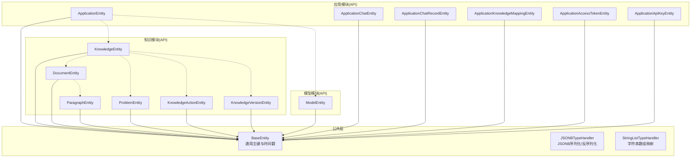
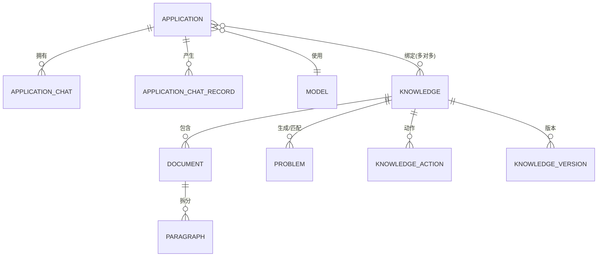

# 核心实体模型

<cite>
**本文引用的文件**
- [BaseEntity.java](file://maxkb4j-common/src/main/java/com/maxkb4j/common/mp/base/BaseEntity.java)
- [ApplicationEntity.java](file://maxkb4j-service-api/maxkb4j-application-api/src/main/java/com/maxkb4j/application/entity/ApplicationEntity.java)
- [ApplicationChatEntity.java](file://maxkb4j-service-api/maxkb4j-application-api/src/main/java/com/maxkb4j/application/entity/ApplicationChatEntity.java)
- [ApplicationChatRecordEntity.java](file://maxkb4j-service-api/maxkb4j-application-api/src/main/java/com/maxkb4j/application/entity/ApplicationChatRecordEntity.java)
- [ApplicationKnowledgeMappingEntity.java](file://maxkb4j-service-api/maxkb4j-application-api/src/main/java/com/maxkb4j/application/entity/ApplicationKnowledgeMappingEntity.java)
- [ApplicationAccessTokenEntity.java](file://maxkb4j-service-api/maxkb4j-application-api/src/main/java/com/maxkb4j/application/entity/ApplicationAccessTokenEntity.java)
- [ApplicationApiKeyEntity.java](file://maxkb4j-service-api/maxkb4j-application-api/src/main/java/com/maxkb4j/application/entity/ApplicationApiKeyEntity.java)
- [KnowledgeEntity.java](file://maxkb4j-service-api/maxkb4j-knowledge-api/src/main/java/com/maxkb4j/knowledge/entity/KnowledgeEntity.java)
- [DocumentEntity.java](file://maxkb4j-service-api/maxkb4j-knowledge-api/src/main/java/com/maxkb4j/knowledge/entity/DocumentEntity.java)
- [ParagraphEntity.java](file://maxkb4j-service-api/maxkb4j-knowledge-api/src/main/java/com/maxkb4j/knowledge/entity/ParagraphEntity.java)
- [ProblemEntity.java](file://maxkb4j-service-api/maxkb4j-knowledge-api/src/main/java/com/maxkb4j/knowledge/entity/ProblemEntity.java)
- [KnowledgeActionEntity.java](file://maxkb4j-service-api/maxkb4j-knowledge-api/src/main/java/com/maxkb4j/knowledge/entity/KnowledgeActionEntity.java)
- [KnowledgeVersionEntity.java](file://maxkb4j-service-api/maxkb4j-knowledge-api/src/main/java/com/maxkb4j/knowledge/entity/KnowledgeVersionEntity.java)
- [ModelEntity.java](file://maxkb4j-service-api/maxkb4j-model-api/src/main/java/com/maxkb4j/model/entity/ModelEntity.java)
- [JSONBTypeHandler.java](file://maxkb4j-common/src/main/java/com/maxkb4j/common/typehandler/JSONBTypeHandler.java)
- [StringListTypeHandler.java](file://maxkb4j-common/src/main/java/com/maxkb4j/common/typehandler/StringListTypeHandler.java)
- [ChatSource.java](file://maxkb4j-common/src/main/java/com/maxkb4j/common/enums/ChatSource.java)
- [ChatUserType.java](file://maxkb4j-common/src/main/java/com/maxkb4j/common/enums/ChatUserType.java)
</cite>

## 目录
1. [简介](#简介)
2. [项目结构](#项目结构)
3. [核心组件](#核心组件)
4. [架构总览](#架构总览)
5. [详细组件分析](#详细组件分析)
6. [依赖分析](#依赖分析)
7. [性能考量](#性能考量)
8. [故障排查指南](#故障排查指南)
9. [结论](#结论)
10. [附录](#附录)

## 简介
本文件聚焦 MaxKB4j 的核心实体模型，围绕应用与知识问答场景的关键实体展开：ApplicationEntity（应用）、ApplicationChatEntity（应用对话会话）、ApplicationChatRecordEntity（对话记录）、KnowledgeEntity（知识库）、DocumentEntity（文档）、ModelEntity（模型）等。文档将从字段定义、数据类型、约束关系、业务含义入手，解释实体间的一对多、多对多关系；给出实体关系图与 ER 图，并说明主键、外键与索引的设计考量；同时覆盖生命周期管理、数据验证与业务规则约束，并提供最佳实践与扩展建议。

## 项目结构
本项目采用多模块分层组织，核心实体位于 service-api 模块中，公共基类与类型处理器位于 common 模块。应用与知识模块分别在对应 API 模块下提供实体、映射器与服务接口。

图表来源
- [BaseEntity.java:12-24](file://maxkb4j-common/src/main/java/com/maxkb4j/common/mp/base/BaseEntity.java#L12-L24)
- [ApplicationEntity.java:26-103](file://maxkb4j-service-api/maxkb4j-application-api/src/main/java/com/maxkb4j/application/entity/ApplicationEntity.java#L26-L103)
- [ApplicationChatEntity.java:17-35](file://maxkb4j-service-api/maxkb4j-application-api/src/main/java/com/maxkb4j/application/entity/ApplicationChatEntity.java#L17-L35)
- [ApplicationChatRecordEntity.java:21-41](file://maxkb4j-service-api/maxkb4j-application-api/src/main/java/com/maxkb4j/application/entity/ApplicationChatRecordEntity.java#L21-L41)
- [ApplicationKnowledgeMappingEntity.java:14-19](file://maxkb4j-service-api/maxkb4j-application-api/src/main/java/com/maxkb4j/application/entity/ApplicationKnowledgeMappingEntity.java#L14-L19)
- [ApplicationAccessTokenEntity.java:22-70](file://maxkb4j-service-api/maxkb4j-application-api/src/main/java/com/maxkb4j/application/entity/ApplicationAccessTokenEntity.java#L22-L70)
- [ApplicationApiKeyEntity.java:18-27](file://maxkb4j-service-api/maxkb4j-application-api/src/main/java/com/maxkb4j/application/entity/ApplicationApiKeyEntity.java#L18-L27)
- [KnowledgeEntity.java:18-34](file://maxkb4j-service-api/maxkb4j-knowledge-api/src/main/java/com/maxkb4j/knowledge/entity/KnowledgeEntity.java#L18-L34)
- [DocumentEntity.java:22-65](file://maxkb4j-service-api/maxkb4j-knowledge-api/src/main/java/com/maxkb4j/knowledge/entity/DocumentEntity.java#L22-L65)
- [ParagraphEntity.java:14-27](file://maxkb4j-service-api/maxkb4j-knowledge-api/src/main/java/com/maxkb4j/knowledge/entity/ParagraphEntity.java#L14-L27)
- [ProblemEntity.java:13-28](file://maxkb4j-service-api/maxkb4j-knowledge-api/src/main/java/com/maxkb4j/knowledge/entity/ProblemEntity.java#L13-L28)
- [KnowledgeActionEntity.java:13-22](file://maxkb4j-service-api/maxkb4j-knowledge-api/src/main/java/com/maxkb4j/knowledge/entity/KnowledgeActionEntity.java#L13-L22)
- [KnowledgeVersionEntity.java:17-25](file://maxkb4j-service-api/maxkb4j-knowledge-api/src/main/java/com/maxkb4j/knowledge/entity/KnowledgeVersionEntity.java#L17-L25)
- [ModelEntity.java:20-43](file://maxkb4j-service-api/maxkb4j-model-api/src/main/java/com/maxkb4j/model/entity/ModelEntity.java#L20-L43)

章节来源
- [BaseEntity.java:12-24](file://maxkb4j-common/src/main/java/com/maxkb4j/common/mp/base/BaseEntity.java#L12-L24)
- [ApplicationEntity.java:26-103](file://maxkb4j-service-api/maxkb4j-application-api/src/main/java/com/maxkb4j/application/entity/ApplicationEntity.java#L26-L103)
- [KnowledgeEntity.java:18-34](file://maxkb4j-service-api/maxkb4j-knowledge-api/src/main/java/com/maxkb4j/knowledge/entity/KnowledgeEntity.java#L18-L34)
- [DocumentEntity.java:22-65](file://maxkb4j-service-api/maxkb4j-knowledge-api/src/main/java/com/maxkb4j/knowledge/entity/DocumentEntity.java#L22-L65)
- [ModelEntity.java:20-43](file://maxkb4j-service-api/maxkb4j-model-api/src/main/java/com/maxkb4j/model/entity/ModelEntity.java#L20-L43)

## 核心组件
本节概述关键实体的职责与典型字段族，便于快速建立整体认知。

- ApplicationEntity（应用）
  - 职责：描述一个可对外提供问答能力的应用实例，包含提示词、模型配置、工具链、文件上传策略、发布状态等。
  - 关键字段族：名称、描述、开场白、对话轮数、知识设置、模型设置、问题优化开关与提示词、语音模型与参数、清理周期、文件上传开关与配置、目录归属、工具/应用/知识列表等。
  - 外键关系：指向用户、模型、知识库、目录等。

- ApplicationChatEntity（应用对话会话）
  - 职责：记录一次应用维度的对话会话，包含摘要、来源元信息、评分统计、记录计数、IP、用户标识与类型等。
  - 关键字段族：摘要、应用ID、聊天用户ID、用户类型、提问者元信息、会话元信息、星标/踩数、记录总数、标记总数、删除标记、IP地址、来源信息等。

- ApplicationChatRecordEntity（对话记录）
  - 职责：记录一次具体的问答消息，包含投票状态与原因、问题文本、答案文本、上下文消耗、运行时长、索引、会话ID、答案列表等。
  - 关键字段族：投票状态/原因/其他内容、问题文本、答案文本、消息/回答Token数、成本、详情、优化段落ID列表、运行时长、序号、会话ID、答案文本列表等。

- KnowledgeEntity（知识库）
  - 职责：描述知识库的基本属性、元数据、嵌入模型、大小/数量限制、工作流、发布状态等。
  - 关键字段族：名称、描述、类型、元数据、所属用户、嵌入模型ID、文件大小/数量限制、目录ID、工作流、发布状态等。

- DocumentEntity（文档）
  - 职责：描述知识库内的单个文档，包含解析状态、激活态、类型、元数据、命中处理策略、相似度阈值、状态元数据等。
  - 关键字段族：名称、字符长度、状态、激活态、类型、元数据、所属知识库、命中处理方法、直接返回相似度阈值、状态元数据等。

- ModelEntity（模型）
  - 职责：描述模型注册信息，包含提供商、凭证、类型、模型名、用户归属、状态、元数据、参数表单等。
  - 关键字段族：名称、模型类型、模型名、提供商、凭证、用户ID、状态、元数据、参数表单等。

章节来源
- [ApplicationEntity.java:26-103](file://maxkb4j-service-api/maxkb4j-application-api/src/main/java/com/maxkb4j/application/entity/ApplicationEntity.java#L26-L103)
- [ApplicationChatEntity.java:17-35](file://maxkb4j-service-api/maxkb4j-application-api/src/main/java/com/maxkb4j/application/entity/ApplicationChatEntity.java#L17-L35)
- [ApplicationChatRecordEntity.java:21-41](file://maxkb4j-service-api/maxkb4j-application-api/src/main/java/com/maxkb4j/application/entity/ApplicationChatRecordEntity.java#L21-L41)
- [KnowledgeEntity.java:18-34](file://maxkb4j-service-api/maxkb4j-knowledge-api/src/main/java/com/maxkb4j/knowledge/entity/KnowledgeEntity.java#L18-L34)
- [DocumentEntity.java:22-65](file://maxkb4j-service-api/maxkb4j-knowledge-api/src/main/java/com/maxkb4j/knowledge/entity/DocumentEntity.java#L22-L65)
- [ModelEntity.java:20-43](file://maxkb4j-service-api/maxkb4j-model-api/src/main/java/com/maxkb4j/model/entity/ModelEntity.java#L20-L43)

## 架构总览
下图展示核心实体间的高层关系与典型关联方向，帮助理解“应用—知识库—文档—段落/问题”的典型数据流转。

图表来源
- [ApplicationEntity.java:26-103](file://maxkb4j-service-api/maxkb4j-application-api/src/main/java/com/maxkb4j/application/entity/ApplicationEntity.java#L26-L103)
- [ApplicationChatEntity.java:17-35](file://maxkb4j-service-api/maxkb4j-application-api/src/main/java/com/maxkb4j/application/entity/ApplicationChatEntity.java#L17-L35)
- [ApplicationChatRecordEntity.java:21-41](file://maxkb4j-service-api/maxkb4j-application-api/src/main/java/com/maxkb4j/application/entity/ApplicationChatRecordEntity.java#L21-L41)
- [ApplicationKnowledgeMappingEntity.java:14-19](file://maxkb4j-service-api/maxkb4j-application-api/src/main/java/com/maxkb4j/application/entity/ApplicationKnowledgeMappingEntity.java#L14-L19)
- [KnowledgeEntity.java:18-34](file://maxkb4j-service-api/maxkb4j-knowledge-api/src/main/java/com/maxkb4j/knowledge/entity/KnowledgeEntity.java#L18-L34)
- [DocumentEntity.java:22-65](file://maxkb4j-service-api/maxkb4j-knowledge-api/src/main/java/com/maxkb4j/knowledge/entity/DocumentEntity.java#L22-L65)
- [ParagraphEntity.java:14-27](file://maxkb4j-service-api/maxkb4j-knowledge-api/src/main/java/com/maxkb4j/knowledge/entity/ParagraphEntity.java#L14-L27)
- [ProblemEntity.java:13-28](file://maxkb4j-service-api/maxkb4j-knowledge-api/src/main/java/com/maxkb4j/knowledge/entity/ProblemEntity.java#L13-L28)
- [KnowledgeActionEntity.java:13-22](file://maxkb4j-service-api/maxkb4j-knowledge-api/src/main/java/com/maxkb4j/knowledge/entity/KnowledgeActionEntity.java#L13-L22)
- [KnowledgeVersionEntity.java:17-25](file://maxkb4j-service-api/maxkb4j-knowledge-api/src/main/java/com/maxkb4j/knowledge/entity/KnowledgeVersionEntity.java#L17-L25)
- [ModelEntity.java:20-43](file://maxkb4j-service-api/maxkb4j-model-api/src/main/java/com/maxkb4j/model/entity/ModelEntity.java#L20-L43)

## 详细组件分析

### ApplicationEntity（应用）分析
- 字段族与业务含义
  - 基础信息：名称、描述、开场白、对话轮数
  - 知识与模型：知识设置、模型设置、问题优化开关与提示词、模型ID
  - 语音：STT/TTS 模型ID、启用开关、自动发送/播放、类型、参数
  - 运营：发布状态、发布时间、清理周期（天）、文件上传开关与配置
  - 组织：所属用户、目录、工具/应用/知识列表、工具输出开关
  - 扩展：工作流、模型参数设置、API密钥/访问令牌等
- 数据类型与约束
  - JSONB 类型字段通过 JSONBTypeHandler 存储复杂结构
  - 列表字段通过 StringListTypeHandler 映射为数据库数组
  - 主键继承自 BaseEntity（UUID）
- 生命周期与业务规则
  - 发布后对外提供问答能力
  - 清理周期用于定期回收会话或记录
  - 文件上传开关与配置控制文档入库策略
- 关系映射
  - 多对多：与知识库通过 ApplicationKnowledgeMappingEntity 关联
  - 多对一：与模型、用户、目录存在外键关系
  - 一对多：与对话会话、对话记录存在外键关系

章节来源
- [ApplicationEntity.java:26-103](file://maxkb4j-service-api/maxkb4j-application-api/src/main/java/com/maxkb4j/application/entity/ApplicationEntity.java#L26-L103)
- [ApplicationKnowledgeMappingEntity.java:14-19](file://maxkb4j-service-api/maxkb4j-application-api/src/main/java/com/maxkb4j/application/entity/ApplicationKnowledgeMappingEntity.java#L14-L19)
- [BaseEntity.java:12-24](file://maxkb4j-common/src/main/java/com/maxkb4j/common/mp/base/BaseEntity.java#L12-L24)
- [JSONBTypeHandler.java:15-59](file://maxkb4j-common/src/main/java/com/maxkb4j/common/typehandler/JSONBTypeHandler.java#L15-L59)
- [StringListTypeHandler.java:11-47](file://maxkb4j-common/src/main/java/com/maxkb4j/common/typehandler/StringListTypeHandler.java#L11-L47)

### ApplicationChatEntity（应用对话会话）分析
- 字段族与业务含义
  - 摘要、来源元信息、评分统计、记录计数、标记总数、删除标记
  - 用户标识与类型、IP地址、提问者与会话元信息
- 数据类型与约束
  - JSONB 字段用于存储动态结构
  - 主键继承自 BaseEntity（UUID）
- 生命周期与业务规则
  - 记录会话级统计与来源信息，支持跨渠道来源追踪
- 关系映射
  - 多对一：与应用、用户存在外键关系
  - 一对多：与对话记录存在外键关系

章节来源
- [ApplicationChatEntity.java:17-35](file://maxkb4j-service-api/maxkb4j-application-api/src/main/java/com/maxkb4j/application/entity/ApplicationChatEntity.java#L17-L35)
- [BaseEntity.java:12-24](file://maxkb4j-common/src/main/java/com/maxkb4j/common/mp/base/BaseEntity.java#L12-L24)
- [JSONBTypeHandler.java:15-59](file://maxkb4j-common/src/main/java/com/maxkb4j/common/typehandler/JSONBTypeHandler.java#L15-L59)
- [ChatSource.java:3-13](file://maxkb4j-common/src/main/java/com/maxkb4j/common/enums/ChatSource.java#L3-L13)
- [ChatUserType.java:3-15](file://maxkb4j-common/src/main/java/com/maxkb4j/common/enums/ChatUserType.java#L3-L15)

### ApplicationChatRecordEntity（对话记录）分析
- 字段族与业务含义
  - 投票状态/原因/其他内容、问题/答案文本、Token消耗、成本、运行时长、索引
  - 详情与答案列表、优化段落ID列表、所属会话
- 数据类型与约束
  - JSONB/JSONArray 用于存储结构化详情与多答案
  - 列表字段映射为数据库数组
  - 主键继承自 BaseEntity（UUID）
- 生命周期与业务规则
  - 支持多答案与优化建议回传
  - 成本与Token用于计费与性能评估
- 关系映射
  - 多对一：与应用对话会话存在外键关系

章节来源
- [ApplicationChatRecordEntity.java:21-41](file://maxkb4j-service-api/maxkb4j-application-api/src/main/java/com/maxkb4j/application/entity/ApplicationChatRecordEntity.java#L21-L41)
- [BaseEntity.java:12-24](file://maxkb4j-common/src/main/java/com/maxkb4j/common/mp/base/BaseEntity.java#L12-L24)
- [JSONBTypeHandler.java:15-59](file://maxkb4j-common/src/main/java/com/maxkb4j/common/typehandler/JSONBTypeHandler.java#L15-L59)
- [StringListTypeHandler.java:11-47](file://maxkb4j-common/src/main/java/com/maxkb4j/common/typehandler/StringListTypeHandler.java#L11-L47)

### KnowledgeEntity（知识库）分析
- 字段族与业务含义
  - 名称、描述、类型、元数据、所属用户、嵌入模型ID、文件大小/数量限制、目录ID、工作流、发布状态
- 数据类型与约束
  - JSONB 字段用于存储元数据与工作流
  - 主键继承自 BaseEntity（UUID）
- 生命周期与业务规则
  - 发布后可被应用绑定并参与检索
  - 工作流用于控制数据处理流程
- 关系映射
  - 一对多：与文档、问题、动作、版本存在外键关系
  - 多对多：与应用通过映射表关联

章节来源
- [KnowledgeEntity.java:18-34](file://maxkb4j-service-api/maxkb4j-knowledge-api/src/main/java/com/maxkb4j/knowledge/entity/KnowledgeEntity.java#L18-L34)
- [BaseEntity.java:12-24](file://maxkb4j-common/src/main/java/com/maxkb4j/common/mp/base/BaseEntity.java#L12-L24)
- [JSONBTypeHandler.java:15-59](file://maxkb4j-common/src/main/java/com/maxkb4j/common/typehandler/JSONBTypeHandler.java#L15-L59)

### DocumentEntity（文档）分析
- 字段族与业务含义
  - 名称、字符长度、状态、激活态、类型、元数据、所属知识库、命中处理方法、直接返回相似度阈值、状态元数据
- 数据类型与约束
  - JSONB 字段用于元数据与状态元数据
  - 构造函数中对名称长度进行截断保护
  - 默认状态、激活态、命中处理策略与相似度阈值
- 生命周期与业务规则
  - 解析状态与激活态控制文档可用性
  - 命中处理策略影响检索效果
- 关系映射
  - 多对一：与知识库存在外键关系
  - 一对多：与段落存在外键关系

章节来源
- [DocumentEntity.java:22-65](file://maxkb4j-service-api/maxkb4j-knowledge-api/src/main/java/com/maxkb4j/knowledge/entity/DocumentEntity.java#L22-L65)
- [BaseEntity.java:12-24](file://maxkb4j-common/src/main/java/com/maxkb4j/common/mp/base/BaseEntity.java#L12-L24)
- [JSONBTypeHandler.java:15-59](file://maxkb4j-common/src/main/java/com/maxkb4j/common/typehandler/JSONBTypeHandler.java#L15-L59)

### ModelEntity（模型）分析
- 字段族与业务含义
  - 名称、模型类型、模型名、提供商、凭证、用户ID、状态、元数据、参数表单
- 数据类型与约束
  - JSONB 字段用于元数据与参数表单
  - 凭证通过专用类型处理器持久化
  - 主键继承自 BaseEntity（UUID）
- 生命周期与业务规则
  - 状态字段控制模型可用性
  - 参数表单用于前端渲染与校验
- 关系映射
  - 多对一：与用户存在外键关系
  - 多对一：与应用存在外键关系（通过应用配置）

章节来源
- [ModelEntity.java:20-43](file://maxkb4j-service-api/maxkb4j-model-api/src/main/java/com/maxkb4j/model/entity/ModelEntity.java#L20-L43)
- [BaseEntity.java:12-24](file://maxkb4j-common/src/main/java/com/maxkb4j/common/mp/base/BaseEntity.java#L12-L24)
- [JSONBTypeHandler.java:15-59](file://maxkb4j-common/src/main/java/com/maxkb4j/common/typehandler/JSONBTypeHandler.java#L15-L59)

### 其他相关实体（辅助理解）
- ApplicationKnowledgeMappingEntity（应用—知识库映射）
  - 多对多中间表，包含应用ID与知识库ID
- ApplicationAccessTokenEntity（应用访问令牌）
  - 主键为应用ID，包含访问令牌、白名单、跨域、语言等配置
- ApplicationApiKeyEntity（应用API密钥）
  - 继承通用基类，包含密钥、状态、应用与用户归属、跨域列表
- ParagraphEntity（段落）
  - 文档切分后的最小单元，包含标题、内容、状态、命中次数、位置等
- ProblemEntity（问题）
  - 与知识库关联的问题条目，包含内容、命中次数
- KnowledgeActionEntity（知识动作）
  - 知识库的动作记录，包含状态、详情、运行时长、元数据、知识库ID
- KnowledgeVersionEntity（知识版本）
  - 知识库的工作流版本，包含名称、发布人、知识库ID、工作流

章节来源
- [ApplicationKnowledgeMappingEntity.java:14-19](file://maxkb4j-service-api/maxkb4j-application-api/src/main/java/com/maxkb4j/application/entity/ApplicationKnowledgeMappingEntity.java#L14-L19)
- [ApplicationAccessTokenEntity.java:22-70](file://maxkb4j-service-api/maxkb4j-application-api/src/main/java/com/maxkb4j/application/entity/ApplicationAccessTokenEntity.java#L22-L70)
- [ApplicationApiKeyEntity.java:18-27](file://maxkb4j-service-api/maxkb4j-application-api/src/main/java/com/maxkb4j/application/entity/ApplicationApiKeyEntity.java#L18-L27)
- [ParagraphEntity.java:14-27](file://maxkb4j-service-api/maxkb4j-knowledge-api/src/main/java/com/maxkb4j/knowledge/entity/ParagraphEntity.java#L14-L27)
- [ProblemEntity.java:13-28](file://maxkb4j-service-api/maxkb4j-knowledge-api/src/main/java/com/maxkb4j/knowledge/entity/ProblemEntity.java#L13-L28)
- [KnowledgeActionEntity.java:13-22](file://maxkb4j-service-api/maxkb4j-knowledge-api/src/main/java/com/maxkb4j/knowledge/entity/KnowledgeActionEntity.java#L13-L22)
- [KnowledgeVersionEntity.java:17-25](file://maxkb4j-service-api/maxkb4j-knowledge-api/src/main/java/com/maxkb4j/knowledge/entity/KnowledgeVersionEntity.java#L17-L25)

## 依赖分析
- 类型处理器
  - JSONBTypeHandler：将 JSON 对象序列化为 PostgreSQL 的 jsonb 存储，反序列化读取
  - StringListTypeHandler：将字符串列表映射为数据库数组类型
- 枚举
  - ChatSource：会话来源类型
  - ChatUserType：用户类型枚举
- 基类
  - BaseEntity：统一主键（UUID）、创建/更新时间填充

```mermaid
classDiagram
class BaseEntity {
+String id
+Date createTime
+Date updateTime
}
class ApplicationEntity
class ApplicationChatEntity
class ApplicationChatRecordEntity
class ApplicationKnowledgeMappingEntity
class ApplicationAccessTokenEntity
class ApplicationApiKeyEntity
class KnowledgeEntity
class DocumentEntity
class ParagraphEntity
class ProblemEntity
class KnowledgeActionEntity
class KnowledgeVersionEntity
class ModelEntity
class JSONBTypeHandler
class StringListTypeHandler
class ChatSource
class ChatUserType
ApplicationEntity --> BaseEntity
ApplicationChatEntity --> BaseEntity
ApplicationChatRecordEntity --> BaseEntity
ApplicationKnowledgeMappingEntity --> BaseEntity
ApplicationAccessTokenEntity --> BaseEntity
ApplicationApiKeyEntity --> BaseEntity
KnowledgeEntity --> BaseEntity
DocumentEntity --> BaseEntity
ParagraphEntity --> BaseEntity
ProblemEntity --> BaseEntity
KnowledgeActionEntity --> BaseEntity
KnowledgeVersionEntity --> BaseEntity
ModelEntity --> BaseEntity
```

图表来源
- [BaseEntity.java:12-24](file://maxkb4j-common/src/main/java/com/maxkb4j/common/mp/base/BaseEntity.java#L12-L24)
- [JSONBTypeHandler.java:15-59](file://maxkb4j-common/src/main/java/com/maxkb4j/common/typehandler/JSONBTypeHandler.java#L15-L59)
- [StringListTypeHandler.java:11-47](file://maxkb4j-common/src/main/java/com/maxkb4j/common/typehandler/StringListTypeHandler.java#L11-L47)
- [ChatSource.java:3-13](file://maxkb4j-common/src/main/java/com/maxkb4j/common/enums/ChatSource.java#L3-L13)
- [ChatUserType.java:3-15](file://maxkb4j-common/src/main/java/com/maxkb4j/common/enums/ChatUserType.java#L3-L15)
- [ApplicationEntity.java:26-103](file://maxkb4j-service-api/maxkb4j-application-api/src/main/java/com/maxkb4j/application/entity/ApplicationEntity.java#L26-L103)
- [ApplicationChatEntity.java:17-35](file://maxkb4j-service-api/maxkb4j-application-api/src/main/java/com/maxkb4j/application/entity/ApplicationChatEntity.java#L17-L35)
- [ApplicationChatRecordEntity.java:21-41](file://maxkb4j-service-api/maxkb4j-application-api/src/main/java/com/maxkb4j/application/entity/ApplicationChatRecordEntity.java#L21-L41)
- [ApplicationKnowledgeMappingEntity.java:14-19](file://maxkb4j-service-api/maxkb4j-application-api/src/main/java/com/maxkb4j/application/entity/ApplicationKnowledgeMappingEntity.java#L14-L19)
- [ApplicationAccessTokenEntity.java:22-70](file://maxkb4j-service-api/maxkb4j-application-api/src/main/java/com/maxkb4j/application/entity/ApplicationAccessTokenEntity.java#L22-L70)
- [ApplicationApiKeyEntity.java:18-27](file://maxkb4j-service-api/maxkb4j-application-api/src/main/java/com/maxkb4j/application/entity/ApplicationApiKeyEntity.java#L18-L27)
- [KnowledgeEntity.java:18-34](file://maxkb4j-service-api/maxkb4j-knowledge-api/src/main/java/com/maxkb4j/knowledge/entity/KnowledgeEntity.java#L18-L34)
- [DocumentEntity.java:22-65](file://maxkb4j-service-api/maxkb4j-knowledge-api/src/main/java/com/maxkb4j/knowledge/entity/DocumentEntity.java#L22-L65)
- [ParagraphEntity.java:14-27](file://maxkb4j-service-api/maxkb4j-knowledge-api/src/main/java/com/maxkb4j/knowledge/entity/ParagraphEntity.java#L14-L27)
- [ProblemEntity.java:13-28](file://maxkb4j-service-api/maxkb4j-knowledge-api/src/main/java/com/maxkb4j/knowledge/entity/ProblemEntity.java#L13-L28)
- [KnowledgeActionEntity.java:13-22](file://maxkb4j-service-api/maxkb4j-knowledge-api/src/main/java/com/maxkb4j/knowledge/entity/KnowledgeActionEntity.java#L13-L22)
- [KnowledgeVersionEntity.java:17-25](file://maxkb4j-service-api/maxkb4j-knowledge-api/src/main/java/com/maxkb4j/knowledge/entity/KnowledgeVersionEntity.java#L17-L25)
- [ModelEntity.java:20-43](file://maxkb4j-service-api/maxkb4j-model-api/src/main/java/com/maxkb4j/model/entity/ModelEntity.java#L20-L43)

## 性能考量
- JSONB 字段
  - 适合存储动态结构，但需注意查询条件尽量避免对 JSONB 进行全表扫描；必要时在数据库侧建立 GIN 索引或在应用层做预聚合
- 数组字段
  - 使用 StringListTypeHandler 映射为数据库数组，查询时可通过数组操作符优化匹配
- UUID 主键
  - 避免热点写入，但可能带来索引碎片；建议结合业务分区或归档策略
- 时间戳填充
  - 自动维护创建/更新时间，减少业务代码重复，提升一致性

## 故障排查指南
- JSONB 写入失败
  - 检查 JSONBTypeHandler 是否正确注册，确认对象非空且可序列化
- 数组字段为空
  - 确认 StringListTypeHandler 注册与数据库驱动支持数组类型
- 主键冲突或重复
  - BaseEntity 使用 UUID，确保未被外部逻辑覆盖
- 会话来源/用户类型异常
  - 校验 ChatSource 与 ChatUserType 枚举值是否符合预期

章节来源
- [JSONBTypeHandler.java:15-59](file://maxkb4j-common/src/main/java/com/maxkb4j/common/typehandler/JSONBTypeHandler.java#L15-L59)
- [StringListTypeHandler.java:11-47](file://maxkb4j-common/src/main/java/com/maxkb4j/common/typehandler/StringListTypeHandler.java#L11-L47)
- [BaseEntity.java:12-24](file://maxkb4j-common/src/main/java/com/maxkb4j/common/mp/base/BaseEntity.java#L12-L24)
- [ChatSource.java:3-13](file://maxkb4j-common/src/main/java/com/maxkb4j/common/enums/ChatSource.java#L3-L13)
- [ChatUserType.java:3-15](file://maxkb4j-common/src/main/java/com/maxkb4j/common/enums/ChatUserType.java#L3-L15)

## 结论
上述核心实体围绕“应用—知识库—文档—段落/问题”构建了完整的问答数据通路，配合 JSONB 与数组类型的灵活存储，满足动态配置与高性能检索需求。通过 BaseEntity 的统一主键与时间戳管理，以及类型处理器的标准化序列化机制，提升了系统的可维护性与扩展性。建议在生产环境中针对 JSONB 与数组字段建立合适的索引策略，并完善数据校验与审计日志。

## 附录
- 最佳实践
  - 对高频查询字段建立索引（如应用ID、知识库ID、文档ID、用户ID）
  - 对 JSONB 字段的常用键进行物化视图或预聚合
  - 使用 UUID 作为主键，避免自增主键带来的并发与迁移问题
  - 在实体构造阶段完成默认值初始化与长度/范围校验
- 扩展指导
  - 新增实体优先继承 BaseEntity，统一主键与时间戳
  - 复杂配置使用 JSONB 字段，配合类型处理器进行序列化
  - 多对多关系通过中间映射表实现，保持外键清晰
  - 对于枚举型字段，集中定义并在类型处理器中进行转换