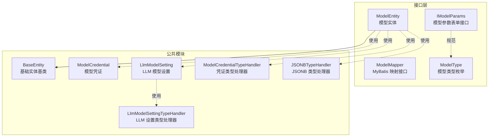
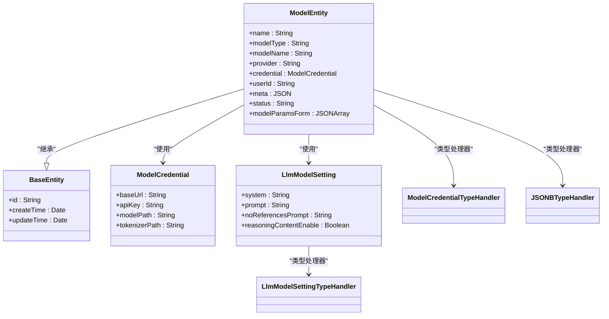
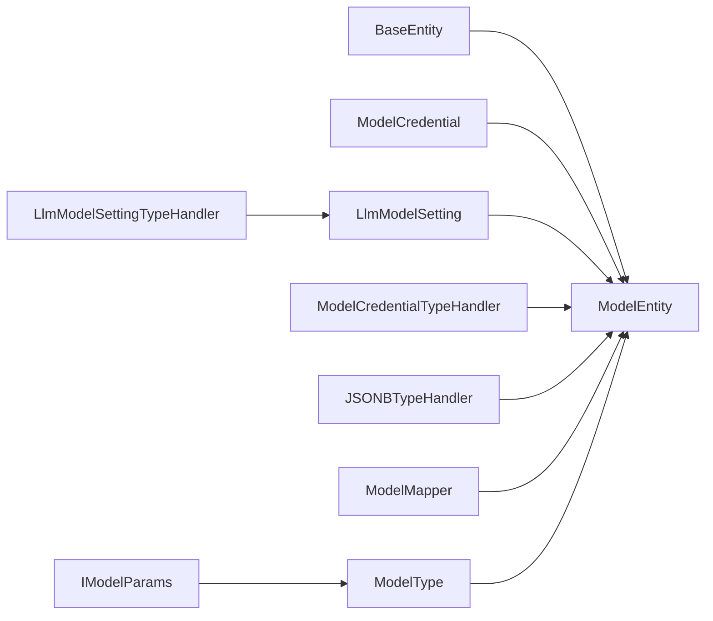

# 模型实体模型

<cite>
**本文引用的文件**
- [ModelEntity.java](file://maxkb4j-service-api/maxkb4j-model-api/src/main/java/com/maxkb4j/model/entity/ModelEntity.java)
- [ModelMapper.java](file://maxkb4j-service-api/maxkb4j-model-api/src/main/java/com/maxkb4j/model/mapper/ModelMapper.java)
- [BaseEntity.java](file://maxkb4j-common/src/main/java/com/maxkb4j/common/mp/base/BaseEntity.java)
- [ModelCredential.java](file://maxkb4j-common/src/main/java/com/maxkb4j/common/mp/entity/ModelCredential.java)
- [LlmModelSetting.java](file://maxkb4j-common/src/main/java/com/maxkb4j/common/mp/entity/LlmModelSetting.java)
- [ModelCredentialTypeHandler.java](file://maxkb4j-common/src/main/java/com/maxkb4j/common/typehandler/ModelCredentialTypeHandler.java)
- [LlmModelSettingTypeHandler.java](file://maxkb4j-common/src/main/java/com/maxkb4j/common/typehandler/LlmModelSettingTypeHandler.java)
- [JSONBTypeHandler.java](file://maxkb4j-common/src/main/java/com/maxkb4j/common/typehandler/JSONBTypeHandler.java)
- [ModelType.java](file://maxkb4j-service-api/maxkb4j-model-api/src/main/java/com/maxkb4j/model/enums/ModelType.java)
- [IModelParams.java](file://maxkb4j-service-api/maxkb4j-model-api/src/main/java/com/maxkb4j/model/service/IModelParams.java)
</cite>

## 目录
1. [简介](#简介)
2. [项目结构](#项目结构)
3. [核心组件](#核心组件)
4. [架构总览](#架构总览)
5. [详细组件分析](#详细组件分析)
6. [依赖分析](#依赖分析)
7. [性能考量](#性能考量)
8. [故障排查指南](#故障排查指南)
9. [结论](#结论)
10. [附录](#附录)

## 简介
本文件围绕模型实体模型展开，系统性梳理与模型管理、凭证管理、模型配置相关的实体与映射关系。重点覆盖以下内容：
- 实体字段定义、数据类型、约束关系与业务含义
- 模型管理、凭证管理、模型配置的核心功能实体设计
- 实体之间的关联关系图（主键、外键、索引设计考虑）
- 生命周期管理、数据验证规则与业务规则约束
- 开发者最佳实践与扩展指导

## 项目结构
模型相关实体位于服务接口模块与公共模块中，采用“接口层 + 公共实体 + 类型处理器”的分层组织方式：
- 接口层：定义实体与持久化映射接口
- 公共模块：提供通用实体、基础基类与类型处理器
- 枚举与参数接口：统一模型类型与表单参数规范

图表来源
- [ModelEntity.java:1-44](file://maxkb4j-service-api/maxkb4j-model-api/src/main/java/com/maxkb4j/model/entity/ModelEntity.java#L1-L44)
- [ModelMapper.java:1-16](file://maxkb4j-service-api/maxkb4j-model-api/src/main/java/com/maxkb4j/model/mapper/ModelMapper.java#L1-L16)
- [BaseEntity.java:1-25](file://maxkb4j-common/src/main/java/com/maxkb4j/common/mp/base/BaseEntity.java#L1-L25)
- [ModelCredential.java:1-12](file://maxkb4j-common/src/main/java/com/maxkb4j/common/mp/entity/ModelCredential.java#L1-L12)
- [LlmModelSetting.java:1-13](file://maxkb4j-common/src/main/java/com/maxkb4j/common/mp/entity/LlmModelSetting.java#L1-L13)
- [ModelCredentialTypeHandler.java:1-71](file://maxkb4j-common/src/main/java/com/maxkb4j/common/typehandler/ModelCredentialTypeHandler.java#L1-L71)
- [LlmModelSettingTypeHandler.java:1-61](file://maxkb4j-common/src/main/java/com/maxkb4j/common/typehandler/LlmModelSettingTypeHandler.java#L1-L61)
- [JSONBTypeHandler.java:1-40](file://maxkb4j-common/src/main/java/com/maxkb4j/common/typehandler/JSONBTypeHandler.java#L1-L40)
- [ModelType.java:1-54](file://maxkb4j-service-api/maxkb4j-model-api/src/main/java/com/maxkb4j/model/enums/ModelType.java#L1-L54)
- [IModelParams.java:1-12](file://maxkb4j-service-api/maxkb4j-model-api/src/main/java/com/maxkb4j/model/service/IModelParams.java#L1-L12)

章节来源
- [ModelEntity.java:1-44](file://maxkb4j-service-api/maxkb4j-model-api/src/main/java/com/maxkb4j/model/entity/ModelEntity.java#L1-L44)
- [ModelMapper.java:1-16](file://maxkb4j-service-api/maxkb4j-model-api/src/main/java/com/maxkb4j/model/mapper/ModelMapper.java#L1-L16)
- [BaseEntity.java:1-25](file://maxkb4j-common/src/main/java/com/maxkb4j/common/mp/base/BaseEntity.java#L1-L25)
- [ModelCredential.java:1-12](file://maxkb4j-common/src/main/java/com/maxkb4j/common/mp/entity/ModelCredential.java#L1-L12)
- [LlmModelSetting.java:1-13](file://maxkb4j-common/src/main/java/com/maxkb4j/common/mp/entity/LlmModelSetting.java#L1-L13)
- [ModelCredentialTypeHandler.java:1-71](file://maxkb4j-common/src/main/java/com/maxkb4j/common/typehandler/ModelCredentialTypeHandler.java#L1-L71)
- [LlmModelSettingTypeHandler.java:1-61](file://maxkb4j-common/src/main/java/com/maxkb4j/common/typehandler/LlmModelSettingTypeHandler.java#L1-L61)
- [JSONBTypeHandler.java:1-40](file://maxkb4j-common/src/main/java/com/maxkb4j/common/typehandler/JSONBTypeHandler.java#L1-L40)
- [ModelType.java:1-54](file://maxkb4j-service-api/maxkb4j-model-api/src/main/java/com/maxkb4j/model/enums/ModelType.java#L1-L54)
- [IModelParams.java:1-12](file://maxkb4j-service-api/maxkb4j-model-api/src/main/java/com/maxkb4j/model/service/IModelParams.java#L1-L12)

## 核心组件
本节对模型相关的核心实体进行逐项解析，包括字段定义、数据类型、约束关系与业务含义。

- ModelEntity（模型实体）
  - 继承自 BaseEntity，具备标准主键与时间戳字段
  - 关键字段
    - 名称：字符串，用于标识模型实例
    - 模型类型：字符串，参考 ModelType 枚举
    - 模型名称：字符串，具体模型标识
    - 提供方：字符串，模型提供方标识
    - 凭证：ModelCredential 对象，通过 ModelCredentialTypeHandler 进行加密存储
    - 用户标识：字符串，归属用户或租户
    - 元数据：JSON 结构，通过 JSONBTypeHandler 存储
    - 状态：字符串，模型可用性状态
    - 模型参数表单：JSON 数组，描述动态表单结构
  - 约束与关系
    - 主键：继承 BaseEntity 的 UUID 主键
    - 外键：未见显式外键字段；若存在关联可由业务逻辑维护
    - 索引：未见显式索引定义；建议按 provider、modelType、userId 建立组合索引以优化查询
  - 业务含义
    - 用于统一管理各类模型（LLM、嵌入、语音、视觉等）的元信息与运行参数
    - 通过凭证与元数据实现跨提供方的可插拔配置

- ModelCredential（模型凭证）
  - 字段
    - 基础地址：字符串，提供方 API 基础地址
    - 密钥：字符串，访问令牌或密钥
    - 模型路径：字符串，本地或远程模型路径
    - 分词器路径：字符串，分词器资源路径
  - 约束与关系
    - 该对象在数据库中以加密形式存储，读取时自动解密
  - 业务含义
    - 封装访问提供方所需的凭据信息，避免明文存储

- LlmModelSetting（LLM 模型设置）
  - 字段
    - 系统提示：字符串
    - 提示模板：字符串
    - 无引用提示：字符串
    - 推理内容开关：布尔值
  - 约束与关系
    - 以 JSONB 形式存储，便于扩展与检索
  - 业务含义
    - 定义 LLM 的行为策略与提示模板，支持推理内容控制

- ModelMapper（模型映射接口）
  - 角色：MyBatis Mapper 接口，负责 ModelEntity 的 CRUD 访问
  - 设计要点：基于 BaseMapper，无需手写 SQL 即可完成常用操作

- ModelType（模型类型枚举）
  - 可用类型：LLM、EMBEDDING、STT、TTS、VISION、TTI、RERANKER
  - 用途：统一模型分类，便于前端展示与后端路由

- IModelParams（模型参数表单接口）
  - 规范：提供 toForm() 方法，返回动态表单字段列表
  - 用途：为不同模型提供一致的参数收集与校验入口

章节来源
- [ModelEntity.java:1-44](file://maxkb4j-service-api/maxkb4j-model-api/src/main/java/com/maxkb4j/model/entity/ModelEntity.java#L1-L44)
- [ModelCredential.java:1-12](file://maxkb4j-common/src/main/java/com/maxkb4j/common/mp/entity/ModelCredential.java#L1-L12)
- [LlmModelSetting.java:1-13](file://maxkb4j-common/src/main/java/com/maxkb4j/common/mp/entity/LlmModelSetting.java#L1-L13)
- [ModelMapper.java:1-16](file://maxkb4j-service-api/maxkb4j-model-api/src/main/java/com/maxkb4j/model/mapper/ModelMapper.java#L1-L16)
- [ModelType.java:1-54](file://maxkb4j-service-api/maxkb4j-model-api/src/main/java/com/maxkb4j/model/enums/ModelType.java#L1-L54)
- [IModelParams.java:1-12](file://maxkb4j-service-api/maxkb4j-model-api/src/main/java/com/maxkb4j/model/service/IModelParams.java#L1-L12)

## 架构总览
下图展示了模型实体与其类型处理器、基础基类及枚举之间的整体关系：

图表来源
- [ModelEntity.java:1-44](file://maxkb4j-service-api/maxkb4j-model-api/src/main/java/com/maxkb4j/model/entity/ModelEntity.java#L1-L44)
- [BaseEntity.java:1-25](file://maxkb4j-common/src/main/java/com/maxkb4j/common/mp/base/BaseEntity.java#L1-L25)
- [ModelCredential.java:1-12](file://maxkb4j-common/src/main/java/com/maxkb4j/common/mp/entity/ModelCredential.java#L1-L12)
- [LlmModelSetting.java:1-13](file://maxkb4j-common/src/main/java/com/maxkb4j/common/mp/entity/LlmModelSetting.java#L1-L13)
- [ModelCredentialTypeHandler.java:1-71](file://maxkb4j-common/src/main/java/com/maxkb4j/common/typehandler/ModelCredentialTypeHandler.java#L1-L71)
- [LlmModelSettingTypeHandler.java:1-61](file://maxkb4j-common/src/main/java/com/maxkb4j/common/typehandler/LlmModelSettingTypeHandler.java#L1-L61)
- [JSONBTypeHandler.java:1-40](file://maxkb4j-common/src/main/java/com/maxkb4j/common/typehandler/JSONBTypeHandler.java#L1-L40)

## 详细组件分析

### ModelEntity（模型实体）
- 字段与类型
  - name: 字符串，模型显示名称
  - modelType: 字符串，参考 ModelType.key
  - modelName: 字符串，具体模型标识
  - provider: 字符串，提供方标识
  - credential: ModelCredential，加密存储
  - userId: 字符串，归属用户或租户
  - meta: JSON，PG jsonb 存储
  - status: 字符串，状态码
  - modelParamsForm: JSON 数组，动态表单定义
- 约束与关系
  - 主键：UUID（继承 BaseEntity）
  - 外键：无显式外键字段
  - 索引：建议按 provider、modelType、userId 建议组合索引
- 生命周期
  - 创建：插入时填充 createTime
  - 更新：更新时填充 updateTime
- 数据验证与业务规则
  - modelType 必须来自 ModelType 枚举
  - credential 非空时必须通过 ModelCredentialTypeHandler 正确序列化/反序列化
  - meta 与 modelParamsForm 为 JSON 结构，需保证格式合法
- 扩展建议
  - 引入软删除字段与版本号，支持审计追踪
  - 增加唯一索引：provider + modelName + userId，避免重复配置

章节来源
- [ModelEntity.java:1-44](file://maxkb4j-service-api/maxkb4j-model-api/src/main/java/com/maxkb4j/model/entity/ModelEntity.java#L1-L44)
- [BaseEntity.java:1-25](file://maxkb4j-common/src/main/java/com/maxkb4j/common/mp/base/BaseEntity.java#L1-L25)
- [ModelType.java:1-54](file://maxkb4j-service-api/maxkb4j-model-api/src/main/java/com/maxkb4j/model/enums/ModelType.java#L1-L54)

### ModelCredential（模型凭证）
- 字段与类型
  - baseUrl: 字符串
  - apiKey: 字符串
  - modelPath: 字符串
  - tokenizerPath: 字符串
- 约束与关系
  - 通过 ModelCredentialTypeHandler 加密存储，读取时自动解密
- 生命周期
  - 写入：加密后入库
  - 读取：解密后返回对象
- 数据验证与业务规则
  - apiKey 不能为空
  - baseUrl 应为有效 URL
- 扩展建议
  - 支持多环境凭据切换（开发/测试/生产）
  - 引入凭据轮换与过期时间机制

章节来源
- [ModelCredential.java:1-12](file://maxkb4j-common/src/main/java/com/maxkb4j/common/mp/entity/ModelCredential.java#L1-L12)
- [ModelCredentialTypeHandler.java:1-71](file://maxkb4j-common/src/main/java/com/maxkb4j/common/typehandler/ModelCredentialTypeHandler.java#L1-L71)

### LlmModelSetting（LLM 模型设置）
- 字段与类型
  - system: 字符串
  - prompt: 字符串
  - noReferencesPrompt: 字符串
  - reasoningContentEnable: 布尔值
- 约束与关系
  - 通过 LlmModelSettingTypeHandler 以 jsonb 存储
- 生命周期
  - 写入：序列化为 jsonb
  - 读取：反序列化为对象
- 数据验证与业务规则
  - prompt 与 noReferencesPrompt 为空时应有默认兜底策略
- 扩展建议
  - 支持模板变量注入与多语言提示
  - 引入灰度发布与 A/B 测试能力

章节来源
- [LlmModelSetting.java:1-13](file://maxkb4j-common/src/main/java/com/maxkb4j/common/mp/entity/LlmModelSetting.java#L1-L13)
- [LlmModelSettingTypeHandler.java:1-61](file://maxkb4j-common/src/main/java/com/maxkb4j/common/typehandler/LlmModelSettingTypeHandler.java#L1-L61)

### ModelMapper（模型映射接口）
- 角色与职责
  - MyBatis Mapper 接口，继承 BaseMapper，提供通用 CRUD 能力
- 设计要点
  - 无需手写 SQL，减少样板代码
  - 与 ModelEntity 的字段映射由注解与类型处理器共同保障
- 扩展建议
  - 在接口中声明自定义查询方法，并通过 XML 或注解实现
  - 引入分页查询与条件过滤

章节来源
- [ModelMapper.java:1-16](file://maxkb4j-service-api/maxkb4j-model-api/src/main/java/com/maxkb4j/model/mapper/ModelMapper.java#L1-L16)

### ModelType（模型类型枚举）
- 枚举值
  - LLM、EMBEDDING、STT、TTS、VISION、TTI、RERANKER
- 用途
  - 统一模型分类，便于前端展示与后端路由
- 扩展建议
  - 新增类型时同步更新枚举与前端字典

章节来源
- [ModelType.java:1-54](file://maxkb4j-service-api/maxkb4j-model-api/src/main/java/com/maxkb4j/model/enums/ModelType.java#L1-L54)

### IModelParams（模型参数表单接口）
- 规范
  - toForm(): 返回动态表单字段列表
- 用途
  - 为不同模型提供一致的参数收集与校验入口
- 扩展建议
  - 表单字段支持必填、范围、格式校验
  - 支持联动与条件渲染

章节来源
- [IModelParams.java:1-12](file://maxkb4j-service-api/maxkb4j-model-api/src/main/java/com/maxkb4j/model/service/IModelParams.java#L1-L12)

## 依赖分析
- 组件耦合
  - ModelEntity 依赖 BaseEntity（继承）、ModelCredential、LlmModelSetting 以及多个 TypeHandler
  - ModelMapper 依赖 MyBatis 与 ModelEntity
- 外部依赖
  - PostgreSQL jsonb 类型与 PGobject
  - RSA 加解密工具（SystemCache 提供公私钥）
- 循环依赖
  - 未发现循环依赖
- 接口契约
  - IModelParams 与 ModelType 为契约接口，降低实现耦合

图表来源
- [ModelEntity.java:1-44](file://maxkb4j-service-api/maxkb4j-model-api/src/main/java/com/maxkb4j/model/entity/ModelEntity.java#L1-L44)
- [BaseEntity.java:1-25](file://maxkb4j-common/src/main/java/com/maxkb4j/common/mp/base/BaseEntity.java#L1-L25)
- [ModelCredential.java:1-12](file://maxkb4j-common/src/main/java/com/maxkb4j/common/mp/entity/ModelCredential.java#L1-L12)
- [LlmModelSetting.java:1-13](file://maxkb4j-common/src/main/java/com/maxkb4j/common/mp/entity/LlmModelSetting.java#L1-L13)
- [ModelCredentialTypeHandler.java:1-71](file://maxkb4j-common/src/main/java/com/maxkb4j/common/typehandler/ModelCredentialTypeHandler.java#L1-L71)
- [LlmModelSettingTypeHandler.java:1-61](file://maxkb4j-common/src/main/java/com/maxkb4j/common/typehandler/LlmModelSettingTypeHandler.java#L1-L61)
- [JSONBTypeHandler.java:1-40](file://maxkb4j-common/src/main/java/com/maxkb4j/common/typehandler/JSONBTypeHandler.java#L1-L40)
- [ModelMapper.java:1-16](file://maxkb4j-service-api/maxkb4j-model-api/src/main/java/com/maxkb4j/model/mapper/ModelMapper.java#L1-L16)
- [ModelType.java:1-54](file://maxkb4j-service-api/maxkb4j-model-api/src/main/java/com/maxkb4j/model/enums/ModelType.java#L1-L54)
- [IModelParams.java:1-12](file://maxkb4j-service-api/maxkb4j-model-api/src/main/java/com/maxkb4j/model/service/IModelParams.java#L1-L12)

章节来源
- [ModelEntity.java:1-44](file://maxkb4j-service-api/maxkb4j-model-api/src/main/java/com/maxkb4j/model/entity/ModelEntity.java#L1-L44)
- [ModelMapper.java:1-16](file://maxkb4j-service-api/maxkb4j-model-api/src/main/java/com/maxkb4j/model/mapper/ModelMapper.java#L1-L16)

## 性能考量
- 存储与序列化
  - JSONB 存储适合频繁变更的结构化数据；建议对高频查询字段建立索引
- 加解密开销
  - 凭证加密/解密为 CPU 密集型操作，建议缓存公私钥并批量处理
- 查询优化
  - 建议在 provider、modelType、userId 上建立组合索引，提升过滤效率
- 批量操作
  - 对大量模型配置的导入/导出，建议分批处理并异步执行

## 故障排查指南
- 凭证无法读取
  - 检查公私钥是否正确加载到 SystemCache
  - 确认数据库中存储为非空且符合 RSA 长度要求
- JSONB 解析失败
  - 校验 meta 与 modelParamsForm 的 JSON 格式合法性
  - 确认类型处理器已正确注册
- 类型不匹配
  - 确保 modelType 来源于 ModelType 枚举
  - 检查枚举映射是否正确

章节来源
- [ModelCredentialTypeHandler.java:1-71](file://maxkb4j-common/src/main/java/com/maxkb4j/common/typehandler/ModelCredentialTypeHandler.java#L1-L71)
- [LlmModelSettingTypeHandler.java:1-61](file://maxkb4j-common/src/main/java/com/maxkb4j/common/typehandler/LlmModelSettingTypeHandler.java#L1-L61)
- [JSONBTypeHandler.java:1-40](file://maxkb4j-common/src/main/java/com/maxkb4j/common/typehandler/JSONBTypeHandler.java#L1-L40)
- [ModelType.java:1-54](file://maxkb4j-service-api/maxkb4j-model-api/src/main/java/com/maxkb4j/model/enums/ModelType.java#L1-L54)

## 结论
本文从实体设计、类型处理器、枚举与接口四个维度，系统阐述了模型实体模型的结构与使用方式。通过合理的字段划分、类型处理器与枚举约束，实现了模型管理、凭证管理与配置管理的高内聚低耦合。建议在生产环境中补充索引、审计与安全策略，并持续扩展模型类型与参数表单能力。

## 附录
- 最佳实践
  - 使用 BaseEntity 统一主键与时间戳
  - 凭证统一走加密存储与解密流程
  - JSONB 字段保持结构稳定，必要时引入版本控制
  - 通过 IModelParams 与 ModelType 统一参数与类型规范
- 扩展指导
  - 新增模型类型：在 ModelType 中添加枚举项并在前端字典同步
  - 新增参数表单：实现 IModelParams.toForm() 并在前端渲染
  - 新增提供方：新增 Mapper 查询与类型处理器适配