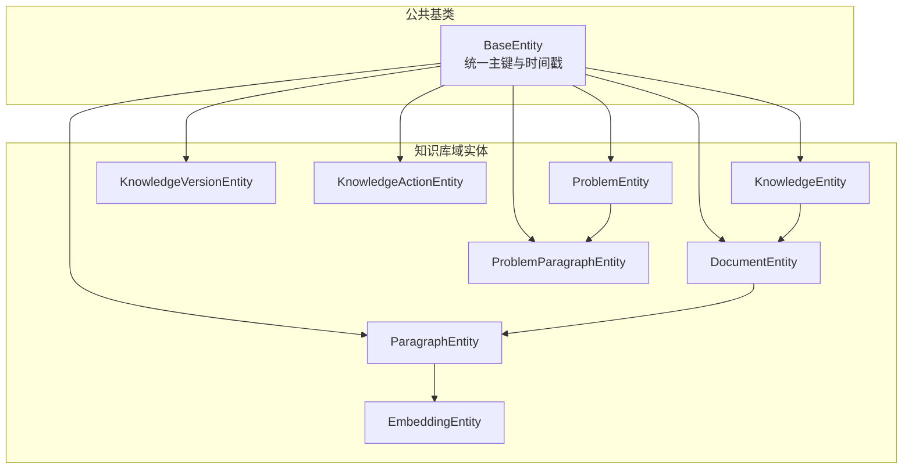
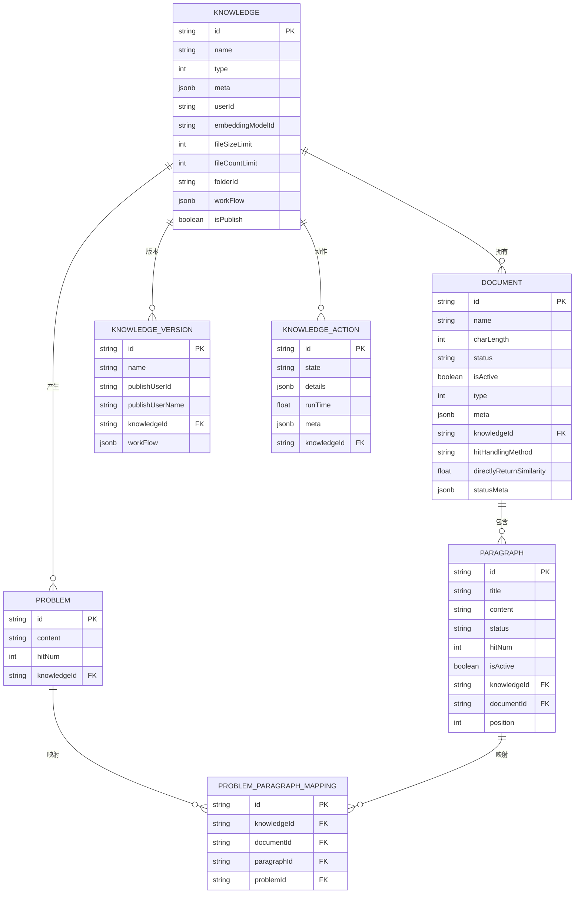
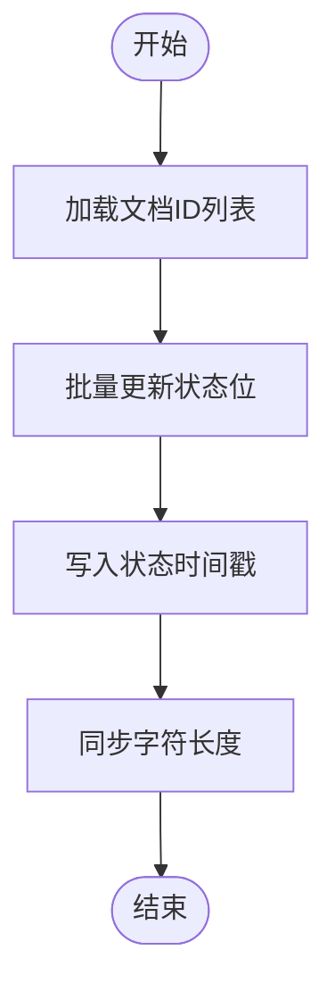
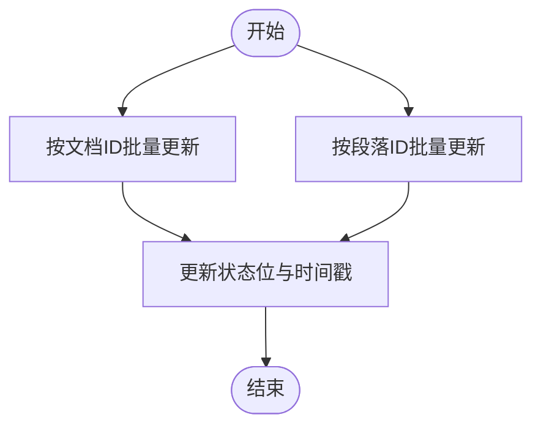
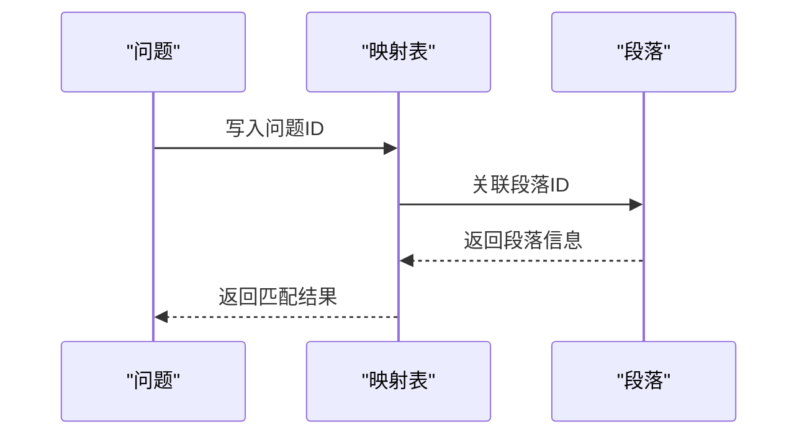
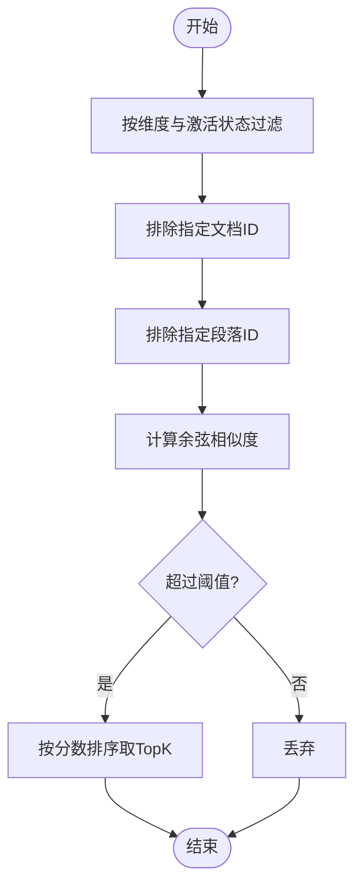
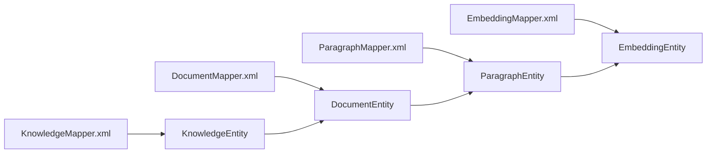

# 知识库实体模型

<cite>
**本文引用的文件**
- [KnowledgeEntity.java](file://maxkb4j-service-api/maxkb4j-knowledge-api/src/main/java/com/maxkb4j/knowledge/entity/KnowledgeEntity.java)
- [DocumentEntity.java](file://maxkb4j-service-api/maxkb4j-knowledge-api/src/main/java/com/maxkb4j/knowledge/entity/DocumentEntity.java)
- [ParagraphEntity.java](file://maxkb4j-service-api/maxkb4j-knowledge-api/src/main/java/com/maxkb4j/knowledge/entity/ParagraphEntity.java)
- [ProblemEntity.java](file://maxkb4j-service-api/maxkb4j-knowledge-api/src/main/java/com/maxkb4j/knowledge/entity/ProblemEntity.java)
- [EmbeddingEntity.java](file://maxkb4j-service-api/maxkb4j-knowledge-api/src/main/java/com/maxkb4j/knowledge/entity/EmbeddingEntity.java)
- [KnowledgeVersionEntity.java](file://maxkb4j-service-api/maxkb4j-knowledge-api/src/main/java/com/maxkb4j/knowledge/entity/KnowledgeVersionEntity.java)
- [KnowledgeActionEntity.java](file://maxkb4j-service-api/maxkb4j-knowledge-api/src/main/java/com/maxkb4j/knowledge/entity/KnowledgeActionEntity.java)
- [ProblemParagraphEntity.java](file://maxkb4j-service-api/maxkb4j-knowledge-api/src/main/java/com/maxkb4j/knowledge/entity/ProblemParagraphEntity.java)
- [BaseEntity.java](file://maxkb4j-common/src/main/java/com/maxkb4j/common/mp/base/BaseEntity.java)
- [KnowledgeMapper.xml](file://maxkb4j-service-api/maxkb4j-knowledge-api/src/main/java/com/maxkb4j/knowledge/mapper/KnowledgeMapper.xml)
- [DocumentMapper.xml](file://maxkb4j-service-api/maxkb4j-knowledge-api/src/main/java/com/maxkb4j/knowledge/mapper/DocumentMapper.xml)
- [ParagraphMapper.xml](file://maxkb4j-service-api/maxkb4j-knowledge-api/src/main/java/com/maxkb4j/knowledge/mapper/ParagraphMapper.xml)
- [EmbeddingMapper.xml](file://maxkb4j-service-api/maxkb4j-knowledge-api/src/main/java/com/maxkb4j/knowledge/mapper/EmbeddingMapper.xml)
- [KnowledgeType.java](file://maxkb4j-service-api/maxkb4j-knowledge-api/src/main/java/com/maxkb4j/knowledge/consts/KnowledgeType.java)
- [SourceType.java](file://maxkb4j-service-api/maxkb4j-knowledge-api/src/main/java/com/maxkb4j/knowledge/consts/SourceType.java)
- [SearchType.java](file://maxkb4j-service-api/maxkb4j-knowledge-api/src/main/java/com/maxkb4j/knowledge/consts/SearchType.java)
</cite>

## 目录
1. [简介](#简介)
2. [项目结构](#项目结构)
3. [核心组件](#核心组件)
4. [架构总览](#架构总览)
5. [详细组件分析](#详细组件分析)
6. [依赖分析](#依赖分析)
7. [性能考量](#性能考量)
8. [故障排查指南](#故障排查指南)
9. [结论](#结论)
10. [附录](#附录)

## 简介
本文件系统化梳理 MaxKB4j 知识库模块的实体模型与数据结构，围绕 KnowledgeEntity（知识库）、DocumentEntity（文档）、ParagraphEntity（段落）、ProblemEntity（问题）、EmbeddingEntity（向量）等核心实体，给出字段定义、数据类型、约束关系与业务含义；并结合映射文件解析数据库层面的查询与更新逻辑，明确主键、外键与索引设计考虑；最后总结生命周期管理、数据验证与业务规则约束，并提供最佳实践与扩展建议。

## 项目结构
知识库实体位于服务 API 模块的知识域内，采用 MyBatis-Plus 注解与 XML 映射文件配合实现持久化；同时通过常量接口定义领域枚举值，统一业务语义。

**图表来源**
- [KnowledgeEntity.java:19-34](file://maxkb4j-service-api/maxkb4j-knowledge-api/src/main/java/com/maxkb4j/knowledge/entity/KnowledgeEntity.java#L19-L34)
- [DocumentEntity.java:23-64](file://maxkb4j-service-api/maxkb4j-knowledge-api/src/main/java/com/maxkb4j/knowledge/entity/DocumentEntity.java#L23-L64)
- [ParagraphEntity.java:15-27](file://maxkb4j-service-api/maxkb4j-knowledge-api/src/main/java/com/maxkb4j/knowledge/entity/ParagraphEntity.java#L15-L27)
- [ProblemEntity.java:17-28](file://maxkb4j-service-api/maxkb4j-knowledge-api/src/main/java/com/maxkb4j/knowledge/entity/ProblemEntity.java#L17-L28)
- [ProblemParagraphEntity.java:15-21](file://maxkb4j-service-api/maxkb4j-knowledge-api/src/main/java/com/maxkb4j/knowledge/entity/ProblemParagraphEntity.java#L15-L21)
- [KnowledgeVersionEntity.java:18-25](file://maxkb4j-service-api/maxkb4j-knowledge-api/src/main/java/com/maxkb4j/knowledge/entity/KnowledgeVersionEntity.java#L18-L25)
- [KnowledgeActionEntity.java:14-22](file://maxkb4j-service-api/maxkb4j-knowledge-api/src/main/java/com/maxkb4j/knowledge/entity/KnowledgeActionEntity.java#L14-L22)
- [EmbeddingEntity.java:29-51](file://maxkb4j-service-api/maxkb4j-knowledge-api/src/main/java/com/maxkb4j/knowledge/entity/EmbeddingEntity.java#L29-L51)
- [BaseEntity.java:13-24](file://maxkb4j-common/src/main/java/com/maxkb4j/common/mp/base/BaseEntity.java#L13-L24)

**章节来源**
- [KnowledgeEntity.java:1-35](file://maxkb4j-service-api/maxkb4j-knowledge-api/src/main/java/com/maxkb4j/knowledge/entity/KnowledgeEntity.java#L1-L35)
- [DocumentEntity.java:1-66](file://maxkb4j-service-api/maxkb4j-knowledge-api/src/main/java/com/maxkb4j/knowledge/entity/DocumentEntity.java#L1-L66)
- [ParagraphEntity.java:1-28](file://maxkb4j-service-api/maxkb4j-knowledge-api/src/main/java/com/maxkb4j/knowledge/entity/ParagraphEntity.java#L1-L28)
- [ProblemEntity.java:1-29](file://maxkb4j-service-api/maxkb4j-knowledge-api/src/main/java/com/maxkb4j/knowledge/entity/ProblemEntity.java#L1-L29)
- [EmbeddingEntity.java:1-52](file://maxkb4j-service-api/maxkb4j-knowledge-api/src/main/java/com/maxkb4j/knowledge/entity/EmbeddingEntity.java#L1-L52)
- [KnowledgeVersionEntity.java:1-26](file://maxkb4j-service-api/maxkb4j-knowledge-api/src/main/java/com/maxkb4j/knowledge/entity/KnowledgeVersionEntity.java#L1-L26)
- [KnowledgeActionEntity.java:1-23](file://maxkb4j-service-api/maxkb4j-knowledge-api/src/main/java/com/maxkb4j/knowledge/entity/KnowledgeActionEntity.java#L1-L23)
- [ProblemParagraphEntity.java:1-22](file://maxkb4j-service-api/maxkb4j-knowledge-api/src/main/java/com/maxkb4j/knowledge/entity/ProblemParagraphEntity.java#L1-L22)
- [BaseEntity.java:1-25](file://maxkb4j-common/src/main/java/com/maxkb4j/common/mp/base/BaseEntity.java#L1-L25)

## 核心组件
本节对各实体进行字段、类型、约束与业务含义的系统性说明，并标注其在映射文件中的使用场景与索引策略。

- 基类 BaseEntity
  - 字段：id（主键，UUID）、createTime（创建时间，自动插入）、updateTime（更新时间，自动插入/更新）
  - 作用：为所有实体提供统一标识与审计字段

- KnowledgeEntity（知识库）
  - 字段与类型：name（字符串）、desc（字符串）、type（整数）、meta（JSONB）、userId（字符串）、embeddingModelId（字符串）、fileSizeLimit（整数）、fileCountLimit（整数）、folderId（字符串）、workFlow（JSONB）、isPublish（布尔）
  - 约束与默认：继承 BaseEntity；type 取值参考 KnowledgeType；workFlow、meta 使用 JSONB 类型处理器
  - 业务含义：描述知识库的基本属性、所属用户、嵌入模型、文件大小/数量限制、目录归属、发布状态与工作流配置

- DocumentEntity（文档）
  - 字段与类型：name（字符串，长度限制）、charLength（整数）、status（字符串）、isActive（布尔）、type（整数）、meta（JSONB）、knowledgeId（外键）、hitHandlingMethod（字符串）、directlyReturnSimilarity（浮点）、statusMeta（JSONB，插入时填充）
  - 约束与默认：构造函数设置默认值；name 截断至 150；status 初始值、isActive 默认启用、meta/statusMeta 初始化为空对象、hitHandlingMethod 默认“optimization”、directlyReturnSimilarity 默认 0.9
  - 业务含义：记录单个文档的元数据、状态、与知识库的关联关系，以及检索命中处理策略与相似度阈值

- ParagraphEntity（段落）
  - 字段与类型：title（字符串）、content（字符串）、status（字符串）、hitNum（整数）、isActive（布尔）、knowledgeId（外键）、documentId（外键）、position（整数）
  - 约束与默认：继承 BaseEntity；未见显式默认值
  - 业务含义：文档内的最小检索单元，记录位置序号、命中次数、状态与激活态

- ProblemEntity（问题）
  - 字段与类型：content（字符串）、hitNum（整数）、knowledgeId（外键）
  - 约束与默认：提供默认工厂方法，初始化 hitNum=0
  - 业务含义：用于检索增强的问题集合，支持按知识库维度统计命中

- ProblemParagraphEntity（问题-段落映射）
  - 字段与类型：knowledgeId、documentId、paragraphId、problemId
  - 约束与默认：继承 BaseEntity
  - 业务含义：多对多映射，建立问题与段落之间的关联，便于问题驱动的检索与回溯

- EmbeddingEntity（向量）
  - 字段与类型：id（主键）、sourceId（源ID）、sourceType（整数）、isActive（布尔）、knowledgeId、documentId、paragraphId、embedding（向量，类型处理器）、content（文本索引字段）、score（匹配度得分）、dimension（向量维度）
  - 约束与默认：id 同时标注 MyBatis 与 MongoDB 注解；embedding 标记为临时字段不落库；content 与 score 为 MongoDB 文本索引与评分字段
  - 业务含义：存储段落级向量表示，支持向量检索与相似度排序

- KnowledgeVersionEntity（知识库版本）
  - 字段与类型：name、publishUserId、publishUserName、knowledgeId、workFlow（JSONB）
  - 约束与默认：继承 BaseEntity；workFlow 使用 JSONB 类型处理器
  - 业务含义：记录知识库工作流的发布版本信息

- KnowledgeActionEntity（知识库动作）
  - 字段与类型：state（状态）、details（JSONB）、runTime（浮点）、meta（JSONB）、knowledgeId
  - 约束与默认：继承 BaseEntity；details、meta 使用 JSONB 类型处理器
  - 业务含义：记录知识库相关动作的状态、耗时与元数据

**章节来源**
- [BaseEntity.java:13-24](file://maxkb4j-common/src/main/java/com/maxkb4j/common/mp/base/BaseEntity.java#L13-L24)
- [KnowledgeEntity.java:19-34](file://maxkb4j-service-api/maxkb4j-knowledge-api/src/main/java/com/maxkb4j/knowledge/entity/KnowledgeEntity.java#L19-L34)
- [DocumentEntity.java:23-64](file://maxkb4j-service-api/maxkb4j-knowledge-api/src/main/java/com/maxkb4j/knowledge/entity/DocumentEntity.java#L23-L64)
- [ParagraphEntity.java:15-27](file://maxkb4j-service-api/maxkb4j-knowledge-api/src/main/java/com/maxkb4j/knowledge/entity/ParagraphEntity.java#L15-L27)
- [ProblemEntity.java:17-28](file://maxkb4j-service-api/maxkb4j-knowledge-api/src/main/java/com/maxkb4j/knowledge/entity/ProblemEntity.java#L17-L28)
- [ProblemParagraphEntity.java:15-21](file://maxkb4j-service-api/maxkb4j-knowledge-api/src/main/java/com/maxkb4j/knowledge/entity/ProblemParagraphEntity.java#L15-L21)
- [EmbeddingEntity.java:29-51](file://maxkb4j-service-api/maxkb4j-knowledge-api/src/main/java/com/maxkb4j/knowledge/entity/EmbeddingEntity.java#L29-L51)
- [KnowledgeVersionEntity.java:18-25](file://maxkb4j-service-api/maxkb4j-knowledge-api/src/main/java/com/maxkb4j/knowledge/entity/KnowledgeVersionEntity.java#L18-L25)
- [KnowledgeActionEntity.java:14-22](file://maxkb4j-service-api/maxkb4j-knowledge-api/src/main/java/com/maxkb4j/knowledge/entity/KnowledgeActionEntity.java#L14-L22)

## 架构总览
下图展示知识库实体之间的关联关系、主键与外键设计，以及检索与索引的关键路径。

**图表来源**
- [KnowledgeEntity.java:19-34](file://maxkb4j-service-api/maxkb4j-knowledge-api/src/main/java/com/maxkb4j/knowledge/entity/KnowledgeEntity.java#L19-L34)
- [DocumentEntity.java:23-64](file://maxkb4j-service-api/maxkb4j-knowledge-api/src/main/java/com/maxkb4j/knowledge/entity/DocumentEntity.java#L23-L64)
- [ParagraphEntity.java:15-27](file://maxkb4j-service-api/maxkb4j-knowledge-api/src/main/java/com/maxkb4j/knowledge/entity/ParagraphEntity.java#L15-L27)
- [ProblemEntity.java:17-28](file://maxkb4j-service-api/maxkb4j-knowledge-api/src/main/java/com/maxkb4j/knowledge/entity/ProblemEntity.java#L17-L28)
- [ProblemParagraphEntity.java:15-21](file://maxkb4j-service-api/maxkb4j-knowledge-api/src/main/java/com/maxkb4j/knowledge/entity/ProblemParagraphEntity.java#L15-L21)
- [KnowledgeVersionEntity.java:18-25](file://maxkb4j-service-api/maxkb4j-knowledge-api/src/main/java/com/maxkb4j/knowledge/entity/KnowledgeVersionEntity.java#L18-L25)
- [KnowledgeActionEntity.java:14-22](file://maxkb4j-service-api/maxkb4j-knowledge-api/src/main/java/com/maxkb4j/knowledge/entity/KnowledgeActionEntity.java#L14-L22)

## 详细组件分析

### 知识库管理（KnowledgeEntity）
- 字段与约束
  - type：参考知识库类型常量，区分通用、Web、工作流三类
  - meta/workFlow：JSONB 存储结构化配置，便于扩展
  - 文件限制：fileSizeLimit、fileCountLimit 控制上传规模
  - 发布状态：isPublish 标识对外可见性
- 生命周期
  - 创建：由用户发起，设置基础属性与默认值
  - 更新：可变更元数据、工作流、发布状态
  - 删除：需清理关联文档与向量
- 数据验证
  - meta/workFlow 使用类型处理器保证序列化一致性
  - type 与 KnowledgeType 对齐
- 最佳实践
  - 将与嵌入模型相关的配置集中于 meta
  - 工作流配置通过 workFlow 维护，避免硬编码

**章节来源**
- [KnowledgeEntity.java:19-34](file://maxkb4j-service-api/maxkb4j-knowledge-api/src/main/java/com/maxkb4j/knowledge/entity/KnowledgeEntity.java#L19-L34)
- [KnowledgeType.java:4-12](file://maxkb4j-service-api/maxkb4j-knowledge-api/src/main/java/com/maxkb4j/knowledge/consts/KnowledgeType.java#L4-L12)

### 文档处理（DocumentEntity）
- 字段与约束
  - name 截断保护，防止超长
  - statusMeta 插入时填充，记录状态时间线
  - hitHandlingMethod 默认“optimization”，直接返回相似度阈值默认 0.9
- 生命周期
  - 创建：初始化状态、计数与元数据
  - 状态流转：通过映射文件提供的 SQL 更新状态与时间戳
  - 计数同步：根据段落数计算 charLength
- 数据验证
  - 元数据与状态元数据使用 JSONB 类型处理器
- 关键流程（状态更新）

**图表来源**
- [DocumentMapper.xml:10-68](file://maxkb4j-service-api/maxkb4j-knowledge-api/src/main/java/com/maxkb4j/knowledge/mapper/DocumentMapper.xml#L10-L68)

**章节来源**
- [DocumentEntity.java:23-64](file://maxkb4j-service-api/maxkb4j-knowledge-api/src/main/java/com/maxkb4j/knowledge/entity/DocumentEntity.java#L23-L64)
- [DocumentMapper.xml:1-92](file://maxkb4j-service-api/maxkb4j-knowledge-api/src/main/java/com/maxkb4j/knowledge/mapper/DocumentMapper.xml#L1-L92)

### 段落分割（ParagraphEntity）
- 字段与约束
  - position 表示段落在文档中的顺序
  - hitNum 与 isActive 支持命中统计与开关控制
- 生命周期
  - 创建：随文档解析生成，初始状态与计数
  - 状态更新：支持按文档或按 ID 批量更新状态位
- 数据验证
  - JSONB 类型处理器用于状态元数据（如存在）
- 关键流程（状态更新）

**图表来源**
- [ParagraphMapper.xml:4-41](file://maxkb4j-service-api/maxkb4j-knowledge-api/src/main/java/com/maxkb4j/knowledge/mapper/ParagraphMapper.xml#L4-L41)

**章节来源**
- [ParagraphEntity.java:15-27](file://maxkb4j-service-api/maxkb4j-knowledge-api/src/main/java/com/maxkb4j/knowledge/entity/ParagraphEntity.java#L15-L27)
- [ParagraphMapper.xml:1-75](file://maxkb4j-service-api/maxkb4j-knowledge-api/src/main/java/com/maxkb4j/knowledge/mapper/ParagraphMapper.xml#L1-L75)

### 问题生成（ProblemEntity 与 ProblemParagraphEntity）
- 字段与约束
  - ProblemEntity 提供默认工厂方法，确保 hitNum 初始化
  - ProblemParagraphEntity 作为多对多映射表，记录问题与段落的关联
- 生命周期
  - 问题创建：可从用户输入或自动生成
  - 关联建立：通过映射表将问题与段落绑定
- 数据验证
  - JSONB 类型处理器用于相关元数据（如存在）
- 关键流程（问题-段落映射）

**图表来源**
- [ProblemEntity.java:17-28](file://maxkb4j-service-api/maxkb4j-knowledge-api/src/main/java/com/maxkb4j/knowledge/entity/ProblemEntity.java#L17-L28)
- [ProblemParagraphEntity.java:15-21](file://maxkb4j-service-api/maxkb4j-knowledge-api/src/main/java/com/maxkb4j/knowledge/entity/ProblemParagraphEntity.java#L15-L21)

**章节来源**
- [ProblemEntity.java:1-29](file://maxkb4j-service-api/maxkb4j-knowledge-api/src/main/java/com/maxkb4j/knowledge/entity/ProblemEntity.java#L1-L29)
- [ProblemParagraphEntity.java:1-22](file://maxkb4j-service-api/maxkb4j-knowledge-api/src/main/java/com/maxkb4j/knowledge/entity/ProblemParagraphEntity.java#L1-L22)

### 向量化存储（EmbeddingEntity）
- 字段与约束
  - embedding 为向量字段，使用类型处理器；content 与 score 为 MongoDB 文本索引与评分
  - isActive 过滤无效向量
  - dimension 限定向量维度，提升检索效率
- 生命周期
  - 创建：段落向量化后写入
  - 查询：支持按知识库、排除文档/段落过滤、最小相似度与结果上限
- 数据验证
  - 向量维度与激活状态参与过滤
- 关键流程（向量检索）

**图表来源**
- [EmbeddingMapper.xml:5-68](file://maxkb4j-service-api/maxkb4j-knowledge-api/src/main/java/com/maxkb4j/knowledge/mapper/EmbeddingMapper.xml#L5-L68)

**章节来源**
- [EmbeddingEntity.java:1-52](file://maxkb4j-service-api/maxkb4j-knowledge-api/src/main/java/com/maxkb4j/knowledge/entity/EmbeddingEntity.java#L1-L52)
- [EmbeddingMapper.xml:1-70](file://maxkb4j-service-api/maxkb4j-knowledge-api/src/main/java/com/maxkb4j/knowledge/mapper/EmbeddingMapper.xml#L1-L70)

### 版本与动作（KnowledgeVersionEntity、KnowledgeActionEntity）
- 字段与约束
  - KnowledgeVersionEntity：记录发布者、版本名称与工作流快照
  - KnowledgeActionEntity：记录动作状态、耗时与元数据
- 生命周期
  - 版本：发布时生成新版本记录
  - 动作：执行知识库相关操作时写入状态与详情
- 数据验证
  - JSONB 类型处理器保证结构化数据一致性

**章节来源**
- [KnowledgeVersionEntity.java:1-26](file://maxkb4j-service-api/maxkb4j-knowledge-api/src/main/java/com/maxkb4j/knowledge/entity/KnowledgeVersionEntity.java#L1-L26)
- [KnowledgeActionEntity.java:1-23](file://maxkb4j-service-api/maxkb4j-knowledge-api/src/main/java/com/maxkb4j/knowledge/entity/KnowledgeActionEntity.java#L1-L23)

## 依赖分析
- 实体间依赖
  - DocumentEntity.knowledgeId → KnowledgeEntity.id
  - ParagraphEntity.documentId → DocumentEntity.id
  - ParagraphEntity.knowledgeId → KnowledgeEntity.id
  - ProblemParagraphEntity.paragraphId → ParagraphEntity.id
  - ProblemParagraphEntity.problemId → ProblemEntity.id
  - ProblemParagraphEntity.documentId → DocumentEntity.id
  - KnowledgeVersionEntity.knowledgeId → KnowledgeEntity.id
  - KnowledgeActionEntity.knowledgeId → KnowledgeEntity.id
- 映射文件依赖
  - KnowledgeMapper.xml：分页查询、统计文档数量与字符长度、应用映射数量
  - DocumentMapper.xml：批量更新状态与时间戳、同步字符长度、分页查询
  - ParagraphMapper.xml：批量更新段落状态、按状态与ID列表查询
  - EmbeddingMapper.xml：向量检索、相似度过滤与排序
- 索引与查询优化
  - EmbeddingMapper.xml 中按 isActive、dimension、知识库ID、排除ID集合进行过滤，建议在对应列建立索引以提升检索性能
  - DocumentMapper.xml 与 ParagraphMapper.xml 的批量更新涉及 JSONB 操作，需关注 PostgreSQL JSONB 索引与更新性能

**图表来源**
- [KnowledgeMapper.xml:1-69](file://maxkb4j-service-api/maxkb4j-knowledge-api/src/main/java/com/maxkb4j/knowledge/mapper/KnowledgeMapper.xml#L1-L69)
- [DocumentMapper.xml:1-92](file://maxkb4j-service-api/maxkb4j-knowledge-api/src/main/java/com/maxkb4j/knowledge/mapper/DocumentMapper.xml#L1-L92)
- [ParagraphMapper.xml:1-75](file://maxkb4j-service-api/maxkb4j-knowledge-api/src/main/java/com/maxkb4j/knowledge/mapper/ParagraphMapper.xml#L1-L75)
- [EmbeddingMapper.xml:1-70](file://maxkb4j-service-api/maxkb4j-knowledge-api/src/main/java/com/maxkb4j/knowledge/mapper/EmbeddingMapper.xml#L1-L70)

**章节来源**
- [KnowledgeMapper.xml:1-69](file://maxkb4j-service-api/maxkb4j-knowledge-api/src/main/java/com/maxkb4j/knowledge/mapper/KnowledgeMapper.xml#L1-L69)
- [DocumentMapper.xml:1-92](file://maxkb4j-service-api/maxkb4j-knowledge-api/src/main/java/com/maxkb4j/knowledge/mapper/DocumentMapper.xml#L1-L92)
- [ParagraphMapper.xml:1-75](file://maxkb4j-service-api/maxkb4j-knowledge-api/src/main/java/com/maxkb4j/knowledge/mapper/ParagraphMapper.xml#L1-L75)
- [EmbeddingMapper.xml:1-70](file://maxkb4j-service-api/maxkb4j-knowledge-api/src/main/java/com/maxkb4j/knowledge/mapper/EmbeddingMapper.xml#L1-L70)

## 性能考量
- 向量检索
  - 使用向量相似度计算与维度过滤，建议在 embedding.dimension、embedding.is_active、embedding.knowledge_id、embedding.document_id、embedding.paragraph_id 上建立合适索引
  - 排序与去重（DISTINCT ON）可能带来额外开销，建议评估是否需要窗口函数替代或物化视图
- JSONB 操作
  - 状态元数据的 JSONB_set/jsonb_agg 操作在大批量更新时可能成为瓶颈，建议拆分热点字段或引入缓存层
- 分页与统计
  - 分页查询中涉及子查询与聚合，建议对 knowledge_id、document_id、paragraph.status 建立复合索引以降低扫描成本

[本节为通用性能建议，无需特定文件来源]

## 故障排查指南
- 文档状态异常
  - 现象：状态位不正确或状态时间戳缺失
  - 排查：检查 DocumentMapper.xml 的批量更新 SQL 是否正确传入参数；确认 JSONB 路径是否存在
- 段落状态不同步
  - 现象：按文档批量更新后，状态未生效
  - 排查：核对 ParagraphMapper.xml 的批量更新逻辑；确认文档ID集合与状态位索引
- 向量检索无结果
  - 现象：相似度低于阈值或无匹配
  - 排查：确认 embedding.dimension 与请求一致；检查 isActive 与排除ID集合；验证向量维度与模型一致
- 元数据序列化错误
  - 现象：JSONB 字段无法解析
  - 排查：确认类型处理器配置与实体字段一致；检查空对象初始化逻辑

**章节来源**
- [DocumentMapper.xml:10-68](file://maxkb4j-service-api/maxkb4j-knowledge-api/src/main/java/com/maxkb4j/knowledge/mapper/DocumentMapper.xml#L10-L68)
- [ParagraphMapper.xml:4-41](file://maxkb4j-service-api/maxkb4j-knowledge-api/src/main/java/com/maxkb4j/knowledge/mapper/ParagraphMapper.xml#L4-L41)
- [EmbeddingMapper.xml:5-68](file://maxkb4j-service-api/maxkb4j-knowledge-api/src/main/java/com/maxkb4j/knowledge/mapper/EmbeddingMapper.xml#L5-L68)

## 结论
本文从实体定义、关系建模、生命周期、数据验证与业务规则出发，系统阐述了知识库核心实体的设计思路与落地实现。通过映射文件解析，明确了状态流转、统计聚合与向量检索的关键路径。建议在生产环境中针对热点字段与 JSONB 操作进行索引优化与性能压测，确保大规模场景下的稳定性与响应速度。

## 附录
- 检索模式常量
  - 支持 embedding、keywords、hybrid 三种检索模式，便于前端与服务端统一约定
- 源类型常量
  - PROBLEM 与 PARAGRAPH 两类源类型，用于区分问题与段落的来源

**章节来源**
- [SearchType.java:4-10](file://maxkb4j-service-api/maxkb4j-knowledge-api/src/main/java/com/maxkb4j/knowledge/consts/SearchType.java#L4-L10)
- [SourceType.java:3-7](file://maxkb4j-service-api/maxkb4j-knowledge-api/src/main/java/com/maxkb4j/knowledge/consts/SourceType.java#L3-L7)