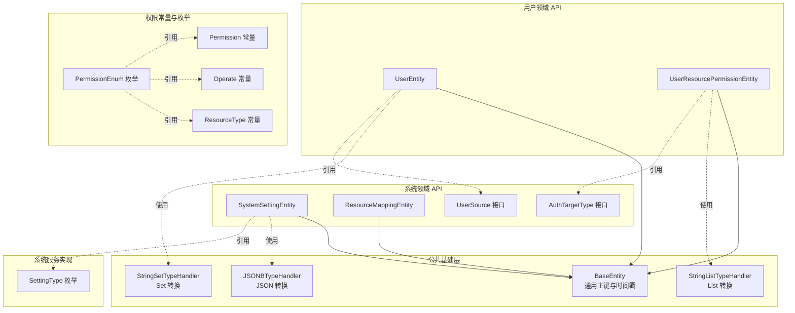
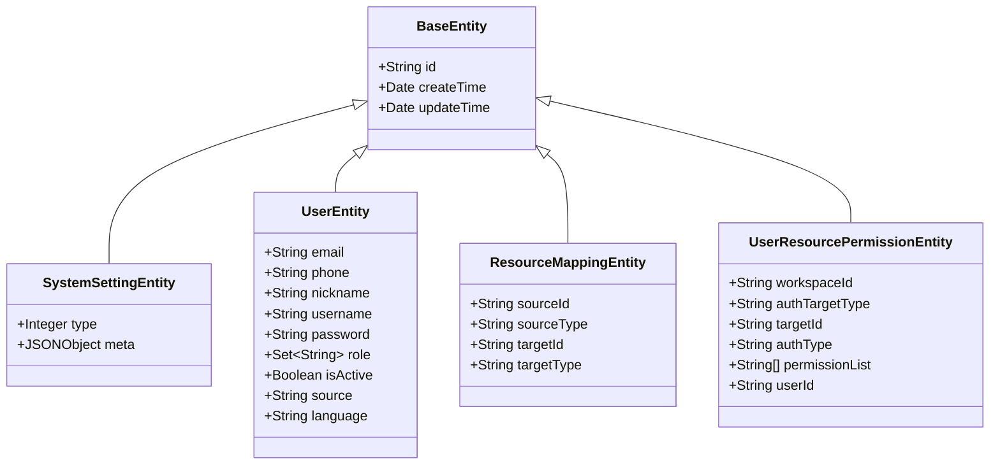
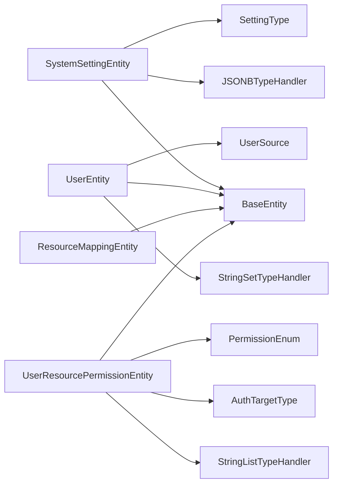

# 系统实体模型

<cite>
**本文引用的文件**
- [SystemSettingEntity.java](file://maxkb4j-service-api/maxkb4j-system-api/src/main/java/com/maxkb4j/system/entity/SystemSettingEntity.java)
- [UserEntity.java](file://maxkb4j-service-api/maxkb4j-user-api/src/main/java/com/maxkb4j/user/entity/UserEntity.java)
- [ResourceMappingEntity.java](file://maxkb4j-service-api/maxkb4j-system-api/src/main/java/com/maxkb4j/system/entity/ResourceMappingEntity.java)
- [UserResourcePermissionEntity.java](file://maxkb4j-service-api/maxkb4j-user-api/src/main/java/com/maxkb4j/user/entity/UserResourcePermissionEntity.java)
- [BaseEntity.java](file://maxkb4j-common/src/main/java/com/maxkb4j/common/mp/base/BaseEntity.java)
- [SettingType.java](file://maxkb4j-service/maxkb4j-system/src/main/java/com/maxkb4j/system/enums/SettingType.java)
- [AuthTargetType.java](file://maxkb4j-service-api/maxkb4j-system-api/src/main/java/com/maxkb4j/system/constant/AuthTargetType.java)
- [UserSource.java](file://maxkb4j-service-api/maxkb4j-system-api/src/main/java/com/maxkb4j/system/constant/UserSource.java)
- [Permission.java](file://maxkb4j-common/src/main/java/com/maxkb4j/common/constant/Permission.java)
- [Operate.java](file://maxkb4j-common/src/main/java/com/maxkb4j/common/constant/Operate.java)
- [PermissionEnum.java](file://maxkb4j-common/src/main/java/com/maxkb4j/common/enums/PermissionEnum.java)
- [ResourceType.java](file://maxkb4j-common/src/main/java/com/maxkb4j/common/constant/ResourceType.java)
- [StringSetTypeHandler.java](file://maxkb4j-common/src/main/java/com/maxkb4j/common/typehandler/StringSetTypeHandler.java)
- [StringListTypeHandler.java](file://maxkb4j-common/src/main/java/com/maxkb4j/common/typehandler/StringListTypeHandler.java)
- [JSONBTypeHandler.java](file://maxkb4j-common/src/main/java/com/maxkb4j/common/typehandler/JSONBTypeHandler.java)
</cite>

## 目录
1. [简介](#简介)
2. [项目结构](#项目结构)
3. [核心组件](#核心组件)
4. [架构总览](#架构总览)
5. [详细组件分析](#详细组件分析)
6. [依赖分析](#依赖分析)
7. [性能考量](#性能考量)
8. [故障排查指南](#故障排查指南)
9. [结论](#结论)
10. [附录](#附录)

## 简介
本文件面向开发者与架构师，系统化梳理 MaxKB4j 中与“系统设置、用户管理、资源映射、权限控制”相关的核心实体模型，包括字段定义、数据类型、约束关系、业务含义、生命周期管理、数据验证与业务规则，并给出实体间关联关系图与最佳实践建议。重点实体包括：SystemSettingEntity（系统设置）、UserEntity（用户）、ResourceMappingEntity（资源映射）、UserResourcePermissionEntity（用户资源权限）。

## 项目结构
围绕系统实体模型的相关文件分布于以下模块：
- 公共基础层（maxkb4j-common）：提供通用基类 BaseEntity 及多种 TypeHandler（JSONB、StringSet、StringList），用于数据库与 Java 类型转换。
- 用户领域 API 层（maxkb4j-user-api）：定义 UserEntity 与 UserResourcePermissionEntity 的实体模型。
- 系统领域 API 层（maxkb4j-system-api）：定义 SystemSettingEntity 与 ResourceMappingEntity 的实体模型，并提供常量接口（如 AuthTargetType、UserSource）。
- 系统服务实现层（maxkb4j-system）：提供 SettingType 枚举，用于系统设置类型的语义化标识。
- 权限常量与枚举（maxkb4j-common）：提供 Permission、Operate、ResourceType、PermissionEnum 等常量与枚举，支撑权限控制的资源类型与操作集合。

图表来源
- [BaseEntity.java:1-25](file://maxkb4j-common/src/main/java/com/maxkb4j/common/mp/base/BaseEntity.java#L1-L25)
- [UserEntity.java:1-41](file://maxkb4j-service-api/maxkb4j-user-api/src/main/java/com/maxkb4j/user/entity/UserEntity.java#L1-L41)
- [UserResourcePermissionEntity.java:1-29](file://maxkb4j-service-api/maxkb4j-user-api/src/main/java/com/maxkb4j/user/entity/UserResourcePermissionEntity.java#L1-L29)
- [SystemSettingEntity.java:1-28](file://maxkb4j-service-api/maxkb4j-system-api/src/main/java/com/maxkb4j/system/entity/SystemSettingEntity.java#L1-L28)
- [ResourceMappingEntity.java:1-21](file://maxkb4j-service-api/maxkb4j-system-api/src/main/java/com/maxkb4j/system/entity/ResourceMappingEntity.java#L1-L21)
- [StringSetTypeHandler.java:1-65](file://maxkb4j-common/src/main/java/com/maxkb4j/common/typehandler/StringSetTypeHandler.java#L1-L65)
- [StringListTypeHandler.java:1-48](file://maxkb4j-common/src/main/java/com/maxkb4j/common/typehandler/StringListTypeHandler.java#L1-L48)
- [JSONBTypeHandler.java:1-60](file://maxkb4j-common/src/main/java/com/maxkb4j/common/typehandler/JSONBTypeHandler.java#L1-L60)
- [AuthTargetType.java:1-10](file://maxkb4j-service-api/maxkb4j-system-api/src/main/java/com/maxkb4j/system/constant/AuthTargetType.java#L1-L10)
- [UserSource.java:1-6](file://maxkb4j-service-api/maxkb4j-system-api/src/main/java/com/maxkb4j/system/constant/UserSource.java#L1-L6)
- [SettingType.java:1-20](file://maxkb4j-service/maxkb4j-system/src/main/java/com/maxkb4j/system/enums/SettingType.java#L1-L20)
- [Permission.java:1-7](file://maxkb4j-common/src/main/java/com/maxkb4j/common/constant/Permission.java#L1-L7)
- [Operate.java:1-28](file://maxkb4j-common/src/main/java/com/maxkb4j/common/constant/Operate.java#L1-L28)
- [ResourceType.java:1-10](file://maxkb4j-common/src/main/java/com/maxkb4j/common/constant/ResourceType.java#L1-L10)
- [PermissionEnum.java:1-119](file://maxkb4j-common/src/main/java/com/maxkb4j/common/enums/PermissionEnum.java#L1-L119)

章节来源
- [BaseEntity.java:1-25](file://maxkb4j-common/src/main/java/com/maxkb4j/common/mp/base/BaseEntity.java#L1-L25)
- [UserEntity.java:1-41](file://maxkb4j-service-api/maxkb4j-user-api/src/main/java/com/maxkb4j/user/entity/UserEntity.java#L1-L41)
- [UserResourcePermissionEntity.java:1-29](file://maxkb4j-service-api/maxkb4j-user-api/src/main/java/com/maxkb4j/user/entity/UserResourcePermissionEntity.java#L1-L29)
- [SystemSettingEntity.java:1-28](file://maxkb4j-service-api/maxkb4j-system-api/src/main/java/com/maxkb4j/system/entity/SystemSettingEntity.java#L1-L28)
- [ResourceMappingEntity.java:1-21](file://maxkb4j-service-api/maxkb4j-system-api/src/main/java/com/maxkb4j/system/entity/ResourceMappingEntity.java#L1-L21)

## 核心组件
本节对四个核心实体进行字段、类型、约束与业务含义的系统性说明，并结合公共基类与类型处理器，解释持久化与序列化细节。

- SystemSettingEntity（系统设置）
  - 字段与类型
    - createTime: Date（继承自 BaseEntity，自动插入）
    - updateTime: Date（继承自 BaseEntity，插入/更新时自动维护）
    - type: Integer（主键，@Id(value = "type", type = IdType.INPUT)，对应 SettingType 枚举值）
    - meta: JSONObject（通过 @TableField(typeHandler = JSONBTypeHandler.class) 映射到数据库 JSONB）
  - 约束与设计要点
    - 主键：type（输入式主键，避免数据库自增，便于以枚举值直接定位配置）
    - JSON 存储：meta 使用 JSONB 类型处理器，支持复杂嵌套配置的灵活存储
    - 生命周期：由 MyBatis-Plus 自动填充插入/更新时间
  - 业务含义
    - 以 type 作为配置类别键，meta 存放该类别的具体配置项（如邮件、密钥、主题显示等）

- UserEntity（用户）
  - 字段与类型
    - 继承 BaseEntity（id、createTime、updateTime）
    - email: String
    - phone: String
    - nickname: String
    - username: String
    - password: String
    - role: Set<String>（通过 StringSetTypeHandler 持久化为 PostgreSQL 数组或 varchar 集合）
    - isActive: Boolean
    - source: String（引用 UserSource 常量，如 LOCAL）
    - language: String
  - 约束与设计要点
    - 角色集合：role 使用 StringSetTypeHandler，底层可映射为 PostgreSQL 的数组类型，便于查询与去重
    - 继承 BaseEntity：统一主键与时间戳策略
  - 业务含义
    - 描述系统中的用户身份、认证凭据、角色集合与来源属性

- ResourceMappingEntity（资源映射）
  - 字段与类型
    - 继承 BaseEntity（id、createTime、updateTime）
    - sourceId: String
    - sourceType: String
    - targetId: String
    - targetType: String
  - 约束与设计要点
    - 通用映射：sourceId/sourceType 与 targetId/targetType 形成多对多或一对多的资源映射关系
    - 无显式主键：依赖 BaseEntity 的 UUID 主键
  - 业务含义
    - 将不同资源类型（应用、知识库、工具、模型等）进行解耦的映射管理

- UserResourcePermissionEntity（用户资源权限）
  - 字段与类型
    - 继承 BaseEntity（id、createTime、updateTime）
    - workspaceId: String（工作空间标识）
    - authTargetType: String（授权目标类型，引用 AuthTargetType 常量）
    - targetId: String（目标资源标识）
    - authType: String（授权类型，如白名单/黑名单等）
    - permissionList: List<String>（通过 StringListTypeHandler 持久化为 PostgreSQL 数组）
    - userId: String（归属用户）
  - 约束与设计要点
    - 权限集合：permissionList 使用 StringListTypeHandler，底层持久化为 PostgreSQL 数组
    - 关联维度：以 workspaceId + authTargetType + targetId 组合限定权限作用域
  - 业务含义
    - 定义用户在特定工作空间下对某类资源（应用、知识库、工具、模型）的细粒度权限集合

章节来源
- [SystemSettingEntity.java:10-27](file://maxkb4j-service-api/maxkb4j-system-api/src/main/java/com/maxkb4j/system/entity/SystemSettingEntity.java#L10-L27)
- [UserEntity.java:16-40](file://maxkb4j-service-api/maxkb4j-user-api/src/main/java/com/maxkb4j/user/entity/UserEntity.java#L16-L40)
- [ResourceMappingEntity.java:12-20](file://maxkb4j-service-api/maxkb4j-system-api/src/main/java/com/maxkb4j/system/entity/ResourceMappingEntity.java#L12-L20)
- [UserResourcePermissionEntity.java:16-28](file://maxkb4j-service-api/maxkb4j-user-api/src/main/java/com/maxkb4j/user/entity/UserResourcePermissionEntity.java#L16-L28)
- [BaseEntity.java:13-24](file://maxkb4j-common/src/main/java/com/maxkb4j/common/mp/base/BaseEntity.java#L13-L24)
- [StringSetTypeHandler.java:17-64](file://maxkb4j-common/src/main/java/com/maxkb4j/common/typehandler/StringSetTypeHandler.java#L17-L64)
- [StringListTypeHandler.java:11-47](file://maxkb4j-common/src/main/java/com/maxkb4j/common/typehandler/StringListTypeHandler.java#L11-L47)
- [JSONBTypeHandler.java:15-59](file://maxkb4j-common/src/main/java/com/maxkb4j/common/typehandler/JSONBTypeHandler.java#L15-L59)

## 架构总览
系统实体模型围绕“配置—用户—映射—权限”四条主线展开，配合公共基类与类型处理器，形成统一的数据持久化与序列化规范。权限控制通过 PermissionEnum 提供资源类型、操作与权限等级的枚举化表达，支撑细粒度授权。

图表来源
- [BaseEntity.java:1-25](file://maxkb4j-common/src/main/java/com/maxkb4j/common/mp/base/BaseEntity.java#L1-L25)
- [SystemSettingEntity.java:1-28](file://maxkb4j-service-api/maxkb4j-system-api/src/main/java/com/maxkb4j/system/entity/SystemSettingEntity.java#L1-L28)
- [UserEntity.java:1-41](file://maxkb4j-service-api/maxkb4j-user-api/src/main/java/com/maxkb4j/user/entity/UserEntity.java#L1-L41)
- [ResourceMappingEntity.java:1-21](file://maxkb4j-service-api/maxkb4j-system-api/src/main/java/com/maxkb4j/system/entity/ResourceMappingEntity.java#L1-L21)
- [UserResourcePermissionEntity.java:1-29](file://maxkb4j-service-api/maxkb4j-user-api/src/main/java/com/maxkb4j/user/entity/UserResourcePermissionEntity.java#L1-L29)

## 详细组件分析

### SystemSettingEntity（系统设置）
- 字段与类型
  - type: Integer（主键，输入式）
  - meta: JSONObject（JSONB 类型处理器）
  - 继承 BaseEntity（id、createTime、updateTime）
- 设计与约束
  - 主键策略：type 作为业务主键，避免数据库自增带来的配置键值不直观
  - JSON 存储：meta 支持任意结构的配置对象，便于扩展
  - 生命周期：MyBatis-Plus 自动填充插入/更新时间
- 业务含义
  - 以枚举型 type 区分配置类别（如邮件、密钥、主题显示），meta 承载具体配置项
- 最佳实践
  - 在服务层对 meta 进行校验与默认值填充，确保配置健壮性
  - 为不同 type 建立独立的配置读取与缓存策略

章节来源
- [SystemSettingEntity.java:10-27](file://maxkb4j-service-api/maxkb4j-system-api/src/main/java/com/maxkb4j/system/entity/SystemSettingEntity.java#L10-L27)
- [SettingType.java:6-19](file://maxkb4j-service/maxkb4j-system/src/main/java/com/maxkb4j/system/enums/SettingType.java#L6-L19)
- [JSONBTypeHandler.java:15-59](file://maxkb4j-common/src/main/java/com/maxkb4j/common/typehandler/JSONBTypeHandler.java#L15-L59)

### UserEntity（用户）
- 字段与类型
  - 继承 BaseEntity（id、createTime、updateTime）
  - 角色集合 role: Set<String>（StringSetTypeHandler）
  - 其他字段：email、phone、nickname、username、password、isActive、source、language
- 设计与约束
  - 角色集合使用 PostgreSQL 数组或 varchar 集合存储，便于去重与集合运算
  - source 引用 UserSource 常量，统一用户来源标识
- 业务含义
  - 描述用户身份、认证凭据与角色集合，支撑权限判定与资源访问控制
- 最佳实践
  - 对密码进行安全处理（加密存储），避免明文保存
  - 角色集合应与权限模型解耦，仅用于快速判定

章节来源
- [UserEntity.java:16-40](file://maxkb4j-service-api/maxkb4j-user-api/src/main/java/com/maxkb4j/user/entity/UserEntity.java#L16-L40)
- [UserSource.java:3-5](file://maxkb4j-service-api/maxkb4j-system-api/src/main/java/com/maxkb4j/system/constant/UserSource.java#L3-L5)
- [StringSetTypeHandler.java:17-64](file://maxkb4j-common/src/main/java/com/maxkb4j/common/typehandler/StringSetTypeHandler.java#L17-L64)

### ResourceMappingEntity（资源映射）
- 字段与类型
  - 继承 BaseEntity（id、createTime、updateTime）
  - sourceId、sourceType、targetId、targetType
- 设计与约束
  - 通用映射模型，支持多对多或一对多资源关系
  - 无业务主键，依赖 UUID 主键保证唯一性
- 业务含义
  - 将不同资源类型（应用、知识库、工具、模型）进行逻辑映射，降低耦合
- 最佳实践
  - 为 sourceType/targetType 建立索引，提升查询效率
  - 对映射关系进行一致性校验，防止悬挂映射

章节来源
- [ResourceMappingEntity.java:12-20](file://maxkb4j-service-api/maxkb4j-system-api/src/main/java/com/maxkb4j/system/entity/ResourceMappingEntity.java#L12-L20)

### UserResourcePermissionEntity（用户资源权限）
- 字段与类型
  - 继承 BaseEntity（id、createTime、updateTime）
  - workspaceId、authTargetType、targetId、authType、permissionList（List<String>）、userId
- 设计与约束
  - 权限集合使用 PostgreSQL 数组存储，便于批量匹配与过滤
  - 通过 workspaceId + authTargetType + targetId 组合限定权限边界
- 业务含义
  - 定义用户在特定工作空间下对某类资源的细粒度权限集合
- 最佳实践
  - 权限列表与 PermissionEnum 对齐，确保权限语义一致
  - 对 permissionList 进行去重与排序，便于比较与展示

章节来源
- [UserResourcePermissionEntity.java:16-28](file://maxkb4j-service-api/maxkb4j-user-api/src/main/java/com/maxkb4j/user/entity/UserResourcePermissionEntity.java#L16-L28)
- [AuthTargetType.java:3-9](file://maxkb4j-service-api/maxkb4j-system-api/src/main/java/com/maxkb4j/system/constant/AuthTargetType.java#L3-L9)
- [StringListTypeHandler.java:11-47](file://maxkb4j-common/src/main/java/com/maxkb4j/common/typehandler/StringListTypeHandler.java#L11-L47)

### 权限控制与枚举体系
- 常量与枚举
  - Permission：权限等级（如 MANAGE、VIEW、NOT_AUTH）
  - Operate：操作类型（如 READ、CREATE、EDIT、DELETE 等）
  - ResourceType：资源类型（APPLICATION、KNOWLEDGE、TOOL、MODEL）
  - PermissionEnum：资源类型、资源标识、操作与权限等级的枚举化表达
- 设计与约束
  - PermissionEnum 提供统一的资源权限语义，支持根据资源类型筛选与匹配
  - 支持生成标准权限字符串，便于鉴权与日志记录
- 业务含义
  - 将权限抽象为“资源类型 + 资源 + 操作 + 权限等级”的组合，支撑细粒度授权

章节来源
- [Permission.java:3-7](file://maxkb4j-common/src/main/java/com/maxkb4j/common/constant/Permission.java#L3-L7)
- [Operate.java:3-28](file://maxkb4j-common/src/main/java/com/maxkb4j/common/constant/Operate.java#L3-L28)
- [ResourceType.java:3-9](file://maxkb4j-common/src/main/java/com/maxkb4j/common/constant/ResourceType.java#L3-L9)
- [PermissionEnum.java:13-119](file://maxkb4j-common/src/main/java/com/maxkb4j/common/enums/PermissionEnum.java#L13-L119)

## 依赖分析
系统实体模型的依赖关系如下：

图表来源
- [SystemSettingEntity.java:1-28](file://maxkb4j-service-api/maxkb4j-system-api/src/main/java/com/maxkb4j/system/entity/SystemSettingEntity.java#L1-L28)
- [UserEntity.java:1-41](file://maxkb4j-service-api/maxkb4j-user-api/src/main/java/com/maxkb4j/user/entity/UserEntity.java#L1-L41)
- [ResourceMappingEntity.java:1-21](file://maxkb4j-service-api/maxkb4j-system-api/src/main/java/com/maxkb4j/system/entity/ResourceMappingEntity.java#L1-L21)
- [UserResourcePermissionEntity.java:1-29](file://maxkb4j-service-api/maxkb4j-user-api/src/main/java/com/maxkb4j/user/entity/UserResourcePermissionEntity.java#L1-L29)
- [BaseEntity.java:1-25](file://maxkb4j-common/src/main/java/com/maxkb4j/common/mp/base/BaseEntity.java#L1-L25)
- [StringSetTypeHandler.java:1-65](file://maxkb4j-common/src/main/java/com/maxkb4j/common/typehandler/StringSetTypeHandler.java#L1-L65)
- [StringListTypeHandler.java:1-48](file://maxkb4j-common/src/main/java/com/maxkb4j/common/typehandler/StringListTypeHandler.java#L1-L48)
- [JSONBTypeHandler.java:1-60](file://maxkb4j-common/src/main/java/com/maxkb4j/common/typehandler/JSONBTypeHandler.java#L1-L60)
- [AuthTargetType.java:1-10](file://maxkb4j-service-api/maxkb4j-system-api/src/main/java/com/maxkb4j/system/constant/AuthTargetType.java#L1-L10)
- [UserSource.java:1-6](file://maxkb4j-service-api/maxkb4j-system-api/src/main/java/com/maxkb4j/system/constant/UserSource.java#L1-L6)
- [SettingType.java:1-20](file://maxkb4j-service/maxkb4j-system/src/main/java/com/maxkb4j/system/enums/SettingType.java#L1-L20)
- [PermissionEnum.java:1-119](file://maxkb4j-common/src/main/java/com/maxkb4j/common/enums/PermissionEnum.java#L1-L119)

## 性能考量
- 数据类型与索引
  - JSONB（SystemSettingEntity.meta）：适合复杂配置的灵活存储，但需注意大对象的序列化/反序列化开销；对高频查询字段建立 GIN 索引可提升检索性能
  - 数组类型（UserEntity.role、UserResourcePermissionEntity.permissionList）：利用 PostgreSQL 数组特性可加速集合运算；为常用查询列（如 userId、targetId、workspaceId）建立索引
- 序列化与反序列化
  - JSONBTypeHandler、StringSetTypeHandler、StringListTypeHandler 会带来序列化成本；建议在写入前进行最小化与必要字段的校验，减少冗余数据
- 生命周期与填充
  - BaseEntity 的自动填充（INSERT/INSERT_UPDATE）减少手动赋值错误，但需确保数据库时区与应用时区一致，避免时间戳偏差

## 故障排查指南
- JSONB 字段为空或解析失败
  - 现象：meta 读取为 null 或异常
  - 排查：确认 JSONBTypeHandler 是否正确注册；检查数据库中 JSONB 字段是否为有效 JSON
- 数组字段读取异常
  - 现象：role 或 permissionList 读取为 null 或格式异常
  - 排查：确认 StringSetTypeHandler/StringListTypeHandler 是否生效；检查数据库数组字段类型与驱动版本兼容性
- 主键冲突或重复
  - 现象：SystemSettingEntity type 冲突或 UserResourcePermissionEntity 唯一性问题
  - 排查：确认 type 的业务唯一性；核对组合键（workspaceId + authTargetType + targetId + userId）是否唯一
- 权限不生效
  - 现象：用户无法访问预期资源
  - 排查：核对 PermissionEnum 与 permissionList 的一致性；确认 authTargetType 与 targetId 的映射是否正确

章节来源
- [JSONBTypeHandler.java:15-59](file://maxkb4j-common/src/main/java/com/maxkb4j/common/typehandler/JSONBTypeHandler.java#L15-L59)
- [StringSetTypeHandler.java:17-64](file://maxkb4j-common/src/main/java/com/maxkb4j/common/typehandler/StringSetTypeHandler.java#L17-L64)
- [StringListTypeHandler.java:11-47](file://maxkb4j-common/src/main/java/com/maxkb4j/common/typehandler/StringListTypeHandler.java#L11-L47)

## 结论
本文件从实体字段、类型、约束、生命周期、权限体系与最佳实践六个维度，系统化梳理了 SystemSettingEntity、UserEntity、ResourceMappingEntity、UserResourcePermissionEntity 的设计与实现要点。通过公共基类与类型处理器，实现了统一的持久化与序列化规范；通过 PermissionEnum 与常量体系，提供了清晰的权限抽象。建议在生产环境中进一步完善索引策略、序列化性能优化与权限一致性校验，以保障系统的稳定性与可维护性。

## 附录
- 实体关系与索引设计建议
  - SystemSettingEntity：type 建议唯一索引；meta 建议按查询热点字段建立 GIN 索引
  - UserEntity：username/email 建议唯一索引；role 建议 GIN 索引以支持集合查询
  - ResourceMappingEntity：sourceType + sourceId、targetType + targetId 建议复合索引
  - UserResourcePermissionEntity：workspaceId + authTargetType + targetId 建议复合索引；userId 建议单独索引
- 扩展指导
  - 新增系统配置类型：在 SettingType 中新增枚举值，并在服务层补充默认值与校验逻辑
  - 新增资源类型：在 AuthTargetType 与 PermissionEnum 中同步扩展，确保权限语义一致
  - 新增用户来源：在 UserSource 中扩展常量，并在用户导入/注册流程中统一处理