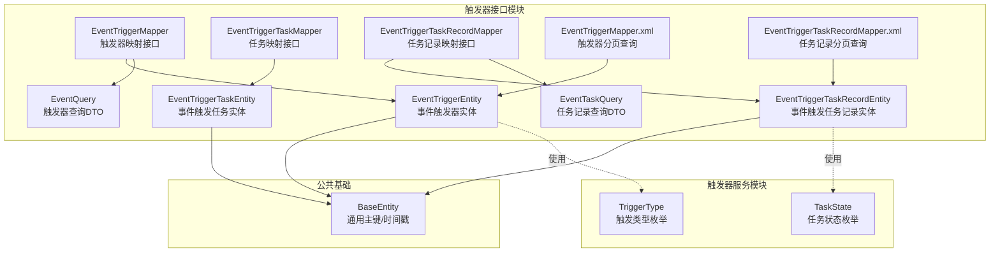
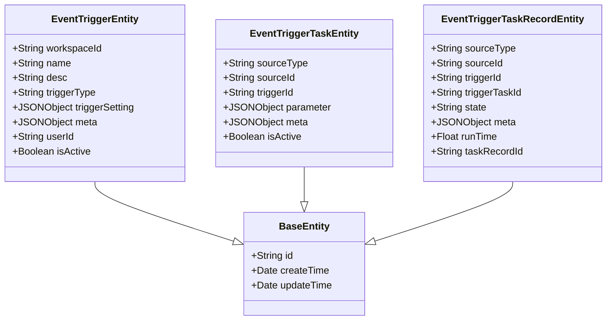
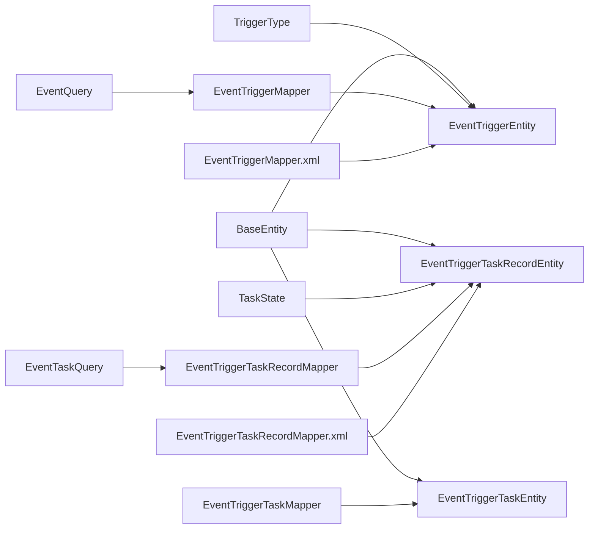

# 触发器实体模型

<cite>
**本文引用的文件**
- [EventTriggerEntity.java](file://maxkb4j-service-api/maxkb4j-trigger-api/src/main/java/com/maxkb4j/trigger/entity/EventTriggerEntity.java)
- [EventTriggerTaskEntity.java](file://maxkb4j-service-api/maxkb4j-trigger-api/src/main/java/com/maxkb4j/trigger/entity/EventTriggerTaskEntity.java)
- [EventTriggerTaskRecordEntity.java](file://maxkb4j-service-api/maxkb4j-trigger-api/src/main/java/com/maxkb4j/trigger/entity/EventTriggerTaskRecordEntity.java)
- [BaseEntity.java](file://maxkb4j-common/src/main/java/com/maxkb4j/common/mp/base/BaseEntity.java)
- [EventTriggerMapper.java](file://maxkb4j-service-api/maxkb4j-trigger-api/src/main/java/com/maxkb4j/trigger/mapper/EventTriggerMapper.java)
- [EventTriggerTaskMapper.java](file://maxkb4j-service-api/maxkb4j-trigger-api/src/main/java/com/maxkb4j/trigger/mapper/EventTriggerTaskMapper.java)
- [EventTriggerTaskRecordMapper.java](file://maxkb4j-service-api/maxkb4j-trigger-api/src/main/java/com/maxkb4j/trigger/mapper/EventTriggerTaskRecordMapper.java)
- [EventTriggerMapper.xml](file://maxkb4j-service-api/maxkb4j-trigger-api/src/main/java/com/maxkb4j/trigger/mapper/EventTriggerMapper.xml)
- [EventTriggerTaskRecordMapper.xml](file://maxkb4j-service-api/maxkb4j-trigger-api/src/main/java/com/maxkb4j/trigger/mapper/EventTriggerTaskRecordMapper.xml)
- [TriggerType.java](file://maxkb4j-service/maxkb4j-trigger/src/main/java/com/maxkb4j/trigger/enums/TriggerType.java)
- [TaskState.java](file://maxkb4j-service/maxkb4j-trigger/src/main/java/com/maxkb4j/trigger/enums/TaskState.java)
- [EventQuery.java](file://maxkb4j-service-api/maxkb4j-trigger-api/src/main/java/com/maxkb4j/trigger/dto/EventQuery.java)
- [EventTaskQuery.java](file://maxkb4j-service-api/maxkb4j-trigger-api/src/main/java/com/maxkb4j/trigger/dto/EventTaskQuery.java)
</cite>

## 目录
1. [简介](#简介)
2. [项目结构](#项目结构)
3. [核心组件](#核心组件)
4. [架构总览](#架构总览)
5. [详细组件分析](#详细组件分析)
6. [依赖分析](#依赖分析)
7. [性能考量](#性能考量)
8. [故障排查指南](#故障排查指南)
9. [结论](#结论)
10. [附录](#附录)

## 简介
本文件系统性梳理触发器实体模型，围绕事件触发器（EventTriggerEntity）、事件触发任务（EventTriggerTaskEntity）、事件触发任务记录（EventTriggerTaskRecordEntity）三大核心实体，详细说明字段定义、数据类型、约束关系与业务含义；解释事件触发、任务调度、任务记录等关键功能的实体设计；给出实体间关联关系图、主键/外键/索引设计考虑；并提供生命周期管理、数据验证与业务规则约束建议，以及最佳实践与扩展指导。

## 项目结构
触发器实体位于服务接口模块中，采用 MyBatis-Plus 的实体映射方式，并通过 XML 映射文件实现分页查询与关联字段拼装。枚举类型位于触发器服务模块中，用于统一状态与类型定义。

图表来源
- [EventTriggerEntity.java:1-28](file://maxkb4j-service-api/maxkb4j-trigger-api/src/main/java/com/maxkb4j/trigger/entity/EventTriggerEntity.java#L1-L28)
- [EventTriggerTaskEntity.java:1-25](file://maxkb4j-service-api/maxkb4j-trigger-api/src/main/java/com/maxkb4j/trigger/entity/EventTriggerTaskEntity.java#L1-L25)
- [EventTriggerTaskRecordEntity.java:1-25](file://maxkb4j-service-api/maxkb4j-trigger-api/src/main/java/com/maxkb4j/trigger/entity/EventTriggerTaskRecordEntity.java#L1-L25)
- [BaseEntity.java:1-25](file://maxkb4j-common/src/main/java/com/maxkb4j/common/mp/base/BaseEntity.java#L1-L25)
- [EventTriggerMapper.java:1-15](file://maxkb4j-service-api/maxkb4j-trigger-api/src/main/java/com/maxkb4j/trigger/mapper/EventTriggerMapper.java#L1-L15)
- [EventTriggerTaskMapper.java:1-8](file://maxkb4j-service-api/maxkb4j-trigger-api/src/main/java/com/maxkb4j/trigger/mapper/EventTriggerTaskMapper.java#L1-L8)
- [EventTriggerTaskRecordMapper.java:1-17](file://maxkb4j-service-api/maxkb4j-trigger-api/src/main/java/com/maxkb4j/trigger/mapper/EventTriggerTaskRecordMapper.java#L1-L17)
- [EventTriggerMapper.xml:1-43](file://maxkb4j-service-api/maxkb4j-trigger-api/src/main/java/com/maxkb4j/trigger/mapper/EventTriggerMapper.xml#L1-L43)
- [EventTriggerTaskRecordMapper.xml:1-41](file://maxkb4j-service-api/maxkb4j-trigger-api/src/main/java/com/maxkb4j/trigger/mapper/EventTriggerTaskRecordMapper.xml#L1-L41)
- [TriggerType.java:1-7](file://maxkb4j-service/maxkb4j-trigger/src/main/java/com/maxkb4j/trigger/enums/TriggerType.java#L1-L7)
- [TaskState.java:1-9](file://maxkb4j-service/maxkb4j-trigger/src/main/java/com/maxkb4j/trigger/enums/TaskState.java#L1-L9)
- [EventQuery.java:1-13](file://maxkb4j-service-api/maxkb4j-trigger-api/src/main/java/com/maxkb4j/trigger/dto/EventQuery.java#L1-L13)
- [EventTaskQuery.java:1-12](file://maxkb4j-service-api/maxkb4j-trigger-api/src/main/java/com/maxkb4j/trigger/dto/EventTaskQuery.java#L1-L12)

章节来源
- [EventTriggerEntity.java:1-28](file://maxkb4j-service-api/maxkb4j-trigger-api/src/main/java/com/maxkb4j/trigger/entity/EventTriggerEntity.java#L1-L28)
- [EventTriggerTaskEntity.java:1-25](file://maxkb4j-service-api/maxkb4j-trigger-api/src/main/java/com/maxkb4j/trigger/entity/EventTriggerTaskEntity.java#L1-L25)
- [EventTriggerTaskRecordEntity.java:1-25](file://maxkb4j-service-api/maxkb4j-trigger-api/src/main/java/com/maxkb4j/trigger/entity/EventTriggerTaskRecordEntity.java#L1-L25)
- [BaseEntity.java:1-25](file://maxkb4j-common/src/main/java/com/maxkb4j/common/mp/base/BaseEntity.java#L1-L25)
- [EventTriggerMapper.java:1-15](file://maxkb4j-service-api/maxkb4j-trigger-api/src/main/java/com/maxkb4j/trigger/mapper/EventTriggerMapper.java#L1-L15)
- [EventTriggerTaskMapper.java:1-8](file://maxkb4j-service-api/maxkb4j-trigger-api/src/main/java/com/maxkb4j/trigger/mapper/EventTriggerTaskMapper.java#L1-L8)
- [EventTriggerTaskRecordMapper.java:1-17](file://maxkb4j-service-api/maxkb4j-trigger-api/src/main/java/com/maxkb4j/trigger/mapper/EventTriggerTaskRecordMapper.java#L1-L17)
- [EventTriggerMapper.xml:1-43](file://maxkb4j-service-api/maxkb4j-trigger-api/src/main/java/com/maxkb4j/trigger/mapper/EventTriggerMapper.xml#L1-L43)
- [EventTriggerTaskRecordMapper.xml:1-41](file://maxkb4j-service-api/maxkb4j-trigger-api/src/main/java/com/maxkb4j/trigger/mapper/EventTriggerTaskRecordMapper.xml#L1-L41)
- [TriggerType.java:1-7](file://maxkb4j-service/maxkb4j-trigger/src/main/java/com/maxkb4j/trigger/enums/TriggerType.java#L1-L7)
- [TaskState.java:1-9](file://maxkb4j-service/maxkb4j-trigger/src/main/java/com/maxkb4j/trigger/enums/TaskState.java#L1-L9)
- [EventQuery.java:1-13](file://maxkb4j-service-api/maxkb4j-trigger-api/src/main/java/com/maxkb4j/trigger/dto/EventQuery.java#L1-L13)
- [EventTaskQuery.java:1-12](file://maxkb4j-service-api/maxkb4j-trigger-api/src/main/java/com/maxkb4j/trigger/dto/EventTaskQuery.java#L1-L12)

## 核心组件
- 事件触发器实体（EventTriggerEntity）
  - 作用：描述一次触发器配置，包括工作空间、名称、描述、触发类型、触发设置、元信息、创建人、启用状态等。
  - 关键字段：workspaceId、name、desc、triggerType（枚举）、triggerSetting（JSONB）、meta（JSONB）、userId、isActive。
  - 继承自 BaseEntity，具备 id、createTime、updateTime。
- 事件触发任务实体（EventTriggerTaskEntity）
  - 作用：描述某个触发器下绑定的具体任务，包括来源类型/来源ID、所属触发器、任务参数、元信息、启用状态。
  - 关键字段：sourceType、sourceId、triggerId、parameter（JSONB）、meta（JSONB）、isActive。
  - 继承自 BaseEntity。
- 事件触发任务记录实体（EventTriggerTaskRecordEntity）
  - 作用：记录某次任务执行的结果与运行时信息，包括来源类型/来源ID、所属触发器/任务、执行状态、元信息、运行耗时、任务记录ID。
  - 关键字段：sourceType、sourceId、triggerId、triggerTaskId、state（枚举）、meta（JSONB）、runTime、taskRecordId。
  - 继承自 BaseEntity。

章节来源
- [EventTriggerEntity.java:14-26](file://maxkb4j-service-api/maxkb4j-trigger-api/src/main/java/com/maxkb4j/trigger/entity/EventTriggerEntity.java#L14-L26)
- [EventTriggerTaskEntity.java:14-23](file://maxkb4j-service-api/maxkb4j-trigger-api/src/main/java/com/maxkb4j/trigger/entity/EventTriggerTaskEntity.java#L14-L23)
- [EventTriggerTaskRecordEntity.java:14-24](file://maxkb4j-service-api/maxkb4j-trigger-api/src/main/java/com/maxkb4j/trigger/entity/EventTriggerTaskRecordEntity.java#L14-L24)
- [BaseEntity.java:15-22](file://maxkb4j-common/src/main/java/com/maxkb4j/common/mp/base/BaseEntity.java#L15-L22)
- [TriggerType.java:3-6](file://maxkb4j-service/maxkb4j-trigger/src/main/java/com/maxkb4j/trigger/enums/TriggerType.java#L3-L6)
- [TaskState.java:3-8](file://maxkb4j-service/maxkb4j-trigger/src/main/java/com/maxkb4j/trigger/enums/TaskState.java#L3-L8)

## 架构总览
触发器实体通过 MyBatis-Plus 映射到数据库表，配合 XML 映射文件实现复杂查询与关联字段拼装。查询 DTO 提供分页查询条件，枚举统一状态与类型。

图表来源
- [BaseEntity.java:13-24](file://maxkb4j-common/src/main/java/com/maxkb4j/common/mp/base/BaseEntity.java#L13-L24)
- [EventTriggerEntity.java:14-26](file://maxkb4j-service-api/maxkb4j-trigger-api/src/main/java/com/maxkb4j/trigger/entity/EventTriggerEntity.java#L14-L26)
- [EventTriggerTaskEntity.java:14-23](file://maxkb4j-service-api/maxkb4j-trigger-api/src/main/java/com/maxkb4j/trigger/entity/EventTriggerTaskEntity.java#L14-L23)
- [EventTriggerTaskRecordEntity.java:14-24](file://maxkb4j-service-api/maxkb4j-trigger-api/src/main/java/com/maxkb4j/trigger/entity/EventTriggerTaskRecordEntity.java#L14-L24)

## 详细组件分析

### 事件触发器实体（EventTriggerEntity）
- 字段与类型
  - workspaceId：字符串，标识工作空间。
  - name：字符串，触发器名称。
  - desc：字符串，描述信息。
  - triggerType：字符串，触发类型（枚举：SCHEDULED、EVENT）。
  - triggerSetting：JSONB，触发器配置参数。
  - meta：JSONB，元信息。
  - userId：字符串，创建人。
  - isActive：布尔值，是否启用。
- 约束与设计
  - 继承 BaseEntity，自动获得主键 id 与时间戳字段。
  - JSONB 类型字段通过类型处理器持久化，便于灵活配置。
  - 触发类型由 TriggerType 枚举约束。
- 业务含义
  - 描述一次可被调度或事件驱动的触发器实例，支持按工作空间隔离与按用户管理。

章节来源
- [EventTriggerEntity.java:16-25](file://maxkb4j-service-api/maxkb4j-trigger-api/src/main/java/com/maxkb4j/trigger/entity/EventTriggerEntity.java#L16-L25)
- [BaseEntity.java:15-22](file://maxkb4j-common/src/main/java/com/maxkb4j/common/mp/base/BaseEntity.java#L15-L22)
- [TriggerType.java:3-6](file://maxkb4j-service/maxkb4j-trigger/src/main/java/com/maxkb4j/trigger/enums/TriggerType.java#L3-L6)

### 事件触发任务实体（EventTriggerTaskEntity）
- 字段与类型
  - sourceType：字符串，来源类型（如 APPLICATION、TOOL 等）。
  - sourceId：字符串，来源对象 ID。
  - triggerId：字符串，所属触发器 ID。
  - parameter：JSONB，任务执行参数。
  - meta：JSONB，元信息。
  - isActive：布尔值，是否启用。
- 约束与设计
  - 继承 BaseEntity。
  - JSONB 字段支持动态参数配置。
  - 外键关系：triggerId 指向事件触发器实体的 id。
- 业务含义
  - 将具体来源（应用/工具等）与触发器绑定，形成“触发器-任务”关系，支持多任务绑定同一触发器。

章节来源
- [EventTriggerTaskEntity.java:15-22](file://maxkb4j-service-api/maxkb4j-trigger-api/src/main/java/com/maxkb4j/trigger/entity/EventTriggerTaskEntity.java#L15-L22)
- [BaseEntity.java:15-22](file://maxkb4j-common/src/main/java/com/maxkb4j/common/mp/base/BaseEntity.java#L15-L22)

### 事件触发任务记录实体（EventTriggerTaskRecordEntity）
- 字段与类型
  - sourceType：字符串，来源类型。
  - sourceId：字符串，来源对象 ID。
  - triggerId：字符串，所属触发器 ID。
  - triggerTaskId：字符串，所属触发任务 ID。
  - state：字符串，执行状态（枚举：SUCCESS、FAILURE、REVOKED、REVOKE）。
  - meta：JSONB，执行元信息。
  - runTime：浮点数，运行耗时。
  - taskRecordId：字符串，任务记录标识。
- 约束与设计
  - 继承 BaseEntity。
  - JSONB 字段存储执行上下文。
  - 外键关系：triggerId、triggerTaskId 指向对应实体主键。
  - 查询侧通过 XML 进行来源名称拼装（如 APPLICATION、TOOL 名称）。
- 业务含义
  - 记录每次任务执行的最终结果、状态与耗时，支撑审计与重试策略。

章节来源
- [EventTriggerTaskRecordEntity.java:15-23](file://maxkb4j-service-api/maxkb4j-trigger-api/src/main/java/com/maxkb4j/trigger/entity/EventTriggerTaskRecordEntity.java#L15-L23)
- [BaseEntity.java:15-22](file://maxkb4j-common/src/main/java/com/maxkb4j/common/mp/base/BaseEntity.java#L15-L22)
- [TaskState.java:3-8](file://maxkb4j-service/maxkb4j-trigger/src/main/java/com/maxkb4j/trigger/enums/TaskState.java#L3-L8)
- [EventTriggerTaskRecordMapper.xml:18-22](file://maxkb4j-service-api/maxkb4j-trigger-api/src/main/java/com/maxkb4j/trigger/mapper/EventTriggerTaskRecordMapper.xml#L18-L22)

### 实体关系与索引设计
- 主键
  - 所有实体均继承 BaseEntity，主键为 UUID。
- 外键
  - 事件触发任务实体的 triggerId 指向事件触发器实体 id。
  - 事件触发任务记录实体的 triggerId、triggerTaskId 分别指向事件触发器与事件触发任务实体 id。
- 索引与查询
  - 触发器分页查询在 name、user_id、trigger_type、is_active、任务名称等维度进行过滤。
  - 任务记录分页查询在 source_type、state、name 等维度进行过滤，并拼装来源名称。
  - 建议在常用过滤字段上建立数据库索引以提升查询性能（如 triggerId、sourceType、state、createTime）。

章节来源
- [EventTriggerMapper.xml:17-39](file://maxkb4j-service-api/maxkb4j-trigger-api/src/main/java/com/maxkb4j/trigger/mapper/EventTriggerMapper.xml#L17-L39)
- [EventTriggerTaskRecordMapper.xml:26-37](file://maxkb4j-service-api/maxkb4j-trigger-api/src/main/java/com/maxkb4j/trigger/mapper/EventTriggerTaskRecordMapper.xml#L26-L37)
- [EventTriggerTaskEntity.java:17](file://maxkb4j-service-api/maxkb4j-trigger-api/src/main/java/com/maxkb4j/trigger/entity/EventTriggerTaskEntity.java#L17)
- [EventTriggerTaskRecordEntity.java:17-18](file://maxkb4j-service-api/maxkb4j-trigger-api/src/main/java/com/maxkb4j/trigger/entity/EventTriggerTaskRecordEntity.java#L17-L18)

### 生命周期管理
- 创建与更新
  - 由 BaseEntity 自动填充创建/更新时间。
- 启用与禁用
  - 通过 isActive 字段控制是否参与调度或事件处理。
- 状态流转（任务记录）
  - 由 TaskState 枚举约束，典型流程：执行中 -> 成功/失败/撤销。
- 清理策略
  - 建议对历史记录按时间窗口清理，避免记录无限增长。

章节来源
- [BaseEntity.java:18-22](file://maxkb4j-common/src/main/java/com/maxkb4j/common/mp/base/BaseEntity.java#L18-L22)
- [EventTriggerEntity.java:25](file://maxkb4j-service-api/maxkb4j-trigger-api/src/main/java/com/maxkb4j/trigger/entity/EventTriggerEntity.java#L25)
- [EventTriggerTaskEntity.java:22](file://maxkb4j-service-api/maxkb4j-trigger-api/src/main/java/com/maxkb4j/trigger/entity/EventTriggerTaskEntity.java#L22)
- [EventTriggerTaskRecordEntity.java:19](file://maxkb4j-service-api/maxkb4j-trigger-api/src/main/java/com/maxkb4j/trigger/entity/EventTriggerTaskRecordEntity.java#L19)
- [TaskState.java:3-8](file://maxkb4j-service/maxkb4j-trigger/src/main/java/com/maxkb4j/trigger/enums/TaskState.java#L3-L8)

### 数据验证与业务规则
- 必填校验
  - 触发器：名称、触发类型、所属工作空间、创建人。
  - 任务：来源类型/来源ID、所属触发器。
  - 记录：来源类型/来源ID、所属触发器/任务、状态。
- 配置校验
  - triggerSetting、parameter、meta 使用 JSONB 存储，需保证 JSON 结构合法。
- 关系一致性
  - 任务的 triggerId 必须存在且启用；记录的 triggerId/triggerTaskId 必须存在。
- 幂等与去重
  - 对重复触发/重复记录应进行幂等控制（如基于任务记录ID或外部唯一键）。

章节来源
- [EventTriggerEntity.java:16-25](file://maxkb4j-service-api/maxkb4j-trigger-api/src/main/java/com/maxkb4j/trigger/entity/EventTriggerEntity.java#L16-L25)
- [EventTriggerTaskEntity.java:15-22](file://maxkb4j-service-api/maxkb4j-trigger-api/src/main/java/com/maxkb4j/trigger/entity/EventTriggerTaskEntity.java#L15-L22)
- [EventTriggerTaskRecordEntity.java:15-23](file://maxkb4j-service-api/maxkb4j-trigger-api/src/main/java/com/maxkb4j/trigger/entity/EventTriggerTaskRecordEntity.java#L15-L23)

### 查询与分页
- 触发器分页查询
  - 支持按名称模糊匹配、创建人精确匹配、类型精确匹配、启用状态过滤、任务名称关联过滤。
- 任务记录分页查询
  - 支持按来源类型、状态、名称过滤，并拼装来源名称字段。
- 查询 DTO
  - EventQuery、EventTaskQuery 提供查询条件封装。

章节来源
- [EventTriggerMapper.java:13](file://maxkb4j-service-api/maxkb4j-trigger-api/src/main/java/com/maxkb4j/trigger/mapper/EventTriggerMapper.java#L13)
- [EventTriggerMapper.xml:17-39](file://maxkb4j-service-api/maxkb4j-trigger-api/src/main/java/com/maxkb4j/trigger/mapper/EventTriggerMapper.xml#L17-L39)
- [EventTriggerTaskRecordMapper.java:13-15](file://maxkb4j-service-api/maxkb4j-trigger-api/src/main/java/com/maxkb4j/trigger/mapper/EventTriggerTaskRecordMapper.java#L13-L15)
- [EventTriggerTaskRecordMapper.xml:26-37](file://maxkb4j-service-api/maxkb4j-trigger-api/src/main/java/com/maxkb4j/trigger/mapper/EventTriggerTaskRecordMapper.xml#L26-L37)
- [EventQuery.java:6-12](file://maxkb4j-service-api/maxkb4j-trigger-api/src/main/java/com/maxkb4j/trigger/dto/EventQuery.java#L6-L12)
- [EventTaskQuery.java:6-11](file://maxkb4j-service-api/maxkb4j-trigger-api/src/main/java/com/maxkb4j/trigger/dto/EventTaskQuery.java#L6-L11)

## 依赖分析
- 实体依赖
  - 三者均依赖 BaseEntity 获取主键与时间戳。
  - 触发器实体依赖 TriggerType；任务记录实体依赖 TaskState。
- 映射与查询
  - Mapper 接口继承 BaseMapper，提供基础 CRUD 能力。
  - XML 映射文件提供复杂查询与字段拼装。
- 查询条件
  - 通过 DTO 封装查询参数，Mapper 方法接收 @Param 注解参数。

图表来源
- [BaseEntity.java:13-24](file://maxkb4j-common/src/main/java/com/maxkb4j/common/mp/base/BaseEntity.java#L13-L24)
- [EventTriggerEntity.java:14-26](file://maxkb4j-service-api/maxkb4j-trigger-api/src/main/java/com/maxkb4j/trigger/entity/EventTriggerEntity.java#L14-L26)
- [EventTriggerTaskEntity.java:14-23](file://maxkb4j-service-api/maxkb4j-trigger-api/src/main/java/com/maxkb4j/trigger/entity/EventTriggerTaskEntity.java#L14-L23)
- [EventTriggerTaskRecordEntity.java:14-24](file://maxkb4j-service-api/maxkb4j-trigger-api/src/main/java/com/maxkb4j/trigger/entity/EventTriggerTaskRecordEntity.java#L14-L24)
- [TriggerType.java:3-6](file://maxkb4j-service/maxkb4j-trigger/src/main/java/com/maxkb4j/trigger/enums/TriggerType.java#L3-L6)
- [TaskState.java:3-8](file://maxkb4j-service/maxkb4j-trigger/src/main/java/com/maxkb4j/trigger/enums/TaskState.java#L3-L8)
- [EventTriggerMapper.java:11-13](file://maxkb4j-service-api/maxkb4j-trigger-api/src/main/java/com/maxkb4j/trigger/mapper/EventTriggerMapper.java#L11-L13)
- [EventTriggerTaskMapper.java:6](file://maxkb4j-service-api/maxkb4j-trigger-api/src/main/java/com/maxkb4j/trigger/mapper/EventTriggerTaskMapper.java#L6)
- [EventTriggerTaskRecordMapper.java:13-15](file://maxkb4j-service-api/maxkb4j-trigger-api/src/main/java/com/maxkb4j/trigger/mapper/EventTriggerTaskRecordMapper.java#L13-L15)
- [EventTriggerMapper.xml:12-41](file://maxkb4j-service-api/maxkb4j-trigger-api/src/main/java/com/maxkb4j/trigger/mapper/EventTriggerMapper.xml#L12-L41)
- [EventTriggerTaskRecordMapper.xml:5-39](file://maxkb4j-service-api/maxkb4j-trigger-api/src/main/java/com/maxkb4j/trigger/mapper/EventTriggerTaskRecordMapper.xml#L5-L39)
- [EventQuery.java:6-12](file://maxkb4j-service-api/maxkb4j-trigger-api/src/main/java/com/maxkb4j/trigger/dto/EventQuery.java#L6-L12)
- [EventTaskQuery.java:6-11](file://maxkb4j-service-api/maxkb4j-trigger-api/src/main/java/com/maxkb4j/trigger/dto/EventTaskQuery.java#L6-L11)

## 性能考量
- 索引优化
  - 在 triggerId、sourceType、state、createTime 等高频过滤字段建立索引。
- 查询优化
  - 利用 XML 中的条件片段减少全表扫描。
  - 分页查询时尽量缩小结果集范围。
- JSONB 使用
  - 避免在 JSONB 字段上进行复杂计算；必要时在应用层解析后建立派生列或物化视图。
- 缓存策略
  - 对热点触发器配置与任务参数进行缓存，降低数据库压力。

## 故障排查指南
- 常见问题
  - 记录缺失：检查 triggerId/triggerTaskId 是否正确，是否存在软删除或清理策略。
  - 状态异常：核对 TaskState 枚举值是否符合预期。
  - 查询无结果：确认查询条件（名称、类型、状态、来源类型）是否正确。
- 定位手段
  - 查看 Mapper XML 的 where 条件与拼装逻辑。
  - 核对 DTO 参数传递是否完整。
- 建议
  - 对关键字段增加日志埋点，便于回溯。

章节来源
- [EventTriggerTaskRecordEntity.java:17-18](file://maxkb4j-service-api/maxkb4j-trigger-api/src/main/java/com/maxkb4j/trigger/entity/EventTriggerTaskRecordEntity.java#L17-L18)
- [TaskState.java:3-8](file://maxkb4j-service/maxkb4j-trigger/src/main/java/com/maxkb4j/trigger/enums/TaskState.java#L3-L8)
- [EventTriggerMapper.xml:17-39](file://maxkb4j-service-api/maxkb4j-trigger-api/src/main/java/com/maxkb4j/trigger/mapper/EventTriggerMapper.xml#L17-L39)
- [EventTriggerTaskRecordMapper.xml:26-37](file://maxkb4j-service-api/maxkb4j-trigger-api/src/main/java/com/maxkb4j/trigger/mapper/EventTriggerTaskRecordMapper.xml#L26-L37)

## 结论
触发器实体模型通过清晰的三层结构（触发器、任务、记录）与枚举约束，实现了事件驱动与定时调度的统一抽象。借助 BaseEntity 的通用能力与 XML 查询的灵活性，系统在可扩展性与查询效率之间取得平衡。建议在生产环境中完善索引、缓存与清理策略，并严格遵循数据验证与状态机约束，确保系统的稳定性与可观测性。

## 附录
- 最佳实践
  - 使用枚举统一类型与状态，避免魔法字符串。
  - JSONB 字段保持结构稳定，提供默认值与校验。
  - 对高频查询字段建立索引，定期评估查询计划。
  - 对历史记录进行归档或清理，控制表规模。
- 扩展指导
  - 新增来源类型时，在枚举与 XML 拼装逻辑中同步扩展。
  - 引入任务优先级/重试策略时，可在任务实体中新增字段并通过状态机管理。
  - 对跨工作空间的数据隔离，确保查询条件包含 workspaceId。