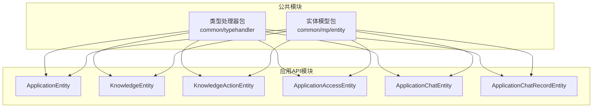
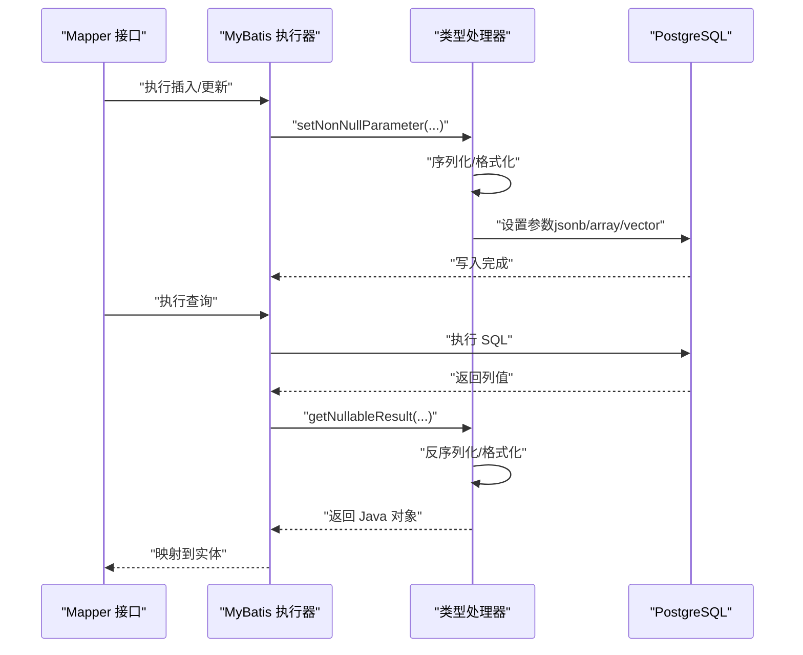
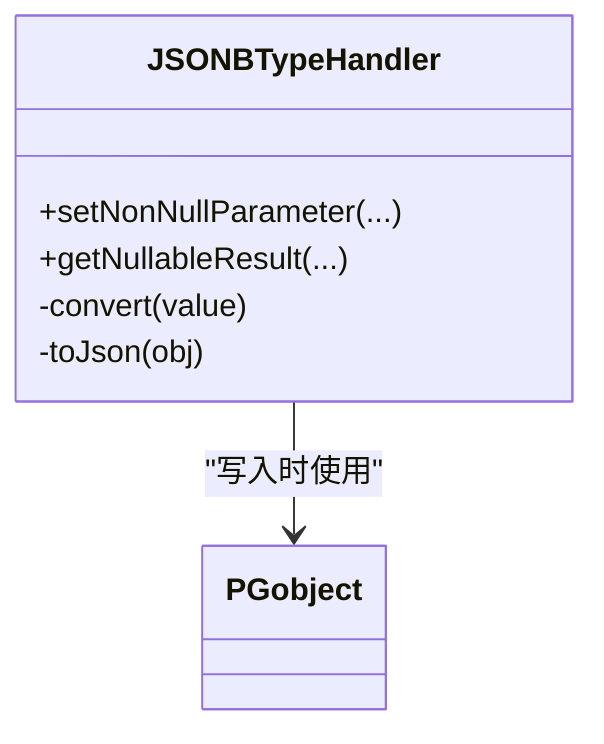
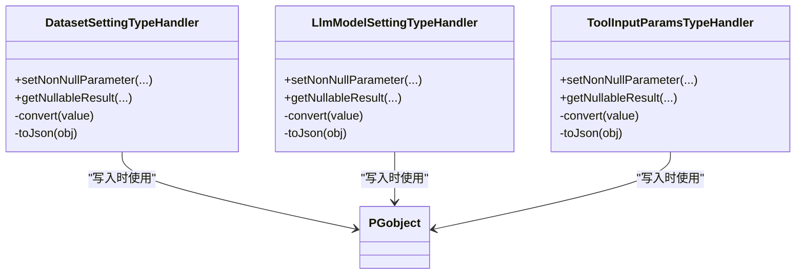
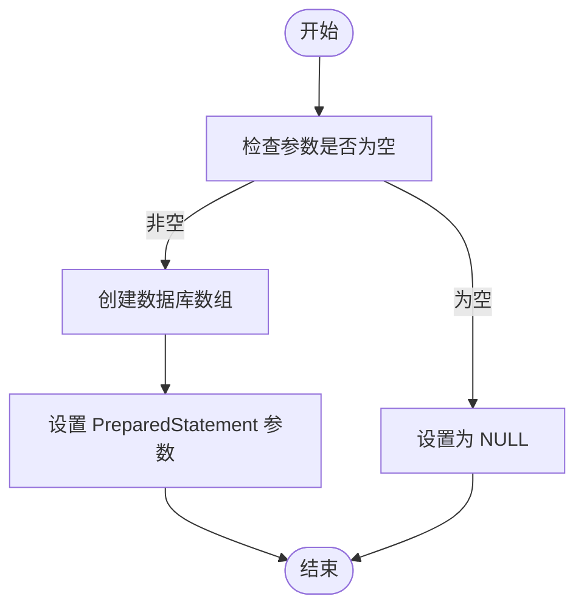
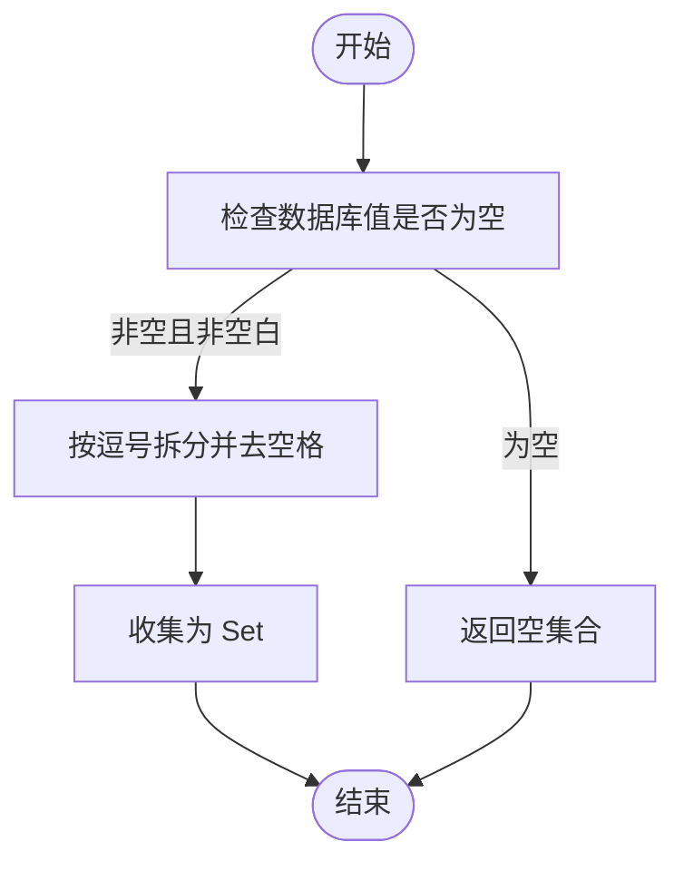
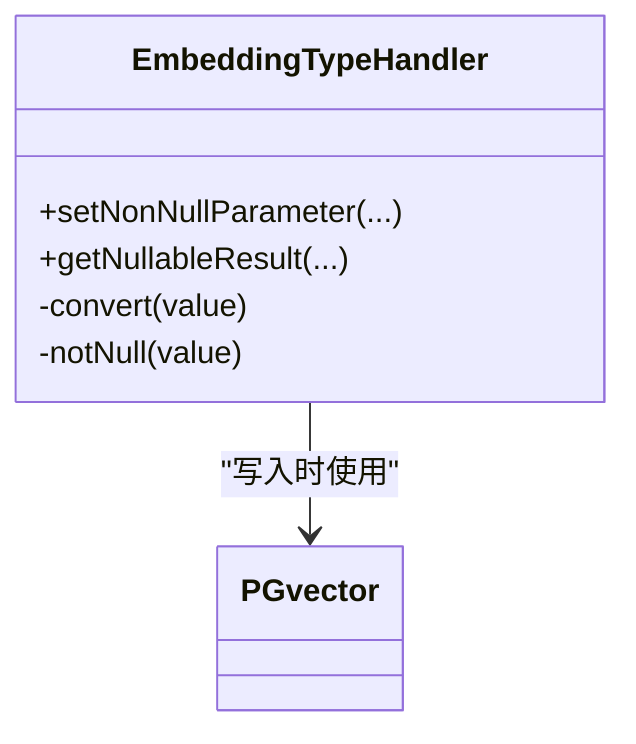
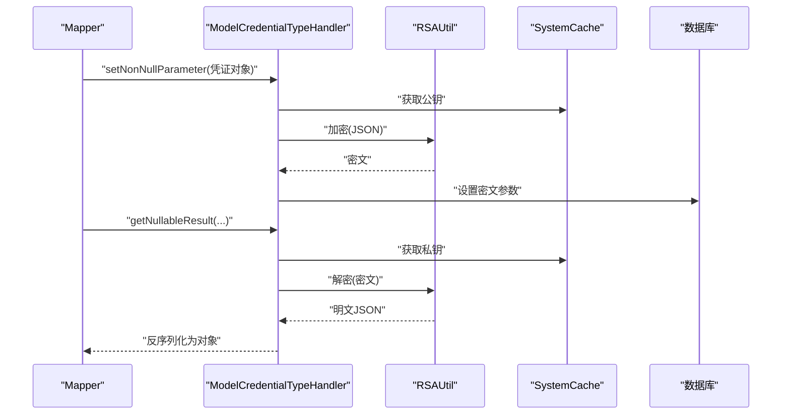
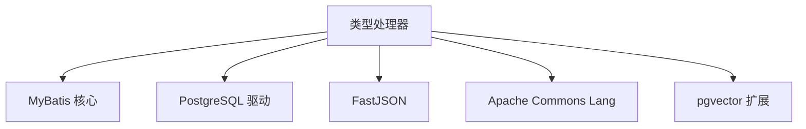

# 类型处理器

<cite>
**本文引用的文件**
- [DatasetSettingTypeHandler.java](file://maxkb4j-common/src/main/java/com/maxkb4j/common/typehandler/DatasetSettingTypeHandler.java)
- [LlmModelSettingTypeHandler.java](file://maxkb4j-common/src/main/java/com/maxkb4j/common/typehandler/LlmModelSettingTypeHandler.java)
- [JSONBTypeHandler.java](file://maxkb4j-common/src/main/java/com/maxkb4j/common/typehandler/JSONBTypeHandler.java)
- [StringListTypeHandler.java](file://maxkb4j-common/src/main/java/com/maxkb4j/common/typehandler/StringListTypeHandler.java)
- [StringSetTypeHandler.java](file://maxkb4j-common/src/main/java/com/maxkb4j/common/typehandler/StringSetTypeHandler.java)
- [EmbeddingTypeHandler.java](file://maxkb4j-common/src/main/java/com/maxkb4j/common/typehandler/EmbeddingTypeHandler.java)
- [ModelCredentialTypeHandler.java](file://maxkb4j-common/src/main/java/com/maxkb4j/common/typehandler/ModelCredentialTypeHandler.java)
- [ToolInputParamsTypeHandler.java](file://maxkb4j-common/src/main/java/com/maxkb4j/common/typehandler/ToolInputParamsTypeHandler.java)
- [KnowledgeSetting.java](file://maxkb4j-common/src/main/java/com/maxkb4j/common/mp/entity/KnowledgeSetting.java)
- [LlmModelSetting.java](file://maxkb4j-common/src/main/java/com/maxkb4j/common/mp/entity/LlmModelSetting.java)
- [ModelCredential.java](file://maxkb4j-common/src/main/java/com/maxkb4j/common/mp/entity/ModelCredential.java)
- [ToolInputField.java](file://maxkb4j-common/src/main/java/com/maxkb4j/common/mp/entity/ToolInputField.java)
- [ApplicationEntity.java](file://maxkb4j-service-api/maxkb4j-application-api/src/main/java/com/maxkb4j/application/entity/ApplicationEntity.java)
- [KnowledgeActionEntity.java](file://maxkb4j-service-api/maxkb4j-knowledge-api/src/main/java/com/maxkb4j/knowledge/entity/KnowledgeActionEntity.java)
- [KnowledgeEntity.java](file://maxkb4j-service-api/maxkb4j-knowledge-api/src/main/java/com/maxkb4j/knowledge/entity/KnowledgeEntity.java)
- [ApplicationAccessTokenEntity.java](file://maxkb4j-service-api/maxkb4j-application-api/src/main/java/com/maxkb4j/application/entity/ApplicationAccessTokenEntity.java)
- [ApplicationChatRecordEntity.java](file://maxkb4j-service-api/maxkb4j-application-api/src/main/java/com/maxkb4j/application/entity/ApplicationChatRecordEntity.java)
- [ApplicationChatEntity.java](file://maxkb4j-service-api/maxkb4j-application-api/src/main/java/com/maxkb4j/application/entity/ApplicationChatEntity.java)
- [ApplicationAccessEntity.java](file://maxkb4j-service-api/maxkb4j-application-api/src/main/java/com/maxkb4j/application/entity/ApplicationAccessEntity.java)
- [pom.xml](file://pom.xml)
- [service层pom.xml](file://maxkb4j-service/pom.xml)
</cite>

## 目录
1. [简介](#简介)
2. [项目结构](#项目结构)
3. [核心组件](#核心组件)
4. [架构总览](#架构总览)
5. [详细组件分析](#详细组件分析)
6. [依赖分析](#依赖分析)
7. [性能考量](#性能考量)
8. [故障排查指南](#故障排查指南)
9. [结论](#结论)
10. [附录](#附录)

## 简介
本文件系统性梳理 MaxKB4j 中的 MyBatis 自定义类型处理器（TypeHandler），重点覆盖以下处理器：DatasetSettingTypeHandler、LlmModelSettingTypeHandler、JSONBTypeHandler、StringListTypeHandler、StringSetTypeHandler、EmbeddingTypeHandler、ModelCredentialTypeHandler、ToolInputParamsTypeHandler。文档从架构与数据流角度解析其职责、实现原理与最佳实践，帮助开发者正确注册、使用与扩展类型处理器，确保复杂对象、JSON 文本、数组与向量等特殊数据类型的稳定持久化与读取。

## 项目结构
类型处理器集中位于公共模块的 typehandler 包中，实体类位于 common/mp/entity 下，具体实体在各 API 模块中通过注解方式绑定类型处理器。数据库驱动采用 PostgreSQL，部分向量类型依赖 pgvector 扩展。

图表来源
- [DatasetSettingTypeHandler.java:1-61](file://maxkb4j-common/src/main/java/com/maxkb4j/common/typehandler/DatasetSettingTypeHandler.java#L1-L61)
- [LlmModelSettingTypeHandler.java:1-61](file://maxkb4j-common/src/main/java/com/maxkb4j/common/typehandler/LlmModelSettingTypeHandler.java#L1-L61)
- [JSONBTypeHandler.java:1-60](file://maxkb4j-common/src/main/java/com/maxkb4j/common/typehandler/JSONBTypeHandler.java#L1-L60)
- [StringListTypeHandler.java:1-48](file://maxkb4j-common/src/main/java/com/maxkb4j/common/typehandler/StringListTypeHandler.java#L1-L48)
- [StringSetTypeHandler.java:1-65](file://maxkb4j-common/src/main/java/com/maxkb4j/common/typehandler/StringSetTypeHandler.java#L1-L65)
- [EmbeddingTypeHandler.java:1-67](file://maxkb4j-common/src/main/java/com/maxkb4j/common/typehandler/EmbeddingTypeHandler.java#L1-L67)
- [ModelCredentialTypeHandler.java:1-71](file://maxkb4j-common/src/main/java/com/maxkb4j/common/typehandler/ModelCredentialTypeHandler.java#L1-L71)
- [ToolInputParamsTypeHandler.java:1-62](file://maxkb4j-common/src/main/java/com/maxkb4j/common/typehandler/ToolInputParamsTypeHandler.java#L1-L62)
- [ApplicationEntity.java:1-47](file://maxkb4j-service-api/maxkb4j-application-api/src/main/java/com/maxkb4j/application/entity/ApplicationEntity.java#L1-L47)
- [KnowledgeEntity.java:1-34](file://maxkb4j-service-api/maxkb4j-knowledge-api/src/main/java/com/maxkb4j/knowledge/entity/KnowledgeEntity.java#L1-L34)
- [KnowledgeActionEntity.java:1-22](file://maxkb4j-service-api/maxkb4j-knowledge-api/src/main/java/com/maxkb4j/knowledge/entity/KnowledgeActionEntity.java#L1-L22)
- [ApplicationAccessEntity.java:1-19](file://maxkb4j-service-api/maxkb4j-application-api/src/main/java/com/maxkb4j/application/entity/ApplicationAccessEntity.java#L1-L19)
- [ApplicationChatEntity.java:1-37](file://maxkb4j-service-api/maxkb4j-application-api/src/main/java/com/maxkb4j/application/entity/ApplicationChatEntity.java#L1-L37)
- [ApplicationChatRecordEntity.java:1-40](file://maxkb4j-service-api/maxkb4j-application-api/src/main/java/com/maxkb4j/application/entity/ApplicationChatRecordEntity.java#L1-L40)

章节来源
- [pom.xml:132-147](file://pom.xml#L132-L147)
- [service层pom.xml:45-66](file://maxkb4j-service/pom.xml#L45-L66)

## 核心组件
本节概述各类型处理器的核心职责与通用模式：
- JSONB 类型处理器：负责 JSON 对象与字符串之间的双向转换，适配 PostgreSQL 的 json/jsonb 字段。
- 复杂对象处理器：将领域对象序列化为 JSON 存储，读取时反序列化为 Java 对象。
- 数组/集合处理器：将 List/Set 转换为数据库数组或字符串，支持查询与更新。
- 向量处理器：将浮点数列表转换为 pgvector 向量，用于相似度检索。
- 加密凭证处理器：对敏感字段进行加密存储与解密读取。

章节来源
- [JSONBTypeHandler.java:1-60](file://maxkb4j-common/src/main/java/com/maxkb4j/common/typehandler/JSONBTypeHandler.java#L1-L60)
- [DatasetSettingTypeHandler.java:1-61](file://maxkb4j-common/src/main/java/com/maxkb4j/common/typehandler/DatasetSettingTypeHandler.java#L1-L61)
- [LlmModelSettingTypeHandler.java:1-61](file://maxkb4j-common/src/main/java/com/maxkb4j/common/typehandler/LlmModelSettingTypeHandler.java#L1-L61)
- [ToolInputParamsTypeHandler.java:1-62](file://maxkb4j-common/src/main/java/com/maxkb4j/common/typehandler/ToolInputParamsTypeHandler.java#L1-L62)
- [StringListTypeHandler.java:1-48](file://maxkb4j-common/src/main/java/com/maxkb4j/common/typehandler/StringListTypeHandler.java#L1-L48)
- [StringSetTypeHandler.java:1-65](file://maxkb4j-common/src/main/java/com/maxkb4j/common/typehandler/StringSetTypeHandler.java#L1-L65)
- [EmbeddingTypeHandler.java:1-67](file://maxkb4j-common/src/main/java/com/maxkb4j/common/typehandler/EmbeddingTypeHandler.java#L1-L67)
- [ModelCredentialTypeHandler.java:1-71](file://maxkb4j-common/src/main/java/com/maxkb4j/common/typehandler/ModelCredentialTypeHandler.java#L1-L71)

## 架构总览
类型处理器在 MyBatis 中承担“Java 类型 ↔ JDBC 类型”的桥梁角色。下图展示典型流程：写入时将 Java 对象序列化为 JSON 或数组；读取时将数据库值还原为 Java 对象或集合。

图表来源
- [JSONBTypeHandler.java:17-43](file://maxkb4j-common/src/main/java/com/maxkb4j/common/typehandler/JSONBTypeHandler.java#L17-L43)
- [DatasetSettingTypeHandler.java:17-43](file://maxkb4j-common/src/main/java/com/maxkb4j/common/typehandler/DatasetSettingTypeHandler.java#L17-L43)
- [StringListTypeHandler.java:13-21](file://maxkb4j-common/src/main/java/com/maxkb4j/common/typehandler/StringListTypeHandler.java#L13-L21)
- [EmbeddingTypeHandler.java:18-41](file://maxkb4j-common/src/main/java/com/maxkb4j/common/typehandler/EmbeddingTypeHandler.java#L18-L41)

## 详细组件分析

### JSONB 类型处理器（JSONBTypeHandler）
- 作用：将 com.alibaba.fastjson.JSON 对象与 PostgreSQL json/jsonb 字段互转。
- 实现要点：
  - 写入：构造 PGobject 并设置 type 为 jsonb，value 为序列化后的字符串。
  - 读取：从 ResultSet/CallableStatement 获取字符串，再解析为 JSON。
  - 序列化特性：禁用循环引用检测，避免复杂对象导致的序列化问题。
- 典型应用场景：知识元数据、工作流配置、访问控制状态等 JSON 结构字段。

图表来源
- [JSONBTypeHandler.java:1-60](file://maxkb4j-common/src/main/java/com/maxkb4j/common/typehandler/JSONBTypeHandler.java#L1-L60)

章节来源
- [JSONBTypeHandler.java:1-60](file://maxkb4j-common/src/main/java/com/maxkb4j/common/typehandler/JSONBTypeHandler.java#L1-L60)
- [KnowledgeEntity.java:24-32](file://maxkb4j-service-api/maxkb4j-knowledge-api/src/main/java/com/maxkb4j/knowledge/entity/KnowledgeEntity.java#L24-L32)
- [KnowledgeActionEntity.java:16-20](file://maxkb4j-service-api/maxkb4j-knowledge-api/src/main/java/com/maxkb4j/knowledge/entity/KnowledgeActionEntity.java#L16-L20)
- [ApplicationAccessEntity.java:15-18](file://maxkb4j-service-api/maxkb4j-application-api/src/main/java/com/maxkb4j/application/entity/ApplicationAccessEntity.java#L15-L18)
- [ApplicationChatEntity.java:22-32](file://maxkb4j-service-api/maxkb4j-application-api/src/main/java/com/maxkb4j/application/entity/ApplicationChatEntity.java#L22-L32)

### 复杂对象处理器（DatasetSettingTypeHandler、LlmModelSettingTypeHandler、ToolInputParamsTypeHandler）
- 作用：将领域对象序列化为 JSONB 存储，读取时反序列化为强类型对象。
- 实现要点：
  - 写入：构造 PGobject，type=jsonb，value=对象的 JSON 字符串。
  - 读取：从字符串解析为对应实体类。
  - 序列化特性：保留 null 值、空列表、空字符串，保证字段完整性。
- 典型应用场景：
  - DatasetSettingTypeHandler：应用的知识库检索参数。
  - LlmModelSettingTypeHandler：大模型提示词与推理开关等配置。
  - ToolInputParamsTypeHandler：工具输入字段定义列表。

图表来源
- [DatasetSettingTypeHandler.java:1-61](file://maxkb4j-common/src/main/java/com/maxkb4j/common/typehandler/DatasetSettingTypeHandler.java#L1-L61)
- [LlmModelSettingTypeHandler.java:1-61](file://maxkb4j-common/src/main/java/com/maxkb4j/common/typehandler/LlmModelSettingTypeHandler.java#L1-L61)
- [ToolInputParamsTypeHandler.java:1-62](file://maxkb4j-common/src/main/java/com/maxkb4j/common/typehandler/ToolInputParamsTypeHandler.java#L1-L62)

章节来源
- [DatasetSettingTypeHandler.java:1-61](file://maxkb4j-common/src/main/java/com/maxkb4j/common/typehandler/DatasetSettingTypeHandler.java#L1-L61)
- [LlmModelSettingTypeHandler.java:1-61](file://maxkb4j-common/src/main/java/com/maxkb4j/common/typehandler/LlmModelSettingTypeHandler.java#L1-L61)
- [ToolInputParamsTypeHandler.java:1-62](file://maxkb4j-common/src/main/java/com/maxkb4j/common/typehandler/ToolInputParamsTypeHandler.java#L1-L62)
- [ApplicationEntity.java:36-40](file://maxkb4j-service-api/maxkb4j-application-api/src/main/java/com/maxkb4j/application/entity/ApplicationEntity.java#L36-L40)
- [KnowledgeSetting.java:1-21](file://maxkb4j-common/src/main/java/com/maxkb4j/common/mp/entity/KnowledgeSetting.java#L1-L21)
- [LlmModelSetting.java:1-13](file://maxkb4j-common/src/main/java/com/maxkb4j/common/mp/entity/LlmModelSetting.java#L1-L13)
- [ToolInputField.java:1-14](file://maxkb4j-common/src/main/java/com/maxkb4j/common/mp/entity/ToolInputField.java#L1-L14)

### 列表类型处理器（StringListTypeHandler）
- 作用：将 List<String> 映射为 PostgreSQL 的 varchar[] 数组。
- 实现要点：
  - 写入：通过连接创建数组，设置为 PreparedStatement 的 Array 参数。
  - 读取：从 ResultSet 获取 Array，转换为 List<String>。
- 典型应用场景：应用访问令牌白名单、API Key 列表等。

图表来源
- [StringListTypeHandler.java:13-21](file://maxkb4j-common/src/main/java/com/maxkb4j/common/typehandler/StringListTypeHandler.java#L13-L21)

章节来源
- [StringListTypeHandler.java:1-48](file://maxkb4j-common/src/main/java/com/maxkb4j/common/typehandler/StringListTypeHandler.java#L1-L48)
- [ApplicationAccessTokenEntity.java:35-35](file://maxkb4j-service-api/maxkb4j-application-api/src/main/java/com/maxkb4j/application/entity/ApplicationAccessTokenEntity.java#L35-L35)
- [ApplicationApiKeyEntity.java:24-24](file://maxkb4j-service-api/maxkb4j-application-api/src/main/java/com/maxkb4j/application/entity/ApplicationAccessTokenEntity.java#L24-L24)
- [ApplicationChatRecordEntity.java:32-32](file://maxkb4j-service-api/maxkb4j-application-api/src/main/java/com/maxkb4j/application/entity/ApplicationChatRecordEntity.java#L32-L32)
- [ApplicationChatShareLinkEntity.java:20-20](file://maxkb4j-service-api/maxkb4j-application-api/src/main/java/com/maxkb4j/application/entity/ApplicationChatRecordEntity.java#L20-L20)

### 集合类型处理器（StringSetTypeHandler）
- 作用：将 Set<String> 以逗号分隔的字符串形式存储于 varchar 字段，读取时还原为 Set。
- 实现要点：
  - 写入：将集合拼接为逗号分隔字符串。
  - 读取：按逗号拆分并去空格，收集为 Set。
- 典型应用场景：标签集合、权限标识集合等。

图表来源
- [StringSetTypeHandler.java:44-54](file://maxkb4j-common/src/main/java/com/maxkb4j/common/typehandler/StringSetTypeHandler.java#L44-L54)

章节来源
- [StringSetTypeHandler.java:1-65](file://maxkb4j-common/src/main/java/com/maxkb4j/common/typehandler/StringSetTypeHandler.java#L1-L65)

### 向量类型处理器（EmbeddingTypeHandler）
- 作用：将 List<Float> 转换为 pgvector 向量，支持相似度检索。
- 实现要点：
  - 写入：构造 PGvector 对象并设置为参数。
  - 读取：从字符串解析为浮点数列表，注意去除方括号与空值处理。
- 典型应用场景：嵌入向量存储与查询。

图表来源
- [EmbeddingTypeHandler.java:1-67](file://maxkb4j-common/src/main/java/com/maxkb4j/common/typehandler/EmbeddingTypeHandler.java#L1-L67)

章节来源
- [EmbeddingTypeHandler.java:1-67](file://maxkb4j-common/src/main/java/com/maxkb4j/common/typehandler/EmbeddingTypeHandler.java#L1-L67)

### 凭证加密处理器（ModelCredentialTypeHandler）
- 作用：对敏感的模型凭证进行加密存储，读取时解密并反序列化。
- 实现要点：
  - 写入：使用公钥加密 JSON 字符串后存入数据库。
  - 读取：使用私钥解密后解析为 ModelCredential 对象。
  - 错误处理：异常统一包装为运行时异常，便于 MyBatis 捕获。
- 典型应用场景：模型服务的认证凭据安全存储。

图表来源
- [ModelCredentialTypeHandler.java:19-63](file://maxkb4j-common/src/main/java/com/maxkb4j/common/typehandler/ModelCredentialTypeHandler.java#L19-L63)

章节来源
- [ModelCredentialTypeHandler.java:1-71](file://maxkb4j-common/src/main/java/com/maxkb4j/common/typehandler/ModelCredentialTypeHandler.java#L1-L71)
- [ModelCredential.java:1-12](file://maxkb4j-common/src/main/java/com/maxkb4j/common/mp/entity/ModelCredential.java#L1-L12)

## 依赖分析
- MyBatis 依赖：类型处理器基于 MyBatis 的 BaseTypeHandler 抽象实现。
- PostgreSQL 依赖：使用 org.postgresql.util.PGobject 存储 json/jsonb；使用 pgvector 存储向量。
- JSON 工具：使用 FastJSON 进行序列化与反序列化。
- 集合工具：使用 Apache Commons Lang 提供的字符串工具函数。

图表来源
- [pom.xml:132-147](file://pom.xml#L132-L147)
- [service层pom.xml:45-66](file://maxkb4j-service/pom.xml#L45-L66)
- [EmbeddingTypeHandler.java:3-5](file://maxkb4j-common/src/main/java/com/maxkb4j/common/typehandler/EmbeddingTypeHandler.java#L3-L5)

章节来源
- [pom.xml:132-147](file://pom.xml#L132-L147)
- [service层pom.xml:45-66](file://maxkb4j-service/pom.xml#L45-L66)

## 性能考量
- JSON 序列化策略
  - 使用禁用循环引用检测的序列化特性，避免深度对象导致的序列化开销与栈溢出。
  - 对于大型 JSON，建议在入库前进行必要的裁剪与压缩，减少网络与磁盘 IO。
- 数组与集合
  - 列表/集合过大时，优先考虑分页查询与懒加载，避免一次性读取全部数据。
  - 在 PostgreSQL 中合理使用索引与查询条件，避免全表扫描。
- 向量检索
  - 向量维度较高时，建议结合索引策略与近似最近邻算法，平衡精度与性能。
- 缓存与加密
  - 凭证解密仅在读取时发生，建议在业务层缓存解密结果，降低重复解密成本。
- 连接与资源
  - PreparedStatement/ResultSet 使用完成后及时关闭，避免连接泄漏。

## 故障排查指南
- JSON 解析失败
  - 现象：读取 JSON 字段时报错或返回 null。
  - 排查：确认数据库中存储的是合法 JSON；检查序列化特性是否与解析期望一致。
  - 参考路径：[JSONBTypeHandler.convert:45-49](file://maxkb4j-common/src/main/java/com/maxkb4j/common/typehandler/JSONBTypeHandler.java#L45-L49)
- 数组读取为空
  - 现象：查询返回 null 或空集合。
  - 排查：确认数据库字段类型为数组类型；检查读取分支是否正确处理了空值。
  - 参考路径：[StringListTypeHandler.getNullableResult:24-41](file://maxkb4j-common/src/main/java/com/maxkb4j/common/typehandler/StringListTypeHandler.java#L24-L41)
- 向量解析异常
  - 现象：读取向量字段报错或结果为空。
  - 排查：确认数据库中存储格式为标准向量字符串；检查方括号与空值处理逻辑。
  - 参考路径：[EmbeddingTypeHandler.convert:44-58](file://maxkb4j-common/src/main/java/com/maxkb4j/common/typehandler/EmbeddingTypeHandler.java#L44-L58)
- 凭证解密失败
  - 现象：读取凭证时报运行时异常。
  - 排查：确认公钥/私钥缓存可用；检查密文格式与长度；查看异常堆栈定位具体环节。
  - 参考路径：[ModelCredentialTypeHandler.convert:51-63](file://maxkb4j-common/src/main/java/com/maxkb4j/common/typehandler/ModelCredentialTypeHandler.java#L51-L63)

章节来源
- [JSONBTypeHandler.java:45-49](file://maxkb4j-common/src/main/java/com/maxkb4j/common/typehandler/JSONBTypeHandler.java#L45-L49)
- [StringListTypeHandler.java:24-41](file://maxkb4j-common/src/main/java/com/maxkb4j/common/typehandler/StringListTypeHandler.java#L24-L41)
- [EmbeddingTypeHandler.java:44-58](file://maxkb4j-common/src/main/java/com/maxkb4j/common/typehandler/EmbeddingTypeHandler.java#L44-L58)
- [ModelCredentialTypeHandler.java:51-63](file://maxkb4j-common/src/main/java/com/maxkb4j/common/typehandler/ModelCredentialTypeHandler.java#L51-L63)

## 结论
MaxKB4j 的类型处理器体系围绕 PostgreSQL 的 json/jsonb、数组与 pgvector 向量展开，通过标准化的序列化/反序列化与参数设置流程，实现了复杂对象、列表集合与向量数据的可靠持久化与读取。遵循本文的注册与使用规范、性能优化建议与故障排查步骤，可有效提升系统的稳定性与可维护性。

## 附录

### 注册与使用方法
- 在实体类字段上通过注解绑定类型处理器：
  - 示例：在实体字段上添加 TableField(typeHandler = ...) 注解，将 Java 类型与数据库类型桥接。
  - 参考路径：
    - [ApplicationEntity.knowledgeSetting:36-37](file://maxkb4j-service-api/maxkb4j-application-api/src/main/java/com/maxkb4j/application/entity/ApplicationEntity.java#L36-L37)
    - [ApplicationEntity.modelSetting:39-40](file://maxkb4j-service-api/maxkb4j-application-api/src/main/java/com/maxkb4j/application/entity/ApplicationEntity.java#L39-L40)
    - [KnowledgeEntity.meta:24-25](file://maxkb4j-service-api/maxkb4j-knowledge-api/src/main/java/com/maxkb4j/knowledge/entity/KnowledgeEntity.java#L24-L25)
    - [KnowledgeEntity.workFlow:31-32](file://maxkb4j-service-api/maxkb4j-knowledge-api/src/main/java/com/maxkb4j/knowledge/entity/KnowledgeEntity.java#L31-L32)
    - [ApplicationChatRecordEntity.chatIdList:32-32](file://maxkb4j-service-api/maxkb4j-application-api/src/main/java/com/maxkb4j/application/entity/ApplicationChatRecordEntity.java#L32-L32)

- 若需全局注册（如 MyBatis Plus 自动注册），可在配置中声明 TypeHandlers，但当前项目主要通过注解方式显式绑定。

### 如何扩展新的类型处理器
- 继承 BaseTypeHandler<T>，实现以下方法：
  - setNonNullParameter：将 Java 对象序列化为数据库可接受的类型（如 JSON 字符串、数组、向量对象）。
  - getNullableResult：从数据库读取值并反序列化为 Java 对象。
- 注意事项：
  - 正确处理 null 值与空字符串，避免空指针。
  - 选择合适的序列化特性，兼顾可读性与性能。
  - 对敏感数据使用加密处理器模式，确保数据安全。
- 参考实现路径：
  - [DatasetSettingTypeHandler:1-61](file://maxkb4j-common/src/main/java/com/maxkb4j/common/typehandler/DatasetSettingTypeHandler.java#L1-L61)
  - [JSONBTypeHandler:1-60](file://maxkb4j-common/src/main/java/com/maxkb4j/common/typehandler/JSONBTypeHandler.java#L1-L60)
  - [StringListTypeHandler:1-48](file://maxkb4j-common/src/main/java/com/maxkb4j/common/typehandler/StringListTypeHandler.java#L1-L48)
  - [EmbeddingTypeHandler:1-67](file://maxkb4j-common/src/main/java/com/maxkb4j/common/typehandler/EmbeddingTypeHandler.java#L1-L67)
  - [ModelCredentialTypeHandler:1-71](file://maxkb4j-common/src/main/java/com/maxkb4j/common/typehandler/ModelCredentialTypeHandler.java#L1-L71)