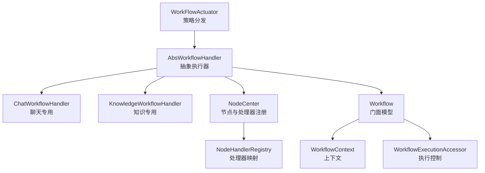
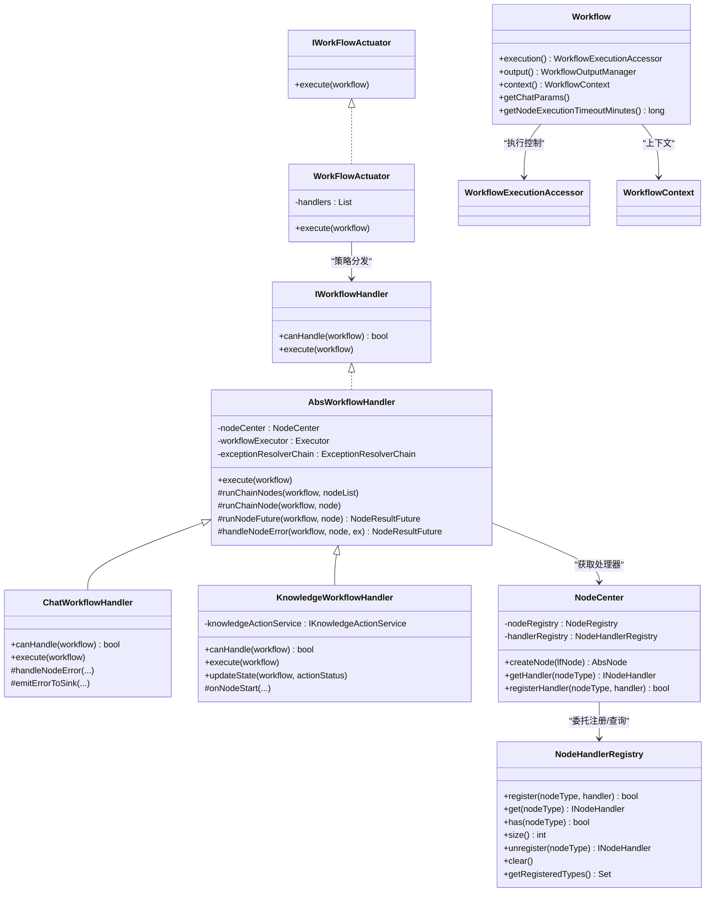
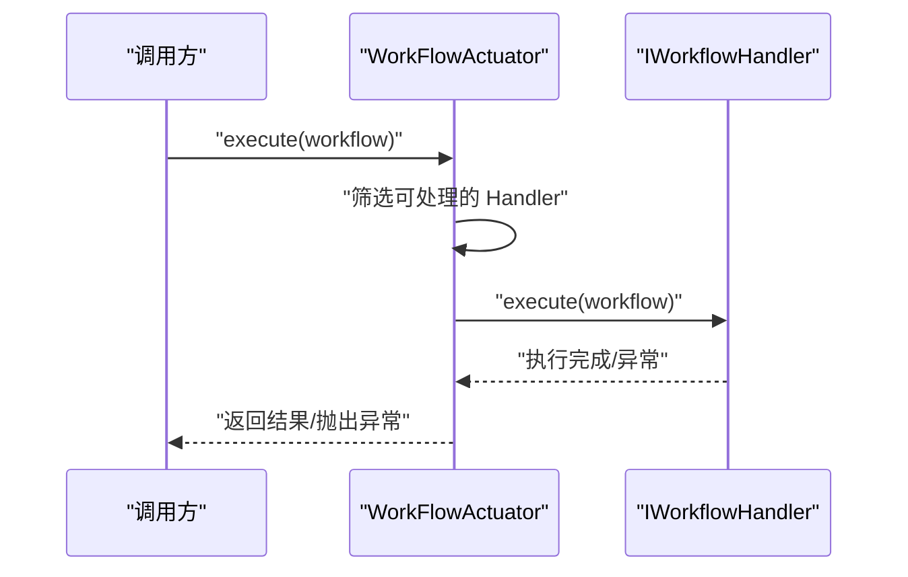
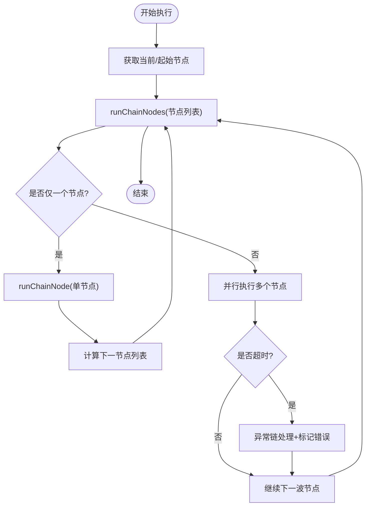
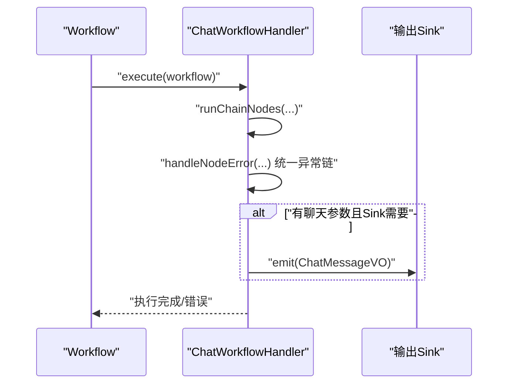
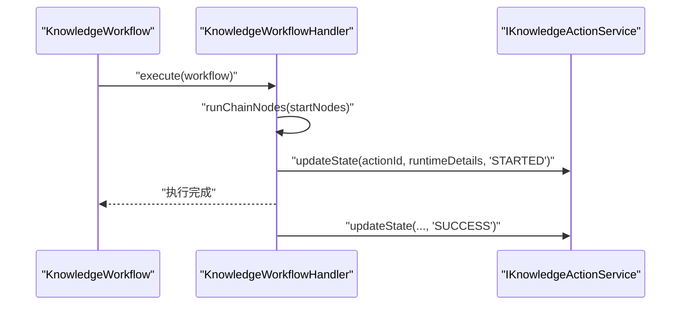
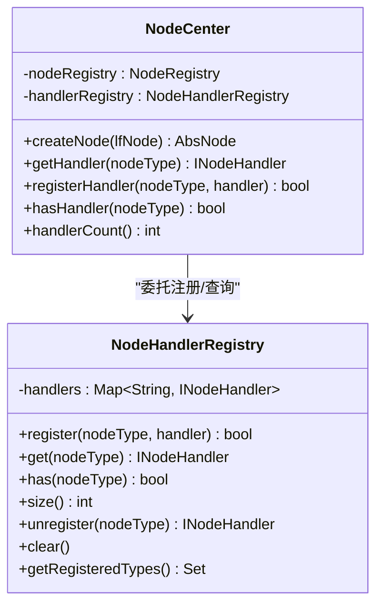
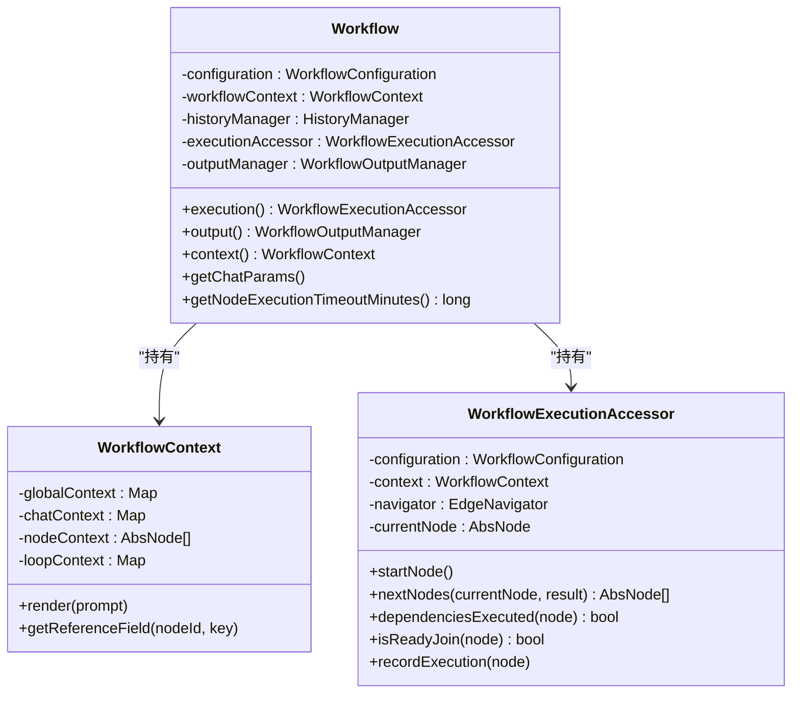
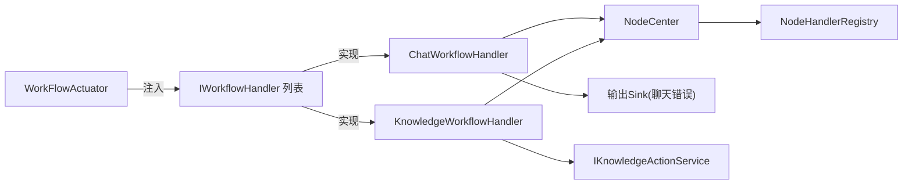
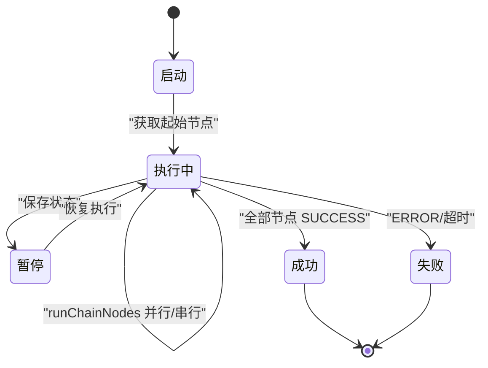

# 工作流执行器

<cite>
**本文档引用的文件**
- [WorkFlowActuator.java](file://maxkb4j-service/maxkb4j-workflow/src/main/java/com/maxkb4j/workflow/service/WorkFlowActuator.java)
- [AbsWorkflowHandler.java](file://maxkb4j-service/maxkb4j-workflow/src/main/java/com/maxkb4j/workflow/handler/AbsWorkflowHandler.java)
- [ChatWorkflowHandler.java](file://maxkb4j-service/maxkb4j-workflow/src/main/java/com/maxkb4j/workflow/handler/ChatWorkflowHandler.java)
- [KnowledgeWorkflowHandler.java](file://maxkb4j-service/maxkb4j-workflow/src/main/java/com/maxkb4j/workflow/handler/KnowledgeWorkflowHandler.java)
- [NodeCenter.java](file://maxkb4j-service/maxkb4j-workflow/src/main/java/com/maxkb4j/workflow/registry/NodeCenter.java)
- [NodeHandlerRegistry.java](file://maxkb4j-service/maxkb4j-workflow/src/main/java/com/maxkb4j/workflow/registry/NodeHandlerRegistry.java)
- [WorkflowConfig.java](file://maxkb4j-service/maxkb4j-workflow/src/main/java/com/maxkb4j/workflow/config/WorkflowConfig.java)
- [IWorkFlowActuator.java](file://maxkb4j-service-api/maxkb4j-workflow-api/src/main/java/com/maxkb4j/workflow/service/IWorkFlowActuator.java)
- [IWorkflowHandler.java](file://maxkb4j-service-api/maxkb4j-workflow-api/src/main/java/com/maxkb4j/workflow/service/IWorkflowHandler.java)
- [Workflow.java](file://maxkb4j-service-api/maxkb4j-workflow-api/src/main/java/com/maxkb4j/workflow/model/Workflow.java)
- [WorkflowContext.java](file://maxkb4j-service-api/maxkb4j-workflow-api/src/main/java/com/maxkb4j/workflow/model/WorkflowContext.java)
- [WorkflowExecutionAccessor.java](file://maxkb4j-service-api/maxkb4j-workflow-api/src/main/java/com/maxkb4j/workflow/model/WorkflowExecutionAccessor.java)
</cite>

## 目录
1. [简介](#简介)
2. [项目结构](#项目结构)
3. [核心组件](#核心组件)
4. [架构总览](#架构总览)
5. [详细组件分析](#详细组件分析)
6. [依赖分析](#依赖分析)
7. [性能考虑](#性能考虑)
8. [故障排查指南](#故障排查指南)
9. [结论](#结论)
10. [附录](#附录)

## 简介
本文件系统性解析工作流执行器的设计架构与执行策略，重点覆盖以下方面：
- WorkFlowActuator 的核心执行逻辑与策略分发机制
- 并行处理与超时控制的实现方式
- ChatWorkflowHandler 与 KnowledgeWorkflowHandler 的专用执行器实现差异
- 工作流的启动、执行、暂停、恢复与终止流程
- 执行器的配置参数与性能优化建议

## 项目结构
工作流模块采用“策略分发 + 抽象执行器 + 节点中心”的分层设计：
- 服务层：WorkFlowActuator 作为统一入口，根据工作流类型选择具体 Handler
- Handler 层：抽象基类 AbsWorkflowHandler 提供通用执行框架；具体 Handler（ChatWorkflowHandler、KnowledgeWorkflowHandler）实现差异化行为
- 注册中心：NodeCenter 统一管理节点创建与处理器注册；NodeHandlerRegistry 独立维护处理器映射
- 模型层：Workflow、WorkflowContext、WorkflowExecutionAccessor 提供上下文、执行控制与输出管理

图表来源
- [WorkFlowActuator.java:18-34](file://maxkb4j-service/maxkb4j-workflow/src/main/java/com/maxkb4j/workflow/service/WorkFlowActuator.java#L18-L34)
- [AbsWorkflowHandler.java:27-48](file://maxkb4j-service/maxkb4j-workflow/src/main/java/com/maxkb4j/workflow/handler/AbsWorkflowHandler.java#L27-L48)
- [ChatWorkflowHandler.java:18-30](file://maxkb4j-service/maxkb4j-workflow/src/main/java/com/maxkb4j/workflow/handler/ChatWorkflowHandler.java#L18-L30)
- [KnowledgeWorkflowHandler.java:20-44](file://maxkb4j-service/maxkb4j-workflow/src/main/java/com/maxkb4j/workflow/handler/KnowledgeWorkflowHandler.java#L20-L44)
- [NodeCenter.java:25-43](file://maxkb4j-service/maxkb4j-workflow/src/main/java/com/maxkb4j/workflow/registry/NodeCenter.java#L25-L43)
- [Workflow.java:34-74](file://maxkb4j-service-api/maxkb4j-workflow-api/src/main/java/com/maxkb4j/workflow/model/Workflow.java#L34-L74)

章节来源
- [WorkFlowActuator.java:18-34](file://maxkb4j-service/maxkb4j-workflow/src/main/java/com/maxkb4j/workflow/service/WorkFlowActuator.java#L18-L34)
- [WorkflowConfig.java:14-34](file://maxkb4j-service/maxkb4j-workflow/src/main/java/com/maxkb4j/workflow/config/WorkflowConfig.java#L14-L34)

## 核心组件
- WorkFlowActuator：基于策略模式，遍历可用 Handler，按 canHandle 判定后执行 execute
- AbsWorkflowHandler：提供 runChainNodes/runChainNode/runNodeFuture 的模板方法，统一错误处理与状态流转
- ChatWorkflowHandler：非知识类工作流的通用执行器，支持向输出 Sink 发送错误消息
- KnowledgeWorkflowHandler：知识类工作流专用执行器，负责状态上报与节点状态同步
- NodeCenter：统一节点创建与处理器注册入口，解耦静态注册与工厂
- Workflow 模型族：Workflow、WorkflowContext、WorkflowExecutionAccessor 提供上下文、执行控制与输出管理

章节来源
- [IWorkFlowActuator.java:5-7](file://maxkb4j-service-api/maxkb4j-workflow-api/src/main/java/com/maxkb4j/workflow/service/IWorkFlowActuator.java#L5-L7)
- [IWorkflowHandler.java:5-22](file://maxkb4j-service-api/maxkb4j-workflow-api/src/main/java/com/maxkb4j/workflow/service/IWorkflowHandler.java#L5-L22)
- [AbsWorkflowHandler.java:27-189](file://maxkb4j-service/maxkb4j-workflow/src/main/java/com/maxkb4j/workflow/handler/AbsWorkflowHandler.java#L27-L189)
- [ChatWorkflowHandler.java:18-59](file://maxkb4j-service/maxkb4j-workflow/src/main/java/com/maxkb4j/workflow/handler/ChatWorkflowHandler.java#L18-L59)
- [KnowledgeWorkflowHandler.java:20-59](file://maxkb4j-service/maxkb4j-workflow/src/main/java/com/maxkb4j/workflow/handler/KnowledgeWorkflowHandler.java#L20-L59)
- [NodeCenter.java:25-165](file://maxkb4j-service/maxkb4j-workflow/src/main/java/com/maxkb4j/workflow/registry/NodeCenter.java#L25-L165)
- [Workflow.java:34-263](file://maxkb4j-service-api/maxkb4j-workflow-api/src/main/java/com/maxkb4j/workflow/model/Workflow.java#L34-L263)

## 架构总览
工作流执行器采用“策略 + 模板方法 + 注册中心”的组合架构：
- 策略分发：Actuator 根据工作流类型选择 Handler
- 模板方法：Handler 统一编排节点执行、依赖检查、并行执行与异常处理
- 注册中心：NodeCenter 将节点创建与处理器注册解耦，便于扩展与替换

图表来源
- [WorkFlowActuator.java:18-34](file://maxkb4j-service/maxkb4j-workflow/src/main/java/com/maxkb4j/workflow/service/WorkFlowActuator.java#L18-L34)
- [AbsWorkflowHandler.java:27-189](file://maxkb4j-service/maxkb4j-workflow/src/main/java/com/maxkb4j/workflow/handler/AbsWorkflowHandler.java#L27-L189)
- [ChatWorkflowHandler.java:18-59](file://maxkb4j-service/maxkb4j-workflow/src/main/java/com/maxkb4j/workflow/handler/ChatWorkflowHandler.java#L18-L59)
- [KnowledgeWorkflowHandler.java:20-59](file://maxkb4j-service/maxkb4j-workflow/src/main/java/com/maxkb4j/workflow/handler/KnowledgeWorkflowHandler.java#L20-L59)
- [NodeCenter.java:25-165](file://maxkb4j-service/maxkb4j-workflow/src/main/java/com/maxkb4j/workflow/registry/NodeCenter.java#L25-L165)
- [NodeHandlerRegistry.java:18-123](file://maxkb4j-service/maxkb4j-workflow/src/main/java/com/maxkb4j/workflow/registry/NodeHandlerRegistry.java#L18-L123)
- [Workflow.java:34-263](file://maxkb4j-service-api/maxkb4j-workflow-api/src/main/java/com/maxkb4j/workflow/model/Workflow.java#L34-L263)

## 详细组件分析

### WorkFlowActuator：策略分发与执行入口
- 角色定位：统一入口，按工作流类型选择 Handler
- 关键逻辑：
  - 遍历 handlers，过滤 canHandle 返回 true 的处理器
  - 找到首个匹配处理器即执行 execute，否则抛出未找到处理器的异常
- 设计要点：通过 List<IWorkflowHandler> 注入，天然支持多实现扩展；策略选择简单高效

图表来源
- [WorkFlowActuator.java:22-34](file://maxkb4j-service/maxkb4j-workflow/src/main/java/com/maxkb4j/workflow/service/WorkFlowActuator.java#L22-L34)
- [IWorkflowHandler.java:21](file://maxkb4j-service-api/maxkb4j-workflow-api/src/main/java/com/maxkb4j/workflow/service/IWorkflowHandler.java#L21)

章节来源
- [WorkFlowActuator.java:18-34](file://maxkb4j-service/maxkb4j-workflow/src/main/java/com/maxkb4j/workflow/service/WorkFlowActuator.java#L18-L34)
- [IWorkFlowActuator.java:5-7](file://maxkb4j-service-api/maxkb4j-workflow-api/src/main/java/com/maxkb4j/workflow/service/IWorkFlowActuator.java#L5-L7)

### AbsWorkflowHandler：通用执行框架与并行策略
- 角色定位：抽象执行器，提供模板方法与统一错误处理
- 关键逻辑：
  - execute：确定起始节点，递归执行 runChainNodes
  - runChainNodes：单节点串行；多节点并行（CompletableFuture + 自定义线程池）
  - runChainNode：依赖检查、状态写入、上下文写入、计算下一节点
  - runNodeFuture：获取处理器、记录执行轨迹、执行节点、钩子回调、异常统一处理
  - handleNodeError：交由 ExceptionResolverChain 责任链处理
- 并行机制：
  - 多节点并行执行，每个节点封装为 CompletableFuture
  - 支持节点级超时（分钟级），超时后取消任务并进入异常链处理
- 状态管理：
  - 节点状态在执行前后更新，支持 SKIP/INTERRUPT/ERROR/SUCCESS
  - JOIN 节点的就绪判断避免提前执行

图表来源
- [AbsWorkflowHandler.java:40-85](file://maxkb4j-service/maxkb4j-workflow/src/main/java/com/maxkb4j/workflow/handler/AbsWorkflowHandler.java#L40-L85)
- [AbsWorkflowHandler.java:88-115](file://maxkb4j-service/maxkb4j-workflow/src/main/java/com/maxkb4j/workflow/handler/AbsWorkflowHandler.java#L88-L115)
- [AbsWorkflowHandler.java:125-148](file://maxkb4j-service/maxkb4j-workflow/src/main/java/com/maxkb4j/workflow/handler/AbsWorkflowHandler.java#L125-L148)

章节来源
- [AbsWorkflowHandler.java:27-189](file://maxkb4j-service/maxkb4j-workflow/src/main/java/com/maxkb4j/workflow/handler/AbsWorkflowHandler.java#L27-L189)

### ChatWorkflowHandler：聊天专用执行器
- 角色定位：处理非知识类工作流
- 关键差异：
  - canHandle：排除 KnowledgeWorkflow
  - 错误处理增强：在通用错误处理基础上，向输出 Sink 发送错误消息（当存在聊天参数且 Sink 需要）
- 适用场景：对话问答、工具调用、文本生成等非知识写入流程

图表来源
- [ChatWorkflowHandler.java:26-59](file://maxkb4j-service/maxkb4j-workflow/src/main/java/com/maxkb4j/workflow/handler/ChatWorkflowHandler.java#L26-L59)

章节来源
- [ChatWorkflowHandler.java:18-59](file://maxkb4j-service/maxkb4j-workflow/src/main/java/com/maxkb4j/workflow/handler/ChatWorkflowHandler.java#L18-L59)

### KnowledgeWorkflowHandler：知识专用执行器
- 角色定位：处理知识类工作流（如知识写入、索引构建等）
- 关键差异：
  - canHandle：仅处理 KnowledgeWorkflow
  - execute：从起始节点开始链式执行，完成后统一更新状态
  - updateState：调用 IKnowledgeActionService 更新动作状态与运行详情
  - onNodeStart：节点开始时同步节点状态与动作状态为 STARTED
- 适用场景：知识入库、批量处理、索引更新等后台任务

图表来源
- [KnowledgeWorkflowHandler.java:32-59](file://maxkb4j-service/maxkb4j-workflow/src/main/java/com/maxkb4j/workflow/handler/KnowledgeWorkflowHandler.java#L32-L59)

章节来源
- [KnowledgeWorkflowHandler.java:20-59](file://maxkb4j-service/maxkb4j-workflow/src/main/java/com/maxkb4j/workflow/handler/KnowledgeWorkflowHandler.java#L20-L59)

### 节点中心与处理器注册
- NodeCenter：
  - 统一节点创建入口，内置默认节点类型注册
  - 委托 NodeHandlerRegistry 管理处理器映射
  - 提供处理器注册、查询、数量统计与注销能力
- NodeHandlerRegistry：
  - 基于并发 Map 的处理器注册表
  - 支持重复注册覆盖、注销与清空
  - 提供已注册类型集合查询

图表来源
- [NodeCenter.java:25-165](file://maxkb4j-service/maxkb4j-workflow/src/main/java/com/maxkb4j/workflow/registry/NodeCenter.java#L25-L165)
- [NodeHandlerRegistry.java:18-123](file://maxkb4j-service/maxkb4j-workflow/src/main/java/com/maxkb4j/workflow/registry/NodeHandlerRegistry.java#L18-L123)

章节来源
- [NodeCenter.java:25-165](file://maxkb4j-service/maxkb4j-workflow/src/main/java/com/maxkb4j/workflow/registry/NodeCenter.java#L25-L165)
- [NodeHandlerRegistry.java:18-123](file://maxkb4j-service/maxkb4j-workflow/src/main/java/com/maxkb4j/workflow/registry/NodeHandlerRegistry.java#L18-L123)

### 工作流模型与执行控制
- Workflow：门面类，聚合配置、上下文、历史与输出管理器；提供便捷方法与分层访问器
- WorkflowContext：管理全局、聊天、节点与循环上下文，支持变量渲染与引用字段读取
- WorkflowExecutionAccessor：执行控制器，负责节点状态恢复、下一节点计算、JOIN 就绪判断、执行轨迹记录

图表来源
- [Workflow.java:34-263](file://maxkb4j-service-api/maxkb4j-workflow-api/src/main/java/com/maxkb4j/workflow/model/Workflow.java#L34-L263)
- [WorkflowContext.java:16-82](file://maxkb4j-service-api/maxkb4j-workflow-api/src/main/java/com/maxkb4j/workflow/model/WorkflowContext.java#L16-L82)
- [WorkflowExecutionAccessor.java:23-285](file://maxkb4j-service-api/maxkb4j-workflow-api/src/main/java/com/maxkb4j/workflow/model/WorkflowExecutionAccessor.java#L23-L285)

章节来源
- [Workflow.java:34-263](file://maxkb4j-service-api/maxkb4j-workflow-api/src/main/java/com/maxkb4j/workflow/model/Workflow.java#L34-L263)
- [WorkflowContext.java:16-82](file://maxkb4j-service-api/maxkb4j-workflow-api/src/main/java/com/maxkb4j/workflow/model/WorkflowContext.java#L16-L82)
- [WorkflowExecutionAccessor.java:23-285](file://maxkb4j-service-api/maxkb4j-workflow-api/src/main/java/com/maxkb4j/workflow/model/WorkflowExecutionAccessor.java#L23-L285)

## 依赖分析
- 组件内聚与耦合：
  - WorkFlowActuator 与 IWorkflowHandler 低耦合，通过接口注入实现策略扩展
  - AbsWorkflowHandler 与 NodeCenter、ExceptionResolverChain 松耦合，通过构造注入与接口调用
  - NodeCenter 与 NodeHandlerRegistry 单一职责清晰，前者负责节点与处理器入口，后者专注映射管理
- 外部依赖：
  - Spring 环境下的 Executor 注入（workflowExecutor），用于并行节点执行
  - IKnowledgeActionService（知识类状态更新）

图表来源
- [WorkFlowActuator.java:20](file://maxkb4j-service/maxkb4j-workflow/src/main/java/com/maxkb4j/workflow/service/WorkFlowActuator.java#L20)
- [ChatWorkflowHandler.java:20-24](file://maxkb4j-service/maxkb4j-workflow/src/main/java/com/maxkb4j/workflow/handler/ChatWorkflowHandler.java#L20-L24)
- [KnowledgeWorkflowHandler.java:22-30](file://maxkb4j-service/maxkb4j-workflow/src/main/java/com/maxkb4j/workflow/handler/KnowledgeWorkflowHandler.java#L22-L30)
- [NodeCenter.java:128-142](file://maxkb4j-service/maxkb4j-workflow/src/main/java/com/maxkb4j/workflow/registry/NodeCenter.java#L128-L142)

章节来源
- [WorkFlowActuator.java:18-34](file://maxkb4j-service/maxkb4j-workflow/src/main/java/com/maxkb4j/workflow/service/WorkFlowActuator.java#L18-L34)
- [NodeCenter.java:25-165](file://maxkb4j-service/maxkb4j-workflow/src/main/java/com/maxkb4j/workflow/registry/NodeCenter.java#L25-L165)

## 性能考虑
- 并行度控制
  - 并行节点数量取决于同时可达的下游节点数；建议根据业务负载与资源情况调整线程池大小
  - 节点级超时（分钟级）避免长时间阻塞，超时后立即进入异常链处理并取消任务
- 线程池配置
  - workflowExecutor 应具备合理的队列容量与拒绝策略，避免大量节点同时提交导致内存压力
- 上下文与状态写入
  - 节点结果写入上下文与详情需避免频繁大对象拷贝；必要时采用增量更新
- 输出 Sink
  - 聊天错误消息发送应异步化，避免阻塞主执行流程
- 资源回收
  - JOIN 节点的 SKIP 状态处理减少无效节点的继续执行，降低资源消耗

## 故障排查指南
- 未找到处理器
  - 现象：执行时抛出“未找到处理器”异常
  - 排查：确认 WorkFlowActuator 注入的 Handler 列表包含对应类型；或在 ChatWorkflowHandler 中排除了不应处理的类型
- 节点执行超时
  - 现象：日志出现“节点执行超时”信息
  - 排查：检查 workflow.getNodeExecutionTimeoutMinutes 设置；评估节点耗时与外部依赖；必要时拆分节点或增加超时
- 节点状态异常
  - 现象：节点停留在 READY/INTERRUPT/ERROR
  - 排查：检查 dependenciesExecuted 与 isReadyJoin 的条件；确认上游节点状态均为 SUCCESS 或 SKIP
- 知识动作状态不同步
  - 现象：知识类执行完成但状态未更新
  - 排查：确认 KnowledgeWorkflowHandler.updateState 被调用；核对 IKnowledgeActionService 的实现与 actionId

章节来源
- [WorkFlowActuator.java:29-33](file://maxkb4j-service/maxkb4j-workflow/src/main/java/com/maxkb4j/workflow/service/WorkFlowActuator.java#L29-L33)
- [AbsWorkflowHandler.java:64-84](file://maxkb4j-service/maxkb4j-workflow/src/main/java/com/maxkb4j/workflow/handler/AbsWorkflowHandler.java#L64-L84)
- [AbsWorkflowHandler.java:114-115](file://maxkb4j-service/maxkb4j-workflow/src/main/java/com/maxkb4j/workflow/handler/AbsWorkflowHandler.java#L114-L115)
- [KnowledgeWorkflowHandler.java:46-52](file://maxkb4j-service/maxkb4j-workflow/src/main/java/com/maxkb4j/workflow/handler/KnowledgeWorkflowHandler.java#L46-L52)

## 结论
工作流执行器通过策略分发与模板方法实现了高内聚、低耦合的执行框架。AbsWorkflowHandler 统一了节点执行、并行控制与异常处理；ChatWorkflowHandler 与 KnowledgeWorkflowHandler 在通用框架上分别满足聊天与知识类场景的差异化需求。配合 NodeCenter 与 NodeHandlerRegistry 的注册机制，系统具备良好的扩展性与可维护性。

## 附录

### 工作流生命周期与控制流程
- 启动：Actuator 根据类型选择 Handler；Handler 从 Workflow.execution() 获取当前/起始节点
- 执行：runChainNodes 串行或并行执行节点；runChainNode 完成依赖检查、状态写入与上下文写入
- 暂停/恢复：通过 WorkflowExecutionAccessor.loadNodeState 恢复节点状态与上下文；从断点继续执行
- 终止：异常链处理或显式中断；最终状态写入并触发 Sink 输出（如适用）

图表来源
- [AbsWorkflowHandler.java:40-85](file://maxkb4j-service/maxkb4j-workflow/src/main/java/com/maxkb4j/workflow/handler/AbsWorkflowHandler.java#L40-L85)
- [WorkflowExecutionAccessor.java:163-210](file://maxkb4j-service-api/maxkb4j-workflow-api/src/main/java/com/maxkb4j/workflow/model/WorkflowExecutionAccessor.java#L163-L210)