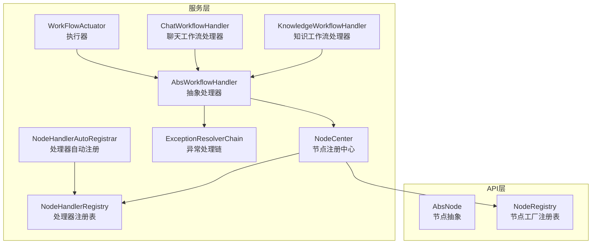
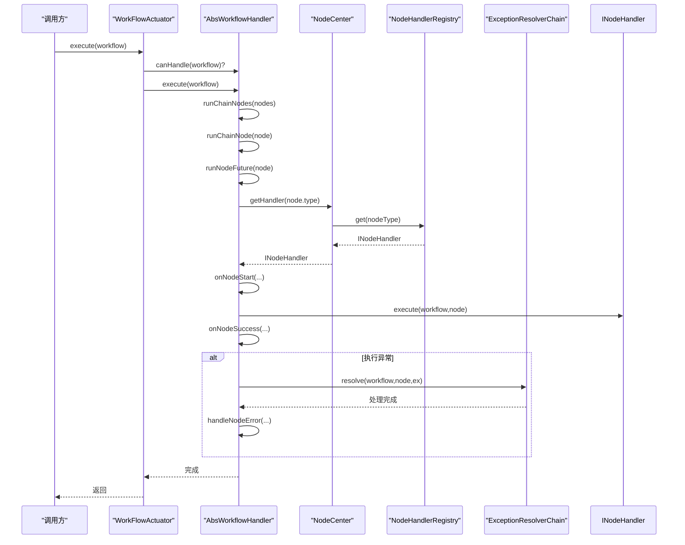
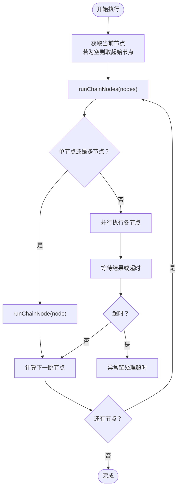
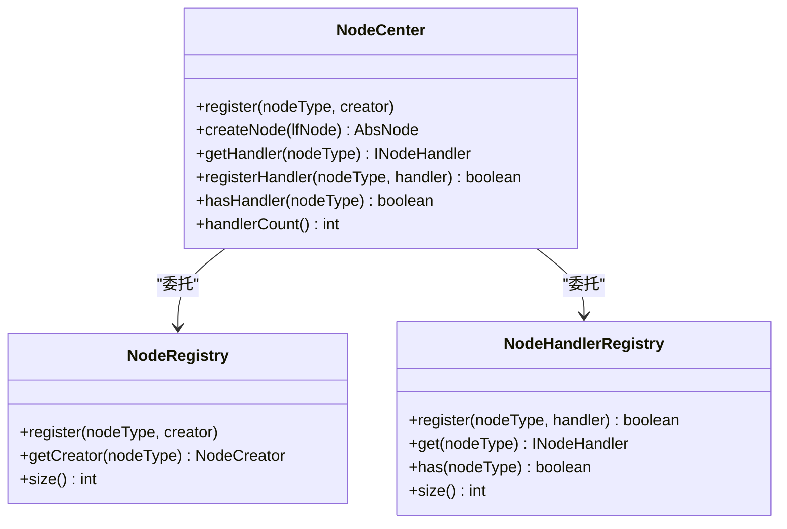
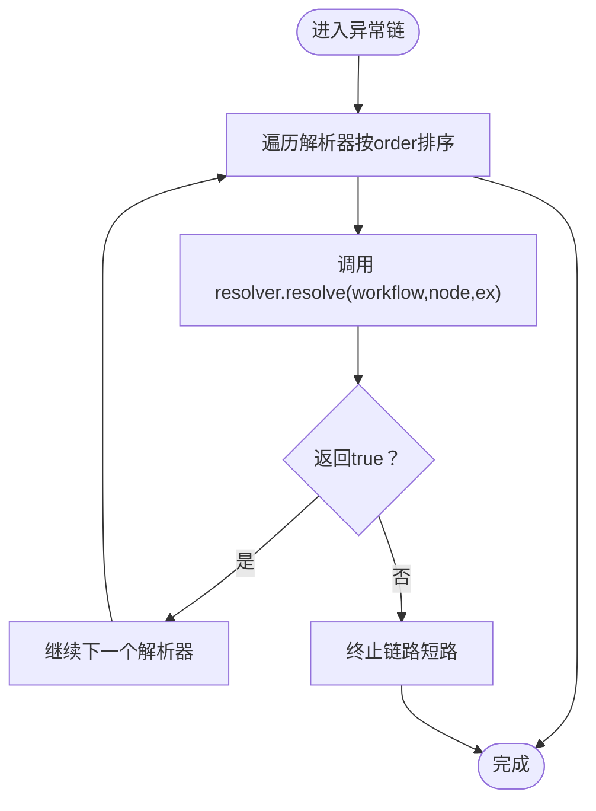
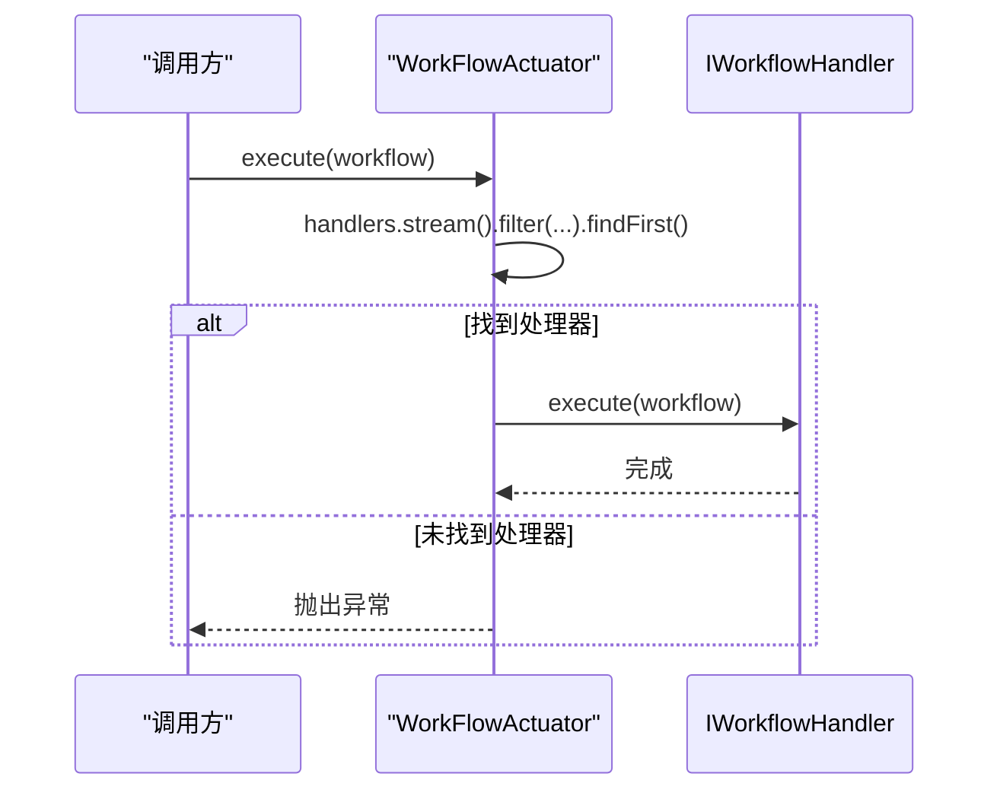
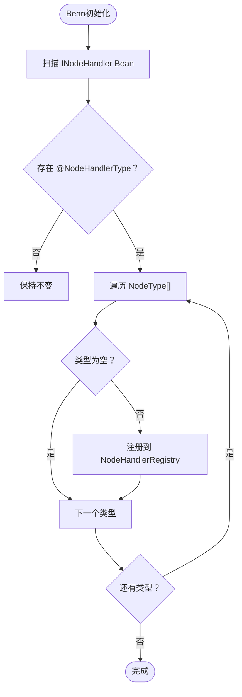
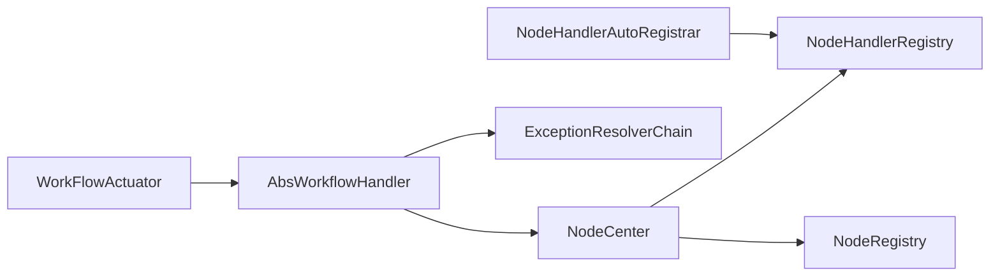

# 工作流服务模块 (maxkb4j-workflow) 技术文档

<cite>
**本文档引用的文件**
- [AbsWorkflowHandler.java](file://maxkb4j-service/maxkb4j-workflow/src/main/java/com/maxkb4j/workflow/handler/AbsWorkflowHandler.java)
- [NodeCenter.java](file://maxkb4j-service/maxkb4j-workflow/src/main/java/com/maxkb4j/workflow/registry/NodeCenter.java)
- [ExceptionResolverChain.java](file://maxkb4j-service/maxkb4j-workflow/src/main/java/com/maxkb4j/workflow/exception/ExceptionResolverChain.java)
- [WorkFlowActuator.java](file://maxkb4j-service/maxkb4j-workflow/src/main/java/com/maxkb4j/workflow/service/WorkFlowActuator.java)
- [NodeHandlerAutoRegistrar.java](file://maxkb4j-service/maxkb4j-workflow/src/main/java/com/maxkb4j/workflow/processor/NodeHandlerAutoRegistrar.java)
- [ChatWorkflowHandler.java](file://maxkb4j-service/maxkb4j-workflow/src/main/java/com/maxkb4j/workflow/handler/ChatWorkflowHandler.java)
- [KnowledgeWorkflowHandler.java](file://maxkb4j-service/maxkb4j-workflow/src/main/java/com/maxkb4j/workflow/handler/KnowledgeWorkflowHandler.java)
- [NodeHandlerRegistry.java](file://maxkb4j-service/maxkb4j-workflow/src/main/java/com/maxkb4j/workflow/registry/NodeHandlerRegistry.java)
- [NodeRegistry.java](file://maxkb4j-service-api/maxkb4j-workflow-api/src/main/java/com/maxkb4j/workflow/factory/NodeRegistry.java)
- [AbsNode.java](file://maxkb4j-service-api/maxkb4j-workflow-api/src/main/java/com/maxkb4j/workflow/node/AbsNode.java)
- [NodeHandlerType.java](file://maxkb4j-service/maxkb4j-workflow/src/main/java/com/maxkb4j/workflow/annotation/NodeHandlerType.java)
</cite>

## 目录
1. [简介](#简介)
2. [项目结构](#项目结构)
3. [核心组件](#核心组件)
4. [架构总览](#架构总览)
5. [详细组件分析](#详细组件分析)
6. [依赖关系分析](#依赖关系分析)
7. [性能考虑](#性能考虑)
8. [故障排除指南](#故障排除指南)
9. [结论](#结论)
10. [附录](#附录)

## 简介
本文件为工作流服务模块（maxkb4j-workflow）的综合技术文档，围绕可视化AI工作流引擎的设计理念与实现架构展开，重点解析以下方面：
- 抽象处理器 AbsWorkflowHandler 的设计与节点执行流程
- 节点注册中心（NodeCenter）的节点管理与调度策略
- 异常处理链（ExceptionResolverChain）的异常捕获与恢复机制
- 工作流执行器（WorkFlowActuator）的策略分发
- 节点处理器自动注册机制
- 工作流设计器使用指南与自定义节点开发示例

## 项目结构
工作流服务模块位于 maxkb4j-service/maxkb4j-workflow 中，采用“服务层”与“API层”分离的架构：
- 服务层（maxkb4j-service/maxkb4j-workflow）：包含处理器、注册中心、异常链、执行器等运行时组件
- API层（maxkb4j-service-api/maxkb4j-workflow-api）：定义节点抽象、工厂注册表、模型与枚举等跨层契约

**图表来源**
- [AbsWorkflowHandler.java:1-189](file://maxkb4j-service/maxkb4j-workflow/src/main/java/com/maxkb4j/workflow/handler/AbsWorkflowHandler.java#L1-L189)
- [NodeCenter.java:1-165](file://maxkb4j-service/maxkb4j-workflow/src/main/java/com/maxkb4j/workflow/registry/NodeCenter.java#L1-L165)
- [ExceptionResolverChain.java:1-58](file://maxkb4j-service/maxkb4j-workflow/src/main/java/com/maxkb4j/workflow/exception/ExceptionResolverChain.java#L1-L58)
- [WorkFlowActuator.java:1-37](file://maxkb4j-service/maxkb4j-workflow/src/main/java/com/maxkb4j/workflow/service/WorkFlowActuator.java#L1-L37)
- [NodeHandlerAutoRegistrar.java:1-40](file://maxkb4j-service/maxkb4j-workflow/src/main/java/com/maxkb4j/workflow/processor/NodeHandlerAutoRegistrar.java#L1-L40)
- [ChatWorkflowHandler.java:1-59](file://maxkb4j-service/maxkb4j-workflow/src/main/java/com/maxkb4j/workflow/handler/ChatWorkflowHandler.java#L1-L59)
- [KnowledgeWorkflowHandler.java:1-59](file://maxkb4j-service/maxkb4j-workflow/src/main/java/com/maxkb4j/workflow/handler/KnowledgeWorkflowHandler.java#L1-L59)
- [NodeHandlerRegistry.java:1-123](file://maxkb4j-service/maxkb4j-workflow/src/main/java/com/maxkb4j/workflow/registry/NodeHandlerRegistry.java#L1-L123)
- [AbsNode.java:1-132](file://maxkb4j-service-api/maxkb4j-workflow-api/src/main/java/com/maxkb4j/workflow/node/AbsNode.java#L1-L132)
- [NodeRegistry.java:1-112](file://maxkb4j-service-api/maxkb4j-workflow-api/src/main/java/com/maxkb4j/workflow/factory/NodeRegistry.java#L1-L112)

**章节来源**
- [AbsWorkflowHandler.java:1-189](file://maxkb4j-service/maxkb4j-workflow/src/main/java/com/maxkb4j/workflow/handler/AbsWorkflowHandler.java#L1-L189)
- [NodeCenter.java:1-165](file://maxkb4j-service/maxkb4j-workflow/src/main/java/com/maxkb4j/workflow/registry/NodeCenter.java#L1-L165)
- [WorkFlowActuator.java:1-37](file://maxkb4j-service/maxkb4j-workflow/src/main/java/com/maxkb4j/workflow/service/WorkFlowActuator.java#L1-L37)

## 核心组件
本节对工作流引擎的关键组件进行深入分析，涵盖职责、交互与扩展点。

- 抽象处理器 AbsWorkflowHandler
  - 设计要点：采用模板方法模式封装节点执行骨架；支持并行执行与超时控制；通过 NodeCenter 获取节点处理器；通过 ExceptionResolverChain 统一异常处理。
  - 关键流程：execute → runChainNodes → runChainNode → runNodeFuture → 调度钩子 → 节点执行 → 结果写入上下文 → 计算下一跳节点。
  - 并行策略：多节点并行执行使用独立线程池，单节点串行执行；超时以分钟为单位配置，超时或异常均交由异常链处理。
  - 钩子扩展：onNodeStart/onNodeSuccess 可在子类中注入前置/后置逻辑。

- 节点注册中心 NodeCenter
  - 职责：统一管理节点创建与处理器注册；提供默认节点创建函数注册；委托 NodeHandlerRegistry 管理处理器映射。
  - 默认节点：覆盖基础节点、AI对话、知识检索、条件判断、工具调用、循环控制、HTTP客户端、参数提取、用户选择、数据源等丰富节点类型。
  - 扩展点：通过 register/registerHandler 动态扩展节点类型与处理器。

- 异常处理链 ExceptionResolverChain
  - 职责：维护一组 NodeExceptionResolver，按 order 顺序执行；遇到异常时逐个尝试解析，支持短路终止。
  - 容错：单个解析器异常不会中断链路，记录警告日志后继续下一个解析器。

- 工作流执行器 WorkFlowActuator
  - 职责：根据工作流类型选择合适的 IWorkflowHandler；若无匹配处理器则抛出非法状态异常。
  - 策略：基于 canHandle 判定，优先匹配第一个可用处理器。

- 节点处理器自动注册 NodeHandlerAutoRegistrar
  - 职责：扫描带 @NodeHandlerType 注解的 INodeHandler Bean，按注解声明的 NodeType 数组注册到 NodeHandlerRegistry。
  - 安全性：忽略空类型值，避免误注册。

**章节来源**
- [AbsWorkflowHandler.java:21-189](file://maxkb4j-service/maxkb4j-workflow/src/main/java/com/maxkb4j/workflow/handler/AbsWorkflowHandler.java#L21-L189)
- [NodeCenter.java:14-165](file://maxkb4j-service/maxkb4j-workflow/src/main/java/com/maxkb4j/workflow/registry/NodeCenter.java#L14-L165)
- [ExceptionResolverChain.java:12-58](file://maxkb4j-service/maxkb4j-workflow/src/main/java/com/maxkb4j/workflow/exception/ExceptionResolverChain.java#L12-L58)
- [WorkFlowActuator.java:12-37](file://maxkb4j-service/maxkb4j-workflow/src/main/java/com/maxkb4j/workflow/service/WorkFlowActuator.java#L12-L37)
- [NodeHandlerAutoRegistrar.java:14-40](file://maxkb4j-service/maxkb4j-workflow/src/main/java/com/maxkb4j/workflow/processor/NodeHandlerAutoRegistrar.java#L14-L40)

## 架构总览
工作流引擎采用“策略+注册中心+责任链”的架构组合：
- 策略分发：WorkFlowActuator 根据工作流类型选择具体处理器
- 执行骨架：AbsWorkflowHandler 提供统一的节点执行模板
- 调度与注册：NodeCenter 统一管理节点创建与处理器注册
- 异常治理：ExceptionResolverChain 提供可插拔的异常处理能力
- 自动装配：NodeHandlerAutoRegistrar 实现处理器的零样板注册

**图表来源**
- [WorkFlowActuator.java:22-34](file://maxkb4j-service/maxkb4j-workflow/src/main/java/com/maxkb4j/workflow/service/WorkFlowActuator.java#L22-L34)
- [AbsWorkflowHandler.java:39-148](file://maxkb4j-service/maxkb4j-workflow/src/main/java/com/maxkb4j/workflow/handler/AbsWorkflowHandler.java#L39-L148)
- [NodeCenter.java:128-130](file://maxkb4j-service/maxkb4j-workflow/src/main/java/com/maxkb4j/workflow/registry/NodeCenter.java#L128-L130)
- [NodeHandlerRegistry.java:62-68](file://maxkb4j-service/maxkb4j-workflow/src/main/java/com/maxkb4j/workflow/registry/NodeHandlerRegistry.java#L62-L68)
- [ExceptionResolverChain.java:36-48](file://maxkb4j-service/maxkb4j-workflow/src/main/java/com/maxkb4j/workflow/exception/ExceptionResolverChain.java#L36-L48)

## 详细组件分析

### 抽象处理器 AbsWorkflowHandler
- 设计模式：模板方法 + 策略组合
- 关键职责：
  - 统一节点执行流程：校验状态 → 依赖满足 → 执行 → 写入上下文 → 计算下一流向
  - 并行执行：多节点使用 CompletableFuture 并行执行，统一超时控制
  - 异常治理：统一委托 ExceptionResolverChain 处理异常，设置节点状态为 ERROR
  - 调度钩子：onNodeStart/onNodeSuccess 供子类扩展
- 性能特性：独立线程池隔离工作流执行，避免阻塞主线程；超时以分钟为单位，防止长时间卡顿

**图表来源**
- [AbsWorkflowHandler.java:40-85](file://maxkb4j-service/maxkb4j-workflow/src/main/java/com/maxkb4j/workflow/handler/AbsWorkflowHandler.java#L40-L85)
- [AbsWorkflowHandler.java:88-115](file://maxkb4j-service/maxkb4j-workflow/src/main/java/com/maxkb4j/workflow/handler/AbsWorkflowHandler.java#L88-L115)

**章节来源**
- [AbsWorkflowHandler.java:21-189](file://maxkb4j-service/maxkb4j-workflow/src/main/java/com/maxkb4j/workflow/handler/AbsWorkflowHandler.java#L21-L189)

### 节点注册中心 NodeCenter
- 职责分离：NodeCenter 聚合 NodeRegistry（节点创建）与 NodeHandlerRegistry（处理器注册），提供统一入口
- 默认节点注册：内置大量节点类型创建函数，覆盖对话、检索、条件、工具、循环、HTTP、参数提取、用户选择、数据源、知识写入等
- 扩展机制：register/registerHandler 支持运行时扩展；createNode 委托 NodeRegistry 获取创建函数并实例化

**图表来源**
- [NodeCenter.java:25-165](file://maxkb4j-service/maxkb4j-workflow/src/main/java/com/maxkb4j/workflow/registry/NodeCenter.java#L25-L165)
- [NodeRegistry.java:17-112](file://maxkb4j-service-api/maxkb4j-workflow-api/src/main/java/com/maxkb4j/workflow/factory/NodeRegistry.java#L17-L112)
- [NodeHandlerRegistry.java:18-123](file://maxkb4j-service/maxkb4j-workflow/src/main/java/com/maxkb4j/workflow/registry/NodeHandlerRegistry.java#L18-L123)

**章节来源**
- [NodeCenter.java:14-165](file://maxkb4j-service/maxkb4j-workflow/src/main/java/com/maxkb4j/workflow/registry/NodeCenter.java#L14-L165)

### 异常处理链 ExceptionResolverChain
- 职责链模式：按 order 升序依次执行，遇到解析器返回 false 可短路终止
- 容错策略：单个解析器异常仅记录警告，不影响其他解析器执行
- 典型用途：统一记录错误详情、发送错误消息到输出通道、触发重试或降级

**图表来源**
- [ExceptionResolverChain.java:22-48](file://maxkb4j-service/maxkb4j-workflow/src/main/java/com/maxkb4j/workflow/exception/ExceptionResolverChain.java#L22-L48)

**章节来源**
- [ExceptionResolverChain.java:12-58](file://maxkb4j-service/maxkb4j-workflow/src/main/java/com/maxkb4j/workflow/exception/ExceptionResolverChain.java#L12-L58)

### 工作流执行器 WorkFlowActuator
- 策略模式：维护 IWorkflowHandler 列表，按 canHandle 匹配首个可用处理器
- 错误处理：若无匹配处理器，抛出非法状态异常，提示未找到对应处理器

**图表来源**
- [WorkFlowActuator.java:22-34](file://maxkb4j-service/maxkb4j-workflow/src/main/java/com/maxkb4j/workflow/service/WorkFlowActuator.java#L22-L34)

**章节来源**
- [WorkFlowActuator.java:12-37](file://maxkb4j-service/maxkb4j-workflow/src/main/java/com/maxkb4j/workflow/service/WorkFlowActuator.java#L12-L37)

### 节点处理器自动注册 NodeHandlerAutoRegistrar
- 扫描策略：Bean 后置处理器在初始化后扫描 INodeHandler Bean
- 注册规则：读取 @NodeHandlerType 注解中的 NodeType 数组，按 NodeType.key 注册到 NodeHandlerRegistry
- 安全性：过滤空类型值，避免误注册

**图表来源**
- [NodeHandlerAutoRegistrar.java:24-39](file://maxkb4j-service/maxkb4j-workflow/src/main/java/com/maxkb4j/workflow/processor/NodeHandlerAutoRegistrar.java#L24-L39)
- [NodeHandlerType.java:8-16](file://maxkb4j-service/maxkb4j-workflow/src/main/java/com/maxkb4j/workflow/annotation/NodeHandlerType.java#L8-L16)

**章节来源**
- [NodeHandlerAutoRegistrar.java:14-40](file://maxkb4j-service/maxkb4j-workflow/src/main/java/com/maxkb4j/workflow/processor/NodeHandlerAutoRegistrar.java#L14-L40)
- [NodeHandlerType.java:1-16](file://maxkb4j-service/maxkb4j-workflow/src/main/java/com/maxkb4j/workflow/annotation/NodeHandlerType.java#L1-L16)

### 聊天工作流处理器 ChatWorkflowHandler
- 职责：处理非知识类工作流；在异常时将错误消息发送至聊天输出通道
- 扩展点：重写 handleNodeError 后调用父类处理并发出错误消息

**章节来源**
- [ChatWorkflowHandler.java:16-59](file://maxkb4j-service/maxkb4j-workflow/src/main/java/com/maxkb4j/workflow/handler/ChatWorkflowHandler.java#L16-L59)

### 知识工作流处理器 KnowledgeWorkflowHandler
- 职责：处理知识类工作流；在节点开始时更新状态；执行完成后统一更新动作状态
- 扩展点：重写 onNodeStart 设置节点状态并更新动作状态；重写 execute 支持多起点

**章节来源**
- [KnowledgeWorkflowHandler.java:18-59](file://maxkb4j-service/maxkb4j-workflow/src/main/java/com/maxkb4j/workflow/handler/KnowledgeWorkflowHandler.java#L18-L59)

### 节点抽象 AbsNode
- 职责：提供节点通用属性与行为，包括运行时ID生成、上下文与详情存储、答案构建、消息转换等
- 关键点：运行时ID基于 NodeIdGenerator 与上游节点ID列表生成；支持将节点转换为聊天消息VO

**章节来源**
- [AbsNode.java:17-132](file://maxkb4j-service-api/maxkb4j-workflow-api/src/main/java/com/maxkb4j/workflow/node/AbsNode.java#L17-L132)

## 依赖关系分析
- 组件耦合
  - AbsWorkflowHandler 依赖 NodeCenter、ExceptionResolverChain、IWorkflowHandler 接口
  - NodeCenter 依赖 NodeRegistry（API层）与 NodeHandlerRegistry（服务层）
  - WorkFlowActuator 依赖 IWorkflowHandler 列表
  - NodeHandlerAutoRegistrar 依赖 NodeHandlerRegistry
- 外部依赖
  - Spring Bean 生命周期与依赖注入
  - 线程池（workflowExecutor）用于并行执行
- 循环依赖风险
  - 通过接口与注册表解耦，避免直接循环引用

**图表来源**
- [AbsWorkflowHandler.java:29-37](file://maxkb4j-service/maxkb4j-workflow/src/main/java/com/maxkb4j/workflow/handler/AbsWorkflowHandler.java#L29-L37)
- [NodeCenter.java:38-43](file://maxkb4j-service/maxkb4j-workflow/src/main/java/com/maxkb4j/workflow/registry/NodeCenter.java#L38-L43)
- [WorkFlowActuator.java:20](file://maxkb4j-service/maxkb4j-workflow/src/main/java/com/maxkb4j/workflow/service/WorkFlowActuator.java#L20)
- [NodeHandlerAutoRegistrar.java:22](file://maxkb4j-service/maxkb4j-workflow/src/main/java/com/maxkb4j/workflow/processor/NodeHandlerAutoRegistrar.java#L22)

**章节来源**
- [AbsWorkflowHandler.java:29-37](file://maxkb4j-service/maxkb4j-workflow/src/main/java/com/maxkb4j/workflow/handler/AbsWorkflowHandler.java#L29-L37)
- [NodeCenter.java:38-43](file://maxkb4j-service/maxkb4j-workflow/src/main/java/com/maxkb4j/workflow/registry/NodeCenter.java#L38-L43)
- [WorkFlowActuator.java:20](file://maxkb4j-service/maxkb4j-workflow/src/main/java/com/maxkb4j/workflow/service/WorkFlowActuator.java#L20)
- [NodeHandlerAutoRegistrar.java:22](file://maxkb4j-service/maxkb4j-workflow/src/main/java/com/maxkb4j/workflow/processor/NodeHandlerAutoRegistrar.java#L22)

## 性能考虑
- 并行执行：多节点并行执行提升吞吐，但需合理配置线程池大小与超时时间
- 超时控制：节点执行超时以分钟为单位，避免长时间阻塞；超时后统一走异常链
- 状态更新：节点状态与动作状态及时更新，便于监控与可观测性
- 注册表并发：NodeHandlerRegistry 与 NodeRegistry 使用并发容器，支持运行时动态注册

## 故障排除指南
- 无匹配处理器
  - 现象：执行时抛出非法状态异常，提示未找到对应处理器
  - 排查：确认 WorkFlowActuator 中是否存在 canHandle 返回 true 的处理器
  - 参考路径：[WorkFlowActuator.java:29-33](file://maxkb4j-service/maxkb4j-workflow/src/main/java/com/maxkb4j/workflow/service/WorkFlowActuator.java#L29-L33)
- 处理器缺失
  - 现象：节点执行时报未找到处理器异常
  - 排查：检查 @NodeHandlerType 注解是否正确标注，NodeHandlerAutoRegistrar 是否生效，NodeHandlerRegistry 是否已注册
  - 参考路径：[NodeHandlerRegistry.java:62-68](file://maxkb4j-service/maxkb4j-workflow/src/main/java/com/maxkb4j/workflow/registry/NodeHandlerRegistry.java#L62-L68)
- 节点超时
  - 现象：节点执行超时日志，节点状态置为 ERROR
  - 排查：调整工作流节点执行超时配置，优化节点内部耗时逻辑
  - 参考路径：[AbsWorkflowHandler.java:64-83](file://maxkb4j-service/maxkb4j-workflow/src/main/java/com/maxkb4j/workflow/handler/AbsWorkflowHandler.java#L64-L83)
- 异常链失效
  - 现象：异常未被处理或未记录
  - 排查：检查 ExceptionResolverChain 中解析器顺序与实现，确保解析器未短路或抛出异常
  - 参考路径：[ExceptionResolverChain.java:36-48](file://maxkb4j-service/maxkb4j-workflow/src/main/java/com/maxkb4j/workflow/exception/ExceptionResolverChain.java#L36-L48)

**章节来源**
- [WorkFlowActuator.java:29-33](file://maxkb4j-service/maxkb4j-workflow/src/main/java/com/maxkb4j/workflow/service/WorkFlowActuator.java#L29-L33)
- [NodeHandlerRegistry.java:62-68](file://maxkb4j-service/maxkb4j-workflow/src/main/java/com/maxkb4j/workflow/registry/NodeHandlerRegistry.java#L62-L68)
- [AbsWorkflowHandler.java:64-83](file://maxkb4j-service/maxkb4j-workflow/src/main/java/com/maxkb4j/workflow/handler/AbsWorkflowHandler.java#L64-L83)
- [ExceptionResolverChain.java:36-48](file://maxkb4j-service/maxkb4j-workflow/src/main/java/com/maxkb4j/workflow/exception/ExceptionResolverChain.java#L36-L48)

## 结论
工作流服务模块通过“策略+注册中心+责任链”的架构实现了高内聚、低耦合的工作流执行框架。AbsWorkflowHandler 提供统一的执行骨架，NodeCenter 统一管理节点与处理器，ExceptionResolverChain 提供可插拔的异常治理能力，配合自动注册机制与执行器策略分发，形成完整的可视化AI工作流引擎实现。该设计既保证了扩展性，又兼顾了运行时性能与稳定性。

## 附录

### 工作流设计器使用指南
- 节点类型选择
  - 基础节点：Start、End、Base
  - 对话与回复：AiChat、Reply、DirectReply
  - 知识与检索：KnowledgeBase、SearchKnowledge、KnowledgeWrite
  - 条件与分支：Condition、UserSelect
  - 数据与变量：VariableAssign、VariableAggregate、VariableSplitting
  - 工具与外部系统：Tool、ToolLib、MCP、HttpClient
  - 流程控制：Loop、LoopStart、LoopContinue、LoopBreak
  - 多媒体与文档：ImageGenerate、TextToSpeech、SpeechToText、DocumentExtract、DocumentSplit
  - 参数与意图：ParameterExtraction、IntentClassify、NL2SQL、Reranker、Form
- 连接与流转
  - 使用边（Edge）连接节点，定义条件表达式与分支逻辑
  - 在条件节点中配置比较器与操作符，实现多路分支
- 输出与上下文
  - 利用变量赋值与聚合节点在上下文中传递数据
  - 通过输出管理器收集运行时详情与最终结果

### 自定义节点开发示例
- 步骤一：实现节点类
  - 继承 AbsNode，实现 saveContext 方法以持久化节点上下文
  - 参考路径：[AbsNode.java:71](file://maxkb4j-service-api/maxkb4j-workflow-api/src/main/java/com/maxkb4j/workflow/node/AbsNode.java#L71)
- 步骤二：实现节点处理器
  - 实现 INodeHandler 接口，标注 @NodeHandlerType 指定支持的节点类型
  - 参考路径：[@NodeHandlerType:11-16](file://maxkb4j-service/maxkb4j-workflow/src/main/java/com/maxkb4j/workflow/annotation/NodeHandlerType.java#L11-L16)
- 步骤三：注册节点与处理器
  - 在 NodeCenter 中注册节点创建函数（如需自定义创建逻辑）
  - 依赖 Spring 自动注册：NodeHandlerAutoRegistrar 会扫描并注册处理器
  - 参考路径：[NodeCenter.java:93-95](file://maxkb4j-service/maxkb4j-workflow/src/main/java/com/maxkb4j/workflow/registry/NodeCenter.java#L93-L95)、[NodeHandlerAutoRegistrar.java:26-36](file://maxkb4j-service/maxkb4j-workflow/src/main/java/com/maxkb4j/workflow/processor/NodeHandlerAutoRegistrar.java#L26-L36)
- 步骤四：接入执行器
  - 若需要特殊执行策略，可在 ChatWorkflowHandler 或 KnowledgeWorkflowHandler 中扩展
  - 参考路径：[ChatWorkflowHandler.java:33-37](file://maxkb4j-service/maxkb4j-workflow/src/main/java/com/maxkb4j/workflow/handler/ChatWorkflowHandler.java#L33-L37)、[KnowledgeWorkflowHandler.java:55-58](file://maxkb4j-service/maxkb4j-workflow/src/main/java/com/maxkb4j/workflow/handler/KnowledgeWorkflowHandler.java#L55-L58)