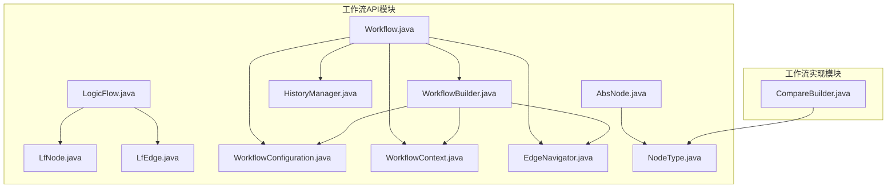
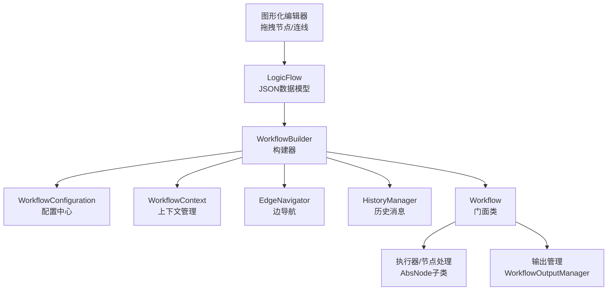
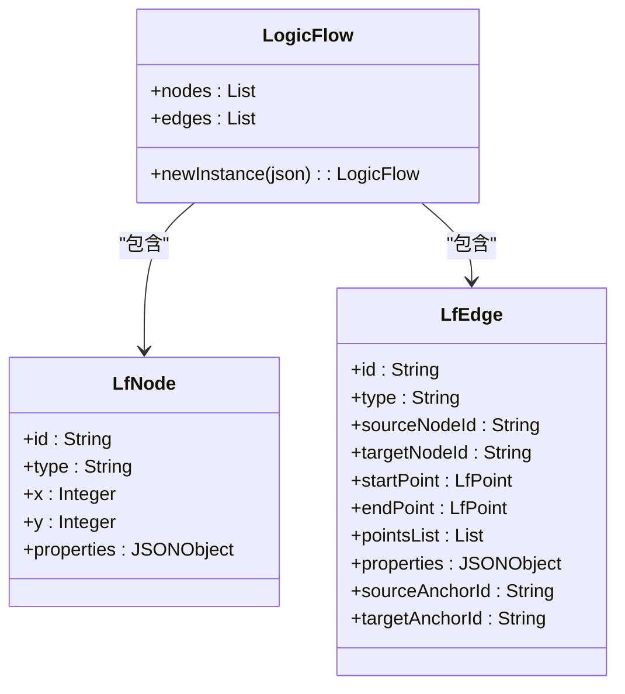
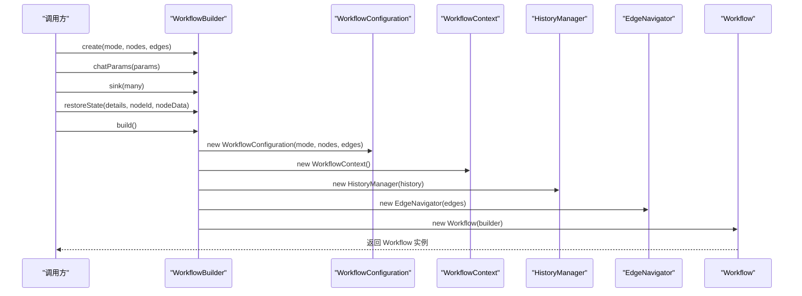
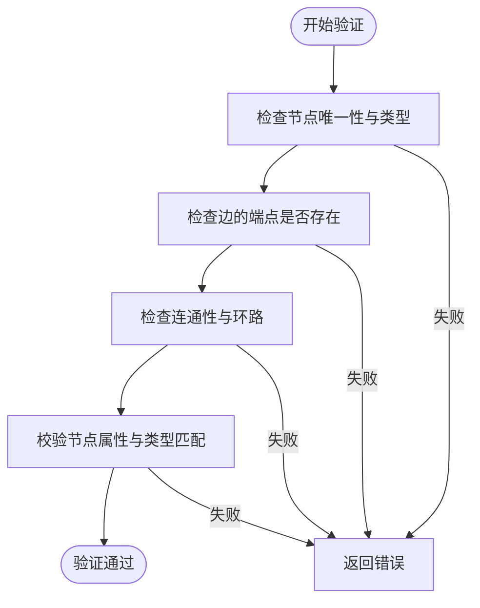
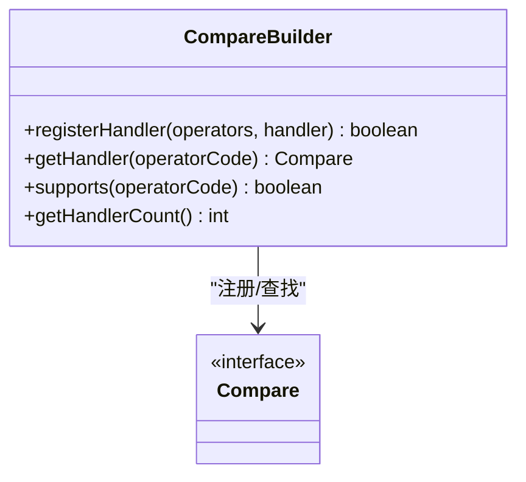
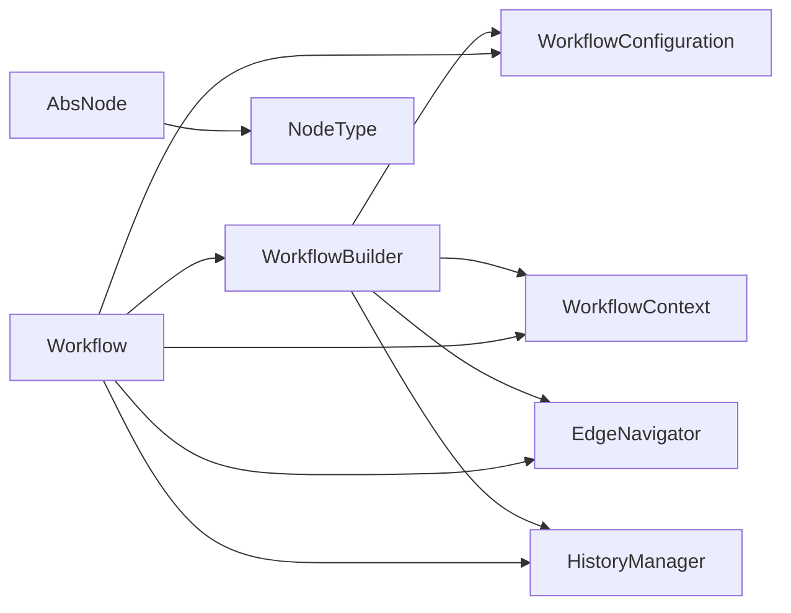

# 工作流设计器

<cite>
**本文档引用的文件**
- [LogicFlow.java](file://maxkb4j-service-api/maxkb4j-workflow-api/src/main/java/com/maxkb4j/workflow/logic/LogicFlow.java)
- [LfNode.java](file://maxkb4j-service-api/maxkb4j-workflow-api/src/main/java/com/maxkb4j/workflow/logic/LfNode.java)
- [LfEdge.java](file://maxkb4j-service-api/maxkb4j-workflow-api/src/main/java/com/maxkb4j/workflow/logic/LfEdge.java)
- [WorkflowBuilder.java](file://maxkb4j-service-api/maxkb4j-workflow-api/src/main/java/com/maxkb4j/workflow/model/WorkflowBuilder.java)
- [Workflow.java](file://maxkb4j-service-api/maxkb4j-workflow-api/src/main/java/com/maxkb4j/workflow/model/Workflow.java)
- [WorkflowConfiguration.java](file://maxkb4j-service-api/maxkb4j-workflow-api/src/main/java/com/maxkb4j/workflow/model/WorkflowConfiguration.java)
- [WorkflowContext.java](file://maxkb4j-service-api/maxkb4j-workflow-api/src/main/java/com/maxkb4j/workflow/model/WorkflowContext.java)
- [EdgeNavigator.java](file://maxkb4j-service-api/maxkb4j-workflow-api/src/main/java/com/maxkb4j/workflow/model/EdgeNavigator.java)
- [HistoryManager.java](file://maxkb4j-service-api/maxkb4j-workflow-api/src/main/java/com/maxkb4j/workflow/model/HistoryManager.java)
- [AbsNode.java](file://maxkb4j-service-api/maxkb4j-workflow-api/src/main/java/com/maxkb4j/workflow/node/AbsNode.java)
- [NodeType.java](file://maxkb4j-service-api/maxkb4j-workflow-api/src/main/java/com/maxkb4j/workflow/enums/NodeType.java)
- [CompareBuilder.java](file://maxkb4j-service/maxkb4j-workflow/src/main/java/com/maxkb4j/workflow/builder/CompareBuilder.java)
</cite>

## 目录
1. [简介](#简介)
2. [项目结构](#项目结构)
3. [核心组件](#核心组件)
4. [架构总览](#架构总览)
5. [详细组件分析](#详细组件分析)
6. [依赖分析](#依赖分析)
7. [性能考虑](#性能考虑)
8. [故障排查指南](#故障排查指南)
9. [结论](#结论)
10. [附录](#附录)

## 简介
本文件面向“工作流设计器”的可视化设计与逻辑构建机制，重点解析以下方面：
- LogicFlow 图形化编辑器的数据模型与序列化/反序列化能力
- 节点与连线的结构定义及连接关系
- WorkflowBuilder 工作流构建器模式与配置管理
- 工作流的拖拽设计、节点配置、连接关系与验证规则
- 使用指南与设计最佳实践

该设计以“数据驱动 + 构建器模式”为核心，将图形化编辑器的 JSON 数据映射为可执行的工作流对象，并通过上下文、导航器、历史管理等模块支撑运行期的执行与渲染。

## 项目结构
工作流相关代码主要分布在两个模块中：
- maxkb4j-service-api/maxkb4j-workflow-api：定义工作流 API、数据模型、逻辑流与执行器接口
- maxkb4j-service/maxkb4j-workflow：提供比较器注册、自动装配与扩展点

下图展示与本文相关的模块与文件关系：

**图表来源**
- [LogicFlow.java:1-31](file://maxkb4j-service-api/maxkb4j-workflow-api/src/main/java/com/maxkb4j/workflow/logic/LogicFlow.java#L1-L31)
- [LfNode.java:1-14](file://maxkb4j-service-api/maxkb4j-workflow-api/src/main/java/com/maxkb4j/workflow/logic/LfNode.java#L1-L14)
- [LfEdge.java:1-23](file://maxkb4j-service-api/maxkb4j-workflow-api/src/main/java/com/maxkb4j/workflow/logic/LfEdge.java#L1-L23)
- [Workflow.java:1-263](file://maxkb4j-service-api/maxkb4j-workflow-api/src/main/java/com/maxkb4j/workflow/model/Workflow.java#L1-L263)
- [WorkflowBuilder.java:1-140](file://maxkb4j-service-api/maxkb4j-workflow-api/src/main/java/com/maxkb4j/workflow/model/WorkflowBuilder.java#L1-L140)
- [WorkflowConfiguration.java:1-95](file://maxkb4j-service-api/maxkb4j-workflow-api/src/main/java/com/maxkb4j/workflow/model/WorkflowConfiguration.java#L1-L95)
- [WorkflowContext.java:1-82](file://maxkb4j-service-api/maxkb4j-workflow-api/src/main/java/com/maxkb4j/workflow/model/WorkflowContext.java#L1-L82)
- [EdgeNavigator.java:1-72](file://maxkb4j-service-api/maxkb4j-workflow-api/src/main/java/com/maxkb4j/workflow/model/EdgeNavigator.java#L1-L72)
- [HistoryManager.java:1-103](file://maxkb4j-service-api/maxkb4j-workflow-api/src/main/java/com/maxkb4j/workflow/model/HistoryManager.java#L1-L103)
- [AbsNode.java:1-132](file://maxkb4j-service-api/maxkb4j-workflow-api/src/main/java/com/maxkb4j/workflow/node/AbsNode.java#L1-L132)
- [NodeType.java:1-117](file://maxkb4j-service-api/maxkb4j-workflow-api/src/main/java/com/maxkb4j/workflow/enums/NodeType.java#L1-L117)
- [CompareBuilder.java:1-86](file://maxkb4j-service/maxkb4j-workflow/src/main/java/com/maxkb4j/workflow/builder/CompareBuilder.java#L1-L86)

**章节来源**
- [LogicFlow.java:1-31](file://maxkb4j-service-api/maxkb4j-workflow-api/src/main/java/com/maxkb4j/workflow/logic/LogicFlow.java#L1-L31)
- [WorkflowBuilder.java:1-140](file://maxkb4j-service-api/maxkb4j-workflow-api/src/main/java/com/maxkb4j/workflow/model/WorkflowBuilder.java#L1-L140)

## 核心组件
- LogicFlow：承载节点与边集合的轻量级数据容器，支持从 JSON 反序列化为对象，便于前后端交互与持久化。
- LfNode / LfEdge：图形化节点与连线的最小单元，包含位置信息、锚点、属性等，用于描述拖拽布局与连接关系。
- WorkflowBuilder：构建器模式实现，负责组装 Workflow 的配置、上下文、历史与导航器等组件，提供链式配置与状态恢复能力。
- Workflow：工作流门面类，对外暴露便捷方法与分层访问器，屏蔽内部组件复杂度。
- WorkflowConfiguration：不可变配置中心，维护节点/边映射、工作流模式与聊天参数等。
- WorkflowContext：上下文管理器，提供全局、聊天、节点与循环上下文，以及模板渲染与变量解析能力。
- EdgeNavigator：基于边集合的导航器，提供上下游节点查询能力。
- HistoryManager：历史消息管理，支持按节点或全局维度获取历史消息，过滤特定标记的消息。
- AbsNode：节点抽象基类，统一节点生命周期、运行时 ID 生成、答案与消息转换等行为。
- NodeType：节点类型枚举，提供 O(1) 查找与键值映射。
- CompareBuilder：比较器处理器注册器，支持按运算符注册与查找比较器，便于条件节点的判断逻辑扩展。

**章节来源**
- [Workflow.java:1-263](file://maxkb4j-service-api/maxkb4j-workflow-api/src/main/java/com/maxkb4j/workflow/model/Workflow.java#L1-L263)
- [WorkflowConfiguration.java:1-95](file://maxkb4j-service-api/maxkb4j-workflow-api/src/main/java/com/maxkb4j/workflow/model/WorkflowConfiguration.java#L1-L95)
- [WorkflowContext.java:1-82](file://maxkb4j-service-api/maxkb4j-workflow-api/src/main/java/com/maxkb4j/workflow/model/WorkflowContext.java#L1-L82)
- [EdgeNavigator.java:1-72](file://maxkb4j-service-api/maxkb4j-workflow-api/src/main/java/com/maxkb4j/workflow/model/EdgeNavigator.java#L1-L72)
- [HistoryManager.java:1-103](file://maxkb4j-service-api/maxkb4j-workflow-api/src/main/java/com/maxkb4j/workflow/model/HistoryManager.java#L1-L103)
- [AbsNode.java:1-132](file://maxkb4j-service-api/maxkb4j-workflow-api/src/main/java/com/maxkb4j/workflow/node/AbsNode.java#L1-L132)
- [NodeType.java:1-117](file://maxkb4j-service-api/maxkb4j-workflow-api/src/main/java/com/maxkb4j/workflow/enums/NodeType.java#L1-L117)
- [CompareBuilder.java:1-86](file://maxkb4j-service/maxkb4j-workflow/src/main/java/com/maxkb4j/workflow/builder/CompareBuilder.java#L1-L86)

## 架构总览
下图展示了工作流设计器从“图形化编辑器”到“可执行工作流”的整体流转：

**图表来源**
- [LogicFlow.java:1-31](file://maxkb4j-service-api/maxkb4j-workflow-api/src/main/java/com/maxkb4j/workflow/logic/LogicFlow.java#L1-L31)
- [WorkflowBuilder.java:1-140](file://maxkb4j-service-api/maxkb4j-workflow-api/src/main/java/com/maxkb4j/workflow/model/WorkflowBuilder.java#L1-L140)
- [Workflow.java:1-263](file://maxkb4j-service-api/maxkb4j-workflow-api/src/main/java/com/maxkb4j/workflow/model/Workflow.java#L1-L263)
- [WorkflowConfiguration.java:1-95](file://maxkb4j-service-api/maxkb4j-workflow-api/src/main/java/com/maxkb4j/workflow/model/WorkflowConfiguration.java#L1-L95)
- [WorkflowContext.java:1-82](file://maxkb4j-service-api/maxkb4j-workflow-api/src/main/java/com/maxkb4j/workflow/model/WorkflowContext.java#L1-L82)
- [EdgeNavigator.java:1-72](file://maxkb4j-service-api/maxkb4j-workflow-api/src/main/java/com/maxkb4j/workflow/model/EdgeNavigator.java#L1-L72)
- [HistoryManager.java:1-103](file://maxkb4j-service-api/maxkb4j-workflow-api/src/main/java/com/maxkb4j/workflow/model/HistoryManager.java#L1-L103)
- [AbsNode.java:1-132](file://maxkb4j-service-api/maxkb4j-workflow-api/src/main/java/com/maxkb4j/workflow/node/AbsNode.java#L1-L132)

## 详细组件分析

### LogicFlow 与图形化编辑器数据模型
- 职责：封装节点与边集合，提供从 JSON 反序列化的静态工厂方法，便于前后端传输与持久化。
- 关键点：
  - 节点与边集合的类型安全封装
  - 通过 FastJSON 的 TypeReference 完成复杂泛型对象的反序列化
- 适用场景：拖拽设计完成后，将画布上的节点/连线序列化为 JSON；运行前再反序列化为对象进行执行。

**图表来源**
- [LogicFlow.java:1-31](file://maxkb4j-service-api/maxkb4j-workflow-api/src/main/java/com/maxkb4j/workflow/logic/LogicFlow.java#L1-L31)
- [LfNode.java:1-14](file://maxkb4j-service-api/maxkb4j-workflow-api/src/main/java/com/maxkb4j/workflow/logic/LfNode.java#L1-L14)
- [LfEdge.java:1-23](file://maxkb4j-service-api/maxkb4j-workflow-api/src/main/java/com/maxkb4j/workflow/logic/LfEdge.java#L1-L23)

**章节来源**
- [LogicFlow.java:1-31](file://maxkb4j-service-api/maxkb4j-workflow-api/src/main/java/com/maxkb4j/workflow/logic/LogicFlow.java#L1-L31)
- [LfNode.java:1-14](file://maxkb4j-service-api/maxkb4j-workflow-api/src/main/java/com/maxkb4j/workflow/logic/LfNode.java#L1-L14)
- [LfEdge.java:1-23](file://maxkb4j-service-api/maxkb4j-workflow-api/src/main/java/com/maxkb4j/workflow/logic/LfEdge.java#L1-L23)

### WorkflowBuilder 构建器模式与配置管理
- 职责：分离复杂初始化逻辑，提供清晰的构建流程；集中管理配置、上下文、历史与导航器的创建顺序。
- 关键点：
  - 必需参数：工作流模式、节点列表、边列表
  - 可选参数：聊天参数、响应式输出 Sink、恢复状态（详情、当前节点ID、节点数据）
  - 构建顺序：配置 → 上下文 → 历史 → 导航器 → 工作流
  - 状态恢复：根据聊天参数中的运行时节点与节点数据恢复执行状态
- 使用建议：优先使用链式配置，避免分散初始化；在恢复执行场景，确保 details、currentNodeId、nodeData 同步传入。

**图表来源**
- [WorkflowBuilder.java:1-140](file://maxkb4j-service-api/maxkb4j-workflow-api/src/main/java/com/maxkb4j/workflow/model/WorkflowBuilder.java#L1-L140)
- [Workflow.java:1-263](file://maxkb4j-service-api/maxkb4j-workflow-api/src/main/java/com/maxkb4j/workflow/model/Workflow.java#L1-L263)

**章节来源**
- [WorkflowBuilder.java:1-140](file://maxkb4j-service-api/maxkb4j-workflow-api/src/main/java/com/maxkb4j/workflow/model/WorkflowBuilder.java#L1-L140)
- [Workflow.java:1-263](file://maxkb4j-service-api/maxkb4j-workflow-api/src/main/java/com/maxkb4j/workflow/model/Workflow.java#L1-L263)

### 节点与连接关系：拖拽设计与验证
- 节点设计：
  - LfNode：包含 id、type、坐标(x,y)与 properties，用于图形化定位与属性存储
  - AbsNode：节点抽象基类，统一运行时 ID 生成、上下文与详情、状态与错误信息、答案与消息转换
- 连接关系：
  - LfEdge：包含 sourceNodeId/targetNodeId、锚点与折线点集，用于连线绘制与拓扑遍历
  - EdgeNavigator：基于边集合提供下游边与上游节点 ID 查询，支撑执行路径推导
- 验证规则建议：
  - 节点唯一性：id 唯一，type 合法（参考 NodeType）
  - 连线完整性：sourceNodeId/targetNodeId 必须对应存在的节点
  - 连通性：起始节点应存在且无环（结合拓扑排序或 DFS 检测）
  - 属性一致性：properties 中的字段与节点类型匹配（如条件节点需要比较器）

**图表来源**
- [LfNode.java:1-14](file://maxkb4j-service-api/maxkb4j-workflow-api/src/main/java/com/maxkb4j/workflow/logic/LfNode.java#L1-L14)
- [LfEdge.java:1-23](file://maxkb4j-service-api/maxkb4j-workflow-api/src/main/java/com/maxkb4j/workflow/logic/LfEdge.java#L1-L23)
- [EdgeNavigator.java:1-72](file://maxkb4j-service-api/maxkb4j-workflow-api/src/main/java/com/maxkb4j/workflow/model/EdgeNavigator.java#L1-L72)
- [NodeType.java:1-117](file://maxkb4j-service-api/maxkb4j-workflow-api/src/main/java/com/maxkb4j/workflow/enums/NodeType.java#L1-L117)

**章节来源**
- [AbsNode.java:1-132](file://maxkb4j-service-api/maxkb4j-workflow-api/src/main/java/com/maxkb4j/workflow/node/AbsNode.java#L1-L132)
- [EdgeNavigator.java:1-72](file://maxkb4j-service-api/maxkb4j-workflow-api/src/main/java/com/maxkb4j/workflow/model/EdgeNavigator.java#L1-L72)
- [NodeType.java:1-117](file://maxkb4j-service-api/maxkb4j-workflow-api/src/main/java/com/maxkb4j/workflow/enums/NodeType.java#L1-L117)

### 比较器注册与条件节点逻辑
- CompareBuilder：提供比较器处理器的注册与查找能力，支持按运算符数组批量注册，便于条件节点的判断逻辑扩展。
- 使用建议：
  - 在系统启动阶段注册常用比较器
  - 通过运算符码（code）进行查找，避免硬编码分支
  - 对于自定义比较器，确保运算符码唯一且语义明确

**图表来源**
- [CompareBuilder.java:1-86](file://maxkb4j-service/maxkb4j-workflow/src/main/java/com/maxkb4j/workflow/builder/CompareBuilder.java#L1-L86)

**章节来源**
- [CompareBuilder.java:1-86](file://maxkb4j-service/maxkb4j-workflow/src/main/java/com/maxkb4j/workflow/builder/CompareBuilder.java#L1-L86)

## 依赖分析
- 组件内聚与耦合：
  - WorkflowBuilder 与 WorkflowConfiguration/WorkflowContext/EdgeNavigator/HistoryManager 之间为组合关系，职责清晰、低耦合
  - AbsNode 与 NodeType 强关联，保证节点类型的一致性与可扩展性
  - LogicFlow 与 LfNode/LfEdge 为数据容器关系，无业务逻辑耦合
- 外部依赖：
  - FastJSON 用于 JSON 序列化/反序列化
  - LangChain4j 的 ChatMessage 类型用于历史消息表示
- 循环依赖：
  - 未发现直接循环依赖；各模块边界清晰

**图表来源**
- [WorkflowBuilder.java:1-140](file://maxkb4j-service-api/maxkb4j-workflow-api/src/main/java/com/maxkb4j/workflow/model/WorkflowBuilder.java#L1-L140)
- [Workflow.java:1-263](file://maxkb4j-service-api/maxkb4j-workflow-api/src/main/java/com/maxkb4j/workflow/model/Workflow.java#L1-L263)
- [AbsNode.java:1-132](file://maxkb4j-service-api/maxkb4j-workflow-api/src/main/java/com/maxkb4j/workflow/node/AbsNode.java#L1-L132)
- [NodeType.java:1-117](file://maxkb4j-service-api/maxkb4j-workflow-api/src/main/java/com/maxkb4j/workflow/enums/NodeType.java#L1-L117)

**章节来源**
- [WorkflowBuilder.java:1-140](file://maxkb4j-service-api/maxkb4j-workflow-api/src/main/java/com/maxkb4j/workflow/model/WorkflowBuilder.java#L1-L140)
- [Workflow.java:1-263](file://maxkb4j-service-api/maxkb4j-workflow-api/src/main/java/com/maxkb4j/workflow/model/Workflow.java#L1-L263)
- [AbsNode.java:1-132](file://maxkb4j-service-api/maxkb4j-workflow-api/src/main/java/com/maxkb4j/workflow/node/AbsNode.java#L1-L132)
- [NodeType.java:1-117](file://maxkb4j-service-api/maxkb4j-workflow-api/src/main/java/com/maxkb4j/workflow/enums/NodeType.java#L1-L117)

## 性能考虑
- 数据结构选择：
  - WorkflowConfiguration 使用不可变列表与节点映射，查找为 O(1)，适合高频读取
  - EdgeNavigator 基于边集合的流式筛选，复杂度与边数量线性相关
- 并发与线程安全：
  - WorkflowContext 的节点上下文采用 CopyOnWriteArrayList，适合读多写少场景
- 序列化/反序列化：
  - LogicFlow 使用 FastJSON 的 TypeReference，减少反射开销；建议在高并发场景复用对象池
- 执行路径：
  - EdgeNavigator 的下游/上游查询为一次遍历，建议在构建阶段缓存必要索引以降低运行时成本

[本节为通用指导，无需列出具体文件来源]

## 故障排查指南
- 节点/连线缺失或重复：
  - 症状：运行时报找不到节点或重复注册
  - 排查：确认 LogicFlow 的 nodes/edges 是否完整；检查 AbsNode 的 id 与 LfNode 的 id 一致
- 连接关系异常：
  - 症状：无法推进到下一个节点或死循环
  - 排查：使用 EdgeNavigator 的 findDownstreamEdges/findUpstreamNodeIds 校验边的端点是否正确
- 条件判断不生效：
  - 症状：条件节点始终走同一分支
  - 排查：确认 CompareBuilder 的运算符码与节点属性一致；检查比较器注册是否成功
- 历史消息不显示：
  - 症状：渲染模板或历史消息为空
  - 排查：检查 HistoryManager 的过滤规则与输入数据格式；确认 DialogueType 与 runtimeNodeId 参数

**章节来源**
- [EdgeNavigator.java:1-72](file://maxkb4j-service-api/maxkb4j-workflow-api/src/main/java/com/maxkb4j/workflow/model/EdgeNavigator.java#L1-L72)
- [HistoryManager.java:1-103](file://maxkb4j-service-api/maxkb4j-workflow-api/src/main/java/com/maxkb4j/workflow/model/HistoryManager.java#L1-L103)
- [CompareBuilder.java:1-86](file://maxkb4j-service/maxkb4j-workflow/src/main/java/com/maxkb4j/workflow/builder/CompareBuilder.java#L1-L86)

## 结论
工作流设计器以 LogicFlow 作为图形化编辑器的数据载体，结合 WorkflowBuilder 的构建器模式与多组件协作，实现了从“可视化设计”到“可执行工作流”的完整闭环。通过节点类型枚举、边导航与历史管理等模块，系统在保持扩展性的同时，提供了良好的可维护性与可测试性。建议在实际使用中遵循本文的验证规则与最佳实践，确保工作流的稳定性与可演进性。

[本节为总结性内容，无需列出具体文件来源]

## 附录

### 使用指南与最佳实践
- 设计阶段
  - 明确节点类型与用途，优先使用 NodeType 中的标准类型
  - 使用 LfNode 的坐标与 LfEdge 的锚点信息，保证连线清晰、布局合理
  - 为每个节点配置必要的 properties，便于运行期读取
- 构建阶段
  - 使用 WorkflowBuilder 的链式配置，集中管理可选参数
  - 在恢复执行场景，同步传入 details、currentNodeId、nodeData
- 执行阶段
  - 利用 EdgeNavigator 推导执行路径，避免硬编码分支
  - 通过 WorkflowContext 的模板渲染与变量解析，统一处理动态内容
- 扩展阶段
  - 通过 CompareBuilder 注册自定义比较器，满足复杂条件判断需求
  - 新增节点类型时，遵循 AbsNode 的生命周期与消息转换规范

[本节为通用指导，无需列出具体文件来源]