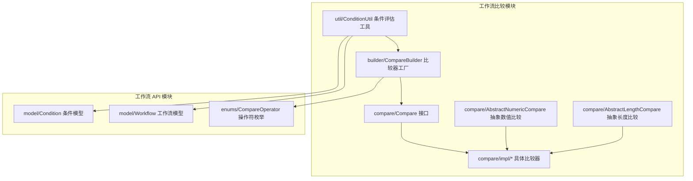
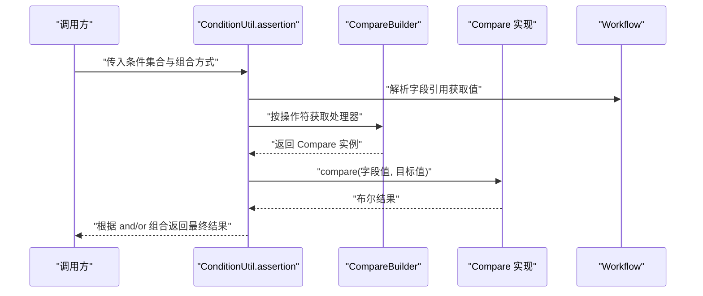
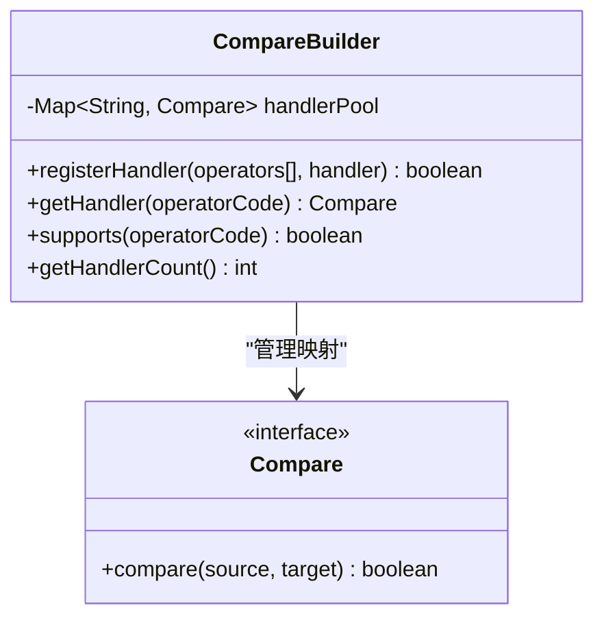
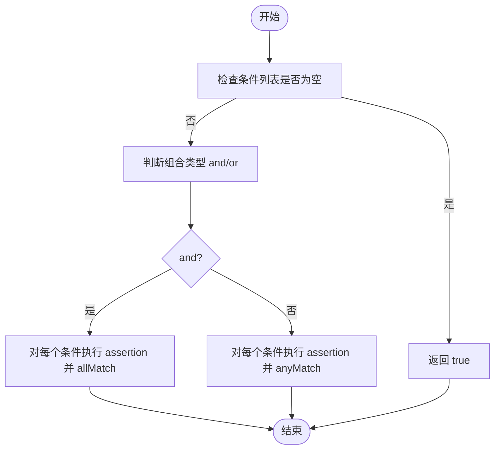
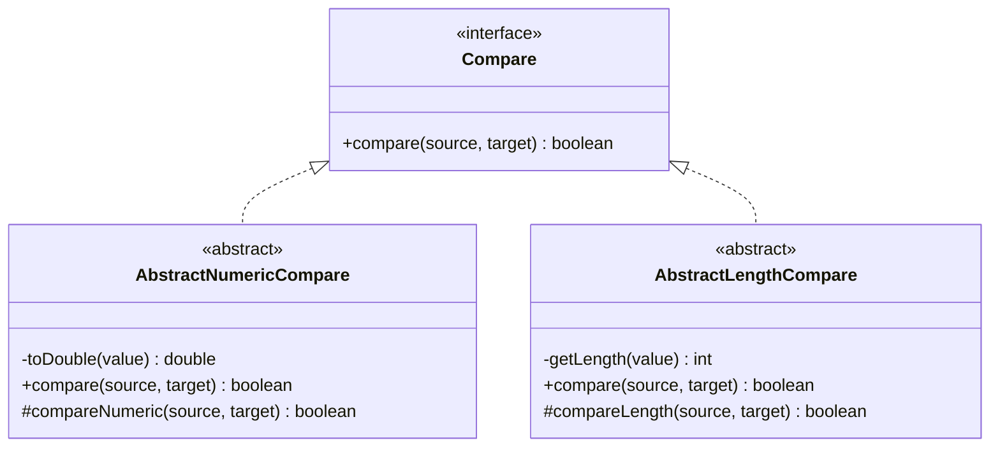
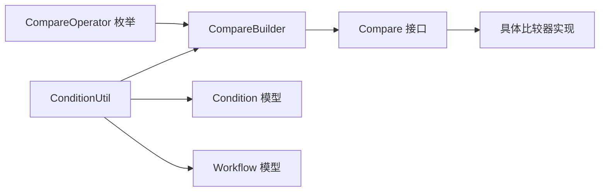

# 条件比较系统

<cite>
**本文引用的文件**
- [Compare.java](file://maxkb4j-service/maxkb4j-workflow/src/main/java/com/maxkb4j/workflow/compare/Compare.java)
- [AbstractNumericCompare.java](file://maxkb4j-service/maxkb4j-workflow/src/main/java/com/maxkb4j/workflow/compare/AbstractNumericCompare.java)
- [AbstractLengthCompare.java](file://maxkb4j-service/maxkb4j-workflow/src/main/java/com/maxkb4j/workflow/compare/AbstractLengthCompare.java)
- [EqualCompare.java](file://maxkb4j-service/maxkb4j-workflow/src/main/java/com/maxkb4j/workflow/compare/impl/EqualCompare.java)
- [NotEqualCompare.java](file://maxkb4j-service/maxkb4j-workflow/src/main/java/com/maxkb4j/workflow/compare/impl/NotEqualCompare.java)
- [GTCompare.java](file://maxkb4j-service/maxkb4j-workflow/src/main/java/com/maxkb4j/workflow/compare/impl/GTCompare.java)
- [GECompare.java](file://maxkb4j-service/maxkb4j-workflow/src/main/java/com/maxkb4j/workflow/compare/impl/GECompare.java)
- [LTCompare.java](file://maxkb4j-service/maxkb4j-workflow/src/main/java/com/maxkb4j/workflow/compare/impl/LTCompare.java)
- [LECompare.java](file://maxkb4j-service/maxkb4j-workflow/src/main/java/com/maxkb4j/workflow/compare/impl/LECompare.java)
- [ContainCompare.java](file://maxkb4j-service/maxkb4j-workflow/src/main/java/com/maxkb4j/workflow/compare/impl/ContainCompare.java)
- [NotContainCompare.java](file://maxkb4j-service/maxkb4j-workflow/src/main/java/com/maxkb4j/workflow/compare/impl/NotContainCompare.java)
- [LengthEqualCompare.java](file://maxkb4j-service/maxkb4j-workflow/src/main/java/com/maxkb4j/workflow/compare/impl/LengthEqualCompare.java)
- [LengthGTCompare.java](file://maxkb4j-service/maxkb4j-workflow/src/main/java/com/maxkb4j/workflow/compare/impl/LengthGTCompare.java)
- [LengthGECompare.java](file://maxkb4j-service/maxkb4j-workflow/src/main/java/com/maxkb4j/workflow/compare/impl/LengthGECompare.java)
- [LengthLTCompare.java](file://maxkb4j-service/maxkb4j-workflow/src/main/java/com/maxkb4j/workflow/compare/impl/LengthLTCompare.java)
- [LengthLECompare.java](file://maxkb4j-service/maxkb4j-workflow/src/main/java/com/maxkb4j/workflow/compare/impl/LengthLECompare.java)
- [IsNotNullCompare.java](file://maxkb4j-service/maxkb4j-workflow/src/main/java/com/maxkb4j/workflow/compare/impl/IsNotNullCompare.java)
- [IsNullCompare.java](file://maxkb4j-service/maxkb4j-workflow/src/main/java/com/maxkb4j/workflow/compare/impl/IsNullCompare.java)
- [IsTrueCompare.java](file://maxkb4j-service/maxkb4j-workflow/src/main/java/com/maxkb4j/workflow/compare/impl/IsTrueCompare.java)
- [IsNotTrueCompare.java](file://maxkb4j-service/maxkb4j-workflow/src/main/java/com/maxkb4j/workflow/compare/impl/IsNotTrueCompare.java)
- [CompareBuilder.java](file://maxkb4j-service/maxkb4j-workflow/src/main/java/com/maxkb4j/workflow/builder/CompareBuilder.java)
- [ConditionUtil.java](file://maxkb4j-service/maxkb4j-workflow/src/main/java/com/maxkb4j/workflow/util/ConditionUtil.java)
- [CompareOperator.java](file://maxkb4j-service/maxkb4j-workflow-api/src/main/java/com/maxkb4j/workflow/enums/CompareOperator.java)
- [Condition.java](file://maxkb4j-service/maxkb4j-workflow-api/src/main/java/com/maxkb4j/workflow/model/Condition.java)
- [Workflow.java](file://maxkb4j-service/maxkb4j-workflow-api/src/main/java/com/maxkb4j/workflow/model/Workflow.java)
</cite>

## 目录
1. [简介](#简介)
2. [项目结构](#项目结构)
3. [核心组件](#核心组件)
4. [架构总览](#架构总览)
5. [详细组件分析](#详细组件分析)
6. [依赖关系分析](#依赖关系分析)
7. [性能考虑](#性能考虑)
8. [故障排查指南](#故障排查指南)
9. [结论](#结论)
10. [附录：使用示例与最佳实践](#附录使用示例与最佳实践)

## 简介
本文件系统性阐述工作流条件比较系统的实现架构与比较算法，重点覆盖以下方面：
- Compare 接口的比较策略与扩展机制
- 数值比较器（如 GreaterCompare、LessCompare、EqualCompare 等）与字符串/长度比较器的实现要点
- CompareBuilder 的比较表达式构建与解析机制
- ConditionUtil 对条件组合逻辑的评估流程
- 使用示例与性能优化建议

该系统通过统一的 Compare 接口抽象比较操作，并以 CompareBuilder 提供注册与查找能力；ConditionUtil 负责在工作流上下文中对条件进行求值。

## 项目结构
工作流条件比较系统位于模块 maxkb4j-service/maxkb4j-workflow 中，核心代码组织如下：
- compare：比较器接口与抽象基类，以及具体比较器实现
- builder：比较处理器工厂（CompareBuilder）
- util：条件评估工具（ConditionUtil）
- workflow-api：条件模型与枚举（Condition、Workflow、CompareOperator）

图表来源
- [Compare.java:1-19](file://maxkb4j-service/maxkb4j-workflow/src/main/java/com/maxkb4j/workflow/compare/Compare.java#L1-L19)
- [AbstractNumericCompare.java:1-53](file://maxkb4j-service/maxkb4j-workflow/src/main/java/com/maxkb4j/workflow/compare/AbstractNumericCompare.java#L1-L53)
- [AbstractLengthCompare.java:1-51](file://maxkb4j-service/maxkb4j-workflow/src/main/java/com/maxkb4j/workflow/compare/AbstractLengthCompare.java#L1-L51)
- [CompareBuilder.java:1-86](file://maxkb4j-service/maxkb4j-workflow/src/main/java/com/maxkb4j/workflow/builder/CompareBuilder.java#L1-L86)
- [ConditionUtil.java:1-60](file://maxkb4j-service/maxkb4j-workflow/src/main/java/com/maxkb4j/workflow/util/ConditionUtil.java#L1-L60)
- [Condition.java](file://maxkb4j-service/maxkb4j-workflow-api/src/main/java/com/maxkb4j/workflow/model/Condition.java)
- [Workflow.java](file://maxkb4j-service/maxkb4j-workflow-api/src/main/java/com/maxkb4j/workflow/model/Workflow.java)
- [CompareOperator.java](file://maxkb4j-service/maxkb4j-workflow-api/src/main/java/com/maxkb4j/workflow/enums/CompareOperator.java)

章节来源
- [Compare.java:1-19](file://maxkb4j-service/maxkb4j-workflow/src/main/java/com/maxkb4j/workflow/compare/Compare.java#L1-L19)
- [CompareBuilder.java:1-86](file://maxkb4j-service/maxkb4j-workflow/src/main/java/com/maxkb4j/workflow/builder/CompareBuilder.java#L1-L86)
- [ConditionUtil.java:1-60](file://maxkb4j-service/maxkb4j-workflow/src/main/java/com/maxkb4j/workflow/util/ConditionUtil.java#L1-L60)

## 核心组件
- Compare 接口：定义统一的比较入口 compare(source, target)，返回布尔结果。所有比较器实现需标注支持的操作符并通过自动注册机制接入系统。
- CompareBuilder：比较器工厂，负责将操作符与具体 Compare 实现进行映射注册与查找，提供 supports/getHandler/registerHandler 等能力。
- ConditionUtil：在工作流上下文下评估条件集合，支持“与/或”组合逻辑，调用 CompareBuilder 获取处理器并执行 compare。
- 抽象比较器：
  - AbstractNumericCompare：封装数值比较通用逻辑（空值处理、类型转换为 double、调用子类 compareNumeric）。
  - AbstractLengthCompare：封装长度比较通用逻辑（空值处理、从字符串/列表获取长度、调用子类 compareLength）。

章节来源
- [Compare.java:8-18](file://maxkb4j-service/maxkb4j-workflow/src/main/java/com/maxkb4j/workflow/compare/Compare.java#L8-L18)
- [CompareBuilder.java:20-86](file://maxkb4j-service/maxkb4j-workflow/src/main/java/com/maxkb4j/workflow/builder/CompareBuilder.java#L20-L86)
- [ConditionUtil.java:16-60](file://maxkb4j-service/maxkb4j-workflow/src/main/java/com/maxkb4j/workflow/util/ConditionUtil.java#L16-L60)
- [AbstractNumericCompare.java:12-53](file://maxkb4j-service/maxkb4j-workflow/src/main/java/com/maxkb4j/workflow/compare/AbstractNumericCompare.java#L12-L53)
- [AbstractLengthCompare.java:10-51](file://maxkb4j-service/maxkb4j-workflow/src/main/java/com/maxkb4j/workflow/compare/AbstractLengthCompare.java#L10-L51)

## 架构总览
系统采用“接口抽象 + 工厂注册 + 上下文求值”的分层设计：
- 接口层：Compare 定义比较契约
- 抽象层：AbstractNumericCompare、AbstractLengthCompare 复用通用转换与错误处理
- 实现层：EqualCompare、GTCompare、ContainCompare 等具体比较器
- 工厂层：CompareBuilder 维护操作符到处理器的映射
- 评估层：ConditionUtil 在 Workflow 上下文中解析字段引用并执行比较

图表来源
- [ConditionUtil.java:31-59](file://maxkb4j-service/maxkb4j-workflow/src/main/java/com/maxkb4j/workflow/util/ConditionUtil.java#L31-L59)
- [CompareBuilder.java:58-66](file://maxkb4j-service/maxkb4j-workflow/src/main/java/com/maxkb4j/workflow/builder/CompareBuilder.java#L58-L66)
- [Compare.java:10-17](file://maxkb4j-service/maxkb4j-workflow/src/main/java/com/maxkb4j/workflow/compare/Compare.java#L10-L17)

## 详细组件分析

### Compare 接口与比较策略
- 设计目标：统一比较行为，便于扩展与注册
- 策略要点：
  - 输入参数为 Object 类型，便于适配不同数据源
  - 返回布尔值，表示比较结果
  - 由 CompareBuilder 注册与查找，避免硬编码分支

章节来源
- [Compare.java:8-18](file://maxkb4j-service/maxkb4j-workflow/src/main/java/com/maxkb4j/workflow/compare/Compare.java#L8-L18)

### CompareBuilder：比较表达式构建与解析
- 注册机制：
  - 支持批量注册多个操作符到同一处理器
  - 若重复注册相同操作符，记录替换日志
- 查找机制：
  - 通过操作符代码获取处理器，不存在时抛出异常
  - supports 方法用于快速判断是否支持某操作符
- 并发安全：
  - 使用线程安全的并发映射存储处理器

图表来源
- [CompareBuilder.java:20-86](file://maxkb4j-service/maxkb4j-workflow/src/main/java/com/maxkb4j/workflow/builder/CompareBuilder.java#L20-L86)
- [Compare.java:8-18](file://maxkb4j-service/maxkb4j-workflow/src/main/java/com/maxkb4j/workflow/compare/Compare.java#L8-L18)

章节来源
- [CompareBuilder.java:20-86](file://maxkb4j-service/maxkb4j-workflow/src/main/java/com/maxkb4j/workflow/builder/CompareBuilder.java#L20-L86)

### ConditionUtil：条件组合与求值
- 组合逻辑：
  - and：所有条件必须满足
  - or：任一条件满足即可
- 字段解析：
  - 通过 Workflow 的字段引用方法获取实际值
- 错误处理：
  - 未知操作符时返回 false，避免中断流程
- 性能特征：
  - 使用流式 API 简化逻辑，短路求值由 allMatch/anyMatch 提供

图表来源
- [ConditionUtil.java:31-42](file://maxkb4j-service/maxkb4j-workflow/src/main/java/com/maxkb4j/workflow/util/ConditionUtil.java#L31-L42)

章节来源
- [ConditionUtil.java:16-60](file://maxkb4j-service/maxkb4j-workflow/src/main/java/com/maxkb4j/workflow/util/ConditionUtil.java#L16-L60)

### 抽象比较器：数值比较与长度比较
- AbstractNumericCompare：
  - 空值返回 false
  - 将源值转换为 double（支持 Number、集合大小、字符串解析）
  - 目标值解析为 double 后交由子类 compareNumeric 判定
- AbstractLengthCompare：
  - 空值返回 false
  - 源值支持字符串长度与列表大小
  - 目标值解析为整数后交由子类 compareLength 判定

图表来源
- [Compare.java:8-18](file://maxkb4j-service/maxkb4j-workflow/src/main/java/com/maxkb4j/workflow/compare/Compare.java#L8-L18)
- [AbstractNumericCompare.java:12-53](file://maxkb4j-service/maxkb4j-workflow/src/main/java/com/maxkb4j/workflow/compare/AbstractNumericCompare.java#L12-L53)
- [AbstractLengthCompare.java:10-51](file://maxkb4j-service/maxkb4j-workflow/src/main/java/com/maxkb4j/workflow/compare/AbstractLengthCompare.java#L10-L51)

章节来源
- [AbstractNumericCompare.java:12-53](file://maxkb4j-service/maxkb4j-workflow/src/main/java/com/maxkb4j/workflow/compare/AbstractNumericCompare.java#L12-L53)
- [AbstractLengthCompare.java:10-51](file://maxkb4j-service/maxkb4j-workflow/src/main/java/com/maxkb4j/workflow/compare/AbstractLengthCompare.java#L10-L51)

### 具体比较器实现概览
- 数值比较器（基于 AbstractNumericCompare）：
  - GTCompare：大于
  - GECompare：大于等于
  - LTCompare：小于
  - LECompare：小于等于
  - EqualCompare：等于
  - NotEqualCompare：不等于
- 字符串/包含比较器：
  - ContainCompare：包含
  - NotContainCompare：不包含
- 长度比较器（基于 AbstractLengthCompare）：
  - LengthEqualCompare：长度等于
  - LengthGTCompare：长度大于
  - LengthGECompare：长度大于等于
  - LengthLTCompare：长度小于
  - LengthLECompare：长度小于等于
- 布尔/空值比较器：
  - IsNullCompare：为空
  - IsNotNullCompare：非空
  - IsTrueCompare：为真
  - IsNotTrueCompare：为假

章节来源
- [EqualCompare.java](file://maxkb4j-service/maxkb4j-workflow/src/main/java/com/maxkb4j/workflow/compare/impl/EqualCompare.java)
- [NotEqualCompare.java](file://maxkb4j-service/maxkb4j-workflow/src/main/java/com/maxkb4j/workflow/compare/impl/NotEqualCompare.java)
- [GTCompare.java](file://maxkb4j-service/maxkb4j-workflow/src/main/java/com/maxkb4j/workflow/compare/impl/GTCompare.java)
- [GECompare.java](file://maxkb4j-service/maxkb4j-workflow/src/main/java/com/maxkb4j/workflow/compare/impl/GECompare.java)
- [LTCompare.java](file://maxkb4j-service/maxkb4j-workflow/src/main/java/com/maxkb4j/workflow/compare/impl/LTCompare.java)
- [LECompare.java](file://maxkb4j-service/maxkb4j-workflow/src/main/java/com/maxkb4j/workflow/compare/impl/LECompare.java)
- [ContainCompare.java](file://maxkb4j-service/maxkb4j-workflow/src/main/java/com/maxkb4j/workflow/compare/impl/ContainCompare.java)
- [NotContainCompare.java](file://maxkb4j-service/maxkb4j-workflow/src/main/java/com/maxkb4j/workflow/compare/impl/NotContainCompare.java)
- [LengthEqualCompare.java](file://maxkb4j-service/maxkb4j-workflow/src/main/java/com/maxkb4j/workflow/compare/impl/LengthEqualCompare.java)
- [LengthGTCompare.java](file://maxkb4j-service/maxkb4j-workflow/src/main/java/com/maxkb4j/workflow/compare/impl/LengthGTCompare.java)
- [LengthGECompare.java](file://maxkb4j-service/maxkb4j-workflow/src/main/java/com/maxkb4j/workflow/compare/impl/LengthGECompare.java)
- [LengthLTCompare.java](file://maxkb4j-service/maxkb4j-workflow/src/main/java/com/maxkb4j/workflow/compare/impl/LengthLTCompare.java)
- [LengthLECompare.java](file://maxkb4j-service/maxkb4j-workflow/src/main/java/com/maxkb4j/workflow/compare/impl/LengthLECompare.java)
- [IsNullCompare.java](file://maxkb4j-service/maxkb4j-workflow/src/main/java/com/maxkb4j/workflow/compare/impl/IsNullCompare.java)
- [IsNotNullCompare.java](file://maxkb4j-service/maxkb4j-workflow/src/main/java/com/maxkb4j/workflow/compare/impl/IsNotNullCompare.java)
- [IsTrueCompare.java](file://maxkb4j-service/maxkb4j-workflow/src/main/java/com/maxkb4j/workflow/compare/impl/IsTrueCompare.java)
- [IsNotTrueCompare.java](file://maxkb4j-service/maxkb4j-workflow/src/main/java/com/maxkb4j/workflow/compare/impl/IsNotTrueCompare.java)

## 依赖关系分析
- CompareBuilder 依赖 CompareOperator 枚举（来自 workflow-api），用于将操作符代码与处理器绑定
- ConditionUtil 依赖 CompareBuilder、Condition、Workflow，完成字段解析与比较执行
- 具体比较器实现依赖 Compare 接口，部分依赖抽象基类以复用通用逻辑

图表来源
- [CompareOperator.java](file://maxkb4j-service/maxkb4j-workflow-api/src/main/java/com/maxkb4j/workflow/enums/CompareOperator.java)
- [CompareBuilder.java:31-49](file://maxkb4j-service/maxkb4j-workflow/src/main/java/com/maxkb4j/workflow/builder/CompareBuilder.java#L31-L49)
- [ConditionUtil.java:20-54](file://maxkb4j-service/maxkb4j-workflow/src/main/java/com/maxkb4j/workflow/util/ConditionUtil.java#L20-L54)
- [Condition.java](file://maxkb4j-service/maxkb4j-workflow-api/src/main/java/com/maxkb4j/workflow/model/Condition.java)
- [Workflow.java](file://maxkb4j-service/maxkb4j-workflow-api/src/main/java/com/maxkb4j/workflow/model/Workflow.java)

章节来源
- [CompareBuilder.java:31-49](file://maxkb4j-service/maxkb4j-workflow/src/main/java/com/maxkb4j/workflow/builder/CompareBuilder.java#L31-L49)
- [ConditionUtil.java:20-54](file://maxkb4j-service/maxkb4j-workflow/src/main/java/com/maxkb4j/workflow/util/ConditionUtil.java#L20-L54)

## 性能考虑
- 比较器注册与查找
  - 使用并发映射减少锁竞争，适合多线程环境
  - 批量注册时注意避免重复注册相同操作符
- 数值与长度转换
  - 字符串解析失败直接返回 false，避免异常开销
  - 集合/字符串长度计算为 O(1)/O(n) 的常量或线性操作
- 条件求值
  - and/or 使用 allMatch/anyMatch，具备短路特性，优先放置易判错的条件
  - 空条件列表直接返回 true，减少无效计算
- 建议
  - 将高频比较器置于更易命中缓存的位置（如 JVM 层面）
  - 控制条件数量与嵌套深度，避免过长链路导致的上下文解析成本上升

## 故障排查指南
- 问题：未知操作符导致比较失败
  - 现象：ConditionUtil 在获取处理器时抛出异常或返回 false
  - 排查：确认 CompareBuilder 是否已注册对应操作符；核对 CompareOperator 枚举与处理器映射
  - 参考
    - [CompareBuilder.java:58-66](file://maxkb4j-service/maxkb4j-workflow/src/main/java/com/maxkb4j/workflow/builder/CompareBuilder.java#L58-L66)
    - [ConditionUtil.java:52-58](file://maxkb4j-service/maxkb4j-workflow/src/main/java/com/maxkb4j/workflow/util/ConditionUtil.java#L52-L58)
- 问题：数值/长度比较返回 false
  - 现象：输入为空或无法解析为数字/整数
  - 排查：检查源值与目标值类型；确认 AbstractNumericCompare/AbstractLengthCompare 的转换逻辑
  - 参考
    - [AbstractNumericCompare.java:24-35](file://maxkb4j-service/maxkb4j-workflow/src/main/java/com/maxkb4j/workflow/compare/AbstractNumericCompare.java#L24-L35)
    - [AbstractLengthCompare.java:21-33](file://maxkb4j-service/maxkb4j-workflow/src/main/java/com/maxkb4j/workflow/compare/AbstractLengthCompare.java#L21-L33)
- 问题：条件组合不符合预期
  - 现象：and/or 组合结果与期望不符
  - 排查：确认条件列表顺序与组合类型；验证每个条件的字段引用是否正确
  - 参考
    - [ConditionUtil.java:31-42](file://maxkb4j-service/maxkb4j-workflow/src/main/java/com/maxkb4j/workflow/util/ConditionUtil.java#L31-L42)

章节来源
- [CompareBuilder.java:58-66](file://maxkb4j-service/maxkb4j-workflow/src/main/java/com/maxkb4j/workflow/builder/CompareBuilder.java#L58-L66)
- [ConditionUtil.java:31-58](file://maxkb4j-service/maxkb4j-workflow/src/main/java/com/maxkb4j/workflow/util/ConditionUtil.java#L31-L58)
- [AbstractNumericCompare.java:24-35](file://maxkb4j-service/maxkb4j-workflow/src/main/java/com/maxkb4j/workflow/compare/AbstractNumericCompare.java#L24-L35)
- [AbstractLengthCompare.java:21-33](file://maxkb4j-service/maxkb4j-workflow/src/main/java/com/maxkb4j/workflow/compare/AbstractLengthCompare.java#L21-L33)

## 结论
该条件比较系统通过清晰的接口抽象、可扩展的比较器体系与集中化的处理器工厂，实现了工作流中灵活且高性能的条件评估能力。结合短路求值与通用转换逻辑，系统在易用性与稳定性之间取得良好平衡。建议在实际应用中合理组织条件与处理器注册，以获得更优的运行效率与可维护性。

## 附录：使用示例与最佳实践
- 使用示例（步骤说明）
  - 注册比较器：通过 CompareBuilder.registerHandler 将操作符与处理器绑定
  - 构造条件：使用 workflow-api 的 Condition 模型描述字段、操作符与目标值
  - 执行评估：调用 ConditionUtil.assertion，传入 workflow、组合类型与条件列表
  - 参考
    - [CompareBuilder.java:31-49](file://maxkb4j-service/maxkb4j-workflow/src/main/java/com/maxkb4j/workflow/builder/CompareBuilder.java#L31-L49)
    - [ConditionUtil.java:31-42](file://maxkb4j-service/maxkb4j-workflow/src/main/java/com/maxkb4j/workflow/util/ConditionUtil.java#L31-L42)
    - [Condition.java](file://maxkb4j-service/maxkb4j-workflow-api/src/main/java/com/maxkb4j/workflow/model/Condition.java)
    - [Workflow.java](file://maxkb4j-service/maxkb4j-workflow-api/src/main/java/com/maxkb4j/workflow/model/Workflow.java)
- 最佳实践
  - 明确操作符与处理器的对应关系，避免重复注册
  - 将易失败的条件放在 and/or 的短路位置，提升整体性能
  - 对于复杂条件，拆分为多个简单条件并明确组合方式
  - 在大规模场景下，关注字段引用解析的成本，尽量复用已解析值