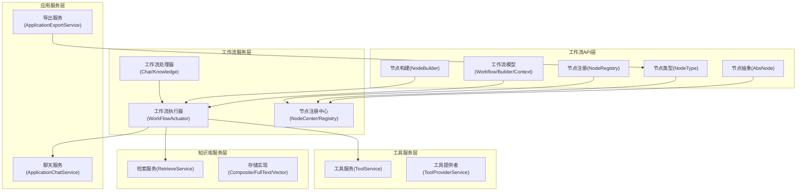
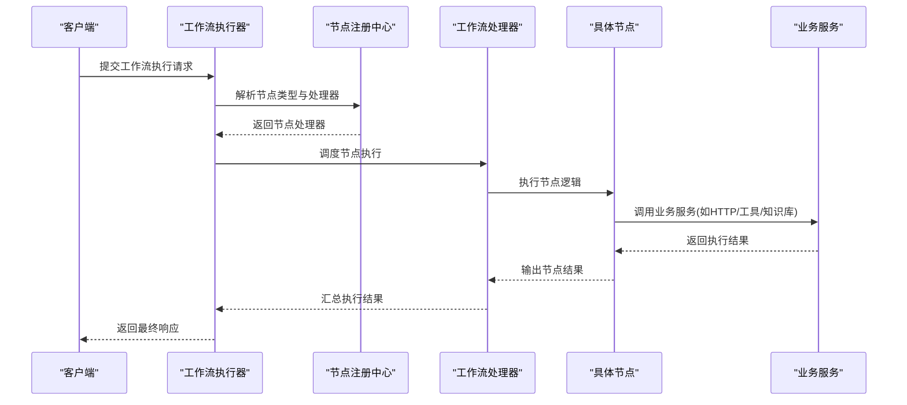
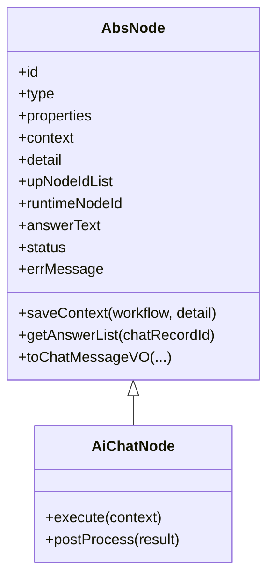
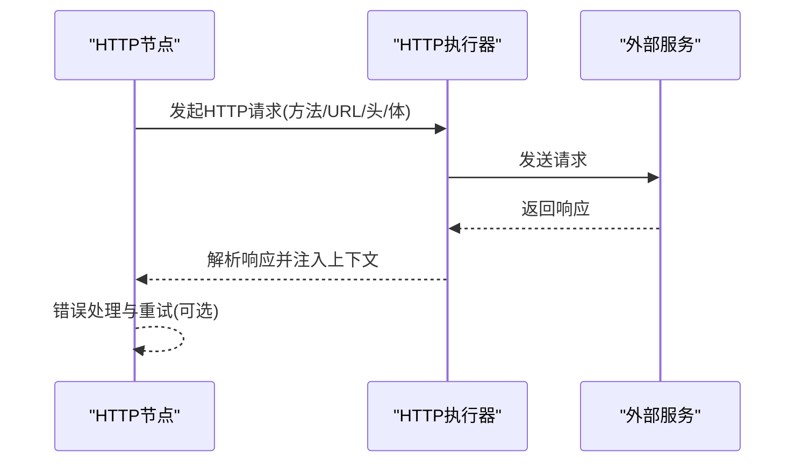
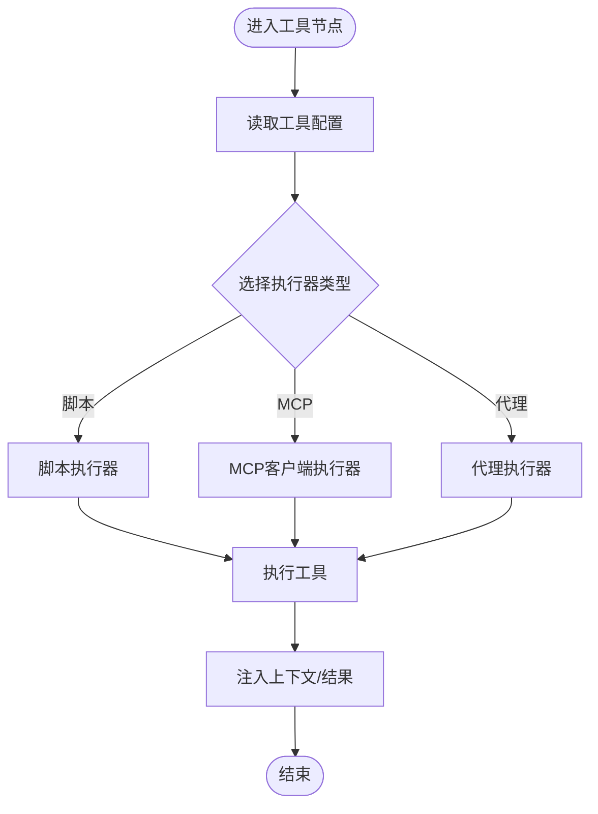
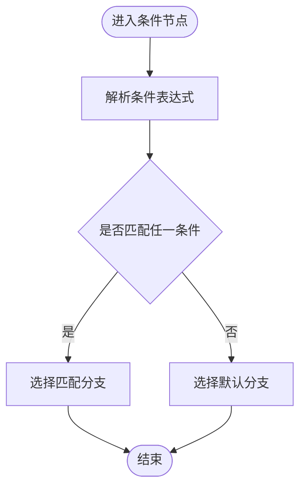
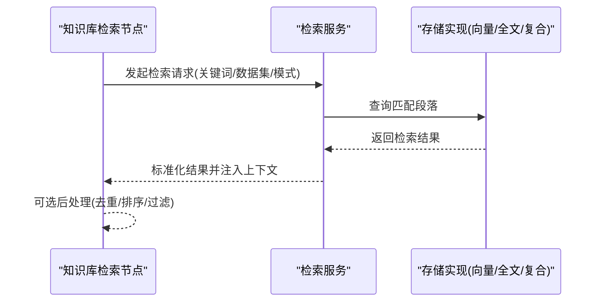
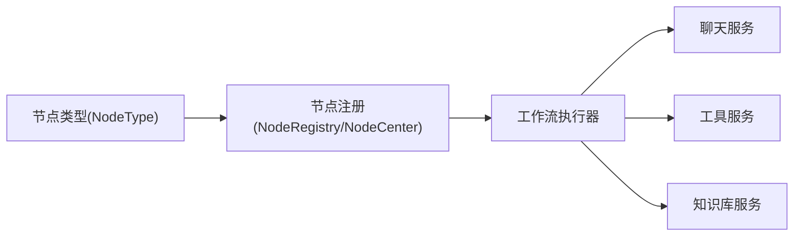

# 节点类型与实现

<cite>
**本文引用的文件**
- [AbsNode.java](file://maxkb4j-service-api/maxkb4j-workflow-api/src/main/java/com/maxkb4j/workflow/node/AbsNode.java)
- [NodeType.java](file://maxkb4j-service-api/maxkb4j-workflow-api/src/main/java/com/maxkb4j/workflow/enums/NodeType.java)
- [ApplicationExportService.java](file://maxkb4j-service/maxkb4j-application/src/main/java/com/maxkb4j/application/service/ApplicationExportService.java)
- [NodeBuilder.java](file://maxkb4j-service-api/maxkb4j-workflow-api/src/main/java/com/maxkb4j/workflow/builder/NodeBuilder.java)
- [NodeRegistry.java](file://maxkb4j-service-api/maxkb4j-workflow-api/src/main/java/com/maxkb4j/workflow/factory/NodeRegistry.java)
- [WorkflowBuilder.java](file://maxkb4j-service-api/maxkb4j-workflow-api/src/main/java/com/maxkb4j/workflow/model/WorkflowBuilder.java)
- [Workflow.java](file://maxkb4j-service-api/maxkb4j-workflow-api/src/main/java/com/maxkb4j/workflow/model/Workflow.java)
- [WorkflowConfiguration.java](file://maxkb4j-service-api/maxkb4j-workflow-api/src/main/java/com/maxkb4j/workflow/model/WorkflowConfiguration.java)
- [WorkflowContext.java](file://maxkb4j-service-api/maxkb4j-workflow-api/src/main/java/com/maxkb4j/workflow/model/WorkflowContext.java)
- [WorkflowExecutionAccessor.java](file://maxkb4j-service-api/maxkb4j-workflow-api/src/main/java/com/maxkb4j/workflow/model/WorkflowExecutionAccessor.java)
- [WorkflowOutputManager.java](file://maxkb4j-service-api/maxkb4j-workflow-api/src/main/java/com/maxkb4j/workflow/model/WorkflowOutputManager.java)
- [VariableResolver.java](file://maxkb4j-service-api/maxkb4j-workflow-api/src/main/java/com/maxkb4j/workflow/model/VariableResolver.java)
- [TemplateRenderer.java](file://maxkb4j-service-api/maxkb4j-workflow-api/src/main/java/com/maxkb4j/workflow/model/TemplateRenderer.java)
- [NodeCenter.java](file://maxkb4j-service/maxkb4j-workflow/src/main/java/com/maxkb4j/workflow/registry/NodeCenter.java)
- [NodeHandlerRegistry.java](file://maxkb4j-service/maxkb4j-workflow/src/main/java/com/maxkb4j/workflow/registry/NodeHandlerRegistry.java)
- [WorkFlowActuator.java](file://maxkb4j-service/maxkb4j-workflow/src/main/java/com/maxkb4j/workflow/service/WorkFlowActuator.java)
- [ChatWorkflowHandler.java](file://maxkb4j-service/maxkb4j-workflow/src/main/java/com/maxkb4j/workflow/handler/ChatWorkflowHandler.java)
- [KnowledgeWorkflowHandler.java](file://maxkb4j-service/maxkb4j-workflow/src/main/java/com/maxkb4j/workflow/handler/KnowledgeWorkflowHandler.java)
- [HttpRequestExecutor.java](file://maxkb4j-service-api/maxkb4j-application-api/src/main/java/com/maxkb4j/application/executor/HttpRequestExecutor.java)
- [AbsToolExecutor.java](file://maxkb4j-service-api/maxkb4j-application-api/src/main/java/com/maxkb4j/application/executor/AbsToolExecutor.java)
- [McpClientExecutor.java](file://maxkb4j-service-api/maxkb4j-application-api/src/main/java/com/maxkb4j/application/executor/McpClientExecutor.java)
- [AgentExecutor.java](file://maxkb4j-service-api/maxkb4j-application-api/src/main/java/com/maxkb4j/application/executor/AgentExecutor.java)
- [GroovyScriptExecutor.java](file://maxkb4j-service-api/maxkb4j-application-api/src/main/java/com/maxkb4j/application/executor/GroovyScriptExecutor.java)
- [ToolService.java](file://maxkb4j-service/maxkb4j-tool/src/main/java/com/maxkb4j/tool/service/ToolService.java)
- [ToolProviderService.java](file://maxkb4j-service/maxkb4j-tool/src/main/java/com/maxkb4j/tool/service/ToolProviderService.java)
- [ToolController.java](file://maxkb4j-service/maxkb4j-tool/src/main/java/com/maxkb4j/tool/controller/ToolController.java)
- [ToolConstants.java](file://maxkb4j-service/maxkb4j-tool/src/main/java/com/maxkb4j/tool/consts/ToolConstants.java)
- [ToolException.java](file://maxkb4j-service/maxkb4j-tool/src/main/java/com/maxkb4j/tool/exception/ToolException.java)
- [ToolConnectionException.java](file://maxkb4j-service/maxkb4j-tool/src/main/java/com/maxkb4j/tool/exception/ToolConnectionException.java)
- [ToolValidationException.java](file://maxkb4j-service/maxkb4j-tool/src/main/java/com/maxkb4j/tool/exception/ToolValidationException.java)
- [ToolConnectionHandler.java](file://maxkb4j-service/maxkb4j-tool/src/main/java/com/maxkb4j/tool/handler/ToolConnectionHandler.java)
- [ToolValidationHandler.java](file://maxkb4j-service/maxkb4j-tool/src/main/java/com/maxkb4j/tool/handler/ToolValidationHandler.java)
- [ToolImportExportHandler.java](file://maxkb4j-service/maxkb4j-tool/src/main/java/com/maxkb4j/tool/handler/ToolImportExportHandler.java)
- [McpToolUtil.java](file://maxkb4j-service/maxkb4j-tool/src/main/java/com/maxkb4j/tool/util/McpToolUtil.java)
- [SkillsToolUtil.java](file://maxkb4j-service/maxkb4j-tool/src/main/java/com/maxkb4j/tool/util/SkillsToolUtil.java)
- [KnowledgeService.java](file://maxkb4j-service/maxkb4j-knowledge/src/main/java/com/maxkb4j/knowledge/service/KnowledgeService.java)
- [RetrieveService.java](file://maxkb4j-service/maxkb4j-knowledge/src/main/java/com/maxkb4j/knowledge/service/RetrieveService.java)
- [DataRetriever.java](file://maxkb4j-service/maxkb4j-knowledge/src/main/java/com/maxkb4j/knowledge/retriever/DataRetriever.java)
- [CompositeStoreImpl.java](file://maxkb4j-service/maxkb4j-knowledge/src/main/java/com/maxkb4j/knowledge/store/CompositeStoreImpl.java)
- [FullTextStoreImpl.java](file://maxkb4j-service/maxkb4j-knowledge/src/main/java/com/maxkb4j/knowledge/store/FullTextStoreImpl.java)
- [VectorStoreImpl.java](file://maxkb4j-service/maxkb4j-knowledge/src/main/java/com/maxkb4j/knowledge/store/VectorStoreImpl.java)
- [KnowledgeController.java](file://maxkb4j-service/maxkb4j-knowledge/src/main/java/com/maxkb4j/knowledge/controller/KnowledgeController.java)
- [DocumentController.java](file://maxkb4j-service/maxkb4j-knowledge/src/main/java/com/maxkb4j/knowledge/controller/DocumentController.java)
- [ParagraphController.java](file://maxkb4j-service/maxkb4j-knowledge/src/main/java/com/maxkb4j/knowledge/controller/ParagraphController.java)
- [ProblemController.java](file://maxkb4j-service/maxkb4j-knowledge/src/main/java/com/maxkb4j/knowledge/controller/ProblemController.java)
- [KnowledgeExcel.java](file://maxkb4j-service/maxkb4j-knowledge/src/main/java/com/maxkb4j/knowledge/excel/KnowledgeExcel.java)
- [KnowledgeExportHandler.java](file://maxkb4j-service/maxkb4j-knowledge/src/main/java/com/maxkb4j/knowledge/handler/KnowledgeExportHandler.java)
- [DocumentHandler.java](file://maxkb4j-service/maxkb4j-knowledge/src/main/java/com/maxkb4j/knowledge/handler/DocumentHandler.java)
- [DocumentParser.java](file://maxkb4j-service/maxkb4j-knowledge/src/main/java/com/maxkb4j/knowledge/parser/DocumentParser.java)
- [Tokenizer.java](file://maxkb4j-service/maxkb4j-knowledge/src/main/java/com/maxkb4j/knowledge/util/Tokenizer.java)
- [JsoupUtil.java](file://maxkb4j-service/maxkb4j-knowledge/src/main/java/com/maxkb4j/knowledge/util/JsoupUtil.java)
- [ChatApiService.java](file://maxkb4j-service/maxkb4j-chat/src/main/java/com/maxkb4j/chat/service/ChatApiService.java)
- [ChatApiController.java](file://maxkb4j-service/maxkb4j-chat/src/main/java/com/maxkb4j/chat/controller/ChatApiController.java)
- [ChatOpenAiController.java](file://maxkb4j-service/maxkb4j-chat/src/main/java/com/maxkb4j/chat/controller/ChatOpenAiController.java)
- [ApplicationChatService.java](file://maxkb4j-service/maxkb4j-application/src/main/java/com/maxkb4j/application/service/ApplicationChatService.java)
- [ApplicationChatRecordService.java](file://maxkb4j-service/maxkb4j-application/src/main/java/com/maxkb4j/application/service/ApplicationChatRecordService.java)
- [ApplicationAccessService.java](file://maxkb4j-service/maxkb4j-application/src/main/java/com/maxkb4j/application/service/ApplicationAccessService.java)
- [ApplicationApiKeyService.java](file://maxkb4j-service/maxkb4j-application/src/main/java/com/maxkb4j/application/service/ApplicationApiKeyService.java)
- [ApplicationAccessTokenService.java](file://maxkb4j-service/maxkb4j-application/src/main/java/com/maxkb4j/application/service/ApplicationAccessTokenService.java)
- [ApplicationService.java](file://maxkb4j-service/maxkb4j-application/src/main/java/com/maxkb4j/application/service/ApplicationService.java)
- [ApplicationVersionService.java](file://maxkb4j-service/maxkb4j-application/src/main/java/com/maxkb4j/application/service/ApplicationVersionService.java)
- [ApplicationChatController.java](file://maxkb4j-service/maxkb4j-application/src/main/java/com/maxkb4j/application/controller/ApplicationChatController.java)
- [ApplicationController.java](file://maxkb4j-service/maxkb4j-application/src/main/java/com/maxkb4j/application/controller/ApplicationController.java)
- [ApplicationAccessController.java](file://maxkb4j-service/maxkb4j-application/src/main/java/com/maxkb4j/application/controller/ApplicationAccessController.java)
- [ApplicationKeyController.java](file://maxkb4j-service/maxkb4j-application/src/main/java/com/maxkb4j/application/controller/ApplicationKeyController.java)
- [ApplicationStoreController.java](file://maxkb4j-service/maxkb4j-application/src/main/java/com/maxkb4j/application/controller/ApplicationStoreController.java)
- [ApplicationVersionController.java](file://maxkb4j-service/maxkb4j-application/src/main/java/com/maxkb4j/application/controller/ApplicationVersionController.java)
- [ChatMessageController.java](file://maxkb4j-service/maxkb4j-application/src/main/java/com/maxkb4j/application/controller/ChatMessageController.java)
- [ApplicationAccessMapper.java](file://maxkb4j-service/maxkb4j-application/src/main/java/com/maxkb4j/application/mapper/ApplicationAccessMapper.java)
- [ApplicationChatMapper.java](file://maxkb4j-service/maxkb4j-application/src/main/java/com/maxkb4j/application/mapper/ApplicationChatMapper.java)
- [ApplicationChatRecordMapper.java](file://maxkb4j-service/maxkb4j-application/src/main/java/com/maxkb4j/application/mapper/ApplicationChatRecordMapper.java)
- [ApplicationChatUserStatsMapper.java](file://maxkb4j-service/maxkb4j-application/src/main/java/com/maxkb4j/application/mapper/ApplicationChatUserStatsMapper.java)
- [ApplicationChatUserStatsMapper.xml](file://maxkb4j-service/maxkb4j-application/src/main/java/com/maxkb4j/application/mapper/ApplicationChatUserStatsMapper.xml)
- [ApplicationChatMapper.xml](file://maxkb4j-service/maxkb4j-application/src/main/java/com/maxkb4j/application/mapper/ApplicationChatMapper.xml)
- [ApplicationChatUserStatsMapper.xml](file://maxkb4j-service/maxkb4j-application/src/main/java/com/maxkb4j/application/mapper/ApplicationChatUserStatsMapper.xml)
- [ApplicationKnowledgeMappingMapper.java](file://maxkb4j-service/maxkb4j-application/src/main/java/com/maxkb4j/application/mapper/ApplicationKnowledgeMappingMapper.java)
- [ApplicationAccessTokenMapper.java](file://maxkb4j-service/maxkb4j-application/src/main/java/com/maxkb4j/application/mapper/ApplicationAccessTokenMapper.java)
- [ApplicationApiKeyMapper.java](file://maxkb4j-service/maxkb4j-application/src/main/java/com/maxkb4j/application/mapper/ApplicationApiKeyMapper.java)
- [ApplicationMapper.java](file://maxkb4j-service/maxkb4j-application/src/main/java/com/maxkb4j/application/mapper/ApplicationMapper.java)
- [ApplicationVersionMapper.java](file://maxkb4j-service/maxkb4j-application/src/main/java/com/maxkb4j/application/mapper/ApplicationVersionMapper.java)
- [ApplicationChatRecordDetailExcel.java](file://maxkb4j-service/maxkb4j-application/src/main/java/com/maxkb4j/application/excel/ChatRecordDetailExcel.java)
- [ShellTool.java](file://maxkb4j-service/maxkb4j-application/src/main/java/com/maxkb4j/application/util/ShellTool.java)
- [ResourceUtil.java](file://maxkb4j-service/maxkb4j-application/src/main/java/com/maxkb4j/application/util/ResourceUtil.java)
- [MessageUtils.java](file://maxkb4j-service/maxkb4j-core/src/main/java/com/maxkb4j/core/util/MessageUtils.java)
- [SentenceSplitter.java](file://maxkb4j-service/maxkb4j-core/src/main/java/com/maxkb4j/core/util/SentenceSplitter.java)
- [TextSplitter.java](file://maxkb4j-service/maxkb4j-core/src/main/java/com/maxkb4j/core/util/TextSplitter.java)
- [AssistantServices.java](file://maxkb4j-service/maxkb4j-core/src/main/java/com/maxkb4j/core/langchain4j/AssistantServices.java)
- [AppChatMemory.java](file://maxkb4j-service/maxkb4j-core/src/main/java/com/maxkb4j/core/langchain4j/AppChatMemory.java)
- [AssistantCompletedListener.java](file://maxkb4j-service/maxkb4j-core/src/main/java/com/maxkb4j/core/listener/AssistantCompletedListener.java)
- [AssistantErrorListener.java](file://maxkb4j-service/maxkb4j-core/src/main/java/com/maxkb4j/core/listener/AssistantErrorListener.java)
- [AssistantStartedListener.java](file://maxkb4j-service/maxkb4j-core/src/main/java/com/maxkb4j/core/listener/AssistantStartedListener.java)
- [AssistantToolExecutedEventListener.java](file://maxkb4j-service/maxkb4j-core/src/main/java/com/maxkb4j/core/listener/AssistantToolExecutedEventListener.java)
- [GlobalExceptionHandler.java](file://maxkb4j-service/maxkb4j-common/src/main/java/com/maxkb4j/common/handler/GlobalExceptionHandler.java)
- [SpringUtil.java](file://maxkb4j-service/maxkb4j-common/src/main/java/com/maxkb4j/common/util/SpringUtil.java)
- [SystemProperties.java](file://maxkb4j-service/maxkb4j-common/src/main/java/com/maxkb4j/common/props/SystemProperties.java)
- [SaCheckPerm.java](file://maxkb4j-service/maxkb4j-common/src/main/java/com/maxkb4j/common/annotation/SaCheckPerm.java)
- [SaCheckPermAspect.java](file://maxkb4j-service/maxkb4j-common/src/main/java/com/maxkb4j/common/aspect/SaCheckPermAspect.java)
- [R.java](file://maxkb4j-service/maxkb4j-common/src/main/java/com/maxkb4j/common/api/R.java)
- [IResultCode.java](file://maxkb4j-service/maxkb4j-common/src/main/java/com/maxkb4j/common/api/IResultCode.java)
- [ResultCode.java](file://maxkb4j-service/maxkb4j-common/src/main/java/com/maxkb4j/common/api/ResultCode.java)
- [AccessException.java](file://maxkb4j-service/maxkb4j-common/src/main/java/com/maxkb4j/common/exception/AccessException.java)
- [LoginException.java](file://maxkb4j-service/maxkb4j-common/src/main/java/com/maxkb4j/common/exception/LoginException.java)
- [UserIdentityException.java](file://maxkb4j-service/maxkb4j-common/src/main/java/com/maxkb4j/common/exception/UserIdentityException.java)
- [FileLimitExceededException.java](file://maxkb4j-service/maxkb4j-common/src/main/java/com/maxkb4j/common/exception/FileLimitExceededException.java)
- [AccessNumLimitException.java](file://maxkb4j-service/maxkb4j-common/src/main/java/com/maxkb4j/common/exception/AccessNumLimitException.java)
- [ApiException.java](file://maxkb4j-service/maxkb4j-common/src/main/java/com/maxkb4j/common/exception/ApiException.java)
- [AuthHandler.java](file://maxkb4j-service/maxkb4j-core/src/main/java/com/maxkb4j/core/handler/AuthHandler.java)
- [AuthInterceptor.java](file://maxkb4j-service/maxkb4j-core/src/main/java/com/maxkb4j/core/interceptor/AuthInterceptor.java)
- [DatabaseUtil.java](file://maxkb4j-service/maxkb4j-core/src/main/java/com/maxkb4j/core/util/DatabaseUtil.java)
- [ExcelUtil.java](file://maxkb4j-service/maxkb4j-core/src/main/java/com/maxkb4j/core/util/ExcelUtil.java)
- [ResponseProvider.java](file://maxkb4j-service/maxkb4j-common/src/main/java/com/maxkb4j/common/util/ResponseProvider.java)
- [WebUtil.java](file://maxkb4j-service/maxkb4j-common/src/main/java/com/maxkb4j/common/util/WebUtil.java)
- [SecurityUtil.java](file://maxkb4j-service/maxkb4j-common/src/main/java/com/maxkb4j/common/util/SecurityUtil.java)
- [BeanUtil.java](file://maxkb4j-service/maxkb4j-common/src/main/java/com/maxkb4j/common/util/BeanUtil.java)
- [ClassUtil.java](file://maxkb4j-service/maxkb4j-common/src/main/java/com/maxkb4j/common/util/ClassUtil.java)
- [IoUtil.java](file://maxkb4j-service/maxkb4j-common/src/main/java/com/maxkb4j/common/util/IoUtil.java)
- [MD5Util.java](file://maxkb4j-service/maxkb4j-common/src/main/java/com/maxkb4j/common/util/MD5Util.java)
- [MimeTypeUtils.java](file://maxkb4j-service/maxkb4j-common/src/main/java/com/maxkb4j/common/util/MimeTypeUtils.java)
- [ObjectUtil.java](file://maxkb4j-service/maxkb4j-common/src/main/java/com/maxkb4j/common/util/ObjectUtil.java)
- [PageUtil.java](file://maxkb4j-service/maxkb4j-common/src/main/java/com/maxkb4j/common/util/PageUtil.java)
- [RSAUtil.java](file://maxkb4j-service/maxkb4j-common/src/main/java/com/maxkb4j/common/util/RSAUtil.java)
- [Charsets.java](file://maxkb4j-service/maxkb4j-common/src/main/java/com/maxkb4j/common/util/Charsets.java)
- [DateTimeUtil.java](file://maxkb4j-service/maxkb4j-common/src/main/java/com/maxkb4j/common/util/DateTimeUtil.java)
- [StpKit.java](file://maxkb4j-service/maxkb4j-common/src/main/java/com/maxkb4j/common/util/StpKit.java)
- [AuthCodeCache.java](file://maxkb4j-service/maxkb4j-common/src/main/java/com/maxkb4j/common/cache/AuthCodeCache.java)
- [ChatCache.java](file://maxkb4j-service/maxkb4j-common/src/main/java/com/maxkb4j/common/cache/ChatCache.java)
- [SystemCache.java](file://maxkb4j-service/maxkb4j-common/src/main/java/com/maxkb4j/common/cache/SystemCache.java)
- [AppConst.java](file://maxkb4j-service/maxkb4j-common/src/main/java/com/maxkb4j/common/constant/AppConst.java)
- [LoginType.java](file://maxkb4j-service/maxkb4j-common/src/main/java/com/maxkb4j/common/constant/LoginType.java)
- [Operate.java](file://maxkb4j-service/maxkb4j-common/src/main/java/com/maxkb4j/common/constant/Operate.java)
- [Permission.java](file://maxkb4j-service/maxkb4j-common/src/main/java/com/maxkb4j/common/constant/Permission.java)
- [ResourceType.java](file://maxkb4j-service/maxkb4j-common/src/main/java/com/maxkb4j/common/constant/ResourceType.java)
- [RoleType.java](file://maxkb4j-service/maxkb4j-common/src/main/java/com/maxkb4j/common/constant/RoleType.java)
- [PermissionEnum.java](file://maxkb4j-service/maxkb4j-common/src/main/java/com/maxkb4j/common/enums/PermissionEnum.java)
- [ChatSource.java](file://maxkb4j-service/maxkb4j-common/src/main/java/com/maxkb4j/common/enums/ChatSource.java)
- [ChatUserType.java](file://maxkb4j-service/maxkb4j-common/src/main/java/com/maxkb4j/common/enums/ChatUserType.java)
- [DatasetSettingTypeHandler.java](file://maxkb4j-service/maxkb4j-common/src/main/java/com/maxkb4j/common/typehandler/DatasetSettingTypeHandler.java)
- [EmbeddingTypeHandler.java](file://maxkb4j-service/maxkb4j-common/src/main/java/com/maxkb4j/common/typehandler/EmbeddingTypeHandler.java)
- [JSONBTypeHandler.java](file://maxkb4j-service/maxkb4j-common/src/main/java/com/maxkb4j/common/typehandler/JSONBTypeHandler.java)
- [LlmModelSettingTypeHandler.java](file://maxkb4j-service/maxkb4j-common/src/main/java/com/maxkb4j/common/typehandler/LlmModelSettingTypeHandler.java)
- [ModelCredentialTypeHandler.java](file://maxkb4j-service/maxkb4j-common/src/main/java/com/maxkb4j/common/typehandler/ModelCredentialTypeHandler.java)
- [StringListTypeHandler.java](file://maxkb4j-service/maxkb4j-common/src/main/java/com/maxkb4j/common/typehandler/StringListTypeHandler.java)
- [StringSetTypeHandler.java](file://maxkb4j-service/maxkb4j-common/src/main/java/com/maxkb4j/common/typehandler/StringSetTypeHandler.java)
- [ToolInputParamsTypeHandler.java](file://maxkb4j-service/maxkb4j-common/src/main/java/com/maxkb4j/common/typehandler/ToolInputParamsTypeHandler.java)
- [BatchUtil.java](file://maxkb4j-service/maxkb4j-common/src/main/java/com/maxkb4j/common/util/BatchUtil.java)
- [FieldMetaObjectHandler.java](file://maxkb4j-service/maxkb4j-common/src/main/java/com/maxkb4j/common/util/FieldMetaObjectHandler.java)
- [PostResponseHandler.java](file://maxkb4j-service/maxkb4j-application/src/main/java/com/maxkb4j/application/handler/PostResponseHandler.java)
- [ChatServiceBuilder.java](file://maxkb4j-service/maxkb4j-application/src/main/java/com/maxkb4j/application/builder/ChatServiceBuilder.java)
- [PipelineManage.java](file://maxkb4j-service/maxkb4j-application/src/main/java/com/maxkb4j/application/pipeline/PipelineManage.java)
- [AbsStep.java](file://maxkb4j-service/maxkb4j-application/src/main/java/com/maxkb4j/application/pipeline/AbsStep.java)
- [MaxKb4J.java](file://maxkb4j-service/maxkb4j-application/src/main/java/com/maxkb4j/application/dto/MaxKb4J.java)
- [AIAnswerType.java](file://maxkb4j-service/maxkb4j-application/src/main/java/com/maxkb4j/application/enums/AIAnswerType.java)
- [AppType.java](file://maxkb4j-service/maxkb4j-application/src/main/java/com/maxkb4j/application/enums/AppType.java)
- [ShareLinkType.java](file://maxkb4j-service/maxkb4j-application/src/main/java/com/maxkb4j/application/enums/ShareLinkType.java)
- [FolderEntity.java](file://maxkb4j-service/maxkb4j-folder-api/src/main/java/com/maxkb4j/folder/entity/FolderEntity.java)
- [FolderMapper.java](file://maxkb4j-service/maxkb4j-folder-api/src/main/java/com/maxkb4j/folder/mapper/FolderMapper.java)
- [IFolderService.java](file://maxkb4j-service/maxkb4j-folder-api/src/main/java/com/maxkb4j/folder/service/IFolderService.java)
- [FolderVO.java](file://maxkb4j-service/maxkb4j-folder-api/src/main/java/com/maxkb4j/folder/vo/FolderVO.java)
- [ModelEntity.java](file://maxkb4j-service/maxkb4j-model-api/src/main/java/com/maxkb4j/model/entity/ModelEntity.java)
- [ModelMapper.java](file://maxkb4j-service/maxkb4j-model-api/src/main/java/com/maxkb4j/model/mapper/ModelMapper.java)
- [IModelParams.java](file://maxkb4j-service/maxkb4j-model-api/src/main/java/com/maxkb4j/model/service/IModelParams.java)
- [IModelProviderService.java](file://maxkb4j-service/maxkb4j-model-api/src/main/java/com/maxkb4j/model/service/IModelProviderService.java)
- [STTModel.java](file://maxkb4j-service/maxkb4j-model-api/src/main/java/com/maxkb4j/model/service/STTModel.java)
- [TTSModel.java](file://maxkb4j-service/maxkb4j-model-api/src/main/java/com/maxkb4j/model/service/TTSModel.java)
- [ModelInfo.java](file://maxkb4j-service/maxkb4j-model-api/src/main/java/com/maxkb4j/model/vo/ModelInfo.java)
- [ModelInputVO.java](file://maxkb4j-service/maxkb4j-model-api/src/main/java/com/maxkb4j/model/vo/ModelVO.java)
- [ModelVO.java](file://maxkb4j-service/maxkb4j-model-api/src/main/java/com/maxkb4j/model/vo/ModelVO.java)
- [FileEntity.java](file://maxkb4j-service/maxkb4j-oss-api/src/main/java/com/maxkb4j/oss/entity/FileEntity.java)
- [IOssService.java](file://maxkb4j-service/maxkb4j-oss-api/src/main/java/com/maxkb4j/oss/service/IOssService.java)
- [FileVO.java](file://maxkb4j-service/maxkb4j-oss-api/src/main/java/com/maxkb4j/oss/vo/FileVO.java)
- [SystemSettingEntity.java](file://maxkb4j-service/maxkb4j-system-api/src/main/java/com/maxkb4j/system/entity/SystemSettingEntity.java)
- [ResourceMappingEntity.java](file://maxkb4j-service/maxkb4j-system-api/src/main/java/com/maxkb4j/system/entity/ResourceMappingEntity.java)
- [SourceResource.java](file://maxkb4j-service/maxkb4j-system-api/src/main/java/com/maxkb4j/system/entity/SourceResource.java)
- [TargetResource.java](file://maxkb4j-service/maxkb4j-system-api/src/main/java/com/maxkb4j/system/entity/TargetResource.java)
- [IResourceMappingService.java](file://maxkb4j-service/maxkb4j-system-api/src/main/java/com/maxkb4j/system/service/IResourceMappingService.java)
- [DisplayInfo.java](file://maxkb4j-service/maxkb4j-system-api/src/main/java/com/maxkb4j/system/dto/DisplayInfo.java)
- [AuthTargetType.java](file://maxkb4j-service/maxkb4j-system-api/src/main/java/com/maxkb4j/system/constant/AuthTargetType.java)
- [UserSource.java](file://maxkb4j-service/maxkb4j-system-api/src/main/java/com/maxkb4j/system/constant/UserSource.java)
- [ToolDTO.java](file://maxkb4j-service/maxkb4j-tool-api/src/main/java/com/maxkb4j/tool/dto/ToolDTO.java)
- [ToolQuery.java](file://maxkb4j-service/maxkb4j-tool-api/src/main/java/com/maxkb4j/tool/dto/ToolQuery.java)
- [McpServerConfig.java](file://maxkb4j-service/maxkb4j-tool-api/src/main/java/com/maxkb4j/tool/dto/McpServerConfig.java)
- [McpServersDTO.java](file://maxkb4j-service/maxkb4j-tool-api/src/main/java/com/maxkb4j/tool/dto/McpServersDTO.java)
- [IToolProviderService.java](file://maxkb4j-service/maxkb4j-tool-api/src/main/java/com/maxkb4j/tool/service/IToolProviderService.java)
- [IToolService.java](file://maxkb4j-service/maxkb4j-tool-api/src/main/java/com/maxkb4j/tool/service/IToolService.java)
- [ToolVO.java](file://maxkb4j-service/maxkb4j-tool-api/src/main/java/com/maxkb4j/tool/vo/ToolVO.java)
- [McpToolVO.java](file://maxkb4j-service/maxkb4j-tool-api/src/main/java/com/maxkb4j/tool/vo/McpToolVO.java)
- [EventTriggerDTO.java](file://maxkb4j-service/maxkb4j-trigger-api/src/main/java/com/maxkb4j/trigger/dto/EventTriggerDTO.java)
- [EventQuery.java](file://maxkb4j-service/maxkb4j-trigger-api/src/main/java/com/maxkb4j/trigger/dto/EventQuery.java)
- [EventTaskQuery.java](file://maxkb4j-service/maxkb4j-trigger-api/src/main/java/com/maxkb4j/trigger/dto/EventTaskQuery.java)
- [EventTriggerEntity.java](file://maxkb4j-service/maxkb4j-trigger-api/src/main/java/com/maxkb4j/trigger/entity/EventTriggerEntity.java)
- [EventTriggerTaskEntity.java](file://maxkb4j-service/maxkb4j-trigger-api/src/main/java/com/maxkb4j/trigger/entity/EventTriggerTaskEntity.java)
- [EventTriggerTaskRecordEntity.java](file://maxkb4j-service/maxkb4j-trigger-api/src/main/java/com/maxkb4j/trigger/entity/EventTriggerTaskRecordEntity.java)
- [IEventTriggerService.java](file://maxkb4j-service/maxkb4j-trigger-api/src/main/java/com/maxkb4j/trigger/service/IEventTriggerService.java)
- [IEventTriggerTaskService.java](file://maxkb4j-service/maxkb4j-trigger-api/src/main/java/com/maxkb4j/trigger/service/IEventTriggerTaskService.java)
- [IEventTriggerTaskRecordService.java](file://maxkb4j-service/maxkb4j-trigger-api/src/main/java/com/maxkb4j/trigger/service/IEventTriggerTaskRecordService.java)
- [EventTriggerTaskRecordVO.java](file://maxkb4j-service/maxkb4j-trigger-api/src/main/java/com/maxkb4j/trigger/vo/EventTriggerTaskRecordVO.java)
- [EventTriggerTaskVO.java](file://maxkb4j-service/maxkb4j-trigger-api/src/main/java/com/maxkb4j/trigger/vo/EventTriggerTaskVO.java)
- [EventTriggerVO.java](file://maxkb4j-service/maxkb4j-trigger-api/src/main/java/com/maxkb4j/trigger/vo/EventTriggerVO.java)
- [SourceEventTriggerVO.java](file://maxkb4j-service/maxkb4j-trigger-api/src/main/java/com/maxkb4j/trigger/vo/SourceEventTriggerVO.java)
- [UserEntity.java](file://maxkb4j-service/maxkb4j-user-api/src/main/java/com/maxkb4j/user/entity/UserEntity.java)
- [UserResourcePermissionEntity.java](file://maxkb4j-service/maxkb4j-user-api/src/main/java/com/maxkb4j/user/entity/UserResourcePermissionEntity.java)
- [PasswordDTO.java](file://maxkb4j-service/maxkb4j-user-api/src/main/java/com/maxkb4j/user/dto/PasswordDTO.java)
- [ResetPasswordDTO.java](file://maxkb4j-service/maxkb4j-user-api/src/main/java/com/maxkb4j/user/dto/ResetPasswordDTO.java)
- [UserDTO.java](file://maxkb4j-service/maxkb4j-user-api/src/main/java/com/maxkb4j/user/dto/UserDTO.java)
- [UserLoginDTO.java](file://maxkb4j-service/maxkb4j-user-api/src/main/java/com/maxkb4j/user/dto/UserLoginDTO.java)
- [IUserResourcePermissionService.java](file://maxkb4j-service/maxkb4j-user-api/src/main/java/com/maxkb4j/user/service/IUserResourcePermissionService.java)
- [IUserService.java](file://maxkb4j-service/maxkb4j-user-api/src/main/java/com/maxkb4j/user/service/IUserService.java)
- [PermissionVO.java](file://maxkb4j-service/maxkb4j-user-api/src/main/java/com/maxkb4j/user/vo/PermissionVO.java)
- [ResourceUseVO.java](file://maxkb4j-service/maxkb4j-user-api/src/main/java/com/maxkb4j/user/vo/ResourceUseVO.java)
- [ResourceUserPermissionVO.java](file://maxkb4j-service/maxkb4j-user-api/src/main/java/com/maxkb4j/user/vo/ResourceUserPermissionVO.java)
- [UserNameVO.java](file://maxkb4j-service/maxkb4j-user-api/src/main/java/com/maxkb4j/user/vo/UserNameVO.java)
- [UserResourcePermissionVO.java](file://maxkb4j-service/maxkb4j-user-api/src/main/java/com/maxkb4j/user/vo/UserResourcePermissionVO.java)
- [UserVO.java](file://maxkb4j-service/maxkb4j-user-api/src/main/java/com/maxkb4j/user/vo/UserVO.java)
- [KnowledgeType.java](file://maxkb4j-service/maxkb4j-knowledge-api/src/main/java/com/maxkb4j/knowledge/consts/KnowledgeType.java)
- [SearchType.java](file://maxkb4j-service/maxkb4j-knowledge-api/src/main/java/com/maxkb4j/knowledge/consts/SearchType.java)
- [SourceType.java](file://maxkb4j-service/maxkb4j-knowledge-api/src/main/java/com/maxkb4j/knowledge/consts/SourceType.java)
- [DataSearchDTO.java](file://maxkb4j-service/maxkb4j-knowledge-api/src/main/java/com/maxkb4j/knowledge/dto/DataSearchDTO.java)
- [DatasetBatchHitHandlingDTO.java](file://maxkb4j-service/maxkb4j-knowledge-api/src/main/java/com/maxkb4j/knowledge/dto/DatasetBatchHitHandlingDTO.java)
- [DocQuery.java](file://maxkb4j-service/maxkb4j-knowledge-api/src/main/java/com/maxkb4j/knowledge/dto/DocQuery.java)
- [DocumentEmbedDTO.java](file://maxkb4j-service/maxkb4j-knowledge-api/src/main/java/com/maxkb4j/knowledge/dto/DocumentEmbedDTO.java)
- [DocumentSimple.java](file://maxkb4j-service/maxkb4j-knowledge-api/src/main/java/com/maxkb4j/knowledge/dto/DocumentSimple.java)
- [GenerateProblemDTO.java](file://maxkb4j-service/maxkb4j-knowledge-api/src/main/java/com/maxkb4j/knowledge/dto/GenerateProblemDTO.java)
- [IdListDTO.java](file://maxkb4j-service/maxkb4j-knowledge-api/src/main/java/com/maxkb4j/knowledge/dto/IdListDTO.java)
- [KnowledgeQuery.java](file://maxkb4j-service/maxkb4j-knowledge-api/src/main/java/com/maxkb4j/knowledge/dto/KnowledgeQuery.java)
- [ParagraphAddDTO.java](file://maxkb4j-service/maxkb4j-knowledge-api/src/main/java/com/maxkb4j/knowledge/dto/ParagraphAddDTO.java)
- [ParagraphSimple.java](file://maxkb4j-service/maxkb4j-knowledge-api/src/main/java/com/maxkb4j/knowledge/dto/ParagraphSimple.java)
- [ProblemDTO.java](file://maxkb4j-service/maxkb4j-knowledge-api/src/main/java/com/maxkb4j/knowledge/dto/ProblemDTO.java)
- [WebKnowledgeDTO.java](file://maxkb4j-service/maxkb4j-knowledge-api/src/main/java/com/maxkb4j/knowledge/dto/WebKnowledgeDTO.java)
- [WebUrlDTO.java](file://maxkb4j-service/maxkb4j-knowledge-api/src/main/java/com/maxkb4j/knowledge/dto/WebUrlDTO.java)
- [DocumentEntity.java](file://maxkb4j-service/maxkb4j-knowledge-api/src/main/java/com/maxkb4j/knowledge/entity/DocumentEntity.java)
- [EmbeddingEntity.java](file://maxkb4j-service/maxkb4j-knowledge-api/src/main/java/com/maxkb4j/knowledge/entity/EmbeddingEntity.java)
- [KnowledgeActionEntity.java](file://maxkb4j-service/maxkb4j-knowledge-api/src/main/java/com/maxkb4j/knowledge/entity/KnowledgeActionEntity.java)
- [KnowledgeEntity.java](file://maxkb4j-service/maxkb4j-knowledge-api/src/main/java/com/maxkb4j/knowledge/entity/KnowledgeEntity.java)
- [KnowledgeVersionEntity.java](file://maxkb4j-service/maxkb4j-knowledge-api/src/main/java/com/maxkb4j/knowledge/entity/KnowledgeVersionEntity.java)
- [ParagraphEntity.java](file://maxkb4j-service/maxkb4j-knowledge-api/src/main/java/com/maxkb4j/knowledge/entity/ParagraphEntity.java)
- [ProblemEntity.java](file://maxkb4j-service/maxkb4j-knowledge-api/src/main/java/com/maxkb4j/knowledge/entity/ProblemEntity.java)
- [ProblemParagraphEntity.java](file://maxkb4j-service/maxkb4j-knowledge-api/src/main/java/com/maxkb4j/knowledge/entity/ProblemParagraphEntity.java)
- [IDataRetriever.java](file://maxkb4j-service/maxkb4j-knowledge-api/src/main/java/com/maxkb4j/knowledge/retrieval/IDataRetriever.java)
- [SearchMode.java](file://maxkb4j-service/maxkb4j-knowledge-api/src/main/java/com/maxkb4j/knowledge/retrieval/SearchMode.java)
- [SearchRequest.java](file://maxkb4j-service/maxkb4j-knowledge-api/src/main/java/com/maxkb4j/knowledge/retrieval/SearchRequest.java)
- [SearchResult.java](file://maxkb4j-service/maxkb4j-knowledge-api/src/main/java/com/maxkb4j/knowledge/retrieval/SearchResult.java)
- [IDataStore.java](file://maxkb4j-service/maxkb4j-knowledge-api/src/main/java/com/maxkb4j/knowledge/store/IDataStore.java)
- [RagContentInjector.java](file://maxkb4j-service/maxkb4j-knowledge-api/src/main/java/com/maxkb4j/knowledge/util/RagContentInjector.java)
- [DocumentVO.java](file://maxkb4j-service/maxkb4j-knowledge-api/src/main/java/com/maxkb4j/knowledge/vo/DocumentVO.java)
- [KnowledgeListVO.java](file://maxkb4j-service/maxkb4j-knowledge-api/src/main/java/com/maxkb4j/knowledge/vo/KnowledgeListVO.java)
- [KnowledgeVO.java](file://maxkb4j-service/maxkb4j-knowledge-api/src/main/java/com/maxkb4j/knowledge/vo/KnowledgeVO.java)
- [ParagraphVO.java](file://maxkb4j-service/maxkb4j-knowledge-api/src/main/java/com/maxkb4j/knowledge/vo/ParagraphVO.java)
- [ProblemParagraphVO.java](file://maxkb4j-service/maxkb4j-knowledge-api/src/main/java/com/maxkb4j/knowledge/vo/ProblemParagraphVO.java)
- [ProblemVO.java](file://maxkb4j-service/maxkb4j-knowledge-api/src/main/java/com/maxkb4j/knowledge/vo/ProblemVO.java)
- [TextChunkVO.java](file://maxkb4j-service/maxkb4j-knowledge-api/src/main/java/com/maxkb4j/knowledge/vo/TextChunkVO.java)
- [TextSegmentVO.java](file://maxkb4j-service/maxkb4j-knowledge-api/src/main/java/com/maxkb4j/knowledge/vo/TextSegmentVO.java)
- [ApplicationAccessTokenDTO.java](file://maxkb4j-service/maxkb4j-application-api/src/main/java/com/maxkb4j/application/dto/ApplicationAccessTokenDTO.java)
- [ApplicationDTO.java](file://maxkb4j-service/maxkb4j-application-api/src/main/java/com/maxkb4j/application/dto/ApplicationDTO.java)
- [ApplicationQuery.java](file://maxkb4j-service/maxkb4j-application-api/src/main/java/com/maxkb4j/application/dto/ApplicationQuery.java)
- [ChatImproveDTO.java](file://maxkb4j-service/maxkb4j-application-api/src/main/java/com/maxkb4j/application/dto/ChatImproveDTO.java)
- [AddChatImproveDTO.java](file://maxkb4j-service/maxkb4j-application-api/src/main/java/com/maxkb4j/application/dto/AddChatImproveDTO.java)
- [ChatMessageDTO.java](file://maxkb4j-service/maxkb4j-application-api/src/main/java/com/maxkb4j/application/dto/ChatMessageDTO.java)
- [ChatQueryDTO.java](file://maxkb4j-service/maxkb4j-application-api/src/main/java/com/maxkb4j/application/dto/ChatQueryDTO.java)
- [EmbedDTO.java](file://maxkb4j-service/maxkb4j-application-api/src/main/java/com/maxkb4j/application/dto/EmbedDTO.java)
- [PlatformStatusDTO.java](file://maxkb4j-service/maxkb4j-application-api/src/main/java/com/maxkb4j/application/dto/PlatformStatusDTO.java)
- [PromptGenerateDTO.java](file://maxkb4j-service/maxkb4j-application-api/src/main/java/com/maxkb4j/application/dto/PromptGenerateDTO.java)
- [ShareChatDTO.java](file://maxkb4j-service/maxkb4j-application-api/src/main/java/com/maxkb4j/application/dto/ShareChatDTO.java)
- [ApplicationChatRecordVO.java](file://maxkb4j-service/maxkb4j-application-api/src/main/java/com/maxkb4j/application/vo/ApplicationChatRecordVO.java)
- [ApplicationListVO.java](file://maxkb4j-service/maxkb4j-application-api/src/main/java/com/maxkb4j/application/vo/ApplicationListVO.java)
- [ApplicationStatisticsVO.java](file://maxkb4j-service/maxkb4j-application-api/src/main/java/com/maxkb4j/application/vo/ApplicationStatisticsVO.java)
- [ApplicationVO.java](file://maxkb4j-service/maxkb4j-application-api/src/main/java/com/maxkb4j/application/vo/ApplicationVO.java)
- [ChatRecordDetailVO.java](file://maxkb4j-service/maxkb4j-application-api/src/main/java/com/maxkb4j/application/vo/ChatRecordDetailVO.java)
- [ShareChatVO.java](file://maxkb4j-service/maxkb4j-application-api/src/main/java/com/maxkb4j/application/vo/ShareChatVO.java)
- [ApplicationAccessEntity.java](file://maxkb4j-service/maxkb4j-application-api/src/main/java/com/maxkb4j/application/entity/ApplicationAccessEntity.java)
- [ApplicationAccessTokenEntity.java](file://maxkb4j-service/maxkb4j-application-api/src/main/java/com/maxkb4j/application/entity/ApplicationAccessTokenEntity.java)
- [ApplicationApiKeyEntity.java](file://maxkb4j-service/maxkb4j-application-api/src/main/java/com/maxkb4j/application/entity/ApplicationApiKeyEntity.java)
- [ApplicationChatEntity.java](file://maxkb4j-service/maxkb4j-application-api/src/main/java/com/maxkb4j/application/entity/ApplicationChatEntity.java)
- [ApplicationChatRecordEntity.java](file://maxkb4j-service/maxkb4j-application-api/src/main/java/com/maxkb4j/application/entity/ApplicationChatRecordEntity.java)
- [ApplicationChatShareLinkEntity.java](file://maxkb4j-service/maxkb4j-application-api/src/main/java/com/maxkb4j/application/entity/ApplicationChatShareLinkEntity.java)
- [ApplicationChatUserStatsEntity.java](file://maxkb4j-service/maxkb4j-application-api/src/main/java/com/maxkb4j/application/entity/ApplicationChatUserStatsEntity.java)
- [ApplicationEntity.java](file://maxkb4j-service/maxkb4j-application-api/src/main/java/com/maxkb4j/application/entity/ApplicationEntity.java)
- [ApplicationKnowledgeMappingEntity.java](file://maxkb4j-service/maxkb4j-application-api/src/main/java/com/maxkb4j/application/entity/ApplicationKnowledgeMappingEntity.java)
- [ApplicationVersionEntity.java](file://maxkb4j-service/maxkb4j-application-api/src/main/java/com/maxkb4j/application/entity/ApplicationVersionEntity.java)
- [IApplicationAccessTokenService.java](file://maxkb4j-service/maxkb4j-application-api/src/main/java/com/maxkb4j/application/service/IApplicationAccessTokenService.java)
- [IApplicationApiKeyService.java](file://maxkb4j-service/maxkb4j-application-api/src/main/java/com/maxkb4j/application/service/IApplicationApiKeyService.java)
- [IApplicationChatRecordService.java](file://maxkb4j-service/maxkb4j-application-api/src/main/java/com/maxkb4j/application/service/IApplicationChatRecordService.java)
- [IApplicationChatService.java](file://maxkb4j-service/maxkb4j-application-api/src/main/java/com/maxkb4j/application/service/IApplicationChatService.java)
- [IApplicationService.java](file://maxkb4j-service/maxkb4j-application-api/src/main/java/com/maxkb4j/application/service/IApplicationService.java)
- [IChatService.java](file://maxkb4j-service/maxkb4j-application-api/src/main/java/com/maxkb4j/application/service/IChatService.java)
- [MaxKb4J.java](file://maxkb4j-service/maxkb4j-application/src/main/java/com/maxkb4j/application/dto/MaxKb4J.java)
- [ShellTool.java](file://maxkb4j-service/maxkb4j-application/src/main/java/com/maxkb4j/application/util/ShellTool.java)
- [ResourceUtil.java](file://maxkb4j-service/maxkb4j-application/src/main/java/com/maxkb4j/application/util/ResourceUtil.java)
- [MessageUtils.java](file://maxkb4j-service/maxkb4j-core/src/main/java/com/maxkb4j/core/util/MessageUtils.java)
- [SentenceSplitter.java](file://maxkb4j-service/maxkb4j-core/src/main/java/com/maxkb4j/core/util/SentenceSplitter.java)
- [TextSplitter.java](file://maxkb4j-service/maxkb4j-core/src/main/java/com/maxkb4j/core/util/TextSplitter.java)
- [AssistantServices.java](file://maxkb4j-service/maxkb4j-core/src/main/java/com/maxkb4j/core/langchain4j/AssistantServices.java)
- [AppChatMemory.java](file://maxkb4j-service/maxkb4j-core/src/main/java/com/maxkb4j/core/langchain4j/AppChatMemory.java)
- [AssistantCompletedListener.java](file://maxkb4j-service/maxkb4j-core/src/main/java/com/maxkb4j/core/listener/AssistantCompletedListener.java)
- [AssistantErrorListener.java](file://maxkb4j-service/maxkb4j-core/src/main/java/com/maxkb4j/core/listener/AssistantErrorListener.java)
- [AssistantStartedListener.java](file://maxkb4j-service/maxkb4j-core/src/main/java/com/maxkb4j/core/listener/AssistantStartedListener.java)
- [AssistantToolExecutedEventListener.java](file://maxkb4j-service/maxkb4j-core/src/main/java/com/maxkb4j/core/listener/AssistantToolExecutedEventListener.java)
- [GlobalExceptionHandler.java](file://maxkb4j-service/maxkb4j-common/src/main/java/com/maxkb4j/common/handler/GlobalExceptionHandler.java)
- [SpringUtil.java](file://maxkb4j-service/maxkb4j-common/src/main/java/com/maxkb4j/common/util/SpringUtil.java)
- [SystemProperties.java](file://maxkb4j-service/maxkb4j-common/src/main/java/com/maxkb4j/common/props/SystemProperties.java)
- [SaCheckPerm.java](file://maxkb4j-service/maxkb4j-common/src/main/java/com/maxkb4j/common/annotation/SaCheckPerm.java)
- [SaCheckPermAspect.java](file://maxkb4j-service/maxkb4j-common/src/main/java/com/maxkb4j/common/aspect/SaCheckPermAspect.java)
- [R.java](file://maxkb4j-service/maxkb4j-common/src/main/java/com/maxkb4j/common/api/R.java)
- [IResultCode.java](file://maxkb4j-service/maxkb4j-common/src/main/java/com/maxkb4j/common/api/IResultCode.java)
- [ResultCode.java](file://maxkb4j-service/maxkb4j-common/src/main/java/com/maxkb4j/common/api/ResultCode.java)
- [AccessException.java](file://maxkb4j-service/maxkb4j-common/src/main/java/com/maxkb4j/common/exception/AccessException.java)
- [LoginException.java](file://maxkb4j-service/maxkb4j-common/src/main/java/com/maxkb4j/common/exception/LoginException.java)
- [UserIdentityException.java](file://maxkb4j-service/maxkb4j-common/src/main/java/com/maxkb4j/common/exception/UserIdentityException.java)
- [FileLimitExceededException.java](file://maxkb4j-service/maxkb4j-common/src/main/java/com/maxkb4j/common/exception/FileLimitExceededException.java)
- [AccessNumLimitException.java](file://maxkb4j-service/maxkb4j-common/src/main/java/com/maxkb4j/common/exception/AccessNumLimitException.java)
- [ApiException.java](file://maxkb4j-service/maxkb4j-common/src/main/java/com/maxkb4j/common/exception/ApiException.java)
- [AuthHandler.java](file://maxkb4j-service/maxkb4j-core/src/main/java/com/maxkb4j/core/handler/AuthHandler.java)
- [AuthInterceptor.java](file://maxkb4j-service/maxkb4j-core/src/main/java/com/maxkb4j/core/interceptor/AuthInterceptor.java)
- [DatabaseUtil.java](file://maxkb4j-service/maxkb4j-core/src/main/java/com/maxkb4j/core/util/DatabaseUtil.java)
- [ExcelUtil.java](file://maxkb4j-service/maxkb4j-core/src/main/java/com/maxkb4j/core/util/ExcelUtil.java)
- [ResponseProvider.java](file://maxkb4j-service/maxkb4j-common/src/main/java/com/maxkb4j/common/util/ResponseProvider.java)
- [WebUtil.java](file://maxkb4j-service/maxkb4j-common/src/main/java/com/maxkb4j/common/util/WebUtil.java)
- [SecurityUtil.java](file://maxkb4j-service/maxkb4j-common/src/main/java/com/maxkb4j/common/util/SecurityUtil.java)
- [BeanUtil.java](file://maxkb4j-service/maxkb4j-common/src/main/java/com/maxkb4j/common/util/BeanUtil.java)
- [ClassUtil.java](file://maxkb4j-service/maxkb4j-common/src/main/java/com/maxkb4j/common/util/ClassUtil.java)
- [IoUtil.java](file://maxkb4j-service/maxkb4j-common/src/main/java/com/maxkb4j/common/util/IoUtil.java)
- [MD5Util.java](file://maxkb4j-service/maxkb4j-common/src/main/java/com/maxkb4j/common/util/MD5Util.java)
- [MimeTypeUtils.java](file://maxkb4j-service/maxkb4j-common/src/main/java/com/maxkb4j/common/util/MimeTypeUtils.java)
- [ObjectUtil.java](file://maxkb4j-service/maxkb4j-common/src/main/java/com/maxkb4j/common/util/ObjectUtil.java)
- [PageUtil.java](file://maxkb4j-service/maxkb4j-common/src/main/java/com/maxkb4j/common/util/PageUtil.java)
- [RSAUtil.java](file://maxkb4j-service/maxkb4j-common/src/main/java/com/maxkb4j/common/util/RSAUtil.java)
- [Charsets.java](file://maxkb4j-service/maxkb4j-common/src/main/java/com/maxkb4j/common/util/Charsets.java)
- [DateTimeUtil.java](file://maxkb4j-service/maxkb4j-common/src/main/java/com/maxkb4j/common/util/DateTimeUtil.java)
- [StpKit.java](file://maxkb4j-service/maxkb4j-common/src/main/java/com/maxkb4j/common/util/StpKit.java)
- [AuthCodeCache.java](file://maxkb4j-service/maxkb4j-common/src/main/java/com/maxkb4j/common/cache/AuthCodeCache.java)
- [ChatCache.java](file://maxkb4j-service/maxkb4j-common/src/main/java/com/maxkb4j/common/cache/ChatCache.java)
- [SystemCache.java](file://maxkb4j-service/maxkb4j-common/src/main/java/com/maxkb4j/common/cache/SystemCache.java)
- [AppConst.java](file://maxkb4j-service/maxkb4j-common/src/main/java/com/maxkb4j/common/constant/AppConst.java)
- [LoginType.java](file://maxkb4j-service/maxkb4j-common/src/main/java/com/maxkb4j/common/constant/LoginType.java)
- [Operate.java](file://maxkb4j-service/maxkb4j-common/src/main/java/com/maxkb4j/common/constant/Operate.java)
- [Permission.java](file://maxkb4j-service/maxkb4j-common/src/main/java/com/maxkb4j/common/constant/Permission.java)
- [ResourceType.java](file://maxkb4j-service/maxkb4j-common/src/main/java/com/maxkb4j/common/constant/ResourceType.java)
- [RoleType.java](file://maxkb4j-service/maxkb4j-common/src/main/java/com/maxkb4j/common/constant/RoleType.java)
- [PermissionEnum.java](file://maxkb4j-service/maxkb4j-common/src/main/java/com/maxkb4j/common/enums/PermissionEnum.java)
- [ChatSource.java](file://maxkb4j-service/maxkb4j-common/src/main/java/com/maxkb4j/common/enums/ChatSource.java)
- [ChatUserType.java](file://maxkb4j-service/maxkb4j-common/src/main/java/com/maxkb4j/common/enums/ChatUserType.java)
- [DatasetSettingTypeHandler.java](file://maxkb4j-service/maxkb4j-common/src/main/java/com/maxkb4j/common/typehandler/DatasetSettingTypeHandler.java)
- [EmbeddingTypeHandler.java](file://maxkb4j-service/maxkb4j-common/src/main/java/com/maxkb4j/common/typehandler/EmbeddingTypeHandler.java)
- [JSONBTypeHandler.java](file://maxkb4j-service/maxkb4j-common/src/main/java/com/maxkb4j/common/typehandler/JSONBTypeHandler.java)
- [LlmModelSettingTypeHandler.java](file://maxkb4j-service/maxkb4j-common/src/main/java/com/maxkb4j/common/typehandler/LlmModelSettingTypeHandler.java)
- [ModelCredentialTypeHandler.java](file://maxkb4j-service/maxkb4j-common/src/main/java/com/maxkb4j/common/typehandler/ModelCredentialTypeHandler.java)
- [StringListTypeHandler.java](file://maxkb4j-service/maxkb4j-common/src/main/java/com/maxkb4j/common/typehandler/StringListTypeHandler.java)
- [StringSetTypeHandler.java](file://maxkb4j-service/maxkb4j-common/src/main/java/com/maxkb4j/common/typehandler/StringSetTypeHandler.java)
- [ToolInputParamsTypeHandler.java](file://maxkb4j-service/maxkb4j-common/src/main/java/com/maxkb4j/common/typehandler/ToolInputParamsTypeHandler.java)
- [BatchUtil.java](file://maxkb4j-service/maxkb4j-common/src/main/java/com/maxkb4j/common/util/BatchUtil.java)
- [FieldMetaObjectHandler.java](file://maxkb4j-service/maxkb4j-common/src/main/java/com/maxkb4j/common/util/FieldMetaObjectHandler.java)
- [PostResponseHandler.java](file://maxkb4j-service/maxkb4j-application/src/main/java/com/maxkb4j/application/handler/PostResponseHandler.java)
- [ChatServiceBuilder.java](file://maxkb4j-service/maxkb4j-application/src/main/java/com/maxkb4j/application/builder/ChatServiceBuilder.java)
- [PipelineManage.java](file://maxkb4j-service/maxkb4j-application/src/main/java/com/maxkb4j/application/pipeline/PipelineManage.java)
- [AbsStep.java](file://maxkb4j-service/maxkb4j-application/src/main/java/com/maxkb4j/application/pipeline/AbsStep.java)
- [MaxKb4J.java](file://maxkb4j-service/maxkb4j-application/src/main/java/com/maxkb4j/application/dto/MaxKb4J.java)
- [AIAnswerType.java](file://maxkb4j-service/maxkb4j-application/src/main/java/com/maxkb4j/application/enums/AIAnswerType.java)
- [AppType.java](file://maxkb4j-service/maxkb4j-application/src/main/java/com/maxkb4j/application/enums/AppType.java)
- [ShareLinkType.java](file://maxkb4j-service/maxkb4j-application/src/main/java/com/maxkb4j/application/enums/ShareLinkType.java)
- [FolderEntity.java](file://maxkb4j-service/maxkb4j-folder-api/src/main/java/com/maxkb4j/folder/entity/FolderEntity.java)
- [FolderMapper.java](file://maxkb4j-service/maxkb4j-folder-api/src/main/java/com/maxkb4j/folder/mapper/FolderMapper.java)
- [IFolderService.java](file://maxkb4j-service/maxkb4j-folder-api/src/main/java/com/maxkb4j/folder/service/IFolderService.java)
- [FolderVO.java](file://maxkb4j-service/maxkb4j-folder-api/src/main/java/com/maxkb4j/folder/vo/FolderVO.java)
- [ModelEntity.java](file://maxkb4j-service/maxkb4j-model-api/src/main/java/com/maxkb4j/model/entity/ModelEntity.java)
- [ModelMapper.java](file://maxkb4j-service/maxkb4j-model-api/src/main/java/com/maxkb4j/model/mapper/ModelMapper.java)
- [IModelParams.java](file://maxkb4j-service/maxkb4j-model-api/src/main/java/com/maxkb4j/model/service/IModelParams.java)
- [IModelProviderService.java](file://maxkb4j-service/maxkb4j-model-api/src/main/java/com/maxkb4j/model/service/IModelProviderService.java)
- [STTModel.java](file://maxkb4j-service/maxkb4j-model-api/src/main/java/com/maxkb4j/model/service/STTModel.java)
- [TTSModel.java](file://maxkb4j-service/maxkb4j-model-api/src/main/java/com/maxkb4j/model/service/TTSModel.java)
- [ModelInfo.java](file://maxkb4j-service/maxkb4j-model-api/src/main/java/com/maxkb4j/model/vo/ModelInfo.java)
- [ModelInputVO.java](file://maxkb4j-service/maxkb4j-model-api/src/main/java/com/maxkb4j/model/vo/ModelVO.java)
- [ModelVO.java](file://maxkb4j-service/maxkb4j-model-api/src/main/java/com/maxkb4j/model/vo/ModelVO.java)
- [FileEntity.java](file://maxkb4j-service/maxkb4j-oss-api/src/main/java/com/maxkb4j/oss/entity/FileEntity.java)
- [IOssService.java](file://maxkb4j-service/maxkb4j-oss-api/src/main/java/com/maxkb4j/oss/service/IOssService.java)
- [FileVO.java](file://maxkb4j-service/maxkb4j-oss-api/src/main/java/com/maxkb4j/oss/vo/FileVO.java)
- [SystemSettingEntity.java](file://maxkb4j-service/maxkb4j-system-api/src/main/java/com/maxkb4j/system/entity/SystemSettingEntity.java)
- [ResourceMappingEntity.java](file://maxkb4j-service/maxkb4j-system-api/src/main/java/com/maxkb4j/system/entity/ResourceMappingEntity.java)
- [SourceResource.java](file://maxkb4j-service/maxkb4j-system-api/src/main/java/com/maxkb4j/system/entity/SourceResource.java)
- [TargetResource.java](file://maxkb4j-service/maxkb4j-system-api/src/main/java/com/maxkb4j/system/entity/TargetResource.java)
- [IResourceMappingService.java](file://maxkb4j-service/maxkb4j-system-api/src/main/java/com/maxkb4j/system/service/IResourceMappingService.java)
- [DisplayInfo.java](file://maxkb4j-service/maxkb4j-system-api/src/main/java/com/maxkb4j/system/dto/DisplayInfo.java)
- [AuthTargetType.java](file://maxkb4j-service/maxkb4j-system-api/src/main/java/com/maxkb4j/system/constant/AuthTargetType.java)
- [UserSource.java](file://maxkb4j-service/maxkb4j-system-api/src/main/java/com/maxkb4j/system/constant/UserSource.java)
- [ToolDTO.java](file://maxkb4j-service/maxkb4j-tool-api/src/main/java/com/maxkb4j/tool/dto/ToolDTO.java)
- [ToolQuery.java](file://maxkb4j-service/maxkb4j-tool-api/src/main/java/com/maxkb4j/tool/dto/ToolQuery.java)
- [McpServerConfig.java](file://maxkb4j-service/maxkb4j-tool-api/src/main/java/com/maxkb4j/tool/dto/McpServerConfig.java)
- [McpServersDTO.java](file://maxkb4j-service/maxkb4j-tool-api/src/main/java/com/maxkb4j/tool/dto/McpServersDTO.java)
- [IToolProviderService.java](file://maxkb4j-service/maxkb4j-tool-api/src/main/java/com/maxkb4j/tool/service/IToolProviderService.java)
- [IToolService.java](file://maxkb4j-service/maxkb4j-tool-api/src/main/java/com/maxkb4j/tool/service/IToolService.java)
- [ToolVO.java](file://maxkb4j-service/maxkb4j-tool-api/src/main/java/com/maxkb4j/tool/vo/ToolVO.java)
- [McpToolVO.java](file://maxkb4j-service/maxkb4j-tool-api/src/main/java/com/maxkb4j/tool/vo/McpToolVO.java)
- [EventTriggerDTO.java](file://maxkb4j-service/maxkb4j-trigger-api/src/main/java/com/maxkb4j/trigger/dto/EventTriggerDTO.java)
- [EventQuery.java](file://maxkb4j-service/maxkb4j-trigger-api/src/main/java/com/maxkb4j/trigger/dto/EventQuery.java)
- [EventTaskQuery.java](file://maxkb4j-service/maxkb4j-trigger-api/src/main/java/com/maxkb4j/trigger/dto/EventTaskQuery.java)
- [EventTriggerEntity.java](file://maxkb4j-service/maxkb4j-trigger-api/src/main/java/com/maxkb4j/trigger/entity/EventTriggerEntity.java)
- [EventTriggerTaskEntity.java](file://maxkb4j-service/maxkb4j-trigger-api/src/main/java/com/maxkb4j/trigger/entity/EventTriggerTaskEntity.java)
- [EventTriggerTaskRecordEntity.java](file://maxkb4j-service/maxkb4j-trigger-api/src/main/java/com/maxkb4j/trigger/entity/EventTriggerTaskRecordEntity.java)
- [IEventTriggerService.java](file://maxkb4j-service/maxkb4j-trigger-api/src/main/java/com/maxkb4j/trigger/service/IEventTriggerService.java)
- [IEventTriggerTaskService.java](file://maxkb4j-service/maxkb4j-trigger-api/src/main/java/com/maxkb4j/trigger/service/IEventTriggerTaskService.java)
- [IEventTriggerTaskRecordService.java](file://maxkb4j-service/maxkb4j-trigger-api/src/main/java/com/maxkb4j/trigger/service/IEventTriggerTaskRecordService.java)
- [EventTriggerTaskRecordVO.java](file://maxkb4j-service/maxkb4j-trigger-api/src/main/java/com/maxkb4j/trigger/vo/EventTriggerTaskRecordVO.java)
- [EventTriggerTaskVO.java](file://maxkb4j-service/maxkb4j-trigger-api/src/main/java/com/maxkb4j/trigger/vo/EventTriggerTaskVO.java)
- [EventTriggerVO.java](file://maxkb4j-service/maxkb4j-trigger-api/src/main/java/com/maxkb4j/trigger/vo/EventTriggerVO.java)
- [SourceEventTriggerVO.java](file://maxkb4j-service/maxkb4j-trigger-api/src/main/java/com/maxkb4j/trigger/vo/SourceEventTriggerVO.java)
- [UserEntity.java](file://maxkb4j-service/maxkb4j-user-api/src/main/java/com/maxkb4j/user/entity/UserEntity.java)
- [UserResourcePermissionEntity.java](file://maxkb4j-service/maxkb4j-user-api/src/main/java/com/maxkb4j/user/entity/UserResourcePermissionEntity.java)
- [PasswordDTO.java](file://maxkb4j-service/maxkb4j-user-api/src/main/java/com/maxkb4j/user/dto/PasswordDTO.java)
- [ResetPasswordDTO.java](file://maxkb4j-service/maxkb4j-user-api/src/main/java/com/maxkb4j/user/dto/ResetPasswordDTO.java)
- [UserDTO.java](file://maxkb4j-service/maxkb4j-user-api/src/main/java/com/maxkb4j/user/dto/UserDTO.java)
- [UserLoginDTO.java](file://maxkb4j-service/maxkb4j-user-api/src/main/java/com/maxkb4j/user/dto/UserLoginDTO.java)
- [IUserResourcePermissionService.java](file://maxkb4j-service/maxkb4j-user-api/src/main/java/com/maxkb4j/user/service/IUserResourcePermissionService.java)
- [IUserService.java](file://maxkb4j-service/maxkb4j-user-api/src/main/java/com/maxkb4j/user/service/IUserService.java)
- [PermissionVO.java](file://maxkb4j-service/maxkb4j-user-api/src/main/java/com/maxkb4j/user/vo/PermissionVO.java)
- [ResourceUseVO.java](file://maxkb4j-service/maxkb4j-user-api/src/main/java/com/maxkb4j/user/vo/ResourceUseVO.java)
- [ResourceUserPermissionVO.java](file://maxkb4j-service/maxkb4j-user-api/src/main/java/com/maxkb4j/user/vo/ResourceUserPermissionVO.java)
- [UserNameVO.java](file://maxkb4j-service/maxkb4j-user-api/src/main/java/com/maxkb4j/user/vo/UserNameVO.java)
- [UserResourcePermissionVO.java](file://maxkb4j-service/maxkb4j-user-api/src/main/java/com/maxkb4j/user/vo/UserResourcePermissionVO.java)
- [UserVO.java](file://maxkb4j-service/maxkb4j-user-api/src/main/java/com/maxkb4j/user/vo/UserVO.java)
- [KnowledgeType.java](file://maxkb4j-service/maxkb4j-knowledge-api/src/main/java/com/maxkb4j/knowledge/consts/KnowledgeType.java)
- [SearchType.java](file://maxkb4j-service/maxkb4j-knowledge-api/src/main/java/com/maxkb4j/knowledge/consts/SearchType.java)
- [SourceType.java](file://maxkb4j-service/maxkb4j-knowledge-api/src/main/java/com/maxkb4j/knowledge/consts/SourceType.java)
- [DataSearchDTO.java](file://maxkb4j-service/maxkb4j-knowledge-api/src/main/java/com/maxkb4j/knowledge/dto/DataSearchDTO.java)
- [DatasetBatchHitHandlingDTO.java](file://maxkb4j-service/maxkb4j-knowledge-api/src/main/java/com/maxkb4j/knowledge/dto/DatasetBatchHitHandlingDTO.java)
- [DocQuery.java](file://maxkb4j-service/maxkb4j-knowledge-api/src/main/java/com/maxkb4j/knowledge/dto/DocQuery.java)
- [DocumentEmbedDTO.java](file://maxkb4j-service/maxkb4j-knowledge-api/src/main/java/com/maxkb4j/knowledge/dto/DocumentEmbedDTO.java)
- [DocumentSimple.java](file://maxkb4j-service/maxkb4j-knowledge-api/src/main/java/com/maxkb4j/knowledge/dto/DocumentSimple.java)
- [GenerateProblemDTO.java](file://maxkb4j-service/maxkb4j-knowledge-api/src/main/java/com/maxkb4j/knowledge/dto/GenerateProblemDTO.java)
- [IdListDTO.java](file://maxkb4j-service/maxkb4j-knowledge-api/src/main/java/com/maxkb4j/knowledge/dto/IdListDTO.java)
- [KnowledgeQuery.java](file://maxkb4j-service/maxkb4j-knowledge-api/src/main/java/com/maxkb4j/knowledge/dto/KnowledgeQuery.java)
- [ParagraphAddDTO.java](file://maxkb4j-service/maxkb4j-knowledge-api/src/main/java/com/maxkb4j/knowledge/dto/ParagraphAddDTO.java)
- [ParagraphSimple.java](file://maxkb4j-service/maxkb4j-knowledge-api/src/main/java/com/maxkb4j/knowledge/dto/ParagraphSimple.java)
- [ProblemDTO.java](file://maxkb4j-service/maxkb4j-knowledge-api/src/main/java/com/maxkb4j/knowledge/dto/ProblemDTO.java)
- [WebKnowledgeDTO.java](file://maxkb4j-service/maxkb4j-knowledge-api/src/main/java/com/maxkb4j/knowledge/dto/WebKnowledgeDTO.java)
- [WebUrlDTO.java](file://maxkb4j-service/maxkb4j-knowledge-api/src/main/java/com/maxkb4j/knowledge/dto/WebUrlDTO.java)
- [DocumentEntity.java](file://maxkb4j-service/maxkb4j-knowledge-api/src/main/java/com/maxkb4j/knowledge/entity/DocumentEntity.java)
- [EmbeddingEntity.java](file://maxkb4j-service/maxkb4j-knowledge-api/src/main/java/com/maxkb4j/knowledge/entity/EmbeddingEntity.java)
- [KnowledgeActionEntity.java](file://maxkb4j-service/maxkb4j-knowledge-api/src/main/java/com/maxkb4j/knowledge/entity/KnowledgeActionEntity.java)
- [KnowledgeEntity.java](file://maxkb4j-service/maxkb4j-knowledge-api/src/main/java/com/maxkb4j/knowledge/entity/KnowledgeEntity.java)
- [KnowledgeVersionEntity.java](file://maxkb4j-service/maxkb4j-knowledge-api/src/main/java/com/maxkb4j/knowledge/entity/KnowledgeVersionEntity.java)
- [ParagraphEntity.java](file://maxkb4j-service/maxkb4j-knowledge-api/src/main/java/com/maxkb4j/knowledge/entity/ParagraphEntity.java)
- [ProblemEntity.java](file://maxkb4j-service/maxkb4j-knowledge-api/src/main/java/com/maxkb4j/knowledge/entity/ProblemEntity.java)
- [ProblemParagraphEntity.java](file://maxkb4j-service/maxkb4j-knowledge-api/src/main/java/com/maxkb4j/knowledge/entity/ProblemParagraphEntity.java)
- [IDataRetriever.java](file://maxkb4j-service/maxkb4j-knowledge-api/src/main/java/com/maxkb4j/knowledge/retrieval/IDataRetriever.java)
- [SearchMode.java](file://maxkb4j-service/maxkb4j-knowledge-api/src/main/java/com/maxkb4j/knowledge/retrieval/SearchMode.java)
- [SearchRequest.java](file://maxkb4j-service/maxkb4j-knowledge-api/src/main/java/com/maxkb4j/knowledge/retrieval/SearchRequest.java)
- [SearchResult.java](file://maxkb4j-service/maxkb4j-knowledge-api/src/main/java/com/maxkb4j/knowledge/retrieval/SearchResult.java)
- [IDataStore.java](file://maxkb4j-service/maxkb4j-knowledge-api/src/main/java/com/maxkb4j/knowledge/store/IDataStore.java)
- [RagContentInjector.java](file://maxkb4j-service/maxkb4j-knowledge-api/src/main/java/com/maxkb4j/knowledge/util/RagContentInjector.java)
- [DocumentVO.java](file://maxkb4j-service/maxkb4j-knowledge-api/src/main/java/com/maxkb4j/knowledge/vo/DocumentVO.java)
- [KnowledgeListVO.java](file://maxkb4j-service/maxkb4j-knowledge-api/src/main/java/com/maxkb4j/knowledge/vo/KnowledgeListVO.java)
- [KnowledgeVO.java](file://maxkb4j-service/maxkb4j-knowledge-api/src/main/java/com/maxkb4j/knowledge/vo/KnowledgeVO.java)
- [ParagraphVO.java](file://maxkb4j-service/maxkb4j-knowledge-api/src/main/java/com/maxkb4j/knowledge/vo/ParagraphVO.java)
- [ProblemParagraphVO.java](file://maxkb4j-service/maxkb4j-knowledge-api/src/main/java/com/maxkb4j/knowledge/vo/ProblemParagraphVO.java)
- [ProblemVO.java](file://maxkb4j-service/maxkb4j-knowledge-api/src/main/java/com/maxkb4j/knowledge/vo/ProblemVO.java)
- [TextChunkVO.java](file://maxkb4j-service/maxkb4j-knowledge-api/src/main/java/com/maxkb4j/knowledge/vo/TextChunkVO.java)
- [TextSegmentVO.java](file://maxkb4j-service/maxkb4j-knowledge-api/src/main/java/com/maxkb4j/knowledge/vo/TextSegmentVO.java)
</cite>

## 目录
1. [引言](#引言)
2. [项目结构](#项目结构)
3. [核心组件](#核心组件)
4. [架构总览](#架构总览)
5. [详细组件分析](#详细组件分析)
6. [依赖分析](#依赖分析)
7. [性能考虑](#性能考虑)
8. [故障排查指南](#故障排查指南)
9. [结论](#结论)
10. [附录](#附录)

## 引言
本文件系统性梳理 MaxKB4j 工作流中的节点类型与实现原理，重点覆盖以下节点：
- AiChatNode（人工智能对话节点）
- HttpNode（HTTP 请求节点）
- ToolNode（工具调用节点）
- ConditionNode（条件判断节点）
- SearchKnowledgeNode（知识库检索节点）

同时，结合工作流模型、执行器与注册中心，解释各节点的配置参数、典型使用场景与最佳实践。

## 项目结构
工作流相关代码主要分布在以下模块：
- 工作流 API 层：定义节点抽象、枚举、模型与构建器
- 工作流服务层：实现节点处理器、执行器与工作流调度
- 应用服务层：提供聊天、导出等业务能力
- 知识库服务层：提供检索、存储与导出能力
- 工具服务层：提供工具注册、连接与验证能力
- 公共与核心工具层：提供通用工具、异常处理与类型映射

**图示来源**
- [AbsNode.java:1-132](file://maxkb4j-service-api/maxkb4j-workflow-api/src/main/java/com/maxkb4j/workflow/node/AbsNode.java#L1-L132)
- [NodeType.java:1-117](file://maxkb4j-service-api/maxkb4j-workflow-api/src/main/java/com/maxkb4j/workflow/enums/NodeType.java#L1-L117)
- [NodeBuilder.java](file://maxkb4j-service-api/maxkb4j-workflow-api/src/main/java/com/maxkb4j/workflow/builder/NodeBuilder.java)
- [NodeRegistry.java](file://maxkb4j-service-api/maxkb4j-workflow-api/src/main/java/com/maxkb4j/workflow/factory/NodeRegistry.java)
- [WorkflowBuilder.java](file://maxkb4j-service-api/maxkb4j-workflow-api/src/main/java/com/maxkb4j/workflow/model/WorkflowBuilder.java)
- [Workflow.java](file://maxkb4j-service-api/maxkb4j-workflow-api/src/main/java/com/maxkb4j/workflow/model/Workflow.java)
- [WorkflowConfiguration.java](file://maxkb4j-service-api/maxkb4j-workflow-api/src/main/java/com/maxkb4j/workflow/model/WorkflowConfiguration.java)
- [WorkflowContext.java](file://maxkb4j-service-api/maxkb4j-workflow-api/src/main/java/com/maxkb4j/workflow/model/WorkflowContext.java)
- [WorkflowExecutionAccessor.java](file://maxkb4j-service-api/maxkb4j-workflow-api/src/main/java/com/maxkb4j/workflow/model/WorkflowExecutionAccessor.java)
- [WorkflowOutputManager.java](file://maxkb4j-service-api/maxkb4j-workflow-api/src/main/java/com/maxkb4j/workflow/model/WorkflowOutputManager.java)
- [VariableResolver.java](file://maxkb4j-service-api/maxkb4j-workflow-api/src/main/java/com/maxkb4j/workflow/model/VariableResolver.java)
- [TemplateRenderer.java](file://maxkb4j-service-api/maxkb4j-workflow-api/src/main/java/com/maxkb4j/workflow/model/TemplateRenderer.java)
- [NodeCenter.java](file://maxkb4j-service/maxkb4j-workflow/src/main/java/com/maxkb4j/workflow/registry/NodeCenter.java)
- [NodeHandlerRegistry.java](file://maxkb4j-service/maxkb4j-workflow/src/main/java/com/maxkb4j/workflow/registry/NodeHandlerRegistry.java)
- [WorkFlowActuator.java](file://maxkb4j-service/maxkb4j-workflow/src/main/java/com/maxkb4j/workflow/service/WorkFlowActuator.java)
- [ChatWorkflowHandler.java](file://maxkb4j-service/maxkb4j-workflow/src/main/java/com/maxkb4j/workflow/handler/ChatWorkflowHandler.java)
- [KnowledgeWorkflowHandler.java](file://maxkb4j-service/maxkb4j-workflow/src/main/java/com/maxkb4j/workflow/handler/KnowledgeWorkflowHandler.java)
- [ApplicationExportService.java:64-89](file://maxkb4j-service/maxkb4j-application/src/main/java/com/maxkb4j/application/service/ApplicationExportService.java#L64-L89)
- [ApplicationChatService.java](file://maxkb4j-service/maxkb4j-application/src/main/java/com/maxkb4j/application/service/ApplicationChatService.java)
- [RetrieveService.java](file://maxkb4j-service/maxkb4j-knowledge/src/main/java/com/maxkb4j/knowledge/service/RetrieveService.java)
- [CompositeStoreImpl.java](file://maxkb4j-service/maxkb4j-knowledge/src/main/java/com/maxkb4j/knowledge/store/CompositeStoreImpl.java)
- [FullTextStoreImpl.java](file://maxkb4j-service/maxkb4j-knowledge/src/main/java/com/maxkb4j/knowledge/store/FullTextStoreImpl.java)
- [VectorStoreImpl.java](file://maxkb4j-service/maxkb4j-knowledge/src/main/java/com/maxkb4j/knowledge/store/VectorStoreImpl.java)
- [ToolService.java](file://maxkb4j-service/maxkb4j-tool/src/main/java/com/maxkb4j/tool/service/ToolService.java)
- [ToolProviderService.java](file://maxkb4j-service/maxkb4j-tool/src/main/java/com/maxkb4j/tool/service/ToolProviderService.java)

**章节来源**
- [AbsNode.java:1-132](file://maxkb4j-service-api/maxkb4j-workflow-api/src/main/java/com/maxkb4j/workflow/node/AbsNode.java#L1-L132)
- [NodeType.java:1-117](file://maxkb4j-service-api/maxkb4j-workflow-api/src/main/java/com/maxkb4j/workflow/enums/NodeType.java#L1-L117)

## 核心组件
- 节点抽象基类 AbsNode：统一管理节点上下文、运行时ID、答案输出与消息转换
- 节点类型枚举 NodeType：集中定义所有节点类型键值对，支持 O(1) 查找
- 工作流模型：包含构建器、配置、上下文、执行访问器与输出管理器
- 节点注册与处理器：通过注册中心与处理器实现节点动态调度与执行
- 导出服务：在应用导出流程中识别并解析工具库节点，抽取工具ID

**章节来源**
- [AbsNode.java:17-128](file://maxkb4j-service-api/maxkb4j-workflow-api/src/main/java/com/maxkb4j/workflow/node/AbsNode.java#L17-L128)
- [NodeType.java:13-116](file://maxkb4j-service-api/maxkb4j-workflow-api/src/main/java/com/maxkb4j/workflow/enums/NodeType.java#L13-L116)
- [ApplicationExportService.java:64-89](file://maxkb4j-service/maxkb4j-application/src/main/java/com/maxkb4j/application/service/ApplicationExportService.java#L64-L89)

## 架构总览
工作流执行链路概览如下：

**图示来源**
- [WorkFlowActuator.java](file://maxkb4j-service/maxkb4j-workflow/src/main/java/com/maxkb4j/workflow/service/WorkFlowActuator.java)
- [NodeCenter.java](file://maxkb4j-service/maxkb4j-workflow/src/main/java/com/maxkb4j/workflow/registry/NodeCenter.java)
- [NodeHandlerRegistry.java](file://maxkb4j-service/maxkb4j-workflow/src/main/java/com/maxkb4j/workflow/registry/NodeHandlerRegistry.java)
- [ChatWorkflowHandler.java](file://maxkb4j-service/maxkb4j-workflow/src/main/java/com/maxkb4j/workflow/handler/ChatWorkflowHandler.java)
- [KnowledgeWorkflowHandler.java](file://maxkb4j-service/maxkb4j-workflow/src/main/java/com/maxkb4j/workflow/handler/KnowledgeWorkflowHandler.java)

## 详细组件分析

### AiChatNode（人工智能对话节点）
- 节点类型键：ai-chat-node
- 角色定位：在工作流中发起或参与智能对话，生成回答并可携带推理内容
- 关键实现要点
  - 继承节点抽象基类，复用上下文与运行时ID生成机制
  - 通过消息转换器将节点输出转换为聊天消息VO，支持视图类型与结束标记
  - 支持在节点上下文中注入推理内容，便于前端展示思维过程
- 配置参数（常见）
  - nodeData：包含对话相关的输入模板、模型参数、上下文变量等
  - properties：节点属性集合，用于传递渲染后的模板与控制参数
- 使用场景
  - 多轮对话编排、意图识别后的对话分流、带思考过程的问答
- 最佳实践
  - 在节点前插入变量赋值或参数提取节点，确保输入变量完整
  - 对长对话使用记忆组件，避免上下文过长导致性能下降
  - 合理设置超时与重试策略，保证用户体验

**图示来源**
- [AbsNode.java:26-128](file://maxkb4j-service-api/maxkb4j-workflow-api/src/main/java/com/maxkb4j/workflow/node/AbsNode.java#L26-L128)

**章节来源**
- [AbsNode.java:83-126](file://maxkb4j-service-api/maxkb4j-workflow-api/src/main/java/com/maxkb4j/workflow/node/AbsNode.java#L83-L126)
- [NodeType.java:71-71](file://maxkb4j-service-api/maxkb4j-workflow-api/src/main/java/com/maxkb4j/workflow/enums/NodeType.java#L71-L71)

### HttpNode（HTTP 请求节点）
- 节点类型键：http-node
- 角色定位：在工作流中发起 HTTP 请求，获取外部数据并作为后续节点输入
- 关键实现要点
  - 基于通用 HTTP 执行器封装，支持请求头、URL 模板、查询参数与请求体
  - 结果可注入到上下文变量，供下游节点使用
  - 支持错误处理与重试策略
- 配置参数（常见）
  - method：GET/POST/PUT/DELETE 等
  - url：请求地址，支持模板变量
  - headers：请求头字典
  - body：请求体（JSON/表单/原始文本）
  - timeout：超时时间
- 使用场景
  - 调用第三方 API 获取数据、触发外部系统事件、拉取配置信息
- 最佳实践
  - 对敏感头信息进行脱敏处理
  - 对返回结果进行结构化校验，避免空值传播
  - 合理设置超时与重试，防止阻塞工作流

**图示来源**
- [NodeType.java:69-69](file://maxkb4j-service-api/maxkb4j-workflow-api/src/main/java/com/maxkb4j/workflow/enums/NodeType.java#L69-L69)
- [HttpRequestExecutor.java](file://maxkb4j-service-api/maxkb4j-application-api/src/main/java/com/maxkb4j/application/executor/HttpRequestExecutor.java)

**章节来源**
- [NodeType.java:69-69](file://maxkb4j-service-api/maxkb4j-workflow-api/src/main/java/com/maxkb4j/workflow/enums/NodeType.java#L69-L69)
- [HttpRequestExecutor.java](file://maxkb4j-service-api/maxkb4j-application-api/src/main/java/com/maxkb4j/application/executor/HttpRequestExecutor.java)

### ToolNode（工具调用节点）
- 节点类型键：tool-node 或 tool-lib-node
- 角色定位：在工作流中调用已注册工具，执行特定任务（如脚本、MCP 客户端、代理等）
- 关键实现要点
  - 支持多种执行器：脚本执行器、MCP 客户端执行器、代理执行器
  - 工具库节点会从节点数据中读取工具ID，并在导出时抽取工具ID列表
  - 工具连接、验证与导入导出由工具服务层负责
- 配置参数（常见）
  - toolId：工具ID（工具库节点）
  - script：脚本内容（脚本执行器）
  - mcpConfig：MCP 服务器配置（MCP 执行器）
  - agentParams：代理参数（代理执行器）
- 使用场景
  - 自动化脚本执行、外部工具集成、复杂业务逻辑封装
- 最佳实践
  - 对工具输入进行严格校验，避免注入风险
  - 将工具调用结果标准化，便于下游节点消费
  - 对工具异常进行捕获与降级处理

**图示来源**
- [NodeType.java:65-67](file://maxkb4j-service-api/maxkb4j-workflow-api/src/main/java/com/maxkb4j/workflow/enums/NodeType.java#L65-L67)
- [ApplicationExportService.java:64-89](file://maxkb4j-service/maxkb4j-application/src/main/java/com/maxkb4j/application/service/ApplicationExportService.java#L64-L89)
- [AbsToolExecutor.java](file://maxkb4j-service-api/maxkb4j-application-api/src/main/java/com/maxkb4j/application/executor/AbsToolExecutor.java)
- [McpClientExecutor.java](file://maxkb4j-service-api/maxkb4j-application-api/src/main/java/com/maxkb4j/application/executor/McpClientExecutor.java)
- [AgentExecutor.java](file://maxkb4j-service-api/maxkb4j-application-api/src/main/java/com/maxkb4j/application/executor/AgentExecutor.java)
- [GroovyScriptExecutor.java](file://maxkb4j-service-api/maxkb4j-application-api/src/main/java/com/maxkb4j/application/executor/GroovyScriptExecutor.java)
- [ToolService.java](file://maxkb4j-service/maxkb4j-tool/src/main/java/com/maxkb4j/tool/service/ToolService.java)
- [ToolProviderService.java](file://maxkb4j-service/maxkb4j-tool/src/main/java/com/maxkb4j/tool/service/ToolProviderService.java)
- [ToolController.java](file://maxkb4j-service/maxkb4j-tool/src/main/java/com/maxkb4j/tool/controller/ToolController.java)
- [ToolConstants.java](file://maxkb4j-service/maxkb4j-tool/src/main/java/com/maxkb4j/tool/consts/ToolConstants.java)
- [ToolException.java](file://maxkb4j-service/maxkb4j-tool/src/main/java/com/maxkb4j/tool/exception/ToolException.java)
- [ToolConnectionException.java](file://maxkb4j-service/maxkb4j-tool/src/main/java/com/maxkb4j/tool/exception/ToolConnectionException.java)
- [ToolValidationException.java](file://maxkb4j-service/maxkb4j-tool/src/main/java/com/maxkb4j/tool/exception/ToolValidationException.java)
- [ToolConnectionHandler.java](file://maxkb4j-service/maxkb4j-tool/src/main/java/com/maxkb4j/tool/handler/ToolConnectionHandler.java)
- [ToolValidationHandler.java](file://maxkb4j-service/maxkb4j-tool/src/main/java/com/maxkb4j/tool/handler/ToolValidationHandler.java)
- [ToolImportExportHandler.java](file://maxkb4j-service/maxkb4j-tool/src/main/java/com/maxkb4j/tool/handler/ToolImportExportHandler.java)
- [McpToolUtil.java](file://maxkb4j-service/maxkb4j-tool/src/main/java/com/maxkb4j/tool/util/McpToolUtil.java)
- [SkillsToolUtil.java](file://maxkb4j-service/maxkb4j-tool/src/main/java/com/maxkb4j/tool/util/SkillsToolUtil.java)

**章节来源**
- [NodeType.java:65-67](file://maxkb4j-service-api/maxkb4j-workflow-api/src/main/java/com/maxkb4j/workflow/enums/NodeType.java#L65-L67)
- [ApplicationExportService.java:64-89](file://maxkb4j-service/maxkb4j-application/src/main/java/com/maxkb4j/application/service/ApplicationExportService.java#L64-L89)

### ConditionNode（条件判断节点）
- 节点类型键：condition-node
- 角色定位：根据预设条件表达式选择不同分支，实现工作流的条件路由
- 关键实现要点
  - 条件比较器体系支持长度、数值等多种比较类型
  - 通过条件工具类解析表达式，决定流向哪个下游节点
- 配置参数（常见）
  - conditions：条件列表，包含比较操作符、左右值与分支目标
  - defaultBranch：未命中任何条件时的默认分支
- 使用场景
  - 多策略分流、规则引擎、业务分支控制
- 最佳实践
  - 条件表达式应尽量简洁明确，避免嵌套过深
  - 为每个分支提供清晰的语义标签，便于维护

**图示来源**
- [NodeType.java:21-21](file://maxkb4j-service-api/maxkb4j-workflow-api/src/main/java/com/maxkb4j/workflow/enums/NodeType.java#L21-L21)

**章节来源**
- [NodeType.java:21-21](file://maxkb4j-service-api/maxkb4j-workflow-api/src/main/java/com/maxkb4j/workflow/enums/NodeType.java#L21-L21)

### SearchKnowledgeNode（知识库检索节点）
- 节点类型键：search-knowledge-node
- 角色定位：在工作流中触发知识库检索，返回匹配段落或条目，供后续节点使用
- 关键实现要点
  - 通过检索服务与存储实现（向量/全文/复合）完成检索
  - 支持多种检索模式与排序策略
- 配置参数（常见）
  - query：检索关键词
  - datasetIds：目标数据集ID列表
  - topN：返回条数
  - searchMode：检索模式（向量/全文/混合）
- 使用场景
  - RAG 场景中的检索增强、FAQ 匹配、文档片段召回
- 最佳实践
  - 对检索词进行清洗与扩展，提升召回质量
  - 合理设置 topN 与阈值，平衡召回率与相关性

**图示来源**
- [NodeType.java:35-35](file://maxkb4j-service-api/maxkb4j-workflow-api/src/main/java/com/maxkb4j/workflow/enums/NodeType.java#L35-L35)
- [RetrieveService.java](file://maxkb4j-service/maxkb4j-knowledge/src/main/java/com/maxkb4j/knowledge/service/RetrieveService.java)
- [CompositeStoreImpl.java](file://maxkb4j-service/maxkb4j-knowledge/src/main/java/com/maxkb4j/knowledge/store/CompositeStoreImpl.java)
- [FullTextStoreImpl.java](file://maxkb4j-service/maxkb4j-knowledge/src/main/java/com/maxkb4j/knowledge/store/FullTextStoreImpl.java)
- [VectorStoreImpl.java](file://maxkb4j-service/maxkb4j-knowledge/src/main/java/com/maxkb4j/knowledge/store/VectorStoreImpl.java)

**章节来源**
- [NodeType.java:35-35](file://maxkb4j-service-api/maxkb4j-workflow-api/src/main/java/com/maxkb4j/workflow/enums/NodeType.java#L35-L35)

## 依赖分析
- 节点类型与注册中心
  - NodeType 提供节点类型键值映射；NodeRegistry/NodeCenter 负责节点处理器注册与发现
- 工作流执行链
  - WorkFlowActuator 作为执行中枢，结合处理器与节点实现完成端到端执行
- 业务服务耦合
  - HTTP/工具/知识库节点分别依赖对应的服务层实现，形成清晰的边界

**图示来源**
- [NodeType.java:1-117](file://maxkb4j-service-api/maxkb4j-workflow-api/src/main/java/com/maxkb4j/workflow/enums/NodeType.java#L1-L117)
- [NodeRegistry.java](file://maxkb4j-service-api/maxkb4j-workflow-api/src/main/java/com/maxkb4j/workflow/factory/NodeRegistry.java)
- [NodeCenter.java](file://maxkb4j-service/maxkb4j-workflow/src/main/java/com/maxkb4j/workflow/registry/NodeCenter.java)
- [WorkFlowActuator.java](file://maxkb4j-service/maxkb4j-workflow/src/main/java/com/maxkb4j/workflow/service/WorkFlowActuator.java)

**章节来源**
- [NodeType.java:1-117](file://maxkb4j-service-api/maxkb4j-workflow-api/src/main/java/com/maxkb4j/workflow/enums/NodeType.java#L1-L117)
- [NodeRegistry.java](file://maxkb4j-service-api/maxkb4j-workflow-api/src/main/java/com/maxkb4j/workflow/factory/NodeRegistry.java)
- [NodeCenter.java](file://maxkb4j-service/maxkb4j-workflow/src/main/java/com/maxkb4j/workflow/registry/NodeCenter.java)
- [WorkFlowActuator.java](file://maxkb4j-service/maxkb4j-workflow/src/main/java/com/maxkb4j/workflow/service/WorkFlowActuator.java)

## 性能考虑
- 节点执行顺序与并发
  - 合理规划节点拓扑，避免不必要的串行等待
- 缓存与重用
  - 对重复检索与工具调用结果进行缓存，减少重复开销
- 超时与重试
  - 为外部依赖设置合理的超时与重试策略，避免雪崩效应
- 上下文大小控制
  - 控制节点上下文大小，避免过长上下文影响性能与成本

## 故障排查指南
- 工具异常
  - 工具连接异常、工具校验异常、工具导入导出异常均在工具服务层进行分类处理
- 工作流异常
  - 节点状态与错误消息在节点抽象中统一维护，便于追踪
- 公共异常
  - 全局异常处理器统一拦截并返回标准响应格式

**章节来源**
- [ToolException.java](file://maxkb4j-service/maxkb4j-tool/src/main/java/com/maxkb4j/tool/exception/ToolException.java)
- [ToolConnectionException.java](file://maxkb4j-service/maxkb4j-tool/src/main/java/com/maxkb4j/tool/exception/ToolConnectionException.java)
- [ToolValidationException.java](file://maxkb4j-service/maxkb4j-tool/src/main/java/com/maxkb4j/tool/exception/ToolValidationException.java)
- [AbsNode.java:36-38](file://maxkb4j-service-api/maxkb4j-workflow-api/src/main/java/com/maxkb4j/workflow/node/AbsNode.java#L36-L38)
- [GlobalExceptionHandler.java](file://maxkb4j-service/maxkb4j-common/src/main/java/com/maxkb4j/common/handler/GlobalExceptionHandler.java)

## 结论
通过对工作流节点类型的系统梳理，可以看出：
- 节点抽象与类型枚举提供了统一的扩展点
- 注册中心与执行器实现了灵活的动态调度
- 各类节点围绕 HTTP、工具与知识库三大外部能力，形成完整的业务闭环
- 在工程实践中，应重视配置参数的标准化、错误处理的完备性与性能优化

## 附录
- 节点类型速查
  - ai-chat-node：智能对话
  - http-node：HTTP 请求
  - tool-node/tool-lib-node：工具调用
  - condition-node：条件判断
  - search-knowledge-node：知识库检索
- 相关服务与控制器
  - 聊天服务与控制器：[ApplicationChatService](file://maxkb4j-service/maxkb4j-application/src/main/java/com/maxkb4j/application/service/ApplicationChatService.java)，[ChatApiController](file://maxkb4j-service/maxkb4j-chat/src/main/java/com/maxkb4j/chat/controller/ChatApiController.java)，[ChatOpenAiController](file://maxkb4j-service/maxkb4j-chat/src/main/java/com/maxkb4j/chat/controller/ChatOpenAiController.java)
  - 知识库服务与控制器：[KnowledgeService](file://maxkb4j-service/maxkb4j-knowledge/src/main/java/com/maxkb4j/knowledge/service/KnowledgeService.java)，[DocumentController](file://maxkb4j-service/maxkb4j-knowledge/src/main/java/com/maxkb4j/knowledge/controller/DocumentController.java)，[ParagraphController](file://maxkb4j-service/maxkb4j-knowledge/src/main/java/com/maxkb4j/knowledge/controller/ParagraphController.java)，[ProblemController](file://maxkb4j-service/maxkb4j-knowledge/src/main/java/com/maxkb4j/knowledge/controller/ProblemController.java)
  - 工具服务与控制器：[ToolService](file://maxkb4j-service/maxkb4j-tool/src/main/java/com/maxkb4j/tool/service/ToolService.java)，[ToolController](file://maxkb4j-service/maxkb4j-tool/src/main/java/com/maxkb4j/tool/controller/ToolController.java)