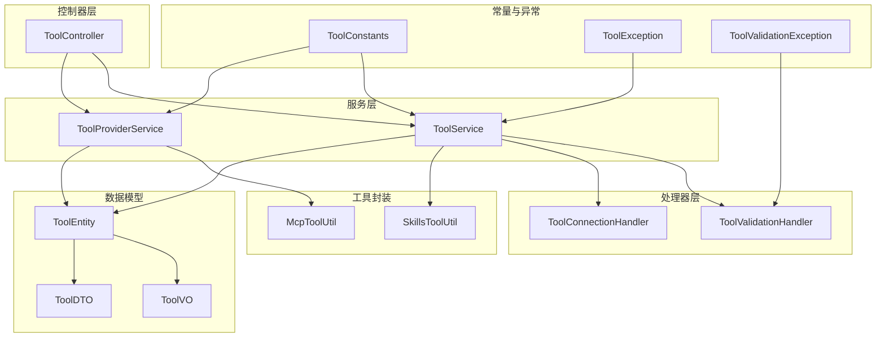
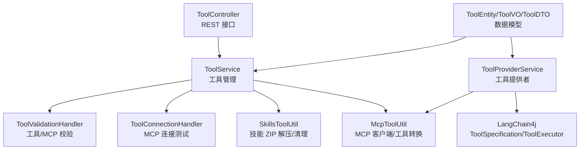
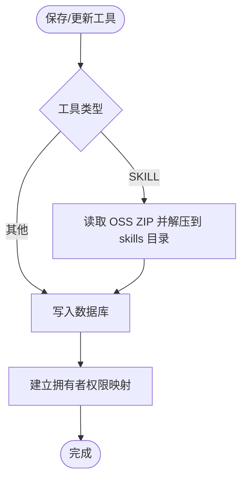
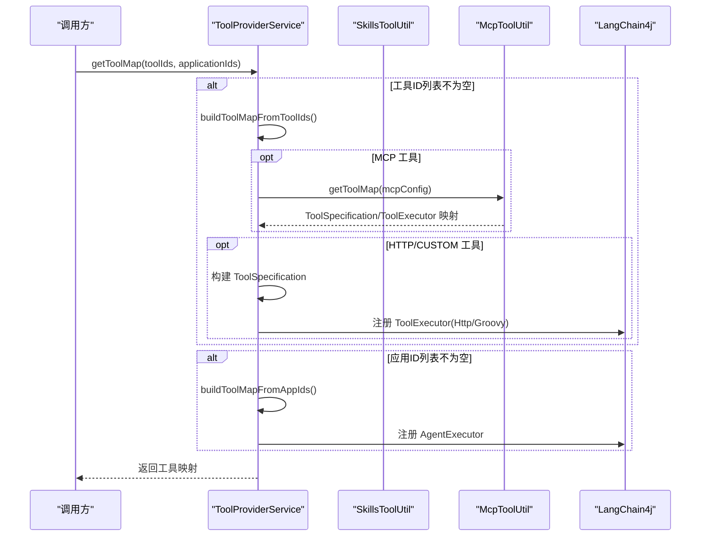
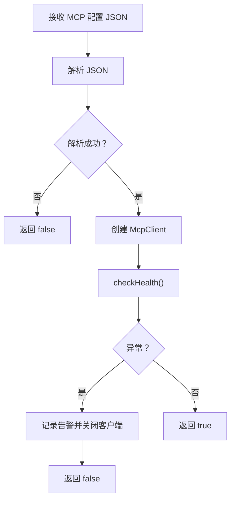
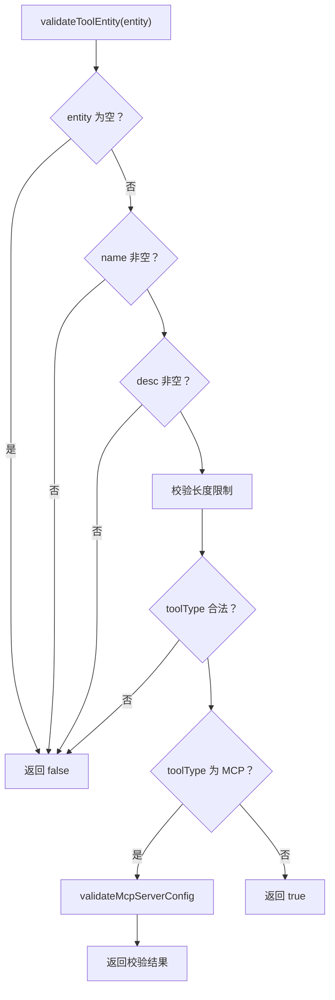
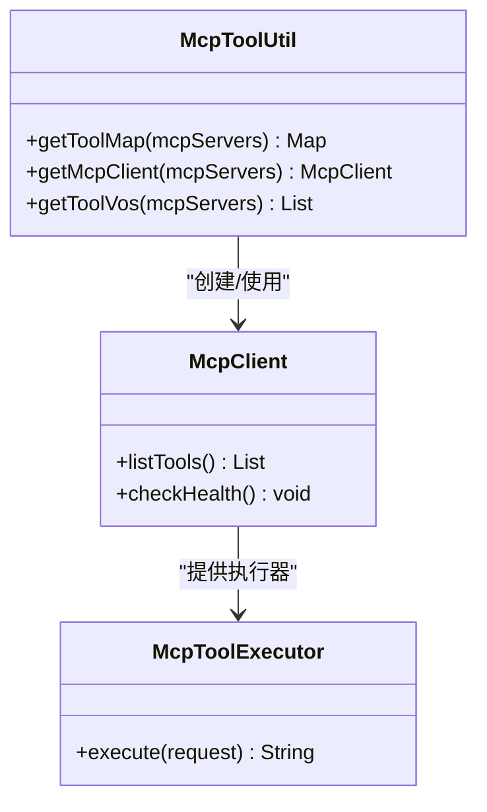
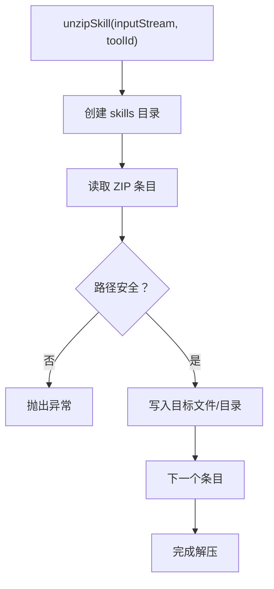
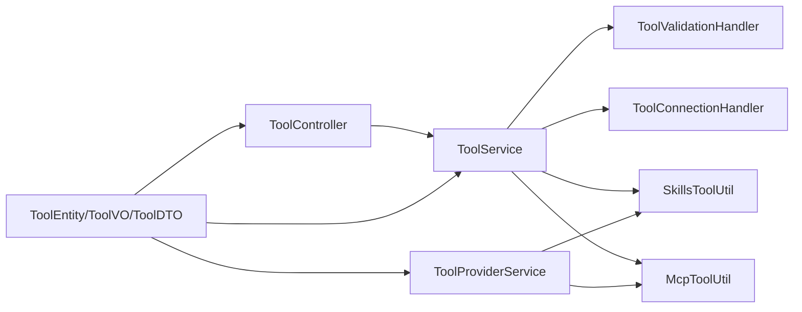

# 工具服务模块 (maxkb4j-tool)

<cite>
**本文引用的文件**
- [ToolService.java](file://maxkb4j-service/maxkb4j-tool/src/main/java/com/maxkb4j/tool/service/ToolService.java)
- [ToolProviderService.java](file://maxkb4j-service/maxkb4j-tool/src/main/java/com/maxkb4j/tool/service/ToolProviderService.java)
- [ToolConnectionHandler.java](file://maxkb4j-service/maxkb4j-tool/src/main/java/com/maxkb4j/tool/handler/ToolConnectionHandler.java)
- [ToolValidationHandler.java](file://maxkb4j-service/maxkb4j-tool/src/main/java/com/maxkb4j/tool/handler/ToolValidationHandler.java)
- [McpToolUtil.java](file://maxkb4j-service/maxkb4j-tool/src/main/java/com/maxkb4j/tool/util/McpToolUtil.java)
- [SkillsToolUtil.java](file://maxkb4j-service/maxkb4j-tool/src/main/java/com/maxkb4j/tool/util/SkillsToolUtil.java)
- [ToolConstants.java](file://maxkb4j-service/maxkb4j-tool/src/main/java/com/maxkb4j/tool/consts/ToolConstants.java)
- [ToolController.java](file://maxkb4j-service/maxkb4j-tool/src/main/java/com/maxkb4j/tool/controller/ToolController.java)
- [ToolEntity.java](file://maxkb4j-service-api/maxkb4j-tool-api/src/main/java/com/maxkb4j/tool/entity/ToolEntity.java)
- [ToolVO.java](file://maxkb4j-service-api/maxkb4j-tool-api/src/main/java/com/maxkb4j/tool/vo/ToolVO.java)
- [ToolDTO.java](file://maxkb4j-service-api/maxkb4j-tool-api/src/main/java/com/maxkb4j/tool/dto/ToolDTO.java)
- [ToolException.java](file://maxkb4j-service/maxkb4j-tool/src/main/java/com/maxkb4j/tool/exception/ToolException.java)
- [ToolValidationException.java](file://maxkb4j-service/maxkb4j-tool/src/main/java/com/maxkb4j/tool/exception/ToolValidationException.java)
</cite>

## 目录
1. [简介](#简介)
2. [项目结构](#项目结构)
3. [核心组件](#核心组件)
4. [架构总览](#架构总览)
5. [详细组件分析](#详细组件分析)
6. [依赖分析](#依赖分析)
7. [性能考虑](#性能考虑)
8. [故障排查指南](#故障排查指南)
9. [结论](#结论)
10. [附录](#附录)

## 简介
本文件为工具服务模块（maxkb4j-tool）的综合技术文档，聚焦于以下目标：
- MCP（Model Context Protocol）协议支持与工具集成机制
- ToolService 的工具管理能力
- ToolProviderService 的工具提供者架构
- ToolConnectionHandler 的连接处理策略
- ToolValidationHandler 的验证机制
- McpToolUtil 的工具调用封装与 MCP 协议实现细节
- 技能工具（SKILL）的打包、解包与运行机制
- 提供工具开发、集成与使用的完整指南

该模块通过统一的工具实体与 VO/DTO 结构，支持多种工具类型（MCP、CUSTOM、HTTP、SKILL），并通过工具提供者服务将这些工具注入到对话或智能体流程中。

## 项目结构
工具服务模块位于 maxkb4j-service/maxkb4j-tool 下，主要包含以下层次：
- 控制器层：ToolController 提供 REST 接口，负责工具的增删改查、导入导出、连接测试、调试等
- 服务层：ToolService 负责工具的持久化、分页、权限过滤、导入导出、连接测试；ToolProviderService 负责将工具映射为 LangChain4j 的 ToolSpecification/ToolExecutor
- 处理器层：ToolValidationHandler 负责工具与 MCP 配置的校验；ToolConnectionHandler 负责 MCP 连接测试
- 工具封装：McpToolUtil 封装 MCP 客户端与工具列表转换；SkillsToolUtil 负责技能工具的 ZIP 解压与目录清理
- 常量与实体：ToolConstants 定义工具类型、状态、MCP 类型等；ToolEntity/ToolVO/ToolDTO 描述数据模型
- 异常体系：ToolException 及其子类 ToolValidationException 提供统一的异常语义

图表来源
- [ToolController.java:35-183](file://maxkb4j-service/maxkb4j-tool/src/main/java/com/maxkb4j/tool/controller/ToolController.java#L35-L183)
- [ToolService.java:47-291](file://maxkb4j-service/maxkb4j-tool/src/main/java/com/maxkb4j/tool/service/ToolService.java#L47-L291)
- [ToolProviderService.java:53-310](file://maxkb4j-service/maxkb4j-tool/src/main/java/com/maxkb4j/tool/service/ToolProviderService.java#L53-L310)
- [ToolValidationHandler.java:20-120](file://maxkb4j-service/maxkb4j-tool/src/main/java/com/maxkb4j/tool/handler/ToolValidationHandler.java#L20-L120)
- [ToolConnectionHandler.java:14-47](file://maxkb4j-service/maxkb4j-tool/src/main/java/com/maxkb4j/tool/handler/ToolConnectionHandler.java#L14-L47)
- [McpToolUtil.java:18-133](file://maxkb4j-service/maxkb4j-tool/src/main/java/com/maxkb4j/tool/util/McpToolUtil.java#L18-L133)
- [SkillsToolUtil.java:14-91](file://maxkb4j-service/maxkb4j-tool/src/main/java/com/maxkb4j/tool/util/SkillsToolUtil.java#L14-L91)
- [ToolEntity.java:20-50](file://maxkb4j-service-api/maxkb4j-tool-api/src/main/java/com/maxkb4j/tool/entity/ToolEntity.java#L20-L50)
- [ToolVO.java:10-16](file://maxkb4j-service-api/maxkb4j-tool-api/src/main/java/com/maxkb4j/tool/vo/ToolVO.java#L10-L16)
- [ToolDTO.java:10-15](file://maxkb4j-service-api/maxkb4j-tool-api/src/main/java/com/maxkb4j/tool/dto/ToolDTO.java#L10-L15)
- [ToolConstants.java:8-69](file://maxkb4j-service/maxkb4j-tool/src/main/java/com/maxkb4j/tool/consts/ToolConstants.java#L8-L69)
- [ToolException.java:10-29](file://maxkb4j-service/maxkb4j-tool/src/main/java/com/maxkb4j/tool/exception/ToolException.java#L10-L29)
- [ToolValidationException.java:6-16](file://maxkb4j-service/maxkb4j-tool/src/main/java/com/maxkb4j/tool/exception/ToolValidationException.java#L6-L16)

章节来源
- [ToolController.java:35-183](file://maxkb4j-service/maxkb4j-tool/src/main/java/com/maxkb4j/tool/controller/ToolController.java#L35-L183)
- [ToolService.java:47-291](file://maxkb4j-service/maxkb4j-tool/src/main/java/com/maxkb4j/tool/service/ToolService.java#L47-L291)
- [ToolProviderService.java:53-310](file://maxkb4j-service/maxkb4j-tool/src/main/java/com/maxkb4j/tool/service/ToolProviderService.java#L53-L310)
- [ToolValidationHandler.java:20-120](file://maxkb4j-service/maxkb4j-tool/src/main/java/com/maxkb4j/tool/handler/ToolValidationHandler.java#L20-L120)
- [ToolConnectionHandler.java:14-47](file://maxkb4j-service/maxkb4j-tool/src/main/java/com/maxkb4j/tool/handler/ToolConnectionHandler.java#L14-L47)
- [McpToolUtil.java:18-133](file://maxkb4j-service/maxkb4j-tool/src/main/java/com/maxkb4j/tool/util/McpToolUtil.java#L18-L133)
- [SkillsToolUtil.java:14-91](file://maxkb4j-service/maxkb4j-tool/src/main/java/com/maxkb4j/tool/util/SkillsToolUtil.java#L14-L91)
- [ToolEntity.java:20-50](file://maxkb4j-service-api/maxkb4j-tool-api/src/main/java/com/maxkb4j/tool/entity/ToolEntity.java#L20-L50)
- [ToolVO.java:10-16](file://maxkb4j-service-api/maxkb4j-tool-api/src/main/java/com/maxkb4j/tool/vo/ToolVO.java#L10-L16)
- [ToolDTO.java:10-15](file://maxkb4j-service-api/maxkb4j-tool-api/src/main/java/com/maxkb4j/tool/dto/ToolDTO.java#L10-L15)
- [ToolConstants.java:8-69](file://maxkb4j-service/maxkb4j-tool/src/main/java/com/maxkb4j/tool/consts/ToolConstants.java#L8-L69)
- [ToolException.java:10-29](file://maxkb4j-service/maxkb4j-tool/src/main/java/com/maxkb4j/tool/exception/ToolException.java#L10-L29)
- [ToolValidationException.java:6-16](file://maxkb4j-service/maxkb4j-tool/src/main/java/com/maxkb4j/tool/exception/ToolValidationException.java#L6-L16)

## 核心组件
- 工具实体与视图：ToolEntity 描述工具的元数据与配置；ToolVO 在实体基础上补充用户昵称与文件列表；ToolDTO 扩展了调试输入字段
- 工具常量：ToolConstants 定义工具类型（MCP/CUSTOM/HTTP/SKILL）、作用域、MCP 类型（sse/streamable_http）、默认值等
- 工具控制器：ToolController 提供工具的分页查询、列表查询、新增/更新/删除、导入导出、连接测试、调试等接口
- 工具服务：ToolService 负责工具的持久化、权限过滤、导入导出、连接测试、技能文件处理、MCP 工具列表转换
- 工具提供者：ToolProviderService 将工具映射为 LangChain4j 的 ToolSpecification/ToolExecutor，并支持技能工具与应用工具
- 验证与连接：ToolValidationHandler 校验工具实体与 MCP 配置；ToolConnectionHandler 测试 MCP 服务器健康
- MCP 工具封装：McpToolUtil 封装 MCP 客户端创建、工具列表获取与参数 Schema 转换
- 技能工具封装：SkillsToolUtil 负责 ZIP 解压、目录清理与技能目录定位

章节来源
- [ToolEntity.java:20-50](file://maxkb4j-service-api/maxkb4j-tool-api/src/main/java/com/maxkb4j/tool/entity/ToolEntity.java#L20-L50)
- [ToolVO.java:10-16](file://maxkb4j-service-api/maxkb4j-tool-api/src/main/java/com/maxkb4j/tool/vo/ToolVO.java#L10-L16)
- [ToolDTO.java:10-15](file://maxkb4j-service-api/maxkb4j-tool-api/src/main/java/com/maxkb4j/tool/dto/ToolDTO.java#L10-L15)
- [ToolConstants.java:8-69](file://maxkb4j-service/maxkb4j-tool/src/main/java/com/maxkb4j/tool/consts/ToolConstants.java#L8-L69)
- [ToolController.java:35-183](file://maxkb4j-service/maxkb4j-tool/src/main/java/com/maxkb4j/tool/controller/ToolController.java#L35-L183)
- [ToolService.java:47-291](file://maxkb4j-service/maxkb4j-tool/src/main/java/com/maxkb4j/tool/service/ToolService.java#L47-L291)
- [ToolProviderService.java:53-310](file://maxkb4j-service/maxkb4j-tool/src/main/java/com/maxkb4j/tool/service/ToolProviderService.java#L53-L310)
- [ToolValidationHandler.java:20-120](file://maxkb4j-service/maxkb4j-tool/src/main/java/com/maxkb4j/tool/handler/ToolValidationHandler.java#L20-L120)
- [ToolConnectionHandler.java:14-47](file://maxkb4j-service/maxkb4j-tool/src/main/java/com/maxkb4j/tool/handler/ToolConnectionHandler.java#L14-L47)
- [McpToolUtil.java:18-133](file://maxkb4j-service/maxkb4j-tool/src/main/java/com/maxkb4j/tool/util/McpToolUtil.java#L18-L133)
- [SkillsToolUtil.java:14-91](file://maxkb4j-service/maxkb4j-tool/src/main/java/com/maxkb4j/tool/util/SkillsToolUtil.java#L14-L91)

## 架构总览
工具服务模块围绕“工具实体 + 提供者映射 + MCP/技能/HTTP/CUSTOM 执行器”的架构展开，控制器通过服务层协调各处理器与工具封装，完成工具的生命周期管理与对外暴露。

图表来源
- [ToolController.java:35-183](file://maxkb4j-service/maxkb4j-tool/src/main/java/com/maxkb4j/tool/controller/ToolController.java#L35-L183)
- [ToolService.java:47-291](file://maxkb4j-service/maxkb4j-tool/src/main/java/com/maxkb4j/tool/service/ToolService.java#L47-L291)
- [ToolProviderService.java:53-310](file://maxkb4j-service/maxkb4j-tool/src/main/java/com/maxkb4j/tool/service/ToolProviderService.java#L53-L310)
- [ToolValidationHandler.java:20-120](file://maxkb4j-service/maxkb4j-tool/src/main/java/com/maxkb4j/tool/handler/ToolValidationHandler.java#L20-L120)
- [ToolConnectionHandler.java:14-47](file://maxkb4j-service/maxkb4j-tool/src/main/java/com/maxkb4j/tool/handler/ToolConnectionHandler.java#L14-L47)
- [McpToolUtil.java:18-133](file://maxkb4j-service/maxkb4j-tool/src/main/java/com/maxkb4j/tool/util/McpToolUtil.java#L18-L133)
- [SkillsToolUtil.java:14-91](file://maxkb4j-service/maxkb4j-tool/src/main/java/com/maxkb4j/tool/util/SkillsToolUtil.java#L14-L91)
- [ToolEntity.java:20-50](file://maxkb4j-service-api/maxkb4j-tool-api/src/main/java/com/maxkb4j/tool/entity/ToolEntity.java#L20-L50)
- [ToolVO.java:10-16](file://maxkb4j-service-api/maxkb4j-tool-api/src/main/java/com/maxkb4j/tool/vo/ToolVO.java#L10-L16)
- [ToolDTO.java:10-15](file://maxkb4j-service-api/maxkb4j-tool-api/src/main/java/com/maxkb4j/tool/dto/ToolDTO.java#L10-L15)

## 详细组件分析

### ToolService：工具管理与集成
- 分页查询与权限过滤：根据登录角色与资源授权过滤可见工具，支持按名称、创建人、分类目录、范围、类型、状态筛选
- 工具保存与更新：支持 CUSTOM/HTTP/MCP/SKILL 四种类型；SKILL 类型会从 OSS 读取 ZIP 并解压至本地 skills 目录；更新时若变更文件则先删除旧目录再解压新文件
- 导入导出：通过 ToolImportExportHandler 实现工具包导入导出
- 连接测试：委托 ToolConnectionHandler 对 MCP 配置进行健康检查
- MCP 工具列表：通过 McpToolUtil 将 MCP 服务器配置转换为工具 VO 列表
- 内置模板工具：扫描 classpath 下的 .tool 模板文件，组装默认工具列表

图表来源
- [ToolService.java:105-131](file://maxkb4j-service/maxkb4j-tool/src/main/java/com/maxkb4j/tool/service/ToolService.java#L105-L131)
- [SkillsToolUtil.java:25-58](file://maxkb4j-service/maxkb4j-tool/src/main/java/com/maxkb4j/tool/util/SkillsToolUtil.java#L25-L58)

章节来源
- [ToolService.java:47-291](file://maxkb4j-service/maxkb4j-tool/src/main/java/com/maxkb4j/tool/service/ToolService.java#L47-L291)
- [SkillsToolUtil.java:14-91](file://maxkb4j-service/maxkb4j-tool/src/main/java/com/maxkb4j/tool/util/SkillsToolUtil.java#L14-L91)

### ToolProviderService：工具提供者架构
- 工具映射聚合：支持从工具 ID 列表与应用 ID 列表构建 ToolSpecification/ToolExecutor 映射
- 技能工具加载：从 skills 目录加载 ShellSkills，解析可用技能清单，动态生成工具规范与执行器
- 应用工具代理：将应用包装为工具规范，执行器委托给 AgentExecutor
- 参数 Schema 构建：根据 ToolInputField 动态生成 JSON Schema，支持 string/int/number/boolean/array/object 等类型
- 结果格式化：将工具执行请求格式化为可渲染的消息文本，包含图标、名称、类型、参数与结果

图表来源
- [ToolProviderService.java:67-224](file://maxkb4j-service/maxkb4j-tool/src/main/java/com/maxkb4j/tool/service/ToolProviderService.java#L67-L224)
- [McpToolUtil.java:21-30](file://maxkb4j-service/maxkb4j-tool/src/main/java/com/maxkb4j/tool/util/McpToolUtil.java#L21-L30)
- [SkillsToolUtil.java:86-104](file://maxkb4j-service/maxkb4j-tool/src/main/java/com/maxkb4j/tool/util/SkillsToolUtil.java#L86-L104)

章节来源
- [ToolProviderService.java:53-310](file://maxkb4j-service/maxkb4j-tool/src/main/java/com/maxkb4j/tool/service/ToolProviderService.java#L53-L310)

### ToolConnectionHandler：连接处理策略
- 输入为 MCP 服务器配置 JSON 字符串，解析后创建 McpClient
- 调用 checkHealth() 进行健康检查，捕获异常并安全关闭客户端
- 返回布尔结果表示连接是否成功

图表来源
- [ToolConnectionHandler.java:24-46](file://maxkb4j-service/maxkb4j-tool/src/main/java/com/maxkb4j/tool/handler/ToolConnectionHandler.java#L24-L46)

章节来源
- [ToolConnectionHandler.java:14-47](file://maxkb4j-service/maxkb4j-tool/src/main/java/com/maxkb4j/tool/handler/ToolConnectionHandler.java#L14-L47)

### ToolValidationHandler：验证机制
- MCP 配置校验：要求每个服务器键对应的对象包含 url 与 type 字段，且 url 为非空字符串，type 为 "sse" 或 "streamable_http"
- 工具实体校验：校验名称/描述长度、code 长度、工具类型合法性；当类型为 MCP 时委派 MCP 配置校验
- 异常抛出：使用 ToolValidationException 提示校验失败原因

图表来源
- [ToolValidationHandler.java:77-119](file://maxkb4j-service/maxkb4j-tool/src/main/java/com/maxkb4j/tool/handler/ToolValidationHandler.java#L77-L119)

章节来源
- [ToolValidationHandler.java:20-120](file://maxkb4j-service/maxkb4j-tool/src/main/java/com/maxkb4j/tool/handler/ToolValidationHandler.java#L20-L120)

### McpToolUtil：MCP 工具调用封装与协议实现
- 客户端创建：根据服务器配置选择 SSE 或 Streamable HTTP 传输，支持自定义 headers
- 工具映射：从 MCP 服务器拉取工具清单，转换为 ToolSpecification/ToolExecutor 映射
- 工具 VO 转换：将工具参数 Schema 转换为 JSON 结构，包含类型、描述、必填项等
- 执行器：使用 McpToolExecutor 将工具调用转发至 MCP 服务器

图表来源
- [McpToolUtil.java:18-133](file://maxkb4j-service/maxkb4j-tool/src/main/java/com/maxkb4j/tool/util/McpToolUtil.java#L18-L133)

章节来源
- [McpToolUtil.java:18-133](file://maxkb4j-service/maxkb4j-tool/src/main/java/com/maxkb4j/tool/util/McpToolUtil.java#L18-L133)

### SkillsToolUtil：技能工具打包与运行
- ZIP 解压：自动创建 skills 目录，安全解压 ZIP，防止 Zip Slip，支持根目录重命名
- 目录清理：递归删除技能目录及其内容
- 目录定位：提供技能目录路径工具方法

图表来源
- [SkillsToolUtil.java:25-58](file://maxkb4j-service/maxkb4j-tool/src/main/java/com/maxkb4j/tool/util/SkillsToolUtil.java#L25-L58)

章节来源
- [SkillsToolUtil.java:14-91](file://maxkb4j-service/maxkb4j-tool/src/main/java/com/maxkb4j/tool/util/SkillsToolUtil.java#L14-L91)

### 数据模型与常量
- ToolEntity：工具实体，包含名称、描述、代码、输入字段、初始化字段与参数、用户、状态、类型、标签、范围、图标、模板、目录、版本等
- ToolVO：在 ToolEntity 基础上增加用户昵称与文件列表
- ToolDTO：扩展调试输入字段
- ToolConstants：工具类型、作用域、状态、MCP 类型、输入类型、默认值等常量

章节来源
- [ToolEntity.java:20-50](file://maxkb4j-service-api/maxkb4j-tool-api/src/main/java/com/maxkb4j/tool/entity/ToolEntity.java#L20-L50)
- [ToolVO.java:10-16](file://maxkb4j-service-api/maxkb4j-tool-api/src/main/java/com/maxkb4j/tool/vo/ToolVO.java#L10-L16)
- [ToolDTO.java:10-15](file://maxkb4j-service-api/maxkb4j-tool-api/src/main/java/com/maxkb4j/tool/dto/ToolDTO.java#L10-L15)
- [ToolConstants.java:8-69](file://maxkb4j-service/maxkb4j-tool/src/main/java/com/maxkb4j/tool/consts/ToolConstants.java#L8-L69)

## 依赖分析
- 控制器依赖服务：ToolController 依赖 ToolService 完成业务操作
- 服务依赖处理器与工具封装：ToolService 依赖 ToolValidationHandler、ToolConnectionHandler、SkillsToolUtil、McpToolUtil
- 工具提供者依赖 MCP 工具封装：ToolProviderService 依赖 McpToolUtil 与 SkillsToolUtil
- 数据模型贯穿：ToolEntity/ToolVO/ToolDTO 在控制器、服务与提供者之间传递

图表来源
- [ToolController.java:35-183](file://maxkb4j-service/maxkb4j-tool/src/main/java/com/maxkb4j/tool/controller/ToolController.java#L35-L183)
- [ToolService.java:47-291](file://maxkb4j-service/maxkb4j-tool/src/main/java/com/maxkb4j/tool/service/ToolService.java#L47-L291)
- [ToolProviderService.java:53-310](file://maxkb4j-service/maxkb4j-tool/src/main/java/com/maxkb4j/tool/service/ToolProviderService.java#L53-L310)
- [ToolValidationHandler.java:20-120](file://maxkb4j-service/maxkb4j-tool/src/main/java/com/maxkb4j/tool/handler/ToolValidationHandler.java#L20-L120)
- [ToolConnectionHandler.java:14-47](file://maxkb4j-service/maxkb4j-tool/src/main/java/com/maxkb4j/tool/handler/ToolConnectionHandler.java#L14-L47)
- [McpToolUtil.java:18-133](file://maxkb4j-service/maxkb4j-tool/src/main/java/com/maxkb4j/tool/util/McpToolUtil.java#L18-L133)
- [SkillsToolUtil.java:14-91](file://maxkb4j-service/maxkb4j-tool/src/main/java/com/maxkb4j/tool/util/SkillsToolUtil.java#L14-L91)
- [ToolEntity.java:20-50](file://maxkb4j-service-api/maxkb4j-tool-api/src/main/java/com/maxkb4j/tool/entity/ToolEntity.java#L20-L50)
- [ToolVO.java:10-16](file://maxkb4j-service-api/maxkb4j-tool-api/src/main/java/com/maxkb4j/tool/vo/ToolVO.java#L10-L16)
- [ToolDTO.java:10-15](file://maxkb4j-service-api/maxkb4j-tool-api/src/main/java/com/maxkb4j/tool/dto/ToolDTO.java#L10-L15)

章节来源
- [ToolController.java:35-183](file://maxkb4j-service/maxkb4j-tool/src/main/java/com/maxkb4j/tool/controller/ToolController.java#L35-L183)
- [ToolService.java:47-291](file://maxkb4j-service/maxkb4j-tool/src/main/java/com/maxkb4j/tool/service/ToolService.java#L47-L291)
- [ToolProviderService.java:53-310](file://maxkb4j-service/maxkb4j-tool/src/main/java/com/maxkb4j/tool/service/ToolProviderService.java#L53-L310)
- [ToolValidationHandler.java:20-120](file://maxkb4j-service/maxkb4j-tool/src/main/java/com/maxkb4j/tool/handler/ToolValidationHandler.java#L20-L120)
- [ToolConnectionHandler.java:14-47](file://maxkb4j-service/maxkb4j-tool/src/main/java/com/maxkb4j/tool/handler/ToolConnectionHandler.java#L14-L47)
- [McpToolUtil.java:18-133](file://maxkb4j-service/maxkb4j-tool/src/main/java/com/maxkb4j/tool/util/McpToolUtil.java#L18-L133)
- [SkillsToolUtil.java:14-91](file://maxkb4j-service/maxkb4j-tool/src/main/java/com/maxkb4j/tool/util/SkillsToolUtil.java#L14-L91)
- [ToolEntity.java:20-50](file://maxkb4j-service-api/maxkb4j-tool-api/src/main/java/com/maxkb4j/tool/entity/ToolEntity.java#L20-L50)
- [ToolVO.java:10-16](file://maxkb4j-service-api/maxkb4j-tool-api/src/main/java/com/maxkb4j/tool/vo/ToolVO.java#L10-L16)
- [ToolDTO.java:10-15](file://maxkb4j-service-api/maxkb4j-tool-api/src/main/java/com/maxkb4j/tool/dto/ToolDTO.java#L10-L15)

## 性能考虑
- MCP 客户端复用：建议在高并发场景下缓存 McpClient，避免频繁创建/销毁带来的开销
- ZIP 解压优化：技能工具解压应避免重复解压，可通过文件指纹或版本号控制
- 分页查询：列表查询与分页查询应结合索引与权限过滤条件，减少无效数据扫描
- 参数 Schema 构建：动态构建 JSON Schema 存在一定计算成本，可在工具变更时缓存
- 日志与监控：对 MCP 健康检查与工具执行增加埋点与告警，便于问题定位

## 故障排查指南
- MCP 连接失败
  - 检查配置 JSON 结构与字段完整性（url/type）
  - 使用连接测试接口验证服务器可达性
  - 关注客户端关闭异常与日志告警
- 工具保存失败
  - 校验工具实体字段长度与类型
  - 若为 MCP 类型，确认配置合法
  - 查看异常栈中的 ToolValidationException 提示
- 技能工具异常
  - 确认 ZIP 包未被破坏且未触发 Zip Slip 防护
  - 检查 skills 目录权限与磁盘空间
- 工具提供者映射为空
  - 确认工具 ID 列表有效且处于激活状态
  - 检查 MCP 服务器工具清单是否可访问

章节来源
- [ToolConnectionHandler.java:14-47](file://maxkb4j-service/maxkb4j-tool/src/main/java/com/maxkb4j/tool/handler/ToolConnectionHandler.java#L14-L47)
- [ToolValidationHandler.java:20-120](file://maxkb4j-service/maxkb4j-tool/src/main/java/com/maxkb4j/tool/handler/ToolValidationHandler.java#L20-L120)
- [ToolException.java:10-29](file://maxkb4j-service/maxkb4j-tool/src/main/java/com/maxkb4j/tool/exception/ToolException.java#L10-L29)
- [ToolValidationException.java:6-16](file://maxkb4j-service/maxkb4j-tool/src/main/java/com/maxkb4j/tool/exception/ToolValidationException.java#L6-L16)
- [SkillsToolUtil.java:14-91](file://maxkb4j-service/maxkb4j-tool/src/main/java/com/maxkb4j/tool/util/SkillsToolUtil.java#L14-L91)

## 结论
工具服务模块通过清晰的职责划分与统一的数据模型，实现了对 MCP、CUSTOM、HTTP、SKILL 多种工具类型的统一管理与集成。ToolProviderService 将工具无缝注入到对话与智能体流程中，McpToolUtil 与 SkillsToolUtil 提供了可靠的 MCP 协议支持与技能工具运行环境。配合严格的验证与连接测试机制，模块具备良好的可维护性与可扩展性。

## 附录
- 工具开发与集成步骤
  - 设计工具实体：填写名称、描述、类型、初始参数与输入字段
  - 配置 MCP：提供服务器 URL 与传输类型（sse/streamable_http），并添加必要 headers
  - 编写 CUSTOM/HTTP 工具：准备代码与初始化参数，确保参数 Schema 与必填项正确
  - 打包技能工具：将技能文件压缩为 ZIP，上传至 OSS，系统自动解压到 skills 目录
  - 导入/导出：通过导入导出功能在不同环境间迁移工具包
  - 调试与测试：使用调试接口验证参数与执行结果，使用连接测试验证 MCP 服务器连通性
- 最佳实践
  - 为工具提供清晰的描述与图标，便于用户识别
  - 合理设计输入字段与参数 Schema，提升工具可用性
  - 对 MCP 服务器配置进行版本化管理，避免频繁变更导致的兼容问题
  - 对技能工具进行权限控制与目录隔离，确保运行安全