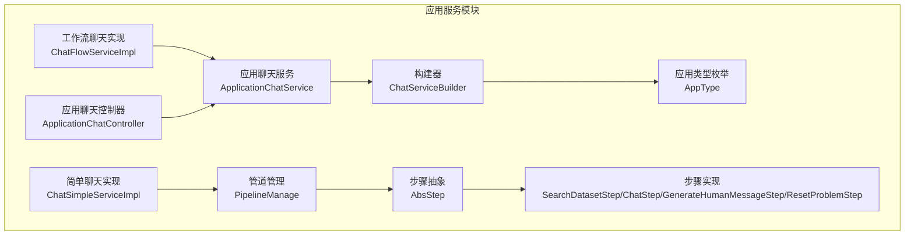
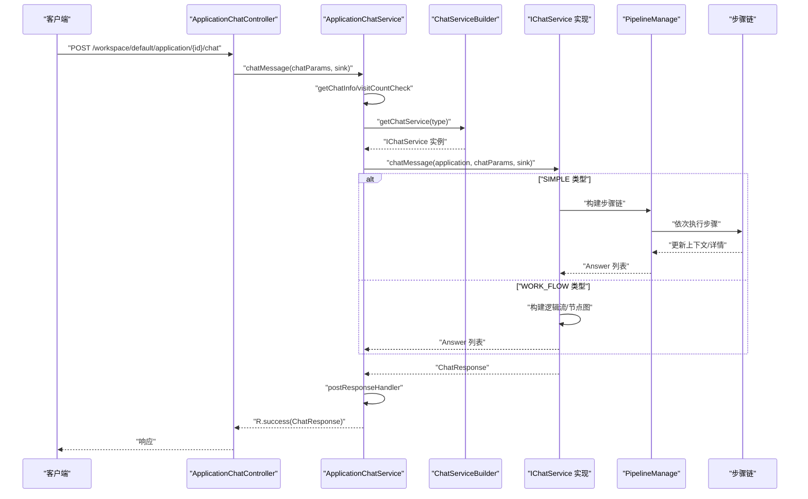
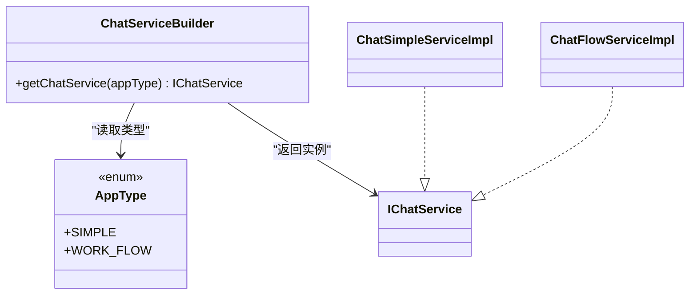
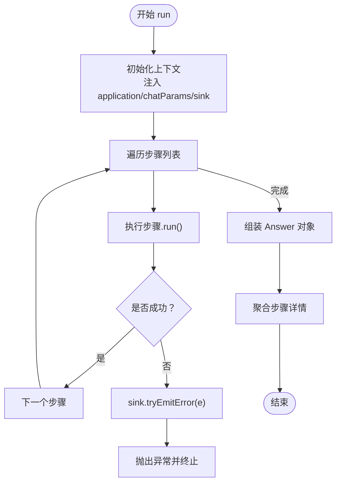
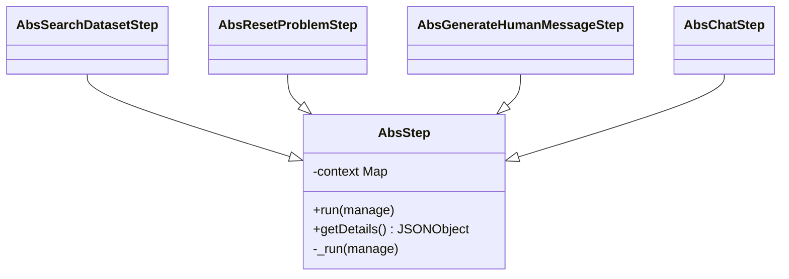
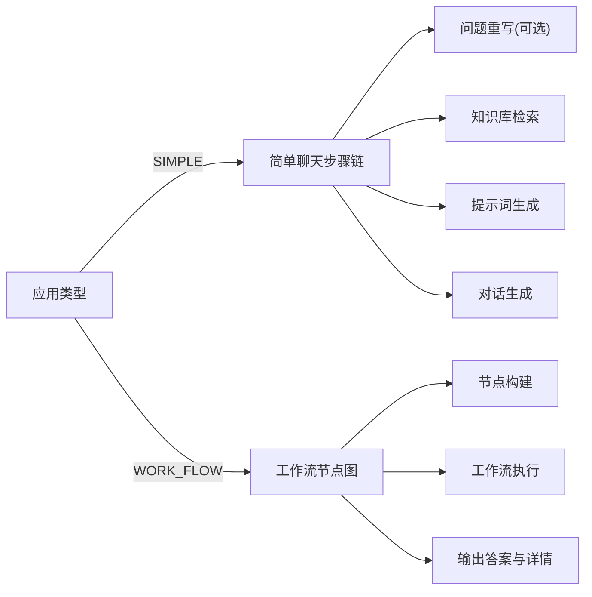
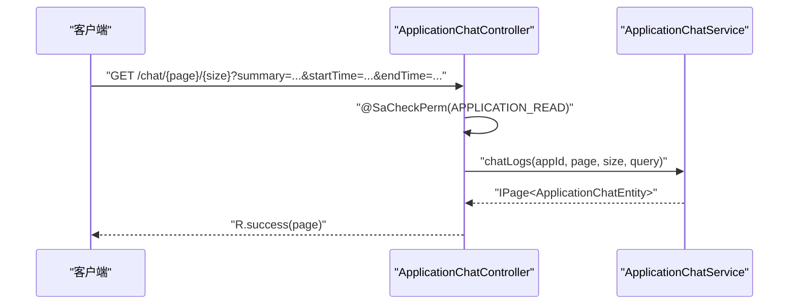
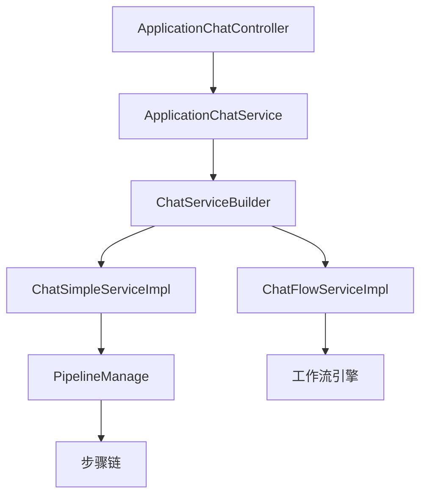

# 应用服务模块 (maxkb4j-application)

<cite>
**本文引用的文件列表**
- [ChatServiceBuilder.java](file://maxkb4j-service/maxkb4j-application/src/main/java/com/maxkb4j/application/builder/ChatServiceBuilder.java)
- [AppType.java](file://maxkb4j-service/maxkb4j-application/src/main/java/com/maxkb4j/application/enums/AppType.java)
- [PipelineManage.java](file://maxkb4j-service/maxkb4j-application/src/main/java/com/maxkb4j/application/pipeline/PipelineManage.java)
- [AbsStep.java](file://maxkb4j-service/maxkb4j-application/src/main/java/com/maxkb4j/application/pipeline/AbsStep.java)
- [AbsChatStep.java](file://maxkb4j-service/maxkb4j-application/src/main/java/com/maxkb4j/application/pipeline/step/chatstep/AbsChatStep.java)
- [AbsGenerateHumanMessageStep.java](file://maxkb4j-service/maxkb4j-application/src/main/java/com/maxkb4j/application/pipeline/step/generatehumanmessagestep/AbsGenerateHumanMessageStep.java)
- [AbsResetProblemStep.java](file://maxkb4j-service/maxkb4j-application/src/main/java/com/maxkb4j/application/pipeline/step/resetproblemstep/AbsResetProblemStep.java)
- [AbsSearchDatasetStep.java](file://maxkb4j-service/maxkb4j-application/src/main/java/com/maxkb4j/application/pipeline/step/searchdatasetstep/AbsSearchDatasetStep.java)
- [ChatSimpleServiceImpl.java](file://maxkb4j-service/maxkb4j-application/src/main/java/com/maxkb4j/application/service/impl/ChatSimpleServiceImpl.java)
- [ChatFlowServiceImpl.java](file://maxkb4j-service/maxkb4j-application/src/main/java/com/maxkb4j/application/service/impl/ChatFlowServiceImpl.java)
- [ApplicationChatService.java](file://maxkb4j-service/maxkb4j-application/src/main/java/com/maxkb4j/application/service/ApplicationChatService.java)
- [ApplicationChatController.java](file://maxkb4j-service/maxkb4j-application/src/main/java/com/maxkb4j/application/controller/ApplicationChatController.java)
</cite>

## 目录
1. [引言](#引言)
2. [项目结构](#项目结构)
3. [核心组件](#核心组件)
4. [架构总览](#架构总览)
5. [组件详解](#组件详解)
6. [依赖关系分析](#依赖关系分析)
7. [性能考量](#性能考量)
8. [故障排查指南](#故障排查指南)
9. [结论](#结论)
10. [附录](#附录)

## 引言
本文件面向应用服务模块（maxkb4j-application），系统性阐述聊天服务的架构设计与实现要点，重点覆盖以下主题：
- ChatServiceBuilder 工厂模式：按应用类型选择简单聊天或工作流聊天实现
- 简单聊天与工作流聊天的区别与适用场景
- 管道执行机制（PipelineManage）：步骤编排、上下文传递、错误传播
- 步骤组件职责与交互：SearchDatasetStep、ChatStep、GenerateHumanMessageStep、ResetProblemStep 等
- 控制器层设计：REST 接口、请求响应模式、鉴权与权限控制
- 使用示例：参数配置、错误处理、性能优化建议
- 模块集成：与知识库检索、模型服务、工作流引擎的数据流转

## 项目结构
应用服务模块位于 maxkb4j-service/maxkb4j-application，主要包含以下层次：
- 构建与枚举：builder、enums
- 管道与步骤：pipeline、pipeline/step
- 服务实现：service、service/impl
- 控制器：controller
- DTO/VO 实体与工具：dto、vo、util

图表来源
- [ChatServiceBuilder.java:1-38](file://maxkb4j-service/maxkb4j-application/src/main/java/com/maxkb4j/application/builder/ChatServiceBuilder.java#L1-L38)
- [AppType.java:1-10](file://maxkb4j-service/maxkb4j-application/src/main/java/com/maxkb4j/application/enums/AppType.java#L1-L10)
- [PipelineManage.java:1-122](file://maxkb4j-service/maxkb4j-application/src/main/java/com/maxkb4j/application/pipeline/PipelineManage.java#L1-L122)
- [AbsStep.java:1-22](file://maxkb4j-service/maxkb4j-application/src/main/java/com/maxkb4j/application/pipeline/AbsStep.java#L1-L22)
- [ChatSimpleServiceImpl.java:1-54](file://maxkb4j-service/maxkb4j-application/src/main/java/com/maxkb4j/application/service/impl/ChatSimpleServiceImpl.java#L1-L54)
- [ChatFlowServiceImpl.java:1-45](file://maxkb4j-service/maxkb4j-application/src/main/java/com/maxkb4j/application/service/impl/ChatFlowServiceImpl.java#L1-L45)
- [ApplicationChatService.java:1-221](file://maxkb4j-service/maxkb4j-application/src/main/java/com/maxkb4j/application/service/ApplicationChatService.java#L1-L221)
- [ApplicationChatController.java:1-64](file://maxkb4j-service/maxkb4j-application/src/main/java/com/maxkb4j/application/controller/ApplicationChatController.java#L1-L64)

章节来源
- [ChatServiceBuilder.java:1-38](file://maxkb4j-service/maxkb4j-application/src/main/java/com/maxkb4j/application/builder/ChatServiceBuilder.java#L1-L38)
- [AppType.java:1-10](file://maxkb4j-service/maxkb4j-application/src/main/java/com/maxkb4j/application/enums/AppType.java#L1-L10)
- [ApplicationChatService.java:1-221](file://maxkb4j-service/maxkb4j-application/src/main/java/com/maxkb4j/application/service/ApplicationChatService.java#L1-L221)

## 核心组件
- ChatServiceBuilder：基于应用类型（SIMPLE/WORK_FLOW）从 Spring 容器中获取对应的 IChatService 实现，采用静态池缓存以避免重复查找。
- PipelineManage：聊天流程的编排器，负责步骤链式执行、上下文共享、历史消息生成、排除段落计算、运行细节收集。
- AbsStep：步骤抽象基类，统一记录执行耗时，并定义步骤执行入口与详情导出。
- ChatSimpleServiceImpl：简单聊天实现，按配置动态拼装步骤（问题重写、检索、提示词生成、对话），返回标准 ChatResponse。
- ChatFlowServiceImpl：工作流聊天实现，基于逻辑流构建节点图，交由工作流引擎执行，输出答案与运行详情。
- ApplicationChatService：对外服务入口，负责访问次数校验、聊天信息缓存、异步执行、后置处理与导出。
- ApplicationChatController：REST 控制器，提供会话管理与导出接口，配合权限注解进行访问控制。

章节来源
- [ChatServiceBuilder.java:14-38](file://maxkb4j-service/maxkb4j-application/src/main/java/com/maxkb4j/application/builder/ChatServiceBuilder.java#L14-L38)
- [PipelineManage.java:24-122](file://maxkb4j-service/maxkb4j-application/src/main/java/com/maxkb4j/application/pipeline/PipelineManage.java#L24-L122)
- [AbsStep.java:8-22](file://maxkb4j-service/maxkb4j-application/src/main/java/com/maxkb4j/application/pipeline/AbsStep.java#L8-L22)
- [ChatSimpleServiceImpl:26-54](file://maxkb4j-service/maxkb4j-application/src/main/java/com/maxkb4j/application/service/impl/ChatSimpleServiceImpl.java#L26-L54)
- [ChatFlowServiceImpl:25-45](file://maxkb4j-service/maxkb4j-application/src/main/java/com/maxkb4j/application/service/impl/ChatFlowServiceImpl.java#L25-L45)
- [ApplicationChatService:52-221](file://maxkb4j-service/maxkb4j-application/src/main/java/com/maxkb4j/application/service/ApplicationChatService.java#L52-L221)
- [ApplicationChatController:31-64](file://maxkb4j-service/maxkb4j-application/src/main/java/com/maxkb4j/application/controller/ApplicationChatController.java#L31-L64)

## 架构总览
应用服务模块通过“控制器 → 服务 → 构建器/管道/工作流”的分层设计，实现灵活可扩展的聊天能力：
- 控制器层：接收请求、鉴权、封装响应
- 服务层：业务编排、访问控制、异步执行、导出
- 执行层：根据应用类型选择简单聊天或工作流聊天
- 步骤层：管道中的可插拔步骤，完成检索、问题重写、提示词生成、对话等任务

图表来源
- [ApplicationChatController.java:31-64](file://maxkb4j-service/maxkb4j-application/src/main/java/com/maxkb4j/application/controller/ApplicationChatController.java#L31-L64)
- [ApplicationChatService.java:115-137](file://maxkb4j-service/maxkb4j-application/src/main/java/com/maxkb4j/application/service/ApplicationChatService.java#L115-L137)
- [ChatServiceBuilder.java:29-36](file://maxkb4j-service/maxkb4j-application/src/main/java/com/maxkb4j/application/builder/ChatServiceBuilder.java#L29-L36)
- [ChatSimpleServiceImpl.java:34-50](file://maxkb4j-service/maxkb4j-application/src/main/java/com/maxkb4j/application/service/impl/ChatSimpleServiceImpl.java#L34-L50)
- [ChatFlowServiceImpl.java:31-43](file://maxkb4j-service/maxkb4j-application/src/main/java/com/maxkb4j/application/service/impl/ChatFlowServiceImpl.java#L31-L43)

## 组件详解

### ChatServiceBuilder 工厂模式
- 职责：依据应用类型（SIMPLE/WORK_FLOW）从 Spring 容器获取对应 IChatService 实现；通过静态池缓存提升性能。
- 关键点：类型到实现的映射在静态初始化块中完成；若类型不存在则抛出异常。

图表来源
- [ChatServiceBuilder.java:14-38](file://maxkb4j-service/maxkb4j-application/src/main/java/com/maxkb4j/application/builder/ChatServiceBuilder.java#L14-L38)
- [AppType.java:3-9](file://maxkb4j-service/maxkb4j-application/src/main/java/com/maxkb4j/application/enums/AppType.java#L3-L9)

章节来源
- [ChatServiceBuilder.java:18-21](file://maxkb4j-service/maxkb4j-application/src/main/java/com/maxkb4j/application/builder/ChatServiceBuilder.java#L18-L21)
- [ChatServiceBuilder.java:29-36](file://maxkb4j-service/maxkb4j-application/src/main/java/com/maxkb4j/application/builder/ChatServiceBuilder.java#L29-L36)

### 管道执行机制（PipelineManage）
- 职责：维护步骤列表与上下文，顺序执行各步骤，聚合运行详情，生成历史消息与排除段落集合。
- 上下文：共享 messageTokens、answerTokens 等指标；支持运行时注入 application、chatParams、sink。
- 错误处理：任一步骤异常均通过 sink 发出错误并中断后续执行。
- 运行细节：遍历步骤详情，按 step_type 聚合到统一 JSON 结构。

图表来源
- [PipelineManage.java:39-61](file://maxkb4j-service/maxkb4j-application/src/main/java/com/maxkb4j/application/pipeline/PipelineManage.java#L39-L61)
- [PipelineManage.java:97-107](file://maxkb4j-service/maxkb4j-application/src/main/java/com/maxkb4j/application/pipeline/PipelineManage.java#L97-L107)

章节来源
- [PipelineManage.java:25-36](file://maxkb4j-service/maxkb4j-application/src/main/java/com/maxkb4j/application/pipeline/PipelineManage.java#L25-L36)
- [PipelineManage.java:49-61](file://maxkb4j-service/maxkb4j-application/src/main/java/com/maxkb4j/application/pipeline/PipelineManage.java#L49-L61)
- [PipelineManage.java:63-94](file://maxkb4j-service/maxkb4j-application/src/main/java/com/maxkb4j/application/pipeline/PipelineManage.java#L63-L94)
- [PipelineManage.java:97-107](file://maxkb4j-service/maxkb4j-application/src/main/java/com/maxkb4j/application/pipeline/PipelineManage.java#L97-L107)

### 步骤组件与职责
- AbsStep：统一的步骤抽象，负责记录执行时间、定义 run/_run 接口与详情导出。
- AbsSearchDatasetStep：检索步骤，基于问题文本与已排除段落 ID 列表进行知识库检索，产出段落列表等结果。
- AbsResetProblemStep：问题重写步骤，对原始问题进行优化或改写，提升检索质量。
- AbsGenerateHumanMessageStep：提示词生成步骤，将检索结果与上下文整合为最终的人类消息。
- AbsChatStep：对话步骤，调用模型服务生成回答，填充 answer 与 reasoningContent 等字段。

图表来源
- [AbsStep.java:8-22](file://maxkb4j-service/maxkb4j-application/src/main/java/com/maxkb4j/application/pipeline/AbsStep.java#L8-L22)
- [AbsSearchDatasetStep.java:1-11](file://maxkb4j-service/maxkb4j-application/src/main/java/com/maxkb4j/application/pipeline/step/searchdatasetstep/AbsSearchDatasetStep.java#L1-L11)
- [AbsResetProblemStep.java:1-10](file://maxkb4j-service/maxkb4j-application/src/main/java/com/maxkb4j/application/pipeline/step/resetproblemstep/AbsResetProblemStep.java#L1-L10)
- [AbsGenerateHumanMessageStep.java:1-12](file://maxkb4j-service/maxkb4j-application/src/main/java/com/maxkb4j/application/pipeline/step/generatehumanmessagestep/AbsGenerateHumanMessageStep.java#L1-L12)
- [AbsChatStep.java:1-22](file://maxkb4j-service/maxkb4j-application/src/main/java/com/maxkb4j/application/pipeline/step/chatstep/AbsChatStep.java#L1-L22)

章节来源
- [AbsStep.java:11-21](file://maxkb4j-service/maxkb4j-application/src/main/java/com/maxkb4j/application/pipeline/AbsStep.java#L11-L21)
- [AbsSearchDatasetStep.java:11](file://maxkb4j-service/maxkb4j-application/src/main/java/com/maxkb4j/application/pipeline/step/searchdatasetstep/AbsSearchDatasetStep.java#L11)
- [AbsResetProblemStep.java:10](file://maxkb4j-service/maxkb4j-application/src/main/java/com/maxkb4j/application/pipeline/step/resetproblemstep/AbsResetProblemStep.java#L10)
- [AbsGenerateHumanMessageStep.java:12](file://maxkb4j-service/maxkb4j-application/src/main/java/com/maxkb4j/application/pipeline/step/generatehumanmessagestep/AbsGenerateHumanMessageStep.java#L12)
- [AbsChatStep.java:22](file://maxkb4j-service/maxkb4j-application/src/main/java/com/maxkb4j/application/pipeline/step/chatstep/AbsChatStep.java#L22)

### 简单聊天 vs 工作流聊天
- 简单聊天（SIMPLE）：按配置动态拼接步骤链，适合常规问答流程；步骤顺序通常为：问题重写（可选）→ 检索 → 提示词生成 → 对话。
- 工作流（WORK_FLOW）：基于逻辑流构建节点图，交由工作流引擎执行；适合复杂分支、条件判断、多轮协作等场景。

图表来源
- [AppType.java:3-9](file://maxkb4j-service/maxkb4j-application/src/main/java/com/maxkb4j/application/enums/AppType.java#L3-L9)
- [ChatSimpleServiceImpl.java:34-50](file://maxkb4j-service/maxkb4j-application/src/main/java/com/maxkb4j/application/service/impl/ChatSimpleServiceImpl.java#L34-L50)
- [ChatFlowServiceImpl.java:31-43](file://maxkb4j-service/maxkb4j-application/src/main/java/com/maxkb4j/application/service/impl/ChatFlowServiceImpl.java#L31-L43)

章节来源
- [ChatSimpleServiceImpl.java:36-44](file://maxkb4j-service/maxkb4j-application/src/main/java/com/maxkb4j/application/service/impl/ChatSimpleServiceImpl.java#L36-L44)
- [ChatFlowServiceImpl.java:33-42](file://maxkb4j-service/maxkb4j-application/src/main/java/com/maxkb4j/application/service/impl/ChatFlowServiceImpl.java#L33-L42)

### 控制器层设计
- 接口路径前缀：/api/admin/workspace/default
- 权限注解：@SaCheckPerm 配合 PermissionEnum.APPLICATION_* 控制编辑、删除、查询、导出等操作
- 请求响应模式：统一使用 R<T> 包裹结果；导出接口直接写入 HttpServletResponse 输出流
- 典型接口：
  - PUT /application/{id}/chat/client/{chatId}：更新会话摘要
  - DELETE /application/{id}/chat/client/{chatId}：删除会话
  - GET /application/{id}/chat/{page}/{size}：分页查询会话日志
  - POST /application/{id}/chat/export：批量导出会话明细

图表来源
- [ApplicationChatController.java:48-52](file://maxkb4j-service/maxkb4j-application/src/main/java/com/maxkb4j/application/controller/ApplicationChatController.java#L48-L52)

章节来源
- [ApplicationChatController.java:26-64](file://maxkb4j-service/maxkb4j-application/src/main/java/com/maxkb4j/application/controller/ApplicationChatController.java#L26-L64)

## 依赖关系分析
- 低耦合高内聚：控制器仅依赖服务接口；服务通过构建器选择具体实现；实现类不直接依赖控制器。
- 外部依赖：
  - Spring 容器：通过 SpringUtil 获取 Bean（构建器）
  - Reactor Sinks：用于事件驱动的流式响应
  - FastJSON：用于步骤详情与运行时数据的序列化
  - MyBatis Plus：用于数据持久化与分页查询
  - 工作流模块：工作流聊天依赖 workflow 的逻辑流与节点执行

图表来源
- [ApplicationChatController.java:33](file://maxkb4j-service/maxkb4j-application/src/main/java/com/maxkb4j/application/controller/ApplicationChatController.java#L33)
- [ApplicationChatService.java:131](file://maxkb4j-service/maxkb4j-application/src/main/java/com/maxkb4j/application/service/ApplicationChatService.java#L131)
- [ChatServiceBuilder.java:19-20](file://maxkb4j-service/maxkb4j-application/src/main/java/com/maxkb4j/application/builder/ChatServiceBuilder.java#L19-L20)
- [ChatSimpleServiceImpl.java:35-44](file://maxkb4j-service/maxkb4j-application/src/main/java/com/maxkb4j/application/service/impl/ChatSimpleServiceImpl.java#L35-L44)
- [ChatFlowServiceImpl.java:33-39](file://maxkb4j-service/maxkb4j-application/src/main/java/com/maxkb4j/application/service/impl/ChatFlowServiceImpl.java#L33-L39)

章节来源
- [ApplicationChatService.java:10-18](file://maxkb4j-service/maxkb4j-application/src/main/java/com/maxkb4j/application/service/ApplicationChatService.java#L10-L18)
- [ChatServiceBuilder.java:16-21](file://maxkb4j-service/maxkb4j-application/src/main/java/com/maxkb4j/application/builder/ChatServiceBuilder.java#L16-L21)

## 性能考量
- 异步执行：ApplicationChatService 提供异步方法，使用 TaskExecutor 将聊天计算移出主线程，降低阻塞风险。
- 缓存策略：聊天信息通过 ChatCache 缓存，减少数据库查询压力。
- 步骤计时：AbsStep 统一记录步骤耗时，便于定位慢步骤。
- 分页查询：会话日志查询支持分页与多条件过滤，避免一次性加载大量数据。
- 导出优化：导出接口直接写入 HttpServletResponse 输出流，减少中间对象占用。

章节来源
- [ApplicationChatService.java:139-150](file://maxkb4j-service/maxkb4j-application/src/main/java/com/maxkb4j/application/service/ApplicationChatService.java#L139-L150)
- [ApplicationChatService.java:64-81](file://maxkb4j-service/maxkb4j-application/src/main/java/com/maxkb4j/application/service/ApplicationChatService.java#L64-L81)
- [AbsStep.java:12-14](file://maxkb4j-service/maxkb4j-application/src/main/java/com/maxkb4j/application/pipeline/AbsStep.java#L12-L14)

## 故障排查指南
- 访问次数限制：visitCountCheck 会在非调试模式下检查用户当日访问次数与应用配额，超限将通过 sink 发出 AccessNumLimitException 并返回空响应。
- 未发布的应用：chatOpen 在非调试模式下要求应用已发布，否则抛出异常。
- 步骤异常：PipelineManage 在执行步骤时捕获异常并通过 sink.tryEmitError 抛出，同时向上抛出运行时异常以终止流程。
- 工作流异常：工作流执行由工作流引擎负责，异常可通过工作流异常解析链处理。
- 导出失败：确保传入的 ids 非空且存在对应记录，导出接口直接写入响应输出流。

章节来源
- [ApplicationChatService.java:115-137](file://maxkb4j-service/maxkb4j-application/src/main/java/com/maxkb4j/application/service/ApplicationChatService.java#L115-L137)
- [ApplicationChatService.java:152-174](file://maxkb4j-service/maxkb4j-application/src/main/java/com/maxkb4j/application/service/ApplicationChatService.java#L152-L174)
- [ApplicationChatService.java:185-189](file://maxkb4j-service/maxkb4j-application/src/main/java/com/maxkb4j/application/service/ApplicationChatService.java#L185-L189)
- [PipelineManage.java:50-57](file://maxkb4j-service/maxkb4j-application/src/main/java/com/maxkb4j/application/pipeline/PipelineManage.java#L50-L57)

## 结论
应用服务模块通过清晰的分层与可插拔的步骤机制，实现了简单与复杂聊天场景的统一支撑。构建器按类型选择实现，管道负责步骤编排与上下文传递，控制器提供受控的 REST 接口。该设计具备良好的扩展性与可维护性，适合在多变的业务需求下快速演进。

## 附录

### 使用示例（参数配置、错误处理、性能优化）
- 参数配置
  - chatId：会话标识；若为空将自动生成
  - appId：应用标识；用于访问控制与版本校验
  - debug：调试模式；影响发布状态检查与缓存行为
  - chatRecordId：当前轮次记录标识；为空时自动生成
  - 历史记录：historyChatRecords 用于构建上下文历史消息
- 错误处理
  - 访问次数超限：通过 sink 发出 AccessNumLimitException
  - 未发布应用：抛出异常提示先发布再使用
  - 步骤异常：PipelineManage 捕获并上报至 sink
- 性能优化建议
  - 使用异步执行 chatMessageAsync，结合线程池隔离聊天计算
  - 合理设置历史对话轮数，避免过长的历史消息导致上下文膨胀
  - 对检索步骤增加排除段落集合，减少重复内容带来的噪声
  - 对关键步骤启用缓存（如问题重写、检索结果），降低重复计算

章节来源
- [ApplicationChatService.java:115-137](file://maxkb4j-service/maxkb4j-application/src/main/java/com/maxkb4j/application/service/ApplicationChatService.java#L115-L137)
- [ApplicationChatService.java:139-150](file://maxkb4j-service/maxkb4j-application/src/main/java/com/maxkb4j/application/service/ApplicationChatService.java#L139-L150)
- [PipelineManage.java:63-73](file://maxkb4j-service/maxkb4j-application/src/main/java/com/maxkb4j/application/pipeline/PipelineManage.java#L63-L73)
- [PipelineManage.java:76-94](file://maxkb4j-service/maxkb4j-application/src/main/java/com/maxkb4j/application/pipeline/PipelineManage.java#L76-L94)