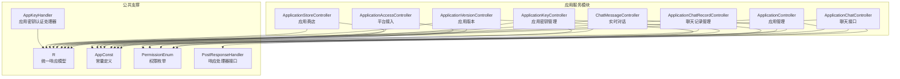
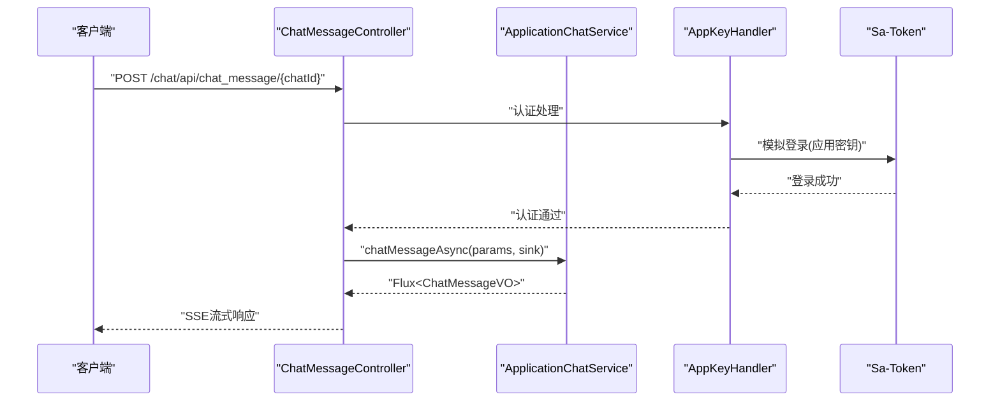
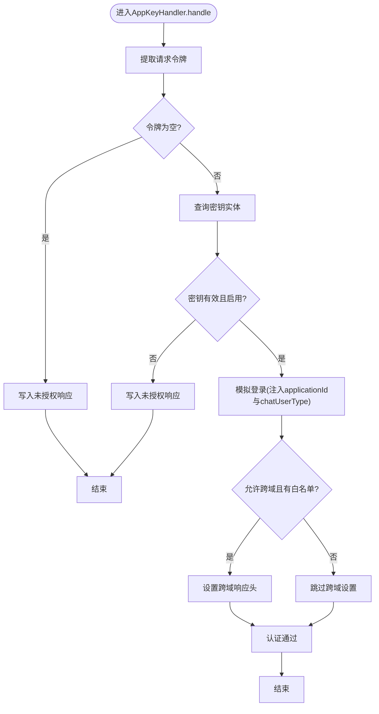
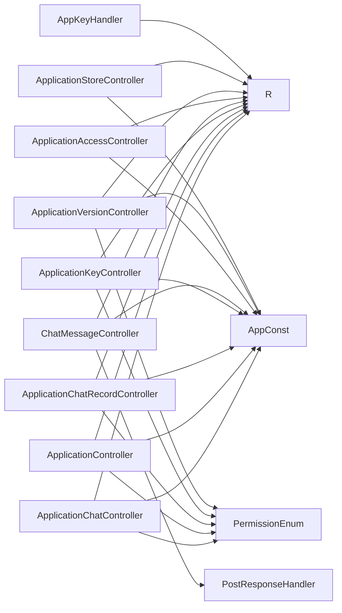

# 控制器层设计

<cite>
**本文档引用的文件**
- [ApplicationChatController.java](file://maxkb4j-service/maxkb4j-application/src/main/java/com/maxkb4j/application/controller/ApplicationChatController.java)
- [ApplicationController.java](file://maxkb4j-service/maxkb4j-application/src/main/java/com/maxkb4j/application/controller/ApplicationController.java)
- [ApplicationChatRecordController.java](file://maxkb4j-service/maxkb4j-application/src/main/java/com/maxkb4j/application/controller/ApplicationChatRecordController.java)
- [ApplicationKeyController.java](file://maxkb4j-service/maxkb4j-application/src/main/java/com/maxkb4j/application/controller/ApplicationKeyController.java)
- [ChatMessageController.java](file://maxkb4j-service/maxkb4j-application/src/main/java/com/maxkb4j/application/controller/ChatMessageController.java)
- [ApplicationAccessController.java](file://maxkb4j-service/maxkb4j-application/src/main/java/com/maxkb4j/application/controller/ApplicationAccessController.java)
- [ApplicationVersionController.java](file://maxkb4j-service/maxkb4j-application/src/main/java/com/maxkb4j/application/controller/ApplicationVersionController.java)
- [ApplicationStoreController.java](file://maxkb4j-service/maxkb4j-application/src/main/java/com/maxkb4j/application/controller/ApplicationStoreController.java)
- [PostResponseHandler.java](file://maxkb4j-service/maxkb4j-application/src/main/java/com/maxkb4j/application/handler/PostResponseHandler.java)
- [AppKeyHandler.java](file://maxkb4j-service/maxkb4j-application/src/main/java/com/maxkb4j/application/handler/impl/AppKeyHandler.java)
- [R.java](file://maxkb4j-common/src/main/java/com/maxkb4j/common/api/R.java)
- [IResultCode.java](file://maxkb4j-common/src/main/java/com/maxkb4j/common/api/IResultCode.java)
- [AppConst.java](file://maxkb4j-common/src/main/java/com/maxkb4j/common/constant/AppConst.java)
- [PermissionEnum.java](file://maxkb4j-common/src/main/java/com/maxkb4j/common/enums/PermissionEnum.java)
</cite>

## 目录
1. [引言](#引言)
2. [项目结构](#项目结构)
3. [核心组件](#核心组件)
4. [架构总览](#架构总览)
5. [详细组件分析](#详细组件分析)
6. [依赖关系分析](#依赖关系分析)
7. [性能考虑](#性能考虑)
8. [故障排除指南](#故障排除指南)
9. [结论](#结论)
10. [附录](#附录)

## 引言
本文件系统性阐述MaxKB4j控制器层的设计架构与实现细节，重点覆盖REST API接口设计原则、请求路由机制、响应处理策略，以及控制器与服务层的交互模式。文档同时对各控制器的职责进行深入解析，包括ApplicationChatController的聊天接口、ApplicationController的应用管理接口、ApplicationChatRecordController的聊天记录管理、ApplicationKeyController的密钥管理、ChatMessageController的实时对话接口、ApplicationAccessController的平台接入控制、ApplicationVersionController的应用版本管理、ApplicationStoreController的应用商店接口，以及PostResponseHandler的响应处理机制和AppKeyHandler的认证处理逻辑。

## 项目结构
控制器层位于maxkb4j-service模块下的maxkb4j-application子模块中，采用按功能分层的组织方式，每个控制器负责特定资源域的HTTP端点暴露，并通过注解实现权限控制、路由映射与响应封装。公共常量、权限枚举与统一响应模型在maxkb4j-common模块中提供支撑。

**图表来源**
- [ApplicationChatController.java:1-64](file://maxkb4j-service/maxkb4j-application/src/main/java/com/maxkb4j/application/controller/ApplicationChatController.java#L1-L64)
- [ApplicationController.java:1-187](file://maxkb4j-service/maxkb4j-application/src/main/java/com/maxkb4j/application/controller/ApplicationController.java#L1-L187)
- [ApplicationChatRecordController.java:1-68](file://maxkb4j-service/maxkb4j-application/src/main/java/com/maxkb4j/application/controller/ApplicationChatRecordController.java#L1-L68)
- [ApplicationKeyController.java:1-50](file://maxkb4j-service/maxkb4j-application/src/main/java/com/maxkb4j/application/controller/ApplicationKeyController.java#L1-L50)
- [ChatMessageController.java:1-49](file://maxkb4j-service/maxkb4j-application/src/main/java/com/maxkb4j/application/controller/ChatMessageController.java#L1-L49)
- [ApplicationAccessController.java:1-47](file://maxkb4j-service/maxkb4j-application/src/main/java/com/maxkb4j/application/controller/ApplicationAccessController.java#L1-L47)
- [ApplicationVersionController.java:1-43](file://maxkb4j-service/maxkb4j-application/src/main/java/com/maxkb4j/application/controller/ApplicationVersionController.java#L1-L43)
- [ApplicationStoreController.java:1-74](file://maxkb4j-service/maxkb4j-application/src/main/java/com/maxkb4j/application/controller/ApplicationStoreController.java#L1-L74)
- [R.java:1-150](file://maxkb4j-common/src/main/java/com/maxkb4j/common/api/R.java#L1-L150)
- [AppConst.java:1-13](file://maxkb4j-common/src/main/java/com/maxkb4j/common/constant/AppConst.java#L1-L13)
- [PermissionEnum.java:1-120](file://maxkb4j-common/src/main/java/com/maxkb4j/common/enums/PermissionEnum.java#L1-L120)
- [PostResponseHandler.java:1-11](file://maxkb4j-service/maxkb4j-application/src/main/java/com/maxkb4j/application/handler/PostResponseHandler.java#L1-L11)
- [AppKeyHandler.java:1-67](file://maxkb4j-service/maxkb4j-application/src/main/java/com/maxkb4j/application/handler/impl/AppKeyHandler.java#L1-L67)

**章节来源**
- [ApplicationChatController.java:1-64](file://maxkb4j-service/maxkb4j-application/src/main/java/com/maxkb4j/application/controller/ApplicationChatController.java#L1-L64)
- [ApplicationController.java:1-187](file://maxkb4j-service/maxkb4j-application/src/main/java/com/maxkb4j/application/controller/ApplicationController.java#L1-L187)
- [ApplicationChatRecordController.java:1-68](file://maxkb4j-service/maxkb4j-application/src/main/java/com/maxkb4j/application/controller/ApplicationChatRecordController.java#L1-L68)
- [ApplicationKeyController.java:1-50](file://maxkb4j-service/maxkb4j-application/src/main/java/com/maxkb4j/application/controller/ApplicationKeyController.java#L1-L50)
- [ChatMessageController.java:1-49](file://maxkb4j-service/maxkb4j-application/src/main/java/com/maxkb4j/application/controller/ChatMessageController.java#L1-L49)
- [ApplicationAccessController.java:1-47](file://maxkb4j-service/maxkb4j-application/src/main/java/com/maxkb4j/application/controller/ApplicationAccessController.java#L1-L47)
- [ApplicationVersionController.java:1-43](file://maxkb4j-service/maxkb4j-application/src/main/java/com/maxkb4j/application/controller/ApplicationVersionController.java#L1-L43)
- [ApplicationStoreController.java:1-74](file://maxkb4j-service/maxkb4j-application/src/main/java/com/maxkb4j/application/controller/ApplicationStoreController.java#L1-L74)
- [R.java:1-150](file://maxkb4j-common/src/main/java/com/maxkb4j/common/api/R.java#L1-L150)
- [AppConst.java:1-13](file://maxkb4j-common/src/main/java/com/maxkb4j/common/constant/AppConst.java#L1-L13)
- [PermissionEnum.java:1-120](file://maxkb4j-common/src/main/java/com/maxkb4j/common/enums/PermissionEnum.java#L1-L120)

## 核心组件
- 统一响应模型R<T>：提供success/fail/data/status等静态方法，封装标准响应结构（code、data、message），确保前后端一致的契约。
- 权限枚举PermissionEnum：定义资源类型、操作类型与权限级别，配合@SaCheckPerm注解实现细粒度的RBAC控制。
- 常量AppConst：集中管理API前缀（ADMIN_API、CHAT_API）、令牌前缀（APP_KEY_PREFIX）与默认工作空间ID。
- 认证处理器AppKeyHandler：基于应用密钥的鉴权实现，支持跨域配置与登录上下文注入。
- 响应处理器PostResponseHandler：定义聊天响应后置处理接口，便于扩展统计、日志与指标采集。

**章节来源**
- [R.java:1-150](file://maxkb4j-common/src/main/java/com/maxkb4j/common/api/R.java#L1-L150)
- [PermissionEnum.java:1-120](file://maxkb4j-common/src/main/java/com/maxkb4j/common/enums/PermissionEnum.java#L1-L120)
- [AppConst.java:1-13](file://maxkb4j-common/src/main/java/com/maxkb4j/common/constant/AppConst.java#L1-L13)
- [AppKeyHandler.java:1-67](file://maxkb4j-service/maxkb4j-application/src/main/java/com/maxkb4j/application/handler/impl/AppKeyHandler.java#L1-L67)
- [PostResponseHandler.java:1-11](file://maxkb4j-service/maxkb4j-application/src/main/java/com/maxkb4j/application/handler/PostResponseHandler.java#L1-L11)

## 架构总览
控制器层遵循“面向资源”的REST设计，通过@RequestMapping统一前缀，结合@SaCheckPerm实现权限控制；服务调用通过构造函数注入，返回值统一包装为R<T>。实时流式响应采用Spring WebFlux的Flux，支持SSE推送。认证层通过自定义AuthHandler拦截器链路，优先识别应用密钥并完成登录态注入。

**图表来源**
- [ChatMessageController.java:1-49](file://maxkb4j-service/maxkb4j-application/src/main/java/com/maxkb4j/application/controller/ChatMessageController.java#L1-L49)
- [AppKeyHandler.java:1-67](file://maxkb4j-service/maxkb4j-application/src/main/java/com/maxkb4j/application/handler/impl/AppKeyHandler.java#L1-L67)

## 详细组件分析

### ApplicationChatController：聊天接口
- 职责：提供会话更新、删除、分页查询与导出能力，支持管理员对应用下聊天会话进行管理。
- 关键接口：
  - PUT /application/{id}/chat/client/{chatId}：更新指定会话
  - DELETE /application/{id}/chat/client/{chatId}：删除指定会话
  - GET /application/{id}/chat/{page}/{size}：分页查询聊天列表
  - POST /application/{id}/chat/export：批量导出聊天记录
- 权限控制：对应APPLICATION_EDIT、APPLICATION_DELETE、APPLICATION_READ、APPLICATION_EXPORT
- 数据模型：ApplicationChatEntity，返回R<Boolean>/R<IPage<ApplicationChatEntity>>

**章节来源**
- [ApplicationChatController.java:1-64](file://maxkb4j-service/maxkb4j-application/src/main/java/com/maxkb4j/application/controller/ApplicationChatController.java#L1-L64)

### ApplicationController：应用管理接口
- 职责：应用全生命周期管理、导入导出、发布、统计、语音合成/识别、访问令牌管理、提示词生成、工具集成等。
- 关键接口：
  - GET /application：按目录查询应用列表
  - POST /application：创建应用
  - POST /application/folder/{folderId}/import：导入应用(.mk)
  - PUT /application/{id}/publish：发布应用
  - GET /application/{id}/export：导出应用
  - GET /application/{current}/{size}：分页查询应用
  - GET /application/{id}：获取应用详情
  - PUT /application/{id}：更新应用
  - DELETE /application/{id}：删除应用
  - DELETE /application/batchDelete：批量删除
  - POST /application/{id}/play_demo_text：播放演示音频
  - POST /application/{id}/text_to_speech：文本转语音
  - POST /application/{id}/speech_to_text：语音转文本
  - GET /application/{id}/access_token：获取访问令牌
  - PUT /application/{id}/access_token：更新访问令牌
  - POST /application/{id}/model/{modelId}/prompt_generate：提示词生成(流式)
  - GET /application/{id}/application_stats：应用统计
  - GET /application/{id}/application_token_usage：Token用量
  - GET /application/{id}/top_questions：热门问题
  - POST /application/{id}/mcp_tools：MCP工具发现
- 权限控制：对应APPLICATION_*、APPLICATION_ACCESS_*、APPLICATION_CHAT_LOG_*等多类权限
- 数据模型：ApplicationEntity、ApplicationVO、ApplicationListVO、ApplicationAccessTokenEntity等

**章节来源**
- [ApplicationController.java:1-187](file://maxkb4j-service/maxkb4j-application/src/main/java/com/maxkb4j/application/controller/ApplicationController.java#L1-L187)

### ApplicationChatRecordController：聊天记录管理
- 职责：查询单条聊天记录、分页查看聊天记录、添加知识改进、编辑/删除知识改进、查看改进关联的知识段落。
- 关键接口：
  - GET /application/{id}/chat/{chatId}/chat_record/{chatRecordId}：获取聊天记录详情
  - GET /application/{id}/chat/{chatId}/chat_record/{current}/{size}：分页查询聊天记录
  - POST /application/{id}/add_knowledge：添加知识改进
  - PUT /application/{id}/chat/{chatId}/chat_record/{chatRecordId}/knowledge/{knowledgeId}/document/{docId}/improve：改进聊天记录
  - DELETE /application/{id}/chat/{chatId}/chat_record/{chatRecordId}/knowledge/{knowledgeId}/document/{docId}/paragraph/{paragraphId}/improve：移除改进
  - GET /application/{id}/chat/{chatId}/chat_record/{chatRecordId}/improve：查看改进关联段落
- 权限控制：对应APPLICATION_READ、APPLICATION_CREATE、APPLICATION_EDIT、APPLICATION_DELETE
- 数据模型：ApplicationChatRecordVO、ApplicationChatRecordEntity、ParagraphEntity

**章节来源**
- [ApplicationChatRecordController.java:1-68](file://maxkb4j-service/maxkb4j-application/src/main/java/com/maxkb4j/application/controller/ApplicationChatRecordController.java#L1-L68)

### ApplicationKeyController：应用密钥管理
- 职责：应用级API密钥的增删改查与启用/禁用管理。
- 关键接口：
  - GET /application/{id}/application_key：列出应用密钥
  - POST /application/{id}/application_key：创建密钥
  - PUT /application/{id}/application_key/{apiKeyId}：更新密钥
  - DELETE /application/{id}/application_key/{apiKeyId}：删除密钥
- 权限控制：对应APPLICATION_READ、APPLICATION_CREATE、APPLICATION_EDIT、APPLICATION_DELETE
- 数据模型：ApplicationApiKeyEntity

**章节来源**
- [ApplicationKeyController.java:1-50](file://maxkb4j-service/maxkb4j-application/src/main/java/com/maxkb4j/application/controller/ApplicationKeyController.java#L1-L50)

### ChatMessageController：实时对话接口
- 职责：提供SSE流式对话能力，支持异步推送消息体。
- 关键接口：
  - GET /workspace/default/application/{id}/open：开启会话
  - POST /chat_message/{chatId}：发送消息并返回Flux流
- 实现要点：
  - 使用Reactor Sinks.Many构建背压缓冲的单播流
  - 自动填充ChatParams：chatId、chatUserId、chatUserType、source、ipAddress、debug
  - 通过ApplicationChatService.chatMessageAsync(params, sink)异步执行
- 数据模型：ChatParams、ChatMessageVO

**章节来源**
- [ChatMessageController.java:1-49](file://maxkb4j-service/maxkb4j-application/src/main/java/com/maxkb4j/application/controller/ChatMessageController.java#L1-L49)

### ApplicationAccessController：平台接入控制
- 职责：应用平台状态查询/更新、平台配置查询/更新、回调处理。
- 关键接口：
  - GET/POST /workspace/default/application/{id}/platform/status：平台状态
  - GET/POST /workspace/default/application/{id}/platform/{key}：平台配置
  - POST /chat/{key}/{id}：平台回调
- 数据模型：PlatformStatusDTO、JSONObject

**章节来源**
- [ApplicationAccessController.java:1-47](file://maxkb4j-service/maxkb4j-application/src/main/java/com/maxkb4j/application/controller/ApplicationAccessController.java#L1-L47)

### ApplicationVersionController：应用版本管理
- 职责：查询应用历史版本、更新指定版本。
- 关键接口：
  - GET /application/{id}/application_version：版本列表
  - PUT /application/{id}/application_version/{versionId}：更新版本
- 权限控制：对应APPLICATION_READ、APPLICATION_EDIT
- 数据模型：ApplicationVersionEntity

**章节来源**
- [ApplicationVersionController.java:1-43](file://maxkb4j-service/maxkb4j-application/src/main/java/com/maxkb4j/application/controller/ApplicationVersionController.java#L1-L43)

### ApplicationStoreController：应用商店接口
- 职责：从模板资源加载应用模板，支持名称过滤与README解析。
- 关键接口：
  - GET /workspace/store/application_template：获取应用模板列表
- 实现要点：
  - 读取classpath:templates/maxkb.json作为基础模板
  - 扫描classpath:templates/app/*/目录下的.mk文件
  - 解析应用元信息、图标、描述、下载地址与README
- 数据模型：AppTemplate、JSONObject

**章节来源**
- [ApplicationStoreController.java:1-74](file://maxkb4j-service/maxkb4j-application/src/main/java/com/maxkb4j/application/controller/ApplicationStoreController.java#L1-L74)

### PostResponseHandler：响应处理机制
- 角色：聊天响应后置处理接口，接收ChatParams、ChatResponse与耗时参数，用于扩展统计、埋点、审计等。
- 方法签名：handler(ChatParams, ChatResponse, long)
- 设计意图：将响应处理与业务流程解耦，便于统一治理与监控。

**章节来源**
- [PostResponseHandler.java:1-11](file://maxkb4j-service/maxkb4j-application/src/main/java/com/maxkb4j/application/handler/PostResponseHandler.java#L1-L11)

### AppKeyHandler：认证处理逻辑
- 角色：实现AuthHandler，基于请求中的应用密钥进行认证与登录态注入。
- 核心流程：
  - 从请求头提取密钥，校验非空与前缀匹配
  - 查询密钥实体，校验有效性与启用状态
  - 注入登录模型：applicationId、chatUserType
  - 支持跨域配置（若允许）
- 安全要点：
  - 密钥前缀校验
  - 禁用密钥拒绝访问
  - 可选跨域白名单设置

**图表来源**
- [AppKeyHandler.java:1-67](file://maxkb4j-service/maxkb4j-application/src/main/java/com/maxkb4j/application/handler/impl/AppKeyHandler.java#L1-L67)

**章节来源**
- [AppKeyHandler.java:1-67](file://maxkb4j-service/maxkb4j-application/src/main/java/com/maxkb4j/application/handler/impl/AppKeyHandler.java#L1-L67)

## 依赖关系分析
- 控制器与服务层：通过构造函数注入服务接口，保持低耦合高内聚
- 控制器与公共模块：统一依赖R<T>、AppConst、PermissionEnum等
- 认证与权限：@SaCheckPerm注解与PermissionEnum枚举配合，形成声明式权限控制
- 实时流：ChatMessageController依赖Reactor Flux与Sinks实现SSE推送

**图表来源**
- [ApplicationChatController.java:1-64](file://maxkb4j-service/maxkb4j-application/src/main/java/com/maxkb4j/application/controller/ApplicationChatController.java#L1-L64)
- [ApplicationController.java:1-187](file://maxkb4j-service/maxkb4j-application/src/main/java/com/maxkb4j/application/controller/ApplicationController.java#L1-L187)
- [ApplicationChatRecordController.java:1-68](file://maxkb4j-service/maxkb4j-application/src/main/java/com/maxkb4j/application/controller/ApplicationChatRecordController.java#L1-L68)
- [ApplicationKeyController.java:1-50](file://maxkb4j-service/maxkb4j-application/src/main/java/com/maxkb4j/application/controller/ApplicationKeyController.java#L1-L50)
- [ChatMessageController.java:1-49](file://maxkb4j-service/maxkb4j-application/src/main/java/com/maxkb4j/application/controller/ChatMessageController.java#L1-L49)
- [ApplicationAccessController.java:1-47](file://maxkb4j-service/maxkb4j-application/src/main/java/com/maxkb4j/application/controller/ApplicationAccessController.java#L1-L47)
- [ApplicationVersionController.java:1-43](file://maxkb4j-service/maxkb4j-application/src/main/java/com/maxkb4j/application/controller/ApplicationVersionController.java#L1-L43)
- [ApplicationStoreController.java:1-74](file://maxkb4j-service/maxkb4j-application/src/main/java/com/maxkb4j/application/controller/ApplicationStoreController.java#L1-L74)
- [R.java:1-150](file://maxkb4j-common/src/main/java/com/maxkb4j/common/api/R.java#L1-L150)
- [AppConst.java:1-13](file://maxkb4j-common/src/main/java/com/maxkb4j/common/constant/AppConst.java#L1-L13)
- [PermissionEnum.java:1-120](file://maxkb4j-common/src/main/java/com/maxkb4j/common/enums/PermissionEnum.java#L1-L120)
- [PostResponseHandler.java:1-11](file://maxkb4j-service/maxkb4j-application/src/main/java/com/maxkb4j/application/handler/PostResponseHandler.java#L1-L11)
- [AppKeyHandler.java:1-67](file://maxkb4j-service/maxkb4j-application/src/main/java/com/maxkb4j/application/handler/impl/AppKeyHandler.java#L1-L67)

**章节来源**
- [R.java:1-150](file://maxkb4j-common/src/main/java/com/maxkb4j/common/api/R.java#L1-L150)
- [AppConst.java:1-13](file://maxkb4j-common/src/main/java/com/maxkb4j/common/constant/AppConst.java#L1-L13)
- [PermissionEnum.java:1-120](file://maxkb4j-common/src/main/java/com/maxkb4j/common/enums/PermissionEnum.java#L1-L120)

## 性能考虑
- 流式响应：使用Flux与Sinks实现背压缓冲，避免大消息导致内存峰值过高
- 跨域优化：仅在需要时设置跨域头，减少不必要的响应头开销
- 权限短路：通过@SaCheckPerm在进入业务逻辑前快速拒绝无权限请求
- 导出与上传：对大文件导出采用流式输出，对上传文件进行格式校验与大小限制

## 故障排除指南
- 未授权访问
  - 现象：返回未授权或空响应
  - 排查：确认令牌是否存在、是否以正确前缀开头、密钥是否启用
  - 参考：AppKeyHandler.handle与AppKeyHandler.support
- 权限不足
  - 现象：接口返回失败但无详细错误
  - 排查：核对用户角色与目标资源权限枚举组合
  - 参考：PermissionEnum与@SaCheckPerm注解
- SSE连接中断
  - 现象：前端无法接收流式消息
  - 排查：检查网络代理、超时设置与后端异常日志
  - 参考：ChatMessageController的Flux构建与chatMessageAsync调用
- 导入失败
  - 现象：导入接口返回失败
  - 排查：确认文件扩展名为.mk，检查文件完整性
  - 参考：ApplicationController.appImport

**章节来源**
- [AppKeyHandler.java:1-67](file://maxkb4j-service/maxkb4j-application/src/main/java/com/maxkb4j/application/handler/impl/AppKeyHandler.java#L1-L67)
- [PermissionEnum.java:1-120](file://maxkb4j-common/src/main/java/com/maxkb4j/common/enums/PermissionEnum.java#L1-L120)
- [ChatMessageController.java:1-49](file://maxkb4j-service/maxkb4j-application/src/main/java/com/maxkb4j/application/controller/ChatMessageController.java#L1-L49)
- [ApplicationController.java:1-187](file://maxkb4j-service/maxkb4j-application/src/main/java/com/maxkb4j/application/controller/ApplicationController.java#L1-L187)

## 结论
控制器层通过清晰的资源划分、统一的响应模型与严格的权限控制，实现了高内聚、低耦合的REST API体系。实时对话采用SSE流式推送，认证与授权通过应用密钥处理器与RBAC枚举协同保障安全。整体设计兼顾易用性与可维护性，为上层业务提供了稳定可靠的接口支撑。

## 附录

### API文档与使用示例

- 统一响应结构
  - 字段：code（状态码）、data（承载数据）、message（返回消息）
  - 成功示例：R.success(data) 或 R.data(data)
  - 失败示例：R.fail(message) 或 R.status(flag)

- 权限枚举与资源权限字符串
  - 资源权限格式：RESOURCE:OPERATE:/WORKSPACE/{workspaceId}/{resourceType}/{targetId}
  - 示例：APPLICATION_READ对应应用读取权限

- 请求路由前缀
  - 管理端API：admin/api
  - 聊天API：chat/api
  - 默认工作空间ID：default

- 应用密钥认证
  - 令牌前缀：maxKb4j-
  - 支持跨域白名单配置，自动设置CORS响应头

**章节来源**
- [R.java:1-150](file://maxkb4j-common/src/main/java/com/maxkb4j/common/api/R.java#L1-L150)
- [IResultCode.java:1-14](file://maxkb4j-common/src/main/java/com/maxkb4j/common/api/IResultCode.java#L1-L14)
- [AppConst.java:1-13](file://maxkb4j-common/src/main/java/com/maxkb4j/common/constant/AppConst.java#L1-L13)
- [PermissionEnum.java:1-120](file://maxkb4j-common/src/main/java/com/maxkb4j/common/enums/PermissionEnum.java#L1-L120)
- [AppKeyHandler.java:1-67](file://maxkb4j-service/maxkb4j-application/src/main/java/com/maxkb4j/application/handler/impl/AppKeyHandler.java#L1-L67)