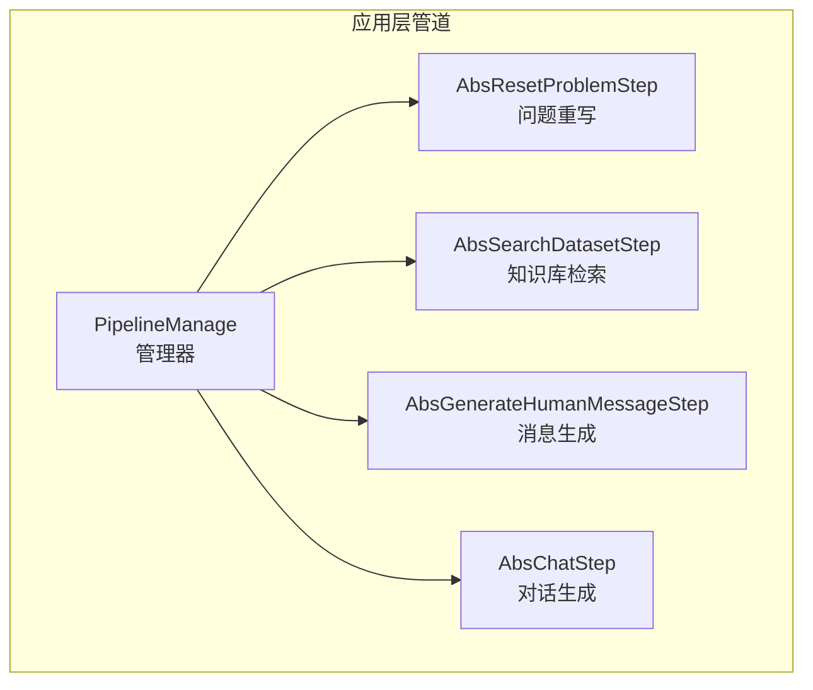
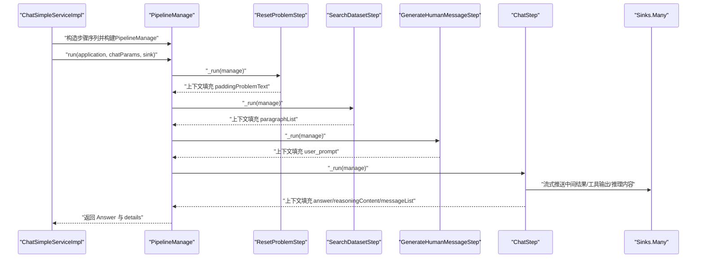
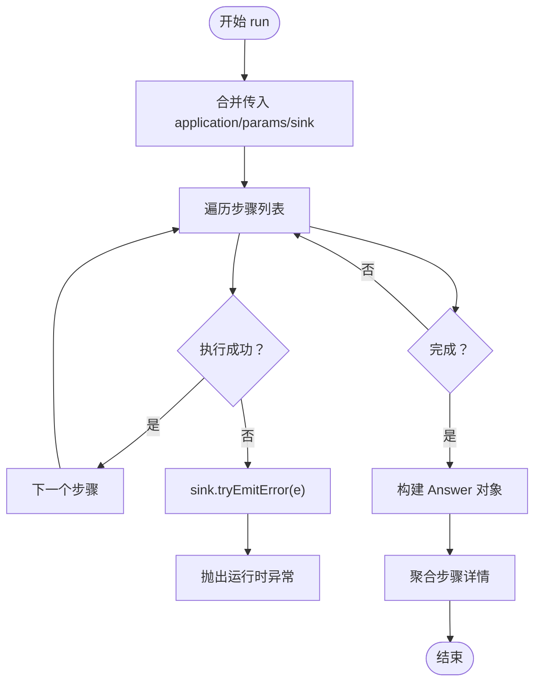
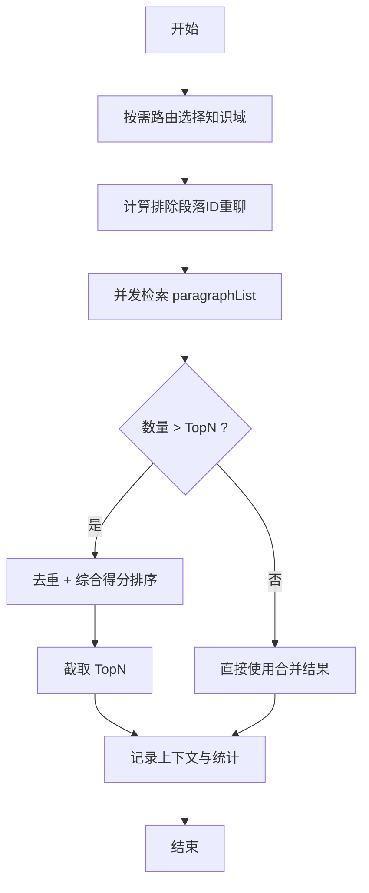
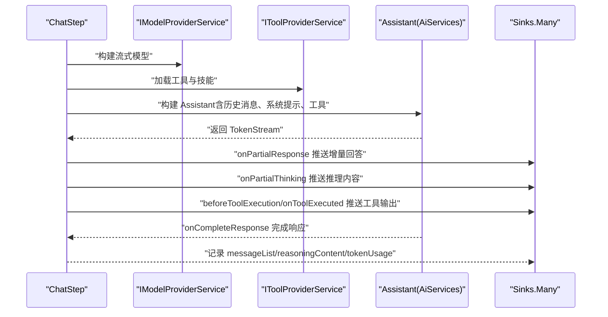
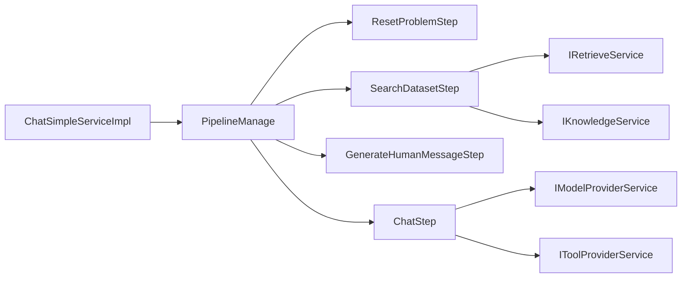

# 管道执行机制

<cite>
**本文引用的文件**
- [PipelineManage.java](file://maxkb4j-service/maxkb4j-application/src/main/java/com/maxkb4j/application/pipeline/PipelineManage.java)
- [AbsStep.java](file://maxkb4j-service/maxkb4j-application/src/main/java/com/maxkb4j/application/pipeline/AbsStep.java)
- [AbsSearchDatasetStep.java](file://maxkb4j-service/maxkb4j-application/src/main/java/com/maxkb4j/application/pipeline/step/searchdatasetstep/AbsSearchDatasetStep.java)
- [SearchDatasetStep.java](file://maxkb4j-service/maxkb4j-application/src/main/java/com/maxkb4j/application/pipeline/step/searchdatasetstep/impl/SearchDatasetStep.java)
- [AbsGenerateHumanMessageStep.java](file://maxkb4j-service/maxkb4j-application/src/main/java/com/maxkb4j/application/pipeline/step/generatehumanmessagestep/AbsGenerateHumanMessageStep.java)
- [GenerateHumanMessageStep.java](file://maxkb4j-service/maxkb4j-application/src/main/java/com/maxkb4j/application/pipeline/step/generatehumanmessagestep/impl/GenerateHumanMessageStep.java)
- [AbsResetProblemStep.java](file://maxkb4j-service/maxkb4j-application/src/main/java/com/maxkb4j/application/pipeline/step/resetproblemstep/AbsResetProblemStep.java)
- [ResetProblemStep.java](file://maxkb4j-service/maxkb4j-application/src/main/java/com/maxkb4j/application/pipeline/step/resetproblemstep/impl/ResetProblemStep.java)
- [AbsChatStep.java](file://maxkb4j-service/maxkb4j-application/src/main/java/com/maxkb4j/application/pipeline/step/chatstep/AbsChatStep.java)
- [ChatStep.java](file://maxkb4j-service/maxkb4j-application/src/main/java/com/maxkb4j/application/pipeline/step/chatstep/impl/ChatStep.java)
- [ChatSimpleServiceImpl.java](file://maxkb4j-service/maxkb4j-application/src/main/java/com/maxkb4j/application/service/impl/ChatSimpleServiceImpl.java)
</cite>

## 目录
1. [简介](#简介)
2. [项目结构](#项目结构)
3. [核心组件](#核心组件)
4. [架构总览](#架构总览)
5. [详细组件分析](#详细组件分析)
6. [依赖关系分析](#依赖关系分析)
7. [性能考量](#性能考量)
8. [故障排查指南](#故障排查指南)
9. [结论](#结论)
10. [附录：使用示例与配置](#附录使用示例与配置)

## 简介
本文件深入解析 MaxKB4j 应用模块中的“管道执行机制”，重点围绕 PipelineManage 的设计与实现，系统阐述各步骤组件的职责分工、依赖关系、数据传递机制以及异常处理策略，并给出可扩展的实践建议。读者将能够理解从问题优化、知识库检索、消息生成到对话生成的完整链路，掌握如何自定义与扩展步骤。

## 项目结构
应用层的管道执行位于 application 子模块中，采用“步骤式流水线”设计，通过 PipelineManage 组织多个 AbsStep 的顺序执行；每个具体步骤封装特定业务逻辑，如问题重写、知识检索、提示词生成、对话生成等。

图表来源
- [PipelineManage.java:24-61](file://maxkb4j-service/maxkb4j-application/src/main/java/com/maxkb4j/application/pipeline/PipelineManage.java#L24-L61)
- [AbsResetProblemStep.java:11-26](file://maxkb4j-service/maxkb4j-application/src/main/java/com/maxkb4j/application/pipeline/step/resetproblemstep/AbsResetProblemStep.java#L11-L26)
- [AbsSearchDatasetStep.java:12-26](file://maxkb4j-service/maxkb4j-application/src/main/java/com/maxkb4j/application/pipeline/step/searchdatasetstep/AbsSearchDatasetStep.java#L12-L26)
- [AbsGenerateHumanMessageStep.java:13-28](file://maxkb4j-service/maxkb4j-application/src/main/java/com/maxkb4j/application/pipeline/step/generatehumanmessagestep/AbsGenerateHumanMessageStep.java#L13-L28)
- [AbsChatStep.java:23-76](file://maxkb4j-service/maxkb4j-application/src/main/java/com/maxkb4j/application/pipeline/step/chatstep/AbsChatStep.java#L23-L76)

章节来源
- [PipelineManage.java:24-61](file://maxkb4j-service/maxkb4j-application/src/main/java/com/maxkb4j/application/pipeline/PipelineManage.java#L24-L61)
- [AbsStep.java:8-21](file://maxkb4j-service/maxkb4j-application/src/main/java/com/maxkb4j/application/pipeline/AbsStep.java#L8-L21)

## 核心组件
- PipelineManage：负责组织步骤列表、维护上下文、驱动执行、汇总结果与细节信息。
- AbsStep 抽象类：统一步骤生命周期（计时、调用内部_run），并要求实现 getDetails 输出步骤详情。
- 各具体步骤：
  - AbsResetProblemStep → ResetProblemStep：根据历史会话与模型对问题进行压缩/改写。
  - AbsSearchDatasetStep → SearchDatasetStep：按知识库配置检索段落，支持按需路由与去重融合。
  - AbsGenerateHumanMessageStep → GenerateHumanMessageStep：基于检索结果与模型参数生成最终用户提示词。
  - AbsChatStep → ChatStep：构建历史消息、流式调用模型生成回答，支持工具执行与推理内容输出。

章节来源
- [PipelineManage.java:24-120](file://maxkb4j-service/maxkb4j-application/src/main/java/com/maxkb4j/application/pipeline/PipelineManage.java#L24-L120)
- [AbsStep.java:8-21](file://maxkb4j-service/maxkb4j-application/src/main/java/com/maxkb4j/application/pipeline/AbsStep.java#L8-L21)
- [AbsResetProblemStep.java:11-26](file://maxkb4j-service/maxkb4j-application/src/main/java/com/maxkb4j/application/pipeline/step/resetproblemstep/AbsResetProblemStep.java#L11-L26)
- [ResetProblemStep.java:22-57](file://maxkb4j-service/maxkb4j-application/src/main/java/com/maxkb4j/application/pipeline/step/resetproblemstep/impl/ResetProblemStep.java#L22-L57)
- [AbsSearchDatasetStep.java:12-26](file://maxkb4j-service/maxkb4j-application/src/main/java/com/maxkb4j/application/pipeline/step/searchdatasetstep/AbsSearchDatasetStep.java#L12-L26)
- [SearchDatasetStep.java:30-118](file://maxkb4j-service/maxkb4j-application/src/main/java/com/maxkb4j/application/pipeline/step/searchdatasetstep/impl/SearchDatasetStep.java#L30-L118)
- [AbsGenerateHumanMessageStep.java:13-28](file://maxkb4j-service/maxkb4j-application/src/main/java/com/maxkb4j/application/pipeline/step/generatehumanmessagestep/AbsGenerateHumanMessageStep.java#L13-L28)
- [GenerateHumanMessageStep.java:15-37](file://maxkb4j-service/maxkb4j-application/src/main/java/com/maxkb4j/application/pipeline/step/generatehumanmessagestep/impl/GenerateHumanMessageStep.java#L15-L37)
- [AbsChatStep.java:23-135](file://maxkb4j-service/maxkb4j-application/src/main/java/com/maxkb4j/application/pipeline/step/chatstep/AbsChatStep.java#L23-L135)
- [ChatStep.java:33-115](file://maxkb4j-service/maxkb4j-application/src/main/java/com/maxkb4j/application/pipeline/step/chatstep/impl/ChatStep.java#L33-L115)

## 架构总览
下图展示一次典型对话的端到端执行流程，从服务层组装步骤，到 PipelineManage 顺序执行，再到各步骤间的数据传递与事件推送。

图表来源
- [ChatSimpleServiceImpl.java:33-50](file://maxkb4j-service/maxkb4j-application/src/main/java/com/maxkb4j/application/service/impl/ChatSimpleServiceImpl.java#L33-L50)
- [PipelineManage.java:39-61](file://maxkb4j-service/maxkb4j-application/src/main/java/com/maxkb4j/application/pipeline/PipelineManage.java#L39-L61)
- [AbsResetProblemStep.java:13-22](file://maxkb4j-service/maxkb4j-application/src/main/java/com/maxkb4j/application/pipeline/step/resetproblemstep/AbsResetProblemStep.java#L13-L22)
- [AbsSearchDatasetStep.java:14-23](file://maxkb4j-service/maxkb4j-application/src/main/java/com/maxkb4j/application/pipeline/step/searchdatasetstep/AbsSearchDatasetStep.java#L14-L23)
- [AbsGenerateHumanMessageStep.java:15-25](file://maxkb4j-service/maxkb4j-application/src/main/java/com/maxkb4j/application/pipeline/step/generatehumanmessagestep/AbsGenerateHumanMessageStep.java#L15-L25)
- [AbsChatStep.java:25-76](file://maxkb4j-service/maxkb4j-application/src/main/java/com/maxkb4j/application/pipeline/step/chatstep/AbsChatStep.java#L25-L76)

## 详细组件分析

### PipelineManage：执行编排与上下文管理
- 职责
  - 维护步骤列表与全局上下文 Map，用于在步骤间传递数据。
  - 驱动步骤顺序执行，捕获异常并通过 Sinks.Many 推送错误。
  - 提供历史消息拼接、排除段落 ID 计算、步骤详情聚合等辅助能力。
- 关键行为
  - run：遍历步骤并调用 step.run(manage)，最后汇总 answer 与 reasoningContent。
  - getHistoryMessages：按应用配置的对话轮数截取历史消息。
  - getExcludeParagraphIds：基于历史聊天记录中的搜索步骤结果，提取已命中段落 ID 以避免重复检索。
  - getDetails：收集每个步骤的 getDetails 结果，按 step_type 聚合。
- Builder 模式：便于按条件动态装配步骤序列。

图表来源
- [PipelineManage.java:39-61](file://maxkb4j-service/maxkb4j-application/src/main/java/com/maxkb4j/application/pipeline/PipelineManage.java#L39-L61)
- [PipelineManage.java:63-94](file://maxkb4j-service/maxkb4j-application/src/main/java/com/maxkb4j/application/pipeline/PipelineManage.java#L63-L94)
- [PipelineManage.java:97-107](file://maxkb4j-service/maxkb4j-application/src/main/java/com/maxkb4j/application/pipeline/PipelineManage.java#L97-L107)

章节来源
- [PipelineManage.java:24-120](file://maxkb4j-service/maxkb4j-application/src/main/java/com/maxkb4j/application/pipeline/PipelineManage.java#L24-L120)

### AbsStep：步骤抽象与计时
- 设计要点
  - run(manage) 统一计时并在完成后记录 runTime。
  - _run(manage) 由子类实现具体逻辑。
  - getDetails() 输出步骤运行状态与指标。
- 作用
  - 规范步骤生命周期，保证每个步骤具备统一的可观测性与可诊断性。

章节来源
- [AbsStep.java:8-21](file://maxkb4j-service/maxkb4j-application/src/main/java/com/maxkb4j/application/pipeline/AbsStep.java#L8-L21)

### ResetProblemStep（问题重写）
- 职责
  - 基于历史消息与模型，对用户问题进行压缩或改写，提升检索质量。
- 数据流
  - 输入：应用模型配置、当前问题、历史消息。
  - 输出：上下文填充 paddingProblemText，同时记录 token 消耗。
- 异常处理
  - 步骤内部异常由 PipelineManage 捕获并上抛。

章节来源
- [AbsResetProblemStep.java:11-26](file://maxkb4j-service/maxkb4j-application/src/main/java/com/maxkb4j/application/pipeline/step/resetproblemstep/AbsResetProblemStep.java#L11-L26)
- [ResetProblemStep.java:22-57](file://maxkb4j-service/maxkb4j-application/src/main/java/com/maxkb4j/application/pipeline/step/resetproblemstep/impl/ResetProblemStep.java#L22-L57)

### SearchDatasetStep（知识库检索）
- 职责
  - 根据知识库 ID 列表与配置进行段落检索；支持按需路由选择知识域；支持二次检索与融合排序；支持重聊时排除历史命中段落。
- 数据流
  - 输入：知识库 ID、应用配置、问题文本、可选的优化问题、重聊标记。
  - 输出：上下文填充 paragraphList、problemText、token 消耗。
- 并发与排序
  - 多任务并发检索并合并，超过 TopN 时按综合得分去重与排序。
- 异常处理
  - 步骤内部异常由 PipelineManage 捕获并上抛。

图表来源
- [SearchDatasetStep.java:36-104](file://maxkb4j-service/maxkb4j-application/src/main/java/com/maxkb4j/application/pipeline/step/searchdatasetstep/impl/SearchDatasetStep.java#L36-L104)

章节来源
- [AbsSearchDatasetStep.java:12-26](file://maxkb4j-service/maxkb4j-application/src/main/java/com/maxkb4j/application/pipeline/step/searchdatasetstep/AbsSearchDatasetStep.java#L12-L26)
- [SearchDatasetStep.java:30-118](file://maxkb4j-service/maxkb4j-application/src/main/java/com/maxkb4j/application/pipeline/step/searchdatasetstep/impl/SearchDatasetStep.java#L30-L118)

### GenerateHumanMessageStep（消息生成）
- 职责
  - 将检索到的段落与问题文本注入到提示词模板中，形成最终用户提示词。
- 数据流
  - 输入：模型参数、知识库配置、问题文本、段落列表。
  - 输出：上下文填充 user_prompt。
- 异常处理
  - 步骤内部异常由 PipelineManage 捕获并上抛。

章节来源
- [AbsGenerateHumanMessageStep.java:13-28](file://maxkb4j-service/maxkb4j-application/src/main/java/com/maxkb4j/application/pipeline/step/generatehumanmessagestep/AbsGenerateHumanMessageStep.java#L13-L28)
- [GenerateHumanMessageStep.java:15-37](file://maxkb4j-service/maxkb4j-application/src/main/java/com/maxkb4j/application/pipeline/step/generatehumanmessagestep/impl/GenerateHumanMessageStep.java#L15-L37)

### ChatStep（对话生成）
- 职责
  - 构建历史消息、流式调用模型生成回答；支持工具链执行与推理内容输出；记录 token 消耗与消息历史。
- 数据流
  - 输入：应用配置、历史消息、用户提示词。
  - 输出：实时流式推送中间结果，最终汇总 answer 与 reasoningContent。
- 异常处理
  - 工具提供异常通过 sink.tryEmitError 上报；模型错误被捕获并完成 Future，以便上层统一处理。

图表来源
- [AbsChatStep.java:25-76](file://maxkb4j-service/maxkb4j-application/src/main/java/com/maxkb4j/application/pipeline/step/chatstep/AbsChatStep.java#L25-L76)
- [ChatStep.java:39-99](file://maxkb4j-service/maxkb4j-application/src/main/java/com/maxkb4j/application/pipeline/step/chatstep/impl/ChatStep.java#L39-L99)

章节来源
- [AbsChatStep.java:23-135](file://maxkb4j-service/maxkb4j-application/src/main/java/com/maxkb4j/application/pipeline/step/chatstep/AbsChatStep.java#L23-L135)
- [ChatStep.java:33-115](file://maxkb4j-service/maxkb4j-application/src/main/java/com/maxkb4j/application/pipeline/step/chatstep/impl/ChatStep.java#L33-L115)

### 步骤注册与装配（服务层）
- ChatSimpleServiceImpl 根据应用配置动态决定是否插入问题重写步骤，然后依次添加检索、消息生成与对话生成步骤，最终交由 PipelineManage 执行。
- 这体现了“按需装配”的设计思想，便于扩展新步骤或调整顺序。

章节来源
- [ChatSimpleServiceImpl.java:33-50](file://maxkb4j-service/maxkb4j-application/src/main/java/com/maxkb4j/application/service/impl/ChatSimpleServiceImpl.java#L33-L50)

## 依赖关系分析
- 组件耦合
  - PipelineManage 仅依赖 AbsStep 接口，通过步骤列表顺序执行，保持高内聚低耦合。
  - 各步骤通过 manage.context 共享数据，避免跨组件强耦合。
- 外部依赖
  - 检索：IRetrieveService、IKnowledgeService。
  - 模型：IModelProviderService（构建 ChatModel/StreamingChatModel）。
  - 工具：IToolProviderService（工具与技能提供）。
- 可能的循环依赖
  - 当前结构为单向依赖（服务层 → 管道 → 步骤），未见循环依赖迹象。

图表来源
- [ChatSimpleServiceImpl.java:26-32](file://maxkb4j-service/maxkb4j-application/src/main/java/com/maxkb4j/application/service/impl/ChatSimpleServiceImpl.java#L26-L32)
- [SearchDatasetStep.java:32-34](file://maxkb4j-service/maxkb4j-application/src/main/java/com/maxkb4j/application/pipeline/step/searchdatasetstep/impl/SearchDatasetStep.java#L32-L34)
- [ChatStep.java:35-36](file://maxkb4j-service/maxkb4j-application/src/main/java/com/maxkb4j/application/pipeline/step/chatstep/impl/ChatStep.java#L35-L36)

## 性能考量
- 并发检索：知识库检索阶段使用多任务并发与合并策略，有助于降低总体延迟。
- 流式输出：对话生成阶段采用流式 TokenStream，边生成边推送，改善用户体验。
- 统计指标：各步骤均记录 runTime、messageTokens、answerTokens，便于性能分析与优化。
- 建议
  - 合理设置 TopN 与融合阈值，避免过多冗余段落影响排序与渲染。
  - 在高并发场景下评估工具链执行开销，必要时异步化工具调用。

## 故障排查指南
- 步骤异常
  - 现象：某一步骤抛出异常导致中断。
  - 处理：PipelineManage 捕获异常并通过 sink.tryEmitError 上报，随后抛出运行时异常终止后续步骤。
  - 建议：在步骤内部做好输入校验与降级处理，确保 getDetails 能输出关键指标辅助定位。
- 工具链异常
  - 现象：工具提供阶段抛出 API 异常。
  - 处理：ChatStep 捕获并上报至 sink，继续完成响应。
  - 建议：完善工具配置与权限校验，减少运行期异常。
- 模型未配置
  - 现象：应用未配置模型 ID。
  - 处理：ChatStep 直接返回提示信息，不触发模型调用。
  - 建议：在前端或服务层增加必填校验与引导。

章节来源
- [PipelineManage.java:50-57](file://maxkb4j-service/maxkb4j-application/src/main/java/com/maxkb4j/application/pipeline/PipelineManage.java#L50-L57)
- [ChatStep.java:52-57](file://maxkb4j-service/maxkb4j-application/src/main/java/com/maxkb4j/application/pipeline/step/chatstep/impl/ChatStep.java#L52-L57)
- [AbsChatStep.java:48-52](file://maxkb4j-service/maxkb4j-application/src/main/java/com/maxkb4j/application/pipeline/step/chatstep/AbsChatStep.java#L48-L52)

## 结论
该管道执行机制以 PipelineManage 为核心，通过 AbsStep 抽象与 Builder 装配，实现了清晰的职责划分与可扩展的步骤链路。各步骤围绕上下文共享数据，结合并发检索与流式对话，兼顾了性能与体验。异常处理策略明确，细节聚合便于诊断。建议在实际部署中关注 TopN 与工具链开销，并完善配置校验与降级策略。

## 附录：使用示例与配置
- 使用示例（思路）
  - 服务层通过 ChatSimpleServiceImpl 组装步骤序列：根据应用配置决定是否启用问题重写；无论是否配置知识库，均需消息生成与对话生成步骤。
  - 调用 PipelineManage.run 后，从 sink 实时接收流式输出，最终获得 Answer 与 details。
- 配置选项（关键项）
  - 问题优化开关：控制是否插入 ResetProblemStep。
  - 对话轮数：影响历史消息截取长度。
  - 知识库 TopN 与融合策略：影响检索结果规模与质量。
  - 模型参数与系统提示：影响对话生成质量与风格。
  - 工具启用与输出：控制工具链执行与输出展示。
- 自定义与扩展
  - 新增步骤：继承 AbsStep，实现 _run 与 getDetails；在服务层通过 Builder.addStep 注册。
  - 修改顺序：在服务层调整步骤添加顺序即可。
  - 依赖注入：通过 Spring 容器自动注入所需服务（检索、模型、工具）。

章节来源
- [ChatSimpleServiceImpl.java:33-50](file://maxkb4j-service/maxkb4j-application/src/main/java/com/maxkb4j/application/service/impl/ChatSimpleServiceImpl.java#L33-L50)
- [PipelineManage.java:109-119](file://maxkb4j-service/maxkb4j-application/src/main/java/com/maxkb4j/application/pipeline/PipelineManage.java#L109-L119)