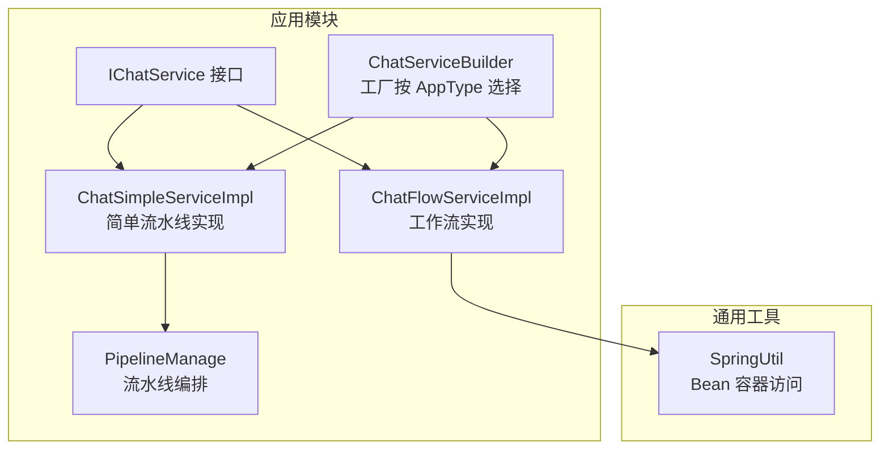
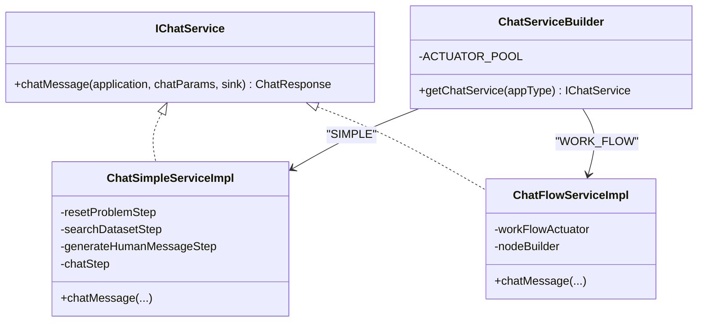
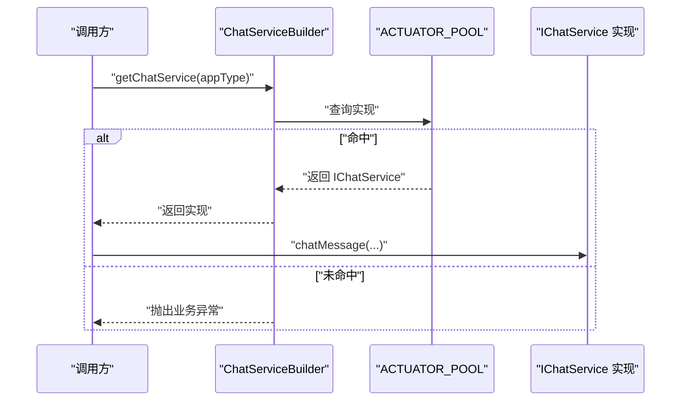
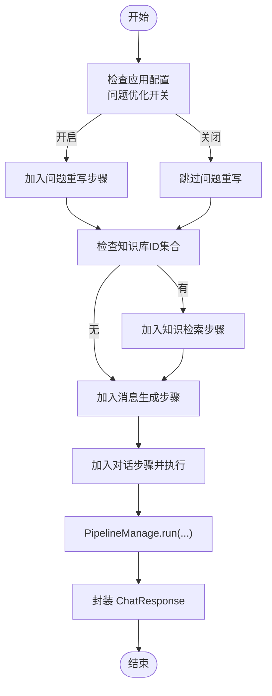
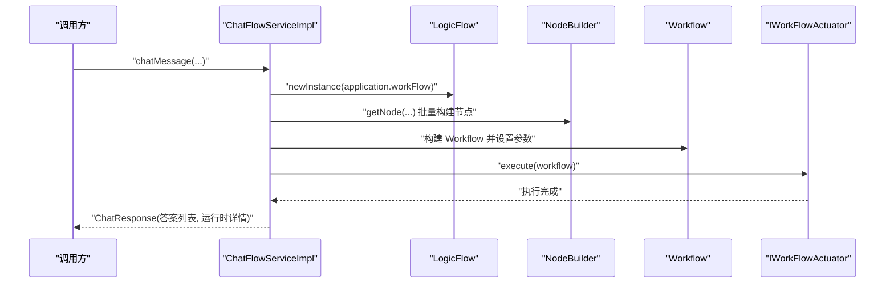
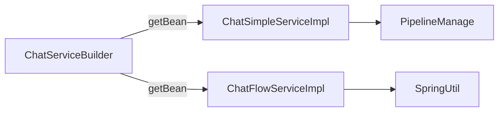

# 聊天服务架构

<cite>
**本文引用的文件**
- [ChatServiceBuilder.java](file://maxkb4j-service/maxkb4j-application/src/main/java/com/maxkb4j/application/builder/ChatServiceBuilder.java)
- [AppType.java](file://maxkb4j-service/maxkb4j-application/src/main/java/com/maxkb4j/application/enums/AppType.java)
- [IChatService.java](file://maxkb4j-service-api/maxkb4j-application-api/src/main/java/com/maxkb4j/application/service/IChatService.java)
- [ChatSimpleServiceImpl.java](file://maxkb4j-service/maxkb4j-application/src/main/java/com/maxkb4j/application/service/impl/ChatSimpleServiceImpl.java)
- [ChatFlowServiceImpl.java](file://maxkb4j-service/maxkb4j-application/src/main/java/com/maxkb4j/application/service/impl/ChatFlowServiceImpl.java)
- [PipelineManage.java](file://maxkb4j-service/maxkb4j-application/src/main/java/com/maxkb4j/application/pipeline/PipelineManage.java)
- [SpringUtil.java](file://maxkb4j-common/src/main/java/com/maxkb4j/common/util/SpringUtil.java)
- [ApplicationChatController.java](file://maxkb4j-service/maxkb4j-application/src/main/java/com/maxkb4j/application/controller/ApplicationChatController.java)
</cite>

## 目录
1. [引言](#引言)
2. [项目结构](#项目结构)
3. [核心组件](#核心组件)
4. [架构总览](#架构总览)
5. [详细组件分析](#详细组件分析)
6. [依赖分析](#依赖分析)
7. [性能考虑](#性能考虑)
8. [故障排查指南](#故障排查指南)
9. [结论](#结论)
10. [附录：使用示例与最佳实践](#附录使用示例与最佳实践)

## 引言
本文件系统性阐述 MaxKB4j 聊天服务的整体架构设计，重点解析 ChatServiceBuilder 工厂模式的实现原理与使用方法；对比简单聊天服务（ChatSimpleServiceImpl）与工作流聊天服务（ChatFlowServiceImpl）在流程、能力与适用场景上的差异；说明聊天服务的生命周期管理、资源分配与性能优化策略；并提供可直接参考的初始化与使用示例路径、异常处理与最佳实践。

## 项目结构
聊天服务位于 application 模块中，采用“接口 + 多实现 + 工厂”的分层组织方式：
- 接口层：IChatService 定义统一聊天入口
- 实现层：ChatSimpleServiceImpl（简单流水线）、ChatFlowServiceImpl（工作流）
- 工厂层：ChatServiceBuilder 基于 AppType 选择具体实现
- 运行时支撑：PipelineManage 流水线编排、SpringUtil 提供 Bean 获取能力

图表来源
- [IChatService.java:1-13](file://maxkb4j-service-api/maxkb4j-application-api/src/main/java/com/maxkb4j/application/service/IChatService.java#L1-L13)
- [ChatSimpleServiceImpl.java:1-54](file://maxkb4j-service/maxkb4j-application/src/main/java/com/maxkb4j/application/service/impl/ChatSimpleServiceImpl.java#L1-L54)
- [ChatFlowServiceImpl.java:1-45](file://maxkb4j-service/maxkb4j-application/src/main/java/com/maxkb4j/application/service/impl/ChatFlowServiceImpl.java#L1-L45)
- [ChatServiceBuilder.java:1-38](file://maxkb4j-service/maxkb4j-application/src/main/java/com/maxkb4j/application/builder/ChatServiceBuilder.java#L1-L38)
- [PipelineManage.java:1-122](file://maxkb4j-service/maxkb4j-application/src/main/java/com/maxkb4j/application/pipeline/PipelineManage.java#L1-L122)
- [SpringUtil.java:1-73](file://maxkb4j-common/src/main/java/com/maxkb4j/common/util/SpringUtil.java#L1-L73)

章节来源
- [ChatServiceBuilder.java:14-38](file://maxkb4j-service/maxkb4j-application/src/main/java/com/maxkb4j/application/builder/ChatServiceBuilder.java#L14-L38)
- [AppType.java:1-10](file://maxkb4j-service/maxkb4j-application/src/main/java/com/maxkb4j/application/enums/AppType.java#L1-L10)
- [IChatService.java:9-12](file://maxkb4j-service-api/maxkb4j-application-api/src/main/java/com/maxkb4j/application/service/IChatService.java#L9-L12)

## 核心组件
- IChatService：定义统一聊天入口，接收 ApplicationVO、ChatParams、Sinks.Many<ChatMessageVO>，返回 ChatResponse
- ChatSimpleServiceImpl：基于 PipelineManage 的简单流水线，按应用配置动态拼装步骤（问题优化、检索、消息生成、LLM 对话）
- ChatFlowServiceImpl：基于工作流引擎的实现，将逻辑图转换为节点列表执行，支持复杂分支与状态流转
- ChatServiceBuilder：静态工厂，通过 AppType 从 Spring 上下文获取对应实现，内置 SIMPLE 与 WORK_FLOW 两种实现
- PipelineManage：流水线编排器，负责步骤执行、上下文传递、运行时详情收集与历史消息构造
- SpringUtil：提供静态方法从 ApplicationContext 获取 Bean，用于工厂初始化与运行时 Bean 访问

章节来源
- [IChatService.java:9-12](file://maxkb4j-service-api/maxkb4j-application-api/src/main/java/com/maxkb4j/application/service/IChatService.java#L9-L12)
- [ChatSimpleServiceImpl.java:26-54](file://maxkb4j-service/maxkb4j-application/src/main/java/com/maxkb4j/application/service/impl/ChatSimpleServiceImpl.java#L26-L54)
- [ChatFlowServiceImpl.java:25-45](file://maxkb4j-service/maxkb4j-application/src/main/java/com/maxkb4j/application/service/impl/ChatFlowServiceImpl.java#L25-L45)
- [ChatServiceBuilder.java:14-38](file://maxkb4j-service/maxkb4j-application/src/main/java/com/maxkb4j/application/builder/ChatServiceBuilder.java#L14-L38)
- [PipelineManage.java:24-122](file://maxkb4j-service/maxkb4j-application/src/main/java/com/maxkb4j/application/pipeline/PipelineManage.java#L24-L122)
- [SpringUtil.java:18-73](file://maxkb4j-common/src/main/java/com/maxkb4j/common/util/SpringUtil.java#L18-L73)

## 架构总览
聊天服务采用“接口抽象 + 工厂选择 + 双实现并存”的架构：
- 工厂根据 AppType 决策调用哪个实现
- 简单实现以步骤流水线串联各能力
- 工作流实现以逻辑图驱动节点执行
- 两者均通过统一接口对外提供聊天能力

图表来源
- [IChatService.java:9-12](file://maxkb4j-service-api/maxkb4j-application-api/src/main/java/com/maxkb4j/application/service/IChatService.java#L9-L12)
- [ChatSimpleServiceImpl.java:26-54](file://maxkb4j-service/maxkb4j-application/src/main/java/com/maxkb4j/application/service/impl/ChatSimpleServiceImpl.java#L26-L54)
- [ChatFlowServiceImpl.java:25-45](file://maxkb4j-service/maxkb4j-application/src/main/java/com/maxkb4j/application/service/impl/ChatFlowServiceImpl.java#L25-L45)
- [ChatServiceBuilder.java:14-38](file://maxkb4j-service/maxkb4j-application/src/main/java/com/maxkb4j/application/builder/ChatServiceBuilder.java#L14-L38)

## 详细组件分析

### ChatServiceBuilder 工厂模式
- 设计要点
  - 使用静态常量池缓存已创建的 IChatService 实例，避免重复获取 Bean
  - 初始化阶段通过 SpringUtil.getBean 注入 SIMPLE 与 WORK_FLOW 对应实现
  - 提供 getChatService(appType) 方法，按传入字符串键值获取对应实现
  - 若未找到匹配键，抛出业务异常，便于上层明确错误原因
- 生命周期
  - 静态初始化块在类加载时完成，确保后续调用无需再次扫描容器
  - 实例复用，减少 Spring 容器查找开销
- 使用建议
  - appType 建议使用 AppType 枚举的名称字符串，保证健壮性
  - 在多实例部署或热切换场景，需关注静态池是否需要刷新策略

图表来源
- [ChatServiceBuilder.java:18-36](file://maxkb4j-service/maxkb4j-application/src/main/java/com/maxkb4j/application/builder/ChatServiceBuilder.java#L18-L36)
- [SpringUtil.java:32-34](file://maxkb4j-common/src/main/java/com/maxkb4j/common/util/SpringUtil.java#L32-L34)

章节来源
- [ChatServiceBuilder.java:14-38](file://maxkb4j-service/maxkb4j-application/src/main/java/com/maxkb4j/application/builder/ChatServiceBuilder.java#L14-L38)
- [SpringUtil.java:18-73](file://maxkb4j-common/src/main/java/com/maxkb4j/common/util/SpringUtil.java#L18-L73)

### AppType 枚举与应用类型选择机制
- 枚举定义了 SIMPLE 与 WORK_FLOW 两类应用类型
- ChatServiceBuilder 以枚举名作为键，绑定到对应实现 Bean
- 控制层或业务层在调用前需确定应用类型，确保工厂能正确返回实现

章节来源
- [AppType.java:3-9](file://maxkb4j-service/maxkb4j-application/src/main/java/com/maxkb4j/application/enums/AppType.java#L3-L9)
- [ChatServiceBuilder.java:18-21](file://maxkb4j-service/maxkb4j-application/src/main/java/com/maxkb4j/application/builder/ChatServiceBuilder.java#L18-L21)

### ChatSimpleServiceImpl（简单聊天服务）
- 流程特征
  - 动态构建 PipelineManage：根据应用配置决定是否启用问题优化与知识检索
  - 固定顺序：问题优化 → 检索 → 人类消息生成 → 对话步骤
  - 生成 ChatResponse，包含答案列表与运行时详情
- 适用场景
  - 结构化问答、知识库增强对话
  - 对流程可控、步骤清晰的场景
- 性能与资源
  - 步骤串行执行，适合中小规模并发
  - 通过 PipelineManage 统一上下文与运行时统计

图表来源
- [ChatSimpleServiceImpl.java:33-50](file://maxkb4j-service/maxkb4j-application/src/main/java/com/maxkb4j/application/service/impl/ChatSimpleServiceImpl.java#L33-L50)
- [PipelineManage.java:39-61](file://maxkb4j-service/maxkb4j-application/src/main/java/com/maxkb4j/application/pipeline/PipelineManage.java#L39-L61)

章节来源
- [ChatSimpleServiceImpl.java:26-54](file://maxkb4j-service/maxkb4j-application/src/main/java/com/maxkb4j/application/service/impl/ChatSimpleServiceImpl.java#L26-L54)
- [PipelineManage.java:24-122](file://maxkb4j-service/maxkb4j-application/src/main/java/com/maxkb4j/application/pipeline/PipelineManage.java#L24-L122)

### ChatFlowServiceImpl（工作流聊天服务）
- 流程特征
  - 将应用中的逻辑图转换为节点集合，交由工作流执行器执行
  - 支持复杂分支、条件判断与节点间数据传递
  - 返回 ChatResponse，包含答案列表与运行时详情
- 适用场景
  - 需要复杂交互、多节点协作、条件分流的智能体或代理
- 性能与资源
  - 工作流执行器负责调度与并发控制，适合高复杂度流程
  - 注意节点数量与边关系对内存与 CPU 的影响

图表来源
- [ChatFlowServiceImpl.java:30-43](file://maxkb4j-service/maxkb4j-application/src/main/java/com/maxkb4j/application/service/impl/ChatFlowServiceImpl.java#L30-L43)

章节来源
- [ChatFlowServiceImpl.java:25-45](file://maxkb4j-service/maxkb4j-application/src/main/java/com/maxkb4j/application/service/impl/ChatFlowServiceImpl.java#L25-L45)

### IChatService 接口与统一契约
- 统一输入：ApplicationVO（应用上下文）、ChatParams（请求参数）、Sinks.Many<ChatMessageVO>（事件流）
- 统一输出：ChatResponse（答案列表、运行时详情）
- 该接口屏蔽了 SIMPLE 与 WORK_FLOW 的内部差异，便于上层解耦

章节来源
- [IChatService.java:9-12](file://maxkb4j-service-api/maxkb4j-application-api/src/main/java/com/maxkb4j/application/service/IChatService.java#L9-L12)

### PipelineManage（简单实现的流水线编排）
- 职责
  - 维护步骤列表与上下文 Map
  - 顺序执行各步骤，捕获异常并通过 Sinks 发出错误
  - 收集各步骤运行时详情，汇总为响应级详情
  - 提供历史消息构造与排除段落 ID 的辅助能力
- 复杂度
  - 执行时间复杂度近似 O(N)，N 为步骤数
  - 上下文 Map 为轻量级对象，空间开销低

章节来源
- [PipelineManage.java:24-122](file://maxkb4j-service/maxkb4j-application/src/main/java/com/maxkb4j/application/pipeline/PipelineManage.java#L24-L122)

## 依赖分析
- 组件内聚与耦合
  - ChatSimpleServiceImpl 与 PipelineManage 高内聚，通过步骤接口解耦具体能力
  - ChatFlowServiceImpl 与工作流生态解耦，仅依赖 IWorkFlowActuator 与 NodeBuilder
  - ChatServiceBuilder 与具体实现弱耦合，仅依赖接口与 SpringUtil
- 外部依赖
  - SpringUtil 提供静态 Bean 访问能力，简化工厂初始化
  - Reactor Sinks 用于事件式消息推送

图表来源
- [ChatServiceBuilder.java:18-21](file://maxkb4j-service/maxkb4j-application/src/main/java/com/maxkb4j/application/builder/ChatServiceBuilder.java#L18-L21)
- [ChatSimpleServiceImpl.java:28-31](file://maxkb4j-service/maxkb4j-application/src/main/java/com/maxkb4j/application/service/impl/ChatSimpleServiceImpl.java#L28-L31)
- [ChatFlowServiceImpl.java:27-28](file://maxkb4j-service/maxkb4j-application/src/main/java/com/maxkb4j/application/service/impl/ChatFlowServiceImpl.java#L27-L28)
- [SpringUtil.java:32-34](file://maxkb4j-common/src/main/java/com/maxkb4j/common/util/SpringUtil.java#L32-L34)

章节来源
- [ChatServiceBuilder.java:14-38](file://maxkb4j-service/maxkb4j-application/src/main/java/com/maxkb4j/application/builder/ChatServiceBuilder.java#L14-L38)
- [ChatSimpleServiceImpl.java:26-54](file://maxkb4j-service/maxkb4j-application/src/main/java/com/maxkb4j/application/service/impl/ChatSimpleServiceImpl.java#L26-L54)
- [ChatFlowServiceImpl.java:25-45](file://maxkb4j-service/maxkb4j-application/src/main/java/com/maxkb4j/application/service/impl/ChatFlowServiceImpl.java#L25-L45)
- [SpringUtil.java:18-73](file://maxkb4j-common/src/main/java/com/maxkb4j/common/util/SpringUtil.java#L18-L73)

## 性能考虑
- 工厂缓存
  - ChatServiceBuilder 使用静态常量池缓存实现，避免重复从 Spring 获取 Bean，降低启动与调用延迟
- 简单实现
  - PipelineManage 步骤串行，适合中小并发；可通过合理拆分步骤与异步化部分环节提升吞吐
- 工作流实现
  - 工作流执行器承担调度与并发，适合复杂流程；注意节点数量与边关系，避免过度复杂导致内存与 CPU 压力
- 事件推送
  - 使用 Sinks.Many 实现增量消息推送，建议在上层做好背压与缓冲区管理

## 故障排查指南
- 常见异常
  - 未找到应用类型：工厂根据 appType 查询失败时抛出业务异常，检查传入字符串是否与 AppType 名称一致
  - 步骤执行异常：PipelineManage 在执行步骤时捕获异常并通过 Sinks.tryEmitError 发出，上层应监听并记录
- 排查步骤
  - 确认 AppType 与工厂键一致
  - 检查应用配置（如问题优化、知识库 ID 列表）是否正确
  - 关注 Sinks 事件流是否被消费端阻塞
- 监控点
  - 运行时详情（details）可用于定位具体步骤耗时与失败原因

章节来源
- [ChatServiceBuilder.java:30-36](file://maxkb4j-service/maxkb4j-application/src/main/java/com/maxkb4j/application/builder/ChatServiceBuilder.java#L30-L36)
- [PipelineManage.java:49-57](file://maxkb4j-service/maxkb4j-application/src/main/java/com/maxkb4j/application/pipeline/PipelineManage.java#L49-L57)

## 结论
本架构通过“接口 + 工厂 + 双实现”的组合，实现了聊天服务的高扩展与低耦合。简单实现适合结构化问答与知识增强对话，工作流实现适合复杂交互与条件分流。工厂模式确保了类型选择的一致性与性能稳定性；流水线与工作流分别满足不同复杂度场景。结合事件式消息推送与运行时详情，系统具备良好的可观测性与可维护性。

## 附录：使用示例与最佳实践
以下示例提供可参考的调用路径与注意事项，不直接展示代码内容：

- 初始化与选择实现
  - 通过 ChatServiceBuilder.getChatService(AppType.SIMPLE.name()) 或 AppType.WORK_FLOW.name() 获取对应 IChatService 实例
  - 确保应用类型与实际配置一致，避免工厂返回空并触发异常
  - 参考路径：[ChatServiceBuilder.java:29-36](file://maxkb4j-service/maxkb4j-application/src/main/java/com/maxkb4j/application/builder/ChatServiceBuilder.java#L29-L36)

- 统一调用入口
  - 调用 IChatService.chatMessage(application, chatParams, sink) 获取 ChatResponse
  - 保持参数一致性：ApplicationVO、ChatParams、Sinks.Many<ChatMessageVO>
  - 参考路径：[IChatService.java:11](file://maxkb4j-service-api/maxkb4j-application-api/src/main/java/com/maxkb4j/application/service/IChatService.java#L11)

- 简单实现调用链
  - ChatSimpleServiceImpl 内部构建 PipelineManage，按配置添加步骤后执行
  - 建议在上层监听 Sinks 事件，实时渲染对话
  - 参考路径：[ChatSimpleServiceImpl.java:34-50](file://maxkb4j-service/maxkb4j-application/src/main/java/com/maxkb4j/application/service/impl/ChatSimpleServiceImpl.java#L34-L50)

- 工作流实现调用链
  - ChatFlowServiceImpl 将逻辑图转为节点集合，构建 Workflow 后交由执行器执行
  - 建议在复杂流程中利用运行时详情定位瓶颈
  - 参考路径：[ChatFlowServiceImpl.java:31-43](file://maxkb4j-service/maxkb4j-application/src/main/java/com/maxkb4j/application/service/impl/ChatFlowServiceImpl.java#L31-L43)

- 异常处理与最佳实践
  - 监听 Sinks.tryEmitError，记录异常并反馈给前端
  - 对于 SIMPLE 实现，合理配置问题优化与知识库检索，避免无效步骤
  - 对于 WORK_FLOW 实现，控制节点数量与边关系，避免过度复杂
  - 参考路径：[PipelineManage.java:52-57](file://maxkb4j-service/maxkb4j-application/src/main/java/com/maxkb4j/application/pipeline/PipelineManage.java#L52-L57)

- 会话管理与导出（参考）
  - 控制层提供会话更新、删除、分页查询与导出等能力，便于运营与审计
  - 参考路径：[ApplicationChatController.java:35-58](file://maxkb4j-service/maxkb4j-application/src/main/java/com/maxkb4j/application/controller/ApplicationChatController.java#L35-L58)